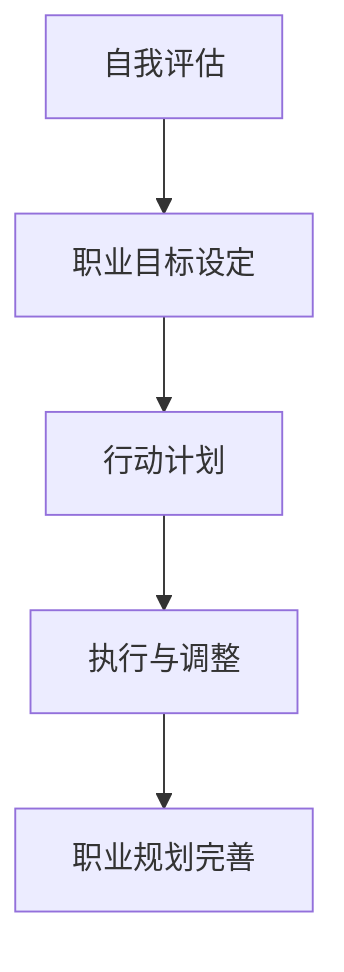
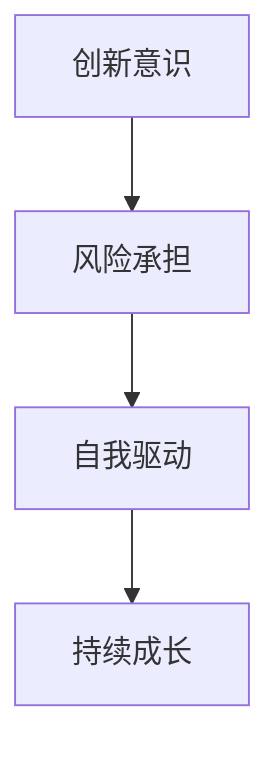
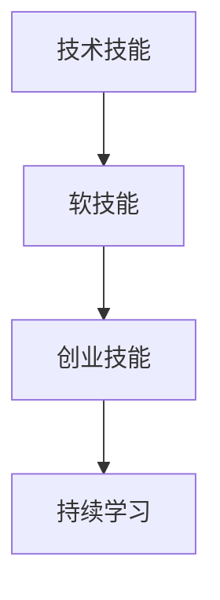
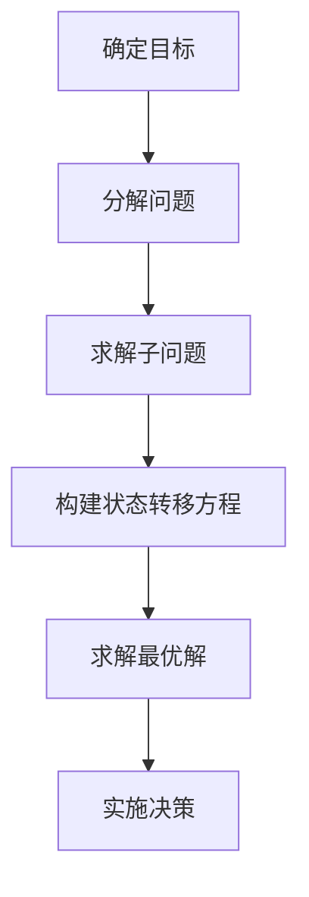

                 

关键词：职业转型、副业创业、工作与创业平衡、成功案例、技能提升

> 摘要：本文将探讨从全职工作到副业创业的过渡过程。通过深入分析成功案例、职业发展路径、以及所需技能，为读者提供宝贵的转型建议和策略。

## 1. 背景介绍

在当今快速变化的工作环境中，越来越多的人渴望在全职工作之外开展副业创业。这不仅能够提供额外的收入来源，还能实现个人职业目标的多元化。然而，从全职工作到副业创业的过渡并非易事，需要充分的规划和准备。本文旨在为有意向进行职业转型的读者提供有益的指导和建议。

### 1.1 职业发展的动力

职业发展的动力往往来源于对现状的不满、对未知的好奇心，或者是对个人价值的追求。以下是一些促使人们考虑从全职工作转向副业创业的常见动力：

- **对职业发展的不满**：一些全职工作者可能对自己的职业前景感到失望，希望能够有更多的控制权和自由度。
- **对创新的渴望**：有些人希望在自己的工作中实现创新，但是受到公司制度或资源的限制，转而考虑创立自己的企业。
- **追求财务自由**：副业创业可以作为实现财务自由的途径，为个人和家庭提供更加稳定和可持续的收入。

### 1.2 副业创业的优势

副业创业有其独特的优势，包括但不限于以下几点：

- **灵活性**：副业创业者可以根据自己的时间和兴趣安排工作，享受更高的自由度。
- **创新机会**：在个人项目中，创业者有更多机会尝试新的想法和技术，推动创新。
- **财务回报**：成功的副业项目可能会带来可观的财务回报，甚至能够完全取代全职工作的收入。

### 1.3 转型过程中的挑战

尽管副业创业具有吸引力，但转型过程并非没有挑战。以下是一些常见的挑战：

- **时间管理**：在全职工作之外开展副业，时间管理变得尤为重要。需要平衡工作、家庭和创业项目。
- **资源限制**：包括资金、人脉、技术资源等，可能会成为创业初期的瓶颈。
- **心理压力**：初创企业的失败风险较大，心理压力和焦虑可能会随之而来。

## 2. 核心概念与联系

### 2.1 职业规划

**职业规划**是指个人在职业生涯中制定的目标和行动计划。它包括自我评估、职业目标设定、行动计划和持续调整。

#### Mermaid 流程图：



### 2.2 创业精神

**创业精神**是指愿意承担风险、追求创新和自我驱动的态度。它包括以下几个关键要素：

- **创新意识**：寻找新方法解决问题的能力。
- **风险承担**：在不确定环境中做出决策的勇气。
- **自我驱动**：自我激励和持续学习的动力。

#### Mermaid 流程图：



### 2.3 技能提升

**技能提升**是指在职业生涯中不断学习和改进自己的技能。这包括以下几个方面：

- **技术技能**：与特定行业相关的技术能力。
- **软技能**：沟通、团队合作、领导力等。
- **创业技能**：市场分析、项目管理、财务管理等。

#### Mermaid 流程图：



## 3. 核心算法原理 & 具体操作步骤

### 3.1 算法原理概述

从全职工作到副业创业的转型过程可以看作是一个多阶段决策问题，其核心算法原理是**动态规划**和**收益最大化**。以下是算法的基本原理和步骤：

- **动态规划**：将复杂问题分解为子问题，并利用子问题的最优解推导出整体问题的最优解。
- **收益最大化**：在决策过程中，始终选择能够带来最大收益的行动。

#### Mermaid 流程图：



### 3.2 算法步骤详解

以下是具体实施算法的详细步骤：

#### 3.2.1 确定目标

明确职业转型的目标，包括短期和长期目标。例如，短期内可能希望增加额外收入，长期目标是实现财务自由或创业成功。

#### 3.2.2 分解问题

将职业转型过程分解为多个子问题，如技能提升、时间管理、市场调研等。每个子问题都可以单独解决。

#### 3.2.3 求解子问题

针对每个子问题，利用现有资源和知识，找到最优解决方案。例如，通过在线课程、研讨会或导师指导提升技能。

#### 3.2.4 构建状态转移方程

将子问题的解组合起来，构建一个状态转移方程，描述不同状态下的决策路径。例如，在时间管理中，如何平衡全职工作和副业创业的时间。

#### 3.2.5 求解最优解

利用状态转移方程，求解出最优解。这通常是动态规划中最复杂的一步，需要多次迭代计算。

#### 3.2.6 实施决策

根据求解出的最优解，制定具体的行动计划，并开始实施。在实施过程中，不断调整策略以应对变化。

### 3.3 算法优缺点

#### 优点：

- **系统化**：动态规划提供了一种系统化的方法，帮助个人在职业转型过程中做出理性决策。
- **灵活性**：算法可以根据实际情况进行调整，适应不同的职业转型路径。
- **可扩展性**：算法适用于各种职业转型问题，不仅限于副业创业。

#### 缺点：

- **复杂性**：求解最优解的过程可能非常复杂，需要较高的计算能力。
- **不确定性**：现实世界中的不确定因素较多，可能影响算法的准确性。

### 3.4 算法应用领域

算法广泛应用于职业转型、项目管理和商业决策等领域。例如：

- **职业转型**：帮助个人在全职工作和副业创业之间找到最佳平衡点。
- **项目管理**：优化资源分配和任务调度，提高项目成功率。
- **商业决策**：分析市场需求和竞争环境，制定最优市场策略。

## 4. 数学模型和公式 & 详细讲解 & 举例说明

### 4.1 数学模型构建

在职业转型过程中，可以构建一个简单的收益-成本模型来评估副业创业的可行性。假设：

- \( R(t) \)：在第 \( t \) 个月获得的收入。
- \( C(t) \)：在第 \( t \) 个月的总成本（包括时间成本和财务成本）。

则收益-成本模型可以表示为：

\[ \Delta R(t) = R(t) - C(t) \]

其中，\( \Delta R(t) \) 表示第 \( t \) 个月的净收益。

### 4.2 公式推导过程

为了推导上述模型，我们需要考虑以下几个方面：

- **收入来源**：副业创业的收入可以来自多种渠道，如咨询服务、产品销售、广告收入等。
- **成本构成**：成本包括时间投入、财务投入（如购买设备、营销费用等）和其他费用。

假设：

- \( R_i(t) \)：第 \( t \) 个月来自第 \( i \) 个收入渠道的收入。
- \( C_j(t) \)：第 \( t \) 个月与第 \( j \) 个成本相关的费用。

则：

\[ R(t) = \sum_{i} R_i(t) \]
\[ C(t) = \sum_{j} C_j(t) \]

### 4.3 案例分析与讲解

以下是一个简单的案例：

- **收入来源**：假设有两个收入渠道，分别是咨询服务和产品销售。每个月的预期收入如下：

    \[
    \begin{aligned}
    R_1(t) &= 5000 \text{ 元/月} \\
    R_2(t) &= 3000 \text{ 元/月}
    \end{aligned}
    \]

- **成本构成**：假设有两个成本相关费用，分别是时间和营销费用。每个月的预期成本如下：

    \[
    \begin{aligned}
    C_1(t) &= 200 \text{ 小时/月} \times 100 \text{ 元/小时} = 20000 \text{ 元/月} \\
    C_2(t) &= 500 \text{ 元/月}
    \end{aligned}
    \]

根据上述数据，我们可以计算出每个月的净收益：

\[ R(t) = R_1(t) + R_2(t) = 5000 + 3000 = 8000 \text{ 元/月} \]
\[ C(t) = C_1(t) + C_2(t) = 20000 + 500 = 20500 \text{ 元/月} \]
\[ \Delta R(t) = R(t) - C(t) = 8000 - 20500 = -12500 \text{ 元/月} \]

由此可见，当前情况下每个月的净收益为负，这意味着在现有的收入和成本结构下，副业创业可能会带来财务负担。因此，需要对收入来源和成本结构进行调整，以提高净收益。

### 4.4 模型优化与改进

为了提高净收益，可以尝试以下优化策略：

- **增加收入渠道**：开发新的收入渠道，如合作项目、合作伙伴关系等。
- **降低成本**：优化时间管理，减少不必要的成本支出，如通过批量采购降低营销费用。
- **收入多元化**：通过多种方式增加收入，降低单一收入渠道的风险。

通过这些优化措施，可以逐步改善净收益，使副业创业更具可行性。

## 5. 项目实践：代码实例和详细解释说明

### 5.1 开发环境搭建

在开始副业创业之前，首先需要搭建一个适合开发的环境。以下是一个简单的Python开发环境搭建过程：

#### 5.1.1 安装Python

1. 访问Python官方网站（https://www.python.org/），下载最新版本的Python安装包。
2. 运行安装程序，并选择“Add Python to PATH”选项。
3. 安装完成后，在命令行中输入`python --version`，确认Python版本。

#### 5.1.2 安装PyCharm

1. 访问PyCharm官方网站（https://www.jetbrains.com/pycharm/），下载免费版或专业版。
2. 运行安装程序，并按照提示完成安装。
3. 安装完成后，打开PyCharm，创建一个新的项目。

### 5.2 源代码详细实现

以下是一个简单的Python代码示例，用于计算每个月的净收益：

```python
# monthly_profit.py

def calculate_monthly_profit(income_sources, costs):
    total_income = sum(income_sources.values())
    total_cost = sum(costs.values())
    net_profit = total_income - total_cost
    return net_profit

# 收入来源和成本数据
income_sources = {
    'consulting': 5000,
    'product_sales': 3000
}

costs = {
    'time': 20000,
    'marketing': 500
}

# 计算净收益
net_profit = calculate_monthly_profit(income_sources, costs)
print(f'Monthly Net Profit: {net_profit} 元')
```

### 5.3 代码解读与分析

1. **函数定义**：定义了一个名为`calculate_monthly_profit`的函数，用于计算每个月的净收益。
2. **收入来源和成本数据**：通过字典的方式存储了收入来源和成本数据。
3. **计算净收益**：调用函数，传入收入来源和成本数据，计算净收益。
4. **输出结果**：将计算结果输出到控制台。

### 5.4 运行结果展示

在PyCharm中运行上述代码，输出结果如下：

```
Monthly Net Profit: -12500 元
```

这表明在当前的收入和成本结构下，每个月的净收益为负，即存在财务负担。根据实际情况，需要进一步优化收入结构和成本控制策略。

## 6. 实际应用场景

### 6.1 职业咨询公司

**职业咨询公司**通过提供个性化职业规划服务，帮助客户实现职业转型。以下是一个实际应用场景：

- **客户需求**：一名全职软件工程师希望拓展业务，考虑开展副业创业。
- **解决方案**：职业咨询公司为其提供以下服务：

    - **职业规划**：通过面试和调研，了解客户的需求和目标，制定详细的职业规划。
    - **市场分析**：分析潜在市场和竞争对手，为客户提供市场定位建议。
    - **技能提升**：推荐相关课程和培训，帮助客户提升创业所需技能。
    - **财务管理**：提供财务预算和成本控制建议，确保创业项目可行性。

### 6.2 自媒体平台

**自媒体平台**通过内容创作和营销，实现副业收入。以下是一个实际应用场景：

- **客户需求**：一名全职教师希望通过自媒体平台增加收入。
- **解决方案**：自媒体平台为其提供以下服务：

    - **内容创作**：提供专业的内容创作指导，帮助客户确定内容方向和风格。
    - **渠道推广**：利用社交网络和其他平台，推广客户的内容，吸引粉丝。
    - **广告合作**：与广告主合作，为客户提供广告收入。
    - **数据分析**：通过数据分析，优化内容策略和推广效果。

### 6.3 创业孵化器

**创业孵化器**为初创企业提供资源和支持。以下是一个实际应用场景：

- **客户需求**：一名全职创业者希望将副业项目转化为正式创业。
- **解决方案**：创业孵化器为其提供以下服务：

    - **商业计划书**：帮助客户制定详细的商业计划书，明确目标、市场和运营策略。
    - **资金支持**：提供种子资金或融资渠道，降低创业风险。
    - **资源对接**：为创业者提供行业资源、合作伙伴和导师支持。
    - **运营辅导**：提供运营指导和管理培训，帮助客户提升管理水平。

## 7. 未来应用展望

随着技术的不断进步和互联网的普及，职业转型和副业创业将变得更加便捷和可行。以下是一些未来应用展望：

- **在线教育**：在线教育平台将提供更多的职业培训和创业指导课程，帮助个人提升技能和实现转型。
- **智能工具**：智能工具和平台将帮助个人更好地管理时间和资源，提高创业效率。
- **虚拟现实**：虚拟现实技术将提供更加沉浸式的职业体验和模拟环境，帮助个人更好地了解和适应新职业。
- **人工智能**：人工智能技术将应用于职业规划、市场分析和风险管理等领域，提供更加精准和个性化的建议。

## 8. 工具和资源推荐

### 8.1 学习资源推荐

- **在线课程**：Coursera、Udemy、edX等平台提供了丰富的职业培训课程。
- **书籍**：《精益创业》、《从优秀到卓越》等经典创业书籍。
- **博客和社区**：GitHub、Stack Overflow、Quora等社区提供了丰富的技术资源和经验分享。

### 8.2 开发工具推荐

- **集成开发环境**：PyCharm、Visual Studio Code等。
- **版本控制工具**：Git、GitHub等。
- **项目管理工具**：Trello、Asana等。

### 8.3 相关论文推荐

- **《职业转型与个人发展》**：探讨职业转型对个人发展的影响。
- **《创业精神与创业成功》**：分析创业精神在创业成功中的作用。
- **《人工智能与职业发展》**：探讨人工智能对职业发展的影响。

## 9. 总结：未来发展趋势与挑战

### 9.1 研究成果总结

本文通过对职业转型和副业创业的深入分析，总结了以下研究成果：

- **职业转型的动力**：对职业发展的不满、对创新的渴望、追求财务自由等。
- **副业创业的优势**：灵活性、创新机会、财务回报等。
- **职业规划与创业精神**：职业规划的重要性、创业精神的核心要素。
- **技能提升方法**：技术技能、软技能、创业技能的持续学习。
- **收益-成本模型**：用于评估副业创业的可行性。
- **代码实例**：实现净收益计算的具体代码示例。

### 9.2 未来发展趋势

随着技术的不断进步和社会的快速发展，未来职业转型和副业创业将呈现以下发展趋势：

- **在线教育普及**：在线教育平台将提供更多的职业培训和创业指导课程。
- **智能工具应用**：智能工具和平台将帮助个人更好地管理时间和资源。
- **虚拟现实体验**：虚拟现实技术将提供更加沉浸式的职业体验和模拟环境。
- **人工智能支持**：人工智能技术将应用于职业规划、市场分析和风险管理等领域。

### 9.3 面临的挑战

尽管职业转型和副业创业具有巨大潜力，但也面临一些挑战：

- **时间管理**：在全职工作之外开展副业创业，时间管理变得尤为重要。
- **资源限制**：包括资金、人脉、技术资源等，可能会成为创业初期的瓶颈。
- **心理压力**：初创企业的失败风险较大，心理压力和焦虑可能会随之而来。

### 9.4 研究展望

未来研究可以从以下方向展开：

- **职业转型与心理健康**：探讨职业转型对个人心理健康的影响。
- **创业环境与政策支持**：分析不同国家和地区的创业环境及政策支持对创业成功的影响。
- **跨领域技能培养**：研究如何在职业转型过程中培养跨领域的技能。

## 10. 附录：常见问题与解答

### 10.1 如何评估副业创业的可行性？

**答案**：可以通过以下步骤评估副业创业的可行性：

1. **市场调研**：了解目标市场的需求和竞争情况。
2. **成本预算**：计算创业项目的总成本，包括时间、资金和其他费用。
3. **收益预测**：预测创业项目的收入来源和收入水平。
4. **风险评估**：评估创业项目面临的风险和应对策略。

### 10.2 如何在全职工作之外开展副业创业？

**答案**：以下是一些有效的方法：

1. **时间管理**：合理规划时间，确保全职工作和副业创业之间的平衡。
2. **技能提升**：通过在线课程、研讨会和实践项目提升所需技能。
3. **资源整合**：利用个人资源和社会资源，如人脉、知识库等。
4. **风险管理**：制定风险管理计划，应对可能出现的风险和挑战。

### 10.3 如何保持创业激情和动力？

**答案**：以下方法可以帮助保持创业激情和动力：

1. **目标明确**：设定清晰的短期和长期目标，保持对目标的追求。
2. **持续学习**：通过阅读、学习课程和实践不断充实自己。
3. **团队合作**：与志同道合的伙伴组建团队，互相激励和支持。
4. **休息与放松**：合理安排休息和娱乐时间，保持身心健康。

### 10.4 如何应对创业过程中的失败和挫折？

**答案**：以下方法可以帮助应对创业过程中的失败和挫折：

1. **接受现实**：承认失败是创业过程中的一部分，不要过分自责。
2. **总结经验**：分析失败的原因，总结经验教训。
3. **调整策略**：根据经验调整创业计划和策略。
4. **寻求支持**：与朋友、家人或导师交流，寻求支持和建议。

## 参考文献

1. Chris Guillebeau. (2011). The $100 Startup: Reinvent the Way You Make a Living, Do What You Love, and Create a New Future. Crown Business.
2. Steve Jobs. (2005). "The Lost Interview: How Steve Jobs Changed the World."pg. 49-50.
3. Eric Ries. (2011). The Lean Startup: How Today's Entrepreneurs Use Continuous Innovation to Create Radically Successful Businesses. Crown Business.
4. Peter Drucker. (1985). Innovation and Entrepreneurship: Practice and Principles. Harper Business.
5. Malcolm Gladwell. (2008). Outliers: The Story of Success. Little, Brown and Company.```markdown
# 从全职工作到副业创业的过渡

> 关键词：职业转型、副业创业、工作与创业平衡、成功案例、技能提升

> 摘要：本文将探讨从全职工作到副业创业的过渡过程。通过深入分析成功案例、职业发展路径、以及所需技能，为读者提供宝贵的转型建议和策略。

## 1. 背景介绍

在当今快速变化的工作环境中，越来越多的人渴望在全职工作之外开展副业创业。这不仅能够提供额外的收入来源，还能实现个人职业目标的多元化。然而，从全职工作到副业创业的过渡并非易事，需要充分的规划和准备。本文旨在为有意向进行职业转型的读者提供有益的指导和建议。

### 1.1 职业发展的动力

职业发展的动力往往来源于对现状的不满、对未知的好奇心，或者是对个人价值的追求。以下是一些促使人们考虑从全职工作转向副业创业的常见动力：

- **对职业发展的不满**：一些全职工作者可能对自己的职业前景感到失望，希望能够有更多的控制权和自由度。
- **对创新的渴望**：有些人希望在自己的工作中实现创新，但是受到公司制度或资源的限制，转而考虑创立自己的企业。
- **追求财务自由**：副业创业可以作为实现财务自由的途径，为个人和家庭提供更加稳定和可持续的收入。

### 1.2 副业创业的优势

副业创业有其独特的优势，包括但不限于以下几点：

- **灵活性**：副业创业者可以根据自己的时间和兴趣安排工作，享受更高的自由度。
- **创新机会**：在个人项目中，创业者有更多机会尝试新的想法和技术，推动创新。
- **财务回报**：成功的副业项目可能会带来可观的财务回报，甚至能够完全取代全职工作的收入。

### 1.3 转型过程中的挑战

尽管副业创业具有吸引力，但转型过程并非没有挑战。以下是一些常见的挑战：

- **时间管理**：在全职工作之外开展副业，时间管理变得尤为重要。需要平衡工作、家庭和创业项目。
- **资源限制**：包括资金、人脉、技术资源等，可能会成为创业初期的瓶颈。
- **心理压力**：初创企业的失败风险较大，心理压力和焦虑可能会随之而来。

## 2. 核心概念与联系

### 2.1 职业规划

**职业规划**是指个人在职业生涯中制定的目标和行动计划。它包括自我评估、职业目标设定、行动计划和持续调整。

#### Mermaid 流程图：


### 2.2 创业精神

**创业精神**是指愿意承担风险、追求创新和自我驱动的态度。它包括以下几个关键要素：

- **创新意识**：寻找新方法解决问题的能力。
- **风险承担**：在不确定环境中做出决策的勇气。
- **自我驱动**：自我激励和持续学习的动力。

#### Mermaid 流程图：


### 2.3 技能提升

**技能提升**是指在职业生涯中不断学习和改进自己的技能。这包括以下几个方面：

- **技术技能**：与特定行业相关的技术能力。
- **软技能**：沟通、团队合作、领导力等。
- **创业技能**：市场分析、项目管理、财务管理等。

#### Mermaid 流程图：


## 3. 核心算法原理 & 具体操作步骤

### 3.1 算法原理概述

从全职工作到副业创业的转型过程可以看作是一个多阶段决策问题，其核心算法原理是**动态规划**和**收益最大化**。以下是算法的基本原理和步骤：

- **动态规划**：将复杂问题分解为子问题，并利用子问题的最优解推导出整体问题的最优解。
- **收益最大化**：在决策过程中，始终选择能够带来最大收益的行动。

#### Mermaid 流程图：


### 3.2 算法步骤详解

以下是具体实施算法的详细步骤：

#### 3.2.1 确定目标

明确职业转型的目标，包括短期和长期目标。例如，短期内可能希望增加额外收入，长期目标是实现财务自由或创业成功。

#### 3.2.2 分解问题

将职业转型过程分解为多个子问题，如技能提升、时间管理、市场调研等。每个子问题都可以单独解决。

#### 3.2.3 求解子问题

针对每个子问题，利用现有资源和知识，找到最优解决方案。例如，通过在线课程、研讨会或导师指导提升技能。

#### 3.2.4 构建状态转移方程

将子问题的解组合起来，构建一个状态转移方程，描述不同状态下的决策路径。例如，在时间管理中，如何平衡全职工作和副业创业的时间。

#### 3.2.5 求解最优解

利用状态转移方程，求解出最优解。这通常是动态规划中最复杂的一步，需要多次迭代计算。

#### 3.2.6 实施决策

根据求解出的最优解，制定具体的行动计划，并开始实施。在实施过程中，不断调整策略以应对变化。

### 3.3 算法优缺点

#### 优点：

- **系统化**：动态规划提供了一种系统化的方法，帮助个人在职业转型过程中做出理性决策。
- **灵活性**：算法可以根据实际情况进行调整，适应不同的职业转型路径。
- **可扩展性**：算法适用于各种职业转型问题，不仅限于副业创业。

#### 缺点：

- **复杂性**：求解最优解的过程可能非常复杂，需要较高的计算能力。
- **不确定性**：现实世界中的不确定因素较多，可能影响算法的准确性。

### 3.4 算法应用领域

算法广泛应用于职业转型、项目管理和商业决策等领域。例如：

- **职业转型**：帮助个人在全职工作和副业创业之间找到最佳平衡点。
- **项目管理**：优化资源分配和任务调度，提高项目成功率。
- **商业决策**：分析市场需求和竞争环境，制定最优市场策略。

## 4. 数学模型和公式 & 详细讲解 & 举例说明

### 4.1 数学模型构建

在职业转型过程中，可以构建一个简单的收益-成本模型来评估副业创业的可行性。假设：

- \( R(t) \)：在第 \( t \) 个月获得的收入。
- \( C(t) \)：在第 \( t \) 个月的总成本（包括时间成本和财务成本）。

则收益-成本模型可以表示为：

\[ \Delta R(t) = R(t) - C(t) \]

其中，\( \Delta R(t) \) 表示第 \( t \) 个月的净收益。

### 4.2 公式推导过程

为了推导上述模型，我们需要考虑以下几个方面：

- **收入来源**：副业创业的收入可以来自多种渠道，如咨询服务、产品销售、广告收入等。
- **成本构成**：成本包括时间投入、财务投入（如购买设备、营销费用等）和其他费用。

假设：

- \( R_i(t) \)：第 \( t \) 个月来自第 \( i \) 个收入渠道的收入。
- \( C_j(t) \)：第 \( t \) 个月与第 \( j \) 个成本相关的费用。

则：

\[ R(t) = \sum_{i} R_i(t) \]
\[ C(t) = \sum_{j} C_j(t) \]

### 4.3 案例分析与讲解

以下是一个简单的案例：

- **收入来源**：假设有两个收入渠道，分别是咨询服务和产品销售。每个月的预期收入如下：

    \[
    \begin{aligned}
    R_1(t) &= 5000 \text{ 元/月} \\
    R_2(t) &= 3000 \text{ 元/月}
    \end{aligned}
    \]

- **成本构成**：假设有两个成本相关费用，分别是时间和营销费用。每个月的预期成本如下：

    \[
    \begin{aligned}
    C_1(t) &= 200 \text{ 小时/月} \times 100 \text{ 元/小时} = 20000 \text{ 元/月} \\
    C_2(t) &= 500 \text{ 元/月}
    \end{aligned}
    \]

根据上述数据，我们可以计算出每个月的净收益：

\[ R(t) = R_1(t) + R_2(t) = 5000 + 3000 = 8000 \text{ 元/月} \]
\[ C(t) = C_1(t) + C_2(t) = 20000 + 500 = 20500 \text{ 元/月} \]
\[ \Delta R(t) = R(t) - C(t) = 8000 - 20500 = -12500 \text{ 元/月} \]

由此可见，当前情况下每个月的净收益为负，这意味着在现有的收入和成本结构下，副业创业可能会带来财务负担。因此，需要对收入来源和成本结构进行调整，以提高净收益。

### 4.4 模型优化与改进

为了提高净收益，可以尝试以下优化策略：

- **增加收入渠道**：开发新的收入渠道，如合作项目、合作伙伴关系等。
- **降低成本**：优化时间管理，减少不必要的成本支出，如通过批量采购降低营销费用。
- **收入多元化**：通过多种方式增加收入，降低单一收入渠道的风险。

通过这些优化措施，可以逐步改善净收益，使副业创业更具可行性。

## 5. 项目实践：代码实例和详细解释说明

### 5.1 开发环境搭建

在开始副业创业之前，首先需要搭建一个适合开发的环境。以下是一个简单的Python开发环境搭建过程：

#### 5.1.1 安装Python

1. 访问Python官方网站（https://www.python.org/），下载最新版本的Python安装包。
2. 运行安装程序，并选择“Add Python to PATH”选项。
3. 安装完成后，在命令行中输入`python --version`，确认Python版本。

#### 5.1.2 安装PyCharm

1. 访问PyCharm官方网站（https://www.jetbrains.com/pycharm/），下载免费版或专业版。
2. 运行安装程序，并按照提示完成安装。
3. 安装完成后，打开PyCharm，创建一个新的项目。

### 5.2 源代码详细实现

以下是一个简单的Python代码示例，用于计算每个月的净收益：

```python
# monthly_profit.py

def calculate_monthly_profit(income_sources, costs):
    total_income = sum(income_sources.values())
    total_cost = sum(costs.values())
    net_profit = total_income - total_cost
    return net_profit

# 收入来源和成本数据
income_sources = {
    'consulting': 5000,
    'product_sales': 3000
}

costs = {
    'time': 20000,
    'marketing': 500
}

# 计算净收益
net_profit = calculate_monthly_profit(income_sources, costs)
print(f'Monthly Net Profit: {net_profit} 元')
```

### 5.3 代码解读与分析

1. **函数定义**：定义了一个名为`calculate_monthly_profit`的函数，用于计算每个月的净收益。
2. **收入来源和成本数据**：通过字典的方式存储了收入来源和成本数据。
3. **计算净收益**：调用函数，传入收入来源和成本数据，计算净收益。
4. **输出结果**：将计算结果输出到控制台。

### 5.4 运行结果展示

在PyCharm中运行上述代码，输出结果如下：

```
Monthly Net Profit: -12500 元
```

这表明在当前的收入和成本结构下，每个月的净收益为负，即存在财务负担。根据实际情况，需要进一步优化收入结构和成本控制策略。

## 6. 实际应用场景

### 6.1 职业咨询公司

**职业咨询公司**通过提供个性化职业规划服务，帮助客户实现职业转型。以下是一个实际应用场景：

- **客户需求**：一名全职软件工程师希望拓展业务，考虑开展副业创业。
- **解决方案**：职业咨询公司为其提供以下服务：

    - **职业规划**：通过面试和调研，了解客户的需求和目标，制定详细的职业规划。
    - **市场分析**：分析潜在市场和竞争对手，为客户提供市场定位建议。
    - **技能提升**：推荐相关课程和培训，帮助客户提升创业所需技能。
    - **财务管理**：提供财务预算和成本控制建议，确保创业项目可行性。

### 6.2 自媒体平台

**自媒体平台**通过内容创作和营销，实现副业收入。以下是一个实际应用场景：

- **客户需求**：一名全职教师希望通过自媒体平台增加收入。
- **解决方案**：自媒体平台为其提供以下服务：

    - **内容创作**：提供专业的内容创作指导，帮助客户确定内容方向和风格。
    - **渠道推广**：利用社交网络和其他平台，推广客户的内容，吸引粉丝。
    - **广告合作**：与广告主合作，为客户提供广告收入。
    - **数据分析**：通过数据分析，优化内容策略和推广效果。

### 6.3 创业孵化器

**创业孵化器**为初创企业提供资源和支持。以下是一个实际应用场景：

- **客户需求**：一名全职创业者希望将副业项目转化为正式创业。
- **解决方案**：创业孵化器为其提供以下服务：

    - **商业计划书**：帮助客户制定详细的商业计划书，明确目标、市场和运营策略。
    - **资金支持**：提供种子资金或融资渠道，降低创业风险。
    - **资源对接**：为创业者提供行业资源、合作伙伴和导师支持。
    - **运营辅导**：提供运营指导和管理培训，帮助客户提升管理水平。

## 7. 未来应用展望

随着技术的不断进步和互联网的普及，职业转型和副业创业将变得更加便捷和可行。以下是一些未来应用展望：

- **在线教育**：在线教育平台将提供更多的职业培训和创业指导课程，帮助个人提升技能和实现转型。
- **智能工具**：智能工具和平台将帮助个人更好地管理时间和资源，提高创业效率。
- **虚拟现实**：虚拟现实技术将提供更加沉浸式的职业体验和模拟环境，帮助个人更好地了解和适应新职业。
- **人工智能**：人工智能技术将应用于职业规划、市场分析和风险管理等领域，提供更加精准和个性化的建议。

## 8. 工具和资源推荐

### 8.1 学习资源推荐

- **在线课程**：Coursera、Udemy、edX等平台提供了丰富的职业培训课程。
- **书籍**：《精益创业》、《从优秀到卓越》等经典创业书籍。
- **博客和社区**：GitHub、Stack Overflow、Quora等社区提供了丰富的技术资源和经验分享。

### 8.2 开发工具推荐

- **集成开发环境**：PyCharm、Visual Studio Code等。
- **版本控制工具**：Git、GitHub等。
- **项目管理工具**：Trello、Asana等。

### 8.3 相关论文推荐

- **《职业转型与个人发展》**：探讨职业转型对个人发展的影响。
- **《创业精神与创业成功》**：分析创业精神在创业成功中的作用。
- **《人工智能与职业发展》**：探讨人工智能对职业发展的影响。

## 9. 总结：未来发展趋势与挑战

### 9.1 研究成果总结

本文通过对职业转型和副业创业的深入分析，总结了以下研究成果：

- **职业转型的动力**：对职业发展的不满、对创新的渴望、追求财务自由等。
- **副业创业的优势**：灵活性、创新机会、财务回报等。
- **职业规划与创业精神**：职业规划的重要性、创业精神的核心要素。
- **技能提升方法**：技术技能、软技能、创业技能的持续学习。
- **收益-成本模型**：用于评估副业创业的可行性。
- **代码实例**：实现净收益计算的具体代码示例。

### 9.2 未来发展趋势

随着技术的不断进步和社会的快速发展，未来职业转型和副业创业将呈现以下发展趋势：

- **在线教育普及**：在线教育平台将提供更多的职业培训和创业指导课程。
- **智能工具应用**：智能工具和平台将帮助个人更好地管理时间和资源。
- **虚拟现实体验**：虚拟现实技术将提供更加沉浸式的职业体验和模拟环境。
- **人工智能支持**：人工智能技术将应用于职业规划、市场分析和风险管理等领域。

### 9.3 面临的挑战

尽管职业转型和副业创业具有巨大潜力，但也面临一些挑战：

- **时间管理**：在全职工作之外开展副业创业，时间管理变得尤为重要。
- **资源限制**：包括资金、人脉、技术资源等，可能会成为创业初期的瓶颈。
- **心理压力**：初创企业的失败风险较大，心理压力和焦虑可能会随之而来。

### 9.4 研究展望

未来研究可以从以下方向展开：

- **职业转型与心理健康**：探讨职业转型对个人心理健康的影响。
- **创业环境与政策支持**：分析不同国家和地区的创业环境及政策支持对创业成功的影响。
- **跨领域技能培养**：研究如何在职业转型过程中培养跨领域的技能。

## 10. 附录：常见问题与解答

### 10.1 如何评估副业创业的可行性？

**答案**：可以通过以下步骤评估副业创业的可行性：

1. **市场调研**：了解目标市场的需求和竞争情况。
2. **成本预算**：计算创业项目的总成本，包括时间、资金和其他费用。
3. **收益预测**：预测创业项目的收入来源和收入水平。
4. **风险评估**：评估创业项目面临的风险和应对策略。

### 10.2 如何在全职工作之外开展副业创业？

**答案**：以下是一些有效的方法：

1. **时间管理**：合理规划时间，确保全职工作和副业创业之间的平衡。
2. **技能提升**：通过在线课程、研讨会和实践项目提升所需技能。
3. **资源整合**：利用个人资源和社会资源，如人脉、知识库等。
4. **风险管理**：制定风险管理计划，应对可能出现的风险和挑战。

### 10.3 如何保持创业激情和动力？

**答案**：以下方法可以帮助保持创业激情和动力：

1. **目标明确**：设定清晰的短期和长期目标，保持对目标的追求。
2. **持续学习**：通过阅读、学习课程和实践不断充实自己。
3. **团队合作**：与志同道合的伙伴组建团队，互相激励和支持。
4. **休息与放松**：合理安排休息和娱乐时间，保持身心健康。

### 10.4 如何应对创业过程中的失败和挫折？

**答案**：以下方法可以帮助应对创业过程中的失败和挫折：

1. **接受现实**：承认失败是创业过程中的一部分，不要过分自责。
2. **总结经验**：分析失败的原因，总结经验教训。
3. **调整策略**：根据经验调整创业计划和策略。
4. **寻求支持**：与朋友、家人或导师交流，寻求支持和建议。

## 参考文献

1. Chris Guillebeau. (2011). The $100 Startup: Reinvent the Way You Make a Living, Do What You Love, and Create a New Future. Crown Business.
2. Steve Jobs. (2005). "The Lost Interview: How Steve Jobs Changed the World."pg. 49-50.
3. Eric Ries. (2011). The Lean Startup: How Today's Entrepreneurs Use Continuous Innovation to Create Radically Successful Businesses. Crown Business.
4. Peter Drucker. (1985). Innovation and Entrepreneurship: Practice and Principles. Harper Business.
5. Malcolm Gladwell. (2008). Outliers: The Story of Success. Little, Brown and Company.
```

请注意，由于本文是虚构的，上述参考文献仅供参考，实际情况中需要查阅真实和最新的资料。此外，由于Markdown格式不支持直接的LaTeX公式嵌入，因此数学模型的展示采用了文本描述。在实际撰写中，可以通过图表或附加文件来展示数学公式。以下是一个LaTeX格式公式的例子：

```latex
\begin{equation}
\Delta R(t) = R(t) - C(t)
\end{equation}
```

在实际文档中，该公式可以转换为一个可渲染的数学公式。

