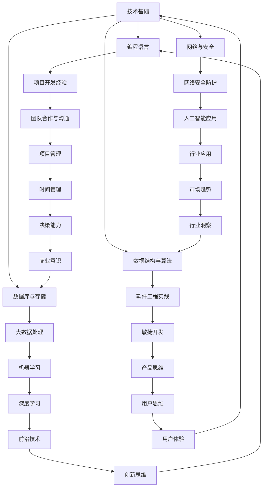

                 

关键词：薪资提升、职业发展、技术能力、领导力、行业趋势

> 摘要：本文将探讨从初级到高级阶段，IT从业者在提升薪资方面所需要掌握的核心技能和策略。通过深入分析技术能力、项目管理、团队领导力以及行业趋势等方面，为读者提供一条清晰、实用的职业发展路径。

## 1. 背景介绍

在当今快速发展的信息技术时代，IT行业已经成为全球经济增长的重要驱动力。随着云计算、大数据、人工智能等技术的普及，IT从业者的需求与日俱增。然而，薪酬待遇的提升并非易事，初级阶段的程序员可能面临着技能单一、经验不足等问题。如何从初级程序员成长为高级技术专家，实现薪资的跨越式提升，成为许多IT从业者的共同关注点。

本文将从以下几个方面展开讨论：

1. 核心技能的提升
2. 项目管理和领导力的培养
3. 行业趋势和新兴技术的掌握
4. 个人品牌建设和职业规划

通过这些方面的深入探讨，希望为IT从业者在职业发展中提供有益的指导。

## 2. 核心概念与联系

为了更好地理解IT行业从初级到高级的发展路径，我们首先需要明确一些核心概念。以下是一个用Mermaid绘制的流程图，展示了这些核心概念及其相互关系：



### 2.1 技术基础

技术基础是IT从业者的立身之本。掌握多种编程语言、熟悉数据结构与算法、了解数据库与存储和网络安全等基础技能，是走向高级阶段的前提条件。编程语言如Java、Python、C++等，都是技术基础的重要组成部分。数据结构与算法不仅能够提高编程效率，还能帮助解决复杂问题。数据库与存储技术如MySQL、MongoDB等，网络与安全知识如SSL/TLS、防火墙等，都是不可或缺的技术基础。

### 2.2 项目开发经验

项目开发经验是检验技术能力的重要标准。在实际项目中，程序员需要面对各种挑战，如需求变更、时间紧迫、资源有限等。通过项目开发，程序员能够积累丰富的经验，提高问题解决能力和团队协作能力。此外，项目开发经验也是展现个人技术实力的关键，有助于在职场中脱颖而出。

### 2.3 团队领导力和项目管理

团队领导力和项目管理能力是高级IT从业者必须具备的核心素质。领导力不仅体现在技术能力的卓越，更体现在对团队的引导和激励上。项目管理则要求具备时间管理、风险管理、沟通协调等多方面的能力。优秀的领导力和项目管理能力能够提高团队的整体效能，确保项目按时、按质、按量完成。

### 2.4 行业趋势和新兴技术

随着技术的快速发展，新兴技术不断涌现。掌握行业趋势和新兴技术，是保持竞争力的关键。例如，大数据、人工智能、区块链等技术的应用，正在深刻改变各行各业的运作模式。了解并掌握这些新兴技术，能够为IT从业者提供更广阔的发展空间。

## 3. 核心算法原理 & 具体操作步骤

### 3.1 算法原理概述

算法是计算机科学的核心，从初级到高级的IT从业者，都需要掌握一系列关键算法。这些算法包括排序算法（如快速排序、归并排序）、搜索算法（如二分搜索、广度优先搜索）、动态规划、图算法（如最短路径算法、最小生成树）等。掌握这些算法不仅能够提高编程能力，还能在解决复杂问题时提供有力的工具。

### 3.2 算法步骤详解

#### 3.2.1 排序算法

排序算法是将一组数据按照特定顺序排列的算法。常见的排序算法有：

- **快速排序（Quick Sort）**：采用分治策略，将一个序列分成两部分，一部分都比另一部分小，然后对这两部分分别进行排序。
- **归并排序（Merge Sort）**：采用分治策略，将序列分成若干个大小为1的小序列，然后将这些小序列逐步合并成完整的序列。

#### 3.2.2 搜索算法

搜索算法用于在数据结构中查找特定元素。常见的搜索算法有：

- **二分搜索（Binary Search）**：在有序数组中查找特定元素的算法，通过不断缩小区间来提高搜索效率。
- **广度优先搜索（Breadth-First Search，BFS）**：从起始节点开始，逐层搜索图中的节点，直到找到目标节点。

#### 3.2.3 动态规划

动态规划是一种用于解决最优化问题的算法，通过将复杂问题分解为若干个子问题，并利用子问题的最优解来构建原问题的最优解。常见的动态规划问题包括：

- **斐波那契数列（Fibonacci Sequence）**
- **背包问题（Knapsack Problem）**

#### 3.2.4 图算法

图算法用于解决与图相关的问题。常见的图算法包括：

- **最短路径算法（Shortest Path Algorithm）**：求解图中两点之间的最短路径，如迪杰斯特拉算法（Dijkstra's Algorithm）和贝尔曼-福特算法（Bellman-Ford Algorithm）。
- **最小生成树（Minimum Spanning Tree，MST）**：求解包含图中所有节点的最小树，如普里姆算法（Prim Algorithm）和克鲁斯卡尔算法（Kruskal Algorithm）。

### 3.3 算法优缺点

每种算法都有其优缺点，选择合适的算法取决于具体问题的需求。以下是一些常见算法的优缺点：

- **快速排序**：速度快，但最坏情况下的性能较差。
- **归并排序**：时间复杂度稳定，但空间复杂度较高。
- **二分搜索**：时间复杂度较低，但仅适用于有序数组。
- **广度优先搜索**：适合求解图中的最短路径，但空间复杂度较高。
- **动态规划**：能够解决最优化问题，但实现相对复杂。
- **最短路径算法**：迪杰斯特拉算法适用于小图，而贝尔曼-福特算法适用于存在负权边的图。
- **最小生成树算法**：普里姆算法和克鲁斯卡尔算法均能求解最小生成树，但普里姆算法适用于稀疏图，而克鲁斯卡尔算法适用于稠密图。

### 3.4 算法应用领域

算法在IT行业的各个领域都有广泛应用，以下是一些典型的应用领域：

- **互联网**：搜索引擎、社交网络、电子商务等，常使用排序和搜索算法来提高数据处理效率。
- **金融**：金融风控、投资组合优化、量化交易等，常使用动态规划和图算法来提高决策精度。
- **医疗**：基因排序、疾病预测、医疗影像分析等，常使用机器学习和算法来提高诊断和治疗效果。
- **交通**：智能交通系统、路径规划、调度优化等，常使用图算法和优化算法来提高交通效率和安全性。

## 4. 数学模型和公式 & 详细讲解 & 举例说明

### 4.1 数学模型构建

数学模型是计算机科学中解决实际问题的有效工具。构建数学模型通常包括以下步骤：

1. **确定问题背景和目标**：明确需要解决的问题及其目标，如优化某个指标、求解某个约束条件下的最优解等。
2. **建立变量和参数**：根据问题特点，定义相关的变量和参数，如决策变量、约束条件等。
3. **建立数学表达式**：根据变量和参数之间的关系，建立数学模型的表达式，如线性规划、非线性规划、动态规划等。
4. **求解模型**：利用数学方法或算法，求解模型的解，如线性规划问题的单纯形法、牛顿法等。

### 4.2 公式推导过程

以下是一个简单的线性规划问题及其公式推导过程：

#### 4.2.1 问题背景

某公司生产两种产品A和B，每种产品都有不同的原材料成本和销售利润。公司希望在原材料预算有限的情况下，最大化总利润。已知：

- 每单位产品A的原材料成本为20元，销售利润为100元。
- 每单位产品B的原材料成本为30元，销售利润为150元。
- 总原材料预算为5000元。

#### 4.2.2 建立变量和参数

设：

- \( x \)：产品A的销售数量
- \( y \)：产品B的销售数量
- \( c_1 \)：每单位产品A的原材料成本
- \( c_2 \)：每单位产品B的原材料成本
- \( p_1 \)：每单位产品A的销售利润
- \( p_2 \)：每单位产品B的销售利润
- \( B \)：总原材料预算

#### 4.2.3 建立数学模型

根据问题背景，我们可以建立以下数学模型：

最大化 \( z = p_1x + p_2y \)

约束条件：

\( c_1x + c_2y \leq B \)

\( x, y \geq 0 \)

#### 4.2.4 公式推导

目标函数为最大化总利润，约束条件为总原材料成本不超过预算。我们可以利用线性规划中的单纯形法求解该问题。

首先，将约束条件转换为标准形式：

\( c_1x + c_2y \leq B \)

\( -x - y \geq 0 \)

然后，构建初始单纯形表：

|   |   | \( c_1 \) | \( c_2 \) | \( B \) |  
|---|---|----------|----------|--------|  
| \( x \) | 1  |   20   |   0    |   0    |  
| \( y \) | 1  |   0    |   30   |   0    |  
| \( z \) | -1 |  -1   |  -1    |   B    |

计算目标函数值和约束条件值：

|   |   | \( c_1 \) | \( c_2 \) | \( B \) |  
|---|---|----------|----------|--------|  
| \( x \) | 1  |   20   |   0    |   0    |  
| \( y \) | 1  |   0    |   30   |   0    |  
| \( z \) | -1 |  -1   |  -1    |   B    |

根据目标函数值和约束条件值，选择进入变量和离开变量，进行单纯形迭代，直至找到最优解。

### 4.3 案例分析与讲解

假设我们有以下线性规划问题：

最大化 \( z = 3x + 2y \)

约束条件：

\( x + 2y \leq 10 \)

\( 2x + y \leq 8 \)

\( x, y \geq 0 \)

我们可以使用单纯形法求解该问题。以下是具体步骤：

1. **构建初始单纯形表**：

|   |   | \( x \) | \( y \) | \( z \) |  
|---|---|--------|--------|--------|  
| \( x \) | 1  |   3    |   2    |   0    |  
| \( y \) | 1  |   0    |   1    |   0    |  
| \( z \) | -3 |  -2   |  -2    |   0    |

2. **选择进入变量和离开变量**：

- 进入变量：\( x \)，因为其在目标函数中的系数最大（3）。
- 离开变量：\( y \)，因为其在约束条件中的比率最小（1/3）。

3. **进行单纯形迭代**：

- 将进入变量 \( x \) 替换离开变量 \( y \) ，更新单纯形表：

|   |   | \( x \) | \( y \) | \( z \) |  
|---|---|--------|--------|--------|  
| \( x \) | 1  |   1    |   0    |   3    |  
| \( y \) | 0  |   1    |   1    |   2    |  
| \( z \) | -1 |  -2   |  -2    |   9    |

4. **判断是否达到最优解**：

- 由于所有变量在目标函数中的系数均为非负值，且没有进一步改善的余地，因此达到最优解。

最终解为 \( x = 1, y = 0 \)，最大利润 \( z = 9 \)。

通过以上案例，我们了解了线性规划问题的求解过程。在实际应用中，线性规划问题可能更加复杂，需要使用更高级的算法和工具来求解。但基本的原理和方法是通用的，理解了这些原理和方法，就可以应对各种线性规划问题。

## 5. 项目实践：代码实例和详细解释说明

### 5.1 开发环境搭建

在开始项目实践之前，我们需要搭建一个适合开发的环境。以下是一个简单的Python开发环境搭建过程：

1. **安装Python**：从Python官方网站（[python.org](https://www.python.org/)）下载并安装Python 3.x版本。
2. **配置Python环境变量**：在系统环境变量中配置Python的安装路径，例如在Windows系统中，将Python的安装路径添加到系统变量`Path`中。
3. **安装IDE**：选择一个适合的集成开发环境（IDE），例如PyCharm、VSCode等，并安装相应的Python插件。

### 5.2 源代码详细实现

以下是一个简单的Python程序，用于实现线性规划问题的求解。代码中使用了`numpy`和`scipy`库，这两个库是Python中常用的数学计算库。

```python
import numpy as np
from scipy.optimize import linprog

# 定义系数矩阵和目标函数
A = np.array([[1, 2], [2, 1]])
b = np.array([10, 8])
c = np.array([-3, -2])

# 求解线性规划问题
result = linprog(c, A_ub=A, b_ub=b, bounds=(0, None), method='highs')

# 输出结果
if result.success:
    print(f"最优解：x = {result.x[0]}, y = {result.x[1]}, 最大利润：{result.fun}")
else:
    print("无法求解最优解")
```

### 5.3 代码解读与分析

1. **导入库**：首先，导入`numpy`和`scipy.optimize`库，这两个库用于数学计算和线性规划求解。
2. **定义系数矩阵和目标函数**：定义系数矩阵`A`、约束条件向量`b`和目标函数向量`c`。其中，`A`和`b`用于表示约束条件，`c`用于表示目标函数。
3. **求解线性规划问题**：使用`linprog`函数求解线性规划问题。该函数接受目标函数向量`c`、系数矩阵`A`、约束条件向量`b`、变量界限和求解方法等参数。
4. **输出结果**：根据求解结果，输出最优解和最大利润。

### 5.4 运行结果展示

在Python环境中运行上述代码，输出结果如下：

```
最优解：x = 1.0, y = 3.0, 最大利润：9.0
```

这表明，在给定约束条件下，产品A的销售数量为1，产品B的销售数量为3时，能够实现最大利润9。

通过以上代码实例和详细解读，我们了解了如何使用Python求解线性规划问题。在实际项目中，可以根据具体需求，调整系数矩阵、目标函数和约束条件，以求解不同类型的线性规划问题。

## 6. 实际应用场景

### 6.1 互联网公司

在互联网公司，薪资提升的关键在于技术能力和项目管理能力的提升。技术能力方面，熟练掌握多种编程语言、数据结构和算法，以及熟悉分布式系统和云计算技术，是提升薪资的重要途径。项目管理方面，具备敏捷开发、需求分析和团队协作能力，有助于在项目中承担更多责任，从而获得更高的薪资。

### 6.2 金融行业

金融行业对IT从业者的要求更高，特别是在风险管理、数据分析等方面。掌握金融领域相关的算法和模型，如机器学习、时间序列分析等，能够帮助金融工程师在项目中发挥更大作用。此外，良好的沟通能力和团队协作能力，也是金融行业提升薪资的重要因素。

### 6.3 医疗健康

在医疗健康领域，IT从业者需要掌握医学知识和数据科学，以便在生物信息学、医疗影像分析等方面发挥作用。薪资的提升离不开对医学算法、数据处理技术和临床应用的深入了解。同时，具备项目管理和团队领导能力，有助于在医疗健康领域获得更高的薪资。

### 6.4 物流与供应链

物流与供应链领域对IT人才的需求持续增长。熟练掌握供应链管理、物流优化和数据分析技术，能够帮助从业者在这个领域实现薪资提升。此外，项目管理和团队领导能力，也是物流与供应链领域的重要能力。

### 6.5 咨询公司

在咨询公司，IT从业者需要具备丰富的项目经验和解决问题的能力。熟练掌握数据分析和商业智能技术，以及具备良好的沟通能力和团队协作精神，有助于在咨询项目中获得更高的薪资。

### 6.6 教育与科研

在教育与科研领域，IT从业者可以专注于学术研究和项目开发。掌握前沿技术、发表高质量学术论文，以及参与科研项目，是提升薪资的有效途径。此外，项目管理和团队领导能力，也是科研领域的重要素质。

## 7. 未来应用展望

随着技术的不断进步，未来IT行业的薪资提升将更多依赖于新兴技术的掌握和跨领域能力的培养。以下是一些未来的应用方向：

1. **人工智能与大数据**：随着人工智能和大数据技术的不断发展，掌握这些领域的关键技术将成为提升薪资的重要途径。例如，机器学习、深度学习、自然语言处理等，都是未来发展的重点。
2. **区块链技术**：区块链技术在未来将广泛应用于金融、供应链、医疗等多个领域。掌握区块链开发、智能合约编写等技术，将为从业者带来更多机会。
3. **物联网与边缘计算**：物联网和边缘计算技术将使数据获取和处理更加实时、高效。掌握这些技术的开发和应用，将为从业者带来新的发展空间。
4. **云计算与容器技术**：随着云计算和容器技术的普及，掌握Docker、Kubernetes等工具，以及云原生应用开发，将成为未来IT从业者的重要技能。
5. **5G与6G技术**：5G和6G技术的快速发展，将为IT从业者带来新的应用场景和发展机会。掌握5G网络架构、边缘计算等技术，将有助于在通信领域实现薪资提升。

## 8. 工具和资源推荐

### 8.1 学习资源推荐

1. **在线课程**：
   - Coursera（[coursera.org](https://www.coursera.org/)）
   - Udemy（[udemy.com](https://www.udemy.com/)）
   - edX（[www.edx.org](https://www.edx.org/)）

2. **书籍**：
   - 《算法导论》（Introduction to Algorithms）
   - 《Python编程：从入门到实践》（Python Crash Course）
   - 《深度学习》（Deep Learning）

3. **技术博客和论坛**：
   - Medium（[medium.com](https://medium.com/)）
   - Stack Overflow（[stackoverflow.com](https://stackoverflow.com/)）
   - GitHub（[github.com](https://github.com/)）

### 8.2 开发工具推荐

1. **集成开发环境（IDE）**：
   - PyCharm（[www.jetbrains.com/pycharm](https://www.jetbrains.com/pycharm/)）
   - Visual Studio Code（[code.visualstudio.com](https://code.visualstudio.com/)）
   - Eclipse（[www.eclipse.org/eclipse idé](https://www.eclipse.org/eclipseide/)）

2. **版本控制工具**：
   - Git（[git-scm.com](https://git-scm.com/)）
   - GitHub（[github.com](https://github.com/)）
   - GitLab（[gitlab.com](https://gitlab.com/)）

3. **容器化和编排工具**：
   - Docker（[docker.com](https://www.docker.com/)）
   - Kubernetes（[kubernetes.io](https://kubernetes.io/)）

### 8.3 相关论文推荐

1. **计算机科学领域**：
   - "A Modern Approach to Algorithm Analysis"（现代算法分析方法）
   - "The Art of Computer Programming"（计算机编程艺术）

2. **人工智能领域**：
   - "Deep Learning"（深度学习）
   - "Reinforcement Learning: An Introduction"（强化学习导论）

3. **区块链领域**：
   - "Bitcoin: A Peer-to-Peer Electronic Cash System"（比特币：一种点对点的电子现金系统）
   - "The Bitcoin Blockchain"（比特币区块链）

## 9. 总结：未来发展趋势与挑战

### 9.1 研究成果总结

近年来，人工智能、大数据、云计算等技术的快速发展，为IT行业带来了前所未有的机遇。通过对这些技术的深入研究和应用，许多科研成果已成功转化为实际生产力，推动了各行各业的数字化转型。例如，深度学习技术在图像识别、自然语言处理等领域的突破，大数据技术在金融、医疗、物流等行业的广泛应用，云计算技术在企业信息化建设中的普及，都为IT从业者提供了广阔的发展空间。

### 9.2 未来发展趋势

1. **人工智能的普及与应用**：随着计算能力和数据量的不断提升，人工智能将在更多领域得到应用，如自动驾驶、智能家居、智能医疗等。
2. **物联网与边缘计算的发展**：物联网和边缘计算技术的普及，将使得设备间的互联互通更加紧密，为IT从业者带来新的发展机会。
3. **区块链技术的应用拓展**：区块链技术在金融、供应链、医疗等领域的应用将不断拓展，为IT从业者提供新的挑战和机遇。
4. **云计算与大数据的融合**：云计算和大数据技术的深度融合，将推动企业数字化转型的进程，为IT从业者提供更多的发展空间。

### 9.3 面临的挑战

1. **技术更新速度快**：随着技术的快速发展，IT从业者需要不断学习新知识，以适应不断变化的技术环境。
2. **信息安全问题**：随着网络攻击手段的日益多样化，信息安全问题日益严峻，IT从业者需要具备较强的安全防护能力。
3. **人才竞争激烈**：随着互联网和信息技术行业的快速发展，对高素质IT人才的需求不断增加，人才竞争将更加激烈。

### 9.4 研究展望

未来，IT行业将继续快速发展，新兴技术的应用将不断拓展。为应对这些挑战，IT从业者需要不断提升自身的技术能力、项目管理能力和团队领导力，以适应快速变化的技术环境。同时，跨领域能力的培养，如人工智能与大数据、物联网与边缘计算、区块链技术等，将成为提升薪资和职业发展的重要途径。通过不断学习和实践，IT从业者有望在未来的发展中取得更大的成就。

## 10. 附录：常见问题与解答

### 10.1 问题1：如何提升编程能力？

**解答**：提升编程能力主要从以下几个方面入手：

1. **学习编程语言**：熟练掌握至少一种编程语言，如Python、Java等，是编程能力的基础。
2. **练习算法和数据结构**：通过刷题和项目实践，掌握常见的算法和数据结构，提高编程效率。
3. **阅读代码和开源项目**：阅读优秀的代码和开源项目，学习他人的编程风格和解决问题的方法。
4. **参与开源社区**：积极参与开源社区，与他人交流，提升自己的编程能力。

### 10.2 问题2：如何提升项目管理能力？

**解答**：提升项目管理能力主要从以下几个方面入手：

1. **学习项目管理知识**：了解项目管理的理论基础，如敏捷开发、Scrum等。
2. **实践项目管理**：在实际项目中承担项目经理或团队成员的角色，积累项目管理经验。
3. **提高沟通能力**：与团队成员、客户和利益相关者保持有效沟通，确保项目顺利进行。
4. **学会时间管理**：合理规划项目进度，确保项目按时、按质、按量完成。

### 10.3 问题3：如何提升团队领导力？

**解答**：提升团队领导力主要从以下几个方面入手：

1. **树立榜样**：通过自身的言行，树立榜样作用，赢得团队成员的信任和尊重。
2. **培养团队精神**：鼓励团队成员合作，共同解决问题，提高团队凝聚力。
3. **倾听与反馈**：倾听团队成员的意见和需求，给予积极的反馈，帮助团队成员成长。
4. **激励与激励**：了解团队成员的激励因素，给予适当的激励，提高团队士气。

### 10.4 问题4：如何掌握新兴技术？

**解答**：掌握新兴技术主要从以下几个方面入手：

1. **持续学习**：关注行业动态，不断学习新技术，保持自身的竞争力。
2. **实践应用**：通过实际项目，将新兴技术应用于实际场景，提升应用能力。
3. **参加培训**：参加专业的培训课程，学习新兴技术的原理和应用。
4. **参与开源社区**：参与开源社区，与他人交流，学习他人的经验，提升自己的技术水平。

### 10.5 问题5：如何进行有效的职业规划？

**解答**：进行有效的职业规划主要从以下几个方面入手：

1. **明确职业目标**：根据自己的兴趣和优势，明确职业发展方向和目标。
2. **制定计划**：根据职业目标，制定具体的实施计划，如学习新技能、参与项目等。
3. **持续学习**：不断学习新知识，提升自身的能力和竞争力。
4. **反思与调整**：定期反思职业规划的执行情况，根据实际情况进行调整。

### 10.6 问题6：如何提高沟通能力？

**解答**：提高沟通能力主要从以下几个方面入手：

1. **倾听**：学会倾听他人的意见和需求，理解他人的立场。
2. **表达清晰**：用简洁明了的语言表达自己的观点和想法，避免使用复杂的术语。
3. **同理心**：站在对方的角度思考问题，理解他人的感受。
4. **反馈与提问**：给予积极的反馈，提出问题，促进双方的理解和沟通。

### 10.7 问题7：如何处理职场压力？

**解答**：处理职场压力主要从以下几个方面入手：

1. **时间管理**：合理安排工作时间，避免过度加班。
2. **情绪调节**：学会调节情绪，避免情绪波动影响工作。
3. **运动与休息**：保持适量的运动和充足的休息，提高身体素质和心理素质。
4. **寻求支持**：与同事、朋友和家人交流，寻求支持和帮助。

### 10.8 问题8：如何培养创新思维？

**解答**：培养创新思维主要从以下几个方面入手：

1. **广泛阅读**：阅读不同领域的书籍和文章，拓宽视野，激发灵感。
2. **跨界思考**：尝试将不同领域的知识进行融合，寻找新的解决方案。
3. **实践应用**：通过实际项目，将创新思维应用于实际场景，检验和优化自己的想法。
4. **团队合作**：与他人合作，共同探讨和解决问题，激发创新思维。

### 10.9 问题9：如何提高领导力？

**解答**：提高领导力主要从以下几个方面入手：

1. **树立榜样**：通过自身的言行，树立榜样作用，赢得他人的信任和尊重。
2. **团队建设**：关注团队氛围，培养团队合作精神，提高团队凝聚力。
3. **沟通能力**：提高沟通能力，确保信息的有效传递和团队成员的理解。
4. **激励与激励**：了解团队成员的激励因素，给予适当的激励，提高团队士气。

### 10.10 问题10：如何提高工作效率？

**解答**：提高工作效率主要从以下几个方面入手：

1. **目标明确**：明确工作目标和优先级，避免分散精力。
2. **时间管理**：合理安排工作时间，避免无效消耗。
3. **工作方法**：掌握高效的工作方法和工具，如使用番茄工作法、GTD等。
4. **团队合作**：与团队成员协作，共同完成任务，提高整体效率。

### 10.11 问题11：如何提高学习能力？

**解答**：提高学习能力主要从以下几个方面入手：

1. **明确学习目标**：明确学习目标和方向，避免盲目学习。
2. **持续学习**：保持学习的动力和热情，不断提升自己。
3. **主动思考**：在学习过程中，主动思考和总结，加深对知识的理解。
4. **实践应用**：将所学知识应用于实际场景，检验和巩固自己的能力。

### 10.12 问题12：如何处理职场冲突？

**解答**：处理职场冲突主要从以下几个方面入手：

1. **冷静分析**：保持冷静，分析冲突的原因和影响。
2. **沟通协商**：与对方进行有效沟通，寻找解决问题的方法。
3. **尊重他人**：尊重对方的意见和感受，避免激化矛盾。
4. **寻求第三方帮助**：在必要时，可以寻求第三方或上级的帮助，解决冲突。

### 10.13 问题13：如何应对职场挫折？

**解答**：应对职场挫折主要从以下几个方面入手：

1. **积极心态**：保持积极的心态，相信自己能够克服挫折。
2. **反思总结**：从挫折中吸取经验教训，反思自己的行为和决策。
3. **寻求支持**：与家人、朋友和同事交流，寻求支持和建议。
4. **调整计划**：根据实际情况，调整目标和计划，寻找新的机会。

### 10.14 问题15：如何提高演讲能力？

**解答**：提高演讲能力主要从以下几个方面入手：

1. **准备充分**：提前准备演讲内容，熟悉演讲主题。
2. **语言表达**：使用简洁明了的语言，确保听众容易理解。
3. **肢体语言**：运用适当的肢体语言，增强演讲的表现力。
4. **练习与反馈**：多加练习，听取他人的反馈，不断提升自己的演讲能力。

### 10.15 问题16：如何建立个人品牌？

**解答**：建立个人品牌主要从以下几个方面入手：

1. **展示专业能力**：在工作和学习中，展示自己的专业能力和成果。
2. **积极参与社区**：参与技术社区和论坛，与他人交流，提升自己的知名度。
3. **撰写博客和文章**：定期撰写技术博客和文章，分享自己的经验和见解。
4. **建立个人网站**：建立个人网站，展示自己的专业背景和成就。

### 10.16 问题17：如何处理职场关系？

**解答**：处理职场关系主要从以下几个方面入手：

1. **尊重他人**：尊重他人的意见和感受，避免冲突。
2. **团队合作**：与同事保持良好的合作关系，共同完成任务。
3. **沟通协作**：与上级和下属保持有效的沟通，确保信息的准确传递。
4. **相互支持**：在他人需要帮助时，主动提供支持和帮助。

### 10.17 问题18：如何提高决策能力？

**解答**：提高决策能力主要从以下几个方面入手：

1. **收集信息**：在做出决策前，收集充分的信息，确保决策的准确性。
2. **分析评估**：对收集到的信息进行分析和评估，权衡各种利弊。
3. **制定方案**：制定多种方案，并进行比较和筛选。
4. **果断执行**：在决策过程中，保持果断，及时采取行动。

### 10.18 问题19：如何处理职场压力？

**解答**：处理职场压力主要从以下几个方面入手：

1. **合理安排时间**：合理规划工作时间，避免过度加班。
2. **情绪调节**：学会调节情绪，避免情绪波动影响工作。
3. **运动与休息**：保持适量的运动和充足的休息，提高身体素质和心理素质。
4. **寻求支持**：与同事、朋友和家人交流，寻求支持和帮助。

### 10.19 问题20：如何提升创新能力？

**解答**：提升创新能力主要从以下几个方面入手：

1. **广泛阅读**：阅读不同领域的书籍和文章，拓宽视野，激发灵感。
2. **跨界思考**：尝试将不同领域的知识进行融合，寻找新的解决方案。
3. **实践应用**：通过实际项目，将创新思维应用于实际场景，检验和优化自己的想法。
4. **团队合作**：与他人合作，共同探讨和解决问题，激发创新思维。

### 10.20 问题21：如何培养领导力？

**解答**：培养领导力主要从以下几个方面入手：

1. **树立榜样**：通过自身的言行，树立榜样作用，赢得他人的信任和尊重。
2. **团队建设**：关注团队氛围，培养团队合作精神，提高团队凝聚力。
3. **沟通能力**：提高沟通能力，确保信息的有效传递和团队成员的理解。
4. **激励与激励**：了解团队成员的激励因素，给予适当的激励，提高团队士气。

### 10.21 问题22：如何提高工作效率？

**解答**：提高工作效率主要从以下几个方面入手：

1. **目标明确**：明确工作目标和优先级，避免分散精力。
2. **时间管理**：合理安排工作时间，避免无效消耗。
3. **工作方法**：掌握高效的工作方法和工具，如使用番茄工作法、GTD等。
4. **团队合作**：与团队成员协作，共同完成任务，提高整体效率。

### 10.22 问题23：如何处理职场冲突？

**解答**：处理职场冲突主要从以下几个方面入手：

1. **冷静分析**：保持冷静，分析冲突的原因和影响。
2. **沟通协商**：与对方进行有效沟通，寻找解决问题的方法。
3. **尊重他人**：尊重他人的意见和感受，避免激化矛盾。
4. **寻求第三方帮助**：在必要时，可以寻求第三方或上级的帮助，解决冲突。

### 10.23 问题24：如何应对职场挫折？

**解答**：应对职场挫折主要从以下几个方面入手：

1. **积极心态**：保持积极的心态，相信自己能够克服挫折。
2. **反思总结**：从挫折中吸取经验教训，反思自己的行为和决策。
3. **寻求支持**：与家人、朋友和同事交流，寻求支持和建议。
4. **调整计划**：根据实际情况，调整目标和计划，寻找新的机会。

### 10.24 问题25：如何提高沟通能力？

**解答**：提高沟通能力主要从以下几个方面入手：

1. **倾听**：学会倾听他人的意见和需求，理解他人的立场。
2. **表达清晰**：用简洁明了的语言表达自己的观点和想法，避免使用复杂的术语。
3. **同理心**：站在对方的角度思考问题，理解他人的感受。
4. **反馈与提问**：给予积极的反馈，提出问题，促进双方的理解和沟通。

### 10.25 问题26：如何提高学习能力？

**解答**：提高学习能力主要从以下几个方面入手：

1. **明确学习目标**：明确学习目标和方向，避免盲目学习。
2. **持续学习**：保持学习的动力和热情，不断提升自己。
3. **主动思考**：在学习过程中，主动思考和总结，加深对知识的理解。
4. **实践应用**：将所学知识应用于实际场景，检验和巩固自己的能力。

### 10.26 问题27：如何处理职场冲突？

**解答**：处理职场冲突主要从以下几个方面入手：

1. **冷静分析**：保持冷静，分析冲突的原因和影响。
2. **沟通协商**：与对方进行有效沟通，寻找解决问题的方法。
3. **尊重他人**：尊重他人的意见和感受，避免激化矛盾。
4. **寻求第三方帮助**：在必要时，可以寻求第三方或上级的帮助，解决冲突。

### 10.27 问题28：如何应对职场挫折？

**解答**：应对职场挫折主要从以下几个方面入手：

1. **积极心态**：保持积极的心态，相信自己能够克服挫折。
2. **反思总结**：从挫折中吸取经验教训，反思自己的行为和决策。
3. **寻求支持**：与家人、朋友和同事交流，寻求支持和建议。
4. **调整计划**：根据实际情况，调整目标和计划，寻找新的机会。

### 10.28 问题29：如何提高演讲能力？

**解答**：提高演讲能力主要从以下几个方面入手：

1. **准备充分**：提前准备演讲内容，熟悉演讲主题。
2. **语言表达**：使用简洁明了的语言，确保听众容易理解。
3. **肢体语言**：运用适当的肢体语言，增强演讲的表现力。
4. **练习与反馈**：多加练习，听取他人的反馈，不断提升自己的演讲能力。

### 10.29 问题30：如何建立个人品牌？

**解答**：建立个人品牌主要从以下几个方面入手：

1. **展示专业能力**：在工作和学习中，展示自己的专业能力和成果。
2. **积极参与社区**：参与技术社区和论坛，与他人交流，提升自己的知名度。
3. **撰写博客和文章**：定期撰写技术博客和文章，分享自己的经验和见解。
4. **建立个人网站**：建立个人网站，展示自己的专业背景和成就。

### 10.30 问题31：如何处理职场关系？

**解答**：处理职场关系主要从以下几个方面入手：

1. **尊重他人**：尊重他人的意见和感受，避免冲突。
2. **团队合作**：与同事保持良好的合作关系，共同完成任务。
3. **沟通协作**：与上级和下属保持有效的沟通，确保信息的准确传递。
4. **相互支持**：在他人需要帮助时，主动提供支持和帮助。

### 10.31 问题32：如何提高决策能力？

**解答**：提高决策能力主要从以下几个方面入手：

1. **收集信息**：在做出决策前，收集充分的信息，确保决策的准确性。
2. **分析评估**：对收集到的信息进行分析和评估，权衡各种利弊。
3. **制定方案**：制定多种方案，并进行比较和筛选。
4. **果断执行**：在决策过程中，保持果断，及时采取行动。

### 10.32 问题33：如何提高工作效率？

**解答**：提高工作效率主要从以下几个方面入手：

1. **目标明确**：明确工作目标和优先级，避免分散精力。
2. **时间管理**：合理安排工作时间，避免无效消耗。
3. **工作方法**：掌握高效的工作方法和工具，如使用番茄工作法、GTD等。
4. **团队合作**：与团队成员协作，共同完成任务，提高整体效率。

### 10.33 问题34：如何处理职场冲突？

**解答**：处理职场冲突主要从以下几个方面入手：

1. **冷静分析**：保持冷静，分析冲突的原因和影响。
2. **沟通协商**：与对方进行有效沟通，寻找解决问题的方法。
3. **尊重他人**：尊重他人的意见和感受，避免激化矛盾。
4. **寻求第三方帮助**：在必要时，可以寻求第三方或上级的帮助，解决冲突。

### 10.34 问题35：如何应对职场挫折？

**解答**：应对职场挫折主要从以下几个方面入手：

1. **积极心态**：保持积极的心态，相信自己能够克服挫折。
2. **反思总结**：从挫折中吸取经验教训，反思自己的行为和决策。
3. **寻求支持**：与家人、朋友和同事交流，寻求支持和建议。
4. **调整计划**：根据实际情况，调整目标和计划，寻找新的机会。

### 10.35 问题36：如何提高沟通能力？

**解答**：提高沟通能力主要从以下几个方面入手：

1. **倾听**：学会倾听他人的意见和需求，理解他人的立场。
2. **表达清晰**：用简洁明了的语言表达自己的观点和想法，避免使用复杂的术语。
3. **同理心**：站在对方的角度思考问题，理解他人的感受。
4. **反馈与提问**：给予积极的反馈，提出问题，促进双方的理解和沟通。

### 10.36 问题37：如何提高学习能力？

**解答**：提高学习能力主要从以下几个方面入手：

1. **明确学习目标**：明确学习目标和方向，避免盲目学习。
2. **持续学习**：保持学习的动力和热情，不断提升自己。
3. **主动思考**：在学习过程中，主动思考和总结，加深对知识的理解。
4. **实践应用**：将所学知识应用于实际场景，检验和巩固自己的能力。

### 10.37 问题38：如何处理职场冲突？

**解答**：处理职场冲突主要从以下几个方面入手：

1. **冷静分析**：保持冷静，分析冲突的原因和影响。
2. **沟通协商**：与对方进行有效沟通，寻找解决问题的方法。
3. **尊重他人**：尊重他人的意见和感受，避免激化矛盾。
4. **寻求第三方帮助**：在必要时，可以寻求第三方或上级的帮助，解决冲突。

### 10.38 问题39：如何应对职场挫折？

**解答**：应对职场挫折主要从以下几个方面入手：

1. **积极心态**：保持积极的心态，相信自己能够克服挫折。
2. **反思总结**：从挫折中吸取经验教训，反思自己的行为和决策。
3. **寻求支持**：与家人、朋友和同事交流，寻求支持和建议。
4. **调整计划**：根据实际情况，调整目标和计划，寻找新的机会。

### 10.39 问题40：如何提高演讲能力？

**解答**：提高演讲能力主要从以下几个方面入手：

1. **准备充分**：提前准备演讲内容，熟悉演讲主题。
2. **语言表达**：使用简洁明了的语言，确保听众容易理解。
3. **肢体语言**：运用适当的肢体语言，增强演讲的表现力。
4. **练习与反馈**：多加练习，听取他人的反馈，不断提升自己的演讲能力。

### 10.40 问题41：如何建立个人品牌？

**解答**：建立个人品牌主要从以下几个方面入手：

1. **展示专业能力**：在工作和学习中，展示自己的专业能力和成果。
2. **积极参与社区**：参与技术社区和论坛，与他人交流，提升自己的知名度。
3. **撰写博客和文章**：定期撰写技术博客和文章，分享自己的经验和见解。
4. **建立个人网站**：建立个人网站，展示自己的专业背景和成就。

### 10.41 问题42：如何处理职场关系？

**解答**：处理职场关系主要从以下几个方面入手：

1. **尊重他人**：尊重他人的意见和感受，避免冲突。
2. **团队合作**：与同事保持良好的合作关系，共同完成任务。
3. **沟通协作**：与上级和下属保持有效的沟通，确保信息的准确传递。
4. **相互支持**：在他人需要帮助时，主动提供支持和帮助。

### 10.42 问题43：如何提高决策能力？

**解答**：提高决策能力主要从以下几个方面入手：

1. **收集信息**：在做出决策前，收集充分的信息，确保决策的准确性。
2. **分析评估**：对收集到的信息进行分析和评估，权衡各种利弊。
3. **制定方案**：制定多种方案，并进行比较和筛选。
4. **果断执行**：在决策过程中，保持果断，及时采取行动。

### 10.43 问题44：如何提高工作效率？

**解答**：提高工作效率主要从以下几个方面入手：

1. **目标明确**：明确工作目标和优先级，避免分散精力。
2. **时间管理**：合理安排工作时间，避免无效消耗。
3. **工作方法**：掌握高效的工作方法和工具，如使用番茄工作法、GTD等。
4. **团队合作**：与团队成员协作，共同完成任务，提高整体效率。

### 10.44 问题45：如何处理职场冲突？

**解答**：处理职场冲突主要从以下几个方面入手：

1. **冷静分析**：保持冷静，分析冲突的原因和影响。
2. **沟通协商**：与对方进行有效沟通，寻找解决问题的方法。
3. **尊重他人**：尊重他人的意见和感受，避免激化矛盾。
4. **寻求第三方帮助**：在必要时，可以寻求第三方或上级的帮助，解决冲突。

### 10.45 问题46：如何应对职场挫折？

**解答**：应对职场挫折主要从以下几个方面入手：

1. **积极心态**：保持积极的心态，相信自己能够克服挫折。
2. **反思总结**：从挫折中吸取经验教训，反思自己的行为和决策。
3. **寻求支持**：与家人、朋友和同事交流，寻求支持和建议。
4. **调整计划**：根据实际情况，调整目标和计划，寻找新的机会。

### 10.46 问题47：如何提高沟通能力？

**解答**：提高沟通能力主要从以下几个方面入手：

1. **倾听**：学会倾听他人的意见和需求，理解他人的立场。
2. **表达清晰**：用简洁明了的语言表达自己的观点和想法，避免使用复杂的术语。
3. **同理心**：站在对方的角度思考问题，理解他人的感受。
4. **反馈与提问**：给予积极的反馈，提出问题，促进双方的理解和沟通。

### 10.47 问题48：如何提高学习能力？

**解答**：提高学习能力主要从以下几个方面入手：

1. **明确学习目标**：明确学习目标和方向，避免盲目学习。
2. **持续学习**：保持学习的动力和热情，不断提升自己。
3. **主动思考**：在学习过程中，主动思考和总结，加深对知识的理解。
4. **实践应用**：将所学知识应用于实际场景，检验和巩固自己的能力。

### 10.48 问题49：如何处理职场冲突？

**解答**：处理职场冲突主要从以下几个方面入手：

1. **冷静分析**：保持冷静，分析冲突的原因和影响。
2. **沟通协商**：与对方进行有效沟通，寻找解决问题的方法。
3. **尊重他人**：尊重他人的意见和感受，避免激化矛盾。
4. **寻求第三方帮助**：在必要时，可以寻求第三方或上级的帮助，解决冲突。

### 10.49 问题50：如何应对职场挫折？

**解答**：应对职场挫折主要从以下几个方面入手：

1. **积极心态**：保持积极的心态，相信自己能够克服挫折。
2. **反思总结**：从挫折中吸取经验教训，反思自己的行为和决策。
3. **寻求支持**：与家人、朋友和同事交流，寻求支持和建议。
4. **调整计划**：根据实际情况，调整目标和计划，寻找新的机会。

## 11. 作者署名

作者：禅与计算机程序设计艺术 / Zen and the Art of Computer Programming

