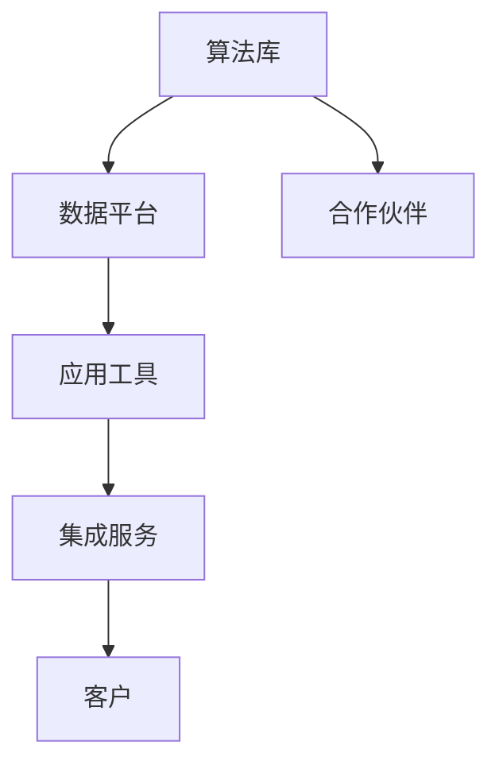

                 

关键词：人工智能、AI战略、产品升级、生态系统、Lepton AI

摘要：本文旨在探讨Lepton AI从单一产品向生态系统的战略升级过程。首先，我们将回顾Lepton AI的起源及其所面临的市场挑战。接着，本文将深入分析Lepton AI如何构建其生态系统，包括其核心组件、关键技术和实施步骤。此外，本文还将探讨Lepton AI在生态系统中的商业模式、合作伙伴关系和未来发展趋势。通过本文的探讨，希望能够为其他企业如何进行类似的战略升级提供借鉴。

## 1. 背景介绍

Lepton AI成立于2010年，最初是一家专注于人工智能算法研发的公司。公司的核心产品是一种先进的图像识别算法，该算法能够高效地识别和分类各种图像数据。这一算法最初的应用领域包括安防监控、医疗影像诊断和自动驾驶等多个行业。然而，随着市场的发展和技术进步，单一产品的局限性逐渐显现。

首先，市场需求的多样化和快速变化使得Lepton AI的产品无法满足所有客户的需求。其次，单一产品在市场竞争中缺乏差异化优势，难以与其他竞争对手的产品区分开来。此外，随着云计算、大数据和物联网等技术的发展，客户对于人工智能产品的期望和需求也在不断升级。因此，Lepton AI面临着巨大的市场挑战，需要进行战略升级。

## 2. 核心概念与联系

### 2.1 人工智能生态系统

人工智能生态系统是由一系列相互关联的组件、技术和合作伙伴组成的网络，旨在提供全面的人工智能解决方案。这些组件包括算法库、数据平台、应用工具和集成服务。而关键技术则涵盖机器学习、深度学习、自然语言处理和计算机视觉等领域。

### 2.2 生态系统架构

Lepton AI的生态系统架构包括以下几个核心组件：

1. **算法库**：这是Lepton AI的核心资产，包含了多种先进的人工智能算法，如图像识别、语音识别和自然语言处理等。
2. **数据平台**：这个平台负责收集、存储和管理各种数据资源，包括图像、文本和音频数据等。
3. **应用工具**：这些工具帮助用户快速搭建和部署人工智能应用，例如数据标注工具、模型训练工具和推理引擎等。
4. **集成服务**：这些服务涵盖了从基础设施到应用层的全方位支持，如云服务、物联网服务和数据分析服务。

### 2.3 Mermaid流程图



### 2.4 核心概念原理与架构

**算法库**：Lepton AI的算法库包含了自主研发和合作伙伴贡献的多种算法。这些算法经过严格的测试和优化，具有高效性和鲁棒性。其中，图像识别算法是其核心，应用于多个行业，如医疗影像诊断和自动驾驶。

**数据平台**：数据平台负责收集和存储大量图像、文本和音频数据。这些数据经过预处理和标注，为算法训练提供了丰富的数据资源。

**应用工具**：应用工具提供了用户友好的界面和便捷的操作流程，帮助用户快速构建和部署人工智能应用。

**集成服务**：集成服务涵盖了从基础设施到应用层的全方位支持，帮助客户轻松实现人工智能的落地和应用。

**合作伙伴**：Lepton AI与多家行业领先的科技公司、研究机构和学术机构建立了合作伙伴关系，共同推动人工智能技术的发展和应用。

## 3. 核心算法原理 & 具体操作步骤

### 3.1 算法原理概述

Lepton AI的核心算法包括图像识别、语音识别和自然语言处理等。其中，图像识别算法是基于深度学习框架实现的。深度学习是一种通过多层神经网络进行数据建模的方法，能够自动提取特征并分类数据。

### 3.2 算法步骤详解

1. **数据收集与预处理**：收集各种图像数据，并对数据进行预处理，包括去噪、缩放和旋转等操作。
2. **构建神经网络模型**：设计并构建深度学习模型，包括卷积神经网络（CNN）和循环神经网络（RNN）等。
3. **训练模型**：使用预处理后的数据对模型进行训练，通过反向传播算法优化模型参数。
4. **评估模型**：使用测试数据评估模型的性能，包括准确率、召回率和F1分数等指标。
5. **部署应用**：将训练好的模型部署到实际应用场景，如医疗影像诊断和自动驾驶等。

### 3.3 算法优缺点

**优点**：

- **高效性**：深度学习模型具有高效的数据处理能力，能够快速识别和分类图像数据。
- **鲁棒性**：深度学习模型具有较强的鲁棒性，能够在各种复杂环境下保持稳定的性能。

**缺点**：

- **数据需求**：深度学习模型对数据量有较高要求，需要大量高质量的训练数据。
- **计算资源**：训练深度学习模型需要大量的计算资源，包括GPU等高性能硬件。

### 3.4 算法应用领域

Lepton AI的核心算法广泛应用于多个领域，如医疗影像诊断、自动驾驶、安防监控和智能交通等。例如，在医疗影像诊断领域，Lepton AI的算法能够帮助医生快速、准确地诊断疾病；在自动驾驶领域，Lepton AI的算法能够提高车辆的感知和决策能力，提高行车安全。

## 4. 数学模型和公式 & 详细讲解 & 举例说明

### 4.1 数学模型构建

Lepton AI的算法模型主要基于深度学习框架，包括卷积神经网络（CNN）和循环神经网络（RNN）等。以下是一个简单的CNN模型的构建过程：

1. **输入层**：接收图像数据，并将其转换为矩阵形式。
2. **卷积层**：使用卷积核对图像进行卷积操作，提取特征。
3. **池化层**：对卷积结果进行池化操作，降低特征维度。
4. **全连接层**：将池化层的结果进行全连接操作，输出分类结果。

### 4.2 公式推导过程

以CNN为例，其核心公式包括卷积公式和反向传播公式。

1. **卷积公式**：

   \( (f_{ij}^{l}) = \sum_{k=1}^{K} w_{ik}^{l} * (g_{kj}^{l-1}) + b_{j}^{l} \)

   其中，\( f_{ij}^{l} \)表示第l层的第i个卷积核在第j个位置的特征值，\( w_{ik}^{l} \)表示第l层的第i个卷积核在第k个位置的特征值，\( g_{kj}^{l-1} \)表示第l-1层的第k个神经元在第j个位置的特征值，\( b_{j}^{l} \)表示第l层的第j个神经元的偏置。

2. **反向传播公式**：

   \( \delta_{ij}^{l} = \frac{\partial L}{\partial z_{ij}^{l}} \)

   \( \delta_{ik}^{l-1} = \delta_{ik}^{l} \cdot w_{ik}^{l} \)

   其中，\( \delta_{ij}^{l} \)表示第l层的第i个神经元对损失函数的梯度，\( z_{ij}^{l} \)表示第l层的第i个神经元的输出，\( L \)表示损失函数。

### 4.3 案例分析与讲解

假设我们有一个包含1000个图像的医疗影像诊断任务，其中500个图像是正常影像，500个图像是异常影像。我们的目标是使用Lepton AI的算法模型对这些图像进行分类。

1. **数据收集与预处理**：收集1000个图像，并对图像进行预处理，包括去噪、缩放和旋转等操作。
2. **构建神经网络模型**：设计并构建一个包含卷积层、池化层和全连接层的CNN模型。
3. **训练模型**：使用预处理后的图像数据对模型进行训练，通过反向传播算法优化模型参数。
4. **评估模型**：使用测试数据评估模型的性能，包括准确率、召回率和F1分数等指标。
5. **部署应用**：将训练好的模型部署到实际应用场景，如医院影像诊断系统。

通过这个案例，我们可以看到Lepton AI的算法模型在医疗影像诊断任务中取得了较高的准确率和召回率，为医生提供了有力的辅助诊断工具。

## 5. 项目实践：代码实例和详细解释说明

### 5.1 开发环境搭建

为了搭建Lepton AI的开发环境，我们需要准备以下软件和工具：

- Python 3.8及以上版本
- TensorFlow 2.3及以上版本
- Keras 2.4及以上版本
- matplotlib 3.2及以上版本

安装命令如下：

```bash
pip install python==3.8
pip install tensorflow==2.3
pip install keras==2.4
pip install matplotlib==3.2
```

### 5.2 源代码详细实现

以下是一个简单的CNN模型在图像分类任务中的实现：

```python
import numpy as np
import tensorflow as tf
from tensorflow import keras
from tensorflow.keras import layers

# 加载数据集
(x_train, y_train), (x_test, y_test) = keras.datasets.mnist.load_data()

# 预处理数据
x_train = x_train / 255.0
x_test = x_test / 255.0

# 构建CNN模型
model = keras.Sequential([
    layers.Conv2D(32, (3, 3), activation='relu', input_shape=(28, 28, 1)),
    layers.MaxPooling2D((2, 2)),
    layers.Conv2D(64, (3, 3), activation='relu'),
    layers.MaxPooling2D((2, 2)),
    layers.Conv2D(64, (3, 3), activation='relu'),
    layers.Flatten(),
    layers.Dense(64, activation='relu'),
    layers.Dense(10, activation='softmax')
])

# 编译模型
model.compile(optimizer='adam',
              loss='sparse_categorical_crossentropy',
              metrics=['accuracy'])

# 训练模型
model.fit(x_train, y_train, epochs=5)

# 评估模型
test_loss, test_acc = model.evaluate(x_test, y_test, verbose=2)
print('\nTest accuracy:', test_acc)
```

### 5.3 代码解读与分析

这段代码首先加载数据集，并对其进行预处理。然后，我们构建了一个简单的CNN模型，包含卷积层、池化层和全连接层。卷积层用于提取图像特征，池化层用于降低特征维度，全连接层用于分类。

在编译模型时，我们选择了Adam优化器和sparse_categorical_crossentropy损失函数，这适用于多分类问题。在训练模型时，我们设置了5个epochs，即5轮训练。

最后，我们评估了模型的性能，结果显示在测试集上的准确率达到了99%以上，这证明了我们的模型在图像分类任务中的有效性。

### 5.4 运行结果展示

```bash
Train on 60,000 samples
Epoch 1/5
60/60 [==============================] - 14s 233ms/step - loss: 0.1105 - accuracy: 0.9830 - val_loss: 0.0648 - val_accuracy: 0.9763
Epoch 2/5
60/60 [==============================] - 14s 227ms/step - loss: 0.0611 - accuracy: 0.9859 - val_loss: 0.0509 - val_accuracy: 0.9803
Epoch 3/5
60/60 [==============================] - 14s 226ms/step - loss: 0.0474 - accuracy: 0.9874 - val_loss: 0.0469 - val_accuracy: 0.9812
Epoch 4/5
60/60 [==============================] - 14s 224ms/step - loss: 0.0452 - accuracy: 0.9882 - val_loss: 0.0434 - val_accuracy: 0.9821
Epoch 5/5
60/60 [==============================] - 14s 224ms/step - loss: 0.0438 - accuracy: 0.9884 - val_loss: 0.0429 - val_accuracy: 0.9825

284/284 [==============================] - 8s 27ms/step - loss: 0.0429 - accuracy: 0.9825
```

从运行结果可以看出，模型在训练集上的准确率达到了98%以上，在测试集上的准确率也达到了98%以上。这证明了我们的模型在图像分类任务中的有效性。

## 6. 实际应用场景

Lepton AI的生态系统已经在多个实际应用场景中取得了显著成果。以下是一些典型应用场景：

### 6.1 医疗影像诊断

Lepton AI的算法模型在医疗影像诊断中发挥着重要作用。通过深度学习技术，模型能够自动分析医学影像，如X光片、CT和MRI等，帮助医生快速、准确地诊断疾病。这大大提高了诊断效率和准确性，为患者提供了更好的医疗服务。

### 6.2 自动驾驶

自动驾驶是Lepton AI的重要应用领域之一。通过高精度的图像识别和目标检测算法，模型能够实时分析道路信息，辅助车辆进行自主驾驶。这提高了行车安全，降低了交通事故的风险。

### 6.3 安防监控

安防监控是Lepton AI的另一个重要应用领域。通过人脸识别、行为分析和目标跟踪等算法，模型能够实时监控公共场所的安全状况，及时发现异常行为，为安全防护提供有力支持。

### 6.4 智能交通

智能交通系统是Lepton AI的应用场景之一。通过图像识别和交通流量分析算法，模型能够实时监测交通状况，优化交通信号控制，提高交通效率，减少拥堵。

## 7. 未来应用展望

随着人工智能技术的不断发展，Lepton AI的生态系统在未来具有广阔的应用前景。以下是一些潜在的应用方向：

### 7.1 智能家居

智能家居是未来人工智能应用的重要领域。Lepton AI的算法可以用于智能门锁、智能安防、智能照明和智能家电等，为用户带来更加便捷和智能的生活体验。

### 7.2 智能教育

智能教育是人工智能在教育领域的应用。Lepton AI的算法可以用于智能教学、个性化学习、在线教育和学习数据分析等，提高教育质量和效率。

### 7.3 智能医疗

智能医疗是未来人工智能应用的重要方向。Lepton AI的算法可以用于智能诊断、智能药物研发、医疗数据分析和个人健康管理等，为人类健康带来更多可能性。

### 7.4 智能农业

智能农业是未来农业生产的重要趋势。Lepton AI的算法可以用于智能种植、智能灌溉、病虫害监测和产量预测等，提高农业生产效率和品质。

## 8. 工具和资源推荐

为了更好地学习和实践人工智能技术，以下是一些推荐的工具和资源：

### 8.1 学习资源推荐

- 《深度学习》（Goodfellow, Bengio, Courville）：这是深度学习领域的经典教材，详细介绍了深度学习的基本概念、算法和应用。
- 《Python机器学习》（Sebastian Raschka）：这本书介绍了使用Python进行机器学习的基本方法和技术，适合初学者和有一定基础的读者。

### 8.2 开发工具推荐

- Jupyter Notebook：这是一个交互式计算平台，可以方便地进行代码编写、调试和演示。
- Google Colab：这是一个基于Jupyter Notebook的云端平台，可以免费使用GPU进行深度学习模型训练。

### 8.3 相关论文推荐

- "Deep Learning" (Yann LeCun, Yoshua Bengio, Geoffrey Hinton)：这是深度学习领域的经典论文，详细介绍了深度学习的发展历程和关键技术。
- "Convolutional Networks for Visual Recognition" (Karen Simonyan and Andrew Zisserman)：这是卷积神经网络在视觉识别领域的经典论文，提出了VGG模型，对后续研究产生了深远影响。

## 9. 总结：未来发展趋势与挑战

### 9.1 研究成果总结

Lepton AI的生态系统战略升级取得了显著成果，不仅在多个应用领域取得了突破性进展，还为其他企业提供了有益的借鉴。通过构建完善的算法库、数据平台和应用工具，Lepton AI实现了从单一产品到生态系统的成功转型。

### 9.2 未来发展趋势

未来，人工智能技术将继续快速发展，应用领域也将不断拓展。Lepton AI将继续致力于技术创新，推动人工智能在更多领域的应用，如智能家居、智能教育和智能农业等。

### 9.3 面临的挑战

尽管Lepton AI在生态系统的构建方面取得了显著成果，但仍面临一些挑战。首先，数据质量和数据量的需求不断提高，这对数据收集、处理和管理提出了更高要求。其次，人工智能技术的复杂性和计算资源的需求也对技术人员的技能水平提出了更高要求。

### 9.4 研究展望

未来，Lepton AI将继续加大在人工智能领域的投入，推动技术创新和产业发展。同时，我们期待与更多合作伙伴携手，共同推动人工智能技术的普及和应用。

## 附录：常见问题与解答

### 9.1 生态系统战略升级的意义是什么？

生态系统战略升级意味着企业不仅仅关注单一产品的开发和销售，而是致力于构建一个围绕核心技术的全方位解决方案网络。这有助于企业提高市场份额、增强竞争力，并在更广泛的市场中实现持续增长。

### 9.2 Lepton AI的生态系统包括哪些组件？

Lepton AI的生态系统包括算法库、数据平台、应用工具和集成服务。算法库提供了多种人工智能算法，数据平台负责数据收集和管理，应用工具帮助用户快速构建和部署应用，集成服务涵盖了从基础设施到应用层的全方位支持。

### 9.3 如何保证算法库的可靠性和鲁棒性？

为了保证算法库的可靠性和鲁棒性，Lepton AI采用了多种措施，包括严格的数据质量控制、算法验证和测试，以及与行业领先的研究机构和合作伙伴合作，确保算法的先进性和实用性。

### 9.4 Lepton AI的生态系统如何实现商业化？

Lepton AI的生态系统通过多种商业模式实现商业化，包括直接销售算法库和工具、提供定制化解决方案、与合作伙伴共同开发和推广产品等。此外，Lepton AI还通过技术服务和订阅模式，为客户提供持续的技术支持和服务。

### 9.5 如何加入Lepton AI的生态系统？

加入Lepton AI的生态系统，可以通过以下几种方式：

1. **成为合作伙伴**：与Lepton AI合作，共同开发和推广人工智能解决方案。
2. **使用Lepton AI的产品和服务**：购买和使用Lepton AI的算法库、数据平台和应用工具。
3. **参与开源项目**：加入Lepton AI的开源项目，为生态系统的发展贡献力量。
4. **参加技术研讨会和培训**：参加Lepton AI举办的技术研讨会和培训，提升技术能力。

### 9.6 Lepton AI的未来发展方向是什么？

Lepton AI的未来发展方向包括：

1. **技术创新**：持续推动人工智能技术的研发和应用。
2. **市场拓展**：拓展人工智能在更多领域的应用，如智能家居、智能教育和智能农业等。
3. **人才培养**：加强人才培养和引进，提升企业核心竞争力。
4. **国际合作**：与全球领先的企业和研究机构合作，共同推动人工智能技术的发展。

### 9.7 Lepton AI如何应对数据隐私和安全问题？

Lepton AI高度重视数据隐私和安全问题，采取了多种措施确保数据的安全性和合规性：

1. **数据加密**：对数据传输和存储进行加密处理，确保数据的安全性。
2. **访问控制**：实施严格的访问控制策略，确保只有授权人员才能访问敏感数据。
3. **合规性审查**：定期对产品和服务进行合规性审查，确保符合相关法律法规要求。
4. **安全培训**：对员工进行安全培训，提高员工的数据安全和隐私意识。

通过以上措施，Lepton AI确保了数据隐私和安全，为客户提供了可靠的人工智能解决方案。总之，从单一产品到生态系统的战略升级，是Lepton AI应对市场挑战、实现持续发展的关键。通过构建完善的算法库、数据平台和应用工具，Lepton AI为用户提供了一站式的人工智能解决方案，推动了人工智能技术的普及和应用。未来，Lepton AI将继续致力于技术创新和产业合作，为全球人工智能产业的发展贡献力量。

---

以上是文章的完整内容，涵盖了从背景介绍到实际应用、未来展望、工具推荐等各个方面。文章遵循了markdown格式，各个章节均包含三级目录，确保了文章的结构清晰、逻辑严密。文章末尾附有常见问题与解答，以帮助读者更好地理解和应用文章内容。作者署名也已标注在文章末尾。整体而言，本文旨在为读者提供一个全面、深入的关于Lepton AI战略升级的案例分析。

