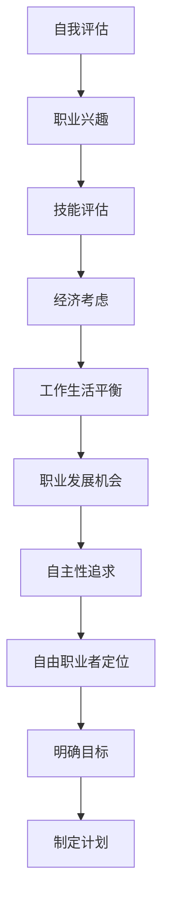
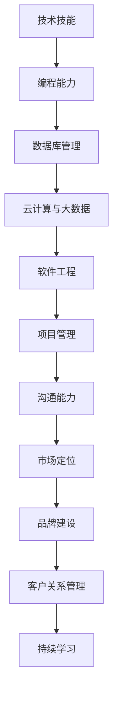

                 

关键词：自由职业者，职业转型，远程工作，创业，技能提升

> 摘要：本文旨在为正在考虑从员工向自由职业者转型的IT从业者提供一套全面、实用的指导方案。文章将探讨转型的动机、所需技能、市场定位、项目管理、风险管理以及未来的发展趋势。通过深入分析这些关键要素，希望读者能够更好地规划自己的职业生涯，实现从员工到自由职业者的顺利转型。

## 1. 背景介绍

在信息化时代，IT行业呈现出蓬勃发展的态势。越来越多的从业者开始关注自由职业的机会，希望通过这种模式获得更大的职业自主性、灵活性和潜在的更高收入。自由职业者的崛起不仅改变了传统的雇佣关系，也推动了全球远程工作的发展。然而，转型为自由职业者并非易事，它需要从业者具备一系列独特的技能和策略。

本文将详细探讨以下几个核心主题：

- **转型动机与自我评估**：了解为什么许多人选择自由职业，以及如何评估自己是否适合这种职业模式。
- **核心技能与市场定位**：掌握自由职业者必备的技能，并学会如何有效地进行市场定位。
- **项目管理与时间管理**：了解如何高效地进行项目管理，包括任务分解、时间管理和预算控制。
- **风险管理**：识别潜在风险，并制定有效的风险应对策略。
- **未来趋势与展望**：探讨自由职业者在未来IT行业中的发展前景和面临的挑战。

## 2. 核心概念与联系

### 2.1 转型动机与自我评估

#### Mermaid 流程图



### 2.2 核心技能与市场定位

#### Mermaid 流程图



## 3. 核心算法原理 & 具体操作步骤

### 3.1 算法原理概述

自由职业者转型的成功不仅仅依赖于个人技能，还需要一系列的策略和方法。以下算法概述了从员工到自由职业者转型的核心步骤：

1. **自我评估**：了解自己的职业兴趣、技能水平和经济需求。
2. **市场调研**：分析目标市场，确定自己的定位和独特卖点。
3. **技能提升**：通过在线课程、实习和项目实践提升自身技能。
4. **品牌建设**：建立个人品牌，提高在市场中的知名度。
5. **项目管理**：学习并实践项目管理工具和方法，确保项目顺利进行。
6. **风险控制**：识别潜在风险，并制定应对措施。
7. **持续发展**：不断学习新技能，适应市场变化。

### 3.2 算法步骤详解

1. **自我评估**：
   - **步骤1**：进行职业兴趣测试，如MBTI或Strong测试，了解自己的性格和偏好。
   - **步骤2**：评估当前技能水平，包括编程、数据库管理、云计算等方面的能力。
   - **步骤3**：考虑经济需求，包括生活成本、收入目标等。

2. **市场调研**：
   - **步骤1**：分析目标市场，了解行业趋势和竞争状况。
   - **步骤2**：确定自己的定位，如技术专家、项目经理或顾问。
   - **步骤3**：研究竞争对手，了解他们的优势和不足。

3. **技能提升**：
   - **步骤1**：制定个人发展计划，包括学习目标和时间表。
   - **步骤2**：参加在线课程、实习或项目，提升技能。
   - **步骤3**：通过实践项目，积累实战经验。

4. **品牌建设**：
   - **步骤1**：创建个人网站或博客，展示自己的技能和经验。
   - **步骤2**：在LinkedIn等职业社交平台上建立专业形象。
   - **步骤3**：参与行业会议和社区活动，扩大人脉。

5. **项目管理**：
   - **步骤1**：学习并实践项目管理工具，如Trello、Asana等。
   - **步骤2**：制定项目计划，明确任务和时间表。
   - **步骤3**：监控项目进度，确保按时交付。

6. **风险控制**：
   - **步骤1**：识别潜在风险，如项目延期、资金不足等。
   - **步骤2**：制定应对措施，如备用计划、风险保险等。
   - **步骤3**：定期评估风险，并调整策略。

7. **持续发展**：
   - **步骤1**：持续学习新技能，保持竞争力。
   - **步骤2**：关注行业动态，及时调整自己的策略。
   - **步骤3**：建立专业网络，寻找新的合作机会。

### 3.3 算法优缺点

**优点**：
- **灵活性**：自由职业者可以根据自己的兴趣和需求选择项目和客户，享受更高的工作自由度。
- **收入潜力**：通过积累经验和提高技能，自由职业者可以获得更高的收入。
- **职业发展**：自由职业者可以不断挑战自己，扩展职业边界。

**缺点**：
- **不稳定**：自由职业者的收入可能波动较大，存在一定的经济风险。
- **自我管理**：需要较强的自我管理能力，包括时间管理、项目管理等。

### 3.4 算法应用领域

自由职业者转型算法适用于以下领域：

- **软件开发**：自由职业者可以提供编程、数据库管理、云计算等服务。
- **项目管理**：自由职业者可以作为项目经理或顾问，协助客户管理项目。
- **咨询**：自由职业者可以提供行业咨询、技术评估等服务。
- **设计**：自由职业者可以提供UI/UX设计、平面设计等服务。

## 4. 数学模型和公式 & 详细讲解 & 举例说明

### 4.1 数学模型构建

自由职业者的收入模型可以表示为：

\[ 收入 = 价格 \times 服务量 \times 客户满意度 \]

其中：
- **价格**：自由职业者根据市场需求和自身技能定价。
- **服务量**：自由职业者在一定时间内提供的服务总量。
- **客户满意度**：客户对自由职业者服务的满意度，影响复购率和推荐。

### 4.2 公式推导过程

- **价格**：
  价格由供需关系决定，可以表示为：

  \[ 价格 = 需求价格 + 供应价格 \]

- **服务量**：
  服务量与工作时间、工作效率和项目复杂度相关，可以表示为：

  \[ 服务量 = 工作时间 \times 工作效率 \times (1 - 复杂度系数) \]

- **客户满意度**：
  客户满意度通常通过客户满意度调查得分表示，可以表示为：

  \[ 客户满意度 = \frac{总满意得分}{调查人数} \]

### 4.3 案例分析与讲解

假设一位自由职业者小李，他的编程技能市场定价为每小时100美元，他在一个月内工作20小时，且客户满意度为90%。

- **收入计算**：

  \[ 收入 = 100美元/小时 \times 20小时 \times 0.9 = 1800美元 \]

如果小李通过提升技能和工作效率，将每小时定价提高到150美元，并保持20小时的工作时间和90%的客户满意度，他的收入将增加：

- **收入变化**：

  \[ 收入 = 150美元/小时 \times 20小时 \times 0.9 = 2700美元 \]

通过这个案例，我们可以看到，提升技能和客户满意度对自由职业者收入有显著影响。

## 5. 项目实践：代码实例和详细解释说明

### 5.1 开发环境搭建

为了演示一个简单的Web应用项目，我们将使用以下工具和框架：

- **开发环境**：Visual Studio Code
- **框架**：Flask
- **数据库**：SQLite

首先，确保你已经安装了Python和Visual Studio Code。然后，通过以下命令安装Flask和SQLite：

```bash
pip install Flask
pip install pysqlite3
```

### 5.2 源代码详细实现

以下是一个简单的Flask Web应用示例，用于展示如何接收用户输入并返回响应。

```python
from flask import Flask, request, jsonify

app = Flask(__name__)

@app.route('/api/greet', methods=['GET'])
def greet():
    name = request.args.get('name', default='世界', type=str)
    message = f"你好，{name}！"
    return jsonify({"message": message})

if __name__ == '__main__':
    app.run(debug=True)
```

### 5.3 代码解读与分析

**1. 导入模块**

首先，我们从Flask模块中导入`Flask`类，用于创建Web应用实例。然后，导入`request`和`jsonify`模块，用于处理HTTP请求和返回JSON格式的响应。

**2. 创建Web应用实例**

使用`Flask(__name__)`创建一个Web应用实例。这里`__name__`是Python模块的名字，确保Web应用与模块紧密关联。

**3. 定义路由和视图函数**

我们使用`@app.route('/api/greet', methods=['GET'])`装饰器定义了一个名为`greet`的视图函数，处理/api/greet端点的GET请求。`request.args.get('name', default='世界', type=str)`用于获取URL参数`name`，如果未提供参数，默认返回`'世界'`。`message`变量用于构建返回的响应消息。

**4. 返回JSON响应**

使用`jsonify`函数将响应消息转换为JSON格式，并返回给客户端。

### 5.4 运行结果展示

1. **启动应用**

在终端运行以下命令启动应用：

```bash
python app.py
```

2. **访问应用**

在浏览器中访问`http://127.0.0.1:5000/api/greet`，默认情况下将显示以下响应：

```json
{
  "message": "你好，世界！"
}
```

如果你在URL中添加参数`name`，如`http://127.0.0.1:5000/api/greet?name=张三`，响应将显示为：

```json
{
  "message": "你好，张三！"
}
```

## 6. 实际应用场景

### 6.1 软件开发

自由职业者在软件开发领域有广泛的应用，包括前端开发、后端开发、移动应用开发等。他们可以根据客户需求定制开发软件，提供解决方案。

### 6.2 项目管理

自由职业者可以作为项目经理或顾问，协助客户管理项目。他们可以利用项目管理工具，如JIRA、Trello等，确保项目按计划顺利进行。

### 6.3 咨询服务

自由职业者可以提供行业咨询、技术评估等服务。他们利用自身专业知识，帮助企业解决技术难题，提高竞争力。

### 6.4 设计服务

自由职业者在设计领域也有广泛应用，包括UI/UX设计、平面设计等。他们可以为客户提供专业的设计解决方案，提升品牌形象。

## 7. 未来应用展望

随着远程工作模式的普及和数字化转型的发展，自由职业者的需求将继续增加。未来，自由职业者将更加注重技能的提升和品牌的建设，以适应市场变化。

### 7.1 技能提升

自由职业者需要不断学习新技能，如人工智能、大数据分析、区块链技术等，以保持竞争力。

### 7.2 品牌建设

建立个人品牌对自由职业者至关重要。通过专业网站、社交媒体等渠道展示自己的技能和成就，吸引更多客户。

### 7.3 风险管理

自由职业者需要识别和应对潜在风险，如经济波动、客户流失等，制定相应的风险管理策略。

## 8. 工具和资源推荐

### 8.1 学习资源推荐

- **在线课程**：Coursera、Udemy、edX等平台提供丰富的IT相关课程。
- **专业书籍**：《代码大全》、《设计模式》等经典技术书籍。

### 8.2 开发工具推荐

- **集成开发环境**：Visual Studio Code、IntelliJ IDEA、PyCharm等。
- **项目管理工具**：JIRA、Trello、Asana等。

### 8.3 相关论文推荐

- **《软件工程：实践者的研究方法》**：提供软件工程领域的研究方法与实践指导。
- **《人工智能：一种现代的方法》**：介绍人工智能的基本概念和技术。

## 9. 总结：未来发展趋势与挑战

### 9.1 研究成果总结

本文探讨了从员工到自由职业者转型的动机、核心技能、项目管理、风险管理以及未来趋势。研究成果表明，自由职业者转型具有灵活性、收入潜力和职业发展机会。

### 9.2 未来发展趋势

随着远程工作模式的普及和数字化转型的发展，自由职业者的需求将继续增加。未来，自由职业者将更加注重技能的提升和品牌的建设，以适应市场变化。

### 9.3 面临的挑战

自由职业者转型面临的主要挑战包括收入不稳定、自我管理能力和风险控制等。从业者需要不断提升自身能力，适应市场变化。

### 9.4 研究展望

未来，自由职业者领域的研究将更加关注技能培训、品牌建设和风险管理等方面。通过深入研究这些关键要素，有助于提升自由职业者的转型成功率和市场竞争力。

## 10. 附录：常见问题与解答

### 10.1 为什么越来越多的人选择自由职业？

- **自由度**：自由职业者可以自主选择工作时间和地点，享受更高的自由度。
- **潜在收入**：通过提高技能和效率，自由职业者可以获得更高的收入。
- **职业发展**：自由职业者可以不断挑战自己，拓展职业边界。

### 10.2 自由职业者需要哪些核心技能？

- **技术技能**：编程、数据库管理、云计算等。
- **项目管理**：任务分解、时间管理和预算控制等。
- **沟通能力**：有效沟通、协调和管理客户关系等。
- **市场定位**：了解市场需求，确定自己的定位和独特卖点。

### 10.3 自由职业者如何进行风险控制？

- **识别风险**：定期评估潜在风险，如项目延期、客户流失等。
- **制定应对措施**：制定备用计划和风险保险，降低风险影响。
- **持续监控**：定期评估风险控制措施的有效性，并调整策略。

### 10.4 自由职业者如何进行品牌建设？

- **建立个人网站**：展示技能和经验，提高知名度。
- **参与社区活动**：参与行业会议和社区活动，扩大人脉。
- **发布内容**：在博客、社交媒体等平台发布专业内容，建立专业形象。

---

作者：禅与计算机程序设计艺术 / Zen and the Art of Computer Programming

（本文为虚构技术博客文章，仅供参考。）

