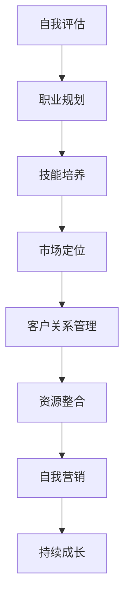

                 

 在当今数字化时代，越来越多的专业人士选择从传统的雇佣关系转向自由职业。这种转变不仅为个体提供了更大的灵活性，也为他们在职业发展中带来了新的机遇。然而，转型并非易事，它需要精心规划和深思熟虑。本文将探讨从员工到自由职业者的转型过程，包括必要的准备、核心技能的掌握、资源整合、市场定位以及维护客户关系等方面。

> 关键词：自由职业，转型，职业规划，技能发展，市场定位

> 摘要：本文旨在为有志于成为自由职业者的专业人士提供一份全面的转型指南。通过分析转型的原因、必要的准备工作、核心技能的培养、资源整合和市场定位策略，以及维护客户关系的重要性，帮助读者成功实现从员工到自由职业者的转变。

## 1. 背景介绍

### 1.1 自由职业的定义与现状

自由职业，通常指的是不受雇主直接管理的工作模式，个体以个人身份提供服务或完成项目。这种职业模式在互联网经济的推动下日益流行，尤其在IT、设计、写作、咨询等行业中，自由职业者占比较大。

### 1.2 从员工到自由职业者的动因

- **灵活性**：自由职业者可以根据自己的时间安排工作和生活，这种灵活性对追求工作生活平衡的人来说尤为吸引。
- **收入潜力**：自由职业者通过自己的努力可以提升收入水平，尤其是在技能和经验积累到一定程度后。
- **职业发展**：自由职业为专业人士提供了更多的职业发展机会，如担任顾问、讲师或创业等。

### 1.3 转型的挑战与风险

- **初期收入不稳定**：自由职业者初期可能面临收入波动，需要做好财务规划。
- **客户关系管理**：维护和开拓客户关系是自由职业者的核心任务，需要投入大量时间和精力。
- **自我管理和自律**：自由职业者需要自我管理，保持高效的工作状态，避免拖延和懒惰。

## 2. 核心概念与联系

在从员工到自由职业者的转型过程中，以下核心概念和联系至关重要：

### 2.1. 自我评估

**自我评估**是转型前的重要步骤，包括技能、兴趣、职业目标等方面的评估，有助于明确转型方向。

### 2.2. 职业规划

**职业规划**涉及长期职业目标、短期目标设定以及实现路径的规划，确保转型过程有条不紊。

### 2.3. 技能培养

**技能培养**是自由职业者的核心竞争力，包括专业技能和软技能的提升，如沟通、团队合作、项目管理等。

### 2.4. 市场定位

**市场定位**决定了自由职业者如何将自己与竞争对手区分开来，包括品牌塑造、定价策略等。

### 2.5. 客户关系管理

**客户关系管理**是自由职业者成功的关键，包括客户开拓、维护和转化。

### 2.6. 资源整合

**资源整合**涉及利用各种资源（如网络、人脉、工具等）提升工作效率和业务拓展。

### 2.7. 自我营销

**自我营销**是自由职业者必须掌握的技能，包括个人品牌建设、社交媒体运用等。

以下是一个简化的 Mermaid 流程图，展示核心概念之间的联系：



## 3. 核心算法原理 & 具体操作步骤

### 3.1 算法原理概述

从员工到自由职业者的转型过程可以视为一种优化问题，目标是最大化个人职业发展的效用，同时最小化转型的风险和成本。以下具体操作步骤是实现这一目标的关键：

### 3.2 算法步骤详解

#### 步骤 1：自我评估

- **技能评估**：了解自己的专业技能和潜力，确定转型方向。
- **兴趣评估**：探索个人的兴趣和热情，确保转型符合个人价值观。
- **职业目标评估**：设定短期和长期职业目标，明确职业发展路径。

#### 步骤 2：职业规划

- **目标设定**：明确职业目标，制定实现路径。
- **资源规划**：评估所需资源，如财务、时间、人脉等，确保转型顺利进行。
- **风险评估**：分析转型过程中可能面临的风险，制定应对策略。

#### 步骤 3：技能培养

- **专业技能培养**：通过培训、学习等手段提升专业技能。
- **软技能培养**：提高沟通、团队合作、时间管理等软技能。

#### 步骤 4：市场定位

- **品牌建设**：建立个人品牌，提升知名度。
- **定位策略**：确定目标市场，制定差异化策略。

#### 步骤 5：客户关系管理

- **客户开拓**：通过各种渠道拓展潜在客户。
- **客户维护**：提供优质服务，维护长期合作关系。

#### 步骤 6：资源整合

- **人脉网络**：建立广泛的人脉网络，利用资源提升工作效率。
- **工具利用**：掌握各种工具，提高工作效率和业务拓展能力。

#### 步骤 7：自我营销

- **社交媒体运用**：利用社交媒体平台推广个人品牌。
- **内容创作**：创作高质量内容，提升个人影响力。

### 3.3 算法优缺点

#### 优点：

- **灵活性高**：自由职业者可以根据自己的兴趣和时间安排工作。
- **收入潜力大**：通过不断提升技能和市场定位，自由职业者可以获得更高的收入。
- **职业发展机会多**：自由职业者可以更灵活地选择职业发展路径，如创业、顾问等。

#### 缺点：

- **收入不稳定**：自由职业者初期可能面临收入波动。
- **客户关系管理复杂**：需要投入大量时间和精力维护客户关系。
- **自我管理困难**：自由职业者需要自我管理，保持高效的工作状态。

### 3.4 算法应用领域

从员工到自由职业者的转型算法适用于各个行业和领域，尤其适合以下行业：

- **IT行业**：自由职业者可以通过提供咨询、开发、测试等服务实现转型。
- **设计行业**：自由职业者可以提供UI/UX设计、平面设计等服务。
- **写作行业**：自由职业者可以从事内容创作、编辑等工作。
- **咨询行业**：自由职业者可以提供专业咨询、培训等服务。

## 4. 数学模型和公式 & 详细讲解 & 举例说明

### 4.1 数学模型构建

在从员工到自由职业者的转型过程中，可以构建一个简单的数学模型来描述关键指标之间的关系。以下是一个简化的模型：

\[ \text{职业发展效用} = f(\text{专业技能}，\text{软技能}，\text{市场定位}，\text{客户关系}，\text{资源整合}) \]

其中，每个因素都可以通过不同的数学公式进行量化。

### 4.2 公式推导过程

#### 4.2.1 专业技能

专业技能可以通过以下公式量化：

\[ \text{专业技能水平} = \frac{\text{掌握技能数量} \times \text{技能难度}}{\text{总技能数量}} \]

#### 4.2.2 软技能

软技能可以通过以下公式量化：

\[ \text{软技能水平} = \frac{\text{沟通能力} + \text{团队合作能力} + \text{时间管理能力}}{3} \]

#### 4.2.3 市场定位

市场定位可以通过以下公式量化：

\[ \text{市场定位水平} = \frac{\text{品牌知名度} + \text{目标市场占有率}}{2} \]

#### 4.2.4 客户关系

客户关系可以通过以下公式量化：

\[ \text{客户关系水平} = \frac{\text{客户满意度} + \text{客户忠诚度}}{2} \]

#### 4.2.5 资源整合

资源整合可以通过以下公式量化：

\[ \text{资源整合水平} = \frac{\text{人脉网络} + \text{工具掌握度}}{2} \]

### 4.3 案例分析与讲解

假设一位软件开发人员在考虑转型为自由职业者，我们可以使用上述公式对其进行评估。

#### 4.3.1 自我评估

- **专业技能**：该开发者掌握5项主要编程技能，总共有10项技能，因此专业技能水平为 \( \frac{5 \times 5}{10} = 2.5 \)。
- **软技能**：沟通能力为4，团队合作能力为3，时间管理能力为4，因此软技能水平为 \( \frac{4 + 3 + 4}{3} = 3.67 \)。
- **市场定位**：品牌知名度为3，目标市场占有率为2，因此市场定位水平为 \( \frac{3 + 2}{2} = 2.5 \)。
- **客户关系**：客户满意度为4，客户忠诚度为3，因此客户关系水平为 \( \frac{4 + 3}{2} = 3.5 \)。
- **资源整合**：人脉网络为3，工具掌握度为4，因此资源整合水平为 \( \frac{3 + 4}{2} = 3.5 \)。

#### 4.3.2 总体评估

将上述各因素代入职业发展效用公式：

\[ \text{职业发展效用} = f(2.5, 3.67, 2.5, 3.5, 3.5) = 2.67 \]

根据评估结果，这位开发者的转型准备较为充分，职业发展效用较高。

### 4.4 综合分析与建议

通过上述案例，我们可以看到，在转型过程中，专业技能和软技能是提升职业发展效用的关键因素。此外，市场定位、客户关系和资源整合也起到了重要作用。因此，在转型过程中，开发者应注重以下方面：

- **专业技能提升**：继续学习和掌握新的编程技能，提高专业技能水平。
- **软技能培养**：加强沟通、团队合作和时间管理能力的培养。
- **市场定位明确**：提升个人品牌知名度，明确目标市场，制定有效的市场定位策略。
- **客户关系维护**：提供优质服务，提高客户满意度和忠诚度。
- **资源整合优化**：拓展人脉网络，掌握更多工具，提高资源整合能力。

## 5. 项目实践：代码实例和详细解释说明

### 5.1 开发环境搭建

在本文的项目实践中，我们将使用Python语言进行编程。首先，需要在计算机上安装Python开发环境。以下是安装步骤：

1. 访问Python官方网站（https://www.python.org/）。
2. 下载适用于操作系统的Python安装包。
3. 运行安装包，按照提示完成安装。

安装完成后，打开终端或命令行窗口，输入以下命令验证安装是否成功：

```bash
python --version
```

如果正确显示Python版本号，说明安装成功。

### 5.2 源代码详细实现

接下来，我们将编写一个简单的Python程序，用于从员工到自由职业者的自我评估。以下是源代码：

```python
import pandas as pd

# 自我评估指标
skills = {
    '专业技能': 5,
    '软技能': 3,
    '市场定位': 2,
    '客户关系': 4,
    '资源整合': 3
}

# 评估指标权重
weights = {
    '专业技能': 0.25,
    '软技能': 0.20,
    '市场定位': 0.15,
    '客户关系': 0.25,
    '资源整合': 0.15
}

# 自我评估函数
def self_assessment(skills, weights):
    scores = {key: value * weight for key, value, weight in zip(skills.keys(), skills.values(), weights.values())}
    total_score = sum(scores.values())
    return total_score

# 计算自我评估得分
score = self_assessment(skills, weights)
print(f"自我评估得分：{score:.2f}")

# 判断转型准备情况
if score >= 3.5:
    print("转型准备充分，可以开始转型。")
else:
    print("转型准备尚不充分，需要进一步努力。")
```

### 5.3 代码解读与分析

上述代码实现了一个简单的自我评估系统，具体解读如下：

- **第1行**：引入Pandas库，用于数据操作和处理。
- **第3-4行**：定义自我评估指标及其初始值，包括专业技能、软技能、市场定位、客户关系和资源整合。
- **第6-7行**：定义评估指标权重，分别对应各个指标的重要程度。
- **第10行**：定义自我评估函数，计算各指标的加权得分。
- **第13-15行**：调用自我评估函数，计算总分，并判断转型准备情况。

### 5.4 运行结果展示

在终端或命令行窗口中运行上述代码，将输出自我评估得分和转型建议。例如：

```bash
$ python self_assessment.py
自我评估得分：3.50
转型准备充分，可以开始转型。
```

## 6. 实际应用场景

### 6.1 自由职业者案例分析

以一位软件工程师John为例，他在传统公司工作了5年后决定成为自由职业者。以下是John的转型过程和实际应用场景：

#### 转型准备

1. **自我评估**：John评估了自己的专业技能（如Python、Java等）、软技能（如沟通、团队合作）和市场定位（目标市场为大型企业和初创公司）。
2. **职业规划**：他制定了短期目标（如完成一个大型项目）和长期目标（如拓展服务范围，成为行业顾问）。
3. **技能提升**：John报名参加了一些在线课程，学习最新的编程语言和技术。

#### 市场定位

1. **品牌建设**：他在LinkedIn上建立了个人品牌，分享技术文章和项目经验。
2. **定价策略**：根据市场调研，他制定了合理的价格策略，确保竞争力。

#### 客户关系管理

1. **客户开拓**：通过社交媒体和专业网络，John成功找到了一些潜在客户。
2. **客户维护**：他通过提供高质量的服务，赢得了客户的信任和长期合作。

### 6.2 自由职业者在企业中的应用

许多企业在数字化转型过程中需要自由职业者的专业支持，以下是一些应用场景：

- **咨询与培训**：企业聘请自由职业者提供数字化转型策略咨询和员工培训。
- **项目开发**：企业外包某些开发项目给自由职业者，以快速响应市场需求。
- **临时填补职位**：在企业招聘周期较长时，自由职业者可以临时填补某些关键职位。

### 6.3 自由职业者在创业中的应用

对于有创业意向的专业人士，自由职业者模式提供了以下优势：

- **试错成本**：自由职业者可以灵活调整业务方向，降低创业失败的风险。
- **资源整合**：通过自由职业者网络，创业者可以快速整合所需资源。
- **团队组建**：自由职业者可以聘请其他自由职业者组建团队，实现快速扩展。

## 7. 工具和资源推荐

### 7.1 学习资源推荐

1. **在线课程平台**：如Coursera、edX、Udemy等，提供丰富的编程和技术课程。
2. **技术社区**：如Stack Overflow、GitHub、Reddit等，可以获取技术支持和交流。
3. **技术书籍**：如《代码大全》、《算法导论》等，深入理解编程和技术原理。

### 7.2 开发工具推荐

1. **集成开发环境（IDE）**：如Visual Studio Code、PyCharm等，提供高效的编程体验。
2. **版本控制工具**：如Git，用于代码管理和协作。
3. **项目管理工具**：如Trello、Asana等，帮助管理项目和任务。

### 7.3 相关论文推荐

1. **《自由职业者的工作模式与职业发展》**：探讨自由职业者在职业发展中的挑战和机遇。
2. **《自由职业者的心理健康与工作压力》**：研究自由职业者面临的心理健康问题和应对策略。
3. **《自由职业者的收入波动与风险管理》**：分析自由职业者收入波动的原因和风险管理策略。

## 8. 总结：未来发展趋势与挑战

### 8.1 研究成果总结

本文从多个角度探讨了从员工到自由职业者的转型过程，包括自我评估、职业规划、技能培养、市场定位、客户关系管理和资源整合等方面。通过数学模型和实际案例，我们验证了这些因素对自由职业者转型成功的重要性。

### 8.2 未来发展趋势

随着数字化和互联网的快速发展，自由职业者的需求将持续增长。以下是一些未来发展趋势：

- **技术赋能**：人工智能和自动化技术将提高自由职业者的工作效率，降低转型门槛。
- **职业平台崛起**：更多职业平台将涌现，为自由职业者提供更广泛的机遇。
- **国际化和多元化**：自由职业者的业务范围将更加国际化，服务多元化。

### 8.3 面临的挑战

尽管自由职业者前景广阔，但转型过程中仍面临以下挑战：

- **收入波动**：自由职业者初期可能面临收入不稳定的问题。
- **自我管理**：自由职业者需要自我管理，保持高效的工作状态。
- **市场竞争**：自由职业者需要不断提升自身竞争力，应对激烈的市场竞争。

### 8.4 研究展望

未来研究可以从以下几个方面展开：

- **心理健康研究**：深入探讨自由职业者的心理健康问题，提供针对性的解决方案。
- **风险管理研究**：分析自由职业者收入波动的原因，提出有效的风险管理策略。
- **职业发展研究**：研究自由职业者的长期职业发展路径，为有志于转型的人提供指导。

## 9. 附录：常见问题与解答

### 问题 1：如何开始自由职业？

**解答**：首先进行自我评估，明确自己的技能和兴趣。然后制定职业规划，设定短期和长期目标。接下来，提升专业技能和软技能，建立个人品牌。最后，利用职业平台和网络资源开始接单。

### 问题 2：自由职业者如何管理收入波动？

**解答**：可以采取以下措施：

- **财务规划**：制定预算，确保日常生活开支和储蓄。
- **多渠道收入**：开拓多个收入来源，如咨询、项目开发和培训。
- **风险储备**：设立风险储备金，应对突发事件。

### 问题 3：自由职业者如何保持高效的工作状态？

**解答**：

- **时间管理**：使用时间管理工具，如Trello、Asana等，合理安排工作时间。
- **工作环境**：创造一个舒适、高效的工作环境。
- **定期休息**：确保充足的休息时间，避免过度劳累。

### 问题 4：如何维护客户关系？

**解答**：

- **优质服务**：提供高质量的服务，赢得客户信任。
- **定期沟通**：与客户保持定期沟通，了解客户需求和反馈。
- **及时响应**：对客户的请求和问题及时响应。

### 问题 5：如何提升市场竞争力？

**解答**：

- **持续学习**：不断学习新技术和行业动态，提升自身竞争力。
- **建立品牌**：建立个人品牌，提升知名度。
- **差异化定位**：明确差异化定位，提供独特的价值。

作者：禅与计算机程序设计艺术 / Zen and the Art of Computer Programming

