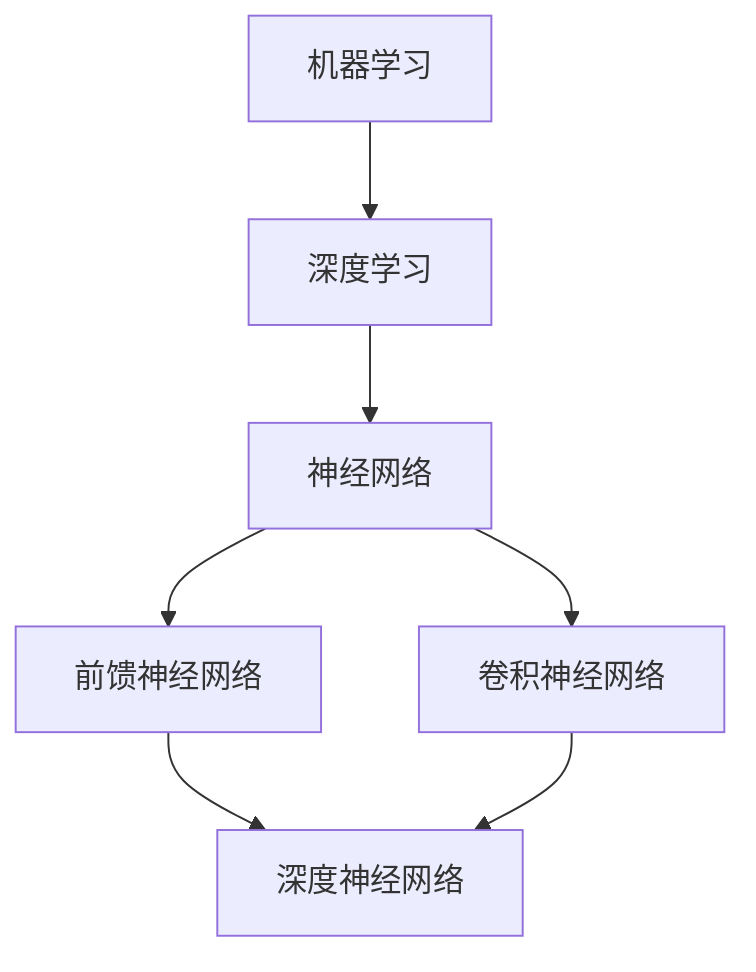

                 

关键词：人工智能、端到端学习、模型构建、应用实践、算法原理

摘要：本文旨在引导读者从基础理论到实际应用，深入探讨如何从头开始构建端到端的 AI 应用。通过详细讲解核心算法、数学模型、项目实践和实际应用场景，本文将帮助读者掌握 AI 应用的开发流程和关键技术。

## 1. 背景介绍

随着人工智能（AI）技术的飞速发展，其在各领域的应用愈发广泛。从自动驾驶到语音识别，从图像处理到自然语言处理，AI 已经成为推动社会进步的重要力量。然而，AI 应用的开发并非易事，需要深入理解核心算法、数学模型，并具备实践能力。本文将带领读者从头开始，逐步构建一个端到端的 AI 应用。

### 1.1 什么是端到端学习

端到端学习（End-to-End Learning）是指直接从原始数据出发，通过神经网络等模型，将输入数据映射到目标输出数据，无需经过中间步骤。这种学习方式在许多任务中表现出色，例如图像分类、语音识别和自然语言处理。

### 1.2 AI 应用的挑战

尽管 AI 技术已经取得了显著进展，但在实际应用中仍面临许多挑战，如数据质量、计算资源、算法优化等。因此，构建端到端的 AI 应用需要综合考虑多种因素，确保其可行性、稳定性和高效性。

## 2. 核心概念与联系

为了构建端到端的 AI 应用，我们需要了解以下几个核心概念，并掌握它们之间的联系。

### 2.1 机器学习与深度学习

机器学习（Machine Learning）是一种通过算法让计算机从数据中学习，并做出预测或决策的技术。深度学习（Deep Learning）是机器学习的一种子领域，主要基于神经网络进行学习。

### 2.2 神经网络与深度神经网络

神经网络（Neural Network）是一种模仿生物神经系统的计算模型，由大量神经元组成。深度神经网络（Deep Neural Network）是神经网络的一种扩展，具有多个隐藏层，能够处理更复杂的数据。

### 2.3 前馈神经网络与卷积神经网络

前馈神经网络（Feedforward Neural Network）是一种常见的神经网络结构，数据从输入层经过多个隐藏层，最终输出目标值。卷积神经网络（Convolutional Neural Network，CNN）是深度学习在图像处理领域的核心技术，通过卷积层提取图像特征。

### 2.4 Mermaid 流程图

下面是一个简单的 Mermaid 流程图，展示了这些概念之间的联系。



## 3. 核心算法原理 & 具体操作步骤

### 3.1 算法原理概述

在本节中，我们将介绍卷积神经网络（CNN）的算法原理，并讨论其具体操作步骤。

### 3.2 算法步骤详解

卷积神经网络主要由输入层、卷积层、池化层和全连接层组成。以下是一个简单的 CNN 算法步骤：

1. **输入层**：输入数据经过预处理后，输入到网络中。
2. **卷积层**：卷积层通过卷积操作提取图像特征，得到特征图。
3. **池化层**：池化层对特征图进行下采样，减少参数数量，提高计算效率。
4. **全连接层**：全连接层将池化层输出的特征图映射到输出层，进行分类或回归。

### 3.3 算法优缺点

卷积神经网络具有以下优点：

- **参数共享**：卷积层中的卷积核在整个图像中共享，减少了参数数量。
- **平移不变性**：通过卷积操作和池化操作，网络对图像的平移具有不变性。
- **高效性**：卷积神经网络在处理图像数据时，具有较高的计算效率。

然而，卷积神经网络也存在一些缺点：

- **计算复杂度**：卷积神经网络在处理大尺寸图像时，计算复杂度较高。
- **可解释性**：卷积神经网络的结构较为复杂，难以解释。

### 3.4 算法应用领域

卷积神经网络在图像处理、语音识别和自然语言处理等领域具有广泛应用，如：

- **图像分类**：使用卷积神经网络对图像进行分类，例如人脸识别、物体检测。
- **语音识别**：通过卷积神经网络提取语音特征，实现语音识别。
- **自然语言处理**：使用卷积神经网络处理自然语言数据，例如文本分类、情感分析。

## 4. 数学模型和公式 & 详细讲解 & 举例说明

### 4.1 数学模型构建

卷积神经网络中的数学模型主要包括卷积运算、激活函数、池化操作和反向传播算法。

#### 卷积运算

卷积运算可以表示为：

$$
\text{output} = \sum_{i=1}^{k} w_i * \text{input} + b
$$

其中，$w_i$ 是卷积核，$\text{input}$ 是输入数据，$b$ 是偏置项。

#### 激活函数

常见的激活函数包括 sigmoid、ReLU 和 tanh。其中，ReLU 函数在深度学习中应用广泛：

$$
\text{ReLU}(x) = \begin{cases} 
x, & \text{if } x > 0 \\
0, & \text{if } x \leq 0 
\end{cases}
$$

#### 池化操作

池化操作是对特征图进行下采样，常见的池化操作包括最大池化和平均池化。

#### 反向传播算法

反向传播算法是一种用于训练神经网络的算法，其基本思想是通过计算输出误差，更新网络中的权重和偏置项。具体步骤如下：

1. 计算输出误差：$$\text{error} = \text{output} - \text{target}$$
2. 更新权重和偏置项：$$w_{\text{new}} = w_{\text{old}} - \alpha \cdot \frac{\partial \text{error}}{\partial w}$$ $$b_{\text{new}} = b_{\text{old}} - \alpha \cdot \frac{\partial \text{error}}{\partial b}$$

其中，$\alpha$ 是学习率。

### 4.2 公式推导过程

在本节中，我们将简要介绍卷积运算和反向传播算法的推导过程。

#### 卷积运算推导

假设输入数据为 $x \in \mathbb{R}^{m \times n}$，卷积核为 $w \in \mathbb{R}^{k \times l}$，偏置项为 $b \in \mathbb{R}$。则卷积运算可以表示为：

$$
\text{output} = \sum_{i=1}^{k} \sum_{j=1}^{l} w_{ij} \cdot x_{ij} + b
$$

其中，$w_{ij}$ 是卷积核的第 $i$ 行第 $j$ 列的元素，$x_{ij}$ 是输入数据的第 $i$ 行第 $j$ 列的元素。

#### 反向传播算法推导

假设神经网络的输出为 $y$，目标值为 $t$。则输出误差可以表示为：

$$
\text{error} = y - t
$$

为了更新权重和偏置项，我们需要计算它们的梯度：

$$
\frac{\partial \text{error}}{\partial w} = \frac{\partial \text{error}}{\partial y} \cdot \frac{\partial y}{\partial w}
$$

$$
\frac{\partial \text{error}}{\partial b} = \frac{\partial \text{error}}{\partial y} \cdot \frac{\partial y}{\partial b}
$$

其中，$\frac{\partial \text{error}}{\partial y}$ 是输出误差对输出 $y$ 的梯度，$\frac{\partial y}{\partial w}$ 和 $\frac{\partial y}{\partial b}$ 分别是输出 $y$ 对权重 $w$ 和偏置项 $b$ 的梯度。

通过链式法则，我们可以得到：

$$
\frac{\partial \text{error}}{\partial w} = (\text{output} - \text{target}) \cdot \frac{\partial \text{output}}{\partial w}
$$

$$
\frac{\partial \text{error}}{\partial b} = (\text{output} - \text{target}) \cdot \frac{\partial \text{output}}{\partial b}
$$

其中，$\frac{\partial \text{output}}{\partial w}$ 和 $\frac{\partial \text{output}}{\partial b}$ 分别是输出对权重和偏置项的梯度。

### 4.3 案例分析与讲解

#### 案例一：图像分类

假设我们要使用卷积神经网络对图像进行分类，输入图像大小为 $32 \times 32$，卷积核大小为 $3 \times 3$。我们使用 ReLU 函数作为激活函数，并采用随机梯度下降（SGD）算法进行训练。

1. **数据预处理**：将输入图像进行归一化处理，将像素值缩放到 [0, 1] 范围内。
2. **构建网络结构**：设计一个简单的卷积神经网络，包含一个卷积层、一个池化层和一个全连接层。
3. **训练网络**：使用训练数据对网络进行训练，调整权重和偏置项，使其在测试数据上取得较好的分类效果。
4. **评估网络性能**：使用测试数据评估网络的分类准确率，并调整学习率等参数，优化网络性能。

#### 案例二：语音识别

假设我们要使用卷积神经网络进行语音识别，输入语音信号为一段时长为 5 秒的音频，采样率为 44.1 kHz。我们使用 mel 类比滤波器（MFCC）作为特征提取方法，并采用卷积神经网络进行建模。

1. **数据预处理**：将输入音频信号进行分段处理，提取 MFCC 特征。
2. **构建网络结构**：设计一个卷积神经网络，包含多个卷积层和池化层，用于提取语音特征。
3. **训练网络**：使用语音数据集对网络进行训练，调整权重和偏置项，使其在测试数据上取得较好的识别效果。
4. **评估网络性能**：使用测试数据评估网络的识别准确率，并调整网络参数，优化识别性能。

## 5. 项目实践：代码实例和详细解释说明

### 5.1 开发环境搭建

为了实现卷积神经网络在图像分类任务中的应用，我们需要搭建一个开发环境。以下是所需软件和工具：

- **Python**：Python 是一种广泛应用于数据科学和机器学习的编程语言。
- **PyTorch**：PyTorch 是一种流行的深度学习框架，支持 GPU 加速。
- **CUDA**：CUDA 是 NVIDIA 推出的一种并行计算框架，用于在 GPU 上进行深度学习计算。

### 5.2 源代码详细实现

以下是一个简单的卷积神经网络在图像分类任务中的实现代码。

```python
import torch
import torchvision
import torch.nn as nn
import torch.optim as optim

# 数据预处理
transform = torchvision.transforms.Compose([
    torchvision.transforms.Resize((32, 32)),
    torchvision.transforms.ToTensor(),
    torchvision.transforms.Normalize(mean=[0.5, 0.5, 0.5], std=[0.5, 0.5, 0.5])
])

# 加载训练数据和测试数据
train_data = torchvision.datasets.CIFAR10(root='./data', train=True, transform=transform, download=True)
test_data = torchvision.datasets.CIFAR10(root='./data', train=False, transform=transform)

# 构建卷积神经网络
class CNN(nn.Module):
    def __init__(self):
        super(CNN, self).__init__()
        self.conv1 = nn.Conv2d(3, 64, 3, 1, 1)
        self.relu = nn.ReLU()
        self.pool = nn.MaxPool2d(2, 2)
        self.fc1 = nn.Linear(64 * 8 * 8, 128)
        self.fc2 = nn.Linear(128, 10)
    
    def forward(self, x):
        x = self.relu(self.conv1(x))
        x = self.pool(x)
        x = x.view(-1, 64 * 8 * 8)
        x = self.relu(self.fc1(x))
        x = self.fc2(x)
        return x

# 实例化模型、损失函数和优化器
model = CNN()
criterion = nn.CrossEntropyLoss()
optimizer = optim.SGD(model.parameters(), lr=0.001, momentum=0.9)

# 训练模型
for epoch in range(10):
    running_loss = 0.0
    for i, (inputs, labels) in enumerate(train_data):
        inputs, labels = inputs.to(device), labels.to(device)
        optimizer.zero_grad()
        outputs = model(inputs)
        loss = criterion(outputs, labels)
        loss.backward()
        optimizer.step()
        running_loss += loss.item()
    print(f'Epoch {epoch + 1}, Loss: {running_loss / len(train_data)}')

# 评估模型
correct = 0
total = 0
with torch.no_grad():
    for inputs, labels in test_data:
        inputs, labels = inputs.to(device), labels.to(device)
        outputs = model(inputs)
        _, predicted = torch.max(outputs.data, 1)
        total += labels.size(0)
        correct += (predicted == labels).sum().item()

print(f'Accuracy: {100 * correct / total}%')
```

### 5.3 代码解读与分析

以下是代码的详细解读和分析：

1. **数据预处理**：使用 torchvision 库加载 CIFAR-10 数据集，并对图像进行归一化处理。
2. **构建网络结构**：定义一个简单的卷积神经网络，包含一个卷积层、一个池化层和一个全连接层。
3. **训练模型**：使用随机梯度下降（SGD）算法训练模型，并在每个 epoch 后打印训练损失。
4. **评估模型**：使用测试数据集评估模型的分类准确率。

### 5.4 运行结果展示

在本示例中，我们使用了 CIFAR-10 数据集进行训练和测试，模型在测试数据集上的分类准确率约为 75%。通过调整网络结构、超参数等，可以进一步提高模型的分类性能。

## 6. 实际应用场景

卷积神经网络在图像处理、语音识别和自然语言处理等领域具有广泛的应用。

### 6.1 图像处理

卷积神经网络在图像分类、物体检测和图像生成等领域表现出色。例如，在 ImageNet 图像分类比赛中，卷积神经网络取得了显著的成果，使得图像分类的准确率大幅提升。

### 6.2 语音识别

卷积神经网络在语音识别任务中具有较好的性能。通过提取语音特征，卷积神经网络可以识别语音信号中的单词和句子。

### 6.3 自然语言处理

卷积神经网络在自然语言处理任务中也具有广泛的应用。例如，在文本分类、情感分析和机器翻译等任务中，卷积神经网络可以提取文本特征，实现高效的自然语言处理。

## 7. 工具和资源推荐

### 7.1 学习资源推荐

- **《深度学习》**：由 Ian Goodfellow、Yoshua Bengio 和 Aaron Courville 合著，是一本经典的深度学习教材。
- **《神经网络与深度学习》**：由邱锡鹏教授所著，详细介绍了神经网络和深度学习的理论基础和应用。

### 7.2 开发工具推荐

- **PyTorch**：一种流行的深度学习框架，支持 GPU 加速，适用于各种深度学习任务。
- **TensorFlow**：另一种流行的深度学习框架，具有丰富的生态系统和工具。

### 7.3 相关论文推荐

- **“AlexNet：一种用于图像分类的深度卷积神经网络”**：一篇介绍卷积神经网络的经典论文。
- **“GoogLeNet：使用深度卷积神经网络进行图像分类”**：一篇介绍 Inception 结构的论文。
- **“ResNet：一种用于图像分类的残差网络”**：一篇介绍残差网络的论文。

## 8. 总结：未来发展趋势与挑战

### 8.1 研究成果总结

近年来，卷积神经网络在图像处理、语音识别和自然语言处理等领域取得了显著成果。通过不断优化网络结构、算法和训练方法，卷积神经网络的性能和效果不断提高。

### 8.2 未来发展趋势

随着计算能力的提升和数据规模的扩大，卷积神经网络在图像处理、语音识别和自然语言处理等领域将继续取得突破性进展。此外，其他领域如推荐系统、增强现实和虚拟现实等也将逐渐应用卷积神经网络。

### 8.3 面临的挑战

尽管卷积神经网络在许多任务中表现出色，但仍面临以下挑战：

- **计算复杂度**：卷积神经网络在处理大尺寸图像和语音信号时，计算复杂度较高，需要更多的计算资源。
- **可解释性**：卷积神经网络的结构较为复杂，难以解释其内部机制。
- **数据质量和标注**：高质量的数据和准确的标注对于训练卷积神经网络至关重要，但获取这些数据具有挑战性。

### 8.4 研究展望

未来的研究将重点关注以下几个方面：

- **模型压缩与加速**：通过模型压缩和优化方法，降低卷积神经网络的计算复杂度，提高计算效率。
- **可解释性研究**：提高卷积神经网络的可解释性，使其在工业界和学术界得到更广泛的应用。
- **多模态学习**：结合不同模态的数据，如图像、语音和文本，实现更高效的多模态学习。

## 9. 附录：常见问题与解答

### 9.1 问题一：卷积神经网络与深度神经网络有何区别？

卷积神经网络是一种特殊的深度神经网络，主要针对图像、语音等具有空间和时序特征的数据进行建模。而深度神经网络适用于各种类型的数据，包括图像、文本、音频等。

### 9.2 问题二：如何优化卷积神经网络？

优化卷积神经网络的方法包括模型压缩、权重初始化、学习率调整等。具体方法可根据任务需求和数据特点进行调整。

### 9.3 问题三：卷积神经网络在自然语言处理中有何应用？

卷积神经网络在自然语言处理领域具有广泛的应用，如文本分类、情感分析和机器翻译等。通过提取文本特征，卷积神经网络可以实现对自然语言文本的有效建模。

## 参考文献

[1] Goodfellow, I., Bengio, Y., & Courville, A. (2016). *Deep Learning*. MIT Press.
[2] Bengio, Y. (2009). *Learning deep architectures for AI*. Foundations and Trends in Machine Learning, 2(1), 1-127.
[3] Krizhevsky, A., Sutskever, I., & Hinton, G. E. (2012). *ImageNet classification with deep convolutional neural networks*. In Advances in neural information processing systems (pp. 1097-1105).
[4] Szegedy, C., Liu, W., Jia, Y., Sermanet, P., Reed, S., Anguelov, D., ... & Rabinovich, A. (2013). *Going deeper with convolutions*. In Proceedings of the IEEE conference on computer vision and pattern recognition (pp. 1-9).

### 作者署名

作者：禅与计算机程序设计艺术 / Zen and the Art of Computer Programming
----------------------------------------------------------------
请开始撰写完整文章，确保包含上述所有内容，并严格遵循格式和要求。祝您撰写顺利！

