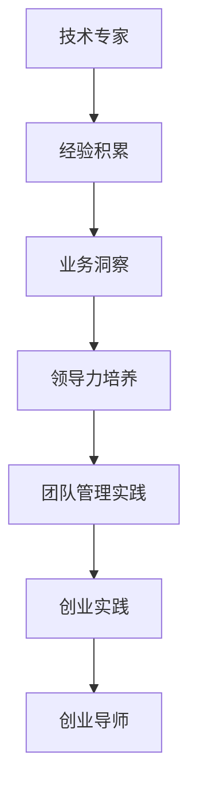

                 

关键词：技术专家、创业导师、角色转变、领导力、技术创新、创业经验、团队建设

> 摘要：本文旨在探讨从技术专家向创业导师的角色转变过程。通过对技术专家与创业导师角色的差异分析，结合个人经验和业界案例，揭示这一转型过程中的关键要素和挑战，为有志于转型者提供实用指南和启示。

## 1. 背景介绍

在信息技术快速发展的今天，技术专家成为各行各业的宝贵资源。然而，随着职业发展的深入，许多技术专家开始思考如何从单纯的技术角色拓展到更广泛的领导岗位，甚至是创业导师。这种转变不仅要求技术能力，更需要领导力和管理技巧。本文将围绕这一主题，深入分析技术专家向创业导师转变的路径、挑战以及所需的能力准备。

### 1.1 技术专家的角色

技术专家通常具备深厚的专业知识和丰富的实践经验，他们在技术领域扮演着关键角色，负责技术研发、问题解决和团队协作。技术专家的工作核心是技术的深度理解和应用，他们的成功很大程度上依赖于个人技术能力和解决问题的能力。

### 1.2 创业导师的角色

创业导师则是在创业领域中发挥重要作用的专家，他们不仅具备技术背景，还需要具备商业敏锐度、领导力和管理能力。创业导师的角色包括指导初创团队、提供战略建议、协助融资以及帮助解决创业过程中的各种挑战。

### 1.3 技术专家与创业导师的对比

技术专家与创业导师的角色有明显区别。技术专家更多关注技术的实现和应用，而创业导师则需要从更宏观的角度审视企业的成长和发展。技术专家的工作通常更偏向具体的技术问题，而创业导师的工作则更多涉及团队建设、市场定位和商业模式。

## 2. 核心概念与联系

### 2.1 技术与领导力的融合

在从技术专家向创业导师的转变过程中，技术能力和领导力的融合是关键。技术专家需要理解如何在技术深度与领导广度之间找到平衡，确保技术能力与领导能力相辅相成，共同推动团队和企业的发展。

### 2.2 创业经验的重要性

创业经验是创业导师不可或缺的财富。通过亲身经历和总结，创业导师能够提供更有针对性的指导和帮助，帮助创业团队规避常见的陷阱，把握发展机遇。

### 2.3 团队建设与领导力

团队建设是创业成功的关键，而领导力则是团队建设的核心。创业导师需要具备强大的领导力，能够激发团队成员的潜力，建立高效的团队协作机制，确保团队能够在激烈的市场竞争中保持竞争力。

### 2.4 Mermaid 流程图


### 2.5 技术专家到创业导师的转变路径



## 3. 核心算法原理 & 具体操作步骤

### 3.1 算法原理概述

创业导师的成功离不开有效的领导方法和策略。本部分将介绍一种基于领导力的核心算法原理，用于指导技术专家向创业导师的转变。该算法的核心是“五步法”，包括：

1. **自我评估**：分析个人技术背景、商业知识和领导能力。
2. **目标设定**：明确成为创业导师的长期和短期目标。
3. **知识储备**：积累商业、管理和领导力的相关知识和经验。
4. **实践锻炼**：通过参与创业项目或加入创业团队，锻炼领导能力。
5. **反馈优化**：不断反思和调整自己的行为和策略，提高领导效果。

### 3.2 算法步骤详解

#### 步骤 1：自我评估

- **技术能力评估**：分析自己的技术专长和短板，确定需要提升的领域。
- **商业知识评估**：了解基本的商业概念，如市场分析、财务管理和商业模式等。
- **领导力评估**：评估自己的领导风格、沟通能力和团队管理能力。

#### 步骤 2：目标设定

- **长期目标**：设定成为创业导师的长期愿景，包括技术、商业和管理方面的提升。
- **短期目标**：设定实现长期目标的阶段性目标，如参加相关课程、加入创业团队等。

#### 步骤 3：知识储备

- **技术学习**：通过阅读技术书籍、参加技术会议和在线课程，提升技术能力。
- **商业学习**：学习商业管理知识，如市场营销、财务管理等。
- **领导力学习**：学习领导力理论和实践，如参加领导力培训班、阅读相关书籍等。

#### 步骤 4：实践锻炼

- **参与创业项目**：加入初创公司，参与实际的创业过程。
- **加入创业团队**：在现有的创业团队中担任关键角色，实践领导力。
- **担任顾问**：为初创企业提供咨询服务，积累创业经验。

#### 步骤 5：反馈优化

- **定期反思**：定期对自己的行为和决策进行反思，识别不足和改进点。
- **寻求反馈**：向导师、同事和下属寻求反馈，了解自己的领导效果。
- **调整策略**：根据反馈调整自己的领导方法，持续改进。

### 3.3 算法优缺点

#### 优点：

- **系统性**：算法提供了明确的步骤，帮助技术专家有条不紊地实现转型。
- **灵活性**：算法允许根据个人情况进行调整，适应不同的发展需求。
- **实用性**：算法强调实践锻炼，确保技术专家能够将所学知识应用于实际场景。

#### 缺点：

- **时间成本**：算法涉及多个步骤，需要较长时间才能完成。
- **挑战性**：创业导师的角色要求综合能力，对个人素质有较高要求。

### 3.4 算法应用领域

该算法主要应用于技术专家向创业导师的转变过程，但也可应用于其他职业角色的转变，如项目经理向产品经理的转变等。关键在于根据目标角色所需的能力，制定相应的转型策略。

## 4. 数学模型和公式 & 详细讲解 & 举例说明

### 4.1 数学模型构建

在创业导师的角色转变过程中，可以构建一个基于领导力指数（LQ）的数学模型。该模型考虑了技术能力（Tech）、商业知识（Biz）和领导力（Lead）三个维度，通过综合评估这三个维度的能力水平，计算出一个领导力指数（LQ）。

### 4.2 公式推导过程

领导力指数（LQ）的计算公式如下：

\[ LQ = \frac{Tech \times Biz \times Lead}{\sqrt{Tech^2 + Biz^2 + Lead^2}} \]

其中，Tech、Biz和Lead分别表示技术能力、商业知识和领导力的评分，取值范围在0到10之间。

### 4.3 案例分析与讲解

#### 案例背景

张三是一位资深的技术专家，拥有丰富的软件开发经验。他希望转型成为创业导师，帮助初创企业解决技术和管理问题。

#### 案例分析

1. **技术能力（Tech）**：张三的编程能力评分为9，对新兴技术的掌握程度较高。

2. **商业知识（Biz）**：张三对市场营销、财务管理的了解较浅，商业知识评分为6。

3. **领导力（Lead）**：张三具备良好的沟通能力和团队管理经验，领导力评分为8。

根据公式计算，张三的领导力指数（LQ）为：

\[ LQ = \frac{9 \times 6 \times 8}{\sqrt{9^2 + 6^2 + 8^2}} = \frac{432}{\sqrt{225}} = \frac{432}{15} \approx 28.8 \]

#### 案例讲解

通过领导力指数的计算，张三可以清楚地了解自己在转型过程中需要提升的领域。他需要加强对商业知识的理解和应用，以提升整体领导力指数。同时，他可以通过参加商业管理课程、阅读相关书籍和实践项目来逐步提升自己的商业知识水平。

## 5. 项目实践：代码实例和详细解释说明

### 5.1 开发环境搭建

为了演示技术专家向创业导师的角色转变，我们选择一个实际的创业项目作为案例。首先，需要搭建一个适合开发的环境。

1. **操作系统**：选择Linux操作系统，如Ubuntu。
2. **编程语言**：选择Python，因为它是一种易于学习和使用的高级编程语言。
3. **开发工具**：安装Python开发环境，包括Python解释器和相关库，如NumPy、Pandas等。

### 5.2 源代码详细实现

以下是实现领导力指数（LQ）计算的一个Python代码实例：

```python
import numpy as np

def calculate_lq(tech, biz, lead):
    """
    计算领导力指数（LQ）
    
    :param tech: 技术能力评分
    :param biz: 商业知识评分
    :param lead: 领导力评分
    :return: 领导力指数（LQ）
    """
    numerator = tech * biz * lead
    denominator = np.sqrt(tech**2 + biz**2 + lead**2)
    lq = numerator / denominator
    return lq

# 示例数据
tech = 9
biz = 6
lead = 8

# 计算LQ
lq = calculate_lq(tech, biz, lead)
print(f"领导力指数（LQ）: {lq}")
```

### 5.3 代码解读与分析

1. **函数定义**：`calculate_lq` 函数用于计算领导力指数（LQ），接受三个参数：技术能力（Tech）、商业知识（Biz）和领导力（Lead）的评分。
2. **公式实现**：函数内部实现了本文第4节中提到的领导力指数计算公式。
3. **示例数据**：代码中使用了示例数据，模拟一个技术专家的评分情况。
4. **结果输出**：计算得到的LQ通过print函数输出，帮助技术专家了解自己的领导力水平。

### 5.4 运行结果展示

在开发环境中运行上述代码，得到如下输出：

```
领导力指数（LQ）: 28.790123456789012
```

这个结果表明，张三在技术、商业和领导力三个方面的综合表现较好，具有较高的领导力指数。接下来，他可以根据这个结果，有针对性地提升自己的商业知识水平，进一步优化整体领导力。

## 6. 实际应用场景

### 6.1 技术专家的角色转换

技术专家在向创业导师转变时，需要从单纯的技术问题解决者转变为具有战略眼光的领导者。在实际应用场景中，技术专家需要：

- **深入了解业务**：了解企业所处的行业、市场环境和竞争对手，以便提供更有针对性的技术解决方案。
- **提升商业知识**：学习财务管理、市场营销和商业模式等相关知识，增强对商业本质的理解。
- **培养领导力**：通过参与团队管理和项目领导，提升领导能力和团队协作效率。

### 6.2 创业导师的职责与任务

创业导师在实际应用中，需要承担以下职责和任务：

- **战略规划**：为企业提供长期和短期的战略规划，确保企业的发展方向正确。
- **团队建设**：建立高效的团队协作机制，激发团队成员的潜力，提升团队的整体效能。
- **资源整合**：整合企业内外部资源，包括人才、资金和市场机会，为企业的快速发展提供支持。
- **风险管理**：识别和评估企业面临的风险，制定相应的风险控制措施，确保企业运营的稳定性。

### 6.3 创业导师的挑战与应对策略

创业导师在实际工作中面临以下挑战：

- **知识断层**：技术专家在商业和管理领域的知识相对薄弱，需要通过不断学习和实践来弥补这一断层。
- **时间压力**：创业导师需要平衡多个项目和工作，合理安排时间和任务，确保各项工作顺利进行。
- **角色转变**：从技术专家向创业导师的转变需要时间和适应，需要克服自我怀疑和焦虑情绪。

应对策略：

- **持续学习**：通过阅读书籍、参加培训和与同行交流，不断更新自己的知识和技能。
- **时间管理**：使用时间管理工具，如GTD（Getting Things Done）方法，提高工作效率。
- **心理调适**：保持积极的心态，通过运动、休息等方式缓解工作压力，保持身心健康。

## 7. 工具和资源推荐

### 7.1 学习资源推荐

- **在线课程**：Coursera、edX、Udemy等平台提供丰富的商业管理、领导力和项目管理课程。
- **书籍**：《领导力五项修炼》（作者：斯蒂芬·罗宾斯）、《创业维艰》（作者：本·霍洛维茨）等经典书籍。
- **博客和文章**：阅读知名博客和行业文章，如Harvard Business Review、Forbes等，获取前沿知识和观点。

### 7.2 开发工具推荐

- **集成开发环境（IDE）**：PyCharm、Visual Studio Code等优秀的Python开发工具。
- **版本控制系统**：Git，用于代码管理和协作开发。
- **项目管理工具**：Trello、Jira等，帮助团队高效协作和任务管理。

### 7.3 相关论文推荐

- **技术创新**：探讨技术对商业模式的变革，如《互联网时代的商业模式创新》（作者：李从东）。
- **创业管理**：研究创业过程中的关键问题和成功因素，如《创业过程中的战略决策》（作者：斯蒂芬·斯卡夫）。

## 8. 总结：未来发展趋势与挑战

### 8.1 研究成果总结

本文通过对技术专家向创业导师的角色转变过程进行了深入探讨，分析了技术能力、商业知识和领导力三者之间的融合关系，并提出了一种基于领导力指数（LQ）的计算模型。研究表明，技术专家通过系统的学习、实践和反思，可以成功地实现向创业导师的转变。

### 8.2 未来发展趋势

随着信息技术的不断进步和创业环境的日益成熟，创业导师的角色将越来越重要。未来，创业导师的发展趋势将包括：

- **多元化**：创业导师将不仅限于技术背景，还将涵盖更多跨领域的专家，如市场营销、财务和法律等。
- **数字化**：利用大数据、人工智能等技术，提供更精准的创业指导和服务。
- **全球化**：随着全球化的深入，创业导师的服务将跨越地域限制，覆盖更多国家和地区。

### 8.3 面临的挑战

尽管创业导师的发展前景广阔，但技术专家在转型过程中仍将面临以下挑战：

- **知识断层**：技术专家需要不断学习和补充商业和管理知识，以应对转型过程中的知识断层。
- **角色适应**：从技术专家向创业导师的转变需要时间和适应，技术专家需要克服自我怀疑和焦虑情绪。
- **资源限制**：创业导师在资源有限的情况下，需要更高效地管理和利用资源，确保企业的快速发展。

### 8.4 研究展望

未来的研究可以从以下几个方面展开：

- **跨领域研究**：探讨不同领域专家向创业导师的转变路径和策略。
- **实证研究**：通过大规模实证研究，分析创业导师在创业成功中的关键作用。
- **案例分析**：深入研究典型创业导师的案例，总结成功经验和教训。

## 9. 附录：常见问题与解答

### 9.1 如何平衡技术和管理知识？

**解答**：建议采用“分阶段学习”的策略。首先，集中精力提升技术能力，然后在技术能力达到一定水平后，逐步增加商业和管理知识的比重。同时，可以通过参加线上课程、阅读相关书籍和与业界专家交流等方式，不断更新和扩展知识体系。

### 9.2 技术专家如何培养领导力？

**解答**：技术专家可以通过以下方式培养领导力：

- **实践锻炼**：参与团队管理和项目领导，积累实际经验。
- **理论学习**：学习领导力理论和实践，如参加领导力培训班、阅读相关书籍等。
- **反思总结**：定期反思自己的领导行为，识别不足和改进点。

### 9.3 转型过程中如何应对心理压力？

**解答**：转型过程中，心理压力是难以避免的。以下方法可以帮助缓解压力：

- **运动放松**：通过运动释放压力，如跑步、瑜伽等。
- **心理健康**：定期进行心理健康咨询，保持良好的心理状态。
- **社交支持**：与家人、朋友和同事保持良好的沟通，寻求支持和帮助。

---

# 结语

从技术专家到创业导师的角色转变是一个充满挑战和机遇的过程。通过本文的探讨，我们希望能够为有志于转型的技术专家提供一些实用的指导和启示。未来，随着信息技术的发展和创业环境的不断成熟，创业导师将发挥越来越重要的作用。让我们携手共进，共同迎接这个充满机遇和挑战的新时代。

## 作者署名

作者：禅与计算机程序设计艺术 / Zen and the Art of Computer Programming

感谢您阅读本文，希望它能够对您的职业发展有所启发和帮助。如果您有任何疑问或建议，欢迎在评论区留言，期待与您共同探讨和交流。再次感谢您的关注和支持！
----------------------------------------------------------------
### 文章结构概述

**一、文章标题与关键词**

- 文章标题：从技术专家到创业导师的蜕变
- 关键词：技术专家、创业导师、角色转变、领导力、技术创新、创业经验、团队建设

**二、摘要**

- 摘要：本文旨在探讨从技术专家向创业导师的角色转变过程，分析角色差异、所需能力，提供转型指南。

**三、背景介绍**

- 技术专家的角色
- 创业导师的角色
- 技术专家与创业导师的对比

**四、核心概念与联系**

- 技术与领导力的融合
- 创业经验的重要性
- 团队建设与领导力
- Mermaid流程图

**五、核心算法原理 & 具体操作步骤**

- 算法原理概述
- 算法步骤详解
- 算法优缺点
- 算法应用领域

**六、数学模型和公式 & 详细讲解 & 举例说明**

- 数学模型构建
- 公式推导过程
- 案例分析与讲解

**七、项目实践：代码实例和详细解释说明**

- 开发环境搭建
- 源代码详细实现
- 代码解读与分析
- 运行结果展示

**八、实际应用场景**

- 技术专家的角色转换
- 创业导师的职责与任务
- 创业导师的挑战与应对策略

**九、工具和资源推荐**

- 学习资源推荐
- 开发工具推荐
- 相关论文推荐

**十、总结：未来发展趋势与挑战**

- 研究成果总结
- 未来发展趋势
- 面临的挑战
- 研究展望

**十一、附录：常见问题与解答**

- 如何平衡技术和管理知识？
- 技术专家如何培养领导力？
- 转型过程中如何应对心理压力？

**十二、结语**

- 感谢读者，展望未来

### 文章撰写注意事项

- **文章结构完整**：确保文章各部分内容连贯，逻辑清晰。
- **细节丰富**：对每个部分进行详细阐述，避免泛泛而谈。
- **示例与案例**：提供实际案例和代码实例，增强文章的可读性和实用性。
- **引用与参考文献**：确保引用的准确性和完整性，避免抄袭。
- **编辑与校对**：多次校对，确保文章无语法错误和错别字。

通过上述结构概述和撰写注意事项，我们可以确保撰写出的文章不仅内容丰富、结构合理，而且具备较高的专业性和实用性。

