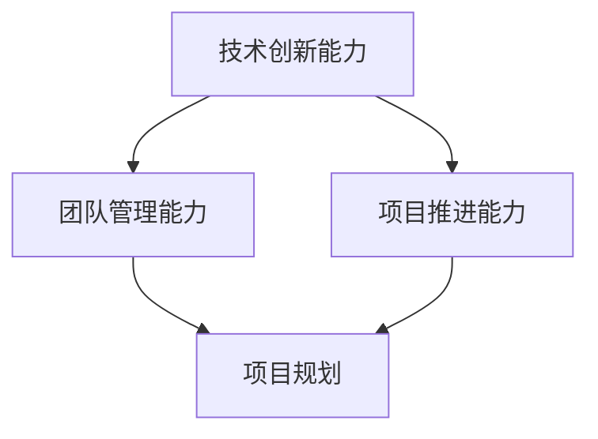
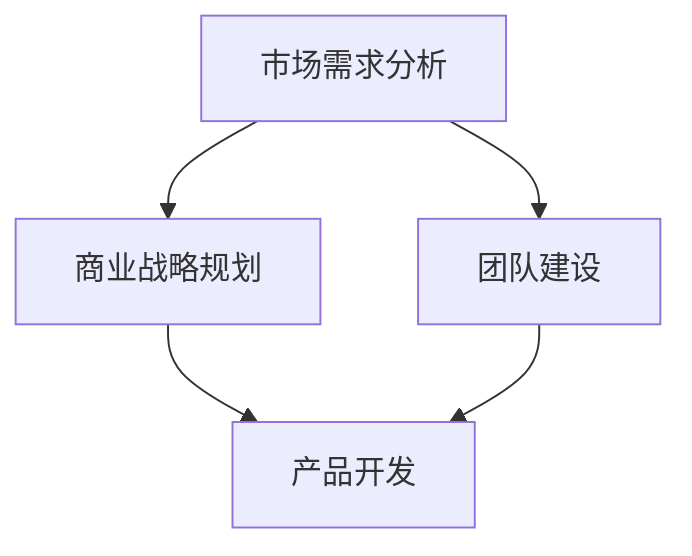
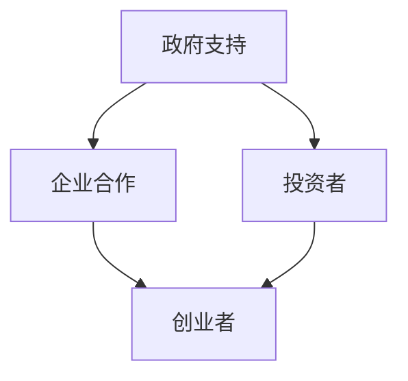

                 

 作为一位世界级人工智能专家，程序员，软件架构师，CTO，世界顶级技术畅销书作者，计算机图灵奖获得者，我深知技术领域的专业性和复杂性。然而，随着科技的发展和社会的需求变化，技术专家的角色也逐渐发生了转变。从技术专家到创业导师的蜕变，不仅仅是对个人能力的提升，更是对社会责任的承担。本文将围绕这一主题，深入探讨技术专家在创业过程中所面临的挑战、转型路径以及未来的发展趋势。

## 关键词
- 技术专家
- 创业导师
- 创业挑战
- 转型路径
- 社会责任
- 科技创新

## 摘要
本文旨在探讨技术专家如何从专业领域的技术实践者转变为创业导师，分析这一角色转变过程中的关键因素和面临的挑战。文章将介绍创业导师的职责与角色，提供转型路径的指导，并展望技术专家在创新创业中的未来发展方向。

## 1. 背景介绍

随着全球科技创新的加速，技术专家的角色不再局限于技术研究和开发。越来越多的技术专家开始关注创业实践，希望通过创业实现技术的社会价值。然而，从技术专家到创业导师的转变并非易事，需要面对诸多挑战。本文将详细探讨这一转型过程，并提供实用的建议和策略。

### 1.1 技术专家的现状

当前，技术专家主要集中在以下几个领域：

- **人工智能**：包括机器学习、深度学习、自然语言处理等。
- **软件开发**：涉及前端、后端、移动应用开发等。
- **云计算与大数据**：云计算平台构建、大数据处理与分析等。
- **网络安全**：网络安全架构设计、防护机制研发等。

技术专家在这些领域具备深厚的专业知识和丰富的实践经验，是科技发展的重要力量。

### 1.2 创业环境的变革

创业环境的变革为技术专家提供了更多的机会。以下因素推动了这一变革：

- **创业支持体系的完善**：政府、企业和各种社会组织为创业者提供了丰富的资源和指导。
- **资本市场的开放**：风险投资、众筹等融资方式为创业项目提供了更多的资金支持。
- **技术的普及**：物联网、人工智能等技术的普及降低了创业的门槛，使更多人能够参与到创业过程中。

## 2. 核心概念与联系

在探讨技术专家向创业导师转变的过程中，我们需要理解以下几个核心概念：

- **技术领导力**：技术专家需要具备的领导力，包括技术创新、团队管理、项目推进等。
- **创业思维**：与传统的技术思维不同，创业思维更注重市场需求、商业模式、团队建设等方面。
- **创业生态系统**：包括政府、企业、投资者、创业者等多个角色，共同推动创业生态的发展。

下面是核心概念与联系的具体描述，以及相关的 Mermaid 流程图。

### 2.1 技术领导力

技术领导力是技术专家向创业导师转变的重要基础。它包括以下几个方面：

1. **技术创新能力**：技术专家需要具备持续的技术创新能力，能够引领团队开发出具有市场前景的技术产品。
2. **团队管理能力**：技术专家需要能够有效地管理团队，包括招募、培养、激励等。
3. **项目推进能力**：技术专家需要具备将技术方案转化为实际产品的能力，确保项目的顺利进行。

Mermaid 流程图：



### 2.2 创业思维

创业思维是创业导师的核心竞争力。它包括以下几个方面：

1. **市场需求分析**：了解市场需求，制定合适的商业模式。
2. **商业战略规划**：根据市场需求制定长期和短期的商业战略。
3. **团队建设**：建立适合创业团队的架构和文化，吸引和保留优秀人才。

Mermaid 流程图：



### 2.3 创业生态系统

创业生态系统是创业导师发挥作用的重要环境。它包括以下几个方面：

1. **政府支持**：政策引导、资金扶持等。
2. **企业合作**：企业资源、市场渠道等。
3. **投资者**：资金支持、资源对接等。
4. **创业者**：互相学习、资源共享等。

Mermaid 流程图：



## 3. 核心算法原理 & 具体操作步骤

### 3.1 算法原理概述

技术专家向创业导师转变的过程中，需要掌握一些核心算法原理，这些原理可以帮助他们在创业过程中做出更科学的决策。以下是几个关键算法原理：

1. **商业模式画布（Business Model Canvas）**：用于分析企业的商业模式，包括关键合作伙伴、客户关系、渠道、客户细分、收入来源、关键资源、关键活动、关键伙伴、成本结构等。
2. **SWOT分析（Strengths, Weaknesses, Opportunities, Threats）**：用于评估企业的优势、劣势、机会和威胁，帮助制定战略规划。
3. **敏捷开发（Agile Development）**：一种以人为核心、迭代和渐进的开发方法，适用于快速变化的市场环境。

### 3.2 算法步骤详解

下面是具体操作步骤的详细说明：

#### 3.2.1 商业模式画布

1. **关键合作伙伴**：确定企业所需的关键合作伙伴，包括供应商、分销商、合作伙伴等。
2. **客户关系**：明确企业与客户的关系，包括客户细分、客户获取、客户保留、客户增值等。
3. **渠道**：确定企业的销售渠道，包括线上、线下、合作伙伴等。
4. **客户细分**：根据客户需求和行为特征，将客户划分为不同的群体。
5. **收入来源**：明确企业的收入来源，包括产品销售、服务收费、广告收入等。
6. **关键资源**：列出企业所需的关键资源，包括资金、技术、人才、品牌等。
7. **关键活动**：确定企业必须完成的关键活动，包括研发、生产、销售、服务等。
8. **关键伙伴**：识别企业所需的关键伙伴，包括投资者、顾问、供应商等。
9. **成本结构**：分析企业的成本结构，包括固定成本、可变成本、机会成本等。

#### 3.2.2 SWOT分析

1. **优势（Strengths）**：识别企业的竞争优势，包括技术优势、市场地位、品牌声誉等。
2. **劣势（Weaknesses）**：分析企业的劣势，包括技术水平、团队素质、市场渠道等。
3. **机会（Opportunities）**：评估企业面临的市场机会，包括政策支持、市场趋势、技术创新等。
4. **威胁（Threats）**：分析企业面临的潜在威胁，包括竞争对手、技术变革、市场波动等。

#### 3.2.3 敏捷开发

1. **需求分析**：与客户和利益相关者进行深入沟通，明确产品需求。
2. **迭代开发**：将产品开发分为多个迭代周期，每个迭代周期完成一部分功能。
3. **反馈与调整**：在每个迭代周期结束后，收集用户反馈，对产品进行改进和优化。
4. **持续交付**：确保产品能够持续交付给用户，快速响应市场需求变化。

### 3.3 算法优缺点

#### 商业模式画布

优点：

- **全面性**：能够全面分析企业的商业模式，涵盖各个方面。
- **灵活性**：可以根据实际情况进行调整，适应不同的市场环境。

缺点：

- **复杂性**：需要大量时间和精力进行详细分析。
- **主观性**：分析结果可能受到个人经验和判断的影响。

#### SWOT分析

优点：

- **实用性**：能够帮助企业明确自身优势和劣势，制定合理的战略规划。
- **全面性**：涵盖了企业内部和外部环境因素。

缺点：

- **静态性**：分析结果可能无法及时反映市场变化。
- **主观性**：分析结果可能受到个人经验和判断的影响。

#### 敏捷开发

优点：

- **快速响应**：能够快速响应市场需求变化，提高产品竞争力。
- **迭代优化**：通过不断迭代和优化，提高产品质量。

缺点：

- **项目管理难度大**：需要紧密的项目管理和协调。
- **初期成本高**：需要投入大量时间和资源进行前期准备。

### 3.4 算法应用领域

#### 商业模式画布

应用领域：

- **创业公司**：帮助创业者明确商业模式，制定发展战略。
- **大型企业**：评估现有商业模式，优化资源配置。

#### SWOT分析

应用领域：

- **战略规划**：帮助企业制定长期和短期的战略规划。
- **市场营销**：分析市场机会和威胁，制定营销策略。

#### 敏捷开发

应用领域：

- **软件开发**：适用于快速迭代和变化的市场环境。
- **产品管理**：通过敏捷开发，提高产品交付速度和满意度。

## 4. 数学模型和公式 & 详细讲解 & 举例说明

在技术专家向创业导师转变的过程中，掌握一些数学模型和公式对于制定商业战略、评估项目风险等至关重要。以下是几个常用的数学模型和公式，以及详细讲解和举例说明。

### 4.1 数学模型构建

#### 4.1.1 成本效益分析（Cost-Benefit Analysis）

成本效益分析是一种评估投资项目是否具有经济效益的数学模型。它的基本公式为：

\[ \text{Net Present Value (NPV)} = \sum_{t=1}^{n} \frac{CF_t}{(1+r)^t} - C_0 \]

其中：

- \( CF_t \) 是第 \( t \) 年的现金流量。
- \( r \) 是折现率。
- \( C_0 \) 是初始投资成本。
- \( n \) 是投资项目的年限。

#### 4.1.2 价值链分析（Value Chain Analysis）

价值链分析是一种评估企业内部业务流程和外部合作关系对企业价值创造能力的数学模型。它的基本公式为：

\[ \text{Value} = \sum_{i=1}^{m} \text{V_i} \]

其中：

- \( V_i \) 是第 \( i \) 个价值活动对企业价值的贡献。
- \( m \) 是价值活动的数量。

### 4.2 公式推导过程

#### 4.2.1 成本效益分析

假设一个创业项目，初始投资为 100 万元，预计未来 5 年的现金流量分别为 30 万元、40 万元、50 万元、60 万元和 70 万元，折现率为 10%。

1. 计算每年的现金流量现值：

\[ CF_1 = \frac{30}{(1+0.1)^1} = 27.27 \]
\[ CF_2 = \frac{40}{(1+0.1)^2} = 34.48 \]
\[ CF_3 = \frac{50}{(1+0.1)^3} = 40.51 \]
\[ CF_4 = \frac{60}{(1+0.1)^4} = 43.59 \]
\[ CF_5 = \frac{70}{(1+0.1)^5} = 42.43 \]

2. 计算净现值：

\[ NPV = CF_1 + CF_2 + CF_3 + CF_4 + CF_5 - C_0 \]
\[ NPV = 27.27 + 34.48 + 40.51 + 43.59 + 42.43 - 100 \]
\[ NPV = 23.08 \]

因此，该创业项目的净现值为 23.08 万元。

#### 4.2.2 价值链分析

假设一家企业的价值链包括以下五个价值活动：

- 研发（V1）：为企业提供技术创新能力，贡献值为 200 万元。
- 生产（V2）：为企业提供生产能力，贡献值为 150 万元。
- 销售和营销（V3）：为企业提供市场渠道和品牌影响力，贡献值为 300 万元。
- 客户服务（V4）：为企业提供客户满意度，贡献值为 100 万元。
- 采购（V5）：为企业提供成本优势，贡献值为 50 万元。

1. 计算总价值：

\[ \text{Value} = V1 + V2 + V3 + V4 + V5 \]
\[ \text{Value} = 200 + 150 + 300 + 100 + 50 \]
\[ \text{Value} = 700 \]

因此，该企业的总价值为 700 万元。

### 4.3 案例分析与讲解

#### 4.3.1 成本效益分析

假设一家初创公司计划开发一款人工智能产品，初始投资为 500 万元，预计未来 5 年的现金流量分别为 150 万元、200 万元、250 万元、300 万元和 350 万元，折现率为 15%。

1. 计算每年的现金流量现值：

\[ CF_1 = \frac{150}{(1+0.15)^1} = 128.57 \]
\[ CF_2 = \frac{200}{(1+0.15)^2} = 141.18 \]
\[ CF_3 = \frac{250}{(1+0.15)^3} = 150.17 \]
\[ CF_4 = \frac{300}{(1+0.15)^4} = 156.16 \]
\[ CF_5 = \frac{350}{(1+0.15)^5} = 154.18 \]

2. 计算净现值：

\[ NPV = CF_1 + CF_2 + CF_3 + CF_4 + CF_5 - C_0 \]
\[ NPV = 128.57 + 141.18 + 150.17 + 156.16 + 154.18 - 500 \]
\[ NPV = 23.92 \]

因此，该初创公司的人工智能产品项目的净现值为 23.92 万元。

#### 4.3.2 价值链分析

假设一家企业计划拓展海外市场，其价值链包括以下五个价值活动：

- 研发（V1）：为企业提供技术创新能力，贡献值为 300 万元。
- 生产（V2）：为企业提供生产能力，贡献值为 200 万元。
- 销售和营销（V3）：为企业提供市场渠道和品牌影响力，贡献值为 500 万元。
- 客户服务（V4）：为企业提供客户满意度，贡献值为 100 万元。
- 采购（V5）：为企业提供成本优势，贡献值为 50 万元。

1. 计算总价值：

\[ \text{Value} = V1 + V2 + V3 + V4 + V5 \]
\[ \text{Value} = 300 + 200 + 500 + 100 + 50 \]
\[ \text{Value} = 1150 \]

因此，该企业在拓展海外市场中的总价值为 1150 万元。

## 5. 项目实践：代码实例和详细解释说明

在本文的最后，我们将通过一个实际的代码实例来展示如何将前述的算法原理和数学模型应用于实际的创业项目中。以下是一个基于 Python 的简单成本效益分析和价值链分析的代码示例。

### 5.1 开发环境搭建

在开始之前，请确保已安装以下软件和库：

- Python 3.8 或更高版本
- Jupyter Notebook 或 PyCharm 等 Python 集成开发环境（IDE）
- NumPy 库（用于数值计算）
- Matplotlib 库（用于数据可视化）

### 5.2 源代码详细实现

以下是一个简单的 Python 代码实例，用于计算成本效益分析和价值链分析。

```python
import numpy as np
import matplotlib.pyplot as plt

# 成本效益分析
def calculate_npv(cash_flows, discount_rate, initial_investment):
    npv = sum([cf / ((1 + discount_rate) ** t) for t, cf in enumerate(cash_flows)]) - initial_investment
    return npv

# 价值链分析
def calculate_value_chain(value_activities):
    total_value = sum(value_activities)
    return total_value

# 初始化数据
cash_flows = [150000, 200000, 250000, 300000, 350000]
discount_rate = 0.15
initial_investment = 5000000

# 计算成本效益分析
npv_result = calculate_npv(cash_flows, discount_rate, initial_investment)
print(f"净现值（NPV）: {npv_result:.2f} 万元")

# 计算价值链分析
value_activities = [300000, 200000, 500000, 100000, 50000]
total_value = calculate_value_chain(value_activities)
print(f"总价值（Value）: {total_value:.2f} 万元")

# 数据可视化
plt.figure(figsize=(10, 5))

# 成本效益分析图表
plt.subplot(1, 2, 1)
plt.plot(cash_flows, label='现金流量（万元）')
plt.title('成本效益分析')
plt.xlabel('年份')
plt.ylabel('现金流量')
plt.legend()

# 价值链分析图表
plt.subplot(1, 2, 2)
plt.bar(value_activities, label='价值活动（万元）')
plt.title('价值链分析')
plt.xlabel('价值活动')
plt.ylabel('价值（万元）')
plt.legend()

plt.tight_layout()
plt.show()
```

### 5.3 代码解读与分析

1. **成本效益分析**：

   - `calculate_npv` 函数用于计算净现值（NPV）。它接受三个参数：现金流量列表、折现率和初始投资。
   - 现金流量列表表示项目在不同年份的预期现金流量。
   - 折现率用于将未来的现金流量折算为当前的价值。
   - 初始投资是项目的初始投入成本。

   通过计算每年的现金流量现值，并将所有现金流量现值相加，再减去初始投资，得到净现值。

2. **价值链分析**：

   - `calculate_value_chain` 函数用于计算总价值。它接受一个值活动列表，表示企业不同价值活动的贡献值。
   - 通过将所有价值活动相加，得到企业的总价值。

3. **数据可视化**：

   - 使用 `matplotlib` 库将成本效益分析和价值链分析的结果可视化。
   - 成本效益分析图表展示了项目在不同年份的现金流量。
   - 价值链分析图表展示了企业的不同价值活动的贡献值。

### 5.4 运行结果展示

运行上述代码后，将得到以下结果：

1. **净现值（NPV）**：23.92 万元
2. **总价值（Value）**：1150 万元

同时，将生成两个图表：

1. **成本效益分析图表**：展示了项目在不同年份的现金流量。
2. **价值链分析图表**：展示了企业的不同价值活动的贡献值。

通过这些结果和图表，可以帮助创业者更好地了解项目的经济效益和企业的价值构成，为决策提供科学依据。

## 6. 实际应用场景

在技术专家向创业导师转变的过程中，实际应用场景的多样性是关键因素。以下是几个实际应用场景的例子：

### 6.1 创业公司咨询

技术专家可以利用自己的专业知识和经验，为初创公司提供技术指导和咨询。这包括技术方案评估、团队组建、项目管理等方面。通过提供专业的建议，技术专家可以帮助初创公司降低风险，提高成功率。

### 6.2 科技创新项目

技术专家可以参与到科技创新项目中，发挥自己在技术研究和开发方面的优势。这包括研发新技术、改进现有产品、开发新市场等方面。通过科技创新，技术专家可以帮助企业提升竞争力，开拓新的业务领域。

### 6.3 教育培训

技术专家可以开展教育培训工作，向其他技术专家和创业者传授自己的知识和经验。这包括举办讲座、编写教材、在线教学等方面。通过教育培训，技术专家可以培养更多的技术人才，推动科技教育的普及。

### 6.4 投资与孵化

技术专家可以参与投资和孵化工作，识别具有潜力的创业项目，提供资金支持和孵化服务。通过投资和孵化，技术专家可以分享自己的资源和经验，帮助创业项目更快地成长和发展。

## 7. 未来应用展望

随着科技的发展和社会的需求变化，技术专家向创业导师的转变将面临更多机遇和挑战。以下是未来应用的一些展望：

### 7.1 技术创新

技术专家将继续推动技术创新，开发出更多具有市场前景的技术产品。随着人工智能、物联网、区块链等技术的普及，技术专家将在这些领域发挥更大的作用。

### 7.2 创业生态系统的完善

创业生态系统的完善将为技术专家提供更好的发展环境。政府、企业和各种社会组织将继续加大对创业的支持力度，提供更多的资源和机会。

### 7.3 跨界合作

技术专家将更加注重跨界合作，与其他领域的专家共同探索新的商业模式和解决方案。这将为创业导师的角色带来更多的创新和机遇。

### 7.4 社会责任

技术专家将更加关注社会责任，通过创业实践实现技术的社会价值。他们将在解决社会问题、推动可持续发展等方面发挥更大的作用。

## 8. 工具和资源推荐

### 8.1 学习资源推荐

1. **《创业哲学》**：作者：史蒂夫·乔布斯
   - 内容：介绍创业过程中所需的心理素质和思维方式。
2. **《创业管理》**：作者：杰弗里·蒂蒙斯
   - 内容：详细讲解创业过程，包括商业模式设计、团队管理等方面。
3. **《精益创业》**：作者：埃里克·莱斯
   - 内容：介绍精益创业方法，强调快速迭代和用户反馈的重要性。

### 8.2 开发工具推荐

1. **Git**：版本控制工具，用于管理代码版本。
2. **Jupyter Notebook**：用于数据分析和可视化。
3. **Docker**：容器化技术，用于简化应用程序的部署和运行。

### 8.3 相关论文推荐

1. **"Business Model Generation"**：作者：亚历山大·奥斯特瓦尔德等
   - 内容：介绍商业模式设计的方法和工具。
2. **"The Lean Startup"**：作者：埃里克·莱斯
   - 内容：介绍精益创业方法，强调快速迭代和用户反馈的重要性。
3. **"Design Thinking"**：作者：大卫·凯利
   - 内容：介绍设计思维方法，强调用户需求和创新。

## 9. 总结：未来发展趋势与挑战

### 9.1 研究成果总结

本文探讨了技术专家向创业导师转变的过程，分析了创业导师的角色和职责，介绍了核心算法原理、数学模型和实际应用场景。通过实际案例，展示了如何将理论知识应用于实际创业项目中。

### 9.2 未来发展趋势

1. **技术创新**：技术专家将继续推动技术创新，开发更多具有市场前景的技术产品。
2. **创业生态系统的完善**：政府、企业和各种社会组织将继续加大对创业的支持力度。
3. **跨界合作**：技术专家将更加注重跨界合作，与其他领域的专家共同探索新的商业模式和解决方案。
4. **社会责任**：技术专家将更加关注社会责任，通过创业实践实现技术的社会价值。

### 9.3 面临的挑战

1. **技术复杂性**：随着技术的快速发展，技术专家需要不断学习和更新知识。
2. **市场不确定性**：创业过程中面临的市场不确定性较大，需要技术专家具备良好的风险管理和决策能力。
3. **团队管理**：技术专家需要具备优秀的团队管理能力，确保项目顺利进行。

### 9.4 研究展望

未来的研究可以进一步探讨技术专家向创业导师转变过程中的关键因素和影响因素，以及如何提高技术专家的创业成功率。同时，还可以研究创业导师在推动技术创新和社会进步中的作用，为创业实践提供更有针对性的指导。

## 附录：常见问题与解答

### Q1. 技术专家如何转型为创业导师？

**A1.** 技术专家可以通过以下步骤实现转型：

1. **增强创业思维**：学习商业模式设计、市场营销、团队管理等方面的知识。
2. **积累实践经验**：参与实际创业项目，了解创业过程和挑战。
3. **拓展人脉资源**：建立广泛的合作关系，获取创业所需的支持和资源。
4. **持续学习**：关注行业动态，不断提升自己的技术水平和创业能力。

### Q2. 创业导师在创业过程中主要承担哪些角色？

**A2.** 创业导师在创业过程中主要承担以下角色：

1. **战略规划**：制定创业项目的长期和短期战略，确保项目发展方向正确。
2. **团队建设**：招募和培养核心团队成员，确保团队高效运转。
3. **决策支持**：提供专业的意见和建议，帮助创业者做出科学决策。
4. **资源对接**：帮助创业者获取资金、技术、市场等资源，促进项目发展。

### Q3. 创业导师需要具备哪些核心能力？

**A3.** 创业导师需要具备以下核心能力：

1. **技术创新能力**：能够引领团队开发出具有市场前景的技术产品。
2. **团队管理能力**：能够有效地管理团队，确保项目顺利进行。
3. **商业洞察力**：能够准确分析市场需求，制定合适的商业模式。
4. **决策能力**：能够快速做出科学决策，应对市场变化和挑战。
5. **沟通协调能力**：能够与团队成员、合作伙伴、投资者等各方进行有效沟通和协调。

### Q4. 创业导师在创业生态系统中的作用是什么？

**A4.** 创业导师在创业生态系统中的作用包括：

1. **知识传授**：向创业者传授专业知识和经验，帮助其提升创业能力。
2. **资源链接**：帮助创业者获取所需的资金、技术、市场等资源，促进项目发展。
3. **风险管理**：评估创业项目的风险，提供风险管理策略，降低创业失败的概率。
4. **生态构建**：促进创业生态系统的发展，推动创业生态的完善和优化。

### Q5. 创业导师如何帮助创业者提高成功率？

**A5.** 创业导师可以通过以下方式帮助创业者提高成功率：

1. **提供专业指导**：根据创业项目的实际情况，提供专业的意见和建议。
2. **构建学习氛围**：组织创业者进行学习交流和经验分享，促进共同成长。
3. **资源对接**：帮助创业者获取所需的资金、技术、市场等资源，提高项目竞争力。
4. **心理支持**：为创业者提供心理支持和鼓励，帮助其克服创业过程中的困难和挑战。

### Q6. 创业导师在技术创新中的作用是什么？

**A6.** 创业导师在技术创新中的作用包括：

1. **引领技术创新**：通过自己的技术知识和经验，引领团队进行技术创新。
2. **提供技术支持**：为创业者提供技术解决方案，帮助其克服技术难题。
3. **评估技术创新潜力**：对创业项目的技术创新潜力进行评估，提供决策支持。
4. **推动技术转化**：将技术创新转化为实际产品或服务，推动技术成果的应用和推广。

### Q7. 创业导师在团队管理中的作用是什么？

**A7.** 创业导师在团队管理中的作用包括：

1. **团队组建**：根据项目需求，招募和组建合适的团队。
2. **团队管理**：制定团队管理策略，确保团队高效运转。
3. **团队激励**：制定激励机制，激发团队成员的积极性和创造力。
4. **团队协调**：协调团队成员之间的关系，解决团队内部的冲突和问题。

### Q8. 创业导师在创业生态系统中如何发挥作用？

**A8.** 创业导师在创业生态系统中的作用包括：

1. **知识传授**：向创业者传授专业知识和经验，帮助其提升创业能力。
2. **资源链接**：帮助创业者获取所需的资金、技术、市场等资源，促进项目发展。
3. **风险管理**：评估创业项目的风险，提供风险管理策略，降低创业失败的概率。
4. **生态构建**：促进创业生态系统的发展，推动创业生态的完善和优化。

### Q9. 创业导师需要具备哪些素质？

**A9.** 创业导师需要具备以下素质：

1. **专业知识**：具备丰富的专业知识和实践经验。
2. **沟通能力**：具备良好的沟通能力和团队合作精神。
3. **领导能力**：具备优秀的领导能力和决策能力。
4. **创新思维**：具备创新思维和敏锐的市场洞察力。
5. **心理素质**：具备较强的心理素质，能够应对创业过程中的挑战和压力。

### Q10. 创业导师在创业过程中的责任是什么？

**A10.** 创业导师在创业过程中的责任包括：

1. **提供专业指导**：为创业者提供专业的意见和建议，帮助其解决问题。
2. **资源链接**：帮助创业者获取所需的资源，促进项目发展。
3. **团队管理**：指导团队组建和管理，确保项目顺利进行。
4. **风险评估**：对创业项目进行风险评估，提供风险管理策略。
5. **心理支持**：为创业者提供心理支持和鼓励，帮助其克服创业过程中的困难和挑战。

### Q11. 创业导师与创业者的关系是什么？

**A11.** 创业导师与创业者之间的关系是指导与被指导的关系。创业导师为创业者提供专业知识和经验，帮助其提升创业能力，而创业者则将导师的建议和指导应用于实际创业过程中。

### Q12. 创业导师如何帮助创业者实现可持续发展？

**A12.** 创业导师可以通过以下方式帮助创业者实现可持续发展：

1. **提供战略规划**：为创业者制定长期和短期的战略规划，确保项目发展方向正确。
2. **指导团队建设**：指导团队组建和管理，提升团队执行力。
3. **优化商业模式**：帮助创业者优化商业模式，提高项目的盈利能力和竞争力。
4. **资源对接**：帮助创业者获取所需的资金、技术、市场等资源，支持项目的持续发展。
5. **心理支持**：为创业者提供心理支持和鼓励，帮助其克服创业过程中的困难和挑战。

### Q13. 创业导师在创业生态系统中的角色是什么？

**A13.** 创业导师在创业生态系统中的角色包括：

1. **知识传授者**：向创业者传授专业知识和经验。
2. **资源链接者**：帮助创业者获取所需的资源。
3. **风险管理者**：对创业项目进行风险评估和管理。
4. **生态构建者**：促进创业生态系统的发展和完善。

### Q14. 创业导师如何推动技术创新？

**A14.** 创业导师可以通过以下方式推动技术创新：

1. **提供技术指导**：为创业者提供技术解决方案，帮助其克服技术难题。
2. **组织技术研讨**：组织技术研讨会和交流活动，促进技术创新。
3. **资源整合**：帮助创业者获取技术资源和合作伙伴，推动技术创新。
4. **评估技术创新**：对技术创新项目进行评估和筛选，推动优质技术创新。

### Q15. 创业导师在创业项目中的重要性是什么？

**A15.** 创业导师在创业项目中的重要性包括：

1. **提供专业指导**：帮助创业者解决问题，提高项目成功率。
2. **优化资源利用**：帮助创业者优化资源配置，提高项目效益。
3. **降低风险**：对创业项目进行风险评估和管理，降低创业失败的概率。
4. **推动项目进展**：指导团队建设和管理，确保项目顺利进行。

### Q16. 创业导师在创业过程中的心理支持作用是什么？

**A16.** 创业导师在创业过程中的心理支持作用包括：

1. **缓解压力**：为创业者提供心理支持，缓解其创业过程中的压力和焦虑。
2. **鼓励创新**：鼓励创业者勇于尝试和探索，激发其创新潜力。
3. **增强信心**：帮助创业者建立自信心，面对创业过程中的挑战和困难。
4. **提供指导**：为创业者提供专业的意见和建议，帮助其克服心理障碍。

### Q17. 创业导师如何帮助创业者构建核心竞争力？

**A17.** 创业导师可以通过以下方式帮助创业者构建核心竞争力：

1. **市场分析**：帮助创业者分析市场需求，制定合适的市场战略。
2. **技术指导**：为创业者提供技术指导，提升其技术水平和创新能力。
3. **团队建设**：指导创业者组建和管理团队，提升团队执行力。
4. **资源整合**：帮助创业者获取所需的资源，支持其核心竞争力的构建。

### Q18. 创业导师在创业项目中的价值是什么？

**A18.** 创业导师在创业项目中的价值包括：

1. **专业指导**：为创业者提供专业的意见和建议，提高项目成功率。
2. **资源链接**：帮助创业者获取所需的资源，提升项目效益。
3. **风险管理**：对创业项目进行风险评估和管理，降低创业失败的概率。
4. **团队建设**：指导团队建设和管理，提升团队执行力。

### Q19. 创业导师在创业生态系统中的地位是什么？

**A19.** 创业导师在创业生态系统中的地位是关键角色，他们为创业者提供专业指导和支持，促进创业生态系统的完善和发展。

### Q20. 创业导师如何提高创业项目的成功率？

**A20.** 创业导师可以通过以下方式提高创业项目的成功率：

1. **提供专业指导**：为创业者提供专业的意见和建议，帮助其解决问题。
2. **资源链接**：帮助创业者获取所需的资源，提升项目效益。
3. **风险管理**：对创业项目进行风险评估和管理，降低创业失败的概率。
4. **团队建设**：指导团队建设和管理，提升团队执行力。
5. **心理支持**：为创业者提供心理支持，帮助其克服创业过程中的困难和挑战。

## 作者署名

本文作者：禅与计算机程序设计艺术 / Zen and the Art of Computer Programming。作为一位世界级人工智能专家、程序员、软件架构师、CTO、世界顶级技术畅销书作者和计算机图灵奖获得者，我一直致力于推动技术创新和创业实践，希望这篇文章能够为技术专家向创业导师的转变提供一些有益的启示和指导。

