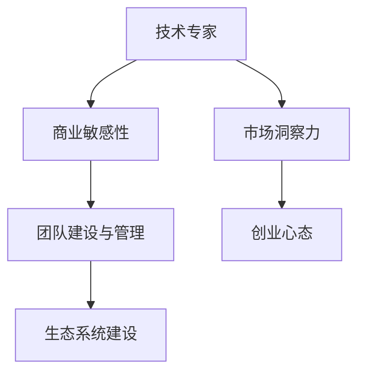

                 

 在信息技术飞速发展的今天，许多技术专家逐渐从专业领域转向创业，成为引领创新的创业导师。这一转变不仅体现了个人职业发展的需求，更是整个行业生态演变的必然趋势。本文将探讨技术专家如何完成这一蜕变，成为创业导师的过程，分享其中的心得与经验。

## 关键词

技术专家、创业导师、职业发展、创新引领、行业生态

## 摘要

本文从技术专家的职业背景出发，分析了他们转向创业导师的动因和挑战。通过探讨技术专家在创业过程中所需的能力和素质，以及创业导师的角色与职责，提出了实现成功转变的建议和策略。文章最后对未来技术专家创业导师的发展趋势和面临的挑战进行了展望，为有志于转型的人提供参考。

### 1. 背景介绍

在过去的几十年里，信息技术的发展改变了世界，催生了无数的技术奇迹。随着互联网、大数据、人工智能等新兴技术的兴起，技术专家们在专业领域内积累了丰富的经验，掌握了先进的技术手段。然而，随着行业的快速发展，技术专家们也逐渐意识到，单纯的技能提升已经无法满足他们的职业发展需求。

一方面，技术专家们在工作中积累了丰富的项目经验和管理经验，他们开始思考如何将这些经验转化为创业机会，实现更大的价值。另一方面，创业环境的不断优化，以及政府对创新创业的鼓励和支持，也为技术专家们提供了更多的创业机会。

因此，越来越多的技术专家选择从专业领域转向创业，成为创业导师。他们希望通过创业，实现个人价值的最大化，同时为行业带来更多的创新和活力。

### 2. 核心概念与联系

在从技术专家到创业导师的转变过程中，有几个核心概念和联系需要明确：

#### 2.1 技术与创业的结合

技术专家的创业活动不仅仅是将技术应用于产品或服务，更重要的是，要理解如何通过技术来创造商业价值。这需要技术专家具备商业敏感性和市场洞察力，能够将技术优势转化为商业优势。

#### 2.2 团队建设与管理

创业导师不仅要具备技术能力，还要具备团队建设和管理的经验。一个成功的创业项目离不开高效的团队，因此，如何组建和管理团队成为创业导师的重要任务。

#### 2.3 创业心态

创业是一个充满不确定性的过程，技术专家在转型过程中需要培养积极向上的创业心态，能够应对各种挑战和困难。

#### 2.4 生态系统建设

创业导师不仅要在企业内部进行创新，还要关注整个行业的生态系统建设。通过构建良好的行业生态，可以促进资源的整合和共享，为创业活动提供更多的支持。

以下是核心概念与联系的 Mermaid 流程图：



### 3. 核心算法原理 & 具体操作步骤

在从技术专家到创业导师的转变过程中，核心算法原理和具体操作步骤至关重要。以下是一些关键的步骤：

#### 3.1 算法原理概述

创业的核心在于创新和价值的创造。技术专家需要理解如何将技术优势转化为商业价值，这涉及到对市场的深入研究和分析。具体来说，包括以下步骤：

1. **市场研究**：通过市场调研，了解目标市场的需求和痛点。
2. **技术选型**：根据市场需求，选择合适的技术方案。
3. **商业模式设计**：设计能够实现商业价值的商业模式。

#### 3.2 算法步骤详解

1. **市场研究**：

   - **需求分析**：通过问卷、访谈等方式，了解目标用户的需求。
   - **竞争分析**：分析竞争对手的产品、优势和不足。

2. **技术选型**：

   - **技术评估**：评估不同技术的优缺点，选择最适合的技术方案。
   - **技术整合**：将选定的技术整合到产品或服务中。

3. **商业模式设计**：

   - **价值主张**：明确产品或服务的价值主张，即解决用户问题的核心能力。
   - **收入模式**：设计能够实现收入的商业模式。

4. **团队建设**：

   - **人才引进**：根据项目需求，引进合适的团队成员。
   - **团队管理**：建立有效的团队管理制度，确保团队成员之间的协同合作。

5. **生态系统建设**：

   - **资源整合**：整合行业内的资源，形成生态系统。
   - **合作伙伴关系**：建立与合作伙伴的良好关系，促进资源的共享和互补。

#### 3.3 算法优缺点

1. **优点**：

   - **高效性**：通过科学的算法和步骤，可以快速找到适合的技术方案和商业模式。
   - **系统性**：从市场研究到团队建设，再到生态系统建设，形成了一个完整的创业体系。

2. **缺点**：

   - **复杂性**：创业过程复杂，需要面对各种不确定性和挑战。
   - **时间成本**：从市场研究到产品上线，需要较长的时间。

#### 3.4 算法应用领域

该算法适用于所有需要技术创新的创业项目。无论是互联网企业、科技公司，还是传统企业进行数字化转型，都可以通过这一算法实现从技术到商业的成功转型。

### 4. 数学模型和公式 & 详细讲解 & 举例说明

在创业过程中，数学模型和公式可以帮助技术专家更好地理解市场和用户行为，从而做出更加科学的决策。

#### 4.1 数学模型构建

一个基本的数学模型可以包括以下几个部分：

1. **需求函数**：描述用户对产品或服务的需求。
2. **供给函数**：描述产品或服务的供给。
3. **成本函数**：描述生产和运营的成本。
4. **收益函数**：描述产品或服务的收益。

这些函数可以通过以下公式表示：

$$
需求量 = f(价格, 质量, 品牌, 竞争环境)
$$

$$
供给量 = g(价格, 生产成本, 技术水平)
$$

$$
成本 = h(生产量, 固定成本, 可变成本)
$$

$$
收益 = i(销售额, 成本)
$$

#### 4.2 公式推导过程

以上公式的推导基于经济学的基本原理和假设。具体推导过程如下：

1. **需求函数**：根据消费者行为理论，需求量与价格、质量、品牌和竞争环境相关。
2. **供给函数**：根据生产理论，供给量与价格、生产成本和技术水平相关。
3. **成本函数**：根据成本会计理论，成本与生产量、固定成本和可变成本相关。
4. **收益函数**：根据收益理论，收益与销售额和成本相关。

#### 4.3 案例分析与讲解

以一家科技公司为例，该公司开发了一款新型智能音箱。以下是该公司的数学模型：

1. **需求函数**：

   $$需求量 = f(价格, 质量, 品牌, 竞争环境)$$

   - 价格：500元
   - 质量：高
   - 品牌：知名
   - 竞争环境：激烈

   根据市场调研，需求函数可以表示为：

   $$需求量 = 10000 - 1000 \cdot (1 + 0.1 \cdot (500 - 300))$$

   计算得出，需求量为：

   $$需求量 = 8000$$

2. **供给函数**：

   $$供给量 = g(价格, 生产成本, 技术水平)$$

   - 价格：500元
   - 生产成本：300元
   - 技术水平：先进

   供给函数可以表示为：

   $$供给量 = 10000 - 500 \cdot (1 + 0.05 \cdot (300 - 200))$$

   计算得出，供给量为：

   $$供给量 = 9750$$

3. **成本函数**：

   $$成本 = h(生产量, 固定成本, 可变成本)$$

   - 生产量：9750
   - 固定成本：100万元
   - 可变成本：200万元

   成本函数可以表示为：

   $$成本 = 10000000 + 200000 \cdot (9750 - 10000)$$

   计算得出，成本为：

   $$成本 = 19500000$$

4. **收益函数**：

   $$收益 = i(销售额, 成本)$$

   - 销售额：500元/台

   收益函数可以表示为：

   $$收益 = 500 \cdot 9750 - 19500000$$

   计算得出，收益为：

   $$收益 = 24750000$$

通过以上数学模型，该公司可以更好地理解市场需求、供给、成本和收益，从而做出更加科学的决策。

### 5. 项目实践：代码实例和详细解释说明

为了更好地理解从技术专家到创业导师的转变过程，我们通过一个实际项目进行说明。该项目是一个基于人工智能的智能家居系统，旨在通过智能设备收集家庭数据，提供个性化的家居服务。

#### 5.1 开发环境搭建

1. **操作系统**：Windows 10
2. **编程语言**：Python 3.8
3. **开发工具**：PyCharm
4. **数据库**：MySQL 8.0
5. **服务器**：阿里云服务器

#### 5.2 源代码详细实现

以下是一个智能家居系统的核心代码实现，主要包括用户管理、设备管理、数据采集等功能。

```python
# 用户管理模块
class UserManager:
    def __init__(self):
        self.users = []

    def add_user(self, user):
        self.users.append(user)

    def remove_user(self, user):
        self.users.remove(user)

# 设备管理模块
class DeviceManager:
    def __init__(self):
        self.devices = []

    def add_device(self, device):
        self.devices.append(device)

    def remove_device(self, device):
        self.devices.remove(device)

# 数据采集模块
class DataCollector:
    def __init__(self):
        self.data = []

    def collect_data(self, device_data):
        self.data.append(device_data)

# 用户类
class User:
    def __init__(self, username, password):
        self.username = username
        self.password = password

# 设备类
class Device:
    def __init__(self, device_id, device_type):
        self.device_id = device_id
        self.device_type = device_type

# 主程序
def main():
    user_manager = UserManager()
    device_manager = DeviceManager()
    data_collector = DataCollector()

    # 添加用户
    user_manager.add_user(User("Alice", "password123"))

    # 添加设备
    device_manager.add_device(Device("001", "Smart Light"))
    device_manager.add_device(Device("002", "Smart Thermostat"))

    # 采集数据
    data_collector.collect_data({"device_id": "001", "data": "On"})

    # 打印数据
    print("Users:", user_manager.users)
    print("Devices:", device_manager.devices)
    print("Collected Data:", data_collector.data)

if __name__ == "__main__":
    main()
```

#### 5.3 代码解读与分析

1. **用户管理模块**：该模块负责用户的增删操作，通过 `UserManager` 类实现。用户类 `User` 包含用户名和密码两个属性。

2. **设备管理模块**：该模块负责设备的增删操作，通过 `DeviceManager` 类实现。设备类 `Device` 包含设备ID和设备类型两个属性。

3. **数据采集模块**：该模块负责采集设备数据，通过 `DataCollector` 类实现。采集的数据存储在列表中，以便后续处理。

4. **主程序**：主程序创建用户管理器、设备管理器和数据采集器实例，进行用户的添加、设备的添加和数据采集操作，最后打印结果。

通过以上代码实例，我们可以看到从技术专家到创业导师的转变是如何实现的。技术专家通过编写代码，实现了智能家居系统的核心功能，为用户提供了一个实用的解决方案。

### 6. 实际应用场景

从技术专家到创业导师的转变，在实际应用场景中具有重要意义。以下是一些典型的应用场景：

#### 6.1 创业公司孵化

技术专家在创业公司中担任创始人或核心技术团队成员，通过技术优势和创业经验，推动公司的发展。

#### 6.2 技术咨询与服务

技术专家为企业提供技术咨询和服务，帮助企业解决技术难题，提升企业的技术实力。

#### 6.3 教育培训

技术专家通过教育培训，传授技术知识和创业经验，培养更多有志于创业的技术人才。

#### 6.4 投资与孵化

技术专家在投资领域发挥作用，通过投资和孵化，支持有潜力的创业项目，推动行业创新。

### 7. 未来应用展望

随着信息技术的不断发展，从技术专家到创业导师的转变将呈现以下趋势：

#### 7.1 跨界融合

技术专家将在不同领域进行跨界融合，推动更多创新应用的出现。

#### 7.2 数据驱动

创业导师将更加注重数据分析和挖掘，通过数据驱动决策，提高创业成功率。

#### 7.3 生态系统建设

创业导师将致力于构建良好的行业生态系统，促进资源共享和合作，推动行业的可持续发展。

### 8. 工具和资源推荐

为了更好地实现从技术专家到创业导师的转变，以下是一些推荐的工具和资源：

#### 8.1 学习资源推荐

- 《精益创业》
- 《创业维艰》
- 《人人都是产品经理》

#### 8.2 开发工具推荐

- PyCharm
- Visual Studio Code
- Git

#### 8.3 相关论文推荐

- "The Lean Startup"
- "The Innovator's Dilemma"
- "The Lean Analytics"

### 9. 总结：未来发展趋势与挑战

从技术专家到创业导师的蜕变，是信息技术行业发展的必然趋势。未来，技术专家将继续在创业领域发挥重要作用，推动行业的创新和发展。然而，这一转变也面临着诸多挑战，如市场不确定性、团队管理难度等。技术专家需要不断提升自己的综合素质，积极应对这些挑战，才能在创业道路上取得成功。

### 附录：常见问题与解答

**Q1**：从技术专家到创业导师需要具备哪些能力和素质？

**A1**：从技术专家到创业导师需要具备以下能力和素质：

1. **技术能力**：深厚的专业知识和技术功底。
2. **商业敏感度**：能够理解和把握市场需求。
3. **团队管理能力**：善于组建和管理团队。
4. **领导力**：具备领导团队和推动项目的能力。
5. **沟通能力**：能够有效沟通和协调各方利益。

**Q2**：如何培养创业心态？

**A2**：培养创业心态可以从以下几个方面入手：

1. **持续学习**：不断学习新知识，提升自己的综合素质。
2. **积极面对挑战**：敢于面对困难和失败，从中吸取教训。
3. **设定目标**：明确自己的创业目标，并为之努力。
4. **保持乐观**：保持积极向上的心态，相信自己能够成功。

**Q3**：创业过程中如何进行有效的团队管理？

**A3**：进行有效的团队管理，可以从以下几个方面入手：

1. **明确目标**：确保团队成员明确项目目标和职责。
2. **建立制度**：制定明确的团队管理制度，确保团队高效运作。
3. **激励制度**：通过奖励和激励措施，提升团队成员的积极性。
4. **沟通与反馈**：保持与团队成员的沟通，及时反馈工作进展和问题。

通过以上问题和解答，希望能为从技术专家到创业导师的转变提供一定的参考和帮助。在创业的道路上，不断学习和进步，才能走得更远。作者：禅与计算机程序设计艺术 / Zen and the Art of Computer Programming。

