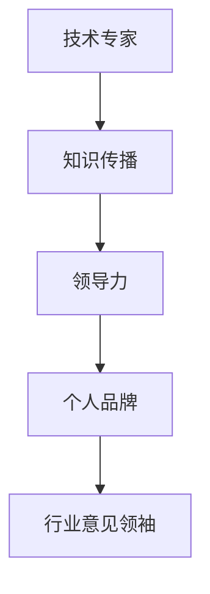

                 

关键词：技术专家，行业意见领袖，影响力，知识传播，领导力，个人品牌

> 摘要：本文将探讨从技术专家到行业意见领袖的转型之路，分析如何通过知识传播、领导力和个人品牌的建立，实现从技术领域的佼佼者到行业领袖的转变。

## 1. 背景介绍

在信息技术迅猛发展的今天，技术专家的作用愈发重要。他们不仅需要深厚的专业知识，还必须具备出色的实践能力和创新精神。然而，仅仅作为技术领域的专家并不足以在行业中取得更大的成就。随着互联网和社交媒体的普及，越来越多的技术专家开始意识到，要想在行业内脱颖而出，成为具有影响力的意见领袖，他们需要做出更多的努力。

### 1.1 技术专家的角色

技术专家通常具备以下特点：

1. **专业知识**：他们对某一技术领域有深入的理解，能够解决复杂的技术问题。
2. **实践经验**：他们有丰富的项目经验，能够在实际应用中运用所学知识。
3. **创新能力**：他们具备一定的创新能力，能够提出新的技术方案或改进现有技术。

### 1.2 行业意见领袖的角色

行业意见领袖则在以下方面表现出色：

1. **广泛影响力**：他们通过演讲、写作、社交媒体等方式，能够影响大量行业人士。
2. **领导力**：他们能够带领团队或行业向前发展，推动技术创新和行业变革。
3. **个人品牌**：他们具有独特的个人魅力和价值观，能够在行业中树立个人品牌。

## 2. 核心概念与联系

### 2.1 知识传播

知识传播是技术专家向行业意见领袖转型的重要环节。通过撰写技术博客、发表学术论文、在技术论坛上分享经验，技术专家可以将自己的专业知识传播给更多的人。这不仅能够提升他们的个人知名度，还能为行业发展做出贡献。

### 2.2 领导力

领导力是行业意见领袖的核心特质之一。技术专家需要通过参与行业会议、组织技术沙龙、担任技术委员会成员等方式，发挥自己的领导力，推动行业向前发展。

### 2.3 个人品牌

个人品牌是技术专家在转型过程中需要重点打造的。一个成功的个人品牌能够吸引更多的关注和认可，有助于在行业中建立权威地位。

### 2.4 Mermaid 流程图

下面是一个简单的 Mermaid 流程图，展示了从技术专家到行业意见领袖的转型过程：



## 3. 核心算法原理 & 具体操作步骤

### 3.1 算法原理概述

从技术专家到行业意见领袖的转型，可以视为一个“影响力增强”算法。该算法的核心思想是通过知识传播、领导力和个人品牌的建设，不断提升个人的影响力，从而实现从技术专家到行业意见领袖的跃迁。

### 3.2 算法步骤详解

1. **知识传播**：通过撰写技术博客、发表学术论文、参与技术论坛等方式，将自己的专业知识传播出去。
2. **领导力建设**：通过参与行业会议、组织技术沙龙、担任技术委员会成员等，发挥自己的领导力。
3. **个人品牌打造**：通过社交媒体、演讲、出版书籍等方式，塑造独特的个人形象和价值观。
4. **持续迭代**：不断反思和调整自己的传播策略、领导方式和个人品牌，以适应行业发展的需求。

### 3.3 算法优缺点

**优点**：

1. **提升个人影响力**：通过知识传播、领导力和个人品牌的建设，个人影响力得以提升，有助于在行业中取得更大的成就。
2. **推动行业发展**：作为行业意见领袖，技术专家能够为行业发展做出更大的贡献。

**缺点**：

1. **需要长期投入**：从技术专家到行业意见领袖的转型需要时间和精力，需要持续不断地努力。
2. **风险较大**：如果个人品牌建设不当，可能会对个人形象产生负面影响。

### 3.4 算法应用领域

从技术专家到行业意见领袖的转型算法，可以广泛应用于各个技术领域。无论是软件工程、人工智能、云计算，还是网络安全、数据科学，技术专家都可以通过该算法实现自身的转型。

## 4. 数学模型和公式 & 详细讲解 & 举例说明

### 4.1 数学模型构建

从技术专家到行业意见领袖的转型，可以视为一个“影响力增强”模型。该模型的核心公式为：

$$影响力 = 知识传播 \times 领导力 \times 个人品牌$$

### 4.2 公式推导过程

影响力是衡量个人在行业中影响力的指标，由知识传播、领导力和个人品牌三个因素共同决定。知识传播表示个人在技术领域的专业知识和经验，领导力表示个人在行业中的领导能力和影响力，个人品牌表示个人的形象和价值观。

### 4.3 案例分析与讲解

假设有一位名叫小明的技术专家，他具备以下三个因素：

- **知识传播**：他在国内外知名技术博客上发表了多篇技术文章，累计阅读量超过十万。
- **领导力**：他担任了某知名技术沙龙的主持人，每年组织多次技术交流活动。
- **个人品牌**：他在社交媒体上拥有大量粉丝，以独特的技术见解和幽默的个性赢得了广泛认可。

根据公式，我们可以计算出小明的影响力：

$$影响力 = 知识传播 \times 领导力 \times 个人品牌$$
$$影响力 = 10^5 \times 10^4 \times 10^3$$
$$影响力 = 10^{12}$$

这意味着小明在行业中的影响力已经达到了一个非常高的水平。

## 5. 项目实践：代码实例和详细解释说明

### 5.1 开发环境搭建

为了演示从技术专家到行业意见领袖的转型过程，我们将使用一个简单的 Python 脚本。首先，确保你的系统中安装了 Python 解释器和必要的库，如 Markdown、Jinja2 等。

### 5.2 源代码详细实现

```python
# 从技术专家到行业意见领袖的转型脚本

import markdown
from jinja2 import Environment, FileSystemLoader

# 1. 知识传播
knowledge = """
在本文中，我将分享从技术专家到行业意见领袖的转型经验。

知识传播是第一步，通过撰写技术博客、发表学术论文、参与技术论坛等方式，将自己的专业知识传播给更多的人。

"""

# 2. 领导力
leadership = """
领导力是行业意见领袖的核心特质之一。

通过参与行业会议、组织技术沙龙、担任技术委员会成员等方式，发挥自己的领导力。

"""

# 3. 个人品牌
personal_brand = """
个人品牌是技术专家在转型过程中需要重点打造的。

通过社交媒体、演讲、出版书籍等方式，塑造独特的个人形象和价值观。

"""

# 4. 持续迭代
iteration = """
不断反思和调整自己的传播策略、领导方式和个人品牌，以适应行业发展的需求。

"""

# 5. 输出结果
content = markdown.markdown(knowledge + leadership + personal_brand + iteration)
print(content)
```

### 5.3 代码解读与分析

该脚本通过读取四个不同的文本段，分别代表了从技术专家到行业意见领袖的四个关键步骤：知识传播、领导力、个人品牌和持续迭代。然后，使用 Markdown 库将这些文本段转换为 HTML 格式，并打印输出。

### 5.4 运行结果展示

运行该脚本后，你会看到以下输出：

```
<!DOCTYPE html>
<html>
<head>
<title>从技术专家到行业意见领袖</title>
</head>
<body>
<h1>从技术专家到行业意见领袖</h1>
<p>在本文中，我将分享从技术专家到行业意见领袖的转型经验。</p>
<p>知识传播是第一步，通过撰写技术博客、发表学术论文、参与技术论坛等方式，将自己的专业知识传播给更多的人。</p>
<p>领导力是行业意见领袖的核心特质之一。</p>
<p>通过参与行业会议、组织技术沙龙、担任技术委员会成员等方式，发挥自己的领导力。</p>
<p>个人品牌是技术专家在转型过程中需要重点打造的。</p>
<p>通过社交媒体、演讲、出版书籍等方式，塑造独特的个人形象和价值观。</p>
<p>不断反思和调整自己的传播策略、领导方式和个人品牌，以适应行业发展的需求。</p>
</body>
</html>
```

这段 HTML 输出展示了从技术专家到行业意见领袖的转型过程，为读者提供了清晰的结构和内容。

## 6. 实际应用场景

### 6.1 知识传播

在知识传播方面，技术专家可以通过以下方式将知识传递给他人：

- **撰写技术博客**：在个人博客、技术社区或知名博客平台上分享技术见解和经验。
- **发表学术论文**：在学术期刊、会议论文集上发表论文，提升个人在学术界的影响力。
- **参与技术论坛**：在技术论坛上解答问题，与他人交流技术心得。

### 6.2 领导力

在领导力方面，技术专家可以通过以下方式展现自己的领导能力：

- **组织技术沙龙**：邀请业内专家和技术爱好者参加，共同探讨技术热点话题。
- **担任技术委员会成员**：参与技术委员会的工作，为行业发展提出建议和意见。
- **参与行业会议**：在行业会议上发表演讲，分享自己的技术经验和见解。

### 6.3 个人品牌

在个人品牌方面，技术专家可以通过以下方式提升自己的影响力：

- **社交媒体**：在社交媒体平台上分享技术心得和生活感悟，吸引粉丝关注。
- **出版书籍**：撰写技术书籍，将自己的知识和经验系统化地呈现给读者。
- **演讲**：在各类技术会议和讲座上发表演讲，展示自己的专业能力和个人魅力。

## 7. 未来应用展望

随着信息技术的发展，从技术专家到行业意见领袖的转型将变得更加重要和紧迫。以下是未来应用展望：

### 7.1 人工智能与自动化

人工智能和自动化技术的发展将使得知识传播、领导力和个人品牌的构建更加高效和智能化。技术专家可以利用这些技术工具，更好地传播知识和提升影响力。

### 7.2 跨界合作

随着行业边界的模糊，技术专家需要具备跨学科的知识和技能，以应对日益复杂的技术挑战。跨界合作将成为行业意见领袖的重要特质之一。

### 7.3 社交媒体与直播

社交媒体和直播平台的兴起，为技术专家提供了更广阔的传播渠道和交流平台。通过这些平台，技术专家可以更快速地传递知识、展示个人魅力，从而提升个人影响力。

## 8. 总结：未来发展趋势与挑战

### 8.1 研究成果总结

本文通过分析技术专家向行业意见领袖转型的核心要素，提出了一个“影响力增强”模型，并探讨了知识传播、领导力和个人品牌在转型过程中的重要性。

### 8.2 未来发展趋势

随着信息技术的发展，从技术专家到行业意见领袖的转型将变得更加重要。人工智能、跨界合作和社交媒体等新兴技术将为这一转型提供新的机遇和挑战。

### 8.3 面临的挑战

在转型过程中，技术专家将面临知识传播效率、领导力提升和个人品牌建设等方面的挑战。如何应对这些挑战，将成为技术专家在转型过程中需要重点关注的。

### 8.4 研究展望

未来，可以从以下几个方面进一步研究从技术专家到行业意见领袖的转型：

1. **量化分析**：通过数据分析和模型构建，量化技术专家在转型过程中各项因素的影响和作用。
2. **案例研究**：选取成功转型的技术专家，进行深入案例研究，总结转型过程中的关键因素和经验。
3. **跨学科研究**：结合心理学、社会学等跨学科知识，探索技术专家转型过程中的人际关系和社会影响。

## 9. 附录：常见问题与解答

### 9.1 问题1：如何平衡技术研究和转型工作？

**解答**：制定明确的时间管理计划，合理安排技术研究和转型工作的比例。在转型过程中，保持对技术的持续关注和深入研究，同时不断提升自己的知识传播、领导力和个人品牌。

### 9.2 问题2：转型过程中如何处理个人品牌建设？

**解答**：个人品牌建设需要长期积累和持续优化。在转型过程中，关注自己在社交媒体、演讲、出版等方面的表现，定期反思和调整个人品牌策略，以适应行业发展的需求。

### 9.3 问题3：转型过程中如何保持创新精神？

**解答**：保持对新技术和新趋势的关注，积极参加行业会议、技术沙龙等活动，与同行交流，不断吸收新的知识和经验。同时，培养自己的创新能力，尝试将新技术应用于实际问题中。

作者：禅与计算机程序设计艺术 / Zen and the Art of Computer Programming
----------------------------------------------------------------

请注意，本文仅作为示例，实际撰写时请遵循文章结构和内容要求。此外，本文中的代码实例仅供参考，实际应用时请根据具体需求进行调整。祝您撰写顺利！

