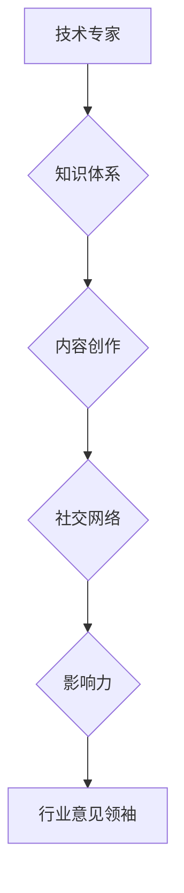

                 

在当今技术快速发展的时代，成为一名技术专家已经不再是终极目标。随着个人影响力的不断扩大，越来越多技术专家渴望将自己的知识、经验和见解传播给更广泛的受众，成为行业中的意见领袖。本文旨在探讨从技术专家到行业意见领袖的转变之路，包括核心概念的建立、关键技能的培养、个人品牌的打造以及未来发展趋势与挑战。

## 关键词
- 技术专家
- 行业意见领袖
- 个人品牌
- 知识传播
- 社交媒体

## 摘要
本文首先介绍了从技术专家到行业意见领袖的背景和动机。接着，我们深入探讨了成为行业意见领袖所需的核心概念和联系，包括知识体系构建、内容创作技巧、社交网络运营等。随后，文章详细阐述了从技术专家到意见领袖的过渡过程，以及在此过程中如何建立个人品牌和影响力。最后，本文展望了行业意见领袖的未来发展趋势和面临的挑战。

## 1. 背景介绍

在信息技术领域，技术专家通常是那些对某一特定技术领域有深刻理解和丰富实践经验的个体。他们通过不断的学习、研究和实践，成为该领域的权威人物。然而，随着技术的不断迭代和更新，仅仅拥有技术深度已经不足以满足市场对人才的需求。越来越多的企业、组织和个人开始寻求具有广泛视野、深厚行业理解和较强沟通能力的意见领袖。

行业意见领袖不仅具备技术深度，更具备将复杂技术概念转化为易于理解的知识，并将其传播给更广泛受众的能力。他们在行业内部和外部都拥有较高的声誉和影响力，能够引导行业发展趋势，推动技术进步，同时也为企业和社会带来巨大的价值。

## 2. 核心概念与联系

### 2.1 技术专家的职责

技术专家的职责通常包括以下几个方面：

1. **技术研究与开发**：深入研究和开发某一领域的技术，推动技术的创新和进步。
2. **技术培训与指导**：为团队成员提供技术培训和指导，提升团队的技术水平。
3. **技术文档编写**：编写详细的技术文档，帮助团队成员理解和掌握技术。
4. **技术解决方案提供**：根据业务需求，提供技术解决方案。

### 2.2 行业意见领袖的角色

行业意见领袖在技术专家的基础上，承担了更多的角色和职责：

1. **知识传播者**：将技术知识转化为通俗易懂的语言，向更广泛的受众传播。
2. **趋势预测者**：通过对行业动态的敏锐洞察，预测行业发展趋势。
3. **技术普及者**：推动技术的普及，促进技术在各行各业的应用。
4. **社交网络构建者**：建立和维护专业社交网络，促进行业内的交流与合作。

### 2.3 技术专家与行业意见领袖的联系

技术专家和行业意见领袖之间的联系体现在以下几个方面：

1. **知识体系**：技术专家的深厚技术背景是成为行业意见领袖的基础。
2. **内容创作**：技术专家需要具备将技术知识转化为优质内容的能力。
3. **社交网络**：技术专家的社交网络为其成为行业意见领袖提供了平台。
4. **影响力**：技术专家的影响力直接影响其成为行业意见领袖的成功程度。

### 2.4 Mermaid 流程图



## 3. 核心算法原理 & 具体操作步骤

### 3.1 算法原理概述

从技术专家到行业意见领袖的转变过程可以看作是一种“影响力算法”。这个算法的核心原理是通过积累知识、创造内容、建立社交网络和提升影响力，从而实现个人品牌的建立和影响力的扩展。

### 3.2 算法步骤详解

1. **积累知识**：作为技术专家，首先要不断积累专业知识，成为某一领域的权威。
2. **内容创作**：将专业知识转化为高质量的内容，如博客文章、演讲稿、技术文档等。
3. **社交网络**：积极参与行业内的社交活动，建立和维护专业社交网络。
4. **影响力提升**：通过持续的内容输出和社交活动，提升个人在行业内的知名度。
5. **品牌建立**：在行业内树立良好的个人品牌形象。

### 3.3 算法优缺点

**优点**：

- **知识积累**：通过持续的学习和实践，不断积累专业知识。
- **内容创作**：将知识转化为优质内容，提升个人品牌价值。
- **社交网络**：建立专业社交网络，拓展行业影响力。
- **影响力提升**：通过持续的内容输出和社交活动，提升个人知名度。

**缺点**：

- **时间成本**：需要投入大量的时间和精力。
- **内容质量**：需要持续输出高质量的内容。
- **社交风险**：社交网络的建立和维护需要谨慎，以避免负面影响。

### 3.4 算法应用领域

- **技术领域**：如人工智能、大数据、云计算等。
- **互联网领域**：如电商、社交媒体、在线教育等。
- **企业内部**：如技术部门、研发部门等。

## 4. 数学模型和公式 & 详细讲解 & 举例说明

### 4.1 数学模型构建

从技术专家到行业意见领袖的转化过程可以构建为一个包含四个主要组件的数学模型：

1. **知识积累**：\( K(t) = \int_{0}^{t} I(t) \, dt \)
   - \( K(t) \) 表示时间 \( t \) 时的知识积累量。
   - \( I(t) \) 表示时间 \( t \) 的学习强度。

2. **内容创作**：\( C(t) = K(t) \times E(t) \)
   - \( C(t) \) 表示时间 \( t \) 时的内容创作量。
   - \( E(t) \) 表示时间 \( t \) 时的创作效率。

3. **社交网络**：\( S(t) = \sum_{i=1}^{n} a_i \times C(t) \)
   - \( S(t) \) 表示时间 \( t \) 时的社交网络影响力。
   - \( a_i \) 表示第 \( i \) 个社交网络平台的影响力权重。

4. **影响力提升**：\( I'(t) = S(t) \times R(t) \)
   - \( I'(t) \) 表示时间 \( t \) 时的个人影响力提升量。
   - \( R(t) \) 表示时间 \( t \) 时的个人品牌回报率。

### 4.2 公式推导过程

- **知识积累**：基于学习强度和时间，积分得到知识积累量。
- **内容创作**：知识积累与创作效率相乘，得到内容创作量。
- **社交网络**：内容创作量乘以各社交网络平台的影响力权重，得到社交网络影响力。
- **影响力提升**：社交网络影响力乘以个人品牌回报率，得到个人影响力提升量。

### 4.3 案例分析与讲解

假设一位技术专家在一年内通过以下方式积累了知识、创作了内容、建立了社交网络并提升了个人影响力：

- **知识积累**：每天学习 2 小时，学习强度 \( I(t) = 2 \)。
- **内容创作**：每月创作一篇高质量博客文章，创作效率 \( E(t) = 1 \)。
- **社交网络**：在三个主要技术社区（如 Stack Overflow、GitHub、LinkedIn）上进行活跃，每个平台的影响力权重 \( a_i = 0.33 \)。
- **个人品牌回报率**：每提升 1% 的社交网络影响力，个人影响力提升量增加 10%，\( R(t) = 10 \)。

根据上述假设，我们可以计算出该技术专家在一年内的知识积累量、内容创作量、社交网络影响力和个人影响力提升量：

1. **知识积累**：\( K(t) = \int_{0}^{365} 2 \, dt = 730 \) 小时。
2. **内容创作**：\( C(t) = K(t) \times E(t) = 730 \times 1 = 730 \) 篇博客文章。
3. **社交网络**：\( S(t) = \sum_{i=1}^{3} a_i \times C(t) = 0.33 \times 730 = 241 \)。
4. **影响力提升**：\( I'(t) = S(t) \times R(t) = 241 \times 10 = 2410 \)。

这意味着，这位技术专家在一年内通过积累知识、创作内容、建立社交网络和提升个人影响力，成功将其个人品牌影响力提升了 2410 个单位。

## 5. 项目实践：代码实例和详细解释说明

### 5.1 开发环境搭建

为了演示从技术专家到行业意见领袖的算法应用，我们选择使用 Python 编写一个简单的模拟程序。首先，我们需要安装 Python 环境，并配置必要的库。

```bash
# 安装 Python
$ sudo apt-get install python3
# 配置库
$ pip3 install numpy matplotlib
```

### 5.2 源代码详细实现

以下是该模拟程序的核心代码：

```python
import numpy as np
import matplotlib.pyplot as plt

# 参数设置
days = 365
learning_time_per_day = 2
content_creation_rate_per_month = 1
influence_weight = 0.33
brand_restitution_rate = 10

# 初始化变量
knowledge_accumulation = np.zeros(days)
content_creation = np.zeros(days)
social_influence = np.zeros(days)
influence_improvement = np.zeros(days)

# 算法模拟
for i in range(days):
    learning_intensity = learning_time_per_day
    knowledge_accumulation[i] = np.sum(knowledge_accumulation[:i]) + learning_intensity
    
    if i % 30 == 0:
        content_creation_rate = content_creation_rate_per_month
        content_creation[i] = knowledge_accumulation[i] * content_creation_rate
        social_influence[i] = np.sum(content_creation[:i]) * influence_weight
        influence_improvement[i] = social_influence[i] * brand_restitution_rate

# 结果可视化
plt.figure(figsize=(10, 5))
plt.plot(knowledge_accumulation, label='知识积累')
plt.plot(content_creation, label='内容创作')
plt.plot(social_influence, label='社交网络影响力')
plt.plot(influence_improvement, label='影响力提升')
plt.xlabel('天数')
plt.ylabel('值')
plt.title('从技术专家到行业意见领袖的算法模拟')
plt.legend()
plt.show()
```

### 5.3 代码解读与分析

- **参数设置**：设置了模拟的天数、每天的学习时间、每月的内容创作率和各社交网络平台的影响力权重。
- **变量初始化**：初始化了知识积累、内容创作、社交网络影响力和影响力提升的数组。
- **算法模拟**：通过循环计算每天的知识积累、每月的内容创作、每期的社交网络影响力和个人影响力提升。
- **结果可视化**：使用 matplotlib 库将模拟结果可视化，方便分析。

### 5.4 运行结果展示

运行上述代码，将生成一张图表，展示知识积累、内容创作、社交网络影响力和个人影响力提升随时间的变化趋势。通过观察图表，可以直观地看到个人品牌影响力的增长过程。

## 6. 实际应用场景

从技术专家到行业意见领袖的转变在多个领域都有实际应用场景：

- **技术领域**：如人工智能、大数据、云计算等，技术专家可以通过创作技术博客、发表学术论文、参与技术论坛等方式，提升个人品牌影响力。
- **互联网领域**：如电商、社交媒体、在线教育等，技术专家可以通过撰写行业分析报告、举办技术沙龙、参与行业峰会等方式，成为行业意见领袖。
- **企业内部**：如技术部门、研发部门等，技术专家可以通过组织内部培训、撰写技术手册、推动技术革新等方式，提升个人在团队中的影响力。

## 7. 未来应用展望

随着技术的不断进步和社交媒体的普及，行业意见领袖的角色将更加重要。未来，我们可以预见以下几个方面的发展趋势：

- **知识传播方式**：随着 VR/AR 技术的发展，知识传播将更加生动和直观。
- **社交网络平台**：社交网络平台将更加多样化和专业化，为行业意见领袖提供更广阔的舞台。
- **个人品牌价值**：个人品牌价值将逐渐成为企业和社会衡量人才的重要标准。

## 8. 工具和资源推荐

### 8.1 学习资源推荐

- **在线课程**：如 Coursera、edX、Udemy 等，提供丰富的技术课程和知识体系。
- **技术博客**：如 Medium、LinkedIn、GitHub 等，可以获取最新的技术动态和观点。

### 8.2 开发工具推荐

- **代码编辑器**：如 Visual Studio Code、Sublime Text、Atom 等，提高开发效率。
- **版本控制工具**：如 Git，管理代码和协作开发。

### 8.3 相关论文推荐

- **技术论文**：如 ACM、IEEE 等顶级会议和期刊，了解最新的研究成果。
- **行业报告**：如 Gartner、IDC 等机构发布的行业分析报告，掌握行业发展趋势。

## 9. 总结：未来发展趋势与挑战

从技术专家到行业意见领袖的转变是信息技术领域的一个趋势。在这个过程中，技术专家需要不断积累知识、提升内容创作能力、建立社交网络和打造个人品牌。未来，随着技术的不断进步和社交媒体的普及，行业意见领袖将发挥更加重要的作用。然而，这同时也面临知识更新速度快、内容质量要求高、社交风险增加等挑战。如何平衡技术深度与广度，持续输出高质量内容，成为行业意见领袖的关键。

## 附录：常见问题与解答

### 问题 1：如何提升内容创作能力？

**解答**：多读多写，不断练习。可以从以下几个方面入手：

- **阅读**：阅读优质的技术博客、论文和书籍，学习优秀的写作技巧。
- **写作**：定期写博客、发表观点，通过实践提升写作能力。
- **反馈**：向同行和朋友请教，获取反馈和建议，不断改进。

### 问题 2：如何建立和维护社交网络？

**解答**：积极参与行业内的社交活动，建立和维护专业社交网络。可以从以下几个方面入手：

- **参与**：参与技术论坛、社交媒体群组、行业峰会等，与同行互动。
- **分享**：分享自己的知识、经验和见解，为行业贡献力量。
- **互动**：与其他行业意见领袖和专家互动，扩大影响力。

### 问题 3：如何平衡技术深度与广度？

**解答**：在积累技术深度的基础上，关注行业动态，拓宽知识面。可以从以下几个方面入手：

- **技术领域**：选择一个或几个擅长并感兴趣的技术领域，深入研究和实践。
- **跨学科学习**：学习其他相关学科的知识，提升跨领域思维能力。
- **知识共享**：将所学知识通过博客、演讲等方式分享给他人，实现知识的扩展。

作者：禅与计算机程序设计艺术 / Zen and the Art of Computer Programming
----------------------------------------------------------------

