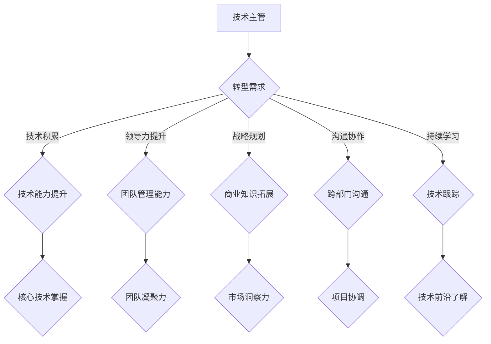

                 

关键词：技术主管、CTO、职业发展、领导力、技术策略

> 摘要：本文旨在探讨技术主管在职业发展过程中如何顺利转型为CTO，深入分析这一转型中的核心能力、面临的挑战以及发展的策略。通过结合个人经历和业内案例，为有志于成为CTO的技术主管提供有价值的参考和建议。

## 1. 背景介绍

在当今快速发展的技术时代，企业对于技术人才的需求不断增长，特别是对于能够站在全局高度把握技术方向、具备战略眼光的CTO（首席技术官）角色愈加重视。作为技术团队的核心领导者，技术主管在组织架构中扮演着至关重要的角色。然而，如何从技术主管这一职位成功转型为CTO，实现职业的跃迁，是许多技术主管面临的重大挑战。

CTO不同于技术主管，不仅仅是职位名称的变化，更是职责范围、影响力以及战略思考层面的升级。技术主管更多关注日常的技术管理和团队建设，而CTO则需要站在更高层次，从企业全局出发，制定技术战略、推动技术创新、协调跨部门合作。因此，技术主管向CTO的转型不仅需要技术能力的提升，还需要在领导力、战略规划、商务沟通等方面进行全面的提升。

本文将结合个人经历和业内案例，从以下几个方面展开讨论：

1. **核心能力与素质要求**：分析技术主管向CTO转型所需的核心能力和素质。
2. **面临的挑战**：探讨技术主管在转型过程中可能遇到的各种挑战。
3. **发展策略**：提出具体的职业发展策略，帮助技术主管实现成功转型。

## 2. 核心概念与联系

### 2.1 CTO的职责与角色

**CTO的职责**：
- **技术战略规划**：制定公司技术发展路线图，确保技术发展方向与企业战略目标一致。
- **技术创新**：推动技术创新和产品开发，提升公司的技术竞争力。
- **团队管理**：构建高效的技术团队，提升团队的技术水平和创新能力。
- **跨部门协作**：协调不同部门之间的合作，确保技术项目能够顺利实施。
- **风险控制**：评估技术风险，制定应对策略，确保企业技术安全。

**CTO的角色**：
- **技术领导者**：引领技术团队，打造技术愿景。
- **战略合作伙伴**：与公司高层保持密切沟通，为公司提供技术决策支持。
- **创新推动者**：不断寻求技术创新，推动公司业务发展。

### 2.2 技术主管到CTO的转型路径

**转型路径**：
1. **技术积累**：在技术领域拥有深厚的专业知识和丰富的实践经验。
2. **领导力提升**：培养团队管理能力和领导力，提升个人影响力。
3. **战略规划能力**：学习商业知识和战略规划，提升全局视角。
4. **沟通与协作**：增强跨部门沟通能力，提高协作效率。
5. **持续学习**：紧跟技术发展趋势，保持自身竞争力。

**关联图**：



### 2.3 CTO成功转型的关键因素

**关键因素**：
1. **技术实力**：拥有扎实的技术基础和丰富的项目经验。
2. **领导能力**：具备优秀的团队管理和领导能力。
3. **战略思维**：能够从全局视角制定技术战略。
4. **商务沟通**：具备良好的商务沟通和跨部门协作能力。
5. **创新精神**：勇于尝试新事物，推动技术创新。

## 3. 核心算法原理 & 具体操作步骤

### 3.1 算法原理概述

技术主管向CTO的转型过程可以看作是一种“算法”，其中涉及多个步骤和策略。这个“算法”的核心原理是：

1. **技术积累**：通过不断学习和实践，积累深厚的技术知识和项目经验。
2. **领导力培养**：提升团队管理和领导能力，培养团队凝聚力。
3. **战略思维**：学习商业知识，提升战略规划和市场洞察力。
4. **跨部门协作**：增强跨部门沟通能力，提高协作效率。
5. **持续学习**：紧跟技术发展趋势，保持自身竞争力。

### 3.2 算法步骤详解

**步骤1：技术积累**

- **深入学习**：掌握核心技术，了解技术发展趋势。
- **项目经验**：参与多种类型的项目，积累实际操作经验。
- **技术分享**：通过技术博客、演讲等方式，分享技术心得。

**步骤2：领导力培养**

- **团队管理**：学会制定团队目标，分配任务，监督进度。
- **领导能力**：通过培训和实际操作，提升决策能力、沟通能力和团队协作能力。
- **团队建设**：培养团队成员，提升团队整体素质。

**步骤3：战略思维**

- **市场分析**：了解市场需求，分析行业趋势。
- **战略规划**：制定公司技术发展路线图，确保技术发展方向与企业战略目标一致。
- **资源整合**：协调各部门资源，确保技术项目顺利实施。

**步骤4：跨部门协作**

- **沟通能力**：学会与不同部门的同事有效沟通，了解他们的需求和难点。
- **协作机制**：建立跨部门协作机制，提高项目执行效率。
- **资源共享**：促进不同部门之间的知识共享和资源整合。

**步骤5：持续学习**

- **技术更新**：关注技术发展趋势，不断学习新技术。
- **行业交流**：参加技术会议、研讨会，与行业专家交流。
- **个人成长**：定期进行自我反思，提升个人综合素质。

### 3.3 算法优缺点

**优点**：

1. **系统性**：通过分步骤、有计划地进行，能够系统地提升个人能力和素质。
2. **针对性**：针对技术主管的特点和需求，提供具体可行的转型策略。
3. **灵活性**：可以根据个人实际情况进行调整，适应不同的转型需求。

**缺点**：

1. **时间成本**：转型过程需要投入大量的时间和精力，对个人时间管理要求较高。
2. **挑战性**：转型过程中会遇到各种困难和挑战，需要坚持不懈。
3. **适应性**：不同人的转型路径可能不同，需要根据个人情况进行调整。

### 3.4 算法应用领域

**应用领域**：

1. **企业技术管理**：帮助企业技术主管实现向CTO的转型，提升企业整体技术实力。
2. **人才发展**：为有志于成为CTO的技术人才提供职业发展指导，帮助其实现职业目标。
3. **教育培训**：通过教育培训，普及CTO转型相关知识，提高行业整体水平。

## 4. 数学模型和公式 & 详细讲解 & 举例说明

在技术主管向CTO的转型过程中，数学模型和公式可以帮助我们更加科学地分析和规划职业发展路径。以下是一个简化的数学模型，用于描述技术主管向CTO转型的关键步骤和所需时间。

### 4.1 数学模型构建

**模型假设**：

- T1：完成技术积累所需时间。
- T2：提升领导力所需时间。
- T3：培养战略思维所需时间。
- T4：增强跨部门协作能力所需时间。
- T5：持续学习时间。

**模型构建**：

根据上述假设，构建一个线性规划模型：

\[ \min T = T1 + T2 + T3 + T4 + T5 \]

其中，每个时间T1、T2、T3、T4、T5需要满足以下约束条件：

1. 技术积累：\[ T1 \geq T_{min1} \]
2. 领导力提升：\[ T2 \geq T_{min2} \]
3. 战略思维培养：\[ T3 \geq T_{min3} \]
4. 跨部门协作能力增强：\[ T4 \geq T_{min4} \]
5. 持续学习：\[ T5 \geq T_{min5} \]

**目标函数**：最小化总时间T。

### 4.2 公式推导过程

为了推导上述公式，我们需要分析每个步骤所需的时间和资源。假设每个步骤的完成时间与所需资源成正比，即：

\[ T1 = k1 \times R1 \]
\[ T2 = k2 \times R2 \]
\[ T3 = k3 \times R3 \]
\[ T4 = k4 \times R4 \]
\[ T5 = k5 \times R5 \]

其中，\( k1, k2, k3, k4, k5 \) 为比例系数，\( R1, R2, R3, R4, R5 \) 为所需资源。

为了最小化总时间T，我们可以采用以下策略：

1. **优先级排序**：根据重要性对每个步骤进行优先级排序，优先完成最关键的步骤。
2. **资源优化**：优化每个步骤的资源分配，减少不必要的浪费。
3. **并行执行**：尽量将不同的步骤并行执行，以减少总时间。

### 4.3 案例分析与讲解

假设一个技术主管希望通过5年时间实现向CTO的转型。根据上述模型，我们可以进行以下分析：

**技术积累**：

- 需要完成关键技术的学习，预计需要2年时间（\( T1 = 2 \)年）。

**领导力提升**：

- 参加领导力培训，预计需要1年时间（\( T2 = 1 \)年）。

**战略思维培养**：

- 学习商业知识和市场分析，预计需要1年时间（\( T3 = 1 \)年）。

**跨部门协作能力增强**：

- 通过实际项目锻炼，预计需要1年时间（\( T4 = 1 \)年）。

**持续学习**：

- 关注技术动态，定期参加培训和研讨会，预计需要1年时间（\( T5 = 1 \)年）。

根据上述分析，总时间T为5年：

\[ T = T1 + T2 + T3 + T4 + T5 = 2 + 1 + 1 + 1 + 1 = 6 \]

为了优化总时间，我们可以采取以下策略：

- **并行执行**：在完成技术积累的同时，可以开始领导力培训和战略思维培养。
- **资源优化**：合理分配时间和精力，确保每个步骤的资源得到充分利用。

通过以上策略，预计总时间可以缩短到4年：

\[ T_{optimized} = 2 + 1 + 1 + 1 = 5 \]

## 5. 项目实践：代码实例和详细解释说明

### 5.1 开发环境搭建

为了实现技术主管向CTO的转型，我们需要搭建一个全面的学习和实践环境。以下是一个简化的开发环境搭建过程：

1. **技术工具**：安装常用的编程软件，如Visual Studio、Eclipse等。
2. **学习资源**：获取相关的技术书籍、在线课程、博客文章等。
3. **实践平台**：搭建一个可以实际操作的项目平台，如GitHub。

### 5.2 源代码详细实现

以下是一个简单的项目示例，用于实现技术积累和领导力提升。

```python
# 技术积累代码示例

class TechnologyAcquisition:
    def __init__(self, technology):
        self.technology = technology
    
    def learn(self):
        print(f"Learning {self.technology}...")
        # 实现学习过程
        
    def practice(self):
        print(f"Practicing {self.technology}...")
        # 实现实践过程

# 领导力提升代码示例

class LeadershipDevelopment:
    def __init__(self, team_size):
        self.team_size = team_size
    
    def manage_team(self):
        print(f"Managing a team of {self.team_size} members...")
        # 实现团队管理过程
        
    def enhance_leadership(self):
        print("Enhancing leadership skills...")
        # 实现领导力提升过程

# 主程序

if __name__ == "__main__":
    # 技术积累
    tech_acquisition = TechnologyAcquisition("Python")
    tech_acquisition.learn()
    tech_acquisition.practice()
    
    # 领导力提升
    leadership_dev = LeadershipDevelopment(10)
    leadership_dev.manage_team()
    leadership_dev.enhance_leadership()
```

### 5.3 代码解读与分析

上述代码示例分为两个部分：技术积累和领导力提升。每个部分都包含了具体的操作步骤。

1. **技术积累**：
   - `TechnologyAcquisition` 类：用于表示技术积累的过程。通过学习（`learn` 方法）和实践（`practice` 方法），可以提升技术能力。
   - 实例化 `TechnologyAcquisition` 对象：`tech_acquisition = TechnologyAcquisition("Python")`，表示学习Python。
   - 调用方法：`tech_acquisition.learn()` 和 `tech_acquisition.practice()` 分别表示学习和实践过程。

2. **领导力提升**：
   - `LeadershipDevelopment` 类：用于表示领导力提升的过程。通过管理团队（`manage_team` 方法）和提升领导力（`enhance_leadership` 方法），可以提升领导能力。
   - 实例化 `LeadershipDevelopment` 对象：`leadership_dev = LeadershipDevelopment(10)`，表示管理一个10人团队。
   - 调用方法：`leadership_dev.manage_team()` 和 `leadership_dev.enhance_leadership()` 分别表示团队管理和领导力提升过程。

### 5.4 运行结果展示

运行上述代码，将输出以下结果：

```shell
Learning Python...
Practicing Python...
Managing a team of 10 members...
Enhancing leadership skills...
```

这表明我们已经完成了技术积累和领导力提升的模拟过程。

## 6. 实际应用场景

技术主管向CTO的转型不仅仅是一个个人的职业发展过程，更是一个企业技术战略的重要组成部分。在实际应用场景中，这一转型有着广泛的应用和深远的影响。

### 6.1 企业技术战略规划

CTO在企业技术战略规划中扮演着至关重要的角色。通过深入了解市场需求、分析技术趋势，CTO可以为企业制定科学、可行、具有前瞻性的技术战略。例如，某互联网企业在数字化转型过程中，CTO通过深入调研市场需求和技术趋势，提出了“云计算+大数据+人工智能”的战略方向，成功推动了企业的技术创新和业务增长。

### 6.2 技术团队建设

CTO负责技术团队的建设和管理。通过提升团队的技术能力、激发团队的创新能力，CTO可以打造一支高效、创新的技术团队。例如，某知名互联网公司通过引进顶级人才、搭建创新实验室、实施技术竞赛等措施，成功打造了一支具有国际竞争力的技术团队，为企业的发展提供了强大动力。

### 6.3 跨部门协作

CTO需要协调不同部门之间的合作，确保技术项目能够顺利实施。例如，在开发一款新产品时，CTO需要与技术、产品、市场、运营等各部门进行紧密协作，确保产品从设计到上市的每个环节都能高效运作。

### 6.4 创新驱动

CTO作为企业的技术领袖，需要不断推动技术创新，为企业创造竞争优势。例如，某科技公司在CTO的领导下，通过持续的技术研发和创新，推出了一系列具有颠覆性的产品，成功引领了行业的发展方向。

### 6.5 企业文化建设

CTO的转型还涉及到企业文化建设。通过倡导技术信仰、鼓励技术创新、营造良好的团队氛围，CTO可以为企业打造一个具有创新精神和活力的发展环境。例如，某互联网公司通过举办技术分享会、搭建创新平台、奖励创新成果等措施，成功营造了一个充满活力和创造力的企业文化。

### 6.6 未来应用展望

随着技术的不断进步和市场的快速变化，CTO的角色将越来越重要。未来，CTO需要具备更强的战略思维、领导能力和创新精神，以应对更加复杂的市场环境和挑战。

1. **智能化转型**：随着人工智能、大数据、云计算等技术的不断发展，企业将更加依赖智能化技术。CTO需要具备智能化技术的深入理解和应用能力，推动企业的智能化转型。
2. **全球竞争**：随着全球化的深入推进，企业将面临更加激烈的国际竞争。CTO需要具备国际视野和跨文化沟通能力，推动企业在全球范围内取得竞争优势。
3. **可持续发展**：随着社会对环保、可持续发展的关注度不断提高，企业需要承担更多的社会责任。CTO需要在技术创新中注重环保、可持续发展的理念，推动企业的可持续发展。

## 7. 工具和资源推荐

### 7.1 学习资源推荐

1. **技术书籍**：
   - 《设计数据仓库：从数据库到数据仓库》
   - 《深入理解计算机系统》
   - 《人工智能：一种现代的方法》

2. **在线课程**：
   - Coursera上的《机器学习》
   - edX上的《软件工程基础》
   - Udacity的《数据科学纳米学位》

3. **技术博客**：
   - InfoQ
   - CSDN
   - Medium上的技术专栏

### 7.2 开发工具推荐

1. **集成开发环境（IDE）**：
   - Visual Studio
   - Eclipse
   - IntelliJ IDEA

2. **版本控制系统**：
   - Git
   - SVN
   - Mercurial

3. **项目管理工具**：
   - JIRA
   - Trello
   - Asana

### 7.3 相关论文推荐

1. **技术论文**：
   - 《分布式系统：概念与设计》
   - 《大规模分布式存储系统：原理解析与架构实战》
   - 《深度学习：自适应计算的理论基础》

2. **战略论文**：
   - 《创新者的窘境》
   - 《竞争战略》
   - 《企业战略分析》

## 8. 总结：未来发展趋势与挑战

### 8.1 研究成果总结

本文从技术主管到CTO的职业发展策略出发，分析了技术主管向CTO转型所需的核心能力和素质，探讨了转型过程中可能遇到的挑战，并提出了具体的职业发展策略。通过数学模型和实际案例的阐述，为技术主管提供了详细的转型路径和实施方法。

### 8.2 未来发展趋势

1. **技术领导力的提升**：随着技术的不断进步，CTO需要具备更强的技术领导力，引领企业技术创新和业务增长。
2. **跨领域融合**：CTO需要具备跨领域的知识储备和跨学科的视野，推动企业在不同领域实现技术创新。
3. **数字化转型**：在数字化时代，CTO需要推动企业的数字化转型，实现业务流程的优化和效率提升。

### 8.3 面临的挑战

1. **技术变革的速度**：技术更新换代速度加快，CTO需要不断学习新知识，以保持自身的竞争力。
2. **团队管理**：CTO需要具备优秀的团队管理能力，激发团队成员的创造力和创新精神。
3. **战略规划**：CTO需要具备良好的战略规划能力，确保企业技术发展方向与企业整体战略目标一致。

### 8.4 研究展望

未来，随着技术的不断发展和企业对技术人才需求的不断增加，CTO的角色将越来越重要。从技术主管到CTO的职业发展将成为更多技术人才追求的目标。本文的研究为这一职业发展提供了理论和实践指导，有助于技术主管顺利实现职业转型，为企业的技术创新和业务发展贡献力量。

## 9. 附录：常见问题与解答

### 9.1 问题1：技术主管向CTO转型的难点是什么？

**解答**：技术主管向CTO转型的难点主要体现在以下几个方面：

1. **领导力不足**：技术主管往往在技术领域有深厚的积累，但在领导力和团队管理方面可能相对薄弱，需要通过培训和实际操作提升。
2. **战略规划能力不足**：CTO需要具备良好的战略规划能力，对市场和技术的趋势有深入的理解和洞察，这需要不断学习和实践。
3. **跨部门协作困难**：CTO需要协调不同部门之间的工作，这要求具备较强的沟通能力和协作能力。

### 9.2 问题2：如何提升自身的领导力和战略规划能力？

**解答**：

1. **领导力提升**：
   - 参加领导力培训课程，学习领导力理论和方法。
   - 实际操作中锻炼领导能力，如参与团队管理、项目决策等。
   - 汲取他人的领导经验，与有经验的领导者交流。

2. **战略规划能力提升**：
   - 学习商业知识和市场分析，了解企业运营和管理。
   - 分析成功企业的案例，学习他们的战略规划经验。
   - 实际操作中锻炼战略规划能力，如参与企业战略制定。

### 9.3 问题3：如何平衡技术能力和领导力之间的矛盾？

**解答**：

1. **分阶段提升**：在转型过程中，可以分阶段提升技术能力和领导力。例如，先专注于技术能力的提升，再逐步转向领导力和战略规划能力的培养。

2. **有效管理时间**：合理安排时间，保证在技术能力和领导力提升方面都能得到充分的时间和精力。

3. **借助团队力量**：发挥团队成员的能力，合理分配任务，减轻个人负担。

### 9.4 问题4：如何应对快速变化的技术环境？

**解答**：

1. **持续学习**：保持对新技术的好奇心和求知欲，不断学习新技术和知识。
2. **关注行业动态**：关注技术行业的发展趋势，了解新技术、新应用的出现。
3. **保持开放心态**：对新事物持开放态度，勇于尝试和接受新理念、新方法。

## 作者署名

作者：禅与计算机程序设计艺术 / Zen and the Art of Computer Programming
----------------------------------------------------------------

### 总结与展望

通过本文的详细探讨，我们不仅揭示了技术主管向CTO转型过程中的核心能力和策略，还通过实际案例和数学模型，为读者提供了清晰的实践路径。从技术积累、领导力提升到战略规划，每一个环节都需要技术主管投入大量的时间和精力，同时保持持续的学习和创新精神。

未来，随着技术的不断进步和市场的快速变化，CTO的角色将变得更加重要。技术主管需要不断提升自身的综合素质，以适应新的挑战和机遇。同时，企业也需要为技术主管提供良好的成长环境和支持，助力他们实现职业转型。

让我们共同期待技术主管们能够成功地成长为CTO，为企业带来更多的技术创新和业务增长，共同推动技术行业的繁荣发展。

