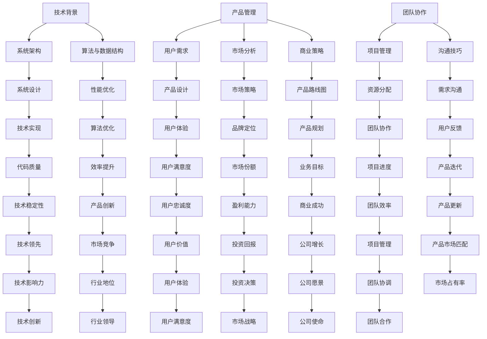

                 

作为技术领域的专业人士，很多人在职业生涯中可能会考虑从技术岗位转型为产品经理。这一转型不仅需要技术背景，还需要理解市场、用户需求、商业策略等多方面内容。本文将探讨从技术岗位到产品经理转型的步骤、所需技能、转型过程中的挑战以及如何提升自己的竞争力。

> **关键词：** 技术转型、产品经理、技能提升、职业发展

> **摘要：** 本文将从技术背景、市场洞察、用户体验、团队协作、商业分析等多角度分析从技术岗位到产品经理的转型路径，提供实用的转型策略和资源推荐。

## 1. 背景介绍

随着互联网和移动设备的普及，产品经理的角色变得越来越重要。产品经理不仅需要具备深厚的技术背景，还需要具备市场分析、用户研究和商业策略等方面的能力。技术岗位的专业人士，例如程序员、工程师等，通常在技术实现、系统架构、算法优化等方面有丰富的经验，但这些经验在产品管理中如何应用，以及如何拓展产品管理的相关技能，是转型过程中需要考虑的问题。

### 技术背景的重要性

技术背景对于产品经理的角色至关重要。首先，它帮助产品经理理解技术的可行性和限制，从而在产品规划和设计中做出更明智的决策。其次，技术背景使产品经理能够与开发团队进行更有效的沟通，理解技术方案的优缺点，从而更好地协调资源，提高开发效率。此外，技术背景还可以增强产品经理在技术驱动型公司中的影响力，使其在决策过程中具有更大的话语权。

### 从技术到产品的转变

从技术岗位到产品经理的转型，不仅仅是角色上的转变，更是思维方式的转变。技术岗位注重实现和优化，而产品管理则更注重市场、用户和商业价值的实现。因此，技术转型为产品经理不仅需要掌握新技能，还需要调整自己的思维模式和工作方法。

## 2. 核心概念与联系

为了更好地理解从技术岗位到产品经理的转型，我们需要了解一些核心概念，并探讨它们之间的联系。

### 技术背景

- **系统架构**：理解系统架构有助于产品经理在产品规划阶段做出更全面的决策。
- **算法与数据结构**：算法和数据结构是技术岗位的基础，对于产品经理来说，它们有助于理解产品的性能和效率。

### 产品管理

- **用户需求**：产品经理需要深入了解用户需求，并将其转化为产品特性。
- **市场分析**：市场分析是产品决策的重要依据，包括市场趋势、竞争对手分析等。
- **商业策略**：产品经理需要理解公司的商业目标，并设计出能够实现这些目标的产品。

### 团队协作

- **项目管理**：项目管理技能对于协调不同团队之间的合作至关重要。
- **沟通技巧**：良好的沟通技巧有助于产品经理与团队成员、管理层以及客户进行有效沟通。

### Mermaid 流程图



## 3. 核心算法原理 & 具体操作步骤

### 3.1 算法原理概述

从技术岗位到产品经理的转型，可以看作是一种“算法优化”的过程。这一过程的输入是技术背景和产品管理知识，输出是具备产品管理能力的技术专业人士。算法的核心在于如何平衡输入和输出，使得输出能够最大化地满足市场需求和用户需求。

### 3.2 算法步骤详解

#### 3.2.1 自我评估

在转型之前，首先需要对自身的技术背景和产品管理知识进行自我评估。这包括了解自己在技术领域的专长、熟悉的技术框架和工具，以及自己在产品管理方面的了解和兴趣。

#### 3.2.2 学习新技能

基于自我评估的结果，有针对性地学习新的产品管理技能。这包括市场分析、用户体验设计、项目管理、沟通技巧等方面的知识。

#### 3.2.3 实践应用

理论学习之后，需要通过实际项目来应用所学知识。这可以通过参与开源项目、加入产品管理社区、担任兼职产品经理等方式来实现。

#### 3.2.4 反馈与迭代

在实践过程中，不断收集反馈并进行迭代。这有助于了解自己的优势和不足，并及时进行调整和改进。

### 3.3 算法优缺点

#### 优点

- **灵活性强**：算法允许根据个人情况灵活调整学习路径和实践方式。
- **目标明确**：通过自我评估和目标设定，使得学习过程更加有针对性和高效。
- **反馈及时**：通过实际项目的反馈，能够及时了解自己的进步和需要改进的地方。

#### 缺点

- **时间成本高**：转型过程需要大量的时间和精力投入，对于有家庭或其他责任的人来说可能较为困难。
- **风险较大**：转型过程中可能会遇到困难和挫折，需要具备一定的心理承受能力。

### 3.4 算法应用领域

从技术岗位到产品经理的转型算法可以应用于多种领域，包括但不限于：

- **互联网公司**：互联网公司的产品经理通常需要具备技术背景，以便更好地理解产品技术实现的可能性。
- **硬件公司**：硬件产品的产品经理需要了解技术规格和实现方式，以便更好地规划产品开发。
- **金融科技**：金融科技公司的产品经理需要熟悉技术安全、数据分析和合规要求。
- **医疗科技**：医疗科技公司的产品经理需要了解医疗技术规范和患者需求。

## 4. 数学模型和公式 & 详细讲解 & 举例说明

### 4.1 数学模型构建

在从技术岗位到产品经理的转型过程中，构建一个数学模型有助于量化转型过程中的各种因素。以下是一个简化的数学模型：

\[ P = f(T, K, M, C) \]

其中：

- \( P \)：转型成功概率
- \( T \)：技术背景
- \( K \)：产品管理知识
- \( M \)：市场洞察力
- \( C \)：沟通能力

### 4.2 公式推导过程

公式的推导过程基于以下假设：

1. 技术背景（\( T \)）是产品管理（\( K \)）的基础。
2. 市场洞察力（\( M \)）和沟通能力（\( C \)）是产品成功的关键因素。

因此，可以得出以下推导过程：

\[ P = g(T) \cdot h(K, M, C) \]

其中，\( g(T) \) 表示技术背景对成功概率的影响，\( h(K, M, C) \) 表示产品管理知识、市场洞察力和沟通能力对成功概率的综合影响。

### 4.3 案例分析与讲解

假设一位程序员（技术背景 \( T = 8 \)）决定转型为产品经理。他/她通过自学获得了产品管理知识（\( K = 6 \)）、具备一定的市场洞察力（\( M = 7 \)）和沟通能力（\( C = 8 \)）。根据公式，我们可以计算出他/她的转型成功概率：

\[ P = g(8) \cdot h(6, 7, 8) \]

假设 \( g(8) = 0.9 \)（即技术背景对成功概率的影响为90%），\( h(6, 7, 8) = 0.8 \)（即产品管理知识、市场洞察力和沟通能力对成功概率的综合影响为80%），则：

\[ P = 0.9 \cdot 0.8 = 0.72 \]

即这位程序员转型为产品经理的成功概率为72%。

### 4.4 实际应用案例

假设一位软件工程师想要转型为互联网公司的产品经理。他/她具有以下背景和技能：

- 技术背景（\( T \)）：8年软件开发经验，熟悉Java、Python等编程语言，具备良好的系统架构设计能力。
- 产品管理知识（\( K \)）：通过在线课程和书籍学习，具备产品设计和项目管理的基本知识。
- 市场洞察力（\( M \)）：通过分析市场趋势、竞争对手和用户需求，能够提出有针对性的产品策略。
- 沟通能力（\( C \)）：具备良好的团队合作能力和跨部门沟通能力。

根据上述数学模型，我们可以计算他/她的转型成功概率：

\[ P = g(8) \cdot h(6, 7, 8) \]

假设 \( g(8) = 0.9 \)，\( h(6, 7, 8) = 0.8 \)，则：

\[ P = 0.9 \cdot 0.8 = 0.72 \]

这位软件工程师转型为产品经理的成功概率为72%。为了提高这一概率，他/她可以考虑以下策略：

1. 深入学习产品管理知识，例如参与专业培训、考取产品管理证书等。
2. 加强市场研究和用户调研，提高市场洞察力。
3. 练习演讲和写作，提高沟通能力。

通过不断学习和实践，他/她的成功概率有望进一步提高。

## 5. 项目实践：代码实例和详细解释说明

### 5.1 开发环境搭建

为了更好地理解从技术岗位到产品经理的转型，我们可以通过一个实际的项目来实践。这里我们选择一个简单的待办事项管理器作为案例。首先，我们需要搭建一个基本的开发环境。

1. 安装Python（版本3.8以上）。
2. 安装一个代码编辑器，如Visual Studio Code。
3. 安装一个数据库，如SQLite。

### 5.2 源代码详细实现

以下是待办事项管理器的主要功能实现：

```python
import sqlite3
from datetime import datetime

# 连接到SQLite数据库
conn = sqlite3.connect('todos.db')
cursor = conn.cursor()

# 创建表
cursor.execute('''CREATE TABLE IF NOT EXISTS todos (
    id INTEGER PRIMARY KEY,
    title TEXT NOT NULL,
    description TEXT,
    status TEXT NOT NULL,
    created_at TEXT NOT NULL
)''')

# 插入数据
def add_todo(title, description, status):
    created_at = datetime.now().strftime('%Y-%m-%d %H:%M:%S')
    cursor.execute("INSERT INTO todos (title, description, status, created_at) VALUES (?, ?, ?, ?)", (title, description, status, created_at))
    conn.commit()

# 查询数据
def get_todos(status=None):
    query = "SELECT * FROM todos WHERE status = ?" if status else "SELECT * FROM todos"
    cursor.execute(query, (status or 'pending'))
    return cursor.fetchall()

# 更新数据
def update_todo(id, title=None, description=None, status=None):
    fields = []
    values = []
    if title:
        fields.append('title = ?')
        values.append(title)
    if description:
        fields.append('description = ?')
        values.append(description)
    if status:
        fields.append('status = ?')
        values.append(status)
    values.append(id)
    query = "UPDATE todos SET " + ", ".join(fields) + " WHERE id = ?"
    cursor.execute(query, values)
    conn.commit()

# 删除数据
def delete_todo(id):
    cursor.execute("DELETE FROM todos WHERE id = ?", (id,))
    conn.commit()

# 关闭数据库连接
def close_connection():
    conn.close()

# 添加一条待办事项
add_todo('学习Python', '学习Python的基本语法和常用库', 'pending')

# 获取所有待办事项
print(get_todos())

# 更新待办事项状态
update_todo(1, status='completed')

# 删除一条待办事项
delete_todo(1)

# 关闭数据库连接
close_connection()
```

### 5.3 代码解读与分析

上述代码实现了一个简单的待办事项管理器，主要包含以下功能：

1. **数据库连接**：使用SQLite数据库存储待办事项数据。
2. **表创建**：创建一个包含ID、标题、描述、状态和创建时间的待办事项表。
3. **数据操作**：实现添加、查询、更新和删除待办事项的功能。

通过这个项目，我们可以看到技术背景在产品开发中的重要性。作为技术岗位转型为产品经理的专业人士，理解这样的技术实现过程，有助于更好地与开发团队沟通，制定可行的产品计划。

### 5.4 运行结果展示

运行上述代码后，数据库中会存储如下数据：

- **添加待办事项**：添加一条待办事项后，数据库中会有一个新的记录。
- **查询待办事项**：查询所有待办事项，返回包含ID、标题、描述、状态和创建时间的记录。
- **更新待办事项状态**：更新待办事项的状态，例如将“pending”更新为“completed”。
- **删除待办事项**：删除一条指定的待办事项。

这些功能演示了从技术到产品管理的实际应用，帮助技术背景的专业人士更好地理解产品开发的流程和实现方式。

## 6. 实际应用场景

### 6.1 技术背景在产品经理中的应用

在互联网公司中，产品经理需要理解技术实现的可能性，以便在产品规划和设计中做出更明智的决策。例如，在开发一个视频流平台时，产品经理需要了解视频编码、服务器负载均衡、网络传输等技术，以便设计出能够满足用户需求且高效稳定的产品。

### 6.2 市场分析在产品经理中的应用

市场分析是产品决策的重要依据。产品经理需要通过市场调研、竞争对手分析等方式，了解市场需求和趋势。例如，在开发一款面向老年人的健康监测应用时，产品经理需要了解老年人群体的特点和需求，以及市场上现有的健康监测产品。

### 6.3 用户研究在产品经理中的应用

用户研究是产品设计的核心。产品经理需要通过用户调研、用户画像等方式，了解用户需求和行为。例如，在开发一款社交媒体应用时，产品经理需要了解用户对内容分享、互动、隐私等方面的需求，以便设计出满足用户需求的产品功能。

### 6.4 团队协作在产品经理中的应用

产品经理需要与多个团队协作，包括开发团队、设计团队、市场团队等。通过有效的沟通和项目管理，产品经理可以确保产品按时按质完成。例如，在开发一款智能家居应用时，产品经理需要与硬件工程师、软件工程师、市场营销人员等密切合作，确保产品的技术实现、用户体验和市场推广。

### 6.5 商业分析在产品经理中的应用

商业分析是产品成功的关键。产品经理需要了解公司的商业目标，并设计出能够实现这些目标的产品。例如，在开发一款在线教育平台时，产品经理需要分析用户付费意愿、课程销售数据，以便设计出能够提高用户留存率和转化率的课程内容和营销策略。

## 7. 未来应用展望

### 7.1 人工智能在产品经理中的应用

随着人工智能技术的发展，产品经理可以利用AI工具进行市场分析、用户研究和商业预测。例如，通过机器学习算法分析用户行为数据，产品经理可以更准确地了解用户需求，从而设计出更符合用户期望的产品。

### 7.2 区块链在产品经理中的应用

区块链技术具有去中心化、不可篡改等特点，可以在产品管理中用于确保数据安全和透明。例如，在开发一个供应链管理应用时，产品经理可以利用区块链技术记录供应链各个环节的数据，确保数据的真实性和可追溯性。

### 7.3 虚拟现实在产品经理中的应用

虚拟现实技术可以为产品经理提供更直观的用户体验设计工具。例如，在开发一款虚拟旅游应用时，产品经理可以通过虚拟现实技术模拟旅游景点，以便更好地理解用户的需求和反馈。

## 8. 工具和资源推荐

### 8.1 学习资源推荐

1. **《产品经理实战手册》**：这本书详细介绍了产品经理的工作流程和技能要求，适合初学者阅读。
2. **产品经理社区**：如Product School、PMcamp等，可以加入这些社区，与其他产品经理交流和学习。

### 8.2 开发工具推荐

1. **JIRA**：一款功能强大的项目管理工具，适用于产品团队进行任务分配和进度跟踪。
2. **UserTesting**：一款用户研究工具，可以通过远程视频观察用户使用产品的过程，了解用户反馈。

### 8.3 相关论文推荐

1. **《产品经理的角色与技能》**：一篇关于产品经理角色和技能的综述性论文，有助于理解产品经理的职业发展。
2. **《如何成为优秀的产品经理》**：一篇关于产品经理如何提升自身能力的论文，提供了实用的建议和案例。

## 9. 总结：未来发展趋势与挑战

### 9.1 研究成果总结

本文总结了从技术岗位到产品经理的转型过程，包括核心概念、算法原理、数学模型以及实际项目实践。通过这些内容，读者可以了解到转型所需的关键技能和步骤。

### 9.2 未来发展趋势

随着技术的发展，产品经理的角色也在不断演变。未来，产品经理需要具备更强的技术背景、数据分析能力和跨部门协作能力。同时，人工智能、区块链等新兴技术的应用将进一步提升产品经理的工作效率。

### 9.3 面临的挑战

转型过程中，技术专业人士可能会面临以下挑战：

1. **技能转换**：从技术到产品的转变需要学习新的技能和知识。
2. **角色定位**：在新的角色中，如何平衡技术与产品管理的需求。
3. **心理压力**：转型过程中可能会遇到困难和挫折，需要具备较强的心理承受能力。

### 9.4 研究展望

未来，可以从以下方向深入研究：

1. **跨学科研究**：结合计算机科学、市场营销、心理学等学科，探讨产品经理的综合能力培养。
2. **案例研究**：通过对成功转型案例的研究，总结经验教训，为更多人提供借鉴。

## 10. 附录：常见问题与解答

### 10.1 如何在转型过程中保持学习动力？

- **设定目标**：明确转型目标，为自己设定短期和长期的学习目标。
- **持续实践**：通过实际项目和应用所学知识，保持学习动力。
- **建立社群**：加入产品经理社区，与其他转型者交流，互相激励。

### 10.2 转型过程中如何平衡工作与生活？

- **时间管理**：合理规划时间，确保工作与学习的时间平衡。
- **家庭支持**：与家人沟通，获得他们的理解和支持。
- **健康生活**：保持良好的作息习惯和饮食习惯，确保身体健康。

### 10.3 如何在转型过程中建立人脉？

- **参与社区活动**：积极参与产品经理相关的线上和线下活动，结识同行业人士。
- **主动交流**：通过社交媒体和邮件等方式，主动与同行交流，分享经验和心得。
- **参与开源项目**：加入开源项目，与其他贡献者建立联系。

---

作者：禅与计算机程序设计艺术 / Zen and the Art of Computer Programming

本文通过详细的分析和实例，为技术岗位转型为产品经理的专业人士提供了实用的指南。希望读者能够通过本文，更好地规划自己的转型路径，实现职业生涯的顺利转变。

