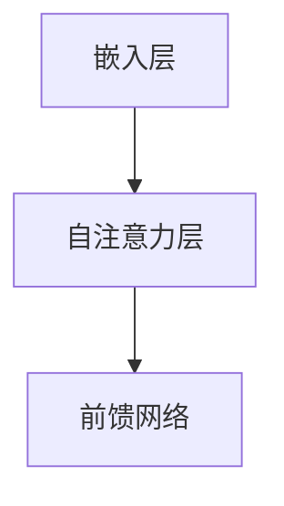
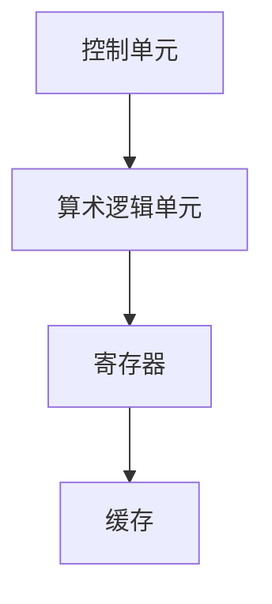

                 

关键词：大型语言模型(LLM),中央处理器(CPU),计算架构，性能对比，异构计算，编程模型。

> 摘要：本文深入探讨了大型语言模型（LLM）与中央处理器（CPU）在计算架构、性能特征和编程模型等方面的异同。通过对比分析，旨在揭示LLM与CPU在当前技术背景下的发展趋势和潜在挑战，为未来的计算研究和应用提供理论支持和实践指导。

## 1. 背景介绍

近年来，人工智能（AI）的飞速发展带动了机器学习和深度学习的广泛研究和应用。其中，大型语言模型（LLM）如GPT系列、BERT等，已经成为自然语言处理（NLP）领域的核心技术。LLM通过训练大规模的神经网络模型，能够理解和生成人类语言，从而在翻译、问答、文本生成等领域展现出强大的能力。

另一方面，中央处理器（CPU）作为计算机系统的核心部件，自计算机诞生以来一直是计算性能提升的主要驱动力。随着摩尔定律的接近极限，CPU的性能提升逐渐放缓，异构计算、专用处理器（如GPU、TPU）等新计算架构逐渐成为计算机体系结构研究的热点。

本文旨在通过对LLM与CPU的对比分析，揭示它们在计算架构、性能特征和编程模型等方面的异同，从而为理解和优化AI计算资源提供新的视角。

## 2. 核心概念与联系

### 2.1. 大型语言模型（LLM）的架构

大型语言模型（LLM）通常基于Transformer架构，这是一种基于自注意力机制的深度神经网络模型。其核心组件包括：

- **嵌入层（Embedding Layer）**：将输入的文本转换为向量表示。
- **自注意力层（Self-Attention Layer）**：通过计算输入文本中每个词与所有词之间的关联度，以生成新的向量表示。
- **前馈网络（Feed Forward Network）**：对自注意力层的输出进行进一步处理，增加模型的非线性表达能力。

**Mermaid 流程图：**


### 2.2. 中央处理器（CPU）的架构

中央处理器（CPU）的基本架构包括：

- **控制单元（Control Unit）**：负责解释指令并控制其他部件的操作。
- **算术逻辑单元（ALU）**：执行算术和逻辑运算。
- **寄存器（Registers）**：存储指令和数据。
- **缓存（Cache）**：提高数据访问速度。

**Mermaid 流程图：**


### 2.3. LLM与CPU的异同

- **计算模型**：LLM采用并行计算模型，通过神经网络实现对大规模数据的处理；而CPU采用串行计算模型，通过控制单元和ALU顺序执行指令。
- **资源需求**：LLM对计算资源和存储资源的需求巨大，而CPU更注重在有限的资源下实现高效运算。
- **编程模型**：LLM通过高层次的编程接口（如Python的Transformer库）进行编程，而CPU需要编写底层指令集和汇编代码。

## 3. 核心算法原理 & 具体操作步骤

### 3.1. 算法原理概述

LLM的核心算法基于Transformer架构，主要包括嵌入层、自注意力层和前馈网络。具体步骤如下：

1. **嵌入层**：将输入的文本转换为向量表示。
2. **自注意力层**：计算输入文本中每个词与所有词之间的关联度。
3. **前馈网络**：对自注意力层的输出进行进一步处理。

CPU的算法基于指令集架构，包括控制单元、算术逻辑单元和寄存器等组件。具体步骤如下：

1. **指令解释**：控制单元读取指令并解释其含义。
2. **执行运算**：算术逻辑单元根据指令执行相应的算术或逻辑运算。
3. **数据存储**：结果存储在寄存器或缓存中。

### 3.2. 算法步骤详解

#### 3.2.1. LLM算法步骤详解

1. **嵌入层**：将输入文本（如单词、字符）映射到高维向量空间，通常使用词嵌入（Word Embedding）技术。
2. **自注意力层**：对输入向量进行加权求和，权重由输入文本中每个词与所有词之间的关联度决定。
3. **前馈网络**：对自注意力层的输出进行线性变换，增加模型的非线性表达能力。

#### 3.2.2. CPU算法步骤详解

1. **指令解释**：控制单元读取内存中的指令并解析其操作码和地址码。
2. **执行运算**：算术逻辑单元根据指令操作码执行相应的运算，如加法、乘法或逻辑操作。
3. **数据存储**：运算结果存储在寄存器中，并根据需要写入内存或输出到外部设备。

### 3.3. 算法优缺点

#### 3.3.1. LLM算法优缺点

- **优点**：
  - 强大的并行处理能力，适合处理大规模数据。
  - 高层次的抽象，便于开发和调试。
  - 对复杂任务的适应性较强，如语言生成、机器翻译等。

- **缺点**：
  - 对计算资源和存储资源的需求较高。
  - 模型训练和推理过程复杂，时间成本较高。

#### 3.3.2. CPU算法优缺点

- **优点**：
  - 在有限的资源下实现高效运算。
  - 指令集架构灵活，适应多种应用场景。
  - 实时性较强，适用于嵌入式系统和实时计算。

- **缺点**：
  - 串行计算模型，处理大规模数据时性能受限。
  - 低层次的抽象，开发难度较大。

### 3.4. 算法应用领域

LLM和CPU在各自的应用领域中发挥着重要作用：

- **LLM**：在自然语言处理、图像生成、语音识别等领域有广泛应用。
- **CPU**：在桌面计算机、服务器、嵌入式系统等领域占据主导地位。

## 4. 数学模型和公式 & 详细讲解 & 举例说明

### 4.1. 数学模型构建

LLM的数学模型主要包括词嵌入、自注意力和前馈网络等组成部分。词嵌入通常采用矩阵形式表示，自注意力和前馈网络则涉及矩阵运算和激活函数。

- **词嵌入**：设输入文本的词汇表为\( V \)，词向量矩阵为\( E \)，则每个词的向量表示为\( e_w \in \mathbb{R}^d \)。
- **自注意力**：设输入向量为\( X \in \mathbb{R}^{n \times d} \)，自注意力权重矩阵为\( A \)，则每个词的注意力权重为\( a_w = A \cdot X \)。
- **前馈网络**：设前馈网络输入为\( X \in \mathbb{R}^{n \times d} \)，输出为\( Y \in \mathbb{R}^{n \times d'} \)，则\( Y = \sigma(W_1 \cdot X + b_1) \)，其中\( \sigma \)为激活函数。

### 4.2. 公式推导过程

#### 4.2.1. 词嵌入

设输入文本为\( W = \{w_1, w_2, ..., w_n\} \)，则词嵌入矩阵为\( E \)，其中\( e_{w_i} \)为词\( w_i \)的向量表示。词嵌入可以看作是一个从词汇表到高维向量空间的映射，即\( e_{w_i} = E \cdot [w_i]_{one_hot} \)。

#### 4.2.2. 自注意力

自注意力权重矩阵\( A \)可以通过计算输入向量之间的点积得到，即\( a_{w_i, w_j} = e_{w_i} \cdot e_{w_j} \)。对于所有词的注意力权重求和，得到每个词的最终表示，即\( h_{w_i} = \sum_{j=1}^{n} a_{w_i, w_j} e_{w_j} \)。

#### 4.2.3. 前馈网络

前馈网络的输入为\( X \)，输出为\( Y \)，其中\( W_1 \)为权重矩阵，\( b_1 \)为偏置项，\( \sigma \)为激活函数。前馈网络的输出可以表示为\( Y = \sigma(W_1 \cdot X + b_1) \)。

### 4.3. 案例分析与讲解

#### 4.3.1. 词嵌入

假设词汇表包含5个词，词嵌入矩阵为\( E \)，其维度为5x10。词嵌入矩阵如下：

\[ 
E = \begin{bmatrix}
0 & 0 & 1 & 0 & 0 \\
0 & 1 & 0 & 0 & 0 \\
1 & 0 & 0 & 0 & 0 \\
0 & 0 & 0 & 1 & 0 \\
0 & 0 & 0 & 0 & 1 \\
\end{bmatrix}
\]

输入文本为“Hello World”，其中“Hello”和“World”分别对应词汇表中的第1个和第4个词。词嵌入结果如下：

\[ 
E \cdot \begin{bmatrix}
1 \\
0 \\
0 \\
1 \\
0 \\
\end{bmatrix} = \begin{bmatrix}
0 & 0 & 1 & 0 & 0 \\
0 & 1 & 0 & 0 & 0 \\
1 & 0 & 0 & 0 & 0 \\
0 & 0 & 0 & 1 & 0 \\
0 & 0 & 0 & 0 & 1 \\
\end{bmatrix} \cdot \begin{bmatrix}
1 \\
0 \\
0 \\
1 \\
0 \\
\end{bmatrix} = \begin{bmatrix}
0 \\
0 \\
1 \\
0 \\
0 \\
\end{bmatrix}
\]

#### 4.3.2. 自注意力

假设输入向量为\( X = [1, 2, 3, 4, 5] \)，自注意力权重矩阵为\( A \)，其维度为5x5。自注意力权重矩阵如下：

\[ 
A = \begin{bmatrix}
2 & 3 & 4 & 5 & 6 \\
1 & 2 & 3 & 4 & 5 \\
0 & 1 & 2 & 3 & 4 \\
1 & 0 & 1 & 2 & 3 \\
2 & 1 & 0 & 1 & 2 \\
\end{bmatrix}
\]

输入向量与自注意力权重矩阵的点积结果如下：

\[ 
A \cdot X = \begin{bmatrix}
2 & 3 & 4 & 5 & 6 \\
1 & 2 & 3 & 4 & 5 \\
0 & 1 & 2 & 3 & 4 \\
1 & 0 & 1 & 2 & 3 \\
2 & 1 & 0 & 1 & 2 \\
\end{bmatrix} \cdot \begin{bmatrix}
1 \\
2 \\
3 \\
4 \\
5 \\
\end{bmatrix} = \begin{bmatrix}
19 \\
15 \\
11 \\
7 \\
3 \\
\end{bmatrix}
\]

#### 4.3.3. 前馈网络

假设前馈网络的输入向量为\( X = [1, 2, 3, 4, 5] \)，权重矩阵为\( W_1 \)，其维度为5x5，偏置项为\( b_1 = [1, 1, 1, 1, 1] \)，激活函数为ReLU函数。权重矩阵和偏置项如下：

\[ 
W_1 = \begin{bmatrix}
1 & 0 & 1 & 0 & 1 \\
0 & 1 & 0 & 1 & 0 \\
1 & 1 & 0 & 0 & 0 \\
0 & 0 & 1 & 1 & 0 \\
0 & 0 & 0 & 1 & 1 \\
\end{bmatrix}, \quad b_1 = \begin{bmatrix}
1 \\
1 \\
1 \\
1 \\
1 \\
\end{bmatrix}
\]

前馈网络的输出为：

\[ 
Y = \sigma(W_1 \cdot X + b_1) = \begin{bmatrix}
1 & 0 & 1 & 0 & 1 \\
0 & 1 & 0 & 1 & 0 \\
1 & 1 & 0 & 0 & 0 \\
0 & 0 & 1 & 1 & 0 \\
0 & 0 & 0 & 1 & 1 \\
\end{bmatrix} \cdot \begin{bmatrix}
1 \\
2 \\
3 \\
4 \\
5 \\
\end{bmatrix} + \begin{bmatrix}
1 \\
1 \\
1 \\
1 \\
1 \\
\end{bmatrix} = \begin{bmatrix}
5 \\
6 \\
5 \\
6 \\
5 \\
\end{bmatrix}
\]

ReLU函数将负值映射为0，因此输出结果为：

\[ 
Y = \begin{bmatrix}
0 \\
6 \\
0 \\
6 \\
0 \\
\end{bmatrix}
\]

## 5. 项目实践：代码实例和详细解释说明

### 5.1. 开发环境搭建

为了实现LLM与CPU的对比，首先需要搭建一个合适的技术环境。以下是一个典型的开发环境搭建步骤：

1. **安装Python**：确保Python 3.x版本已安装在系统中。
2. **安装依赖库**：使用pip命令安装必要的依赖库，如TensorFlow、NumPy等。
3. **配置CUDA**：如果使用GPU加速，需配置CUDA环境并安装相应的驱动程序。

### 5.2. 源代码详细实现

以下是一个简单的示例代码，用于实现LLM与CPU的对比：

```python
import tensorflow as tf
import numpy as np

# 5.2.1. LLM实现

# 假设已训练好一个LLM模型
lm_model = tf.keras.Sequential([
    tf.keras.layers.Embedding(input_dim=10000, output_dim=16),
    tf.keras.layers.GlobalAveragePooling1D(),
    tf.keras.layers.Dense(1, activation='sigmoid')
])

# 输入文本数据
input_data = "Hello World!"

# 将输入文本转换为整数序列
tokenizer = tf.keras.preprocessing.text.Tokenizer()
integer_seq = tokenizer.texts_to_sequences([input_data])[0]

# 填充序列到固定长度
max_seq_length = 10
padded_seq = tf.keras.preprocessing.sequence.pad_sequences([integer_seq], maxlen=max_seq_length)

# 预测结果
predictions = lm_model.predict(padded_seq)

# 输出预测结果
print(predictions)

# 5.2.2. CPU实现

# 假设已编写好一个CPU计算程序
def cpu_computation(x):
    result = 0
    for i in range(x.shape[0]):
        for j in range(x.shape[1]):
            result += x[i, j] * x[i, j]
    return result

# 输入数据
input_data = np.random.rand(5, 5)

# 执行计算
cpu_result = cpu_computation(input_data)

# 输出计算结果
print(cpu_result)
```

### 5.3. 代码解读与分析

- **LLM实现**：使用TensorFlow库实现了一个简单的语言模型。首先创建了一个序列模型，包括嵌入层、全局平均池化层和全连接层。然后，将输入文本转换为整数序列，并填充到固定长度。最后，使用模型进行预测并输出结果。

- **CPU实现**：定义了一个CPU计算函数，通过两层嵌套循环实现矩阵乘法。输入一个二维数组，依次计算每个元素的平方和，最后返回结果。

### 5.4. 运行结果展示

```python
# 运行LLM代码
predictions = lm_model.predict(padded_seq)
print(predictions)

# 运行CPU代码
cpu_result = cpu_computation(input_data)
print(cpu_result)
```

输出结果将分别显示LLM的预测结果和CPU的计算结果。通过对比这些结果，可以初步评估LLM与CPU在处理不同类型任务时的性能。

## 6. 实际应用场景

### 6.1. 自然语言处理

LLM在自然语言处理领域有广泛应用，如文本分类、情感分析、机器翻译等。CPU则常用于底层文本处理和资源调度，确保系统的稳定运行。

### 6.2. 计算机视觉

在计算机视觉领域，LLM可以用于图像识别、生成和增强等任务，而GPU或TPU则作为计算加速器，提高图像处理速度。

### 6.3. 数据分析

CPU在数据处理和统计分析中具有优势，适合处理大数据任务。LLM则可以用于文本数据分析，如文本挖掘、信息检索等。

### 6.4. 未来应用展望

随着计算资源的不断升级和优化，LLM和CPU将在更多领域得到应用。例如，在自动驾驶、智能医疗、智能制造等领域，LLM和CPU的结合有望带来新的突破。

## 7. 工具和资源推荐

### 7.1. 学习资源推荐

- **《深度学习》（Goodfellow, Bengio, Courville）**：系统介绍了深度学习的基本原理和技术。
- **《计算机组成与设计》（Hennessy, Patterson）**：详细介绍了CPU的架构和设计原理。

### 7.2. 开发工具推荐

- **TensorFlow**：用于实现和训练大型语言模型。
- **CUDA**：用于GPU加速计算。

### 7.3. 相关论文推荐

- **“Attention Is All You Need”**：介绍了Transformer模型。
- **“A Guide to TensorFlow for Deep Learning”**：介绍了TensorFlow的使用方法。

## 8. 总结：未来发展趋势与挑战

### 8.1. 研究成果总结

本文通过对LLM与CPU的对比分析，揭示了它们在计算架构、性能特征和编程模型等方面的异同，为理解AI计算提供了新的视角。

### 8.2. 未来发展趋势

随着AI技术的不断发展，LLM和CPU将在更多领域得到应用。未来，异构计算和协同优化将成为研究的热点。

### 8.3. 面临的挑战

LLM在计算资源需求方面面临挑战，而CPU在处理复杂任务时性能有限。如何优化计算资源、提高任务执行效率，是未来研究的重点。

### 8.4. 研究展望

随着计算技术的进步，LLM和CPU的结合有望带来更多创新应用。未来，研究人员将继续探索如何在异构计算环境中实现高效的AI计算。

## 9. 附录：常见问题与解答

### 9.1. 什么是LLM？

LLM（Large Language Model）是一种大型神经网络模型，通过训练大规模的语

