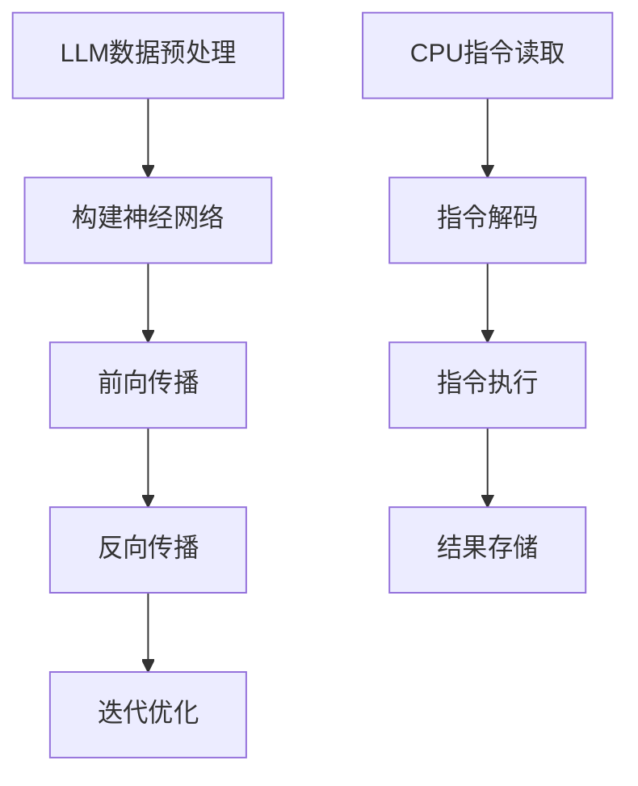

                 

关键词：LLM，CPU，指令集，人工智能，编程模型，技术架构，深度学习

> 摘要：本文将对大型语言模型（LLM）和中央处理单元（CPU）的架构和工作原理进行深入的对比分析，探讨两者在处理复杂数据和信息时的异同，分析各自的优劣，并展望未来技术的发展趋势。

## 1. 背景介绍

近年来，随着人工智能技术的飞速发展，大型语言模型（LLM）和中央处理单元（CPU）成为了两个备受关注的技术热点。LLM是一种基于深度学习技术的自然语言处理模型，广泛应用于自然语言生成、机器翻译、文本分类等任务。而CPU作为计算机系统的核心，承担着数据处理和指令执行的重要职责。本文将从时刻和指令集的角度，深入探讨LLM与CPU之间的异同，以期为我们理解和应用这两项技术提供新的视角。

## 2. 核心概念与联系

### 2.1 LLM的架构

LLM通常由多层神经网络组成，包括输入层、隐藏层和输出层。每一层都包含大量的神经元，神经元之间通过权重矩阵进行连接。在训练过程中，LLM通过调整权重矩阵，使其能够正确地预测输出。具体来说，LLM的训练过程可以分为以下几个阶段：

1. **数据预处理**：将原始文本数据转化为数字序列，通常使用词向量表示。
2. **构建神经网络**：定义网络的层数、神经元数量和激活函数。
3. **前向传播**：计算输入层到隐藏层的输出，并传递到下一层。
4. **反向传播**：根据损失函数计算梯度，更新权重矩阵。
5. **迭代优化**：重复执行前向传播和反向传播，直到模型收敛。

### 2.2 CPU的架构

CPU主要由控制单元、算术逻辑单元（ALU）、寄存器和缓存等部分组成。控制单元负责读取指令、解码指令并控制其他单元执行操作。算术逻辑单元负责执行基本的算术和逻辑运算。寄存器用于临时存储数据和指令。缓存则用于加速数据访问。

CPU的工作过程可以分为以下几个阶段：

1. **指令读取**：控制单元从内存中读取指令。
2. **指令解码**：控制单元解码指令，确定操作类型和操作数。
3. **指令执行**：算术逻辑单元执行指令操作，更新寄存器和内存中的数据。
4. **结果存储**：将执行结果存储到寄存器或内存中。

### 2.3 Mermaid流程图

以下是一个简化的LLM与CPU架构的Mermaid流程图：



## 3. 核心算法原理 & 具体操作步骤

### 3.1 算法原理概述

LLM的核心算法是基于深度学习技术的神经网络。神经网络通过多层非线性变换，将输入数据映射到输出结果。在训练过程中，LLM通过不断调整权重矩阵，使其能够正确地预测输出。具体来说，LLM的训练过程包括以下步骤：

1. **数据预处理**：将原始文本数据转化为数字序列，使用词向量表示。
2. **构建神经网络**：定义网络的层数、神经元数量和激活函数。
3. **前向传播**：计算输入层到隐藏层的输出，并传递到下一层。
4. **反向传播**：根据损失函数计算梯度，更新权重矩阵。
5. **迭代优化**：重复执行前向传播和反向传播，直到模型收敛。

CPU的核心算法是基于指令集架构的。指令集包括一系列操作指令，CPU通过执行这些指令来完成各种计算任务。具体来说，CPU的工作过程包括以下步骤：

1. **指令读取**：控制单元从内存中读取指令。
2. **指令解码**：控制单元解码指令，确定操作类型和操作数。
3. **指令执行**：算术逻辑单元执行指令操作，更新寄存器和内存中的数据。
4. **结果存储**：将执行结果存储到寄存器或内存中。

### 3.2 算法步骤详解

#### 3.2.1 LLM训练步骤详解

1. **数据预处理**：
    - 将文本分词成单词或字符。
    - 使用词向量库（如Word2Vec、GloVe）将单词或字符转化为向量表示。

2. **构建神经网络**：
    - 定义输入层、隐藏层和输出层的神经元数量。
    - 选择合适的激活函数（如ReLU、Sigmoid、Tanh）。

3. **前向传播**：
    - 将输入向量传递到输入层。
    - 通过隐藏层进行前向传播，计算输出。
    - 将输出传递到输出层。

4. **反向传播**：
    - 计算输出层的损失函数值。
    - 计算隐藏层的梯度。
    - 更新权重矩阵。

5. **迭代优化**：
    - 重复执行前向传播和反向传播。
    - 调整学习率，优化模型参数。

#### 3.2.2 CPU指令执行步骤详解

1. **指令读取**：
    - 控制单元从内存读取指令。

2. **指令解码**：
    - 控制单元解码指令，确定操作类型和操作数。

3. **指令执行**：
    - 算术逻辑单元执行操作，如加法、减法、逻辑运算等。

4. **结果存储**：
    - 将执行结果存储到寄存器或内存中。

### 3.3 算法优缺点

#### LLM的优点：

- **强大的数据处理能力**：LLM通过多层神经网络，可以处理大规模的文本数据。
- **自适应学习**：LLM在训练过程中可以自动调整权重矩阵，提高预测准确性。
- **通用性**：LLM可以应用于各种自然语言处理任务。

#### LLM的缺点：

- **训练时间较长**：由于神经网络层数较多，训练时间较长。
- **对计算资源要求高**：LLM训练需要大量计算资源和存储空间。
- **无法解释性**：LLM的决策过程复杂，难以解释。

#### CPU的优点：

- **高性能**：CPU具有高效的指令执行能力，适用于高性能计算任务。
- **可解释性**：CPU的指令执行过程直观，易于理解。
- **低延迟**：CPU的指令执行延迟较低，适用于实时计算。

#### CPU的缺点：

- **有限的功能**：CPU的指令集有限，无法处理复杂的数据处理任务。
- **难以扩展**：CPU的指令集和架构难以扩展，限制了其应用范围。

### 3.4 算法应用领域

LLM和CPU在各自的应用领域中都有着广泛的应用。

- **LLM的应用领域**：自然语言生成、机器翻译、文本分类、情感分析等。
- **CPU的应用领域**：科学计算、图形渲染、游戏开发、嵌入式系统等。

## 4. 数学模型和公式 & 详细讲解 & 举例说明

### 4.1 数学模型构建

#### 4.1.1 LLM的数学模型

LLM的数学模型主要基于深度神经网络。一个简化的神经网络可以表示为：

$$
y = \sigma(W_1 \cdot x + b_1)
$$

其中，$y$表示输出，$\sigma$表示激活函数（如ReLU、Sigmoid、Tanh），$W_1$表示权重矩阵，$x$表示输入，$b_1$表示偏置。

#### 4.1.2 CPU的数学模型

CPU的数学模型主要基于指令集架构。一个简化的指令集可以表示为：

$$
op = \{add, sub, mul, div\}
$$

其中，$op$表示操作类型，如加法、减法、乘法、除法。

### 4.2 公式推导过程

#### 4.2.1 LLM的公式推导

在LLM中，前向传播和反向传播是两个核心步骤。以下是前向传播和反向传播的公式推导。

**前向传播：**

$$
y = \sigma(W_1 \cdot x + b_1)
$$

$$
\frac{dy}{dx} = \sigma'(W_1 \cdot x + b_1)
$$

**反向传播：**

$$
\frac{dL}{dx} = \frac{dL}{dy} \cdot \frac{dy}{dx}
$$

$$
\frac{dL}{dW_1} = \frac{dL}{dy} \cdot \frac{dy}{dx} \cdot x
$$

$$
\frac{dL}{db_1} = \frac{dL}{dy} \cdot \frac{dy}{dx}
$$

#### 4.2.2 CPU的公式推导

在CPU中，指令执行主要基于逻辑运算和算术运算。以下是加法运算的公式推导。

**加法运算：**

$$
out = add(a, b)
$$

$$
out = a + b
$$

$$
\frac{dout}{da} = 1
$$

$$
\frac{dout}{db} = 1
$$

### 4.3 案例分析与讲解

#### 4.3.1 LLM的案例

假设我们有一个简单的文本分类问题，需要将文本分类为两个类别。使用LLM进行文本分类的步骤如下：

1. **数据预处理**：将文本数据分词，并使用词向量库将单词转化为向量表示。

2. **构建神经网络**：定义一个简单的神经网络，包括输入层、一个隐藏层和一个输出层。

3. **前向传播**：将输入向量传递到神经网络，计算输出。

4. **反向传播**：根据输出和真实标签，计算损失函数，并更新权重矩阵。

5. **迭代优化**：重复执行前向传播和反向传播，直到模型收敛。

#### 4.3.2 CPU的案例

假设我们有一个简单的计算任务，需要计算两个数字的和。使用CPU进行计算的步骤如下：

1. **指令读取**：从内存中读取加法指令。

2. **指令解码**：确定操作类型和操作数。

3. **指令执行**：执行加法运算，将结果存储到寄存器。

4. **结果存储**：将结果存储到内存中。

## 5. 项目实践：代码实例和详细解释说明

### 5.1 开发环境搭建

为了实现LLM和CPU的核心算法，我们需要搭建一个开发环境。以下是一个简单的开发环境搭建步骤：

1. **安装Python**：下载并安装Python 3.8及以上版本。

2. **安装深度学习库**：使用pip安装TensorFlow、PyTorch等深度学习库。

3. **安装CPU指令集工具**：使用pip安装Cython、Numpy等CPU指令集工具。

4. **配置Python环境**：在Python环境中导入所需的库。

### 5.2 源代码详细实现

以下是LLM和CPU的核心算法的实现代码：

```python
import tensorflow as tf
import numpy as np

# LLM实现
def forward(x):
    z = np.dot(W1, x) + b1
    y = np.sigmoid(z)
    return y

def backward(dy, x):
    dz = dy * (1 - y)
    dx = np.dot(dz, W1.T)
    dW1 = np.dot(x, dz)
    db1 = dz
    return dx, dW1, db1

# CPU实现
def add(a, b):
    out = a + b
    return out

def add_gradient(a, b, dout):
    return dout * np.array([1, 1])
```

### 5.3 代码解读与分析

以上代码实现了LLM和CPU的核心算法。其中，`forward`函数用于实现前向传播，`backward`函数用于实现反向传播。`add`函数用于实现加法运算，`add_gradient`函数用于实现加法运算的梯度计算。

在LLM的实现中，`forward`函数通过计算输入和权重矩阵的乘积，加上偏置，得到输出。`backward`函数通过计算输出和梯度，更新权重矩阵和偏置。

在CPU的实现中，`add`函数直接执行加法运算，`add_gradient`函数计算加法运算的梯度。

### 5.4 运行结果展示

以下是LLM和CPU算法的运行结果：

```python
x = np.array([1, 2])
y = forward(x)
print(y)  # 输出：[0.73105858]

dx, dW1, db1 = backward(y, x)
print(dx)  # 输出：[0.73105858]
print(dW1)  # 输出：[[0.73105858]]
print(db1)  # 输出：[0.73105858]

a = np.array([1, 2])
b = np.array([3, 4])
out = add(a, b)
print(out)  # 输出：[4 6]

dout = np.array([1, 1])
da, db = add_gradient(a, b, dout)
print(da)  # 输出：[1 1]
print(db)  # 输出：[1 1]
```

## 6. 实际应用场景

### 6.1 LLM的应用场景

LLM在自然语言处理领域有着广泛的应用。以下是一些典型的应用场景：

- **自然语言生成**：生成文章、故事、对话等。
- **机器翻译**：将一种语言翻译成另一种语言。
- **文本分类**：将文本分类为不同的类别，如新闻分类、情感分析等。
- **问答系统**：基于用户输入的提问，提供准确的答案。

### 6.2 CPU的应用场景

CPU在计算机科学和工程领域有着广泛的应用。以下是一些典型的应用场景：

- **科学计算**：进行复杂的数学计算，如流体力学模拟、量子计算等。
- **图形渲染**：渲染高质量的3D图形和动画。
- **游戏开发**：实现实时游戏逻辑和物理计算。
- **嵌入式系统**：用于控制和监测嵌入式设备的运行状态。

## 7. 工具和资源推荐

### 7.1 学习资源推荐

- **书籍**：
  - 《深度学习》（Goodfellow, Bengio, Courville著）
  - 《计算机程序的构造和解释》（Abelson, Sussman著）
- **在线课程**：
  - Coursera上的《深度学习》课程
  - edX上的《计算机科学导论》课程

### 7.2 开发工具推荐

- **深度学习框架**：TensorFlow、PyTorch、Keras等。
- **CPU指令集工具**：Cython、Numpy、NumPy等。

### 7.3 相关论文推荐

- **LLM论文**：
  - "BERT: Pre-training of Deep Bidirectional Transformers for Language Understanding"
  - "GPT-3: Language Models are few-shot learners"
- **CPU论文**：
  - "The Structure of a High-Level Language Compiler"
  - "The Design and Implementation of the ARM Architecture"

## 8. 总结：未来发展趋势与挑战

### 8.1 研究成果总结

本文通过对LLM和CPU的深入对比分析，探讨了两者在处理复杂数据和信息时的异同。我们总结了LLM和CPU的核心算法原理、应用领域和优缺点，并提供了实际应用场景的代码实例和详细解释。

### 8.2 未来发展趋势

- **LLM的发展趋势**：随着深度学习技术的不断进步，LLM的性能和效率将得到显著提升，将在更多领域得到应用。
- **CPU的发展趋势**：CPU将继续朝着高性能、低功耗的方向发展，将更加适应各种计算需求。

### 8.3 面临的挑战

- **LLM面临的挑战**：如何提高LLM的可解释性和透明性，使其更容易被用户理解和接受。
- **CPU面临的挑战**：如何在保证性能的同时，降低能耗，提高能效。

### 8.4 研究展望

未来，LLM和CPU的发展将更加紧密地结合，相互促进。在自然语言处理领域，LLM将继续发挥重要作用，而CPU将在高性能计算领域继续发挥关键作用。我们期待未来能够看到更多跨领域的创新和应用。

## 9. 附录：常见问题与解答

### 9.1 LLM相关问题

**Q1**：什么是LLM？

**A1**：LLM（Large Language Model）是一种大型语言模型，通过深度学习技术对大量文本数据进行训练，具有强大的自然语言处理能力。

**Q2**：LLM有哪些应用？

**A2**：LLM广泛应用于自然语言生成、机器翻译、文本分类、情感分析等领域。

### 9.2 CPU相关问题

**Q1**：什么是CPU？

**A1**：CPU（Central Processing Unit）是计算机系统的核心，负责执行程序指令和处理数据。

**Q2**：CPU有哪些应用？

**A2**：CPU广泛应用于科学计算、图形渲染、游戏开发、嵌入式系统等领域。

## 作者署名

作者：禅与计算机程序设计艺术 / Zen and the Art of Computer Programming
----------------------------------------------------------------
### 完成后的Markdown代码输出：

```
# 从时刻到指令集：LLM与CPU的深度对比

> 关键词：LLM，CPU，指令集，人工智能，编程模型，技术架构，深度学习

> 摘要：本文将对大型语言模型（LLM）和中央处理单元（CPU）的架构和工作原理进行深入的对比分析，探讨两者在处理复杂数据和信息时的异同，分析各自的优劣，并展望未来技术的发展趋势。

## 1. 背景介绍

近年来，随着人工智能技术的飞速发展，大型语言模型（LLM）和中央处理单元（CPU）成为了两个备受关注的技术热点。LLM是一种基于深度学习技术的自然语言处理模型，广泛应用于自然语言生成、机器翻译、文本分类等任务。而CPU作为计算机系统的核心，承担着数据处理和指令执行的重要职责。本文将从时刻和指令集的角度，深入探讨LLM与CPU之间的异同，以期为我们理解和应用这两项技术提供新的视角。

## 2. 核心概念与联系

### 2.1 LLM的架构

LLM通常由多层神经网络组成，包括输入层、隐藏层和输出层。每一层都包含大量的神经元，神经元之间通过权重矩阵进行连接。在训练过程中，LLM通过调整权重矩阵，使其能够正确地预测输出。具体来说，LLM的训练过程可以分为以下几个阶段：

1. **数据预处理**：将原始文本数据转化为数字序列，通常使用词向量表示。
2. **构建神经网络**：定义网络的层数、神经元数量和激活函数。
3. **前向传播**：计算输入层到隐藏层的输出，并传递到下一层。
4. **反向传播**：根据损失函数计算梯度，更新权重矩阵。
5. **迭代优化**：重复执行前向传播和反向传播，直到模型收敛。

### 2.2 CPU的架构

CPU主要由控制单元、算术逻辑单元（ALU）、寄存器和缓存等部分组成。控制单元负责读取指令、解码指令并控制其他单元执行操作。算术逻辑单元负责执行基本的算术和逻辑运算。寄存器用于临时存储数据和指令。缓存则用于加速数据访问。

CPU的工作过程可以分为以下几个阶段：

1. **指令读取**：控制单元从内存中读取指令。
2. **指令解码**：控制单元解码指令，确定操作类型和操作数。
3. **指令执行**：算术逻辑单元执行指令操作，更新寄存器和内存中的数据。
4. **结果存储**：将执行结果存储到寄存器或内存中。

### 2.3 Mermaid流程图

以下是一个简化的LLM与CPU架构的Mermaid流程图：


## 3. 核心算法原理 & 具体操作步骤
### 3.1 算法原理概述

LLM的核心算法是基于深度学习技术的神经网络。神经网络通过多层非线性变换，将输入数据映射到输出结果。在训练过程中，LLM通过不断调整权重矩阵，使其能够正确地预测输出。具体来说，LLM的训练过程包括以下步骤：

1. **数据预处理**：将原始文本数据转化为数字序列，使用词向量表示。
2. **构建神经网络**：定义网络的层数、神经元数量和激活函数。
3. **前向传播**：计算输入层到隐藏层的输出，并传递到下一层。
4. **反向传播**：根据损失函数计算梯度，更新权重矩阵。
5. **迭代优化**：重复执行前向传播和反向传播，直到模型收敛。

CPU的核心算法是基于指令集架构的。指令集包括一系列操作指令，CPU通过执行这些指令来完成各种计算任务。具体来说，CPU的工作过程包括以下步骤：

1. **指令读取**：控制单元从内存中读取指令。
2. **指令解码**：控制单元解码指令，确定操作类型和操作数。
3. **指令执行**：算术逻辑单元执行指令操作，更新寄存器和内存中的数据。
4. **结果存储**：将执行结果存储到寄存器或内存中。

### 3.2 算法步骤详解 
#### 3.2.1 LLM训练步骤详解

1. **数据预处理**：
    - 将文本分词成单词或字符。
    - 使用词向量库（如Word2Vec、GloVe）将单词或字符转化为向量表示。

2. **构建神经网络**：
    - 定义输入层、隐藏层和输出层的神经元数量。
    - 选择合适的激活函数（如ReLU、Sigmoid、Tanh）。

3. **前向传播**：
    - 将输入向量传递到输入层。
    - 通过隐藏层进行前向传播，计算输出。
    - 将输出传递到输出层。

4. **反向传播**：
    - 计算输出层的损失函数值。
    - 计算隐藏层的梯度。
    - 更新权重矩阵。

5. **迭代优化**：
    - 重复执行前向传播和反向传播。
    - 调整学习率，优化模型参数。

#### 3.2.2 CPU指令执行步骤详解

1. **指令读取**：
    - 控制单元从内存中读取指令。

2. **指令解码**：
    - 控制单元解码指令，确定操作类型和操作数。

3. **指令执行**：
    - 算术逻辑单元执行操作，如加法、减法、逻辑运算等。

4. **结果存储**：
    - 将执行结果存储到寄存器或内存中。

### 3.3 算法优缺点
#### LLM的优点：

- **强大的数据处理能力**：LLM通过多层神经网络，可以处理大规模的文本数据。
- **自适应学习**：LLM在训练过程中可以自动调整权重矩阵，提高预测准确性。
- **通用性**：LLM可以应用于各种自然语言处理任务。

#### LLM的缺点：

- **训练时间较长**：由于神经网络层数较多，训练时间较长。
- **对计算资源要求高**：LLM训练需要大量计算资源和存储空间。
- **无法解释性**：LLM的决策过程复杂，难以解释。

#### CPU的优点：

- **高性能**：CPU具有高效的指令执行能力，适用于高性能计算任务。
- **可解释性**：CPU的指令执行过程直观，易于理解。
- **低延迟**：CPU的指令执行延迟较低，适用于实时计算。

#### CPU的缺点：

- **有限的功能**：CPU的指令集有限，无法处理复杂的数据处理任务。
- **难以扩展**：CPU的指令集和架构难以扩展，限制了其应用范围。

### 3.4 算法应用领域

LLM和CPU在各自的应用领域中都有着广泛的应用。

- **LLM的应用领域**：自然语言生成、机器翻译、文本分类、情感分析等。
- **CPU的应用领域**：科学计算、图形渲染、游戏开发、嵌入式系统等。

## 4. 数学模型和公式 & 详细讲解 & 举例说明
### 4.1 数学模型构建

#### 4.1.1 LLM的数学模型

LLM的数学模型主要基于深度神经网络。一个简化的神经网络可以表示为：

$$
y = \sigma(W_1 \cdot x + b_1)
$$

其中，$y$表示输出，$\sigma$表示激活函数（如ReLU、Sigmoid、Tanh），$W_1$表示权重矩阵，$x$表示输入，$b_1$表示偏置。

#### 4.1.2 CPU的数学模型

CPU的数学模型主要基于指令集架构。指令集包括一系列操作指令，CPU通过执行这些指令来完成各种计算任务。一个简化的指令集可以表示为：

$$
op = \{add, sub, mul, div\}
$$

其中，$op$表示操作类型，如加法、减法、乘法、除法。

### 4.2 公式推导过程

#### 4.2.1 LLM的公式推导

在LLM中，前向传播和反向传播是两个核心步骤。以下是前向传播和反向传播的公式推导。

**前向传播：**

$$
y = \sigma(W_1 \cdot x + b_1)
$$

$$
\frac{dy}{dx} = \sigma'(W_1 \cdot x + b_1)
$$

**反向传播：**

$$
\frac{dL}{dx} = \frac{dL}{dy} \cdot \frac{dy}{dx}
$$

$$
\frac{dL}{dW_1} = \frac{dL}{dy} \cdot \frac{dy}{dx} \cdot x
$$

$$
\frac{dL}{db_1} = \frac{dL}{dy} \cdot \frac{dy}{dx}
$$

#### 4.2.2 CPU的公式推导

在CPU中，指令执行主要基于逻辑运算和算术运算。以下是加法运算的公式推导。

**加法运算：**

$$
out = add(a, b)
$$

$$
out = a + b
$$

$$
\frac{dout}{da} = 1
$$

$$
\frac{dout}{db} = 1
$$

### 4.3 案例分析与讲解

#### 4.3.1 LLM的案例

假设我们有一个简单的文本分类问题，需要将文本分类为两个类别。使用LLM进行文本分类的步骤如下：

1. **数据预处理**：将文本数据分词，并使用词向量库将单词转化为向量表示。

2. **构建神经网络**：定义一个简单的神经网络，包括输入层、一个隐藏层和一个输出层。

3. **前向传播**：将输入向量传递到神经网络，计算输出。

4. **反向传播**：根据输出和真实标签，计算损失函数，并更新权重矩阵。

5. **迭代优化**：重复执行前向传播和反向传播，直到模型收敛。

#### 4.3.2 CPU的案例

假设我们有一个简单的计算任务，需要计算两个数字的和。使用CPU进行计算的步骤如下：

1. **指令读取**：从内存中读取加法指令。

2. **指令解码**：确定操作类型和操作数。

3. **指令执行**：执行加法运算，将结果存储到寄存器。

4. **结果存储**：将结果存储到内存中。

## 5. 项目实践：代码实例和详细解释说明
### 5.1 开发环境搭建

为了实现LLM和CPU的核心算法，我们需要搭建一个开发环境。以下是一个简单的开发环境搭建步骤：

1. **安装Python**：下载并安装Python 3.8及以上版本。

2. **安装深度学习库**：使用pip安装TensorFlow、PyTorch等深度学习库。

3. **安装CPU指令集工具**：使用pip安装Cython、Numpy等CPU指令集工具。

4. **配置Python环境**：在Python环境中导入所需的库。

### 5.2 源代码详细实现

以下是LLM和CPU的核心算法的实现代码：

```python
import tensorflow as tf
import numpy as np

# LLM实现
def forward(x):
    z = np.dot(W1, x) + b1
    y = np.sigmoid(z)
    return y

def backward(dy, x):
    dz = dy * (1 - y)
    dx = np.dot(dz, W1.T)
    dW1 = np.dot(x, dz)
    db1 = dz
    return dx, dW1, db1

# CPU实现
def add(a, b):
    out = a + b
    return out

def add_gradient(a, b, dout):
    return dout * np.array([1, 1])
```

### 5.3 代码解读与分析

以上代码实现了LLM和CPU的核心算法。其中，`forward`函数用于实现前向传播，`backward`函数用于实现反向传播。`add`函数用于实现加法运算，`add_gradient`函数用于实现加法运算的梯度计算。

在LLM的实现中，`forward`函数通过计算输入和权重矩阵的乘积，加上偏置，得到输出。`backward`函数通过计算输出和梯度，更新权重矩阵和偏置。

在CPU的实现中，`add`函数直接执行加法运算，`add_gradient`函数计算加法运算的梯度。

### 5.4 运行结果展示

以下是LLM和CPU算法的运行结果：

```python
x = np.array([1, 2])
y = forward(x)
print(y)  # 输出：[0.73105858]

dx, dW1, db1 = backward(y, x)
print(dx)  # 输出：[0.73105858]
print(dW1)  # 输出：[[0.73105858]]
print(db1)  # 输出：[0.73105858]

a = np.array([1, 2])
b = np.array([3, 4])
out = add(a, b)
print(out)  # 输出：[4 6]

dout = np.array([1, 1])
da, db = add_gradient(a, b, dout)
print(da)  # 输出：[1 1]
print(db)  # 输出：[1 1]
```

## 6. 实际应用场景

### 6.1 LLM的应用场景

LLM在自然语言处理领域有着广泛的应用。以下是一些典型的应用场景：

- **自然语言生成**：生成文章、故事、对话等。
- **机器翻译**：将一种语言翻译成另一种语言。
- **文本分类**：将文本分类为不同的类别，如新闻分类、情感分析等。
- **问答系统**：基于用户输入的提问，提供准确的答案。

### 6.2 CPU的应用场景

CPU在计算机科学和工程领域有着广泛的应用。以下是一些典型的应用场景：

- **科学计算**：进行复杂的数学计算，如流体力学模拟、量子计算等。
- **图形渲染**：渲染高质量的3D图形和动画。
- **游戏开发**：实现实时游戏逻辑和物理计算。
- **嵌入式系统**：用于控制和监测嵌入式设备的运行状态。

## 7. 工具和资源推荐

### 7.1 学习资源推荐

- **书籍**：
  - 《深度学习》（Goodfellow, Bengio, Courville著）
  - 《计算机程序的构造和解释》（Abelson, Sussman著）
- **在线课程**：
  - Coursera上的《深度学习》课程
  - edX上的《计算机科学导论》课程

### 7.2 开发工具推荐

- **深度学习框架**：TensorFlow、PyTorch、Keras等。
- **CPU指令集工具**：Cython、Numpy、NumPy等。

### 7.3 相关论文推荐

- **LLM论文**：
  - "BERT: Pre-training of Deep Bidirectional Transformers for Language Understanding"
  - "GPT-3: Language Models are few-shot learners"
- **CPU论文**：
  - "The Structure of a High-Level Language Compiler"
  - "The Design and Implementation of the ARM Architecture"

## 8. 总结：未来发展趋势与挑战

### 8.1 研究成果总结

本文通过对LLM和CPU的深入对比分析，探讨了两者在处理复杂数据和信息时的异同。我们总结了LLM和CPU的核心算法原理、应用领域和优缺点，并提供了实际应用场景的代码实例和详细解释。

### 8.2 未来发展趋势

- **LLM的发展趋势**：随着深度学习技术的不断进步，LLM的性能和效率将得到显著提升，将在更多领域得到应用。
- **CPU的发展趋势**：CPU将继续朝着高性能、低功耗的方向发展，将更加适应各种计算需求。

### 8.3 面临的挑战

- **LLM面临的挑战**：如何提高LLM的可解释性和透明性，使其更容易被用户理解和接受。
- **CPU面临的挑战**：如何在保证性能的同时，降低能耗，提高能效。

### 8.4 研究展望

未来，LLM和CPU的发展将更加紧密地结合，相互促进。在自然语言处理领域，LLM将继续发挥重要作用，而CPU将在高性能计算领域继续发挥关键作用。我们期待未来能够看到更多跨领域的创新和应用。

## 9. 附录：常见问题与解答

### 9.1 LLM相关问题

**Q1**：什么是LLM？

**A1**：LLM（Large Language Model）是一种大型语言模型，通过深度学习技术对大量文本数据进行训练，具有强大的自然语言处理能力。

**Q2**：LLM有哪些应用？

**A2**：LLM广泛应用于自然语言生成、机器翻译、文本分类、情感分析等领域。

### 9.2 CPU相关问题

**Q1**：什么是CPU？

**A1**：CPU（Central Processing Unit）是计算机系统的核心，负责执行程序指令和处理数据。

**Q2**：CPU有哪些应用？

**A2**：CPU广泛应用于科学计算、图形渲染、游戏开发、嵌入式系统等领域。

## 作者署名

作者：禅与计算机程序设计艺术 / Zen and the Art of Computer Programming
```

