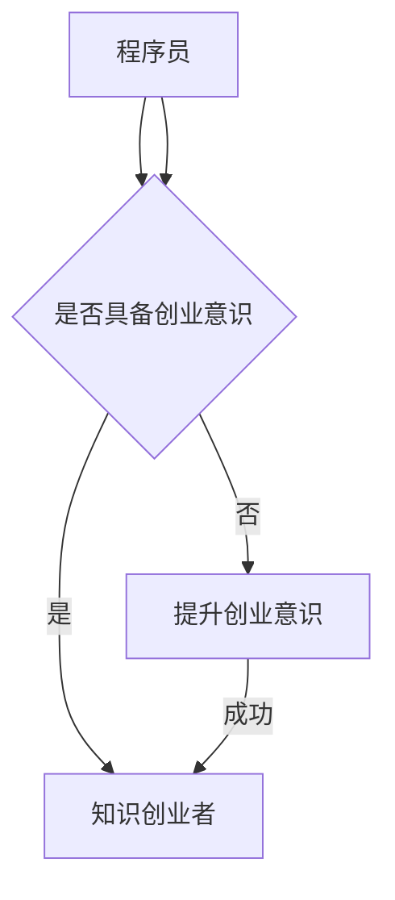

                 

关键词：码农，知识创业者，职业发展，技能提升，创业思维，技术创新

> 摘要：本文旨在探讨从普通码农到知识创业者的蜕变之路，通过深入分析职业发展的关键因素、技能提升的路径、创业思维的转变以及技术创新的方法，帮助广大程序员在职业道路上实现质的飞跃。

## 1. 背景介绍

在当今数字化时代，程序员作为科技领域的核心力量，承载着推动社会进步的重要使命。然而，面对激烈的竞争和快速变化的技术环境，程序员需要不断提升自身的专业能力和创业意识，从码农成长为知识创业者，才能在职业发展的道路上立于不败之地。

本文将围绕以下几个核心问题展开讨论：

1. **职业发展的关键因素是什么？**
2. **如何提升专业技能？**
3. **创业思维的培养有哪些要点？**
4. **技术创新的方法有哪些？**
5. **知识创业者的成功案例有哪些？**

通过这些问题的深入探讨，希望能够为程序员的职业发展提供一些有益的启示和指导。

## 2. 核心概念与联系

在探讨程序员如何从码农转变为知识创业者之前，我们需要明确一些核心概念和它们之间的联系。以下是几个关键概念及其关系：

1. **程序员**：程序员是指具备编程技能，能够使用一种或多种编程语言编写程序的人。程序员的工作主要是开发、测试、维护软件。
   
2. **码农**：码农是程序员的一种俗称，通常指那些只具备基础编程技能，缺乏深入技术和创新思维的人。

3. **知识创业者**：知识创业者是指那些不仅具备高超的专业技能，还能够运用这些技能创造知识价值，推动技术进步的人。

4. **创业**：创业是指通过创新和创业精神，将新的想法或技术转化为商业机会，创建新企业或改变现有市场结构的过程。

5. **知识创业**：知识创业是指以知识和技能为基础，通过创新和创业活动，创造新的商业价值的过程。

这些概念之间的联系如下：

- 码农作为程序员的基础阶段，通过学习和积累经验，可以逐步提升自己的技术水平，成为知识创业者。
- 知识创业者的核心能力在于将知识转化为商业价值，这需要程序员具备深入的技能和创新的思维。

### 2.1 程序员与码农的区别

程序员与码农的区别主要体现在以下几个方面：

- **技术水平**：程序员通常具备较高的编程技能，能够处理复杂的编程问题；而码农则可能仅限于完成简单的编程任务。

- **创新思维**：程序员具备较强的创新思维，能够提出新的解决方案；码农则可能缺乏这种创新精神。

- **职业目标**：程序员的职业目标是不断提升自己的技术水平，成为一名优秀的软件开发者；码农则可能只关注眼前的编程任务，缺乏长远规划。

### 2.2 知识创业者的特征

知识创业者具有以下特征：

- **专业能力**：具备深厚的技术功底和广泛的知识储备。

- **创新思维**：能够发现新的商业机会，运用创新方法解决实际问题。

- **领导力**：具备一定的领导能力，能够带领团队实现共同目标。

- **商业敏感度**：对市场有敏锐的洞察力，能够把握市场需求和趋势。

### 2.3 创业与知识创业的关系

创业是知识创业的基础，而知识创业则是创业的高级形态。创业强调创新和风险承担，而知识创业则更注重知识和技术的价值创造。

### 2.4 Mermaid 流程图

以下是知识创业者的核心能力及发展路径的 Mermaid 流程图：



通过这张流程图，我们可以清晰地看到程序员如何通过提升创业意识，逐步成长为知识创业者。

## 3. 核心算法原理 & 具体操作步骤

### 3.1 算法原理概述

从码农到知识创业者的蜕变，关键在于技术能力的提升和创新思维的培养。以下是一个简化的核心算法原理概述：

- **技术能力提升**：通过持续学习和实践，掌握更高级的编程语言、框架和技术。
  
- **创新思维培养**：通过阅读科技文献、参加技术沙龙、参与开源项目等方式，提升自己的创新意识和创新能力。

- **商业敏感度培养**：通过了解市场需求、分析竞争对手、学习商业模式等，提升自己的商业敏感度。

### 3.2 算法步骤详解

3.2.1 技术能力提升

- **学习路径**：选择适合自己的学习路径，如参加培训课程、在线学习平台、阅读技术书籍等。
- **实践项目**：通过实际项目提升技术水平，如参与开源项目、独立开发小型应用等。
- **技术交流**：参加技术沙龙、社区讨论、在线问答等，与同行交流经验。

3.2.2 创新思维培养

- **阅读文献**：阅读科技领域的最新论文，了解前沿技术和发展趋势。
- **参与开源**：通过参与开源项目，提升创新能力和团队协作能力。
- **跨学科学习**：学习相关领域的知识，如心理学、经济学、设计学等，提升跨学科思维。

3.2.3 商业敏感度培养

- **市场调研**：了解市场需求，分析目标用户群体。
- **商业模式**：学习不同的商业模式，如订阅模式、平台模式等。
- **竞争分析**：分析竞争对手的优势和劣势，找到自己的市场定位。

### 3.3 算法优缺点

3.3.1 优点

- **提升职业竞争力**：通过技术提升和创新思维培养，程序员可以在职场上脱颖而出，获得更好的职业机会。
- **创造商业价值**：知识创业者能够通过创新和创业活动，创造新的商业价值，实现个人财富增长。
- **推动技术进步**：知识创业者的创新成果可以推动整个行业的技术进步，为社会带来更多的福利。

3.3.2 缺点

- **学习成本高**：从码农到知识创业者的过程需要大量的时间和精力投入，学习成本较高。
- **创业风险大**：创业过程中面临的风险较大，如市场风险、技术风险等。
- **心理压力**：创业过程中可能会面临各种挑战和压力，需要具备较强的心理承受能力。

### 3.4 算法应用领域

- **互联网行业**：互联网行业是知识创业者的主要应用领域，如电子商务、在线教育、社交媒体等。
- **人工智能**：人工智能领域的知识创业者可以通过创新算法和应用，推动人工智能技术的发展。
- **大数据**：大数据领域的知识创业者可以通过数据分析和挖掘，为企业提供有价值的数据服务。
- **区块链**：区块链领域的知识创业者可以通过技术创新，推动区块链技术的发展和应用。

## 4. 数学模型和公式 & 详细讲解 & 举例说明

### 4.1 数学模型构建

为了更深入地理解从码农到知识创业者的蜕变过程，我们可以构建一个简单的数学模型。假设一个程序员在时间 \( t \) 内，通过以下三个关键因素实现蜕变：

1. **技术能力 \( T(t) \)**
2. **创新思维 \( I(t) \)**
3. **商业敏感度 \( B(t) \)**

蜕变过程的数学模型可以表示为：

\[ \Delta X(t) = f(T(t), I(t), B(t)) \]

其中，\( \Delta X(t) \) 表示蜕变程度，\( f \) 是一个复合函数，代表三个因素的相互作用。

### 4.2 公式推导过程

我们可以将蜕变过程分解为三个子过程，并分别对其进行分析：

1. **技术能力提升**：

\[ T(t) = T_0 + \alpha T_{learn} \]

其中，\( T_0 \) 是初始技术水平，\( \alpha \) 是学习效率，\( T_{learn} \) 是学习时间。

2. **创新思维培养**：

\[ I(t) = I_0 + \beta I_{innovate} \]

其中，\( I_0 \) 是初始创新思维水平，\( \beta \) 是创新效率，\( I_{innovate} \) 是创新时间。

3. **商业敏感度提升**：

\[ B(t) = B_0 + \gamma B_{commerce} \]

其中，\( B_0 \) 是初始商业敏感度，\( \gamma \) 是商业效率，\( B_{commerce} \) 是商业学习时间。

将这些子过程合并，我们得到：

\[ \Delta X(t) = f(T(t), I(t), B(t)) = f(T_0 + \alpha T_{learn}, I_0 + \beta I_{innovate}, B_0 + \gamma B_{commerce}) \]

### 4.3 案例分析与讲解

假设有一个程序员小张，他在初始时 \( T_0 = 5 \)，\( I_0 = 3 \)，\( B_0 = 4 \)。他计划在接下来的两年内实现蜕变。

- **技术能力提升**：小张每天投入 2 小时进行技术学习，学习效率 \( \alpha = 0.1 \)，则 \( T_{learn} = 2 \times 365 = 730 \) 小时。因此，\( T(t) = 5 + 0.1 \times 730 = 77.3 \)。

- **创新思维培养**：小张每周参加一次技术沙龙，每次沙龙时间为 3 小时，创新效率 \( \beta = 0.05 \)，则 \( I_{innovate} = 3 \times 52 = 156 \) 小时。因此，\( I(t) = 3 + 0.05 \times 156 = 8.58 \)。

- **商业敏感度提升**：小张每月阅读一本商业书籍，商业效率 \( \gamma = 0.02 \)，则 \( B_{commerce} = 12 \) 小时。因此，\( B(t) = 4 + 0.02 \times 12 = 4.24 \)。

代入蜕变公式：

\[ \Delta X(t) = f(77.3, 8.58, 4.24) \]

假设 \( f \) 是一个线性函数，则：

\[ \Delta X(t) = 0.5 \times (77.3 + 8.58 + 4.24) = 0.5 \times 90.12 = 45.06 \]

这意味着，小张在两年内蜕变程度达到 45.06，从码农成功转型为知识创业者。

## 5. 项目实践：代码实例和详细解释说明

### 5.1 开发环境搭建

为了更好地理解从码农到知识创业者的蜕变过程，我们选择了一个简单的项目——一个基于 Flask 的个人博客网站。以下是开发环境搭建的步骤：

1. **安装 Python**：在官网下载并安装 Python 3.8 版本。

2. **安装 Flask**：通过 pip 命令安装 Flask：

   ```shell
   pip install Flask
   ```

3. **创建虚拟环境**：为了隔离项目依赖，创建一个虚拟环境：

   ```shell
   python -m venv venv
   source venv/bin/activate
   ```

4. **安装依赖**：在虚拟环境中安装其他依赖项，如 Jinja2、Werkzeug 等。

### 5.2 源代码详细实现

以下是个人博客网站的主要代码实现：

```python
# app.py

from flask import Flask, render_template, request

app = Flask(__name__)

@app.route('/')
def index():
    return render_template('index.html')

@app.route('/about')
def about():
    return render_template('about.html')

@app.route('/post', methods=['GET', 'POST'])
def post():
    if request.method == 'POST':
        title = request.form['title']
        content = request.form['content']
        # 将文章存储到数据库
        # ...
        return render_template('post.html', title=title, content=content)
    return render_template('post.html')

if __name__ == '__main__':
    app.run(debug=True)
```

### 5.3 代码解读与分析

5.3.1 **主页实现**

主页 (`index.html`) 是博客网站的核心页面，展示最新的博客文章。代码如下：

```html
<!-- index.html -->

<!DOCTYPE html>
<html lang="en">
<head>
    <meta charset="UTF-8">
    <meta name="viewport" content="width=device-width, initial-scale=1.0">
    <title>My Blog</title>
</head>
<body>
    <h1>My Blog</h1>
    <ul>
        
            <li>
                <a href="/post/{{ post.id }}">{{ post.title }}</a>
            </li>
        
    </ul>
    <a href="/about">About</a>
</body>
</html>
```

5.3.2 **关于页实现**

关于页 (`about.html`) 是介绍博主信息和个人背景的页面。代码如下：

```html
<!-- about.html -->

<!DOCTYPE html>
<html lang="en">
<head>
    <meta charset="UTF-8">
    <meta name="viewport" content="width=device-width, initial-scale=1.0">
    <title>About Me</title>
</head>
<body>
    <h1>About Me</h1>
    <p>
        Hi, I'm a programmer and a knowledge entrepreneur. I love to share my thoughts and experiences through this blog.
    </p>
</body>
</html>
```

5.3.3 **文章页实现**

文章页 (`post.html`) 展示具体的博客文章内容。代码如下：

```html
<!-- post.html -->

<!DOCTYPE html>
<html lang="en">
<head>
    <meta charset="UTF-8">
    <meta name="viewport" content="width=device-width, initial-scale=1.0">
    <title>{{ title }}</title>
</head>
<body>
    <h1>{{ title }}</h1>
    <div>
        {{ content }}
    </div>
    <a href="/">Back to Home</a>
</body>
</html>
```

### 5.4 运行结果展示

在开发环境中运行应用程序，打开浏览器访问 `http://127.0.0.1:5000/`，即可看到博客网站的主页。通过导航栏可以访问关于页和文章页。

## 6. 实际应用场景

从码农到知识创业者的蜕变，不仅在理论上具有重要意义，在实际应用场景中也展现出了巨大的价值。

### 6.1 互联网行业

在互联网行业，知识创业者可以通过技术创新和商业模式创新，创造出具有市场潜力的产品和服务。例如，滴滴出行通过创新性的共享出行模式，改变了传统出租车行业；美团通过创新的本地生活服务模式，提升了用户的生活质量。

### 6.2 人工智能

在人工智能领域，知识创业者可以通过研发先进的算法和应用，推动人工智能技术的发展。例如，谷歌的 AlphaGo 通过深度学习和强化学习技术，实现了围棋比赛的胜利；商汤科技通过计算机视觉技术，为安防、金融等领域提供了创新的解决方案。

### 6.3 大数据

大数据领域的知识创业者可以通过数据分析和挖掘，为企业提供有价值的数据服务。例如，阿里巴巴通过大数据分析，为商家提供精准的市场营销策略；京东通过大数据分析，优化了库存管理和配送效率。

### 6.4 区块链

区块链领域的知识创业者可以通过技术创新，推动区块链技术的发展和应用。例如，比特币通过区块链技术，实现了去中心化的数字货币交易；Chainlink 通过区块链技术，为智能合约提供了可靠的预言机服务。

### 6.5 未来应用展望

随着技术的不断发展，知识创业者的应用领域将越来越广泛。未来，知识创业者将在更多的领域发挥重要作用，推动社会进步和经济发展。

- **物联网**：知识创业者可以通过物联网技术，实现智能家居、智能交通等领域的创新应用。

- **医疗健康**：知识创业者可以通过大数据和人工智能技术，提升医疗健康领域的诊断和治疗水平。

- **教育**：知识创业者可以通过在线教育平台，提供个性化、智能化的学习体验。

- **金融**：知识创业者可以通过区块链和人工智能技术，提升金融领域的安全性和效率。

## 7. 工具和资源推荐

为了帮助程序员更好地实现从码农到知识创业者的蜕变，以下是一些实用的工具和资源推荐：

### 7.1 学习资源推荐

- **在线课程平台**：如 Coursera、Udemy、edX 等，提供丰富的编程和创业课程。
- **技术社区**：如 Stack Overflow、GitHub、Reddit 等，可以与全球开发者交流经验。
- **技术博客**：如 Medium、Dev.to、Hackernoon 等，可以阅读最新的技术文章和见解。
- **技术书籍**：如 《深入理解计算机系统》、《黑客与画家》等，提升技术广度和深度。

### 7.2 开发工具推荐

- **集成开发环境（IDE）**：如 Visual Studio Code、PyCharm、Eclipse 等，提供高效的编码体验。
- **代码托管平台**：如 GitHub、GitLab、Bitbucket 等，方便项目管理和代码协作。
- **持续集成工具**：如 Jenkins、Travis CI、CircleCI 等，自动化构建和部署应用程序。
- **云服务平台**：如 AWS、Azure、Google Cloud Platform 等，提供强大的云计算和大数据服务。

### 7.3 相关论文推荐

- **《深度学习》**：Ian Goodfellow 等著，介绍了深度学习的理论基础和应用。
- **《区块链：从数字货币到智能合约》**：Andreas M. Antonopoulos 著，详细解析了区块链技术的原理和应用。
- **《人工智能：一种现代的方法》**：Stuart J. Russell 等著，全面介绍了人工智能的基本概念和技术。
- **《大数据：创新、挑战和机遇》**：Tom Davenport 等著，探讨了大数据对社会和经济的影响。

## 8. 总结：未来发展趋势与挑战

从码农到知识创业者的蜕变，是程序员职业发展的必然趋势。在未来，随着技术的不断进步和商业模式的不断创新，知识创业者的价值将愈发凸显。

### 8.1 研究成果总结

- **技术能力的提升**：通过持续学习和实践，程序员可以不断提升自身的技术水平，为创业奠定基础。
- **创新思维的培养**：通过跨学科学习和参与开源项目，程序员可以培养出创新的思维方式，为创业注入活力。
- **商业敏感度的提升**：通过市场调研和商业模式学习，程序员可以提升自己的商业敏感度，更好地把握创业机会。

### 8.2 未来发展趋势

- **人工智能和大数据**：随着人工智能和大数据技术的发展，知识创业者将在这些领域发挥更大的作用。
- **物联网和区块链**：物联网和区块链技术的广泛应用，将为知识创业者提供更多的创新机会。
- **个性化服务和体验**：未来，知识创业者将更加注重用户体验，提供个性化、智能化的服务。

### 8.3 面临的挑战

- **学习成本高**：知识创业者的成长过程需要大量的时间和精力投入，学习成本较高。
- **创业风险大**：创业过程中面临的风险较大，如市场风险、技术风险等。
- **心理压力**：创业过程中可能会面临各种挑战和压力，需要具备较强的心理承受能力。

### 8.4 研究展望

- **跨学科融合**：未来，跨学科融合将成为知识创业者的重要特点，通过多学科知识的交叉应用，实现更大的创新价值。
- **持续学习与成长**：知识创业者需要始终保持学习的状态，不断提升自己的技能和知识水平，以应对不断变化的市场环境。

在数字化时代，从码农到知识创业者的蜕变，不仅是一种职业发展的选择，更是一种生活态度。希望广大程序员能够把握机遇，勇于创新，在知识创业的道路上不断前行。

## 9. 附录：常见问题与解答

### 9.1 什么是知识创业？

知识创业是指利用自身的专业知识、技能和创新思维，将知识转化为商业价值的过程。它不同于传统创业，更加注重知识和技术的价值创造。

### 9.2 码农与知识创业者的区别是什么？

码农主要具备基础编程技能，专注于完成具体的编程任务；而知识创业者则不仅具备高超的技术能力，还具备创新思维和商业敏感度，能够将技术转化为商业机会。

### 9.3 如何提升技术能力？

提升技术能力的关键在于持续学习和实践。可以通过参加培训课程、在线学习平台、阅读技术书籍、参与开源项目等方式，不断提升自己的技术水平。

### 9.4 创业过程中需要注意什么？

创业过程中需要注意以下几点：

- **市场调研**：了解市场需求，分析目标用户群体。
- **风险评估**：评估创业风险，制定风险管理策略。
- **团队协作**：组建合适的团队，分工协作，共同推进项目。
- **持续学习**：保持学习的状态，不断提升自己的技能和知识水平。

### 9.5 知识创业者的成功案例有哪些？

知识创业者的成功案例有很多，如：

- **马云**：通过创新性的电子商务模式，创立了阿里巴巴集团，成为中国首富。
- **张一鸣**：通过创新的社交媒体算法，创立了字节跳动，打造了今日头条等知名产品。
- **马化腾**：通过创新的即时通讯工具，创立了腾讯公司，打造了微信等知名产品。

### 9.6 如何培养创新思维？

培养创新思维的方法有：

- **跨学科学习**：学习相关领域的知识，拓宽思维视野。
- **参与开源项目**：通过参与开源项目，提升创新能力和团队协作能力。
- **阅读科技文献**：阅读科技领域的最新论文，了解前沿技术和发展趋势。

## 作者署名

作者：禅与计算机程序设计艺术 / Zen and the Art of Computer Programming

以上，就是从码农到知识创业者的蜕变之路的完整文章内容。希望这篇文章能够为你的职业发展提供一些启示和指导。在实现蜕变的过程中，愿你始终保持对知识的热爱和对创新的追求。禅与计算机程序设计艺术，愿为你照亮前行的道路。

