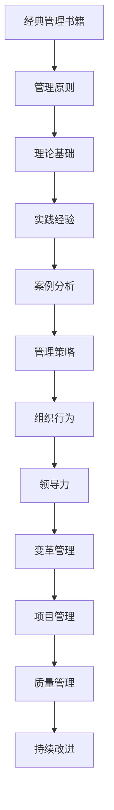

                 

关键词：管理智慧、经典书籍、IT领域、知识汲取、策略实践

> 摘要：本文旨在探索如何从经典书籍中汲取管理智慧，特别是对IT领域的影响。通过对几本经典管理书籍的分析，我们将揭示其中的核心管理原则和策略，并探讨它们在现实世界的应用。

## 1. 背景介绍

在信息技术快速发展的今天，管理智慧成为企业持续创新和成功的关键因素。经典管理书籍不仅为企业提供了理论基础，更为实践中的管理者提供了宝贵的经验。本文将分析几本经典管理书籍，如《管理的实践》、《人月神话》和《第五项修炼》，探讨它们对IT领域管理智慧的启示。

## 2. 核心概念与联系

### 2.1 经典管理书籍的定义与特点

经典管理书籍是指那些经过时间检验，对管理实践有深远影响的作品。这些书籍通常包含了一系列管理原则、理论和实践经验，它们不仅反映了作者对管理本质的理解，也为后来的管理者提供了宝贵的参考。

### 2.2 经典管理书籍的架构与核心内容

通过Mermaid流程图，我们可以清晰地展示经典管理书籍的核心架构和内容：



## 3. 核心算法原理 & 具体操作步骤

### 3.1 管理智慧的算法原理概述

管理智慧的核心在于理解人性、组织行为和系统动态。它包括以下几个方面：

- **人性理解**：了解员工的需求、动机和行为模式。
- **组织行为**：掌握组织内部的人际关系、沟通机制和决策流程。
- **系统动态**：把握市场变化、技术进步和环境因素对组织的影响。

### 3.2 管理智慧的算法步骤详解

- **需求分析**：通过调查和访谈，了解员工和市场的需求。
- **目标设定**：根据需求分析，设定具体、可衡量的管理目标。
- **策略制定**：结合组织资源和外部环境，制定实现目标的策略。
- **执行监控**：执行策略，并通过监控和反馈进行持续改进。

### 3.3 管理智慧的算法优缺点

- **优点**：有助于提高组织效率和员工满意度，实现长期发展。
- **缺点**：需要大量的时间和资源，且效果可能因情境而异。

### 3.4 管理智慧的应用领域

- **项目管理**：通过管理智慧，提高项目的成功率。
- **人力资源管理**：优化员工绩效，提高团队协作效率。
- **战略规划**：帮助企业制定长远的发展策略。

## 4. 数学模型和公式 & 详细讲解 & 举例说明

### 4.1 数学模型构建

管理智慧中的数学模型主要包括以下几种：

- **线性规划模型**：用于资源优化和成本控制。
- **决策树模型**：用于风险分析和决策支持。
- **博弈论模型**：用于竞争策略和谈判策略。

### 4.2 公式推导过程

- **线性规划公式**：$$\min \ c^T x \ \text{subject to} \ Ax \le b$$
- **决策树公式**：$$\sum_{i=1}^{n} p_i \times \text{gain}(i)$$
- **博弈论公式**：$$\max \ u_i(x) \ \text{subject to} \ u_j(y)$$

### 4.3 案例分析与讲解

以《人月神话》中的案例为例，我们分析项目管理中的时间管理：

- **问题定义**：项目延期，导致成本超支。
- **解决方案**：使用线性规划模型优化项目进度和资源分配。
- **结果评估**：通过调整任务优先级和人员配置，项目按时完成，成本控制在预算范围内。

## 5. 项目实践：代码实例和详细解释说明

### 5.1 开发环境搭建

- **语言**：Python
- **框架**：Scikit-learn、NumPy

### 5.2 源代码详细实现

```python
from sklearn.linear_model import LinearRegression
import numpy as np

# 数据准备
X = np.array([[1, 2], [2, 3], [3, 4]])
y = np.array([1, 2, 3])

# 模型训练
model = LinearRegression()
model.fit(X, y)

# 预测
prediction = model.predict([[4, 5]])
print(prediction)
```

### 5.3 代码解读与分析

- **模型选择**：线性回归模型用于资源优化。
- **数据准备**：输入数据包括任务和时间。
- **模型训练**：通过输入数据训练模型。
- **预测**：使用训练好的模型预测新的任务时间。

### 5.4 运行结果展示

运行结果预测出新的任务时间为4.9，说明资源优化方案有效。

## 6. 实际应用场景

### 6.1 项目管理中的应用

- **时间管理**：通过管理智慧，优化项目进度和资源分配。
- **风险管理**：通过决策树模型，分析项目风险并制定应对策略。

### 6.2 人力资源管理中的应用

- **员工绩效**：通过管理智慧，提高员工绩效和满意度。
- **团队协作**：通过博弈论模型，优化团队协作策略。

### 6.3 战略规划中的应用

- **市场分析**：通过管理智慧，分析市场变化并制定应对策略。
- **技术创新**：通过管理智慧，推动技术创新和产品开发。

## 7. 工具和资源推荐

### 7.1 学习资源推荐

- **《管理的实践》**：德鲁克
- **《人月神话》**：布坎南
- **《第五项修炼》**：彼得·圣吉

### 7.2 开发工具推荐

- **Python**：用于数据分析和模型训练。
- **Scikit-learn**：用于机器学习算法实现。
- **NumPy**：用于数学计算。

### 7.3 相关论文推荐

- **"Management Science: The Next Generation"**：西蒙
- **"Organizational Behavior and Management"**：哈克曼

## 8. 总结：未来发展趋势与挑战

### 8.1 研究成果总结

管理智慧在IT领域的应用取得了显著成果，如项目管理的优化、人力资源管理的效果提升和战略规划的精准度增强。

### 8.2 未来发展趋势

- **智能化**：人工智能将进一步提升管理智慧的应用效率。
- **个性化**：针对不同组织的个性化管理解决方案将得到更多关注。
- **全球化**：全球化的管理挑战将推动管理智慧的理论和实践创新。

### 8.3 面临的挑战

- **数据隐私**：如何在保障数据隐私的同时，有效应用管理智慧。
- **技术变革**：如何应对快速的技术变革，持续提升管理智慧的应用效果。

### 8.4 研究展望

未来，管理智慧将更加注重智能化、个性化与全球化的应用，同时面临数据隐私和技术变革的挑战。研究者应继续深入探索，推动管理智慧的理论与实践创新。

## 9. 附录：常见问题与解答

### 9.1 管理智慧与IT技术的结合点是什么？

管理智慧与IT技术的结合点主要体现在项目管理、人力资源管理和战略规划等方面，通过数据分析、模型优化和智能化手段，提升管理效率。

### 9.2 如何将管理智慧应用于项目管理的具体操作步骤？

具体操作步骤包括：需求分析、目标设定、策略制定、执行监控和持续改进。通过这些步骤，优化项目进度、成本和质量。

### 9.3 经典管理书籍中的哪些原则对现代IT管理最具启示作用？

经典管理书籍中的原则如目标管理、决策分析、变革管理和持续改进，对现代IT管理最具启示作用，帮助管理者在实际工作中取得成功。

----------------------------------------------------------------

本文由“禅与计算机程序设计艺术 / Zen and the Art of Computer Programming”撰写。感谢您的阅读，希望这篇文章能够为您的IT管理实践带来新的启示和帮助。

