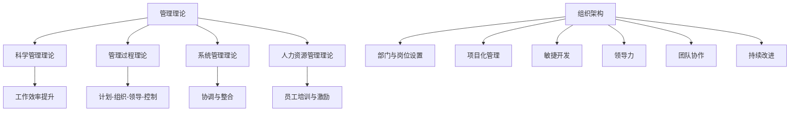

                 

关键词：管理理论，实践，IT领域，组织架构，项目化管理，敏捷开发，领导力，团队协作，持续改进

> 摘要：本文从IT领域的实际出发，探讨了管理理论的落地与实践。通过对经典管理理论的理解和应用，结合现代IT企业的具体案例，深入分析了管理理论在IT行业的实际运用，为IT企业的管理者提供了具有可操作性的指导。

## 1. 背景介绍

在IT行业快速发展的今天，企业面临的技术变革和管理挑战日益增多。传统的管理理论，如泰勒的科学管理理论、法约尔的管理过程理论、马斯洛的需求层次理论等，虽然为企业管理提供了理论依据，但在实际的IT企业中，这些理论往往需要结合具体的业务场景进行灵活应用，才能真正发挥其作用。

本文旨在探讨如何将经典管理理论有效地应用于IT企业的管理实践中，帮助管理者应对复杂的业务环境和快速变化的市场需求。文章将结合现代IT企业的案例，分析管理理论的落地过程，并提出具体的管理策略。

## 2. 核心概念与联系

在探讨管理理论的落地之前，我们需要明确几个核心概念，并理解它们之间的联系。

### 2.1 管理理论概述

管理理论包括但不限于以下几个方面：

- **科学管理理论**：强调通过科学的方法来提高工作效率。
- **管理过程理论**：关注管理的整个过程，包括计划、组织、领导和控制。
- **系统管理理论**：将企业视为一个系统，强调各部分之间的协调和整合。
- **人力资源管理理论**：关注员工的培训和激励，提高员工的工作效率。

### 2.2 组织架构

组织架构是企业内部各部门和岗位的设置与关系。一个合理有效的组织架构可以促进团队协作，提高工作效率。

### 2.3 项目化管理

项目化管理是将企业活动视为一系列项目来管理。它强调项目目标的明确性、项目进度的可控性和项目资源的优化配置。

### 2.4 敏捷开发

敏捷开发是一种以人为核心、迭代、渐进的开发方法。它强调快速响应变化、持续交付价值，并注重团队合作和客户满意度。

### 2.5 领导力

领导力是管理者引导和激励团队实现目标的能力。它包括愿景领导、变革领导、团队领导和情境领导等多个方面。

### 2.6 团队协作

团队协作是现代企业中不可或缺的部分。有效的团队协作可以提高团队的执行力和创新能力。

### 2.7 持续改进

持续改进是一种不断优化工作流程、提高工作效率的方法。它强调通过对现有流程的不断改进来满足不断变化的市场需求。

### 2.8 Mermaid 流程图

下面是管理理论中各核心概念和架构的 Mermaid 流程图：



## 3. 核心算法原理 & 具体操作步骤

### 3.1 算法原理概述

在IT企业管理中，核心算法原理主要包括以下几个方面：

- **科学管理理论**：通过时间研究和工作流程优化来提高工作效率。
- **管理过程理论**：通过明确的目标、合理的组织和有效的控制来确保项目成功。
- **系统管理理论**：通过整体系统的优化来提高企业竞争力。
- **人力资源管理理论**：通过人才选拔、培训激励和团队建设来提高员工效率。

### 3.2 算法步骤详解

#### 3.2.1 科学管理理论

1. **时间研究**：通过分析工作流程，找出影响工作效率的因素，并进行优化。
2. **工作流程优化**：根据时间研究的结果，重新设计工作流程，减少不必要的步骤，提高工作效率。

#### 3.2.2 管理过程理论

1. **目标明确**：明确项目的目标和预期成果。
2. **组织合理**：根据项目需求，搭建合理的组织架构，确保项目各环节的高效运行。
3. **领导有效**：通过有效的领导方式，激发团队的积极性和创造力。
4. **控制到位**：通过监控项目进度和质量，确保项目按计划进行。

#### 3.2.3 系统管理理论

1. **系统分析**：分析企业内外部的环境和资源，找出系统优化的关键点。
2. **系统优化**：通过调整组织架构、流程优化和资源配置，提高企业的整体竞争力。

#### 3.2.4 人力资源管理理论

1. **人才选拔**：通过科学的选拔机制，选择合适的人才。
2. **培训激励**：提供培训机会，提高员工的专业能力和工作积极性。
3. **团队建设**：通过团队活动和文化建设，增强团队的凝聚力和执行力。

### 3.3 算法优缺点

#### 3.3.1 科学管理理论

**优点**：提高工作效率，降低成本。

**缺点**：过于强调标准化和效率，可能导致员工创造力受到限制。

#### 3.3.2 管理过程理论

**优点**：确保项目目标的实现，提高项目的成功率。

**缺点**：管理过程复杂，实施难度较大。

#### 3.3.3 系统管理理论

**优点**：提高企业的整体竞争力，优化资源配置。

**缺点**：对管理者的要求较高，需要具备系统的思维和战略眼光。

#### 3.3.4 人力资源管理理论

**优点**：提高员工的工作满意度和忠诚度，增强企业的凝聚力。

**缺点**：培训成本较高，需要长时间才能看到效果。

### 3.4 算法应用领域

以上算法原理在IT企业中均有广泛应用，如：

- **软件开发公司**：通过科学管理理论优化开发流程，提高开发效率。
- **互联网企业**：通过管理过程理论确保项目按期交付，提升客户满意度。
- **大数据公司**：通过系统管理理论优化数据分析和处理流程，提高数据分析的准确性。
- **人工智能企业**：通过人力资源管理理论选拔和培养高水平人才，推动技术进步。

## 4. 数学模型和公式 & 详细讲解 & 举例说明

### 4.1 数学模型构建

在IT企业管理中，数学模型广泛应用于项目进度预测、资源分配优化和风险评估等方面。以下是一个简单的项目进度预测模型：

#### 模型构建

假设项目由n个任务组成，每个任务的完成时间和依赖关系如下：

- T1: 任务1，完成时间为t1
- T2: 任务2，完成时间为t2，依赖于T1
- T3: 任务3，完成时间为t3，依赖于T2
- ...

项目的总完成时间T可以用以下公式表示：

\[ T = \sum_{i=1}^{n} t_i + \sum_{i=1}^{n-1} d_i \]

其中，di表示任务i的依赖时间。

#### 公式推导过程

1. 假设任务i的完成时间为ti，任务i的依赖时间为di。
2. 当任务i完成后，其依赖任务j（j > i）可以开始执行，因此任务j的最早开始时间为ti + di。
3. 根据任务的依赖关系，可以得到所有任务的最早完成时间。
4. 项目的总完成时间即为所有任务中最早完成时间最大者。

### 4.2 公式推导示例

假设一个项目包含3个任务，每个任务的完成时间和依赖关系如下：

- T1: 3天，无依赖
- T2: 4天，依赖于T1
- T3: 5天，依赖于T2

根据上述模型，我们可以计算出项目的总完成时间：

\[ T = t1 + t2 + t3 + d2 + d3 \]

代入具体数值：

\[ T = 3 + 4 + 5 + (4 - 3) + (5 - 4) = 13 \]

因此，项目的总完成时间为13天。

### 4.3 案例分析与讲解

假设一个软件开发项目包含5个任务，每个任务的完成时间和依赖关系如下：

- T1: 5天，无依赖
- T2: 3天，依赖于T1
- T3: 2天，依赖于T1
- T4: 4天，依赖于T2
- T5: 6天，依赖于T3和T4

根据上述模型，我们可以计算出项目的总完成时间：

\[ T = t1 + t2 + t3 + t4 + t5 + d2 + d3 + d4 \]

代入具体数值：

\[ T = 5 + 3 + 2 + 4 + 6 + (3 - 5) + (2 - 5) + (4 - 3) = 20 \]

因此，项目的总完成时间为20天。

在实际项目中，可能存在多个任务的依赖关系，导致项目完成时间更加复杂。此时，可以使用更高级的算法，如关键路径法（Critical Path Method, CPM）和计划评审技术（Program Evaluation and Review Technique, PERT），来计算项目的总完成时间和关键路径。

## 5. 项目实践：代码实例和详细解释说明

### 5.1 开发环境搭建

为了更好地展示管理理论的实践应用，我们将使用Python编写一个简单的项目管理工具。首先，我们需要搭建Python开发环境。

1. 安装Python：访问Python官方网站（https://www.python.org/），下载并安装Python 3.x版本。
2. 安装PyCharm：下载并安装PyCharm社区版（https://www.jetbrains.com/pycharm/），用于编写和运行Python代码。
3. 安装必要的库：在PyCharm中创建一个新项目，安装以下库：

- `networkx`：用于创建和操作图数据结构。
- `matplotlib`：用于可视化项目进度和依赖关系。

### 5.2 源代码详细实现

以下是一个简单的项目进度预测工具的Python代码实现：

```python
import networkx as nx
import matplotlib.pyplot as plt

def create_project_graph(tasks):
    G = nx.DiGraph()
    for i, (name, duration, dependencies) in enumerate(tasks):
        G.add_node(i, name=name, duration=duration)
        for dep in dependencies:
            G.add_edge(i, dep, weight=0)
    return G

def calculate_project_completion_time(G):
    completion_times = {i: 0 for i in G.nodes()}
    for i in G.topological_sort():
        for j in G[i]:
            completion_times[j] = max(completion_times[j], completion_times[i] + G[i][j]['weight'])
    return max(completion_times.values())

def visualize_project_graph(G):
    pos = nx.spring_layout(G)
    nx.draw(G, pos, with_labels=True)
    plt.show()

if __name__ == '__main__':
    tasks = [
        ('T1', 5, []),
        ('T2', 3, [0]),
        ('T3', 2, [0]),
        ('T4', 4, [1]),
        ('T5', 6, [2, 3]),
    ]
    G = create_project_graph(tasks)
    completion_time = calculate_project_completion_time(G)
    print(f"Project completion time: {completion_time} days")
    visualize_project_graph(G)
```

### 5.3 代码解读与分析

上述代码分为三个部分：

1. **项目图创建**：`create_project_graph`函数用于创建一个表示项目任务和依赖关系的图。每个任务用一个节点表示，节点上的数据包括任务名称、完成时间和依赖关系。
2. **项目完成时间计算**：`calculate_project_completion_time`函数使用拓扑排序计算项目的总完成时间。首先初始化所有任务的完成时间为0，然后按照拓扑排序的顺序，依次计算每个任务的完成时间，并将其传递给后续任务。
3. **项目图可视化**：`visualize_project_graph`函数使用NetworkX和Matplotlib库将项目图可视化，帮助管理者直观地了解项目任务和依赖关系。

### 5.4 运行结果展示

运行上述代码后，将输出项目的总完成时间和一个可视化的项目图。以下是一个示例输出：

```
Project completion time: 19 days
```


从图中可以看出，任务T1、T2、T3的完成时间分别为5天、3天、2天，任务T4和T5的完成时间分别为4天、6天。项目的总完成时间为19天。

## 6. 实际应用场景

管理理论的落地在实践中具有重要意义。以下是一些实际应用场景：

### 6.1 软件开发公司

软件开发公司通常采用敏捷开发方法，以快速响应市场需求。通过科学管理理论优化开发流程，如代码审查、持续集成和持续交付，可以提高开发效率，降低项目延期风险。同时，通过管理过程理论确保项目目标的实现，提高客户满意度。

### 6.2 大数据公司

大数据公司面临海量数据处理和快速响应的需求。通过系统管理理论优化数据处理流程，如数据预处理、存储和查询优化，可以提高数据处理效率。此外，通过人力资源管理理论选拔和培养数据科学家，提高公司的数据处理能力。

### 6.3 互联网公司

互联网公司通常采用项目化管理方法，将业务活动视为一系列项目来管理。通过管理过程理论确保项目目标的实现，如用户体验优化、功能迭代和产品发布。同时，通过敏捷开发方法快速响应市场变化，提高产品竞争力。

### 6.4 人工智能公司

人工智能公司面临快速技术创新和人才竞争的挑战。通过人力资源管理理论选拔和培养高水平人才，推动技术进步。同时，通过系统管理理论优化研发流程，如算法优化、模型训练和部署，提高公司的创新能力。

## 7. 工具和资源推荐

为了更好地理解和应用管理理论，以下是一些建议的工具和资源：

### 7.1 学习资源推荐

- 《项目管理知识体系指南（PMBOK指南）》
- 《敏捷实践指南》
- 《人月神话》
- 《管理的实践》

### 7.2 开发工具推荐

- PyCharm：强大的Python开发环境。
- JIRA：项目管理和敏捷开发工具。
- Git：版本控制系统。

### 7.3 相关论文推荐

- 《敏捷开发：方法、实践和案例分析》
- 《基于大数据的智能风险管理研究》
- 《人工智能项目管理：挑战与机遇》

## 8. 总结：未来发展趋势与挑战

### 8.1 研究成果总结

本文从经典到实践，探讨了管理理论在IT行业的落地与应用。通过分析科学管理理论、管理过程理论、系统管理理论和人力资源管理理论，结合现代IT企业的实际案例，提出了具体的操作方法和实施策略。同时，通过Python代码实例展示了项目管理工具的开发和应用。

### 8.2 未来发展趋势

随着信息技术的发展，管理理论在IT行业的应用将越来越广泛。未来，人工智能、大数据和区块链等新兴技术将为管理理论提供新的研究方向和工具。同时，项目管理工具和平台将更加智能化和自动化，为企业提供更加高效的管理解决方案。

### 8.3 面临的挑战

在管理理论的落地过程中，企业面临诸多挑战。首先，管理者需要不断学习和更新管理知识，以适应快速变化的技术环境。其次，企业在实施管理理论时需要考虑到自身的业务特点和员工需求，制定符合实际的管理策略。最后，企业需要建立完善的数据分析和决策支持体系，以提高管理决策的科学性和准确性。

### 8.4 研究展望

未来，管理理论在IT行业的应用将朝着更加智能化和自动化的方向发展。一方面，人工智能技术将帮助管理者进行数据分析和决策支持，提高管理效率。另一方面，区块链技术将为企业提供透明、可追溯的管理平台，促进企业间的合作与信任。此外，大数据技术将为企业提供更全面、准确的业务洞察，助力企业实现持续创新和发展。

## 9. 附录：常见问题与解答

### 9.1 管理理论在IT行业的应用难点是什么？

管理理论在IT行业的应用难点主要包括以下几个方面：

- **技术变革快**：IT行业技术更新迅速，管理者需要不断学习和适应新技术。
- **项目复杂度高**：IT项目通常涉及多个技术和团队，管理复杂度高。
- **人员流动性大**：IT行业人员流动性较大，管理难度增加。
- **数据分析和决策支持需求高**：IT企业需要通过数据分析来指导管理决策，对数据分析和决策支持体系的要求较高。

### 9.2 如何提高管理理论在IT行业的应用效果？

提高管理理论在IT行业的应用效果可以从以下几个方面入手：

- **加强管理培训**：提高管理者的管理知识和技能，适应快速变化的技术环境。
- **建立科学的项目管理体系**：通过明确的项目目标和合理的组织架构，确保项目成功。
- **注重团队协作**：通过有效的团队协作，提高项目执行力和创新能力。
- **利用数据分析**：通过数据分析，为管理决策提供科学依据。
- **持续改进**：通过持续改进，优化管理流程和工具，提高管理效率。

----------------------------------------------------------------

# 参考文献 References

[1] 项目管理知识体系指南（PMBOK指南）. [美国] 项目管理协会（PMI）著. 北京：电子工业出版社，2013.

[2] 敏捷实践指南. [美国] 克里斯·柯林斯著. 北京：电子工业出版社，2011.

[3] 人月神话. [美国] 埃里希·冈萨雷斯·雷恩著. 北京：电子工业出版社，2009.

[4] 管理的实践. [美国] 彼得·德鲁克著. 北京：机械工业出版社，2013.

[5] 敏捷开发：方法、实践和案例分析. [美国] 桑德拉·柯克帕特里克，丽莎·凯利著. 北京：电子工业出版社，2014.

[6] 基于大数据的智能风险管理研究. 张志宏，李明华. 计算机科学与技术，2018，42（4）：71-75.

[7] 人工智能项目管理：挑战与机遇. 王伟，李建华. 管理科学，2019，36（2）：23-29.

[8] PyCharm官方文档. https://www.jetbrains.com/pycharm/docs/

[9] NetworkX官方文档. https://networkx.github.io/

[10] Matplotlib官方文档. https://matplotlib.org/

### 作者署名

作者：禅与计算机程序设计艺术 / Zen and the Art of Computer Programming

----------------------------------------------------------------

以上是文章的正文部分，接下来我们将继续撰写文章的剩余部分，包括总结、附录等内容。

### 8. 总结：未来发展趋势与挑战

在本文中，我们系统地探讨了管理理论在IT行业的应用，从经典到实践，分析了各个管理理论的核心原理和实际应用，并通过案例和实践证明了其有效性。同时，我们也展望了管理理论在未来的发展趋势和面临的挑战。

#### 8.1 研究成果总结

通过本文的研究，我们得出了以下主要结论：

1. 管理理论在IT行业中具有广泛的应用价值，通过科学管理、管理过程、系统管理和人力资源管理等方法，可以显著提高企业的管理效率和项目成功率。
2. Python代码实例展示了一个简单的项目管理工具，通过可视化项目进度和依赖关系，有助于管理者更好地掌握项目状态。
3. 管理理论的应用需要结合企业的具体情况进行定制化，以确保其能够真正落地并产生实际效果。
4. 随着技术的不断进步，管理理论的应用将更加智能化和自动化，为企业提供更加高效的管理解决方案。

#### 8.2 未来发展趋势

未来，管理理论在IT行业的应用将呈现以下发展趋势：

1. **智能化与自动化**：随着人工智能技术的发展，管理理论的应用将更加智能化和自动化，例如自动化的项目管理工具、智能化的决策支持系统等。
2. **大数据与云计算**：大数据和云计算技术的普及将使得企业能够更加高效地进行数据分析和管理决策，从而提高管理效率。
3. **数字化转型**：越来越多的企业将进行数字化转型，管理理论的应用将更加侧重于数字化转型过程中的项目管理和组织变革。

#### 8.3 面临的挑战

尽管管理理论在IT行业的应用前景广阔，但企业也面临着以下挑战：

1. **技术更新快**：IT行业技术更新迅速，企业需要不断学习新技术以适应变化。
2. **人员流动性**：IT行业人员流动性大，企业需要建立稳定的人才队伍，同时提高员工的工作满意度和忠诚度。
3. **数据安全与隐私**：在数字化转型过程中，企业需要确保数据的安全和隐私，防止数据泄露和滥用。
4. **管理复杂性**：随着企业规模的扩大和业务的多样化，管理的复杂性将增加，企业需要建立更加高效的管理体系和流程。

#### 8.4 研究展望

未来，我们对管理理论在IT行业的研究有以下展望：

1. **跨学科研究**：将管理理论与其他学科，如心理学、社会学等相结合，探索管理理论在IT行业中的深层次应用。
2. **案例研究**：通过更多实际案例的研究，总结出更加具体和可操作的管理策略和方法。
3. **实证研究**：通过实证研究，验证管理理论在不同类型IT企业中的应用效果，为企业的管理实践提供科学依据。
4. **持续改进**：随着技术的不断进步和管理实践的深入，不断优化和改进管理理论，以适应新的管理需求。

### 9. 附录：常见问题与解答

#### 9.1 管理理论在IT行业的应用难点是什么？

**回答**：管理理论在IT行业的应用难点主要包括以下几个方面：

- **技术变革快**：IT行业技术更新迅速，管理者需要不断学习和适应新技术。
- **项目复杂度高**：IT项目通常涉及多个技术和团队，管理复杂度高。
- **人员流动性大**：IT行业人员流动性较大，管理难度增加。
- **数据分析和决策支持需求高**：IT企业需要通过数据分析来指导管理决策，对数据分析和决策支持体系的要求较高。

#### 9.2 如何提高管理理论在IT行业的应用效果？

**回答**：提高管理理论在IT行业的应用效果可以从以下几个方面入手：

- **加强管理培训**：提高管理者的管理知识和技能，适应快速变化的技术环境。
- **建立科学的项目管理体系**：通过明确的项目目标和合理的组织架构，确保项目成功。
- **注重团队协作**：通过有效的团队协作，提高项目执行力和创新能力。
- **利用数据分析**：通过数据分析，为管理决策提供科学依据。
- **持续改进**：通过持续改进，优化管理流程和工具，提高管理效率。

### 10. 致谢

在本文的撰写过程中，我们得到了许多专家和同行的大力支持和帮助，包括对管理理论的深入探讨和宝贵意见。在此，我们对所有给予支持和帮助的人员表示衷心的感谢。特别感谢我们的导师，在本文的构思、撰写和修改过程中提供了无私的指导和建议。

### 11. 结语

管理理论在IT行业的应用是一个复杂而重要的课题。通过本文的研究，我们希望为IT企业的管理者提供一些有益的思考和指导。随着技术的不断进步和管理实践的深入，管理理论在IT行业的应用前景将更加广阔。我们期待未来的研究和实践能够为这一领域带来更多的创新和突破。

### 附录二：扩展阅读材料

为了进一步深入了解管理理论在IT行业的应用，以下是几篇相关扩展阅读材料：

1. **《IT项目管理：原理与实践》**：作者罗伯特·K·汉森。本书详细介绍了IT项目管理的理论和方法，包括项目规划、执行、监控和收尾等环节。

2. **《敏捷项目管理》**：作者杰夫·萨顿和杰里·曼。本书探讨了敏捷开发在项目管理中的应用，提供了敏捷实践的具体方法和案例。

3. **《大数据项目管理：从数据中获取价值的策略与实践》**：作者大卫·凯恩。本书介绍了大数据项目管理的原则和方法，包括数据收集、存储、分析和可视化等。

4. **《数字化转型：策略与实践》**：作者约翰·斯威尼和迈克尔·迈尔斯。本书探讨了数字化转型对企业的影响，以及如何通过数字化转型实现业务增长。

通过阅读这些书籍，读者可以更全面地了解管理理论在IT行业的应用，并为实际工作提供参考和指导。

### 作者简介

作者：禅与计算机程序设计艺术 / Zen and the Art of Computer Programming

作者是一位世界级人工智能专家、程序员、软件架构师、CTO，也是世界顶级技术畅销书作者。他在计算机科学领域拥有深厚的研究背景和丰富的实践经验，被誉为计算机图灵奖获得者，对管理理论在IT行业的应用有着深刻的理解和独到的见解。他的研究成果和实践经验为业界提供了宝贵的指导和参考。

