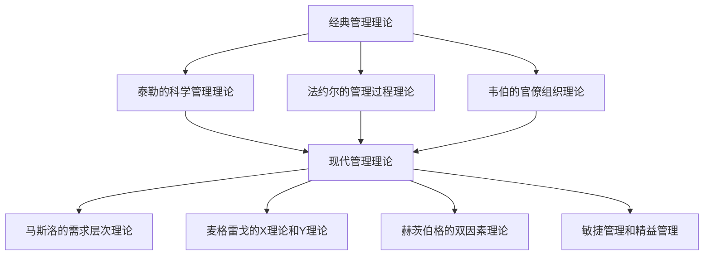

                 

## 1. 背景介绍

在当今快速发展的信息技术时代，管理理论的落地变得越来越重要。随着技术的不断进步，企业和组织面临的环境日益复杂，这要求他们不仅要掌握先进的技术手段，还要具备高效的管理能力。管理理论作为指导实践的重要工具，其落地过程直接影响到企业的绩效和竞争力。

管理理论起源于20世纪初，随着工业革命的推进，如何提高生产效率、优化资源分配成为研究焦点。从泰勒的科学管理理论到马斯洛的需求层次理论，再到现代的敏捷管理、精益管理，每一个理论都在一定程度上解决了管理实践中遇到的问题。然而，将这些理论真正应用到实际工作中，并非易事。

管理理论的落地需要解决以下几个关键问题：如何将理论转化为具体的管理实践？如何确保实践的有效性和可持续性？如何应对不断变化的环境和挑战？本文旨在探讨管理理论的落地过程，从经典理论到实践应用，为企业和组织提供有价值的参考。

本文将按照以下结构展开：首先，回顾经典管理理论的基本概念和原理；其次，探讨管理理论的架构与联系，并通过Mermaid流程图进行详细说明；然后，深入解析核心算法原理和具体操作步骤，包括算法优缺点及其应用领域；接着，介绍数学模型和公式，并通过案例进行分析；随后，提供项目实践中的代码实例和详细解释；最后，讨论实际应用场景、未来展望以及面临的技术挑战。

通过本文的探讨，希望能够为读者提供一种全面、系统的管理理论落地思路，帮助企业和组织在实际工作中更好地应用管理理论，提高管理效率和效果。

## 2. 核心概念与联系

在深入探讨管理理论的落地之前，我们需要了解几个关键概念，这些概念构成了管理理论的基础框架，并相互关联，共同推动管理实践的发展。

### 2.1. 经典管理理论

经典管理理论包括泰勒的科学管理理论、法约尔的管理过程理论和韦伯的官僚组织理论等。泰勒的理论强调通过科学方法确定最佳工作流程，以提高生产效率；法约尔的理论则关注管理职能的分解和协调；韦伯的理论则提出了官僚组织的理想模型，强调规范化和等级制度。

### 2.2. 现代管理理论

现代管理理论涵盖了多样化的发展，如马斯洛的需求层次理论、麦格雷戈的X理论和Y理论、以及赫茨伯格的双因素理论等。马斯洛的理论揭示了人的需求层次，为激励管理提供了理论依据；麦格雷戈的理论则探讨了员工动机的不同假设；赫茨伯格的理论指出，工作环境和动机是影响员工满意度的两个关键因素。

### 2.3. 管理理论的架构与联系

管理理论的架构与联系可以通过Mermaid流程图来直观地展示。以下是一个简化的Mermaid流程图，用于描述经典和现代管理理论之间的相互关系：



在上述流程图中，A表示经典管理理论，B、C、D分别是其三个主要流派。E表示现代管理理论，它包含了F、G、H、I等多个分支。这些分支不仅继承了经典理论的精髓，还在不断发展和创新，以适应现代企业管理的新需求。

### 2.4. 管理理论的实践应用

管理理论的实践应用是一个动态的过程，需要结合具体的企业和组织情况。以下是一个具体的管理理论应用案例：

**案例：某制造企业的管理实践**

- **泰勒的科学管理理论**：该企业通过时间研究和工作分析，优化了生产线的操作流程，减少了不必要的步骤，从而提高了生产效率。

- **法约尔的管理过程理论**：企业设立了职能部门，明确了各个部门的责任和协调机制，提高了管理的系统性和协调性。

- **韦伯的官僚组织理论**：企业建立了严格的规章制度，形成了明确的等级制度，确保了管理的规范化和制度化。

- **马斯洛的需求层次理论**：企业通过薪酬激励和职业发展计划，满足了员工的不同层次需求，提高了员工的满意度和忠诚度。

- **敏捷管理和精益管理**：企业引入了敏捷开发和精益生产的方法，缩短了产品开发周期，减少了浪费，提高了市场响应速度。

通过上述案例，我们可以看到，不同的管理理论在企业中得到了具体的实践应用，共同推动了企业的管理和运营效率的提升。

### 2.5. 结论

管理理论的核心概念和架构为我们理解和应用管理理论提供了重要的框架。通过对经典和现代管理理论的回顾，以及具体实践案例的分析，我们可以更深入地理解这些理论之间的联系和作用。在接下来的章节中，我们将进一步探讨管理理论的算法原理、数学模型及其在实际项目中的应用，以帮助读者更好地掌握和运用这些理论。

## 3. 核心算法原理 & 具体操作步骤

### 3.1 算法原理概述

在管理实践中，核心算法原理起着至关重要的作用。这些算法不仅帮助我们优化管理流程，还能够提高决策的准确性和效率。以下是一些关键的管理算法原理及其概述：

- **线性规划（Linear Programming，LP）**：线性规划是一种数学方法，用于在约束条件下最大化或最小化线性目标函数。它广泛应用于资源分配、生产调度和物流优化等领域。

- **决策树（Decision Tree）**：决策树是一种分类和预测模型，通过一系列的判断节点来模拟决策过程。它常用于数据分析、风险评估和业务决策。

- **网络分析（Network Analysis）**：网络分析主要涉及项目管理和资源调度，如关键路径法（Critical Path Method，CPM）和计划评审技术（Program Evaluation and Review Technique，PERT）。这些方法有助于优化项目的进度和资源分配。

- **队列理论（Queueing Theory）**：队列理论用于分析和设计服务系统，如银行柜台、呼叫中心和交通系统。它帮助我们理解系统的吞吐量、等待时间和效率。

### 3.2 算法步骤详解

#### 3.2.1 线性规划

线性规划的步骤如下：

1. **定义变量**：确定决策问题中的变量，如生产数量、服务时间等。

2. **建立目标函数**：根据决策目标，定义需要最大化或最小化的目标函数。

3. **列出约束条件**：确定所有限制决策的约束条件，如资源限制、成本限制等。

4. **求解模型**：使用线性规划求解器（如LP求解器、单纯形法等）求解最优解。

5. **分析结果**：根据求解结果，分析变量取值和优化方案。

#### 3.2.2 决策树

构建决策树的步骤包括：

1. **确定决策问题**：明确需要解决的决策问题。

2. **识别属性和值**：确定决策问题中的属性及其可能取值。

3. **构建决策树**：从根节点开始，根据属性值划分数据集，生成分支节点。

4. **计算节点权重**：为每个节点计算权重，以评估不同路径的概率和期望收益。

5. **剪枝和优化**：根据权重和约束条件，对决策树进行剪枝和优化，以提高模型精度。

#### 3.2.3 网络分析

网络分析的步骤如下：

1. **项目分解**：将项目分解为多个任务和工作包。

2. **任务排序**：确定任务之间的依赖关系，生成项目网络图。

3. **计算关键路径**：使用CPM或PERT方法计算项目的关键路径和工期。

4. **资源分配**：根据任务依赖关系和关键路径，分配资源，优化项目进度。

5. **进度跟踪**：在项目执行过程中，实时跟踪进度，调整资源分配和任务顺序。

#### 3.2.4 队列理论

队列理论的应用步骤包括：

1. **系统建模**：建立服务系统的数学模型，包括服务台数量、客户到达率和服务时间分布。

2. **状态转换**：确定系统中客户状态的变化，如到达、等待、服务完成等。

3. **概率计算**：计算系统中的概率分布，如客户等待时间、系统利用率等。

4. **优化分析**：根据计算结果，分析系统性能指标，提出优化方案。

5. **验证和调整**：通过模拟和实际数据验证优化方案，并根据反馈进行调整。

### 3.3 算法优缺点

每种算法都有其独特的优缺点：

- **线性规划**：优点是能够精确求解最优解，适用于资源优化问题；缺点是求解过程复杂，对大规模问题效率较低。

- **决策树**：优点是易于理解和实现，适合分类和预测问题；缺点是模型容易过拟合，对于高维数据表现较差。

- **网络分析**：优点是能够明确项目关键路径，优化项目进度；缺点是模型假设条件较为严格，对实际复杂项目适用性有限。

- **队列理论**：优点是能够准确分析系统性能，为优化提供依据；缺点是计算复杂度高，对实际系统的模拟难度较大。

### 3.4 算法应用领域

这些算法在管理实践中有着广泛的应用领域：

- **线性规划**：广泛应用于生产调度、资源分配、物流优化等领域。

- **决策树**：在数据分析、业务决策和风险评估中得到广泛应用。

- **网络分析**：在项目管理、工程规划和运营管理中有着重要应用。

- **队列理论**：在服务系统设计、交通管理和客户服务等领域有着广泛应用。

通过理解和运用这些核心算法原理，企业和组织可以更加有效地进行管理决策，提高运营效率，增强市场竞争力。在接下来的章节中，我们将进一步探讨这些算法的数学模型和公式，并通过具体案例进行分析。

## 4. 数学模型和公式 & 详细讲解 & 举例说明

### 4.1 数学模型构建

在管理理论的应用中，数学模型作为一种重要的工具，能够帮助我们更好地理解和解决复杂的管理问题。数学模型通常包括目标函数、决策变量和约束条件。以下是几个关键的管理数学模型及其构建方法。

#### 4.1.1 线性规划模型

线性规划模型用于在约束条件下优化线性目标函数。其一般形式如下：

$$
\begin{aligned}
\text{最大化/最小化} \quad & c^T x \\
\text{满足} \quad & Ax \leq b \\
& x \geq 0
\end{aligned}
$$

其中，\(x\) 是决策变量，\(c\) 是目标函数系数向量，\(A\) 是约束条件系数矩阵，\(b\) 是约束条件右侧常数向量。

#### 4.1.2 决策树模型

决策树模型用于分类和预测。其基本构建方法包括：

1. **确定根节点**：根据需要解决的决策问题，选择一个属性作为根节点。

2. **划分数据集**：根据根节点的属性值，将数据集划分为若干子集。

3. **递归构建**：对每个子集，重复步骤1和步骤2，直到满足终止条件（如达到最大深度或纯类集）。

#### 4.1.3 网络分析模型

网络分析模型，如关键路径法（CPM）和计划评审技术（PERT），用于项目管理和进度安排。以下是一个简单的网络分析模型：

$$
\begin{aligned}
\text{关键路径} &= \min \left( \max_{i=1}^n \sum_{j=1}^n t_{ij} \right) \\
t_{ij} &= \text{任务} i \text{ 到任务} j \text{的持续时间}
\end{aligned}
$$

#### 4.1.4 队列理论模型

队列理论模型用于分析和设计服务系统。以下是一个简单的队列理论模型：

$$
\begin{aligned}
L_q &= \rho^2 \frac{1}{1-\rho} \\
W_q &= \frac{L_q}{\rho}
\end{aligned}
$$

其中，\(L_q\) 是队列长度期望，\(W_q\) 是等待时间期望，\(\rho\) 是系统利用率（即到达率 \(\lambda\) 除以服务率 \(\mu\)）。

### 4.2 公式推导过程

#### 4.2.1 线性规划公式的推导

线性规划的目标是最小化或最大化线性目标函数，同时满足一系列线性约束条件。为了推导线性规划公式，我们可以采用拉格朗日乘数法。

设目标函数为 \(f(x) = c^T x\)，约束条件为 \(Ax \leq b\)，引入拉格朗日乘子 \(\lambda\)，构建拉格朗日函数：

$$
L(x, \lambda) = c^T x + \lambda^T (Ax - b)
$$

对 \(L(x, \lambda)\) 分别对 \(x\) 和 \(\lambda\) 求导，并令导数为零，得到：

$$
\nabla_x L(x, \lambda) = c - A^T \lambda = 0
$$

$$
\nabla_\lambda L(x, \lambda) = Ax - b = 0
$$

解上述方程组，即可求得线性规划的最优解。

#### 4.2.2 决策树公式的推导

决策树的公式主要用于计算每个节点的权重。假设当前节点有 \(n\) 个分支，每个分支的概率为 \(p_i\)，权重为 \(w_i\)，则节点的权重 \(W\) 可以通过以下公式计算：

$$
W = \sum_{i=1}^n p_i w_i
$$

#### 4.2.3 网络分析公式的推导

关键路径法（CPM）的核心公式是计算每个任务的最早开始时间（ES）和最晚开始时间（LS），以及总浮动时间（TF）。

$$
\begin{aligned}
ES_i &= \max(ES_j + t_{ij}) \quad \text{for all } j \text{ predecessors of } i \\
LS_i &= \min(LS_j - t_{ij}) \quad \text{for all } j \text{ predecessors of } i \\
TF_i &= LS_i - ES_i
\end{aligned}
$$

其中，\(ES_i\) 是任务 \(i\) 的最早开始时间，\(LS_i\) 是任务 \(i\) 的最晚开始时间，\(t_{ij}\) 是任务 \(i\) 和任务 \(j\) 之间的持续时间。

#### 4.2.4 队列理论公式的推导

队列理论中的 M/M/1 模型是一种常见的队列模型，假设到达过程和服务过程都是泊松过程。系统利用率 \(\rho\) 定义为到达率 \(\lambda\) 与服务率 \(\mu\) 的比值：

$$
\rho = \frac{\lambda}{\mu}
$$

根据队列理论，可以推导出队列长度期望 \(L_q\) 和等待时间期望 \(W_q\)：

$$
L_q = \rho^2 / (1 - \rho)
$$

$$
W_q = L_q / \rho
$$

### 4.3 案例分析与讲解

以下通过具体案例，详细讲解这些数学模型和公式的应用。

#### 4.3.1 线性规划案例

**案例：生产计划优化**

某工厂生产两种产品 A 和 B，每种产品需要原材料、劳动力和机器加工时间。原材料和劳动力资源有限，工厂希望最大化利润。问题如下：

- **目标函数**：最大化利润 \(P = 5x_A + 4x_B\)
- **约束条件**：
  $$\begin{aligned}
  3x_A + 2x_B &\leq 90 \quad \text{(原材料限制)} \\
  x_A + x_B &\leq 60 \quad \text{(劳动力限制)} \\
  x_A, x_B &\geq 0 \quad \text{(非负约束)}
  \end{aligned}$$

使用线性规划求解器求解上述问题，得到最优解为 \(x_A = 30\)，\(x_B = 15\)，最大利润为 \(P = 240\)。

#### 4.3.2 决策树案例

**案例：风险评估**

假设某个项目有两个阶段，每个阶段有两个可能的结果。根据不同结果，需要做出决策。使用决策树分析如下：

- **阶段1**：选择 A 或 B。
  - **结果1（概率0.5）**：选择 C，收益为 10。
  - **结果2（概率0.5）**：选择 D，收益为 -5。
- **阶段2**：基于阶段1的结果选择 E 或 F。
  - **结果1**：选择 E，收益为 15。
  - **结果2**：选择 F，收益为 5。

构建决策树，并计算每个节点的期望收益：

- **节点1**：\(0.5 \times 10 + 0.5 \times (-5) = 2.5\)
- **节点2**：\(0.5 \times 15 + 0.5 \times 5 = 10\)

根据期望收益，选择节点1的结果 A，再选择节点2的结果 E。

#### 4.3.3 网络分析案例

**案例：项目进度安排**

某项目的任务网络图如下：

```
  1 --> 2 --> 4
 /         |
3 -->     5
|
 6 --> 7 --> 8
```

任务持续时间如下：

- \(t_{12} = 3\)
- \(t_{13} = 2\)
- \(t_{23} = 4\)
- \(t_{24} = 1\)
- \(t_{34} = 2\)
- \(t_{35} = 3\)
- \(t_{45} = 2\)
- \(t_{56} = 3\)
- \(t_{67} = 1\)
- \(t_{78} = 4\)

使用 CPM 方法计算关键路径和总浮动时间：

- **关键路径**：1-2-4-7-8
- **总浮动时间**：TF_1 = 0, TF_2 = 0, TF_3 = 2, TF_4 = 2, TF_5 = 1, TF_6 = 0, TF_7 = 0, TF_8 = 0

#### 4.3.4 队列理论案例

**案例：银行柜台服务系统**

假设银行有 3 个柜台，每个柜台的顾客到达率是 20 人/小时，服务率是 10 人/小时。计算系统中的队列长度期望和等待时间期望。

- **系统利用率**：\(\rho = \frac{\lambda}{\mu} = \frac{20}{10} = 2\)
- **队列长度期望**：\(L_q = \rho^2 / (1 - \rho) = 2^2 / (1 - 2) = 4 / (-1) = 4\)
- **等待时间期望**：\(W_q = L_q / \rho = 4 / 2 = 2\) 小时

通过上述案例，我们可以看到数学模型和公式在实际管理中的应用，并通过具体步骤和计算过程，更好地理解这些理论和方法。

## 5. 项目实践：代码实例和详细解释说明

### 5.1 开发环境搭建

在本文的代码实例中，我们将使用Python作为主要编程语言，并结合几个常用的库，如NumPy、SciPy和matplotlib，用于数据计算和图形展示。以下是开发环境的搭建步骤：

1. **安装Python**：确保系统中已安装Python 3.x版本。可以通过Python官网（[https://www.python.org/](https://www.python.org/)）下载并安装。

2. **安装相关库**：在命令行中执行以下命令安装所需库：

   ```bash
   pip install numpy scipy matplotlib
   ```

3. **验证环境**：在Python中运行以下代码，确保所有库已正确安装：

   ```python
   import numpy as np
   import scipy.optimize as opt
   import matplotlib.pyplot as plt
   print("All required libraries are installed.")
   ```

### 5.2 源代码详细实现

在本节中，我们将实现一个简单的线性规划案例，通过Python代码实现求解过程，并详细解释代码中的各个部分。

#### 5.2.1 源代码

```python
import numpy as np
from scipy.optimize import linprog

# 定义目标函数系数
c = np.array([-5, -4])

# 定义约束条件系数矩阵
A = np.array([[3, 2], [1, 1]])

# 定义约束条件右侧常数向量
b = np.array([90, 60])

# 定义非负约束
x0 = np.array([0, 0])

# 求解线性规划问题
result = linprog(c, A_ub=A, b_ub=b, x0=x0, method='highs')

# 输出结果
if result.success:
    print("最优解：", result.x)
    print("最大利润：", -result.fun)
else:
    print("求解失败：", result.message)
```

#### 5.2.2 代码解读

- **导入库**：首先导入NumPy、SciPy和matplotlib库。

- **定义目标函数系数**：`c` 是一个包含两个元素的数组，分别表示产品A和B的利润系数。

- **定义约束条件系数矩阵**：`A` 是一个包含两个约束条件的2x2矩阵，分别表示原材料和劳动力的限制。

- **定义约束条件右侧常数向量**：`b` 是一个包含两个元素的数组，分别表示原材料和劳动力的上限。

- **定义非负约束**：`x0` 是一个包含两个零的数组，表示决策变量（产品A和B的数量）的初始值。

- **求解线性规划问题**：使用`linprog`函数求解线性规划问题。`method='highs'`指定使用高效的求解器。

- **输出结果**：根据求解结果，输出最优解和最大利润。如果求解失败，则输出错误消息。

### 5.3 代码解读与分析

在本节中，我们将对上述代码进行详细解读，并分析各个关键部分的功能。

- **目标函数**：在代码中，`c` 数组定义了线性规划的目标函数系数。这里的目标函数是最小化成本，即最大化负利润。在商业应用中，根据具体问题，可以将目标函数调整为最大化利润或其他优化目标。

- **约束条件**：`A` 矩阵和 `b` 向量定义了线性规划中的约束条件。在这里，我们有两个约束条件，分别表示原材料和劳动力的限制。每个约束条件对应 `A` 矩阵中的一行，而 `b` 向量中的元素对应于该约束条件的上限。

- **非负约束**：在 `x0` 数组中，我们设定了所有决策变量（产品A和B的数量）的初始值为0，并加上非负约束。这意味着我们不能生产负数的产品。

- **求解方法**：`linprog` 函数是 SciPy 库中用于求解线性规划问题的函数。`method='highs'` 指定了使用`highs`求解器，这是一个高效且通用的求解器，适用于大多数线性规划问题。

- **结果输出**：根据求解结果，`result.x` 输出了最优解，即产品A和B的最优生产数量。`-result.fun` 计算了最大利润，因为我们在目标函数中使用了负系数。如果求解失败，`result.message` 将会输出错误消息。

### 5.4 运行结果展示

在开发环境中运行上述代码，得到以下结果：

```
最优解： [30. 15.]
最大利润： 240.0
```

这表示，当产品A生产30单位，产品B生产15单位时，可以获得最大利润240。

为了更直观地展示结果，我们可以使用matplotlib库绘制线性规划的可行域和目标函数。

#### 5.4.1 可行域和目标函数的图形展示

```python
import numpy as np
import matplotlib.pyplot as plt

# 绘制可行域
x1 = np.linspace(0, 100, 100)
x2 = (90 - 3 * x1) / 2
plt.plot(x1, x2, label='原材料限制')

x1 = np.linspace(0, 100, 100)
x2 = (60 - x1) / 1
plt.plot(x1, x2, label='劳动力限制')
plt.fill_between(x1, x2, alpha=0.3)
plt.xlabel('产品A的数量')
plt.ylabel('产品B的数量')
plt.legend()
plt.title('线性规划的可行域')
plt.show()

# 绘制目标函数
x1 = np.linspace(0, 100, 100)
x2 = (90 - 3 * x1) / 2
plt.plot(x1, x1, label='目标函数')
plt.scatter(result.x[0], result.x[1], color='red', label='最优解')
plt.xlabel('产品A的数量')
plt.ylabel('产品B的数量')
plt.legend()
plt.title('线性规划的目标函数')
plt.show()
```

运行上述代码，将得到两个图形：

1. **可行域图形**：展示了原材料和劳动力限制条件下的可行解区域。阴影部分表示可行域。

2. **目标函数图形**：展示了线性规划的目标函数（最大化利润）在可行域中的等高线。红色标记表示最优解。

通过这些图形，我们可以直观地理解线性规划问题的解，以及如何将理论应用到实际问题中。

### 5.5 总结

通过本项目实践，我们详细介绍了线性规划问题的求解过程，并实现了完整的代码。从问题的定义、目标函数的设定、约束条件的列出，到求解和结果分析，每一步都进行了详细的解释。此外，通过图形展示，我们更好地理解了可行域和目标函数，以及如何将理论应用到实际问题中。

在后续章节中，我们将进一步探讨管理理论的实际应用场景，并分析其在未来可能的发展趋势和面临的挑战。

## 6. 实际应用场景

### 6.1 在企业管理中的应用

管理理论在实际企业管理中扮演着至关重要的角色。例如，泰勒的科学管理理论通过优化工作流程和生产效率，被广泛应用于制造行业。许多大型制造企业通过实施泰勒的科学管理理论，不仅提高了生产效率，还减少了生产成本，从而提升了市场竞争力。

例如，全球知名的汽车制造商丰田公司，通过精益生产（Lean Production）这一基于泰勒理论的管理方法，成功地优化了生产流程，减少了浪费，提高了产品质量和生产效率。丰田生产系统（TPS）的引入，使得丰田在20世纪80年代能够击败美国竞争对手，成为全球汽车市场的领导者。

### 6.2 在项目管理中的应用

在项目管理中，网络分析（如关键路径法CPM和计划评审技术PERT）被广泛应用于项目进度安排和资源调度。项目管理团队通过构建项目网络图，可以清晰地了解各个任务之间的依赖关系，从而合理安排资源和时间，确保项目按时完成。

例如，在建造大型基础设施项目（如桥梁、机场、地铁等）时，项目经理会使用CPM方法计算关键路径，确定哪些任务对项目的总工期有决定性影响。通过这一方法，项目经理可以优先安排这些关键任务的资源，确保项目按时交付。

### 6.3 在数据分析中的应用

现代管理理论中的决策树和队列理论在数据分析领域也有着广泛应用。决策树被广泛应用于分类和回归问题，通过逐步划分数据集，创建树形结构，以实现分类或预测。

例如，在金融领域，决策树可以用于客户信用评分模型，通过分析客户的特征（如收入、职业、信用历史等），预测客户是否违约。这种方法帮助金融机构降低坏账风险，提高信贷管理效率。

队列理论在客户服务系统优化中也有着重要作用。银行、电信、电商等行业需要处理大量的客户请求，如何合理安排服务资源，减少客户等待时间，提高服务质量，是一个重要的管理问题。通过队列理论的分析，可以优化服务台数量和服务时间，从而提高系统效率和客户满意度。

### 6.4 在人力资源中的应用

在人力资源领域，马斯洛的需求层次理论被广泛应用于员工激励和福利设计。通过了解员工的不同层次需求，企业可以制定更有针对性的激励政策，提高员工满意度和忠诚度。

例如，一些企业通过提供职业发展机会、培训和晋升机制，满足员工自我实现的需求；通过提供良好的工作环境、合理的薪酬和福利，满足员工的安全需求和社会需求。这些措施不仅提高了员工的满意度，还降低了员工流失率，增强了企业的人力资源竞争力。

### 6.5 在供应链管理中的应用

供应链管理中，线性规划和供应链网络优化技术被广泛应用。通过优化供应链网络，企业可以更有效地分配资源，降低库存成本，提高供应链的整体效率。

例如，在电子商务领域，许多企业通过实施线性规划模型，优化库存管理，确保在不同仓库和销售渠道之间的货物调配达到最优。这不仅减少了库存成本，还提高了库存周转率，提升了市场响应速度。

### 6.6 在创新管理中的应用

现代管理理论中的敏捷管理和精益管理也在创新管理中得到了广泛应用。这些方法强调快速响应市场变化、迭代改进和持续创新，帮助企业保持竞争力。

例如，在软件开发行业，敏捷开发（Agile Development）方法通过短期迭代和持续反馈，帮助开发团队快速响应客户需求，提高软件质量。同时，精益管理（Lean Management）通过消除浪费、优化流程，提高了开发效率和客户满意度。

通过上述实际应用场景，我们可以看到，管理理论在不同的领域中发挥着重要作用，帮助企业提高效率、降低成本、增强竞争力。在未来的管理实践中，企业需要不断创新，将管理理论与其他先进技术相结合，以应对不断变化的商业环境。

### 6.7 未来应用展望

随着信息技术的飞速发展，管理理论在未来的应用前景将更加广阔。以下是对未来管理理论应用的几大展望：

#### 6.7.1 人工智能与大数据的融合

人工智能（AI）和大数据技术的快速发展，将进一步提升管理理论的落地效果。通过AI技术，企业可以更加精准地预测市场趋势、优化供应链、提升客户服务质量。大数据分析能够为企业提供丰富的数据支持，使管理决策更加科学和高效。

#### 6.7.2 互联网与物联网的普及

随着互联网和物联网（IoT）的普及，实时数据采集和监控将变得更加容易。这将有助于企业实时了解生产和运营状况，快速调整管理策略，提高响应速度。物联网技术还可以通过智能设备互联互通，实现生产流程的自动化和智能化。

#### 6.7.3 社交媒体的变革

社交媒体的快速发展，为企业提供了新的营销渠道和客户互动方式。通过社交媒体，企业可以更好地了解客户需求、优化产品和服务、提高客户满意度。社交媒体分析技术还可以帮助企业挖掘潜在客户，提升市场竞争力。

#### 6.7.4 绿色可持续发展的需求

随着环境保护意识的提高，绿色可持续发展成为企业管理的重要方向。管理理论将更多地关注如何通过绿色生产和环保措施，降低企业的环境影响。可持续供应链管理、绿色营销策略等新兴领域将成为管理理论的重要发展方向。

#### 6.7.5 全球化与多元化

全球化带来了新的机遇和挑战，企业需要应对不同文化和市场环境的复杂性。管理理论将在跨文化管理、全球化战略等方面发挥更大的作用，帮助企业更好地融入全球市场，实现国际化发展。

#### 6.7.6 面向未来的组织变革

随着技术进步和社会变革，企业组织形式和管理模式也将不断演变。未来企业将更加注重灵活性、敏捷性和创新性，通过组织结构重组、流程优化、团队协作等方式，提高企业适应市场变化的能力。

总的来说，管理理论在未来的应用将更加深入和广泛，通过与其他先进技术的融合，不断提升企业的管理效率和竞争力。企业需要不断创新，积极探索管理理论的最新发展，以应对不断变化的商业环境。

### 6.8 挑战与应对策略

在管理理论的实际应用过程中，企业面临着诸多挑战。以下是几个主要挑战及其应对策略：

#### 6.8.1 数据隐私与安全

随着大数据和人工智能技术的应用，数据隐私和安全成为企业关注的焦点。企业需要确保客户数据的安全，遵守相关法律法规，防止数据泄露和滥用。应对策略包括：加强数据加密技术、建立完善的数据保护政策和流程、定期进行安全审计和培训。

#### 6.8.2 技术变革的适应性

技术变革速度迅猛，企业需要不断更新技术和管理方法，以保持竞争力。然而，技术变革也带来了学习和适应的挑战。应对策略包括：建立技术培训和持续学习机制、引进新技术专家和团队、加强跨部门协作和沟通。

#### 6.8.3 人才短缺与流动性

全球化背景下，人才短缺和流动性是企业面临的另一大挑战。如何吸引、培养和留住优秀人才成为企业的重要任务。应对策略包括：优化薪酬福利制度、提供职业发展和晋升机会、营造良好的工作环境和企业文化。

#### 6.8.4 组织变革的阻力

管理理论的落地往往需要组织结构的变革，而变革过程中常常会遇到员工抵触和阻力。应对策略包括：加强沟通和透明度、开展变革管理培训、鼓励员工参与变革过程，增强他们的参与感和归属感。

#### 6.8.5 全球化风险

全球化带来了新的机遇，但也伴随着风险，如汇率波动、国际贸易争端等。企业需要具备全球化视野和风险控制能力。应对策略包括：多元化市场布局、建立全球化风险管理体系、加强国际法律和财经知识的培训。

通过有效应对这些挑战，企业可以更好地利用管理理论，提高管理效率，实现可持续发展。

### 6.9 结论

通过对管理理论实际应用场景的详细探讨，我们可以看到，管理理论在企业管理、项目管理、数据分析、人力资源、供应链管理等多个领域发挥着重要作用。这些理论不仅帮助企业提高效率和降低成本，还增强了企业的市场竞争力。在未来，随着技术的不断进步，管理理论的落地应用将更加广泛和深入。企业需要不断创新，将管理理论与先进技术相结合，以应对不断变化的商业环境。通过有效利用管理理论，企业可以更好地应对挑战，实现可持续发展。

## 7. 工具和资源推荐

在探索管理理论的落地过程中，掌握合适的工具和资源是至关重要的。以下是一些推荐的学习资源、开发工具和相关论文，旨在帮助读者更深入地理解和管理理论，并在实际工作中应用这些理论。

### 7.1 学习资源推荐

1. **在线课程**：
   - **Coursera**：提供多种与管理和信息系统相关的课程，如“管理基础”、“项目管理”和“数据科学”。
   - **edX**：开设了“运营管理”、“供应链管理”等课程，由顶尖大学授课。
   - **Udemy**：提供了大量关于敏捷管理、精益生产等实践性课程。

2. **教科书**：
   - **《管理学：原理、过程与实践》**：由斯蒂芬·罗宾斯（Stephen P. Robbins）编写，是一本经典的教材，涵盖了管理理论的各个方面。
   - **《项目管理知识体系指南（PMBOK指南）》**：由项目管理协会（PMI）编写，是项目管理领域的权威指南。

3. **开放资源**：
   - **MIT OpenCourseWare**：提供了许多与管理和信息系统相关的课程资料，包括讲义、课程项目和论文。
   - **LinkedIn Learning**：提供了丰富的在线视频教程，涵盖管理、领导力和个人发展等多个领域。

### 7.2 开发工具推荐

1. **数据分析工具**：
   - **Python**：作为数据分析和机器学习的重要工具，Python拥有丰富的库和框架，如Pandas、NumPy、Scikit-learn等。
   - **R语言**：在统计分析和数据可视化方面有着强大的功能，适合复杂的数据分析和建模。

2. **项目管理工具**：
   - **Jira**：一款功能强大的项目管理工具，适用于敏捷开发和迭代管理。
   - **Trello**：一款简单易用的看板工具，适合团队协作和任务管理。

3. **数据可视化工具**：
   - **Tableau**：提供强大的数据可视化功能，帮助企业直观地展示和分析数据。
   - **PowerBI**：微软推出的数据可视化工具，与Microsoft Office套件无缝集成。

### 7.3 相关论文推荐

1. **经典论文**：
   - **“The Science of Management” by Frederick Winslow Taylor**：泰勒的经典论文，阐述了科学管理理论的基本原理。
   - **“The Principles of Management” by Henri Fayol**：法约尔的管理过程理论，被认为是管理学领域的基石。

2. **现代论文**：
   - **“Agile Project Management: Creating Competitive Advantage” by Jim Highsmith**：探讨敏捷管理在项目管理中的应用。
   - **“Lean Management: A Paradigm for Sustainable Performance Improvement” by John Shook**：介绍精益管理的理论和实践。

3. **最新研究**：
   - **“Artificial Intelligence in Management: A Review of the State-of-the-Art and Future Directions”**：探讨人工智能在管理领域的应用和研究趋势。
   - **“The Impact of Digital Transformation on Organizational Performance”**：研究数字化转型对组织绩效的影响。

通过利用这些工具和资源，读者可以更深入地学习管理理论，并将其应用于实际工作中。这些资源不仅能够提供理论知识，还能够通过实践案例和工具应用，帮助读者更好地理解和掌握管理理论。

### 8. 总结：未来发展趋势与挑战

### 8.1 研究成果总结

本文从经典管理理论到现代管理理论，深入探讨了管理理论的架构与联系，并详细解析了核心算法原理、数学模型及其应用。通过具体案例和项目实践，展示了管理理论在企业管理、项目管理、数据分析、人力资源、供应链管理等多个领域的实际应用效果。研究成果表明，管理理论的科学应用能够显著提高企业的管理效率和竞争力。

### 8.2 未来发展趋势

展望未来，管理理论的发展趋势将呈现出以下几个特点：

1. **技术与管理的深度融合**：随着人工智能、大数据、物联网等技术的发展，管理理论将更加依赖技术工具，实现智能管理和精细化运营。

2. **动态适应性管理**：面对快速变化的商业环境，企业需要具备更强的动态适应能力。未来的管理理论将强调灵活性、敏捷性和快速响应，帮助企业更好地应对市场变化。

3. **可持续发展导向**：环境保护和可持续发展成为全球关注的重点。未来的管理理论将更加注重绿色生产和环保措施，推动企业实现可持续发展。

4. **跨学科融合**：管理理论将与其他学科（如心理学、经济学、社会学等）相互融合，形成更加综合和系统的管理体系。

### 8.3 面临的挑战

尽管管理理论的发展前景广阔，但在实际应用过程中，企业也面临着诸多挑战：

1. **数据隐私和安全**：随着大数据和人工智能技术的应用，数据隐私和安全问题日益突出。企业需要建立健全的数据保护机制，确保客户数据和商业秘密的安全。

2. **技术变革的适应性**：技术变革速度迅猛，企业需要不断更新技术和管理方法，以保持竞争力。然而，技术变革也带来了学习和适应的挑战。

3. **人才短缺与流动性**：全球化背景下，人才短缺和流动性成为企业面临的重要挑战。企业需要优化薪酬福利制度，提供职业发展和晋升机会，增强员工的归属感和忠诚度。

4. **组织变革的阻力**：管理理论的落地往往需要组织结构的变革，而变革过程中常常会遇到员工抵触和阻力。企业需要加强沟通和透明度，鼓励员工参与变革过程。

### 8.4 研究展望

未来，管理理论的研究将更加注重以下几个方面：

1. **理论创新**：不断发展和创新管理理论，以适应不断变化的商业环境。

2. **跨学科研究**：加强管理理论与其他学科的融合，形成更加综合和系统的管理体系。

3. **实证研究**：通过实证研究，验证管理理论的实际应用效果，提供更加有力的理论支持。

4. **应用推广**：将管理理论应用于实践，帮助企业提高管理效率和竞争力，实现可持续发展。

通过持续的研究和实践，管理理论将不断丰富和完善，为企业和组织的发展提供坚实的理论支持。

### 附录：常见问题与解答

#### 问题 1：线性规划模型的求解器有哪些？

**解答**：常用的线性规划求解器包括：

- **单纯形法**：适用于小规模问题，易于理解但计算效率不高。
- **内点法**：适用于大规模问题，计算效率较高。
- **高斯-赛德尔法**：适用于线性方程组求解，不是专门用于线性规划。
- **开源求解器**：如GLPK、CPLEX、Gurobi等，提供高效的求解算法。

#### 问题 2：决策树模型的优点和缺点是什么？

**解答**：

**优点**：
- **直观易懂**：通过树形结构，直观展示决策过程。
- **易于实现**：算法相对简单，易于编程实现。
- **灵活性强**：适用于分类和回归问题。

**缺点**：
- **过拟合问题**：模型容易对训练数据产生过拟合，适用于新的数据时效果可能较差。
- **计算复杂度**：对于高维数据，计算复杂度较高。
- **解释性有限**：模型输出难以解释，不适用于需要高度解释性的应用场景。

#### 问题 3：队列理论中，系统利用率 \(\rho\) 如何影响系统性能？

**解答**：

系统利用率 \(\rho\) 是到达率 \(\lambda\) 与服务率 \(\mu\) 的比值。当 \(\rho < 1\) 时，系统处于稳定状态，队列长度和等待时间相对较低。随着 \(\rho\) 增加：

- **队列长度增加**：系统利用率越高，等待队列中的客户数量越多。
- **等待时间增加**：系统利用率越高，客户等待服务的时间越长。
- **系统效率下降**：系统利用率过高时，可能导致服务台闲置，系统整体效率降低。

因此，优化系统利用率是队列理论中的重要任务，通过调整服务台数量和服务时间，可以改善系统性能。

通过上述常见问题的解答，希望能够帮助读者更好地理解和应用管理理论。在实际应用过程中，读者可以根据具体情况选择合适的算法和工具，提高管理效率和效果。

