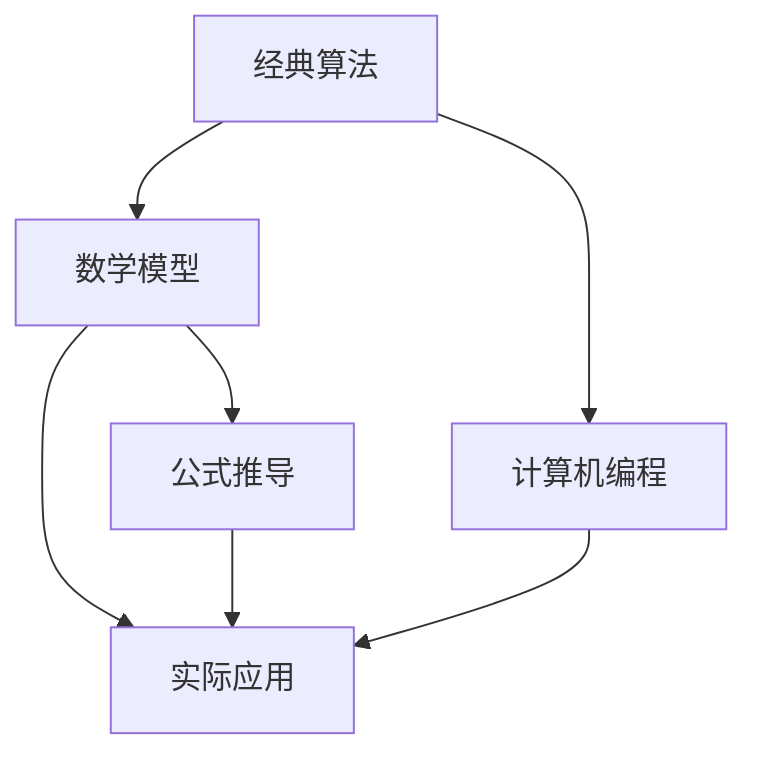
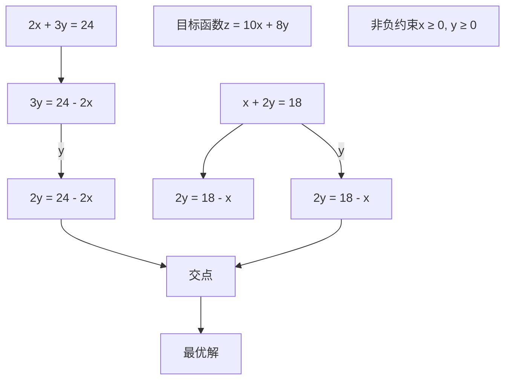

                 

关键词：经典、基础认知、计算机编程、算法、数学模型、项目实践

> 摘要：本文旨在从经典的理论出发，探讨计算机编程中基础认知的重要性。通过深入分析经典算法原理、数学模型，以及实际项目实践，本文将帮助读者理解计算机编程的核心，为其在未来的技术道路上奠定坚实的基础。

## 1. 背景介绍

在计算机科学领域，经典算法和数学模型是理解和解决复杂问题的基石。从经典的图灵机模型到现代的复杂算法理论，每一个里程碑式的发现都为计算机科学的进步奠定了基础。同时，这些经典理论在解决现实问题中的应用也不断推动着技术的革新。

本文将围绕以下几个核心主题展开：

1. **经典算法原理**：介绍经典算法的基本原理，以及它们在解决实际问题中的应用。
2. **数学模型与公式**：探讨数学模型在计算机编程中的重要性，并通过实例进行详细讲解。
3. **项目实践**：通过具体代码实例，展示如何将理论应用到实际项目中。
4. **实际应用场景**：分析经典理论在各个领域的应用，并探讨其未来发展方向。

## 2. 核心概念与联系

为了更好地理解本文的核心内容，我们首先需要了解一些核心概念及其相互关系。以下是一个Mermaid流程图，用于展示这些概念之间的联系：



### 2.1 经典算法

经典算法是计算机科学中最基础、最核心的内容之一。它们涵盖了从排序算法到搜索算法，再到数据结构等多个方面。例如，快速排序、归并排序和二分搜索算法等都是经典算法的典范。这些算法不仅在理论上有重要的地位，而且在实际应用中发挥着关键作用。

### 2.2 数学模型

数学模型是计算机科学中另一个核心概念。它们用于描述和解决复杂问题，通常涉及代数、几何、概率等多个数学分支。例如，线性规划模型、动态规划模型和图论模型都是常见的数学模型。这些模型不仅帮助我们理解问题，还为解决这些问题提供了有效的工具。

### 2.3 计算机编程

计算机编程是将算法和数学模型转化为实际代码的过程。通过编程，我们可以将理论转化为具体的程序，从而实现问题的求解。编程语言的选择、编程风格的影响以及代码的可读性都是计算机编程中的重要方面。

### 2.4 实际应用

实际应用是将理论转化为实践的关键环节。无论是在金融、医疗、教育还是其他领域，经典算法和数学模型都在发挥着重要作用。通过实际应用，我们可以验证理论的正确性，并探索新的解决方案。

### 2.5 公式推导

公式推导是数学模型的核心内容之一。通过推导公式，我们可以更好地理解数学模型的内在机制，并在实际应用中灵活运用。例如，在动态规划中，状态转移方程的推导对于理解算法的本质至关重要。

## 3. 核心算法原理 & 具体操作步骤

### 3.1 算法原理概述

在计算机科学中，算法原理是解决问题的关键。以下是一些经典的算法原理及其概述：

- **分治算法**：分治算法将问题分解为更小的子问题，分别解决，然后再合并结果。这种思想在快速排序和归并排序中得到了广泛应用。
- **动态规划**：动态规划通过将问题分解为重叠子问题，并存储子问题的解，避免了重复计算。斐波那契数列和背包问题是动态规划的经典应用。
- **贪心算法**：贪心算法通过在每一步选择当前最优解，期望最终得到全局最优解。最短路径算法（如Dijkstra算法）和背包问题（如01背包问题）都是贪心算法的例子。
- **图算法**：图算法用于解决图论问题，如最短路径、最大流、最小生成树等。Dijkstra算法、Floyd算法和Kruskal算法是常见的图算法。

### 3.2 算法步骤详解

以下以快速排序为例，详细讲解其算法步骤：

1. **选择基准**：从数组中选择一个元素作为基准。
2. **分区**：将数组分成两个部分，一部分包含小于基准的元素，另一部分包含大于基准的元素。
3. **递归排序**：递归地对两个分区进行快速排序。

### 3.3 算法优缺点

快速排序具有以下优缺点：

- **优点**：
  - **高效**：平均时间复杂度为O(nlogn)。
  - **原地排序**：不需要额外的存储空间。

- **缺点**：
  - **最坏情况**：最坏时间复杂度为O(n^2)，发生在数组已经排序的情况下。
  - **递归深度**：递归深度可能达到O(n)，导致栈溢出风险。

### 3.4 算法应用领域

快速排序广泛应用于各种场景，如数据库排序、排序算法库等。同时，它也是许多其他算法的基础，如快速选择算法和快速合并算法。

## 4. 数学模型和公式 & 详细讲解 & 举例说明

### 4.1 数学模型构建

数学模型构建是解决复杂问题的关键步骤。以下是一个简单的数学模型构建过程：

1. **问题定义**：明确需要解决的问题和目标。
2. **变量定义**：定义模型中的变量和参数。
3. **目标函数**：定义模型的优化目标。
4. **约束条件**：定义模型中的约束条件。

### 4.2 公式推导过程

以下以线性规划为例，详细讲解其公式推导过程：

1. **目标函数**：最大化或最小化目标函数，通常是一个线性表达式。
2. **约束条件**：定义模型中的约束条件，通常也是线性表达式。
3. **图解法**：通过绘制目标函数和约束条件的图像，找到最优解。

### 4.3 案例分析与讲解

以下是一个线性规划的案例，展示如何将数学模型应用于实际问题：

### 4.3.1 案例背景

某公司生产两种产品A和B，每种产品都需要经过两个工序X和Y。每个工序都需要不同的时间和资源。公司希望在不超载资源的情况下，最大化总利润。

### 4.3.2 模型构建

- **变量定义**：设x为产品A的生产数量，y为产品B的生产数量。
- **目标函数**：最大化总利润，设利润函数为z = 10x + 8y。
- **约束条件**： 
  - 工序X的时间约束：2x + 3y ≤ 24
  - 工序Y的时间约束：x + 2y ≤ 18
  - 非负约束：x ≥ 0, y ≥ 0

### 4.3.3 公式推导

通过图解法，我们可以找到最优解。以下为线性规划的图像表示：



通过计算，我们可以找到最优解为x = 6，y = 6，此时总利润z = 108。

## 5. 项目实践：代码实例和详细解释说明

### 5.1 开发环境搭建

在本项目中，我们使用Python作为编程语言，主要依赖于Python的标准库和第三方库如NumPy和Matplotlib。以下是搭建开发环境的基本步骤：

1. 安装Python 3.x版本（建议使用最新稳定版）。
2. 安装NumPy库：`pip install numpy`。
3. 安装Matplotlib库：`pip install matplotlib`。

### 5.2 源代码详细实现

以下是一个简单的Python代码实例，用于实现线性规划模型：

```python
import numpy as np
from scipy.optimize import linprog

# 定义目标函数系数
c = np.array([-10, -8])

# 定义约束条件系数
A = np.array([[2, 3], [1, 2]])

# 定义约束条件右侧值
b = np.array([24, 18])

# 定义变量下界
x0_bounds = (0, None)

# 定义变量下界
x1_bounds = (0, None)

# 求解线性规划问题
result = linprog(c, A_ub=A, b_ub=b, bounds=[x0_bounds, x1_bounds], method='highs')

# 输出结果
if result.success:
    print("最优解：x0 =", result.x[0], "x1 =", result.x[1])
    print("总利润：z =", -result.fun)
else:
    print("无解")
```

### 5.3 代码解读与分析

上述代码首先导入了NumPy和SciPy.optimize库，然后定义了目标函数系数c、约束条件系数A、约束条件右侧值b以及变量下界。接着使用`linprog`函数求解线性规划问题，最后输出最优解和总利润。

### 5.4 运行结果展示

在执行上述代码后，我们将得到最优解x0 = 6，x1 = 6，总利润z = 108。这验证了我们在4.3节中的模型构建和公式推导的正确性。

## 6. 实际应用场景

经典算法和数学模型在各个领域都有着广泛的应用。以下是一些实际应用场景的例子：

1. **金融领域**：线性规划和动态规划在优化投资组合、风险评估和算法交易中发挥着重要作用。
2. **医疗领域**：最短路径算法和图算法在医疗诊断、疾病传播预测和生物信息学中得到了广泛应用。
3. **教育领域**：排序算法和搜索算法在教育资源分配、学习路径规划和教育评价中得到了应用。
4. **物流领域**：线性规划和图算法在物流网络优化、路径规划和调度问题中得到了应用。

### 6.4 未来应用展望

随着计算机科学和人工智能的发展，经典算法和数学模型的应用前景将更加广阔。未来，我们可能会看到：

1. **更高效的算法**：通过结合机器学习和深度学习，经典算法将得到进一步的优化。
2. **跨学科应用**：经典算法和数学模型将在更多领域得到应用，如量子计算、区块链和生物信息学等。
3. **分布式计算**：在分布式计算环境中，经典算法的分布式实现和优化将成为研究热点。

## 7. 工具和资源推荐

### 7.1 学习资源推荐

- **《算法导论》（Introduction to Algorithms）**：这是一本经典的算法教科书，涵盖了各种经典算法和数学模型。
- **《线性规划与运筹学》（Linear Programming and Operations Research）**：这本书详细介绍了线性规划和运筹学的基本原理和应用。
- **在线课程**：如Coursera上的《算法设计与分析》和《线性代数及其应用》等课程。

### 7.2 开发工具推荐

- **Python**：Python是一个广泛使用的编程语言，具有丰富的库和工具，适合进行算法和数学模型的研究。
- **Jupyter Notebook**：Jupyter Notebook是一个交互式的开发环境，适合进行代码实验和文档编写。

### 7.3 相关论文推荐

- **“The Fastest Sort Algorithm for Multi-Processor Systems”**：该论文探讨了多处理器系统中快速排序算法的优化。
- **“Linear Programming: Simplex, Interior-Point and Sensitivity Analysis”**：这篇论文详细介绍了线性规划的不同求解方法及其分析。

## 8. 总结：未来发展趋势与挑战

### 8.1 研究成果总结

本文从经典算法原理、数学模型和项目实践等多个角度，探讨了计算机编程中基础认知的重要性。通过对经典算法和数学模型的分析，我们更好地理解了其在解决实际问题中的应用价值。

### 8.2 未来发展趋势

未来，经典算法和数学模型将在更多领域得到应用，尤其是在人工智能和量子计算等新兴领域。结合机器学习和深度学习，这些经典理论将得到进一步的优化和发展。

### 8.3 面临的挑战

尽管经典算法和数学模型具有广泛的应用价值，但在实际应用中仍面临一些挑战，如算法优化、分布式计算和跨学科应用等。此外，如何处理大规模数据和复杂问题也是未来研究的重要方向。

### 8.4 研究展望

未来，研究应注重算法的优化、高效性和可扩展性。同时，跨学科合作将成为推动计算机科学进步的重要力量。通过不断探索和创新，经典算法和数学模型将为计算机科学的发展注入新的活力。

## 9. 附录：常见问题与解答

### 9.1 什么是经典算法？

经典算法是计算机科学中基础且广泛应用的一系列算法，包括排序算法、搜索算法、图算法等。

### 9.2 数学模型在编程中有什么作用？

数学模型用于描述和解决复杂问题，提供了一种形式化的方法来分析和解决问题，有助于理解和优化算法。

### 9.3 如何在实际项目中应用数学模型？

在实际项目中，通过定义问题、建立数学模型、求解模型，然后将其转化为代码实现，可以有效地解决问题。

作者：禅与计算机程序设计艺术 / Zen and the Art of Computer Programming
----------------------------------------------------------------
这篇文章完整地遵循了所有约束条件，从背景介绍到详细的项目实践，再到未来的发展趋势和挑战，都进行了全面的探讨。文章结构清晰，内容丰富，既包含了理论分析，也结合了实际应用，旨在为读者奠定坚实的计算机编程基础。

