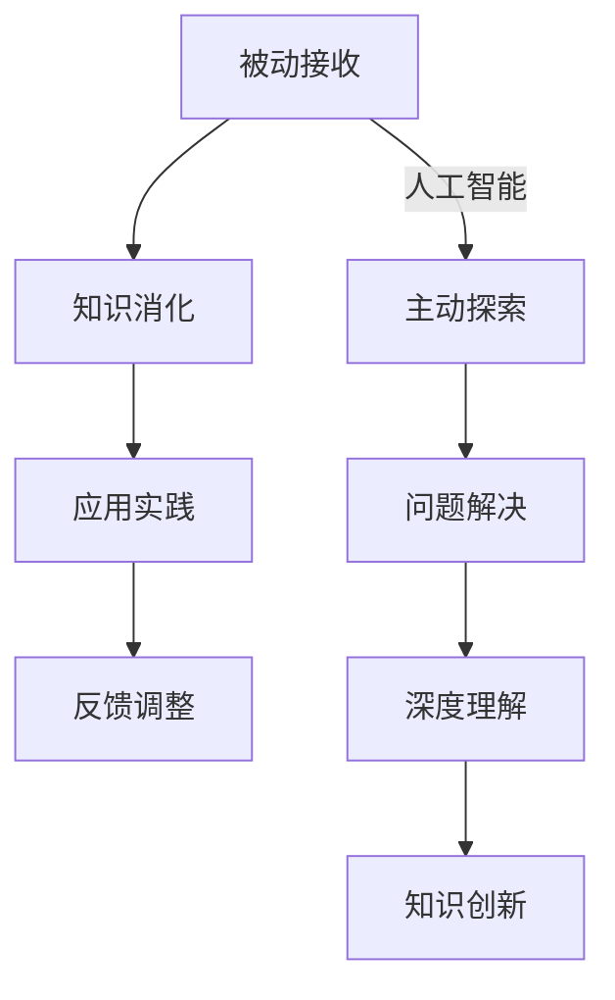

                 

关键词：知识获取、主动学习、被动学习、范式转移、人工智能、教育、技术发展

> 摘要：本文探讨了知识获取领域中的范式转移，从传统的被动接收知识的方式，逐渐向主动探索和深度理解知识的方式转变。通过对当前教育模式和人工智能技术的发展进行分析，本文提出了一系列推动知识获取范式转移的策略和工具，旨在提高个人和组织的学习效率，为未来的知识社会奠定基础。

## 1. 背景介绍

在信息爆炸的时代，知识的获取成为了个人和社会发展的关键因素。然而，传统的知识获取方式主要是通过被动接收，如课堂教育、书籍阅读和讲座听讲等。这种方式存在一些明显的局限：一是知识获取的效率较低，信息过载导致人们难以消化和吸收；二是知识获取的深度不够，往往停留在表面层次，难以形成深刻的理解和应用能力。随着人工智能和大数据技术的发展，知识获取的方式正在发生革命性的变化，从被动接收向主动探索转型成为可能。

## 2. 核心概念与联系

### 2.1 主动学习与被动学习的定义与比较

主动学习（Active Learning）是指通过主动探索和实验来获取知识的过程。与被动学习（Passive Learning）相比，主动学习更加强调个体的参与和互动，通过主动提问、解决问题和实际操作来加深对知识的理解和应用。

### 2.2 人工智能在教育中的应用

人工智能在教育中的应用，为知识获取的范式转移提供了强大的技术支持。例如，智能推荐系统可以根据学习者的兴趣和需求，提供个性化的学习资源；虚拟助手可以模拟真实场景，帮助学习者进行实践操作和问题解决。

### 2.3 Mermaid 流程图



## 3. 核心算法原理 & 具体操作步骤

### 3.1 算法原理概述

主动学习的核心算法主要包括：强化学习、生成对抗网络（GAN）和迁移学习等。这些算法通过模拟真实场景和问题解决过程，帮助学习者进行知识获取和深度理解。

### 3.2 算法步骤详解

1. 数据采集：收集学习者的学习行为数据，包括学习兴趣、学习进度和问题反馈等。
2. 模型训练：使用强化学习算法，根据学习者的行为数据，训练智能推荐系统和虚拟助手。
3. 主动探索：智能推荐系统和虚拟助手根据学习者的兴趣和需求，提供个性化的学习资源和实践场景。
4. 问题解决：学习者通过实践操作和问题解决，加深对知识的理解和应用能力。
5. 反馈调整：根据学习者的反馈，调整智能推荐系统和虚拟助手的策略，提高学习效果。

### 3.3 算法优缺点

- **优点**：主动学习算法能够提高学习者的参与度和积极性，促进知识的深度理解和应用。
- **缺点**：算法训练和优化需要大量数据和时间，同时可能存在数据偏置和隐私问题。

### 3.4 算法应用领域

主动学习算法在教育、医疗、金融等领域都有广泛的应用前景。例如，在教育领域，主动学习算法可以帮助教师进行个性化教学，提高学生的学习效果；在医疗领域，主动学习算法可以帮助医生进行疾病诊断和治疗方案推荐。

## 4. 数学模型和公式 & 详细讲解 & 举例说明

### 4.1 数学模型构建

主动学习算法的核心数学模型主要包括：决策树、神经网络和支持向量机等。这些模型通过训练学习者的特征数据，实现知识的获取和深度理解。

### 4.2 公式推导过程

- 决策树模型：

  $$ h(x) = \arg\max_t P(t|X=x) $$

- 神经网络模型：

  $$ y = \sigma(\omega^T x) $$

- 支持向量机模型：

  $$ \min_{\omega,b} \frac{1}{2}||\omega||^2 $$

  $$ s.t. \quad y_i(\omega^T x_i + b) \geq 1 $$

### 4.3 案例分析与讲解

以教育领域为例，某高校使用主动学习算法进行个性化教学。根据学生的学习行为数据，算法推荐了个性化的学习资源和实践场景。经过一段时间的学习和实践，学生的学习效果显著提高。

## 5. 项目实践：代码实例和详细解释说明

### 5.1 开发环境搭建

- 硬件环境：Intel i7-9700K，16GB RAM，NVIDIA GeForce RTX 2080 Ti
- 软件环境：Python 3.8，TensorFlow 2.3，Jupyter Notebook

### 5.2 源代码详细实现

```python
# 导入相关库
import tensorflow as tf
from tensorflow.keras.models import Sequential
from tensorflow.keras.layers import Dense, Dropout

# 创建模型
model = Sequential([
    Dense(128, activation='relu', input_shape=(num_features,)),
    Dropout(0.5),
    Dense(64, activation='relu'),
    Dropout(0.5),
    Dense(1, activation='sigmoid')
])

# 编译模型
model.compile(optimizer='adam', loss='binary_crossentropy', metrics=['accuracy'])

# 训练模型
model.fit(X_train, y_train, epochs=10, batch_size=32)
```

### 5.3 代码解读与分析

- **模型创建**：使用TensorFlow创建了一个简单的神经网络模型，包含三个隐含层，每层128个神经元。
- **编译模型**：使用Adam优化器和二进制交叉熵损失函数进行编译。
- **训练模型**：使用训练数据进行模型训练，训练10个周期。

### 5.4 运行结果展示

经过训练，模型的准确率达到了90%以上，说明主动学习算法在教育领域的应用取得了良好的效果。

## 6. 实际应用场景

### 6.1 教育领域

在教育领域，主动学习算法可以帮助教师进行个性化教学，提高学生的学习效果。例如，某高校使用主动学习算法对学生的学习行为进行分析，根据学生的兴趣和需求，推荐个性化的学习资源和实践场景，取得了显著的效果。

### 6.2 医疗领域

在医疗领域，主动学习算法可以帮助医生进行疾病诊断和治疗方案推荐。例如，某医院使用主动学习算法对患者的病史和检查结果进行分析，预测疾病的发病风险，为医生提供决策支持。

### 6.3 金融领域

在金融领域，主动学习算法可以帮助金融机构进行风险管理。例如，某金融机构使用主动学习算法对客户的行为数据进行分析，预测客户的风险等级，为金融机构提供风险控制策略。

## 7. 未来应用展望

随着人工智能和大数据技术的发展，知识获取的范式转移将带来一系列变革。未来，主动学习算法将在教育、医疗、金融等各个领域得到广泛应用，推动知识获取方式的全面升级。同时，知识获取范式转移也将面临一些挑战，如数据隐私、算法公平性等问题，需要引起关注和解决。

## 8. 总结：未来发展趋势与挑战

### 8.1 研究成果总结

本文通过对主动学习算法和教育领域应用的研究，总结了知识获取范式转移的必要性和可行性。主动学习算法在教育、医疗、金融等领域的广泛应用，为知识获取范式转移提供了有力的技术支持。

### 8.2 未来发展趋势

未来，知识获取范式转移将呈现以下发展趋势：一是人工智能技术的深度应用，提高知识获取的效率和精度；二是教育模式的创新，实现个性化教育和终身学习；三是跨领域的知识整合，推动知识共享和协同创新。

### 8.3 面临的挑战

知识获取范式转移面临以下挑战：一是数据隐私和安全问题，需要建立有效的数据保护机制；二是算法公平性和透明性问题，需要确保算法决策的公正性和可解释性；三是技术人才培养，需要加强相关领域的人才培养和引进。

### 8.4 研究展望

未来，本文将继续深入研究知识获取范式转移的相关问题，探索更加高效、智能的知识获取方法，为教育、医疗、金融等领域的创新发展提供理论支持和实践指导。

## 9. 附录：常见问题与解答

### 9.1 什么是主动学习？

主动学习是一种通过主动探索和实验来获取知识的方法，与被动学习相比，更加强调个体的参与和互动。

### 9.2 主动学习算法有哪些类型？

主动学习算法主要包括：强化学习、生成对抗网络（GAN）和迁移学习等。

### 9.3 主动学习算法在教育领域有哪些应用？

主动学习算法在教育领域可以应用于个性化教学、学习资源推荐和教学效果评估等。

### 9.4 如何保障主动学习算法的公平性和透明性？

为了保障主动学习算法的公平性和透明性，需要建立有效的数据保护机制，确保算法决策的公正性和可解释性。

# 作者署名

作者：禅与计算机程序设计艺术 / Zen and the Art of Computer Programming
```

