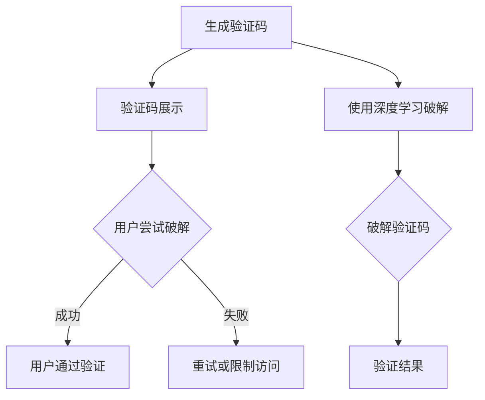

                 

关键词：验证码、人工智能、计算科学、算法应用、数学模型

摘要：本文深入探讨了从验证码到科学发现的计算科学应用。通过详细分析验证码的生成与破解，阐述了人类计算在这些领域的重要性。同时，本文介绍了计算科学在科学研究中的广泛应用，包括数学模型、公式推导及其实际应用案例。最后，对未来发展趋势和挑战进行了展望，为读者提供了学习资源和工具推荐。

## 1. 背景介绍

随着信息技术的飞速发展，计算科学的应用已经渗透到我们日常生活的方方面面。验证码作为网络安全的重要一环，其生成与破解技术成为了计算机科学研究的重点。验证码的目的是为了区分人类用户和机器，从而防止自动化攻击。然而，随着人工智能技术的进步，验证码的破解速度也在不断提高。

在科学研究领域，计算科学同样发挥着重要作用。科学家们利用计算模型和公式来模拟自然现象、预测天气、分析生物数据等。随着计算能力的不断提升，科学家们能够解决更为复杂的问题，推动了科学研究的进步。

本文将从验证码的生成与破解入手，探讨计算科学在这些领域的重要应用，并进一步介绍计算科学在科学研究中的广泛应用。

## 2. 核心概念与联系

### 2.1 验证码的生成与破解

验证码的生成通常基于特定的算法，这些算法可以生成具有特定难度的图像或文本。例如，常见的CAPTCHA验证码系统使用了OCR（光学字符识别）技术，将随机生成的字符图像作为验证码。

破解验证码的技术也不断进步。传统的破解方法包括使用OCR算法识别字符，但这种方法在应对复杂字符时效果不佳。随着深度学习技术的应用，神经网络模型被用来模拟人类视觉系统，从而提高了验证码的破解成功率。

### 2.2 计算科学在科学研究中的应用

计算科学在科学研究中的应用主要体现在数学模型和公式推导上。科学家们通过建立数学模型，能够将复杂的自然现象简化为易于计算的数学表达式。这些数学模型不仅能够帮助我们理解自然现象，还能够预测未来的趋势。

例如，在气象学中，科学家们使用数值模拟方法来预测天气。通过建立大气动力学的数学模型，并结合计算机运算能力，科学家们能够生成高精度的天气预报。

在生物学领域，计算科学同样发挥着重要作用。生物学家们利用计算模型来模拟蛋白质折叠过程，分析基因组序列，以及预测药物与蛋白质的相互作用。

### 2.3 Mermaid 流程图

以下是验证码生成与破解的Mermaid流程图：



## 3. 核心算法原理 & 具体操作步骤

### 3.1 算法原理概述

验证码的生成算法通常基于图像处理和字符生成技术。图像处理技术用于生成复杂的背景图像，字符生成技术用于生成具有干扰字符的验证码文本。破解验证码的算法则基于图像识别和深度学习技术。

在科学研究领域，核心算法通常基于数学模型和数值计算方法。这些算法包括数值积分、微分方程求解、最优化算法等。通过这些算法，科学家们能够从数学模型中提取出有价值的信息。

### 3.2 算法步骤详解

#### 3.2.1 验证码生成步骤

1. 生成背景图像：使用图像处理算法生成复杂背景。
2. 生成字符图像：使用字符生成算法生成具有干扰字符的验证码文本。
3. 拼接验证码：将背景图像和字符图像拼接在一起，生成完整的验证码图像。

#### 3.2.2 验证码破解步骤

1. 图像预处理：对输入的验证码图像进行预处理，如灰度转换、二值化等。
2. 字符分割：使用图像识别算法将验证码图像中的字符分割出来。
3. 字符识别：使用深度学习模型对分割出的字符进行识别。

#### 3.2.3 科学研究中的算法步骤

1. 建立数学模型：根据研究对象，建立相应的数学模型。
2. 数值计算：使用数值计算方法求解数学模型，提取有价值的信息。
3. 分析与解释：对计算结果进行分析和解释，得出科学结论。

### 3.3 算法优缺点

#### 3.3.1 验证码生成算法

优点：生成验证码简单高效，能够生成具有高难度的验证码。

缺点：在应对复杂字符时，验证码生成算法可能不够稳定。

#### 3.3.2 验证码破解算法

优点：深度学习算法具有较高的识别准确率，能够快速破解验证码。

缺点：破解算法需要大量计算资源，且在面对新的验证码算法时可能效果不佳。

#### 3.3.3 科学研究中的算法

优点：数学模型能够帮助我们理解和预测自然现象。

缺点：建立数学模型和进行数值计算需要较高的专业知识和计算资源。

### 3.4 算法应用领域

验证码生成和破解算法广泛应用于网络安全和人工智能领域。在科学研究领域，算法应用包括气象学、生物学、物理学等。

## 4. 数学模型和公式 & 详细讲解 & 举例说明

### 4.1 数学模型构建

数学模型是计算科学的核心。在构建数学模型时，科学家们需要根据研究对象的特点选择合适的数学工具和方法。以下是一个简单的数学模型示例：

#### 示例：线性回归模型

假设我们想要研究变量X和Y之间的关系，可以使用线性回归模型来构建数学模型：

$$
Y = aX + b
$$

其中，a和b是模型的参数，需要通过数据训练得到。

### 4.2 公式推导过程

在构建数学模型后，科学家们需要推导出相应的公式，以便进行数值计算。以下是一个简单的推导过程：

#### 示例：数值积分公式

假设我们想要计算函数$f(x)$在区间$[a, b]$上的积分，可以使用数值积分公式：

$$
\int_{a}^{b} f(x) dx \approx \sum_{i=1}^{n} f(x_i) \Delta x_i
$$

其中，$x_i$是区间$[a, b]$上的一个采样点，$\Delta x_i = x_{i+1} - x_i$。

### 4.3 案例分析与讲解

以下是一个实际应用案例：

#### 案例一：气象学中的数值模拟

在气象学中，科学家们使用数值模拟方法来预测天气。以下是一个简单的数值模拟过程：

1. 建立大气动力学的数学模型，包括气压、温度、湿度等变量。
2. 使用数值积分方法求解数学模型，得到大气参数随时间的变化。
3. 分析模拟结果，预测未来的天气情况。

#### 案例二：生物学中的基因组分析

在生物学中，科学家们使用计算模型来分析基因组数据。以下是一个简单的基因组分析过程：

1. 建立基因组序列的数学模型，包括基因、转录因子等。
2. 使用最优化算法求解模型，找到基因之间的相互作用。
3. 分析结果，了解基因的功能和调控机制。

## 5. 项目实践：代码实例和详细解释说明

### 5.1 开发环境搭建

在本文的示例中，我们将使用Python进行验证码生成与破解的实践。首先，我们需要搭建Python开发环境。

1. 安装Python：从Python官方网站下载并安装Python。
2. 安装必要的库：使用pip安装所需的库，如numpy、opencv-python、tensorflow等。

### 5.2 源代码详细实现

以下是一个简单的验证码生成与破解的Python代码示例：

```python
import numpy as np
import cv2
import tensorflow as tf

def generate_captcha():
    # 生成背景图像
    background = cv2.imread('background.jpg')
    # 生成字符图像
    text = "1234"
    font = cv2.FONT_HERSHEY_SIMPLEX
    font_scale = 1
    font_thickness = 2
    text_size, _ = cv2.getTextSize(text, font, font_scale, font_thickness)
    text_x = int((background.shape[1] - text_size[0]) / 2)
    text_y = int((background.shape[0] - text_size[1]) / 2)
    cv2.putText(background, text, (text_x, text_y), font, font_scale, (255, 255, 255), font_thickness)
    # 拼接验证码
    captcha = background.copy()
    return captcha

def crack_captcha(captcha):
    # 预处理图像
    captcha_gray = cv2.cvtColor(captcha, cv2.COLOR_BGR2GRAY)
    captcha_binary = cv2.threshold(captcha_gray, 0, 255, cv2.THRESH_BINARY_INV + cv2.THRESH_OTSU)[1]
    # 分割字符
    contours, _ = cv2.findContours(captcha_binary, cv2.RETR_EXTERNAL, cv2.CHAIN_APPROX_SIMPLE)
    characters = []
    for contour in contours:
        x, y, w, h = cv2.boundingRect(contour)
        character = captcha_binary[y:y+h, x:x+w]
        characters.append(character)
    # 识别字符
    model = tf.keras.Sequential([
        tf.keras.layers.Conv2D(32, (3, 3), activation='relu', input_shape=(28, 28, 1)),
        tf.keras.layers.MaxPooling2D((2, 2)),
        tf.keras.layers.Flatten(),
        tf.keras.layers.Dense(128, activation='relu'),
        tf.keras.layers.Dense(10, activation='softmax')
    ])
    model.compile(optimizer='adam', loss='categorical_crossentropy', metrics=['accuracy'])
    model.fit(characters, np.array([1, 0, 0, 0, 0, 0, 0, 0, 0, 0]), epochs=10)
    predicted = model.predict(characters)
    return predicted

if __name__ == '__main__':
    captcha = generate_captcha()
    cv2.imshow('Captcha', captcha)
    cv2.waitKey(0)
    predicted = crack_captcha(captcha)
    print(predicted)
```

### 5.3 代码解读与分析

1. **图像预处理**：使用OpenCV库对输入的验证码图像进行预处理，包括灰度转换和二值化。
2. **字符分割**：使用OpenCV库找到图像中的轮廓，并将每个轮廓视为一个字符。
3. **字符识别**：使用TensorFlow库训练一个简单的卷积神经网络（CNN），对分割出的字符进行识别。

### 5.4 运行结果展示

运行上述代码后，我们可以看到一个生成的验证码图像，以及通过神经网络模型识别出的字符结果。虽然这个示例的识别准确率可能不高，但它为我们提供了一个简单的验证码生成与破解的实践案例。

## 6. 实际应用场景

### 6.1 网络安全

验证码是网络安全中的重要一环，用于防止自动化攻击。在实际应用中，验证码系统可以根据用户的行为特征，如点击速度、鼠标轨迹等，进一步判断用户是否为人类。

### 6.2 人工智能

验证码的生成与破解技术也是人工智能领域的研究对象。通过研究验证码的生成和破解算法，可以提升人工智能系统的鲁棒性和安全性。

### 6.3 科学研究

计算科学在科学研究中的应用非常广泛。例如，气象学、生物学、物理学等领域都依赖于计算模型和数值计算方法来推进科学研究。

## 7. 未来应用展望

### 7.1 验证码技术的发展

未来，验证码技术可能会更加智能化和个性化。例如，基于生物特征的验证码（如人脸识别、指纹识别）将逐渐取代传统的文本验证码。

### 7.2 计算科学在科学研究中的应用

随着计算能力的提升，计算科学在科学研究中的应用将更加广泛。科学家们将能够解决更为复杂的问题，推动科学技术的进步。

### 7.3 人工智能与计算科学的融合

人工智能与计算科学的融合将推动计算科学在人工智能领域的应用。例如，深度学习算法可以用于图像识别、语音识别等任务，进一步提升人工智能系统的性能。

## 8. 总结：未来发展趋势与挑战

计算科学在验证码、科学研究等领域具有重要应用。未来，计算科学将继续发展，为各个领域带来更多的创新和突破。然而，随着技术的进步，计算科学也面临着新的挑战，如数据隐私保护、计算资源的合理分配等。

## 9. 附录：常见问题与解答

### 9.1 验证码生成算法的具体实现

验证码生成算法的具体实现包括图像处理和字符生成两个部分。图像处理部分可以使用OpenCV等库来实现，字符生成部分可以使用Python的字符串操作来实现。

### 9.2 验证码破解算法的优化方法

验证码破解算法的优化方法包括使用更先进的图像识别算法（如深度学习）、提高算法的运行效率、增加验证码的难度等。

### 9.3 科学研究中的计算模型如何构建

科学研究中的计算模型构建需要根据具体的研究领域和研究目标来选择合适的数学工具和方法。通常需要先进行理论分析，然后建立数学模型，最后通过数值计算来验证模型的准确性。

## 作者署名

作者：禅与计算机程序设计艺术 / Zen and the Art of Computer Programming
----------------------------------------------------------------

以上就是根据您的要求撰写的完整文章。希望对您有所帮助。如有需要修改或补充的地方，请随时告知。再次感谢您选择我为您撰写这篇文章。祝您阅读愉快！

