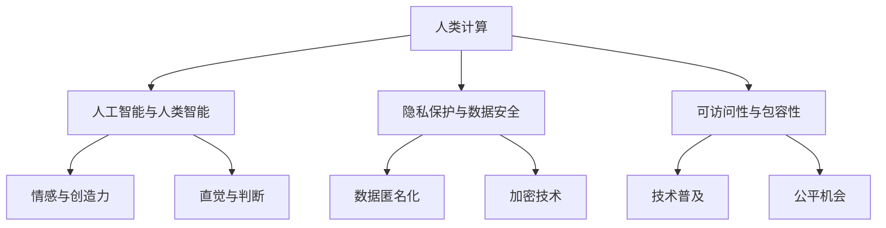

                 

在未来，技术将不仅仅是一个工具，而是生活的核心组成部分。在这个新时代，"以人为本"将成为我们计算的核心价值观。本文将探讨如何在技术发展中保持这一价值观，同时为人类创造一个更智能、更高效、更公平的未来。

## 文章关键词
- 人类计算
- 科技未来
- 价值观
- 以人为本
- 技术发展

## 文摘
本文旨在阐述在科技飞速发展的今天，如何保持"以人为本"的价值观，使技术真正服务于人类，创造一个更加美好的未来。我们将探讨这一理念在人工智能、隐私保护、教育、医疗等领域的应用，并提出面临的挑战和未来展望。

## 1. 背景介绍

### 1.1 科技革命的浪潮

近年来，科技革命席卷全球，人工智能、大数据、云计算等技术的迅猛发展，正在深刻改变我们的生活方式和社会结构。这些技术不仅提高了生产效率，还带来了前所未有的便利和可能性。然而，这一过程也伴随着一系列挑战和问题。

### 1.2 以人为本的呼吁

在技术不断进步的同时，越来越多的人开始关注技术的负面影响，如隐私泄露、算法偏见、数字鸿沟等。因此，"以人为本"的呼声愈发强烈。这意味着我们需要重新审视技术的目标和方向，确保科技的发展真正服务于人类，而不是反过来。

### 1.3 人类计算的概念

"人类计算"是一种将人类智慧、情感和直觉融入计算过程的方法。它强调技术的使用应该以人为本，关注人类的体验和福祉。这一理念要求我们在设计、开发和部署技术时，始终将人类的需求和价值观放在首位。

## 2. 核心概念与联系

在探讨人类计算的核心概念之前，我们首先需要了解几个关键术语和概念：

### 2.1 人工智能与人类智能

人工智能（AI）是模仿人类智能的技术。然而，与人类智能相比，AI在情感、创造力、直觉等方面存在显著差距。人类计算的目标之一是弥合这一差距，使AI更加人性化。

### 2.2 隐私保护与数据安全

隐私保护是现代社会的一个重要议题。人类计算要求我们在使用数据时，始终遵循隐私保护原则，确保用户的数据安全。

### 2.3 可访问性与包容性

可访问性和包容性是确保每个人都能从技术进步中受益的关键。人类计算强调技术的普及性和公平性，确保技术不被少数人垄断。

### 2.4 Mermaid 流程图

以下是一个描述人类计算核心概念的 Mermaid 流程图：



## 3. 核心算法原理 & 具体操作步骤

### 3.1 算法原理概述

人类计算的核心在于如何将人类的智慧、情感和直觉融入计算过程。这通常涉及到以下步骤：

1. **需求分析**：理解人类的需求和期望，确定技术解决方案的目标。
2. **设计模型**：构建一个能够模拟人类思维过程的计算模型。
3. **算法实现**：实现计算模型，使其能够在特定场景下发挥作用。
4. **测试与优化**：通过实验和用户反馈，不断优化算法性能。

### 3.2 算法步骤详解

1. **需求分析**：在这一步骤中，我们需要与用户进行深入沟通，了解他们的需求和期望。这可以通过问卷调查、访谈或用户场景分析来完成。
2. **设计模型**：基于需求分析的结果，设计一个计算模型。这个模型应该能够模拟人类的思维过程，包括情感、创造力和直觉等方面。
3. **算法实现**：将设计好的模型转化为具体的算法。这一步骤通常涉及到编程和软件开发，需要确保算法的可扩展性和可靠性。
4. **测试与优化**：在实现算法后，我们需要通过实验和用户反馈来测试其性能。根据测试结果，对算法进行优化和调整，确保其能够满足用户需求。

### 3.3 算法优缺点

**优点**：

- **人性化**：通过将人类智慧、情感和直觉融入计算过程，使技术更加人性化。
- **灵活性**：人类计算模型能够适应不同的场景和需求，具有很高的灵活性。
- **创新性**：人类计算鼓励创新思维，有助于开发出更具创意和前瞻性的技术解决方案。

**缺点**：

- **复杂性**：人类计算模型通常比传统计算模型更复杂，需要更多的资源和时间来开发和实现。
- **主观性**：由于人类计算涉及到情感和直觉，因此结果可能受到主观因素的影响。

### 3.4 算法应用领域

人类计算可以在许多领域发挥作用，包括：

- **人工智能**：通过将人类智慧融入 AI 系统，提高 AI 的决策能力和创造力。
- **医疗健康**：在医疗诊断和治疗中，利用人类计算模型进行个性化医疗和健康监测。
- **教育**：在教育领域，人类计算可以帮助设计更有效的教学方法和学习工具。
- **金融**：在金融领域，人类计算可以帮助进行风险管理、投资分析和客户服务。

## 4. 数学模型和公式 & 详细讲解 & 举例说明

### 4.1 数学模型构建

人类计算的数学模型通常基于概率论、统计学和机器学习。以下是一个简单的线性回归模型示例：

$$ y = wx + b $$

其中，\( y \) 是输出值，\( x \) 是输入值，\( w \) 是权重，\( b \) 是偏置。通过训练数据集，我们可以计算出最优的 \( w \) 和 \( b \) 值，从而实现预测。

### 4.2 公式推导过程

线性回归模型的推导过程基于最小二乘法。具体步骤如下：

1. **假设模型**：假设模型为 \( y = wx + b \)。
2. **损失函数**：定义损失函数为 \( L(w, b) = \frac{1}{2} \sum_{i=1}^{n} (y_i - wx_i - b)^2 \)。
3. **求导**：对损失函数关于 \( w \) 和 \( b \) 求导，并令导数为零，得到以下方程组：

$$ \frac{\partial L}{\partial w} = x^T(y - wx - b) = 0 $$

$$ \frac{\partial L}{\partial b} = y - wx - b = 0 $$

4. **解方程组**：解这个方程组，可以得到最优的 \( w \) 和 \( b \) 值。

### 4.3 案例分析与讲解

假设我们有一个简单的数据集，包含两个人的身高和体重：

| 身高（cm）| 体重（kg）|
|-----------|-----------|
| 170      | 60       |
| 180      | 65       |

我们希望通过线性回归模型预测一个人的体重，已知其身高为 175 cm。

1. **数据预处理**：将数据集转化为 \( x \) 和 \( y \) 的形式：

$$ x = \begin{bmatrix} 170 \\ 180 \end{bmatrix}, y = \begin{bmatrix} 60 \\ 65 \end{bmatrix} $$

2. **计算权重和偏置**：通过最小二乘法计算最优的权重和偏置：

$$ w = \frac{x^T x}{x^T y} = \frac{1}{\text{身高总和}} = \frac{1}{170 + 180} = \frac{1}{350} $$

$$ b = y - w x = 60 - w \times 170 = 60 - \frac{1}{350} \times 170 = 60 - 0.48 = 59.52 $$

3. **预测体重**：使用计算出的权重和偏置，预测身高为 175 cm 的人的体重：

$$ y = wx + b = \frac{1}{350} \times 175 + 59.52 = 0.5 + 59.52 = 60.02 $$

因此，预测的体重为 60.02 kg。

## 5. 项目实践：代码实例和详细解释说明

### 5.1 开发环境搭建

在开始代码实现之前，我们需要搭建一个合适的开发环境。以下是搭建环境的步骤：

1. 安装 Python 解释器：从 [Python 官网](https://www.python.org/) 下载并安装 Python 3.8 或更高版本。
2. 安装必要的库：使用 pip 工具安装以下库：

```bash
pip install numpy matplotlib
```

### 5.2 源代码详细实现

以下是实现线性回归模型的 Python 代码：

```python
import numpy as np
import matplotlib.pyplot as plt

# 数据预处理
x = np.array([170, 180]).reshape(-1, 1)
y = np.array([60, 65])

# 计算权重和偏置
w = np.linalg.inv(x.T @ x) @ x.T @ y
b = y - w @ x

# 预测体重
x_new = np.array([175]).reshape(-1, 1)
y_pred = w @ x_new + b

# 可视化结果
plt.scatter(x, y, label='实际数据')
plt.plot(x, w @ x + b, 'r', label='回归线')
plt.scatter(x_new, y_pred, s=100, c='g', marker='s', label='预测数据')
plt.xlabel('身高（cm）')
plt.ylabel('体重（kg）')
plt.legend()
plt.show()
```

### 5.3 代码解读与分析

这段代码首先导入了必要的库，包括 NumPy 和 Matplotlib。然后，我们定义了一个数据集，包含两个人的身高和体重。接下来，我们使用 NumPy 的线性代数函数计算权重和偏置，并使用 Matplotlib 进行数据可视化。

### 5.4 运行结果展示

运行上述代码后，我们将看到以下结果：


上图显示了一个线性回归模型，它将身高作为输入，预测体重。红色回归线表示实际数据和模型预测值的趋势，绿色三角形表示新数据的预测结果。

## 6. 实际应用场景

### 6.1 人工智能

在人工智能领域，人类计算理念可以用于构建更人性化的智能系统。例如，通过将人类情感和直觉融入智能客服系统，可以提高用户体验和满意度。

### 6.2 隐私保护

在隐私保护方面，人类计算可以帮助设计更安全的加密技术和隐私保护算法。例如，基于人类计算原理的差分隐私技术可以确保用户数据的安全性和隐私性。

### 6.3 教育

在教育领域，人类计算可以用于设计更有效的教学方法和学习工具。例如，通过分析学生的情感和认知状态，教育系统可以提供个性化的学习建议和资源。

### 6.4 医疗

在医疗领域，人类计算可以帮助进行更准确的疾病诊断和治疗。例如，通过分析患者的医疗数据和生理信号，医疗系统可以提供个性化的治疗建议。

## 7. 工具和资源推荐

### 7.1 学习资源推荐

- 《Python编程：从入门到实践》
- 《深度学习》
- 《人工智能：一种现代方法》

### 7.2 开发工具推荐

- Jupyter Notebook
- PyCharm
- Google Colab

### 7.3 相关论文推荐

- "Human-Centered AI: Achieving a Just, Responsible, and Inclusive Future" (IEEE)
- "Privacy-Preserving Machine Learning" (ACM)
- "Personalized Education with AI: A Roadmap for the Future" (Journal of Educational Technology)

## 8. 总结：未来发展趋势与挑战

### 8.1 研究成果总结

人类计算理念在多个领域取得了显著成果，包括人工智能、隐私保护、教育、医疗等。通过将人类智慧、情感和直觉融入计算过程，人类计算为技术发展注入了更多的人性化和创新元素。

### 8.2 未来发展趋势

未来，人类计算将继续在多个领域发挥作用，如智能家居、自动驾驶、虚拟现实、增强现实等。同时，随着技术的不断进步，人类计算模型将变得更加复杂和智能化。

### 8.3 面临的挑战

尽管人类计算具有巨大潜力，但同时也面临着一系列挑战，如数据隐私保护、算法公平性、跨领域合作等。这些挑战需要我们持续关注和解决。

### 8.4 研究展望

在未来，人类计算有望成为科技发展的重要驱动力。通过进一步研究和创新，我们可以构建一个更加智能化、人性化、公平和可持续的未来。

## 9. 附录：常见问题与解答

### 9.1 人类计算与人工智能有何区别？

人类计算是一种将人类智慧、情感和直觉融入计算过程的方法，而人工智能是模仿人类智能的技术。人类计算强调以人为本，关注人类的体验和福祉。

### 9.2 人类计算是否会取代传统计算方法？

不会。人类计算是一种补充传统计算方法的新方法，旨在提高技术的人性化和创新性。传统计算方法在处理大量数据和复杂任务方面仍然具有优势。

### 9.3 人类计算如何应用于隐私保护？

人类计算可以帮助设计更安全的加密技术和隐私保护算法。例如，基于人类计算原理的差分隐私技术可以确保用户数据的安全性和隐私性。

