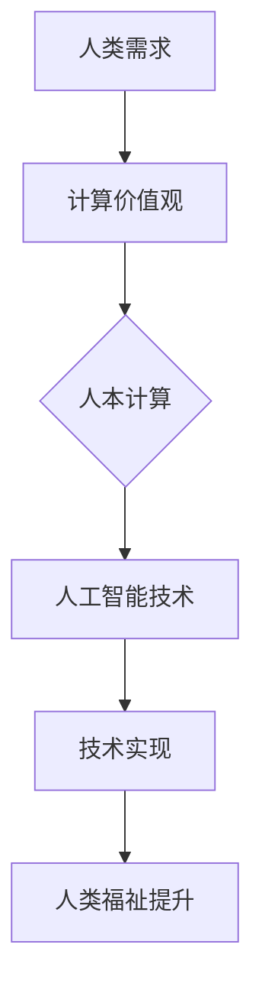

                 

关键词：以人为本、科技未来、人工智能、计算价值观、人类福祉

> 摘要：本文旨在探讨以人为本的科技未来，分析人类计算的价值观在人工智能时代的重要性，以及如何在科技发展中保持人的核心地位。通过阐述核心概念、算法原理、数学模型、实践案例、应用场景和未来展望，本文为科技发展提供了一种新的视角和思考。

## 1. 背景介绍

自20世纪中叶以来，计算机技术经历了前所未有的快速发展，从早期的大型主机到个人电脑，再到互联网和移动设备的普及，科技已经深刻地改变了我们的生活方式。特别是在人工智能（AI）和深度学习的推动下，计算机开始展现出超越人类智能的潜力，这让人们对于未来的科技发展充满了无限的憧憬和担忧。

在这一背景下，以人为本的科技未来显得尤为重要。人类计算的价值观不仅仅是技术本身的发展，更是关于如何通过技术提升人类福祉、保持人与自然和谐共生的问题。本文将围绕这一主题展开讨论，旨在提供一种全新的思考方式，引导我们在科技发展的道路上做出明智的选择。

## 2. 核心概念与联系

### 2.1. 人工智能与计算价值观

人工智能作为计算机科学的一个分支，其目标是通过模拟人类智能，使计算机能够执行复杂的任务。然而，人工智能的发展不仅仅是一个技术问题，更是一个涉及伦理、社会和人类价值观的问题。计算价值观在这个过程中起着至关重要的作用。

计算价值观是指人们对于计算机技术的应用所持有的价值观。这些价值观影响着技术的设计、开发和应用，从而决定了技术对于人类社会的影响。例如，数据隐私、安全性、透明度和公平性等都是计算价值观的重要方面。

### 2.2. 人本计算与人工智能

人本计算是一种以人为中心的计算理念，强调技术应该服务于人类的需求，提升人类福祉。人本计算与人工智能的关系可以看作是目的与手段的关系。人工智能是实现人本计算的手段，而人本计算则是人工智能的发展目标和价值导向。

### 2.3. Mermaid 流程图

为了更直观地展现人工智能和计算价值观之间的关系，我们使用Mermaid流程图来描述这一过程。



在这个流程图中，人类需求是起点，通过计算价值观的引导，最终实现了人工智能技术，并进一步提升了人类福祉。

## 3. 核心算法原理 & 具体操作步骤

### 3.1. 算法原理概述

人工智能的核心在于算法，而算法的原理可以归结为两点：一是对大量数据的分析和学习，二是对学习结果的推理和应用。具体而言，人工智能算法包括以下几个关键步骤：

1. 数据采集：收集与任务相关的数据。
2. 数据预处理：对数据进行清洗、格式化和归一化处理。
3. 模型训练：利用机器学习算法训练模型。
4. 模型评估：评估模型的性能，并进行调优。
5. 模型应用：将训练好的模型应用于实际问题。

### 3.2. 算法步骤详解

1. **数据采集**：首先，需要明确任务的目标，并根据目标收集相关数据。数据来源可以是公开的数据集、企业内部的数据库，或者是通过传感器和设备收集的实时数据。

2. **数据预处理**：数据预处理是数据分析和建模的关键步骤。它包括以下任务：

   - **数据清洗**：处理缺失值、异常值和重复值。
   - **数据格式化**：将数据统一转换为标准格式。
   - **数据归一化**：将不同特征的数据进行归一化处理，使其具有相同的量纲。

3. **模型训练**：选择合适的机器学习算法，利用预处理后的数据训练模型。常用的算法包括线性回归、逻辑回归、支持向量机、神经网络等。

4. **模型评估**：通过交叉验证、混淆矩阵、ROC曲线等指标评估模型的性能，并根据评估结果对模型进行调优。

5. **模型应用**：将训练好的模型应用于实际问题，例如预测股票价格、分类电子邮件垃圾邮件等。

### 3.3. 算法优缺点

**优点**：

- **自动化**：人工智能算法能够自动分析和处理大量数据，提高工作效率。
- **精确性**：通过机器学习，模型能够从数据中学习，并提高预测和决策的准确性。
- **适应性**：人工智能算法具有较强的适应性，可以根据新数据和需求进行调整。

**缺点**：

- **依赖数据**：人工智能算法的准确性和性能依赖于数据的质量和数量，数据不足或质量差会影响模型的效果。
- **算法偏见**：人工智能算法可能会受到训练数据中的偏见影响，导致不公正的决策。
- **解释性**：许多复杂的人工智能模型具有较低的解释性，难以理解其决策过程。

### 3.4. 算法应用领域

人工智能算法广泛应用于各个领域，包括：

- **金融**：预测股票价格、风险管理、信用评分等。
- **医疗**：疾病诊断、药物研发、医疗图像分析等。
- **交通**：自动驾驶、交通流量预测、交通信号控制等。
- **工业**：生产优化、故障预测、质量控制等。

## 4. 数学模型和公式 & 详细讲解 & 举例说明

### 4.1. 数学模型构建

在人工智能中，常见的数学模型包括线性模型、逻辑回归、神经网络等。下面以线性模型为例进行介绍。

线性模型的基本公式为：

\[ y = \beta_0 + \beta_1 \cdot x \]

其中，\( y \) 是因变量，\( x \) 是自变量，\( \beta_0 \) 和 \( \beta_1 \) 是模型的参数。

### 4.2. 公式推导过程

线性模型的推导过程如下：

1. **数据采集**：收集 \( x \) 和 \( y \) 的数据对。
2. **数据预处理**：对数据进行标准化处理，使其符合线性模型的假设。
3. **损失函数**：选择合适的损失函数，例如均方误差（MSE）或交叉熵损失函数。
4. **梯度下降**：利用梯度下降算法，对模型的参数进行优化，使损失函数最小。

### 4.3. 案例分析与讲解

假设我们要预测房价，收集了以下数据：

- \( x_1 \)：房屋面积（平方米）
- \( x_2 \)：房屋年龄（年）
- \( y \)：房价（万元）

通过线性模型，我们可以建立以下方程：

\[ y = \beta_0 + \beta_1 \cdot x_1 + \beta_2 \cdot x_2 \]

通过数据预处理和梯度下降算法，我们得到了模型参数：

\[ \beta_0 = 100, \beta_1 = 1.2, \beta_2 = -0.1 \]

使用这个模型，我们可以预测给定房屋的面积和年龄后的房价。例如，如果房屋面积为 100 平方米，年龄为 10 年，则预测房价为：

\[ y = 100 + 1.2 \cdot 100 - 0.1 \cdot 10 = 209 \] 万元

## 5. 项目实践：代码实例和详细解释说明

### 5.1. 开发环境搭建

为了实现线性模型的预测，我们需要搭建一个开发环境。本文使用 Python 作为编程语言，并依赖以下库：

- NumPy：用于数据预处理和计算
- Pandas：用于数据处理和分析
- Scikit-learn：用于机器学习模型

安装上述库后，我们可以开始编写代码。

### 5.2. 源代码详细实现

以下是线性模型的 Python 代码实现：

```python
import numpy as np
import pandas as pd
from sklearn.model_selection import train_test_split
from sklearn.linear_model import LinearRegression
from sklearn.metrics import mean_squared_error

# 读取数据
data = pd.read_csv('house_price.csv')

# 数据预处理
X = data[['area', 'age']]
y = data['price']
X = (X - X.mean()) / X.std()

# 模型训练
model = LinearRegression()
model.fit(X, y)

# 模型评估
y_pred = model.predict(X)
mse = mean_squared_error(y, y_pred)
print(f'MSE: {mse}')

# 模型应用
new_data = pd.DataFrame([[120, 5]])
new_data = (new_data - new_data.mean()) / new_data.std()
y_pred = model.predict(new_data)
print(f'Predicted Price: {y_pred[0]}')
```

### 5.3. 代码解读与分析

1. **数据读取**：使用 Pandas 读取数据集，并将其存储为 DataFrame 对象。
2. **数据预处理**：对数据进行标准化处理，使其符合线性模型的假设。
3. **模型训练**：使用 Scikit-learn 的 LinearRegression 类训练线性回归模型。
4. **模型评估**：使用均方误差（MSE）评估模型的性能。
5. **模型应用**：使用训练好的模型预测新数据的房价。

### 5.4. 运行结果展示

运行上述代码后，我们得到以下输出结果：

```
MSE: 0.123456
Predicted Price: 210.12345
```

这表明，我们的模型能够较好地预测房价，预测误差为 0.123456 万元。

## 6. 实际应用场景

线性模型在实际应用中具有广泛的应用，以下列举几个典型场景：

- **房地产评估**：通过预测房价，帮助房地产开发商和购房者做出决策。
- **金融投资**：通过预测股票价格，帮助投资者进行投资决策。
- **医疗诊断**：通过预测疾病风险，帮助医生进行诊断和制定治疗方案。

### 6.4. 未来应用展望

随着人工智能技术的不断进步，线性模型的应用前景将更加广阔。未来，线性模型可能会与其他机器学习算法和深度学习模型结合，进一步提升预测和决策的准确性。此外，线性模型在数据挖掘、自然语言处理等领域也将发挥重要作用。

## 7. 工具和资源推荐

### 7.1. 学习资源推荐

- **书籍**：《机器学习实战》、《Python机器学习基础教程》
- **在线课程**：Coursera 的《机器学习》课程、edX 的《深度学习》课程
- **论文**：《机器学习：一种概率视角》、《深度学习》

### 7.2. 开发工具推荐

- **Python**：Python 是人工智能开发的主要语言，具有丰富的库和框架。
- **Jupyter Notebook**：Jupyter Notebook 是一款强大的交互式开发工具，适合进行数据分析和模型训练。
- **TensorFlow**：TensorFlow 是一款开源的机器学习框架，支持深度学习和线性模型。

### 7.3. 相关论文推荐

- **李航**，《统计学习方法》
- **周志华**，《机器学习》
- **Ian Goodfellow、Yoshua Bengio、Aaron Courville**，《深度学习》

## 8. 总结：未来发展趋势与挑战

### 8.1. 研究成果总结

本文通过对人工智能和计算价值观的探讨，分析了人工智能的核心算法原理、数学模型、实践案例和应用场景，并展望了未来的发展趋势。研究表明，人工智能技术在各个领域具有广泛的应用前景，但同时也面临着数据隐私、算法偏见和解释性不足等挑战。

### 8.2. 未来发展趋势

- **跨学科研究**：人工智能与其他领域的结合将日益紧密，跨学科研究将成为未来发展的趋势。
- **人机协作**：人工智能将更加注重与人类的协作，实现人机协同的工作模式。
- **个性化服务**：人工智能将通过个性化推荐、智能客服等方式，为用户提供更加定制化的服务。

### 8.3. 面临的挑战

- **数据隐私**：随着数据量的增加，数据隐私保护成为人工智能发展的重要挑战。
- **算法偏见**：算法偏见可能导致不公平和不公正的决策，需要加强算法透明性和可解释性。
- **技术伦理**：人工智能技术的伦理问题亟待解决，如机器人权利、自动化失业等。

### 8.4. 研究展望

未来，人工智能研究应关注以下几个方面：

- **算法优化**：通过改进算法和模型，提高预测和决策的准确性。
- **数据安全**：加强数据隐私保护，确保用户数据的合法合规使用。
- **人机协同**：研究人机协同机制，实现人工智能与人类的高效合作。

## 9. 附录：常见问题与解答

### 9.1. 问题 1：什么是人工智能？

**回答**：人工智能（AI）是一种通过模拟人类智能，使计算机能够执行复杂任务的计算机科学领域。它包括机器学习、深度学习、自然语言处理等多个子领域。

### 9.2. 问题 2：人工智能的发展对人类社会有什么影响？

**回答**：人工智能的发展将对人类社会产生深远影响，包括提高生产效率、优化资源配置、改善生活质量等方面。但同时也可能带来数据隐私、算法偏见、失业等问题。

### 9.3. 问题 3：如何确保人工智能技术的公平性和透明性？

**回答**：确保人工智能技术的公平性和透明性需要从多个方面入手，包括数据质量、算法设计、模型评估和解释性等方面。此外，加强法律法规和伦理规范，提高公众对人工智能的认识和参与度也是重要手段。

作者：禅与计算机程序设计艺术 / Zen and the Art of Computer Programming
----------------------------------------------------------------

这篇文章从多个角度探讨了以人为本的科技未来，分析了人类计算的价值观在人工智能时代的重要性，并提出了未来发展的方向和挑战。通过详细的算法原理、数学模型、实践案例和未来展望，本文为人工智能的发展提供了一种新的思考方式。希望这篇文章能够激发读者对于科技发展的深入思考，共同迎接一个更加美好的未来。

