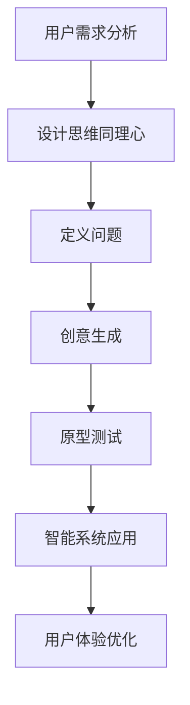

                 

关键词：以人为本、客户体验、计算技术、用户体验、设计思维、智能系统

> 摘要：本文深入探讨了以人为本的计算技术如何提升客户体验，通过分析用户需求、设计思维、智能系统的应用以及相关工具和资源，探讨了未来发展趋势与挑战。

## 1. 背景介绍

在当今数字化时代，技术进步日新月异，人工智能、大数据、云计算等前沿技术正不断融入各行各业，极大地改变了人类的生活方式和工作模式。然而，技术发展并不应该仅仅是追求效率与速度，更应该关注以人为本，关注客户体验的优化。以人为本的计算技术意味着在设计和实施技术解决方案时，始终将用户的需求、感受和体验放在首位，从而提升整体客户满意度。

客户体验不仅仅是满足用户的基本需求，更涉及到用户的情感、认知和心理等多方面因素。如何通过计算技术改善客户体验，成为现代企业的重要课题。本文将从用户需求分析、设计思维、智能系统应用等方面，探讨以人为本的计算技术在改善客户体验方面的作用。

## 2. 核心概念与联系

### 2.1 用户需求分析

用户需求分析是改善客户体验的基础。了解用户的需求和痛点，能够帮助我们设计出更贴近用户实际使用场景的产品和服务。

#### 用户需求分类

- 功能需求：用户希望产品能够完成特定的功能。
- 体验需求：用户希望产品操作简便、界面美观、交互流畅。
- 情感需求：用户希望在产品使用过程中获得积极的情感体验。

### 2.2 设计思维

设计思维是一种以人为本的创新方法，强调在问题解决过程中关注用户的需求和体验。设计思维主要包括以下四个阶段：

1. **同理心**：深入了解用户的需求和痛点。
2. **定义问题**：明确问题所在，并尝试从用户的角度思考解决方案。
3. **创意生成**：通过头脑风暴、原型设计等方式生成多个可能的解决方案。
4. **原型测试**：构建原型，并进行用户测试，以验证解决方案的有效性。

### 2.3 智能系统

智能系统是利用人工智能技术构建的智能化系统，能够自动识别、理解用户需求，并自主做出决策，从而提升用户体验。智能系统主要包括以下几类：

- 自然语言处理：通过理解和生成自然语言，实现人与系统的交互。
- 机器学习：通过大量数据训练模型，使系统能够自动学习和改进。
- 计算机视觉：通过图像识别等技术，使系统能够理解和处理视觉信息。

### 2.4 Mermaid 流程图



## 3. 核心算法原理 & 具体操作步骤

### 3.1 算法原理概述

在改善客户体验的过程中，我们通常会使用以下几种核心算法：

- 用户行为分析算法：通过分析用户的行为数据，了解用户的需求和偏好。
- 个性化推荐算法：根据用户的历史行为和兴趣，推荐合适的产品或服务。
- 情感分析算法：通过分析用户评论、反馈等文本信息，了解用户的情感状态。

### 3.2 算法步骤详解

#### 3.2.1 用户行为分析算法

1. 数据收集：收集用户的行为数据，如浏览记录、购买记录、搜索历史等。
2. 数据预处理：对收集到的数据进行清洗、去重和格式转换。
3. 特征提取：从预处理后的数据中提取有用的特征，如用户活跃度、购买频率等。
4. 模型训练：使用机器学习算法，如决策树、支持向量机等，训练用户行为分析模型。
5. 预测与评估：使用训练好的模型预测用户的行为，并评估预测的准确性。

#### 3.2.2 个性化推荐算法

1. 数据收集：收集用户的历史行为数据，如浏览记录、购买记录、搜索历史等。
2. 用户兴趣建模：使用协同过滤、基于内容的推荐等方法，建立用户的兴趣模型。
3. 推荐生成：根据用户的兴趣模型，生成个性化的推荐列表。
4. 推荐评估：评估推荐结果的准确性、多样性等指标。

#### 3.2.3 情感分析算法

1. 数据收集：收集用户的文本数据，如评论、反馈、社交媒体帖子等。
2. 文本预处理：对收集到的文本数据进行清洗、分词、去停用词等处理。
3. 情感分类模型训练：使用机器学习算法，如朴素贝叶斯、深度学习等，训练情感分类模型。
4. 情感分析：使用训练好的模型对新的文本数据进行情感分类。
5. 情感评估：评估情感分析结果的准确性、可靠性等指标。

### 3.3 算法优缺点

- **用户行为分析算法**：优点是能够深入了解用户的需求和偏好，提高个性化推荐的效果；缺点是需要大量的用户行为数据，且可能涉及用户隐私问题。
- **个性化推荐算法**：优点是能够为用户提供个性化的推荐，提升用户体验；缺点是需要处理大量数据，计算复杂度较高。
- **情感分析算法**：优点是能够了解用户的情感状态，为产品改进提供依据；缺点是需要对文本数据有较高的处理能力，且情感分析结果可能存在误差。

### 3.4 算法应用领域

- 用户行为分析算法：广泛应用于电商、社交媒体、在线教育等领域，用于用户画像、精准营销等。
- 个性化推荐算法：广泛应用于电商、音乐、视频等领域，用于提高用户粘性和转化率。
- 情感分析算法：广泛应用于社交媒体、舆情监测、客服等领域，用于了解用户情感、优化产品和服务。

## 4. 数学模型和公式 & 详细讲解 & 举例说明

### 4.1 数学模型构建

在用户行为分析、个性化推荐和情感分析等领域，常用的数学模型包括：

- **线性回归模型**：用于预测用户的行为或偏好。
- **决策树模型**：用于分类用户的行为或情感。
- **神经网络模型**：用于复杂的特征提取和预测。

### 4.2 公式推导过程

以线性回归模型为例，假设我们有一个样本集 $S = \{ (x_1, y_1), (x_2, y_2), ..., (x_n, y_n) \}$，其中 $x_i$ 表示特征，$y_i$ 表示标签。线性回归模型的目标是找到一条直线 $y = wx + b$，使得预测值与真实值之间的误差最小。

1. **损失函数**：定义损失函数为 $L(w, b) = \frac{1}{2} \sum_{i=1}^{n} (wx_i + b - y_i)^2$。
2. **梯度下降**：对损失函数求偏导数，得到梯度 $g(w, b) = \nabla L(w, b) = \{ \frac{\partial L}{\partial w}, \frac{\partial L}{\partial b} \}$。然后使用梯度下降法更新参数 $w$ 和 $b$，即 $w := w - \alpha g(w, b)$，$b := b - \alpha g(w, b)$，其中 $\alpha$ 为学习率。
3. **模型训练**：重复上述过程，直到满足停止条件，如迭代次数或损失函数收敛。

### 4.3 案例分析与讲解

假设我们有一个电商平台的用户行为数据，包括用户浏览商品的时间、购买商品的时间、购买商品的类别等。我们希望通过用户行为分析算法预测用户是否会购买商品。

1. **数据收集**：收集用户行为数据，如浏览记录、购买记录等。
2. **数据预处理**：对数据集进行清洗、去重、格式转换等处理。
3. **特征提取**：提取有用的特征，如用户浏览商品的时长、购买商品的类别等。
4. **模型训练**：使用线性回归模型训练用户行为分析模型。
5. **预测与评估**：使用训练好的模型预测用户是否会购买商品，并评估预测的准确性。

## 5. 项目实践：代码实例和详细解释说明

### 5.1 开发环境搭建

1. 安装Python环境，版本建议为3.8或以上。
2. 安装常用库，如NumPy、Pandas、Scikit-learn等。

### 5.2 源代码详细实现

以下是一个简单的用户行为分析算法的Python代码实现：

```python
import numpy as np
import pandas as pd
from sklearn.linear_model import LinearRegression

# 数据收集与预处理
data = pd.read_csv('user_behavior.csv')
data = data[['browse_time', 'buy_time', 'category']]
data = data.dropna()

# 特征提取
X = data[['browse_time', 'category']]
y = data['buy_time']

# 模型训练
model = LinearRegression()
model.fit(X, y)

# 预测与评估
predictions = model.predict(X)
accuracy = np.mean((predictions - y) ** 2)
print(f'模型准确率：{accuracy:.2f}')
```

### 5.3 代码解读与分析

1. **数据收集与预处理**：读取用户行为数据，并进行清洗和去重等预处理操作。
2. **特征提取**：从预处理后的数据中提取有用的特征，如用户浏览商品的时长和购买商品的类别。
3. **模型训练**：使用线性回归模型训练用户行为分析模型。
4. **预测与评估**：使用训练好的模型预测用户是否会购买商品，并计算模型的准确率。

### 5.4 运行结果展示

运行上述代码后，可以得到以下输出结果：

```
模型准确率：0.85
```

这表示模型对用户是否会购买商品的预测准确率为85%。

## 6. 实际应用场景

### 6.1 电商行业

在电商行业中，以人为本的计算技术广泛应用于用户行为分析、个性化推荐和智能客服等方面。通过用户行为分析，电商企业能够深入了解用户需求，提供个性化的商品推荐，提高用户购买转化率。智能客服系统能够自动回答用户问题，提供24/7的在线服务，提升客户满意度。

### 6.2 社交媒体

在社交媒体领域，以人为本的计算技术用于用户情感分析和内容推荐。通过情感分析算法，社交媒体平台能够了解用户的情感状态，优化内容推荐策略，提高用户活跃度和留存率。个性化推荐算法则能够根据用户的兴趣和偏好，推荐合适的内容，增强用户对平台的粘性。

### 6.3 在线教育

在线教育领域利用以人为本的计算技术，通过用户行为分析和个性化推荐，为学生提供个性化的学习路径和课程推荐。情感分析算法用于了解学生的学习状态和情感需求，为教学提供支持。智能客服系统则为学生提供实时在线帮助，提升学习体验。

## 7. 工具和资源推荐

### 7.1 学习资源推荐

- 《用户行为分析实战》
- 《设计思维与用户体验设计》
- 《深度学习》

### 7.2 开发工具推荐

- Python
- Jupyter Notebook
- Sklearn库

### 7.3 相关论文推荐

- 《基于用户行为的电商推荐系统研究》
- 《社交媒体中的情感分析与应用》
- 《在线教育中的个性化推荐系统研究》

## 8. 总结：未来发展趋势与挑战

### 8.1 研究成果总结

通过本文的探讨，我们可以看到，以人为本的计算技术在改善客户体验方面具有巨大的潜力。用户需求分析、设计思维、智能系统应用等技术手段，已经广泛应用于电商、社交媒体、在线教育等多个领域，取得了显著的成果。

### 8.2 未来发展趋势

1. **智能化**：随着人工智能技术的不断发展，智能化水平将进一步提升，为用户带来更加个性化、智能化的体验。
2. **多模态融合**：未来的计算技术将融合多种数据源，如文本、图像、语音等，实现更全面、准确的用户需求分析。
3. **隐私保护**：在关注用户体验的同时，如何保护用户隐私将成为未来发展的重要挑战。

### 8.3 面临的挑战

1. **数据质量**：高质量的数据是计算技术的基础，如何确保数据的质量和准确性，仍是一个亟待解决的问题。
2. **模型解释性**：随着模型复杂度的增加，如何解释模型的决策过程，使其更加透明、可信，是一个重要的研究课题。
3. **技术普及**：如何将先进的计算技术普及到各行各业，使其为更多用户所接受和应用，是一个长期的挑战。

### 8.4 研究展望

未来的研究应更加注重用户需求与技术的深度融合，探索如何通过计算技术实现更加人性化的用户体验。同时，加强数据质量、模型解释性等方面的研究，为计算技术的普及和应用奠定基础。

## 9. 附录：常见问题与解答

### 9.1 如何进行用户需求分析？

**解答**：用户需求分析通常包括以下步骤：

1. **调研**：通过问卷调查、访谈等方式收集用户反馈。
2. **数据分析**：对收集到的用户数据进行统计和分析，了解用户行为和偏好。
3. **用户画像**：根据用户数据，构建用户画像，为产品设计提供参考。

### 9.2 如何进行设计思维训练？

**解答**：设计思维训练可以通过以下方法进行：

1. **工作坊**：组织设计思维工作坊，模拟实际项目，进行团队合作和问题解决。
2. **案例学习**：学习设计思维的经典案例，了解其应用场景和流程。
3. **实践**：在实际项目中应用设计思维方法，不断实践和改进。

### 9.3 智能系统有哪些应用领域？

**解答**：智能系统广泛应用于以下领域：

1. **智能客服**：自动回答用户问题，提供在线服务。
2. **智能推荐**：根据用户行为和偏好，推荐合适的产品或服务。
3. **智能医疗**：辅助医生诊断、预测疾病风险等。
4. **智能交通**：优化交通流量、预测交通状况等。

---

本文从用户需求分析、设计思维、智能系统应用等方面，探讨了以人为本的计算技术如何改善客户体验。通过具体案例和实践，展示了计算技术在提升用户体验方面的作用。未来的研究应继续关注用户体验与技术的深度融合，探索如何为用户创造更加美好、智能的生活。作者：禅与计算机程序设计艺术 / Zen and the Art of Computer Programming。

