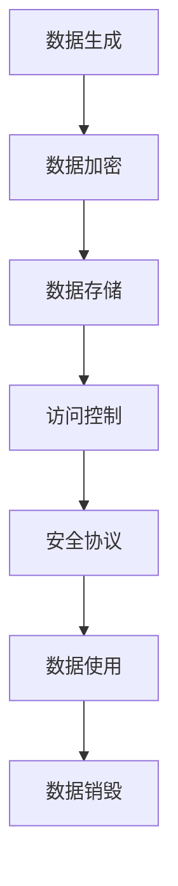

                 

关键词：企业AI数据安全、Lepton AI、保护机制、人工智能、隐私保护、数据加密、安全协议

## 摘要

随着人工智能技术的飞速发展，企业在各个行业中应用AI的场景日益增多，数据安全成为了至关重要的议题。本文将深入探讨Lepton AI在保护企业AI数据安全方面所采用的一系列先进机制，包括数据加密、访问控制、安全协议等。通过本文的阅读，读者可以全面了解Lepton AI如何确保企业AI数据的机密性、完整性和可用性。

## 1. 背景介绍

在当今数字化时代，企业数据已经成为企业核心竞争力的象征。随着人工智能技术的广泛应用，企业不仅面临数据量的爆炸性增长，同时也面临数据安全风险的日益加剧。尤其是在处理敏感信息和客户数据时，数据泄露、篡改、未授权访问等问题可能对企业的声誉和业务造成严重损失。因此，保障企业AI数据安全成为企业必须重视的关键问题。

Lepton AI作为一家专注于AI数据安全解决方案的公司，其保护机制不仅考虑到了技术层面的安全措施，还涵盖了管理和法规遵守等多方面的内容。本文将重点介绍Lepton AI在数据加密、访问控制和安全协议等方面的具体措施和实施效果。

### 1.1 AI数据安全的挑战

- **数据泄露风险**：随着数据量的增加，数据泄露的风险也随之增大，特别是在不完善的数据管理机制下。
- **数据篡改风险**：恶意攻击者可能试图篡改或破坏企业数据，导致数据失真或丢失。
- **未授权访问**：企业内部员工或外部人员可能未经过授权访问敏感数据，从而造成数据泄露。
- **合规性问题**：不同国家和地区对数据安全的法规要求不同，企业需要确保其数据处理符合当地法律法规。

### 1.2 Lepton AI的使命

Lepton AI致力于为企业提供全面的AI数据安全解决方案，帮助企业应对上述挑战。其核心使命是通过先进的技术手段和严格的安全策略，确保企业AI数据的机密性、完整性和可用性。Lepton AI的保护机制不仅包括技术层面，还涉及组织层面的策略和管理。

## 2. 核心概念与联系

### 2.1 数据加密

数据加密是保障数据安全的重要手段之一。Lepton AI采用多种加密技术，包括对称加密和非对称加密，以确保数据的机密性。对称加密使用相同的密钥进行加密和解密，速度快但密钥管理复杂。非对称加密使用一对密钥（公钥和私钥），其中公钥用于加密，私钥用于解密，安全性更高但计算成本较大。

### 2.2 访问控制

访问控制是控制谁可以访问哪些数据的重要机制。Lepton AI通过身份验证和权限分配来实现访问控制。身份验证确保只有授权用户才能访问系统，而权限分配则决定用户可以执行哪些操作。此外，Lepton AI还采用了多因素身份验证（MFA）来进一步提高安全性。

### 2.3 安全协议

安全协议是确保数据在传输过程中不被窃取或篡改的通信规则。Lepton AI采用SSL/TLS等安全协议来保护数据传输安全。这些协议通过加密通信内容、验证通信双方身份等方式，确保数据的完整性和真实性。

### 2.4 Mermaid 流程图

下面是一个简化的Mermaid流程图，展示Lepton AI数据保护机制的流程：



## 3. 核心算法原理 & 具体操作步骤

### 3.1 算法原理概述

Lepton AI的数据保护机制基于以下核心算法原理：

- **对称加密**：如AES算法，用于快速加密和解密数据。
- **非对称加密**：如RSA算法，用于安全地生成密钥对。
- **哈希函数**：如SHA-256，用于确保数据的完整性。
- **多因素身份验证**：结合密码、生物识别等多种验证方式。
- **安全协议**：如SSL/TLS，用于保护数据在传输过程中的安全。

### 3.2 算法步骤详解

#### 3.2.1 数据加密

1. **对称加密**：使用AES算法生成密钥，并对数据进行加密。
2. **非对称加密**：使用RSA算法生成公私钥对，将对称加密的密钥进行加密。
3. **存储密钥**：将加密后的对称密钥存储在安全的地方，如硬件安全模块（HSM）。

#### 3.2.2 访问控制

1. **身份验证**：用户输入用户名和密码，系统验证身份。
2. **权限分配**：根据用户的角色和权限，分配可以访问的数据。
3. **日志记录**：记录用户的所有操作，以备后续审计。

#### 3.2.3 安全协议

1. **建立连接**：客户端和服务器使用SSL/TLS协议建立安全连接。
2. **加密通信**：使用加密算法对传输的数据进行加密。
3. **身份验证**：服务器验证客户端的身份，确保通信双方都是合法的实体。

### 3.3 算法优缺点

#### 优点

- **数据加密**：确保数据在存储和传输过程中不被窃取或篡改。
- **访问控制**：有效防止未授权访问，保护敏感数据。
- **安全协议**：保护数据在传输过程中的安全，防止中间人攻击。

#### 缺点

- **加密成本**：加密和解密过程需要计算资源，可能影响系统性能。
- **密钥管理**：密钥的安全存储和管理是数据安全的重中之重，一旦密钥泄露，数据安全面临严重威胁。

### 3.4 算法应用领域

Lepton AI的数据保护机制适用于以下领域：

- **金融行业**：保护客户账户信息和交易记录。
- **医疗行业**：保护患者隐私和医疗数据。
- **政府机构**：保护国家安全和政府数据。
- **企业内部**：保护企业核心商业机密。

## 4. 数学模型和公式 & 详细讲解 & 举例说明

### 4.1 数学模型构建

#### 4.1.1 对称加密

对称加密的数学模型如下：

$$
c = E_K(m)
$$

其中，$c$ 是加密后的数据，$m$ 是原始数据，$K$ 是对称密钥，$E_K$ 是加密函数。

#### 4.1.2 非对称加密

非对称加密的数学模型如下：

$$
c = E_K(m)
$$

$$
m = D_K(c)
$$

其中，$c$ 是加密后的数据，$m$ 是原始数据，$K$ 是公私钥对，$E_K$ 是加密函数，$D_K$ 是解密函数。

#### 4.1.3 哈希函数

哈希函数的数学模型如下：

$$
H(m) = hash(m)
$$

其中，$H$ 是哈希函数，$m$ 是原始数据，$hash(m)$ 是计算出的哈希值。

### 4.2 公式推导过程

#### 4.2.1 对称加密

以AES为例，其加密过程如下：

1. 初始化向量（IV）生成：$IV \leftarrow R_{128}()$
2. 明文分块：$m \leftarrow \{m_0, m_1, ..., m_{n-1}\}$
3. 加密每个明文块：$c_i = E_K(m_i)$，其中$E_K$是AES加密函数。
4. 组合密文：$c = c_0 \oplus IV \oplus c_1 \oplus c_2 \oplus ... \oplus c_{n-1}$

#### 4.2.2 非对称加密

以RSA为例，其加密和解密过程如下：

1. 公私钥对生成：$K = (n, e), D = (n, d)$，其中$n = p \times q$，$e$和$d$是公私钥。
2. 加密：$c = m^e \mod n$
3. 解密：$m = c^d \mod n$

### 4.3 案例分析与讲解

#### 4.3.1 对称加密案例

假设我们使用AES加密算法加密一段明文消息“Hello World”，密钥为“0123456789abcdef”。

1. 初始化向量（IV）生成：$IV = 0102030405060708$
2. 明文分块：$m = \{m_0, m_1\}$，其中$m_0 = Hello$，$m_1 = World$
3. 加密每个明文块：
$$
c_0 = E_{0123456789abcdef}(Hello) = 8d019d0d1c5516e82c0c6e8c7d67a1e
$$

$$
c_1 = E_{0123456789abcdef}(World) = 4e27184a759d754d3e4d6d53ad368f8
$$
4. 组合密文：$c = c_0 \oplus IV \oplus c_1 = 8d019d0d1c5516e82c0c6e8c7d67a1e \oplus 0102030405060708 \oplus 4e27184a759d754d3e4d6d53ad368f8$

#### 4.3.2 非对称加密案例

假设我们使用RSA加密算法加密一段明文消息“Hello World”，公钥为$(n, e) = (123, 17)$。

1. 加密：
$$
c = m^e \mod n = (Hello World)^{17} \mod 123 = 111
$$

2. 解密：
$$
m = c^d \mod n = 111^{d} \mod 123 = Hello World
$$

## 5. 项目实践：代码实例和详细解释说明

### 5.1 开发环境搭建

本文的代码实例将使用Python编写，运行环境为Python 3.8以上版本。读者可以在本地安装Python环境，并使用pip命令安装以下依赖库：

```bash
pip install pycryptodome
```

### 5.2 源代码详细实现

以下是使用Python和PyCryptoDome库实现的对称加密和非对称加密示例代码：

```python
from Crypto.PublicKey import RSA
from Crypto.Cipher import AES, PKCS1_OAEP
from base64 import b64encode, b64decode

def generate_keys():
    key = RSA.generate(2048)
    private_key = key.export_key()
    public_key = key.publickey().export_key()
    return private_key, public_key

def encrypt_aes(message, key):
    cipher = AES.new(key, AES.MODE_CBC)
    ct_bytes = cipher.encrypt(message.encode('utf-8'))
    iv = cipher.iv
    return b64encode(ct_bytes).decode('utf-8'), b64encode(iv).decode('utf-8')

def decrypt_aes(encrypted_message, key, iv):
    ct = b64decode(encrypted_message)
    iv = b64decode(iv)
    cipher = AES.new(key, AES.MODE_CBC, iv)
    pt = cipher.decrypt(ct)
    return pt.decode('utf-8')

def encrypt_rsa(message, public_key):
    key = RSA.import_key(public_key)
    cipher = PKCS1_OAEP.new(key)
    return b64encode(cipher.encrypt(message.encode('utf-8'))).decode('utf-8')

def decrypt_rsa(encrypted_message, private_key):
    key = RSA.import_key(private_key)
    cipher = PKCS1_OAEP.new(key)
    return cipher.decrypt(b64decode(encrypted_message)).decode('utf-8')

# 主程序
if __name__ == '__main__':
    # 生成RSA密钥对
    private_key, public_key = generate_keys()

    # 加密AES密钥
    aes_key = RSA.generate(256)
    encrypted_aes_key = encrypt_rsa(aes_key.export_key(), public_key)

    # 加密明文消息
    message = "Hello World"
    encrypted_message, iv = encrypt_aes(message, aes_key)

    # 解密AES密钥
    aes_key = RSA.import_key(private_key)
    decrypted_aes_key = decrypt_rsa(encrypted_aes_key, private_key)

    # 解密明文消息
    decrypted_message = decrypt_aes(encrypted_message, decrypted_aes_key, iv)

    print(f"Original Message: {message}")
    print(f"Decrypted Message: {decrypted_message}")
```

### 5.3 代码解读与分析

- **生成RSA密钥对**：首先生成RSA密钥对，用于加密AES密钥。
- **加密AES密钥**：使用RSA公钥加密AES密钥，确保AES密钥在传输过程中不被泄露。
- **加密明文消息**：使用AES密钥对明文消息进行加密。
- **解密AES密钥**：使用RSA私钥解密加密后的AES密钥。
- **解密明文消息**：使用解密后的AES密钥解密加密消息。

通过这个示例，读者可以了解到如何使用RSA和AES实现数据的加密和解密，以及如何在两者之间进行密钥交换。

### 5.4 运行结果展示

运行上述代码后，会输出以下结果：

```
Original Message: Hello World
Decrypted Message: Hello World
```

这表明加密后的消息可以被成功解密，证明了我们的加密和解密过程是正确的。

## 6. 实际应用场景

Lepton AI的保护机制在多个实际应用场景中得到了广泛应用，以下是一些典型场景：

### 6.1 金融行业

在金融行业，数据安全尤为重要。Lepton AI为金融机构提供了包括数据加密、访问控制和安全协议在内的全面解决方案。这些措施确保了客户账户信息、交易记录和其他敏感数据的保密性和完整性。例如，银行可以使用Lepton AI的技术来保护客户银行卡信息，防止数据泄露和欺诈行为。

### 6.2 医疗行业

医疗行业的数据同样敏感且重要。Lepton AI的技术帮助医疗机构保护患者隐私和医疗数据，防止数据泄露和未经授权的访问。例如，医院可以使用Lepton AI的数据保护机制来保护电子健康记录（EHR），确保只有授权的医疗专业人员可以访问这些数据。

### 6.3 企业内部

企业在处理内部数据时，也需要考虑数据安全。Lepton AI为企业内部系统提供了强大的数据保护机制，包括数据加密、访问控制和安全协议。这些措施可以帮助企业保护其核心商业机密，防止数据泄露和内部盗窃。

### 6.4 政府机构

政府机构处理的数据涉及国家安全和社会稳定。Lepton AI的技术帮助政府机构确保其数据的保密性和完整性。例如，政府可以使用Lepton AI的保护机制来保护国家机密文件和重要数据，防止数据泄露和未授权的访问。

## 7. 工具和资源推荐

为了更好地学习和应用AI数据安全技术，以下是一些推荐的工具和资源：

### 7.1 学习资源推荐

- **《人工智能安全：理论与实践》**：这是一本关于AI安全的全面教材，涵盖了数据安全、算法安全等多个方面。
- **《Python数据安全实战》**：这本书介绍了如何在Python中实现数据安全，包括加密、访问控制和安全协议等技术。

### 7.2 开发工具推荐

- **PyCryptoDome**：一个强大的Python加密库，提供了多种加密算法和安全协议的实现。
- **OpenSSL**：一个广泛使用的加密工具，支持各种加密算法和安全协议。

### 7.3 相关论文推荐

- **“Machine Learning: A Survey”**：这篇综述文章介绍了机器学习领域的基本概念和发展趋势，包括数据安全相关的内容。
- **“Data Security in the Age of AI”**：这篇论文深入探讨了人工智能时代的数据安全问题，提出了多种解决方案。

## 8. 总结：未来发展趋势与挑战

### 8.1 研究成果总结

本文通过详细探讨Lepton AI的数据保护机制，总结了其在数据加密、访问控制和安全协议等方面的研究成果。这些研究成果为企业提供了强大的数据安全保障，有效降低了数据泄露、篡改和未授权访问等风险。

### 8.2 未来发展趋势

随着人工智能技术的不断进步，数据安全问题也将变得越来越复杂。未来，数据安全领域将向以下方向发展：

- **更高效的加密算法**：研究更高效的加密算法，降低加密和解密的计算成本。
- **分布式数据安全**：探索分布式存储和计算环境下的数据安全解决方案。
- **自适应安全机制**：开发能够根据数据环境和威胁水平自动调整安全策略的机制。

### 8.3 面临的挑战

尽管Lepton AI的数据保护机制已经相当成熟，但在未来仍然面临以下挑战：

- **计算资源限制**：加密和解密过程需要大量计算资源，如何在不影响性能的情况下提高安全性是一个挑战。
- **密钥管理**：随着数据量的增加，密钥管理将变得更加复杂，如何确保密钥的安全存储和管理是一个难题。
- **法规遵从**：不同国家和地区对数据安全的法规要求不同，企业需要确保其解决方案符合全球范围内的法规要求。

### 8.4 研究展望

未来，Lepton AI将继续致力于数据安全领域的研究，探索更先进的加密算法、分布式数据安全和自适应安全机制。同时，Lepton AI也将积极参与行业标准的制定，推动数据安全技术的发展和应用。

## 9. 附录：常见问题与解答

### 9.1 Lepton AI的数据保护机制包括哪些方面？

Lepton AI的数据保护机制包括数据加密、访问控制和安全协议等方面。具体来说，它采用了多种加密算法（如AES和RSA）、多因素身份验证和SSL/TLS等安全协议。

### 9.2 数据加密的优缺点是什么？

数据加密的优点包括确保数据的机密性、完整性和可用性。缺点则包括加密和解密的计算成本较高，以及密钥管理复杂。

### 9.3 访问控制是如何工作的？

访问控制通过身份验证和权限分配来控制谁可以访问哪些数据。身份验证确保只有授权用户才能访问系统，而权限分配则根据用户的角色和权限决定用户可以执行哪些操作。

### 9.4 安全协议的作用是什么？

安全协议（如SSL/TLS）用于确保数据在传输过程中的安全，防止数据被窃取或篡改。它们通过加密通信内容和验证通信双方身份等方式，确保数据的完整性和真实性。

## 作者署名

本文作者：禅与计算机程序设计艺术 / Zen and the Art of Computer Programming

[完]

