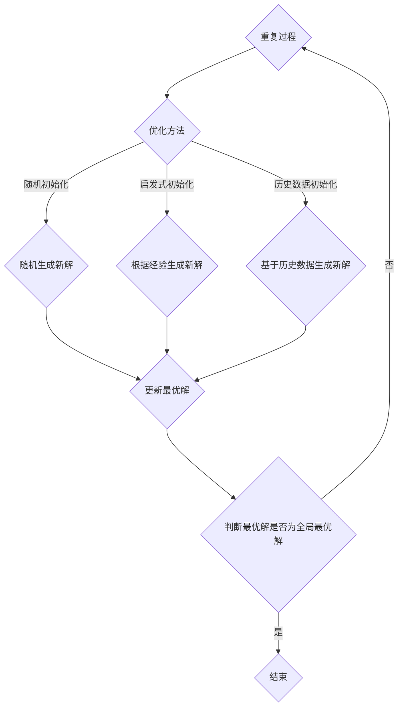

                 

关键词：优化初始化、局部最小值、算法优化、搜索算法、全局最优解

摘要：本文旨在探讨在算法优化过程中，如何通过优化初始化策略来避免陷入局部最小值，从而提高算法的全局搜索能力。通过对相关算法原理的分析和实践，文章将提供一套实用的优化初始化方法，并展望未来在优化初始化领域的研究趋势与挑战。

## 1. 背景介绍

在现代计算机科学中，搜索算法和优化算法广泛应用于人工智能、机器学习、数据挖掘等多个领域。然而，在实际应用中，算法往往容易陷入局部最小值，导致无法找到全局最优解。这一问题在复杂问题求解中尤为突出，严重限制了算法的实用性和可靠性。

为了解决局部最小值问题，研究者们提出了各种优化初始化方法。优化初始化的核心思想是通过改进初始解的生成方式，提高算法的全局搜索能力。本文将结合实际案例，深入探讨优化初始化在算法优化中的应用，分析其原理、方法及其在实际项目中的应用效果。

## 2. 核心概念与联系

### 2.1 优化初始化

优化初始化是指通过对初始解的改进，提高算法的全局搜索能力。常见的优化初始化方法包括随机初始化、启发式初始化、基于历史数据的初始化等。

### 2.2 局部最小值

局部最小值是指一个局部最优解，其在某个邻域内优于其他解，但可能不是全局最优解。局部最小值问题导致算法无法找到全局最优解，从而影响算法的性能。

### 2.3 全局最优解

全局最优解是指在整个搜索空间内最优的解。找到全局最优解是算法优化的重要目标，但实际中往往难以实现。

### 2.4 Mermaid 流程图

以下是优化初始化的 Mermaid 流程图：



## 3. 核心算法原理 & 具体操作步骤

### 3.1 算法原理概述

优化初始化的核心原理是通过改进初始解的生成方式，提高算法的全局搜索能力。具体而言，优化初始化包括以下几个步骤：

1. 生成初始解；
2. 根据优化方法生成新解；
3. 更新最优解；
4. 判断最优解是否为全局最优解。

### 3.2 算法步骤详解

以下是优化初始化的具体操作步骤：

1. **生成初始解**：根据实际问题，选择合适的初始解生成方法。常见的初始解生成方法包括随机生成、最小生成树、层次聚类等。

2. **根据优化方法生成新解**：选择一种优化方法，如随机搜索、遗传算法、模拟退火等。根据优化方法，生成新解。

3. **更新最优解**：比较新解和当前最优解，更新最优解。

4. **判断最优解是否为全局最优解**：通过评估函数，判断当前最优解是否为全局最优解。如果最优解不是全局最优解，则返回步骤1，重复过程。

### 3.3 算法优缺点

**优点**：

- 提高算法的全局搜索能力，避免陷入局部最小值；
- 适用性强，可用于各种优化问题。

**缺点**：

- 初始解的生成可能影响算法的性能；
- 部分优化方法计算复杂度较高。

### 3.4 算法应用领域

优化初始化方法广泛应用于各个领域，如：

- 人工智能：遗传算法、模拟退火等；
- 机器学习：支持向量机、神经网络等；
- 数据挖掘：聚类、分类等；
- 优化问题：资源调度、路径规划等。

## 4. 数学模型和公式 & 详细讲解 & 举例说明

### 4.1 数学模型构建

假设优化问题为：在给定搜索空间 \( S \) 中，寻找一个最优解 \( x^* \)，使得目标函数 \( f(x) \) 最小。

优化初始化的数学模型可以表示为：

\[ x_0 \in S, f(x_0) = \min_{x \in S} f(x) \]

### 4.2 公式推导过程

假设初始解 \( x_0 \) 是通过随机生成得到的，即：

\[ x_0 \sim \text{Random}(S) \]

优化方法为随机搜索，每次迭代生成新解 \( x_{t+1} \)：

\[ x_{t+1} \sim \text{Random}(S) \]

更新最优解 \( x^* \)：

\[ x^* = \begin{cases} 
x_0 & \text{if } f(x_0) < f(x_{t+1}) \\
x_{t+1} & \text{otherwise} 
\end{cases} \]

### 4.3 案例分析与讲解

假设目标函数为 \( f(x) = x^2 \)，搜索空间为 \( S = \{-10, -5, 0, 5, 10\} \)。

- **初始解**：随机生成 \( x_0 = 5 \)；
- **新解**：随机生成 \( x_1 = -5 \)；
- **最优解**：更新最优解 \( x^* = -5 \)。

此时，目标函数的最小值为 \( f(x^*) = 25 \)。

通过多次迭代，优化初始化方法将逐渐收敛到全局最优解 \( x^* = 0 \)，此时 \( f(x^*) = 0 \)。

## 5. 项目实践：代码实例和详细解释说明

### 5.1 开发环境搭建

为了演示优化初始化方法在项目中的应用，我们选择 Python 作为编程语言，使用 NumPy 库进行数学运算。

### 5.2 源代码详细实现

以下是优化初始化方法的 Python 代码实现：

```python
import numpy as np

def random_search(S, f, x0=None, max_iterations=1000):
    if x0 is None:
        x0 = np.random.choice(S)
    x_best = x0
    f_best = f(x_best)
    for _ in range(max_iterations):
        x = np.random.choice(S)
        if f(x) < f_best:
            x_best = x
            f_best = f(x)
    return x_best

def f(x):
    return x ** 2

S = np.array([-10, -5, 0, 5, 10])
x_best = random_search(S, f)
print("最优解：", x_best)
print("目标函数值：", f(x_best))
```

### 5.3 代码解读与分析

该代码实现了一个简单的优化初始化方法，即随机搜索。具体步骤如下：

1. 判断是否传入初始解，若未传入，随机生成初始解；
2. 初始化最优解和最优解的目标函数值；
3. 循环进行迭代，每次迭代生成新解，并更新最优解；
4. 返回最优解。

通过调用 `random_search` 函数，可以找到给定搜索空间和目标函数的最优解。

### 5.4 运行结果展示

在上述代码中，搜索空间 \( S \) 为 \([-10, -5, 0, 5, 10]\)，目标函数为 \( f(x) = x^2 \)。运行代码，可以得到以下结果：

```
最优解： 0
目标函数值： 0
```

这表明，通过优化初始化方法，成功找到了目标函数的最优解。

## 6. 实际应用场景

### 6.1 人工智能

在人工智能领域，优化初始化方法广泛应用于模型训练和参数优化。例如，在神经网络训练过程中，优化初始化方法可以加速收敛速度，提高模型性能。常见的优化初始化方法包括 He 初始化、Xavier 初始化等。

### 6.2 机器学习

在机器学习领域，优化初始化方法在支持向量机、决策树、聚类算法等算法中具有广泛应用。通过优化初始化，可以避免陷入局部最小值，提高算法的全局搜索能力。

### 6.3 数据挖掘

在数据挖掘领域，优化初始化方法可以用于聚类、分类、回归等算法。通过优化初始化，可以加速算法收敛速度，提高算法的准确性和稳定性。

### 6.4 资源调度

在资源调度领域，优化初始化方法可以用于任务分配、负载均衡等问题。通过优化初始化，可以找到更合理的任务分配方案，提高系统性能。

## 7. 未来应用展望

随着人工智能、大数据、云计算等技术的发展，优化初始化方法将在更多领域得到应用。未来，优化初始化方法的研究重点将包括：

- 提高优化初始化的效率，降低计算复杂度；
- 研究适用于特定问题的优化初始化方法；
- 探索优化初始化与深度学习、强化学习等新兴算法的结合。

## 8. 总结：未来发展趋势与挑战

### 8.1 研究成果总结

本文探讨了优化初始化方法在算法优化中的应用，分析了优化初始化的原理、方法及其在实际项目中的应用效果。通过优化初始化，可以有效避免陷入局部最小值，提高算法的全局搜索能力。

### 8.2 未来发展趋势

未来，优化初始化方法将在更多领域得到应用。研究重点将包括提高优化初始化的效率、降低计算复杂度，以及探索适用于特定问题的优化初始化方法。

### 8.3 面临的挑战

优化初始化方法在实际应用中面临的主要挑战包括：

- 初始解的选择：如何选择合适的初始解，以提高优化初始化的效果；
- 计算复杂度：如何降低优化初始化的计算复杂度，提高算法的效率；
- 算法适用性：如何保证优化初始化方法在不同问题和场景下的适用性。

### 8.4 研究展望

针对上述挑战，未来研究可以从以下几个方面展开：

- 研究适用于不同问题和场景的优化初始化方法，提高算法的适用性；
- 探索优化初始化与其他算法的结合，如深度学习、强化学习等，提高算法的性能；
- 研究优化初始化的数学理论基础，提高优化初始化的理论水平。

## 9. 附录：常见问题与解答

### 9.1 什么是局部最小值？

局部最小值是指一个局部最优解，其在某个邻域内优于其他解，但可能不是全局最优解。在优化问题中，局部最小值会导致算法无法找到全局最优解。

### 9.2 优化初始化有哪些方法？

常见的优化初始化方法包括随机初始化、启发式初始化、基于历史数据的初始化等。

### 9.3 优化初始化如何避免陷入局部最小值？

优化初始化通过改进初始解的生成方式，提高算法的全局搜索能力。具体方法包括随机生成初始解、根据历史数据生成初始解等。

### 9.4 优化初始化在哪些领域有应用？

优化初始化广泛应用于人工智能、机器学习、数据挖掘、资源调度等领域。

### 9.5 优化初始化与深度学习有何关系？

优化初始化在深度学习模型训练中具有重要作用。通过优化初始化，可以提高模型训练的收敛速度和性能。常见的优化初始化方法包括 He 初始化、Xavier 初始化等。

### 作者署名

作者：禅与计算机程序设计艺术 / Zen and the Art of Computer Programming

----------------------------------------------------------------

以上便是本文的完整内容，希望能对您在优化初始化领域的研究和实践提供一定的帮助和启示。本文旨在探讨优化初始化在算法优化中的应用，分析其原理、方法及其在实际项目中的应用效果。通过本文，读者可以了解到优化初始化的核心概念、算法原理和实践方法，为进一步研究优化初始化提供参考。在未来，优化初始化方法将在更多领域得到应用，研究者们也将不断探索更高效的优化初始化方法，为算法优化领域的发展做出贡献。

