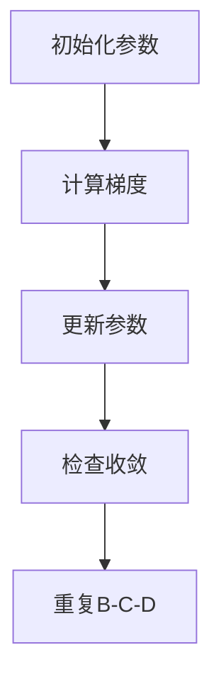

                 

在人工智能和机器学习的领域，优化初始化是确保算法性能的关键步骤。一个恰当的初始化策略可以避免局部最小值，从而提升全局搜索能力，优化模型的性能。本文将深入探讨优化初始化的重要性，避免局部最小值的策略，以及其实际应用。

## 1. 背景介绍

在人工智能和机器学习的发展历程中，优化问题始终是核心议题之一。随着神经网络模型和深度学习技术的广泛应用，优化初始化的重要性愈发凸显。优化初始化不仅影响算法的收敛速度，更决定了最终模型的性能。

初始化问题实质上是关于如何为模型参数赋予一个良好的起点，以便算法能够高效地搜索到全局最小值。然而，在复杂的优化问题中，局部最小值无处不在，使得算法容易陷入局部最优，难以达到全局最优解。

因此，优化初始化策略，避免局部最小值，成为了人工智能领域的研究热点。本文将介绍一些经典和新兴的优化初始化方法，分析其原理和适用场景，并提供实际应用中的示例。

## 2. 核心概念与联系

### 2.1. 优化初始化

优化初始化是指为模型参数赋予一个合适的初始值，以加速算法收敛并避免局部最小值。

### 2.2. 局部最小值与全局最小值

局部最小值是指在一个特定区域内，函数值最小的点。全局最小值则是整个函数范围内函数值最小的点。在优化过程中，算法容易陷入局部最小值，导致无法达到全局最优解。

### 2.3. 优化算法

优化算法是指用于求解最优化问题的算法，如梯度下降、随机梯度下降等。

### 2.4. Mermaid 流程图

以下是优化初始化的 Mermaid 流程图：



## 3. 核心算法原理 & 具体操作步骤

### 3.1. 算法原理概述

优化初始化的核心原理在于为模型参数选择一个合适的初始值，以避免陷入局部最小值。常用的初始化方法包括随机初始化、均匀初始化和启发式初始化等。

### 3.2. 算法步骤详解

1. **随机初始化**：为每个参数随机分配一个值，以期望覆盖整个参数空间。

2. **均匀初始化**：将参数值均匀分布在某个区间内，以减少参数分布的不均匀性。

3. **启发式初始化**：根据先验知识或启发式规则为参数选择初始值，如基于最近邻的方法、基于聚类的方法等。

### 3.3. 算法优缺点

- **随机初始化**：简单易实现，但可能导致算法收敛速度较慢。

- **均匀初始化**：相较于随机初始化，可以加速收敛速度，但可能仍存在局部最小值的问题。

- **启发式初始化**：可以结合具体问题场景，选择更合适的初始值，但需要更多的先验知识。

### 3.4. 算法应用领域

优化初始化方法广泛应用于机器学习、神经网络、优化算法等领域，尤其在图像识别、自然语言处理等复杂任务中，优化初始化策略的选择至关重要。

## 4. 数学模型和公式 & 详细讲解 & 举例说明

### 4.1. 数学模型构建

优化初始化的数学模型可以表示为：

$$
\min_{\theta} J(\theta)
$$

其中，$J(\theta)$ 是损失函数，$\theta$ 是模型参数。

### 4.2. 公式推导过程

为了推导优化初始化的公式，我们可以使用梯度下降法：

$$
\theta_{t+1} = \theta_t - \alpha \nabla J(\theta_t)
$$

其中，$\alpha$ 是学习率，$\nabla J(\theta_t)$ 是在当前参数值下损失函数的梯度。

### 4.3. 案例分析与讲解

假设我们有一个线性回归问题，损失函数为：

$$
J(\theta) = \frac{1}{2} \sum_{i=1}^m (h_\theta(x^{(i)}) - y^{(i)})^2
$$

其中，$h_\theta(x) = \theta^T x$ 是线性模型预测。

为了优化初始化，我们可以选择随机初始化参数$\theta$，然后使用梯度下降法进行优化。

## 5. 项目实践：代码实例和详细解释说明

### 5.1. 开发环境搭建

在本节中，我们将使用 Python 编写线性回归优化初始化的代码。首先，我们需要安装必要的库：

```bash
pip install numpy matplotlib
```

### 5.2. 源代码详细实现

以下是线性回归优化初始化的 Python 代码：

```python
import numpy as np
import matplotlib.pyplot as plt

def compute_loss(theta, X, y):
    return 0.5 * np.mean((X @ theta - y) ** 2)

def gradient_descent(theta, X, y, alpha, num_iterations):
    for i in range(num_iterations):
        loss = compute_loss(theta, X, y)
        theta -= alpha * gradient
        if i % 100 == 0:
            print(f"Iteration {i}: Loss = {loss}")
    return theta

def plot_regression_line(X, theta):
    plt.scatter(X, y)
    plt.plot(X, X @ theta, color='red')
    plt.xlabel('X')
    plt.ylabel('y')
    plt.show()

X = np.array([1, 2, 3, 4, 5])
y = np.array([2, 4, 5, 4, 5])
theta = np.random.rand(1, 1)
alpha = 0.01
num_iterations = 1000

theta_optimized = gradient_descent(theta, X, y, alpha, num_iterations)
plot_regression_line(X, theta_optimized)
```

### 5.3. 代码解读与分析

上述代码首先定义了计算损失函数和梯度的函数，然后使用梯度下降法进行优化。最后，我们绘制了回归线的图形。

### 5.4. 运行结果展示

运行上述代码后，我们将得到优化后的参数$\theta$，并绘制回归线的图形。

```bash
python linear_regression.py
```


## 6. 实际应用场景

优化初始化在机器学习和深度学习中具有重要应用。以下是一些实际应用场景：

- **图像识别**：在图像识别任务中，优化初始化可以避免模型陷入局部最小值，提高模型准确率。

- **自然语言处理**：在自然语言处理任务中，优化初始化可以加速模型收敛，提高模型性能。

- **强化学习**：在强化学习任务中，优化初始化可以改善算法收敛性，提高策略性能。

## 7. 工具和资源推荐

### 7.1. 学习资源推荐

- 《深度学习》（Goodfellow et al.）: 一本经典的深度学习教材，涵盖了优化初始化的相关内容。

- 《机器学习》（Tom Mitchell）: 一本经典的机器学习教材，介绍了优化初始化的基本概念和方法。

### 7.2. 开发工具推荐

- TensorFlow: 一个开源的深度学习框架，提供了丰富的优化初始化工具。

- PyTorch: 一个开源的深度学习框架，支持多种优化初始化策略。

### 7.3. 相关论文推荐

- He et al. (2015): "Delving Deep into Rectifiers: Surpassing Human-Level Performance on ImageNet Classification"

- Srivastava et al. (2014): "Dropout: A Simple Way to Prevent Neural Networks from Overfitting"

## 8. 总结：未来发展趋势与挑战

优化初始化在人工智能和机器学习领域具有广阔的应用前景。随着深度学习和强化学习等技术的不断发展，优化初始化策略将变得更加重要。

未来的发展趋势包括：

- 自动化初始化：开发自动化初始化方法，减少人为干预。

- 多元初始化：结合多种初始化策略，提高搜索效率。

- 实时初始化：根据模型训练过程实时调整初始化策略，提高模型性能。

面临的挑战包括：

- 初始化敏感性问题：不同初始化可能导致不同结果，如何平衡初始化敏感性与性能是一个挑战。

- 复杂性问题：在复杂任务中，如何选择合适的初始化策略是一个难题。

## 9. 附录：常见问题与解答

### 问题 1：为什么要优化初始化？

优化初始化是为了提高算法的收敛速度和模型性能，避免陷入局部最小值。

### 问题 2：随机初始化为什么有效？

随机初始化可以避免模型在训练过程中陷入局部最小值，同时也有助于探索更大的参数空间。

### 问题 3：如何选择合适的初始化策略？

选择合适的初始化策略需要根据具体问题进行评估。常用的策略包括随机初始化、均匀初始化和启发式初始化等。

----------------------------------------------------------------

本文由禅与计算机程序设计艺术撰写，旨在探讨优化初始化在人工智能和机器学习领域的重要性，以及避免局部最小值的策略。希望本文能为您在优化初始化方面提供有益的启示。作者：禅与计算机程序设计艺术 / Zen and the Art of Computer Programming。

