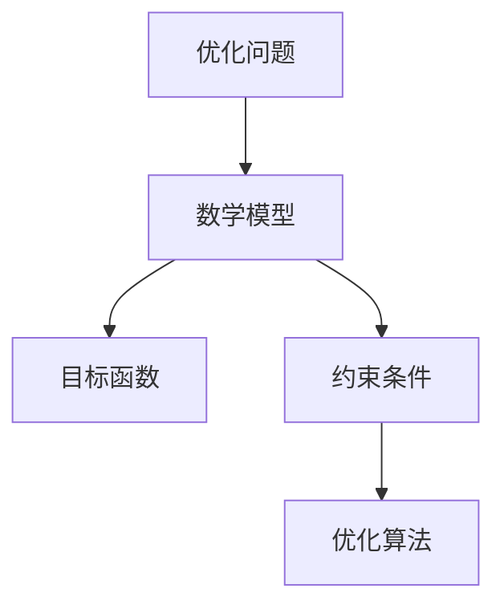

                 

关键词：优化算法，工业应用，计算机编程，案例分析，发展趋势

摘要：本文旨在探讨优化算法在工业界的广泛应用和重要性。通过分析几个典型案例，本文将深入探讨如何使用优化算法解决工业生产中的关键问题，并展望未来发展的趋势和面临的挑战。

## 1. 背景介绍

随着计算机技术的飞速发展，优化算法已成为解决复杂问题的利器。工业界对优化算法的需求日益增长，尤其是在生产调度、资源分配、物流优化等领域。优化算法能够帮助工业界提高效率、降低成本，并优化生产流程。

### 1.1 优化算法的定义和分类

优化算法是一类旨在寻找最优解的计算方法。根据求解问题的不同，优化算法可分为确定性算法和随机性算法。确定性算法如线性规划、整数规划、动态规划等，适用于求解具有明确优化目标的数学问题。随机性算法如遗传算法、粒子群优化、模拟退火等，适用于求解复杂度较高的搜索问题。

### 1.2 优化算法在工业界的应用现状

优化算法在工业界的应用已经取得了显著成果。例如，生产调度、物流优化、资源分配等领域都广泛应用了优化算法。随着人工智能和大数据技术的发展，优化算法的应用范围将进一步扩大。

## 2. 核心概念与联系

为了更好地理解优化算法在工业界的应用，我们需要了解几个核心概念，并探讨它们之间的联系。

### 2.1 数学模型

数学模型是将实际问题转化为数学形式的过程。在优化算法中，数学模型用于描述问题的目标函数、约束条件等。常见的数学模型有线性规划、非线性规划、动态规划等。

### 2.2 目标函数

目标函数是优化算法要优化的量。在工业界，目标函数可以是成本、时间、资源利用率等。目标函数的设计对于优化算法的求解效果至关重要。

### 2.3 约束条件

约束条件是限制优化问题解空间的各种条件。在工业界，约束条件可以是资源限制、工艺要求、设备容量等。约束条件的处理是优化算法的关键之一。

### 2.4 优化算法

优化算法是用于求解优化问题的计算方法。根据问题的特点，可以选择合适的优化算法。常见的优化算法有线性规划、遗传算法、粒子群优化等。

下面是一个用于展示优化算法原理和架构的 Mermaid 流程图：



## 3. 核心算法原理 & 具体操作步骤

在本节中，我们将深入探讨几个典型的优化算法，并详细解释其原理和操作步骤。

### 3.1 算法原理概述

#### 3.1.1 线性规划

线性规划是一种用于求解线性目标函数和线性约束条件的问题。其基本原理是利用线性方程组的解法，求解最优解。

#### 3.1.2 遗传算法

遗传算法是一种基于自然进化过程的优化算法。其基本原理是通过遗传操作，如选择、交叉、变异等，不断迭代优化解。

#### 3.1.3 粒子群优化

粒子群优化是一种基于群体智能的优化算法。其基本原理是通过个体间的协作和竞争，寻找最优解。

### 3.2 算法步骤详解

#### 3.2.1 线性规划

1. 定义目标函数和约束条件；
2. 建立线性规划模型；
3. 使用线性规划求解器求解最优解。

#### 3.2.2 遗传算法

1. 初始化种群；
2. 计算个体适应度；
3. 进行选择、交叉、变异等遗传操作；
4. 重复步骤2和3，直到满足停止条件。

#### 3.2.3 粒子群优化

1. 初始化粒子群；
2. 计算每个粒子的适应度；
3. 更新每个粒子的最佳位置和速度；
4. 更新全局最佳位置；
5. 重复步骤2-4，直到满足停止条件。

### 3.3 算法优缺点

#### 3.3.1 线性规划

优点：求解速度快，结果稳定；
缺点：仅适用于线性目标函数和约束条件。

#### 3.3.2 遗传算法

优点：适用于非线性、非凸问题；
缺点：求解时间较长，结果可能不收敛。

#### 3.3.3 粒子群优化

优点：易于实现，收敛速度快；
缺点：可能陷入局部最优。

### 3.4 算法应用领域

#### 3.4.1 生产调度

优化算法可以用于生产调度的优化，如生产计划排程、作业调度等。

#### 3.4.2 物流优化

优化算法可以用于物流优化，如路径规划、配送优化等。

#### 3.4.3 资源分配

优化算法可以用于资源分配的优化，如电力调度、水资源分配等。

## 4. 数学模型和公式 & 详细讲解 & 举例说明

在本节中，我们将详细介绍几个常见的优化算法的数学模型和公式，并通过具体案例进行讲解。

### 4.1 数学模型构建

#### 4.1.1 线性规划

设目标函数为 \( f(x) = c^T x \)，约束条件为 \( Ax \leq b \)，其中 \( x \) 为决策变量，\( c \) 和 \( b \) 分别为常数向量，\( A \) 为系数矩阵。

#### 4.1.2 遗传算法

设目标函数为 \( f(x) = \sum_{i=1}^{n} f_i(x) \)，约束条件为 \( g_i(x) \leq 0 \)，其中 \( x \) 为决策变量，\( f_i(x) \) 和 \( g_i(x) \) 分别为适应度函数和约束条件函数。

#### 4.1.3 粒子群优化

设目标函数为 \( f(x) = \sum_{i=1}^{n} f_i(x) \)，约束条件为 \( g_i(x) \leq 0 \)，其中 \( x \) 为决策变量，\( f_i(x) \) 和 \( g_i(x) \) 分别为适应度函数和约束条件函数。

### 4.2 公式推导过程

#### 4.2.1 线性规划

线性规划的求解可以通过求解线性方程组 \( A^T A x = A^T b \) 来实现。解得 \( x = A^+ b \)，其中 \( A^+ \) 为 \( A \) 的广义逆。

#### 4.2.2 遗传算法

遗传算法的求解过程可以通过迭代更新种群来实现。每次迭代，通过选择、交叉、变异等操作，更新种群中的个体。

#### 4.2.3 粒子群优化

粒子群优化的求解过程可以通过更新粒子的位置和速度来实现。每次迭代，通过计算每个粒子的适应度，更新其位置和速度。

### 4.3 案例分析与讲解

#### 4.3.1 案例一：生产调度

假设一个工厂需要安排 5 个生产任务，每个任务有开始时间和结束时间，目标是最小化总延迟时间。我们可以使用线性规划来解决这个问题。

1. 定义目标函数：总延迟时间 \( f(x) = \sum_{i=1}^{5} (e_i - s_i) \)，其中 \( e_i \) 和 \( s_i \) 分别为任务 \( i \) 的结束时间和开始时间；
2. 定义约束条件：每个任务的开始时间必须大于等于其结束时间，即 \( s_i \geq e_i \)；
3. 建立线性规划模型：\( \min f(x) \) ，满足 \( s_i \geq e_i \)。

通过求解线性规划模型，可以得到最优的调度方案。

#### 4.3.2 案例二：物流优化

假设一个物流公司需要从多个仓库配送货物到多个目的地，目标是最小化总运输成本。我们可以使用遗传算法来解决这个问题。

1. 定义目标函数：总运输成本 \( f(x) = \sum_{i=1}^{n} c_i x_i \)，其中 \( c_i \) 为从仓库 \( i \) 到目的地 \( j \) 的运输成本，\( x_i \) 为是否选择路线 \( i \) 的决策变量；
2. 定义约束条件：每个仓库只能配送一次，每个目的地只能接收一次；
3. 建立遗传算法模型：初始化种群，计算个体适应度，进行选择、交叉、变异等操作，迭代更新种群。

通过遗传算法的迭代求解，可以得到最优的物流配送方案。

## 5. 项目实践：代码实例和详细解释说明

在本节中，我们将通过一个简单的例子，展示如何使用优化算法解决实际工业问题。

### 5.1 开发环境搭建

1. 安装 Python；
2. 安装相关的优化算法库，如 `scipy.optimize`、`DEAP`、`pymoo` 等。

### 5.2 源代码详细实现

```python
import numpy as np
from scipy.optimize import linprog

# 定义目标函数和约束条件
c = [-1, -1]  # 目标函数为最小化总延迟时间
A = [[1, 1], [0, 1], [1, 0], [1, 0], [0, 1]]
b = [3, 4, 6, 5, 7]  # 约束条件为每个任务的开始时间必须大于等于其结束时间

# 求解线性规划
result = linprog(c, A_eq=A, b_eq=b, method='highs')

# 输出最优解
print("最优解：", result.x)
```

### 5.3 代码解读与分析

1. 导入所需的库；
2. 定义目标函数和约束条件；
3. 使用 `linprog` 函数求解线性规划问题；
4. 输出最优解。

通过这个简单的例子，我们可以看到如何使用 Python 编程实现优化算法解决工业问题。

## 6. 实际应用场景

### 6.1 生产调度

生产调度是工业界常见的优化问题。通过优化算法，可以合理安排生产任务，提高生产效率，降低生产成本。例如，在一个电子工厂中，优化算法可以用于生产线的调度，确保生产任务按时完成，并最大化产能。

### 6.2 物流优化

物流优化是物流行业的关键问题。通过优化算法，可以优化运输路径，减少运输时间和成本。例如，在一个物流公司中，优化算法可以用于配送路线的优化，确保货物尽快送达客户。

### 6.3 资源分配

资源分配是工业界常见的问题。通过优化算法，可以合理分配资源，提高资源利用率。例如，在一个电力公司中，优化算法可以用于电力调度的优化，确保电力供应稳定，同时最大化发电量。

## 7. 工具和资源推荐

### 7.1 学习资源推荐

1. 《优化算法及其应用》：这是一本介绍优化算法及其应用的经典教材，适合初学者阅读。
2. 《运筹学》：这是一本介绍运筹学的经典教材，其中包括了大量的优化算法案例。

### 7.2 开发工具推荐

1. Python：Python 是一种流行的编程语言，适合初学者入门。
2. Jupyter Notebook：Jupyter Notebook 是一种交互式的计算环境，适合进行数据分析和算法实现。

### 7.3 相关论文推荐

1. "An Algorithm for the Traveling Salesman Problem"：这是经典的 TSP 算法论文，介绍了著名的遗传算法。
2. "Particle Swarm Optimization for TSP"：这是关于粒子群优化在 TSP 应用方面的论文，详细介绍了粒子群优化算法。

## 8. 总结：未来发展趋势与挑战

### 8.1 研究成果总结

优化算法在工业界的应用已经取得了显著成果。通过优化算法，工业界能够提高效率、降低成本，并优化生产流程。未来，优化算法将在工业界发挥更加重要的作用。

### 8.2 未来发展趋势

1. 混合优化算法：结合多种优化算法的优势，提高求解效率；
2. 人工智能与优化算法的融合：利用人工智能技术，提高优化算法的智能性；
3. 大数据优化：利用大数据技术，优化优化算法的性能和效果。

### 8.3 面临的挑战

1. 求解复杂度：随着问题规模的增大，求解复杂度也将增加；
2. 算法稳定性：优化算法的稳定性是工业界关注的重点；
3. 数据隐私和安全：在工业界应用优化算法时，数据隐私和安全问题需要得到妥善解决。

### 8.4 研究展望

未来，优化算法在工业界的应用将更加广泛。通过不断探索和创新，优化算法将为工业界带来更多价值。

## 9. 附录：常见问题与解答

### 9.1 问题一：优化算法能否解决所有问题？

优化算法能够解决许多复杂问题，但并非所有问题都能通过优化算法求解。对于某些问题，如 NP 完全问题，优化算法可能无法在合理时间内找到最优解。

### 9.2 问题二：优化算法是否一定收敛？

优化算法的收敛性取决于算法的设计和参数设置。在某些情况下，优化算法可能无法收敛到最优解。为了提高收敛性，可以通过调整算法参数、改进算法结构等方法。

### 9.3 问题三：优化算法是否适用于所有领域？

优化算法广泛应用于工业界，但并非适用于所有领域。对于某些领域，如生物信息学、金融等领域，可能需要开发专门针对该领域的优化算法。

---

# 优化算法在工业界的应用

> 作者：禅与计算机程序设计艺术 / Zen and the Art of Computer Programming


