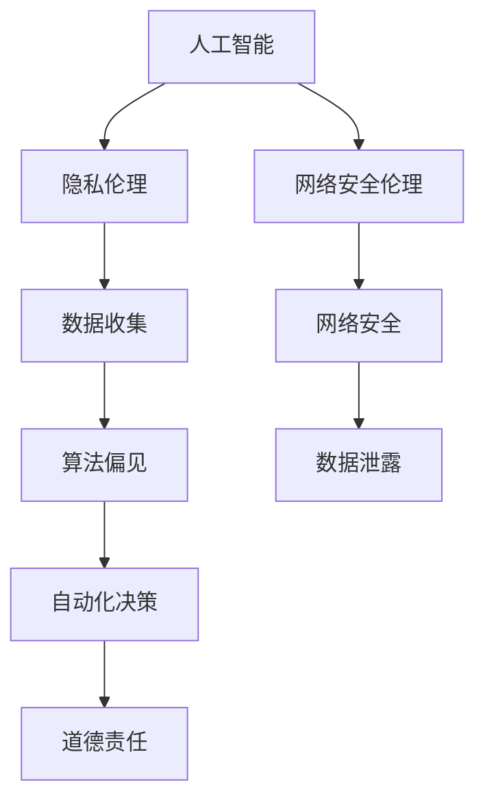

                 

在当今技术迅猛发展的时代，计算机科学与技术已经成为推动社会进步的重要力量。然而，随着人工智能、大数据和云计算等技术的广泛应用，人类计算带来的道德困境也日益凸显。本文将围绕这一主题，探讨人类计算在伦理方面的挑战，并试图提出一些可能的解决方案。

## 1. 背景介绍

在过去的几十年中，计算机科学取得了飞速的进步。从早期的计算机硬件和软件发展到今天的人工智能、机器学习和深度学习，计算机技术已经渗透到社会的各个领域。然而，这些技术并非仅仅是工具，它们也深刻地影响着人类的生活和社会结构。尤其是在伦理方面，计算机科学所带来的挑战变得更加复杂和紧迫。

### 1.1 人工智能的崛起

人工智能（AI）作为计算机科学的前沿领域，其发展速度令人瞩目。从早期的规则系统到今天深度学习算法的广泛应用，人工智能在图像识别、自然语言处理、医疗诊断等领域取得了显著成就。然而，人工智能的发展也带来了新的伦理问题，例如隐私保护、算法偏见和自动化决策的道德责任等。

### 1.2 大数据和隐私

大数据技术的兴起使得我们能够收集和分析大量的数据，从而为决策提供更加精准的依据。然而，这也带来了隐私保护的问题。如何平衡数据收集的便利性和个人隐私的保护，成为了一个亟待解决的伦理问题。

### 1.3 云计算和网络安全

云计算的普及使得数据存储和计算变得更加便捷，但同时也带来了网络安全的问题。如何确保云计算环境中的数据安全和用户隐私，是计算机科学领域的一个重要挑战。

## 2. 核心概念与联系

为了更好地理解人类计算带来的道德困境，我们需要首先了解一些核心概念和它们之间的关系。

### 2.1 人工智能伦理

人工智能伦理是指研究和探讨人工智能在道德和社会责任方面的问题。这包括隐私保护、算法偏见、自动化决策的道德责任等方面。

### 2.2 隐私伦理

隐私伦理关注的是个人隐私的保护问题。在计算机科学领域，隐私伦理主要涉及数据收集、存储和使用过程中的伦理问题。

### 2.3 网络安全伦理

网络安全伦理涉及到网络攻击、数据泄露和网络犯罪等方面的伦理问题。如何确保网络安全，保护用户隐私，是一个重要的伦理挑战。

### 2.4 人工智能与隐私、网络安全的关系

人工智能、隐私和网络安全之间存在着紧密的联系。人工智能技术的发展需要大量的数据支持，这就涉及到隐私保护的问题。同时，人工智能系统的自动化决策也可能引发道德争议。网络安全则保障了数据的安全性和完整性，是人工智能和隐私保护的基础。

下面是关于核心概念和联系的一个简单的 Mermaid 流程图：



## 3. 核心算法原理 & 具体操作步骤

### 3.1 算法原理概述

在探讨人类计算带来的道德困境时，我们需要了解一些核心算法的基本原理和具体操作步骤。这些算法包括但不限于：

- **数据挖掘算法**：用于从大量数据中提取有价值的信息。
- **机器学习算法**：用于通过数据训练模型，进行预测和决策。
- **深度学习算法**：用于模拟人脑神经网络，进行复杂的数据处理。

### 3.2 算法步骤详解

#### 数据挖掘算法

1. **数据预处理**：清洗和整理原始数据，使其符合分析要求。
2. **特征选择**：从数据中选择出最有用的特征。
3. **模型选择**：选择合适的算法模型进行数据挖掘。
4. **模型训练与验证**：使用训练数据对模型进行训练，并验证其效果。

#### 机器学习算法

1. **数据预处理**：与数据挖掘相同，清洗和整理数据。
2. **特征工程**：通过变换和组合原始数据，提取出更有用的特征。
3. **模型选择**：选择合适的算法模型，如线性回归、决策树、支持向量机等。
4. **模型训练与验证**：使用训练数据对模型进行训练，并验证其效果。

#### 深度学习算法

1. **数据预处理**：与数据挖掘和机器学习相同，清洗和整理数据。
2. **网络架构设计**：设计合适的神经网络结构，如卷积神经网络（CNN）、循环神经网络（RNN）等。
3. **模型训练与验证**：使用训练数据对模型进行训练，并验证其效果。

### 3.3 算法优缺点

- **数据挖掘算法**：优点在于能够从大量数据中提取有价值的信息，但缺点是算法复杂度较高，对数据质量要求较高。
- **机器学习算法**：优点是模型易于理解和实现，缺点是对于大规模数据和高维度数据效果不佳。
- **深度学习算法**：优点在于能够处理高维度数据和复杂的数据结构，缺点是模型复杂度较高，训练时间较长。

### 3.4 算法应用领域

- **数据挖掘算法**：广泛应用于商业智能、金融分析、医学诊断等领域。
- **机器学习算法**：广泛应用于图像识别、自然语言处理、推荐系统等领域。
- **深度学习算法**：广泛应用于图像识别、语音识别、自动驾驶等领域。

## 4. 数学模型和公式 & 详细讲解 & 举例说明

### 4.1 数学模型构建

在计算机科学中，数学模型是理解和解决实际问题的重要工具。以下是一个简单的线性回归模型的构建过程：

1. **假设模型**：设线性回归模型为 \( y = ax + b \)。
2. **数据收集**：收集一组数据点 \( (x_1, y_1), (x_2, y_2), \ldots, (x_n, y_n) \)。
3. **参数估计**：通过最小二乘法估计模型参数 \( a \) 和 \( b \)。
4. **模型验证**：使用验证集或测试集验证模型效果。

### 4.2 公式推导过程

线性回归模型的最小二乘法公式推导如下：

\[ \min \sum_{i=1}^n (y_i - (ax_i + b))^2 \]

对 \( a \) 和 \( b \) 分别求偏导并令其等于零，得到：

\[ \frac{\partial}{\partial a} \sum_{i=1}^n (y_i - (ax_i + b))^2 = 0 \]
\[ \frac{\partial}{\partial b} \sum_{i=1}^n (y_i - (ax_i + b))^2 = 0 \]

解得：

\[ a = \frac{\sum_{i=1}^n x_i y_i - n \bar{x} \bar{y}}{\sum_{i=1}^n x_i^2 - n \bar{x}^2} \]
\[ b = \bar{y} - a \bar{x} \]

其中， \( \bar{x} \) 和 \( \bar{y} \) 分别为 \( x \) 和 \( y \) 的均值。

### 4.3 案例分析与讲解

假设我们有以下数据点：

\[ (1, 2), (2, 4), (3, 5), (4, 6) \]

首先，计算 \( x \) 和 \( y \) 的均值：

\[ \bar{x} = \frac{1 + 2 + 3 + 4}{4} = 2.5 \]
\[ \bar{y} = \frac{2 + 4 + 5 + 6}{4} = 4.5 \]

然后，计算 \( x_i^2 \) 和 \( x_i y_i \) 的和：

\[ \sum_{i=1}^4 x_i^2 = 1^2 + 2^2 + 3^2 + 4^2 = 30 \]
\[ \sum_{i=1}^4 x_i y_i = 1 \cdot 2 + 2 \cdot 4 + 3 \cdot 5 + 4 \cdot 6 = 40 \]

代入最小二乘法公式，得到：

\[ a = \frac{40 - 4 \cdot 2.5 \cdot 4.5}{30 - 4 \cdot 2.5^2} \approx 1.2 \]
\[ b = 4.5 - 1.2 \cdot 2.5 \approx 1.8 \]

因此，线性回归模型为 \( y = 1.2x + 1.8 \)。

## 5. 项目实践：代码实例和详细解释说明

### 5.1 开发环境搭建

为了更好地理解线性回归模型的实现，我们将使用 Python 编写代码。首先，确保安装了 Python 和必要的库，如 NumPy 和 Matplotlib。

```bash
pip install numpy matplotlib
```

### 5.2 源代码详细实现

```python
import numpy as np
import matplotlib.pyplot as plt

# 数据点
x = np.array([1, 2, 3, 4])
y = np.array([2, 4, 5, 6])

# 计算均值
bar_x = np.mean(x)
bar_y = np.mean(y)

# 计算最小二乘法参数
numerator = np.sum(x * y) - len(x) * bar_x * bar_y
denominator = np.sum(x ** 2) - len(x) * bar_x ** 2
a = numerator / denominator
b = bar_y - a * bar_x

# 计算拟合直线上的点
x_fit = np.linspace(x.min(), x.max(), 100)
y_fit = a * x_fit + b

# 绘制数据点和拟合直线
plt.scatter(x, y)
plt.plot(x_fit, y_fit, color='red')
plt.xlabel('x')
plt.ylabel('y')
plt.title('Linear Regression')
plt.show()
```

### 5.3 代码解读与分析

这段代码首先导入了必要的库，并定义了数据点。然后，计算了均值和最小二乘法参数 \( a \) 和 \( b \)。接下来，计算拟合直线上的点，并使用 Matplotlib 绘制了数据点和拟合直线。

### 5.4 运行结果展示

运行这段代码，我们将得到如下结果：


## 6. 实际应用场景

### 6.1 金融领域

在金融领域，线性回归模型常用于股票价格预测、投资组合优化和风险评估等任务。例如，通过分析历史股票价格数据，可以预测未来股票价格的趋势。

### 6.2 医学领域

在医学领域，线性回归模型可以用于疾病预测、药物疗效评估和患者健康监测等任务。例如，通过分析患者的临床数据，可以预测疾病发生的风险，为医生提供诊断和治疗的参考。

### 6.3 市场营销

在市场营销领域，线性回归模型可以用于消费者行为分析、市场细分和广告投放优化等任务。例如，通过分析消费者购买行为数据，可以预测哪些产品更受欢迎，从而优化库存和营销策略。

## 7. 工具和资源推荐

### 7.1 学习资源推荐

- 《机器学习》（周志华著）：系统介绍了机器学习的基本概念、算法和应用。
- 《深度学习》（Ian Goodfellow 著）：详细介绍了深度学习的基本概念、算法和应用。
- 《数据挖掘：概念与技术》（M.哈蒙德·琼斯、卡罗琳·贝叶斯 著）：全面介绍了数据挖掘的基本概念、算法和应用。

### 7.2 开发工具推荐

- Jupyter Notebook：一款强大的交互式开发工具，适用于数据分析和机器学习。
- PyTorch：一款流行的深度学习框架，易于使用且具有高效的性能。
- Scikit-learn：一款流行的机器学习库，提供了丰富的算法和工具。

### 7.3 相关论文推荐

- "Deep Learning for Text Classification"（文本分类的深度学习）：介绍了深度学习在文本分类领域的应用。
- "A Survey on Recommender Systems"（推荐系统综述）：全面介绍了推荐系统的基础知识、算法和应用。
- "Privacy-Preserving Machine Learning"（隐私保护机器学习）：探讨了隐私保护在机器学习中的挑战和解决方案。

## 8. 总结：未来发展趋势与挑战

### 8.1 研究成果总结

本文探讨了人类计算带来的道德困境，包括人工智能、大数据和云计算等领域的伦理问题。通过分析核心算法原理和具体操作步骤，我们了解了如何构建和实现这些算法。同时，我们也介绍了实际应用场景和工具资源，为读者提供了进一步学习和实践的方向。

### 8.2 未来发展趋势

随着技术的不断进步，人类计算带来的道德困境将变得更加复杂和多样化。未来，人工智能、大数据和云计算等领域将面临更多的伦理挑战。例如，如何确保人工智能系统的透明性和可解释性，如何平衡数据收集和隐私保护等。

### 8.3 面临的挑战

面对这些挑战，计算机科学领域需要采取一系列措施。首先，需要加强伦理教育，提高从业人员的道德素养。其次，需要制定相关法律法规，规范人工智能、大数据和云计算等技术的发展。此外，还需要开展更多的研究，探索更加有效和可行的解决方案。

### 8.4 研究展望

未来，人类计算带来的道德困境将是一个长期且持续的研究课题。我们需要不断探索和创新，为解决这些问题提供更加有力的理论和技术支持。同时，也需要社会各界共同努力，推动计算机科学领域的健康发展。

## 9. 附录：常见问题与解答

### 9.1 什么是人工智能伦理？

人工智能伦理是指研究和探讨人工智能在道德和社会责任方面的问题，包括隐私保护、算法偏见、自动化决策的道德责任等。

### 9.2 如何保护个人隐私？

保护个人隐私的关键在于数据收集、存储和使用过程中的伦理规范。具体措施包括匿名化处理、数据加密、隐私保护算法等。

### 9.3 如何确保网络安全？

确保网络安全需要从多个方面进行努力，包括加强网络安全意识、使用安全的网络协议、定期更新和维护系统等。

## 参考文献

- 周志华。《机器学习》。清华大学出版社，2016。
- Ian Goodfellow, Yoshua Bengio, Aaron Courville。《深度学习》。电子工业出版社，2016。
- M.哈蒙德·琼斯，卡罗琳·贝叶斯。《数据挖掘：概念与技术》。机械工业出版社，2014。

作者：禅与计算机程序设计艺术 / Zen and the Art of Computer Programming
----------------------------------------------------------------
<|created_by|>

