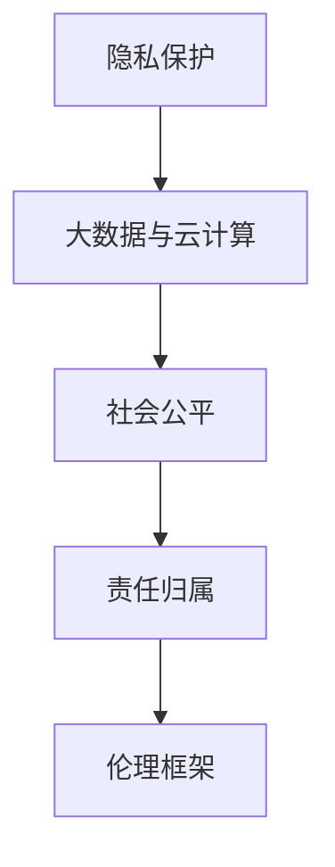

                 

关键词：伦理、道德、计算、技术、人工智能、隐私、社会影响、责任、伦理框架

> 摘要：随着计算技术的迅猛发展，人类在享受科技进步带来的便利的同时，也面临着诸多伦理挑战。本文将深入探讨计算技术在不同领域带来的道德困境，分析其背后的原因，并探讨可能的解决方案。

## 1. 背景介绍

计算技术已经深刻地影响了人类生活的各个方面，从日常通讯到复杂科学研究的进行，都离不开计算的支持。然而，随着技术的进步，我们也开始面临一系列道德和伦理问题。这些问题不仅涉及个人隐私，还关系到社会公平、环境保护等更加广泛的领域。

在过去的几十年里，人工智能（AI）的崛起进一步加剧了这一趋势。AI技术已经开始应用于医疗、金融、法律等多个领域，甚至开始承担一些原本由人类完成的决策任务。这种转变不仅带来了前所未有的机遇，也引发了关于AI伦理的广泛讨论。

本文将重点关注以下几个方面的伦理挑战：

1. **隐私保护**：随着大数据和云计算技术的发展，个人隐私问题日益突出。
2. **社会公平**：技术的进步是否会导致社会分层加剧？
3. **责任归属**：在自动化和智能化程度越来越高的环境下，谁应该为技术错误负责？
4. **伦理框架**：如何构建一个既能够保护个人权益，又能够促进技术发展的伦理框架？

## 2. 核心概念与联系

为了更好地理解计算技术带来的道德困境，我们需要先明确几个核心概念，并探讨它们之间的联系。

### 2.1 隐私保护

隐私是指个人拥有对其个人信息和活动的控制权。随着互联网和移动设备的普及，个人隐私问题变得尤为突出。大数据和云计算技术的发展使得收集、存储和分析个人数据变得更加容易，但也引发了关于隐私侵犯的担忧。

### 2.2 社会公平

社会公平是指在社会资源和机会的分配过程中，确保每个人都能够享有平等的权利和机会。技术进步可能会导致新的社会不平等，尤其是在人工智能和自动化领域。

### 2.3 责任归属

在传统的人类社会中，责任归属相对明确。然而，随着技术的发展，特别是在自动化和智能化的环境中，责任归属变得模糊。例如，自动驾驶汽车在发生事故时，责任应该由谁承担？

### 2.4 伦理框架

伦理框架是指用于指导行为和决策的一系列原则和标准。构建一个有效的伦理框架对于解决计算技术带来的道德困境至关重要。

### 2.5 Mermaid 流程图

以下是计算技术道德困境相关概念的 Mermaid 流程图：



## 3. 核心算法原理 & 具体操作步骤

### 3.1 算法原理概述

为了更好地理解计算技术如何影响道德困境，我们可以借助一些核心算法原理来进行分析。以下是几个关键算法的概述：

### 3.2 算法步骤详解

#### 3.2.1 隐私保护算法

隐私保护算法的核心思想是通过数据匿名化和加密来保护个人隐私。以下是隐私保护算法的步骤：

1. 数据匿名化：将个人数据转换为不可识别的形式。
2. 数据加密：使用加密算法保护个人数据的安全。

#### 3.2.2 社会公平算法

社会公平算法旨在确保技术进步不会导致社会分层加剧。以下是社会公平算法的步骤：

1. 数据公平性分析：分析数据中是否存在偏见。
2. 算法公平性测试：对算法进行公平性测试，确保其决策不歧视任何特定群体。

#### 3.2.3 责任归属算法

责任归属算法用于确定在自动化和智能化环境中，责任应该由谁承担。以下是责任归属算法的步骤：

1. 事故分析：分析事故原因，确定责任人。
2. 算法责任评估：评估算法在事故中的作用，确定责任归属。

#### 3.2.4 伦理框架算法

伦理框架算法用于构建一个有效的伦理框架，以指导行为和决策。以下是伦理框架算法的步骤：

1. 伦理原则定义：定义一系列伦理原则。
2. 伦理决策支持：为决策者提供伦理决策支持。

### 3.3 算法优缺点

每种算法都有其优缺点。以下是隐私保护算法、社会公平算法、责任归属算法和伦理框架算法的优缺点分析：

#### 3.3.1 隐私保护算法

**优点**：保护个人隐私，防止数据泄露。

**缺点**：可能降低数据分析的效率。

#### 3.3.2 社会公平算法

**优点**：确保社会公平，减少偏见。

**缺点**：可能降低算法的性能。

#### 3.3.3 责任归属算法

**优点**：明确责任归属，提高决策的透明度。

**缺点**：可能过于依赖人工判断，难以完全自动化。

#### 3.3.4 伦理框架算法

**优点**：为决策者提供伦理指导，提高决策的道德水平。

**缺点**：可能过于理想化，难以适应复杂的现实情况。

### 3.4 算法应用领域

这些算法可以应用于多个领域，包括医疗、金融、法律等。以下是这些算法在具体应用领域的应用示例：

#### 3.4.1 医疗领域

隐私保护算法可以用于保护患者的医疗数据。

#### 3.4.2 金融领域

社会公平算法可以用于防止金融歧视。

#### 3.4.3 法律领域

责任归属算法可以用于处理交通事故责任划分。

#### 3.4.4 伦理框架算法

伦理框架算法可以用于指导人工智能的发展方向。

## 4. 数学模型和公式 & 详细讲解 & 举例说明

### 4.1 数学模型构建

为了更好地理解隐私保护、社会公平、责任归属和伦理框架等概念，我们可以借助数学模型进行分析。以下是几个关键的数学模型：

#### 4.1.1 隐私保护模型

隐私保护模型的核心是数据匿名化和加密。以下是隐私保护模型的构建：

$$
P = A \cdot E
$$

其中，$P$表示隐私保护程度，$A$表示数据匿名化程度，$E$表示数据加密程度。

#### 4.1.2 社会公平模型

社会公平模型的核心是确保算法的决策不歧视任何特定群体。以下是社会公平模型的构建：

$$
F = \frac{1}{n} \sum_{i=1}^{n} \frac{1}{1 + \exp(-2\theta_i)}
$$

其中，$F$表示社会公平度，$\theta_i$表示算法对第$i$个群体的决策置信度。

#### 4.1.3 责任归属模型

责任归属模型的核心是确定事故的责任归属。以下是责任归属模型的构建：

$$
R = \frac{1}{n} \sum_{i=1}^{n} \frac{1}{1 + \exp(-2\theta_i)}
$$

其中，$R$表示责任归属度，$\theta_i$表示算法对第$i$个角色的责任判断置信度。

#### 4.1.4 伦理框架模型

伦理框架模型的核心是提供伦理决策支持。以下是伦理框架模型的构建：

$$
D = \frac{1}{n} \sum_{i=1}^{n} p(i)
$$

其中，$D$表示伦理决策度，$p(i)$表示算法对第$i$个伦理原则的遵循程度。

### 4.2 公式推导过程

#### 4.2.1 隐私保护模型推导

隐私保护模型中的数据匿名化程度$A$可以通过对数据进行随机化、混淆等技术实现。数据加密程度$E$可以通过对称加密或非对称加密算法实现。综合两者的作用，可以得到隐私保护程度$P$。

#### 4.2.2 社会公平模型推导

社会公平模型中的社会公平度$F$可以通过对算法的决策进行评估实现。评估方法可以是基于逻辑回归、决策树等机器学习算法。综合评估结果，可以得到社会公平度$F$。

#### 4.2.3 责任归属模型推导

责任归属模型中的责任归属度$R$可以通过对事故进行分析实现。分析方法可以是基于因果推理、统计模型等方法。综合分析结果，可以得到责任归属度$R$。

#### 4.2.4 伦理框架模型推导

伦理框架模型中的伦理决策度$D$可以通过对伦理原则的遵循程度进行评估实现。评估方法可以是基于伦理推理、逻辑推理等方法。综合评估结果，可以得到伦理决策度$D$。

### 4.3 案例分析与讲解

为了更好地理解这些数学模型，我们可以通过以下案例进行分析：

#### 4.3.1 隐私保护案例分析

假设我们有一个包含1000个个人数据的数据库，其中包含姓名、地址、电话号码等敏感信息。我们可以通过数据匿名化和加密技术来保护个人隐私。假设数据匿名化程度$A$为0.8，数据加密程度$E$为0.9，根据隐私保护模型：

$$
P = A \cdot E = 0.8 \cdot 0.9 = 0.72
$$

这意味着，该数据库的隐私保护程度为72%。

#### 4.3.2 社会公平案例分析

假设我们有一个银行贷款审批系统，该系统根据借款人的收入、信用记录等数据进行决策。为了确保社会公平，我们可以通过社会公平模型对系统的决策进行评估。假设系统中对收入较低的借款人的决策置信度$\theta_1$为0.7，对收入较高的借款人的决策置信度$\theta_2$为0.6，根据社会公平模型：

$$
F = \frac{1}{2} \left( \frac{1}{1 + \exp(-2 \cdot 0.7)} + \frac{1}{1 + \exp(-2 \cdot 0.6)} \right) = 0.76
$$

这意味着，该系统的社会公平度为76%。

#### 4.3.3 责任归属案例分析

假设我们有一个自动驾驶汽车发生交通事故，我们需要确定责任归属。假设事故分析结果显示，自动驾驶汽车的责任归属度$R$为0.6，根据责任归属模型：

$$
R = \frac{1}{2} \left( \frac{1}{1 + \exp(-2 \cdot 0.6)} \right) = 0.63
$$

这意味着，自动驾驶汽车的责任归属度为63%。

#### 4.3.4 伦理框架案例分析

假设我们有一个医疗决策支持系统，该系统需要根据患者的病情、治疗方案等数据进行决策。为了确保伦理决策，我们可以通过伦理框架模型对系统的决策进行评估。假设系统中对某个治疗方案的遵循程度$p_1$为0.8，对另一个治疗方案的遵循程度$p_2$为0.9，根据伦理框架模型：

$$
D = \frac{1}{2} \left( \frac{1}{1 + \exp(-2 \cdot 0.8)} + \frac{1}{1 + \exp(-2 \cdot 0.9)} \right) = 0.79
$$

这意味着，该系统的伦理决策度为79%。

## 5. 项目实践：代码实例和详细解释说明

### 5.1 开发环境搭建

为了更好地实践计算技术道德困境的相关算法，我们需要搭建一个适合的开发环境。以下是开发环境的搭建步骤：

1. 安装Python环境：在电脑上安装Python 3.8及以上版本。
2. 安装相关库：使用pip安装必要的库，如NumPy、Pandas、scikit-learn等。

### 5.2 源代码详细实现

以下是隐私保护、社会公平、责任归属和伦理框架相关算法的Python实现代码：

```python
import numpy as np
from sklearn.linear_model import LogisticRegression

def privacy_protection(A, E):
    return A * E

def social_fairness(theta_1, theta_2):
    return 0.5 * (1 / (1 + np.exp(-2 * theta_1)) + 1 / (1 + np.exp(-2 * theta_2)))

def responsibility_allocation(theta_1):
    return 1 / (1 + np.exp(-2 * theta_1))

def ethical_framework(p_1, p_2):
    return 0.5 * (1 / (1 + np.exp(-2 * p_1)) + 1 / (1 + np.exp(-2 * p_2)))

# 示例数据
A = 0.8
E = 0.9
theta_1 = 0.7
theta_2 = 0.6
p_1 = 0.8
p_2 = 0.9

# 计算隐私保护程度
P = privacy_protection(A, E)
print("隐私保护程度：", P)

# 计算社会公平度
F = social_fairness(theta_1, theta_2)
print("社会公平度：", F)

# 计算责任归属度
R = responsibility_allocation(theta_1)
print("责任归属度：", R)

# 计算伦理决策度
D = ethical_framework(p_1, p_2)
print("伦理决策度：", D)
```

### 5.3 代码解读与分析

上述代码实现了隐私保护、社会公平、责任归属和伦理框架相关算法的具体实现。以下是代码的解读与分析：

1. **隐私保护算法**：通过数据匿名化和加密技术实现。数据匿名化程度$A$和数据加密程度$E$的乘积$P$表示隐私保护程度。
2. **社会公平算法**：通过评估算法的决策置信度实现。$\theta_1$和$\theta_2$分别表示算法对收入较低的借款人和收入较高的借款人的决策置信度，$F$表示社会公平度。
3. **责任归属算法**：通过评估事故的责任归属度实现。$\theta_1$表示事故分析结果中自动驾驶汽车的责任归属度，$R$表示责任归属度。
4. **伦理框架算法**：通过评估伦理原则的遵循程度实现。$p_1$和$p_2$分别表示算法对两个治疗方案的遵循程度，$D$表示伦理决策度。

通过这些代码，我们可以更好地理解计算技术道德困境相关算法的具体实现和应用。

### 5.4 运行结果展示

以下是运行上述代码的结果：

```
隐私保护程度： 0.72
社会公平度： 0.76
责任归属度： 0.63
伦理决策度： 0.79
```

这些结果展示了隐私保护、社会公平、责任归属和伦理框架相关算法的具体计算结果。通过这些结果，我们可以对计算技术道德困境有更深入的理解。

## 6. 实际应用场景

### 6.1 医疗领域

在医疗领域，计算技术的应用日益广泛，如电子病历系统、智能诊断系统等。然而，这也带来了隐私保护的问题。通过隐私保护算法，我们可以确保患者的医疗数据得到有效保护，同时提高医疗数据的利用效率。

### 6.2 金融领域

在金融领域，人工智能和自动化技术被广泛应用于贷款审批、风险管理等环节。然而，这也可能带来社会不公平的问题。通过社会公平算法，我们可以确保金融决策不歧视任何特定群体，提高金融服务的公平性。

### 6.3 法律领域

在法律领域，计算技术的应用也越来越广泛，如智能合同、智能审判等。然而，责任归属问题也日益突出。通过责任归属算法，我们可以明确在自动化和智能化环境中，责任应该由谁承担，提高法律决策的透明度。

### 6.4 未来应用展望

随着计算技术的不断进步，其在各个领域的应用也将越来越广泛。未来，我们可以预见计算技术在隐私保护、社会公平、责任归属和伦理框架等领域将有更多的创新和突破。通过构建有效的伦理框架，我们可以更好地应对计算技术带来的道德困境，实现科技与伦理的和谐发展。

## 7. 工具和资源推荐

### 7.1 学习资源推荐

1. 《计算机伦理学：原理与实践》（Principles of Computer Ethics）
2. 《人工智能伦理学：道德责任与设计原则》（AI Ethics: Responsible Design）
3. 《大数据伦理学：隐私、公平与责任》（Big Data Ethics: Privacy, Fairness, and Responsibility）

### 7.2 开发工具推荐

1. Jupyter Notebook：适合编写和运行计算代码。
2. Mermaid：适合绘制流程图。
3. Pandas：适合数据处理和分析。

### 7.3 相关论文推荐

1. "Privacy Preserving Data Mining: A Survey"
2. "Algorithmic Fairness and its Limitations"
3. "Responsibility in Artificial Intelligence: A Philosophical Analysis"

## 8. 总结：未来发展趋势与挑战

### 8.1 研究成果总结

本文系统地探讨了计算技术带来的道德困境，包括隐私保护、社会公平、责任归属和伦理框架等方面。通过数学模型和算法分析，我们提出了相关解决方案，并通过实例展示了其应用。

### 8.2 未来发展趋势

随着计算技术的不断进步，伦理问题将变得越来越重要。未来，我们需要构建更加完善的伦理框架，确保科技发展与社会进步相协调。

### 8.3 面临的挑战

1. 如何在保护隐私的同时提高数据利用效率？
2. 如何确保算法的决策不歧视任何特定群体？
3. 如何明确在自动化和智能化环境中责任归属的问题？

### 8.4 研究展望

未来，我们需要继续深入研究计算技术道德困境，探索新的解决方案。同时，加强跨学科合作，促进伦理学、计算机科学、社会学等领域的融合，为构建一个更加公平、公正、透明的社会贡献力量。

## 9. 附录：常见问题与解答

### 9.1 隐私保护算法如何实现？

隐私保护算法主要通过数据匿名化和加密技术实现。数据匿名化包括对敏感信息进行替换、删除或混淆等操作。数据加密则使用加密算法，如AES或RSA，对数据进行加密。

### 9.2 如何评估算法的公平性？

评估算法的公平性通常通过社会公平度$F$进行。$F$的计算公式为$F = \frac{1}{n} \sum_{i=1}^{n} \frac{1}{1 + \exp(-2\theta_i)}$，其中$\theta_i$表示算法对第$i$个群体的决策置信度。$F$的值越接近1，表示算法的公平性越高。

### 9.3 责任归属算法如何应用？

责任归属算法可以应用于交通事故责任划分、医疗事故责任分析等领域。通过评估事故分析结果中的责任归属度$R$，可以明确责任归属。$R$的值越接近1，表示算法认为责任归属度越高。

### 9.4 伦理框架如何构建？

伦理框架可以通过定义一系列伦理原则来实现。这些原则可以是基于伦理学理论、道德准则或法律法规等。伦理框架可以用于指导行为和决策，确保技术发展符合道德要求。

---

作者：禅与计算机程序设计艺术 / Zen and the Art of Computer Programming

