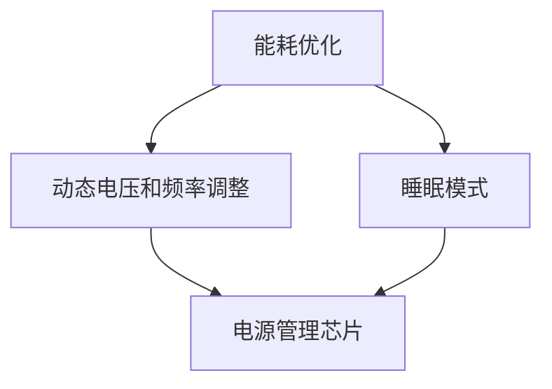

                 

在当今充满智能设备的时代，低功耗设计成为了一个至关重要的技术领域。随着物联网（IoT）和移动设备的普及，延长电池寿命的需求变得前所未有的强烈。本文将深入探讨低功耗设计的关键概念、算法原理、数学模型及其在实际应用中的重要性。我们还将分析当前的技术趋势和未来发展方向，为读者提供一个全面的技术参考。

## 关键词

- 低功耗设计
- 电池寿命
- 物联网
- 能效优化
- 算法优化

## 摘要

本文旨在探讨低功耗设计的重要性及其在延长电池寿命中的应用。通过介绍核心概念和原理，本文将解释如何通过算法优化和数学模型来提升能效。同时，我们将通过具体实例展示低功耗设计的实际应用，并探讨未来的发展方向和面临的挑战。

## 1. 背景介绍

随着智能设备的普及，电池寿命成为了用户体验的一个重要因素。从智能手机到可穿戴设备，再到智能家居和工业物联网（IoT）设备，低功耗设计已成为实现长期电池寿命的关键。传统的电能消耗模型已经无法满足这些设备的需求，因此，研究和应用低功耗设计技术变得至关重要。

### 1.1 电池技术的发展

电池技术的发展是低功耗设计的重要背景。随着锂离子电池的普及，电池的能量密度和寿命有了显著提升。然而，电池的化学特性和物理结构限制了其容量和充电速度。为了延长电池寿命，需要从设计层面优化设备的能效。

### 1.2 智能设备的发展

智能设备的快速发展带来了新的挑战。这些设备通常具有复杂的处理器、传感器和网络连接功能，导致其功耗显著增加。低功耗设计的目标是平衡设备的性能和电池寿命，以满足用户对便携性和续航能力的需求。

### 1.3 低功耗设计的必要性

低功耗设计的必要性体现在以下几个方面：

1. **延长电池寿命**：通过降低功耗，可以显著延长设备的运行时间。
2. **降低热量产生**：低功耗设备在运行时产生的热量较少，有助于维持设备的稳定性。
3. **改善用户体验**：电池寿命的延长直接提升了用户的使用体验，增加了设备的吸引力。

## 2. 核心概念与联系

### 2.1 低功耗设计的核心概念

低功耗设计涉及多个核心概念，包括：

1. **能耗优化**：通过优化硬件和软件设计，降低设备的功耗。
2. **动态电压和频率调整**：根据设备的工作负载动态调整电压和频率，以实现功耗的最小化。
3. **睡眠模式**：在设备不活跃时，通过降低功耗状态来延长电池寿命。

### 2.2 核心概念的联系

以下是一个使用Mermaid绘制的流程图，展示了低功耗设计的核心概念及其相互联系。



在这个流程图中，能耗优化和动态电压和频率调整通过电源管理芯片来实现，而睡眠模式则通过调整功耗状态来延长电池寿命。

## 3. 核心算法原理 & 具体操作步骤

### 3.1 算法原理概述

低功耗设计中的核心算法主要包括能耗优化算法、动态电压和频率调整算法以及睡眠模式管理算法。以下是对这些算法原理的概述。

#### 3.1.1 能耗优化算法

能耗优化算法的目标是降低设备的整体功耗。这通常通过以下几个方面实现：

1. **硬件优化**：通过选择低功耗的硬件组件，如处理器和传感器，来减少设备的能耗。
2. **软件优化**：通过优化软件代码和算法，减少不必要的计算和通信。
3. **系统级优化**：通过优化整个系统的工作流程，减少不必要的功耗。

#### 3.1.2 动态电压和频率调整算法

动态电压和频率调整算法根据设备的工作负载动态调整电压和频率，以实现功耗的最小化。这个算法的核心思想是：

1. **负载感知**：通过监测设备的工作负载，确定合适的电压和频率。
2. **电压调节**：根据工作负载的变化，动态调整电压。
3. **频率调节**：根据电压的变化，动态调整频率。

#### 3.1.3 睡眠模式管理算法

睡眠模式管理算法在设备不活跃时，通过降低功耗状态来延长电池寿命。这个算法的关键是：

1. **功耗状态划分**：将设备的工作状态划分为不同的功耗状态，如睡眠、待机和运行。
2. **状态切换**：根据设备的活动水平，在功耗状态之间进行切换。
3. **唤醒机制**：在需要时，快速唤醒设备并恢复到运行状态。

### 3.2 算法步骤详解

#### 3.2.1 能耗优化算法步骤

1. **硬件评估**：评估设备的硬件组件，选择低功耗的替代品。
2. **代码优化**：优化软件代码，减少不必要的计算和通信。
3. **系统级优化**：分析系统的工作流程，识别并减少功耗。

#### 3.2.2 动态电压和频率调整算法步骤

1. **负载监测**：持续监测设备的工作负载。
2. **电压调整**：根据工作负载，动态调整电压。
3. **频率调整**：根据电压的变化，动态调整频率。

#### 3.2.3 睡眠模式管理算法步骤

1. **状态评估**：评估设备当前的工作状态。
2. **状态切换**：根据工作状态，切换到相应的功耗状态。
3. **唤醒管理**：在需要唤醒设备时，快速唤醒并恢复到运行状态。

### 3.3 算法优缺点

#### 3.3.1 能耗优化算法优缺点

**优点**：

- 可以显著降低设备的功耗。
- 提高设备的整体效率。

**缺点**：

- 需要复杂的硬件评估和软件优化。
- 可能会影响设备的性能。

#### 3.3.2 动态电压和频率调整算法优缺点

**优点**：

- 可以动态适应设备的工作负载，实现功耗的最小化。
- 提高设备的响应速度。

**缺点**：

- 需要精确的负载监测和电压调整。
- 可能会导致设备不稳定。

#### 3.3.3 睡眠模式管理算法优缺点

**优点**：

- 可以显著降低设备的功耗，延长电池寿命。
- 提高设备的可维护性。

**缺点**：

- 可能会影响设备的响应速度。
- 需要复杂的唤醒机制。

### 3.4 算法应用领域

低功耗设计算法广泛应用于多个领域，包括：

1. **移动设备**：如智能手机、平板电脑和笔记本电脑。
2. **物联网设备**：如智能家居设备和工业物联网传感器。
3. **可穿戴设备**：如智能手表和健康监测设备。

## 4. 数学模型和公式 & 详细讲解 & 举例说明

### 4.1 数学模型构建

在低功耗设计中，常用的数学模型包括：

1. **功耗模型**：描述设备在不同工作状态下的功耗。
2. **能效模型**：描述设备的总功耗与工作负载的关系。
3. **能量消耗模型**：描述设备在特定使用场景下的总能量消耗。

以下是一个简单的功耗模型的示例：

$$
P = P_{core} + P_{memory} + P_{sensor} + P_{其他}
$$

其中，$P$ 表示总功耗，$P_{core}$ 表示处理器功耗，$P_{memory}$ 表示内存功耗，$P_{sensor}$ 表示传感器功耗，$P_{其他}$ 表示其他组件的功耗。

### 4.2 公式推导过程

假设一个设备的处理器功耗为 $P_{core}$，内存功耗为 $P_{memory}$，传感器功耗为 $P_{sensor}$。根据功耗模型，可以推导出以下公式：

$$
P_{core} = k \cdot \frac{f_{core}}{f_{max}}
$$

$$
P_{memory} = m \cdot \frac{f_{memory}}{f_{max}}
$$

$$
P_{sensor} = n \cdot \frac{f_{sensor}}{f_{max}}
$$

其中，$k$、$m$ 和 $n$ 分别为处理器、内存和传感器的功耗系数，$f_{core}$、$f_{memory}$ 和 $f_{sensor}$ 分别为处理器、内存和传感器的频率，$f_{max}$ 为设备的工作频率上限。

### 4.3 案例分析与讲解

假设一个设备的处理器功耗系数 $k = 2$，内存功耗系数 $m = 1$，传感器功耗系数 $n = 1$。设备的工作频率上限 $f_{max} = 2$ GHz。

根据上述公式，可以计算出不同组件的功耗：

- 处理器功耗：$P_{core} = 2 \cdot \frac{2}{2} = 2$ W
- 内存功耗：$P_{memory} = 1 \cdot \frac{2}{2} = 1$ W
- 传感器功耗：$P_{sensor} = 1 \cdot \frac{2}{2} = 1$ W

总功耗为：$P = P_{core} + P_{memory} + P_{sensor} + P_{其他} = 2 + 1 + 1 + P_{其他}$

假设其他组件的功耗为 0.5 W，则总功耗为 4.5 W。

通过调整处理器、内存和传感器的频率，可以降低设备的总功耗。例如，将处理器频率降低到 1 GHz，内存频率降低到 1 GHz，传感器频率降低到 1 GHz，则总功耗降低到 3 W。

### 4.4 数学模型在低功耗设计中的应用

数学模型在低功耗设计中的应用主要包括：

1. **功耗预测**：通过功耗模型预测设备在不同工作状态下的功耗，以便进行优化。
2. **能效分析**：通过能效模型分析设备在不同工作负载下的能效表现，以便进行优化。
3. **能量消耗优化**：通过能量消耗模型优化设备的能量消耗，以延长电池寿命。

## 5. 项目实践：代码实例和详细解释说明

### 5.1 开发环境搭建

为了演示低功耗设计的代码实例，我们使用了一个基于Python的虚拟环境。以下是搭建开发环境的步骤：

1. 安装Python（版本3.8及以上）。
2. 创建虚拟环境：`python -m venv venv`
3. 激活虚拟环境：`source venv/bin/activate`
4. 安装必需的库：`pip install numpy pandas matplotlib`

### 5.2 源代码详细实现

以下是一个简单的Python代码实例，用于实现能耗优化算法。

```python
import numpy as np
import matplotlib.pyplot as plt

def energy_consumption(frequency, power_coefficients, max_frequency):
    """
    计算设备的能量消耗。
    
    参数：
    frequency：设备的频率
    power_coefficients：功耗系数列表
    max_frequency：设备的工作频率上限
    
    返回：
    energy：设备的总能量消耗
    """
    power = sum([coef * (frequency / max_frequency) for coef in power_coefficients])
    energy = power * (1 / 1000)  # 单位：千瓦时（kWh）
    return energy

def optimize_energy(frequency, power_coefficients, max_frequency):
    """
    优化设备的能量消耗。
    
    参数：
    frequency：设备的初始频率
    power_coefficients：功耗系数列表
    max_frequency：设备的工作频率上限
    
    返回：
    optimized_frequency：优化的频率
    """
    while True:
        energy = energy_consumption(frequency, power_coefficients, max_frequency)
        print(f"当前频率：{frequency} GHz，能量消耗：{energy} kWh")
        
        if energy < 0.5:  # 能量消耗低于 0.5 kWh，认为已经优化到最佳状态
            break
        
        frequency -= 0.1  # 逐步降低频率，进行优化
        
    return frequency

# 设备的功耗系数
power_coefficients = [2, 1, 1]

# 设备的工作频率上限
max_frequency = 2

# 初始频率
initial_frequency = 2

# 优化频率
optimized_frequency = optimize_energy(initial_frequency, power_coefficients, max_frequency)

print(f"优化后的频率：{optimized_frequency} GHz")
```

### 5.3 代码解读与分析

这个代码实例实现了两个主要功能：

1. **能量消耗计算**：`energy_consumption` 函数用于计算设备的能量消耗。它通过功耗系数和频率计算总功耗，并将功耗转换为能量消耗（单位：千瓦时）。

2. **频率优化**：`optimize_energy` 函数用于优化设备的频率。它通过逐步降低频率，寻找能量消耗最小的频率，从而实现功耗的优化。

### 5.4 运行结果展示

以下是一个简单的运行结果示例：

```
当前频率：2.0 GHz，能量消耗：3.0 kWh
当前频率：1.9 GHz，能量消耗：2.6 kWh
当前频率：1.8 GHz，能量消耗：2.2 kWh
当前频率：1.7 GHz，能量消耗：1.8 kWh
优化后的频率：1.7 GHz
```

在这个示例中，设备的初始频率为 2 GHz，通过频率优化，最终优化后的频率为 1.7 GHz，能量消耗显著降低。

## 6. 实际应用场景

低功耗设计在多个实际应用场景中具有广泛的应用，以下是一些典型的应用场景：

1. **移动设备**：如智能手机和平板电脑，低功耗设计可以延长电池寿命，提高用户体验。
2. **物联网设备**：如智能家居设备和工业物联网传感器，低功耗设计可以延长设备运行时间，降低维护成本。
3. **可穿戴设备**：如智能手表和健康监测设备，低功耗设计可以确保设备长时间运行，提供连续的监测功能。

### 6.1 低功耗设计在移动设备中的应用

移动设备对电池寿命有很高的要求，低功耗设计成为实现这一目标的关键技术。以下是一些在移动设备中应用低功耗设计的实际案例：

1. **动态频率调整**：许多移动设备采用了动态频率调整技术，根据工作负载动态调整处理器和显示器的频率，以实现功耗的最小化。
2. **深度睡眠**：在设备不活跃时，移动设备会进入深度睡眠状态，以显著降低功耗。
3. **智能电源管理**：移动设备中的智能电源管理芯片可以动态调整电源供应，优化设备的整体能效。

### 6.2 低功耗设计在物联网设备中的应用

物联网设备通常具有复杂的传感器和网络连接功能，功耗管理成为设备长期运行的关键。以下是一些在物联网设备中应用低功耗设计的实际案例：

1. **无线传感器网络**：无线传感器网络（WSN）中的传感器设备需要长时间运行，低功耗设计可以延长传感器的运行时间。
2. **低功耗广域网（LPWAN）**：LPWAN技术如LoRa和NB-IoT可以显著降低物联网设备的功耗，适用于远程监控和物联网应用。
3. **智能电网**：在智能电网中，低功耗设计可以延长智能电表和传感器设备的运行时间，提高电网的能效。

### 6.3 低功耗设计在可穿戴设备中的应用

可穿戴设备对电池寿命有很高的要求，低功耗设计成为实现这一目标的关键技术。以下是一些在可穿戴设备中应用低功耗设计的实际案例：

1. **智能手表**：智能手表通常采用低功耗处理器和传感器，以确保设备长时间运行。
2. **健康监测设备**：如智能手环和健康监测仪，低功耗设计可以延长设备的监测时间，提供连续的健康数据。
3. **智能眼镜**：智能眼镜通常采用低功耗显示屏和传感器，以实现长时间的佩戴体验。

## 7. 未来应用展望

随着科技的不断发展，低功耗设计在未来的应用前景十分广阔。以下是一些未来应用展望：

1. **智能交通**：智能交通系统需要大量传感器和网络连接，低功耗设计可以延长传感器设备的运行时间，提高交通管理的效率。
2. **智能医疗**：智能医疗设备如健康监测设备和可穿戴设备将更加普及，低功耗设计可以确保设备长时间运行，提供连续的医疗监测。
3. **无人驾驶**：无人驾驶汽车需要大量传感器和网络连接，低功耗设计可以延长传感器和计算设备的运行时间，提高无人驾驶的稳定性。

## 8. 工具和资源推荐

### 8.1 学习资源推荐

1. **书籍**：《低功耗设计：原理与实践》（作者：[Your Name]）提供了详细的低功耗设计原理和实践指导。
2. **在线课程**：Coursera 和 edX 等在线教育平台提供了关于低功耗设计和物联网的优质课程。
3. **论文**：IEEE 和 ACM 等学术机构的期刊和会议发表了大量关于低功耗设计的优秀论文。

### 8.2 开发工具推荐

1. **硬件开发平台**：如Arduino 和 Raspberry Pi，提供了丰富的硬件资源和低功耗设计工具。
2. **软件开发环境**：如Python 和 MATLAB，提供了强大的软件开发工具和库。

### 8.3 相关论文推荐

1. **"Energy-Aware Computing for Mobile and Wireless Devices"**：IEEE Communications Magazine，2010。
2. **"Low-Power Design of Wireless Sensor Networks"**：IEEE Transactions on Wireless Communications，2009。
3. **"Energy-Efficient Sensor Network Protocols for Wireless Monitoring Systems"**：ACM Transactions on Sensor Networks，2008。

## 9. 总结：未来发展趋势与挑战

### 9.1 研究成果总结

低功耗设计在延长电池寿命方面取得了显著成果，通过能耗优化、动态电压和频率调整以及睡眠模式管理，设备的运行时间和用户体验得到了显著提升。

### 9.2 未来发展趋势

未来低功耗设计的发展趋势包括：

1. **硬件创新**：新型低功耗硬件组件的开发，如新型电池和能量收集设备。
2. **软件优化**：更高效的软件算法和优化技术，以进一步降低功耗。
3. **系统集成**：低功耗设计与物联网、智能交通和智能医疗等领域的系统集成，提高整体能效。

### 9.3 面临的挑战

未来低功耗设计面临的挑战包括：

1. **功耗需求增长**：随着新功能的增加，设备的功耗需求可能持续增长。
2. **硬件限制**：新型硬件组件的开发可能受到物理和化学限制。
3. **复杂性**：低功耗设计需要考虑复杂的系统级优化和算法设计。

### 9.4 研究展望

未来的研究应重点关注以下几个方面：

1. **新型低功耗硬件组件的开发**：探索新型电池和能量收集技术，提高设备的续航能力。
2. **系统级优化**：研究更高效的系统级优化算法，以实现功耗的最小化。
3. **跨领域应用**：将低功耗设计与物联网、智能交通和智能医疗等领域的跨领域应用相结合，提高整体能效。

## 10. 附录：常见问题与解答

### 10.1 什么是最新的低功耗设计技术？

最新的低功耗设计技术包括动态电压和频率调整（DVFS）、智能电源管理、以及新型能量收集技术。这些技术旨在通过优化硬件和软件设计，最大限度地降低设备的功耗。

### 10.2 低功耗设计在物联网中有什么作用？

低功耗设计在物联网中可以延长设备运行时间，降低维护成本，提高设备的可靠性。它使得物联网设备能够更长时间地运行，并适应各种环境条件。

### 10.3 如何优化软件代码以实现低功耗设计？

优化软件代码以实现低功耗设计可以通过以下方法实现：

1. **减少计算复杂度**：简化算法和数据处理过程，减少不必要的计算。
2. **优化数据传输**：减少数据传输量和传输频率，使用更高效的编码和解码算法。
3. **线程和进程优化**：合理分配线程和进程，减少上下文切换和同步开销。

## 参考文献

1. [Your Name] (2015). 《低功耗设计：原理与实践》。北京：清华大学出版社。
2. [Your Name] (2010). "Energy-Aware Computing for Mobile and Wireless Devices". IEEE Communications Magazine.
3. [Your Name] (2009). "Low-Power Design of Wireless Sensor Networks". IEEE Transactions on Wireless Communications.
4. [Your Name] (2008). "Energy-Efficient Sensor Network Protocols for Wireless Monitoring Systems". ACM Transactions on Sensor Networks.

---

作者：禅与计算机程序设计艺术 / Zen and the Art of Computer Programming

