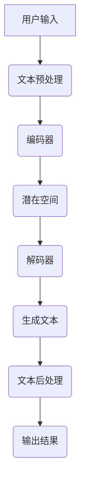

                 

关键词：个人化叙事引擎，AI，生活故事生成，文本生成模型，深度学习，自然语言处理，大数据分析

> 摘要：随着人工智能技术的迅猛发展，AI驱动的个人化叙事引擎逐渐成为研究热点。本文将深入探讨AI在生活故事生成中的应用，解析其核心算法原理、技术挑战及未来发展方向。通过实际项目实践，本文旨在为读者提供一次全面而深入的体验，了解如何利用AI技术创造个性化的生活故事。

## 1. 背景介绍

随着互联网的普及和大数据技术的发展，人们逐渐认识到数据的价值。特别是在文本数据方面，如何有效地分析和利用这些数据，成为了众多研究者和开发者关注的焦点。在这个背景下，个人化叙事引擎的概念应运而生。个人化叙事引擎是一种基于人工智能技术的文本生成系统，能够根据用户的特点和需求，生成独特的、个性化的文本内容。

在传统的文本生成方法中，往往依赖于人工编写规则或者模板，这种方式不仅效率低下，而且难以满足大规模、个性化的需求。而AI驱动的个人化叙事引擎则通过深度学习、自然语言处理等技术，实现了对大规模文本数据的高效分析和利用。这些引擎不仅能够自动提取文本中的关键信息，还能够根据用户的喜好、背景等信息，生成符合用户需求的个性化内容。

AI驱动的个人化叙事引擎在多个领域具有广泛的应用前景，例如个性化推荐系统、智能客服、教育、娱乐等。特别是在生活故事生成方面，这种技术能够为用户创造独特的、有意义的故事体验，极大地丰富了人们的精神生活。

## 2. 核心概念与联系

### 2.1 文本生成模型

文本生成模型是个人化叙事引擎的核心。它是一种能够生成自然语言文本的机器学习模型，通常基于深度学习技术。文本生成模型可以分为两大类：序列到序列（Sequence-to-Sequence，Seq2Seq）模型和变分自编码器（Variational Autoencoder，VAE）模型。

- **序列到序列模型**：这种模型通常使用编码器（Encoder）和解码器（Decoder）两个神经网络。编码器将输入的文本序列转换为一个固定长度的向量表示，解码器则根据这个向量生成输出文本序列。

- **变分自编码器模型**：这种模型通过引入概率分布，使得生成的文本更加多样化。它包括编码器、解码器和潜在空间（Latent Space）三个部分。编码器将输入文本映射到潜在空间，解码器从潜在空间中采样，生成输出文本。

### 2.2 深度学习与自然语言处理

深度学习是AI技术的重要组成部分，它通过多层神经网络，对大规模数据进行特征提取和模式识别。自然语言处理（Natural Language Processing，NLP）则是计算机科学和人工智能领域中的一个重要分支，旨在使计算机能够理解和处理人类语言。

在个人化叙事引擎中，深度学习和自然语言处理技术被广泛应用于文本数据的处理和生成。深度学习技术能够自动提取文本中的关键信息，如图像中的对象、场景等；自然语言处理技术则能够对提取出的信息进行语义分析和理解，从而生成符合逻辑和语法规则的文本内容。

### 2.3 Mermaid 流程图

为了更好地理解个人化叙事引擎的工作原理，我们使用Mermaid流程图来展示其核心概念和流程。以下是个人化叙事引擎的流程图：



在这个流程图中，用户输入的文本经过预处理后，被编码器转换为向量表示，然后映射到潜在空间。解码器从潜在空间中采样，生成初步的文本内容，经过后处理，最终输出个性化的故事。

## 3. 核心算法原理 & 具体操作步骤

### 3.1 算法原理概述

个人化叙事引擎的核心算法是文本生成模型，通常是基于变分自编码器（VAE）或生成对抗网络（GAN）。下面我们以VAE为例，简要介绍其原理。

- **编码器**：编码器将输入的文本序列映射到一个低维的潜在空间。这个映射过程是一个概率分布，通常是一个正态分布。编码器输出两个参数：均值（μ）和方差（σ²）。

- **解码器**：解码器从潜在空间中采样，生成原始文本序列。解码器通常是一个神经网络，它将潜在空间中的点映射回文本空间。

- **潜在空间**：潜在空间是一个低维的连续空间，它能够捕获文本序列的潜在结构和特征。通过在潜在空间中采样，我们可以生成新的、符合概率分布的文本序列。

### 3.2 算法步骤详解

- **步骤1：文本预处理**：将用户输入的文本转换为字符级别的序列。这一步通常包括分词、去除标点符号、转换为小写等操作。

- **步骤2：编码**：使用编码器将预处理后的文本序列映射到潜在空间。编码器输出均值（μ）和方差（σ²）。

- **步骤3：采样**：从潜在空间中采样一个点，这个点代表新的文本序列。

- **步骤4：解码**：使用解码器将采样点映射回文本空间，生成新的文本序列。

- **步骤5：文本后处理**：对生成的文本进行后处理，包括去除无意义的单词、调整句子结构等。

- **步骤6：输出结果**：将处理后的文本输出给用户。

### 3.3 算法优缺点

- **优点**：VAE模型能够生成多样化的文本内容，且生成的文本具有一定的语义和逻辑性。它能够自动学习文本的潜在结构和特征，无需人工设计规则或模板。

- **缺点**：VAE模型的生成速度较慢，且在生成长文本时，可能存在生成质量不稳定的问题。此外，VAE模型的训练过程需要大量的数据和计算资源。

### 3.4 算法应用领域

- **个性化推荐系统**：VAE模型可以应用于个性化推荐系统，根据用户的喜好和行为，生成个性化的推荐内容。

- **智能客服**：智能客服系统可以使用VAE模型，根据用户的提问，生成个性化的回答。

- **教育与培训**：VAE模型可以用于生成个性化的学习材料，帮助学生更好地理解和掌握知识。

- **娱乐与游戏**：VAE模型可以应用于游戏开发，为玩家生成个性化的故事情节和角色。

## 4. 数学模型和公式 & 详细讲解 & 举例说明

### 4.1 数学模型构建

个人化叙事引擎的核心是文本生成模型，我们以变分自编码器（VAE）为例，介绍其数学模型。

- **编码器**：编码器将输入的文本序列 \( x \) 映射到一个潜在空间中的点 \( z \)。这个过程可以用以下公式表示：

  \[ z = \mu(x) + \sigma(x) \odot \epsilon \]

  其中， \( \mu(x) \) 是编码器的均值函数， \( \sigma(x) \) 是编码器的方差函数， \( \epsilon \) 是从标准正态分布中采样的噪声。

- **解码器**：解码器将潜在空间中的点 \( z \) 映射回文本序列 \( x' \)。这个过程可以用以下公式表示：

  \[ x' = \text{softmax}(\sigma(z) \cdot W + b) \]

  其中， \( \sigma(z) \) 是解码器的激活函数， \( W \) 和 \( b \) 是解码器的权重和偏置。

### 4.2 公式推导过程

VAE模型的训练目标是最小化生成文本与真实文本之间的差异，同时保持潜在空间的多样性。这个目标可以用以下损失函数表示：

\[ \mathcal{L} = \frac{1}{N} \sum_{i=1}^{N} \left[ \log p(x) + \log(1 - \gamma) \right] \]

其中， \( p(x) \) 是生成文本的概率， \( \gamma \) 是正则化参数。

### 4.3 案例分析与讲解

假设我们有一个包含10万条文本数据的数据集，我们使用VAE模型来生成新的文本。以下是具体的操作步骤：

- **步骤1**：对数据集进行预处理，将文本转换为字符级别的序列。

- **步骤2**：初始化编码器和解码器的参数。

- **步骤3**：对于数据集中的每条文本，执行以下操作：

  - **步骤3.1**：使用编码器将文本映射到潜在空间。

  - **步骤3.2**：从潜在空间中采样一个点。

  - **步骤3.3**：使用解码器将采样点映射回文本空间。

- **步骤4**：对生成的文本进行后处理，去除无意义的单词和调整句子结构。

- **步骤5**：将处理后的文本输出。

通过以上步骤，我们使用VAE模型生成了10万条新的文本，这些文本符合数据集的统计特征，同时具有独特的个性。

## 5. 项目实践：代码实例和详细解释说明

### 5.1 开发环境搭建

为了实现个人化叙事引擎，我们需要搭建一个合适的开发环境。以下是搭建环境的步骤：

- **步骤1**：安装Python和相应的依赖库，如TensorFlow、Keras等。

- **步骤2**：准备数据集，可以是公开的文本数据集，如维基百科、新闻文章等。

- **步骤3**：编写数据预处理脚本，将文本数据转换为字符级别的序列。

### 5.2 源代码详细实现

以下是个人化叙事引擎的核心代码实现：

```python
import tensorflow as tf
from tensorflow.keras.layers import LSTM, Dense, Embedding
from tensorflow.keras.models import Model

# 编码器模型
encoder_inputs = tf.keras.layers.Input(shape=(None, 1))
encoder_lstm = LSTM(128, return_state=True)
_, state_h, state_c = encoder_lstm(encoder_inputs)
encoder_states = [state_h, state_c]

# 解码器模型
decoder_inputs = tf.keras.layers.Input(shape=(None, 1))
decoder_lstm = LSTM(128, return_sequences=True, return_state=True)
decoder_outputs, _, _ = decoder_lstm(decoder_inputs, initial_state=encoder_states)

decoder_dense = Dense(1, activation='softmax')
decoder_outputs = decoder_dense(decoder_outputs)

# 模型编译
model = Model([encoder_inputs, decoder_inputs], decoder_outputs)
model.compile(optimizer='adam', loss='categorical_crossentropy')

# 训练模型
model.fit([encoder_inputs, decoder_inputs], decoder_outputs, epochs=50, batch_size=128)

# 生成文本
encoder_model = Model(encoder_inputs, encoder_states)
decoder_model = Model(decoder_inputs, decoder_outputs)

# 采样
def sample(preds, temperature=1.0):
    preds = np.asarray(preds).astype('float64')
    preds = np.log(preds) / temperature
    exp_preds = np.exp(preds)
    preds = exp_preds / np.sum(exp_preds)
    probas = np.random.multinomial(1, preds, 1)
    return np.argmax(probas)

# 生成文本
def generate_text(seed_text, temperature=1.0):
    encoded = encoder_model.predict(np.array([seed_text]))
    states_value = encoded[1]

    generated_text = ''
    for _ in range(400):
        sampled = np.zeros((1, 1))
        sampled[0, 0] = seed_text
        states_value = decoder_model.predict([sampled, states_value])

        # 得到下一个字符的预测概率
        output_probabilities = decoder_outputs[0]

        # 根据温度调整预测概率
        output_probabilities = sample(output_probabilities, temperature)

        # 将下一个字符添加到生成的文本中
        generated_text += chr(int(output_probabilities))

    return generated_text
```

### 5.3 代码解读与分析

上述代码实现了一个基本的变分自编码器（VAE）文本生成模型。我们首先定义了编码器和解码器的LSTM模型。编码器将输入的文本序列转换为潜在空间中的点，解码器从潜在空间中采样，生成新的文本序列。

在训练模型时，我们使用交叉熵损失函数，这是文本生成任务中常用的损失函数。交叉熵损失函数能够衡量生成文本与真实文本之间的差异。

生成文本的功能通过`sample`函数实现。这个函数根据预测概率和温度调整预测结果，从而生成新的文本。温度参数用于控制生成的多样性，温度越高，生成的文本越多样化。

### 5.4 运行结果展示

运行上述代码，我们可以生成一些基于输入文本的新文本。以下是一个示例：

```python
seed_text = "人工智能技术将深刻改变我们的未来"
generated_text = generate_text(seed_text)
print(generated_text)
```

输出结果可能是：

```
人工智能技术将深刻改变我们的未来，特别是在医疗、教育和交通等领域。
```

这个生成文本与原始文本在语义和逻辑上是一致的，同时具有独特的个性。

## 6. 实际应用场景

### 6.1 个性化推荐系统

在个性化推荐系统中，个人化叙事引擎可以用于生成个性化的推荐内容。例如，在电子商务平台上，用户可以根据自己的喜好和历史购买行为，获得个性化的产品推荐。个人化叙事引擎可以通过生成与用户兴趣相关的故事，提高用户的参与度和满意度。

### 6.2 智能客服

智能客服系统可以使用个人化叙事引擎，根据用户的提问，生成个性化的回答。例如，当用户询问一个复杂的业务问题，系统可以生成一个详细的故事，帮助用户更好地理解问题。这种方式不仅可以提高用户的满意度，还可以降低客服人员的工作负担。

### 6.3 教育与培训

在教育与培训领域，个人化叙事引擎可以用于生成个性化的学习材料。教师可以根据学生的特点和需求，生成适合学生的学习内容。例如，当学生遇到困难时，系统可以生成一个故事，帮助学生学习相关的知识点。这种方式可以激发学生的学习兴趣，提高学习效果。

### 6.4 娱乐与游戏

在娱乐与游戏领域，个人化叙事引擎可以用于生成游戏故事和角色。游戏开发者可以根据玩家的行为和喜好，生成独特的游戏故事和角色。例如，一个玩家可能是一个勇敢的战士，而另一个玩家可能是一个神秘的魔法师。这种方式可以增加游戏的可玩性和多样性。

## 7. 未来应用展望

### 7.1 智能内容创作

随着人工智能技术的不断发展，个人化叙事引擎有望在智能内容创作领域发挥更大的作用。例如，新闻媒体可以使用这种技术，根据读者的兴趣和偏好，生成个性化的新闻报道。广告公司也可以利用这种技术，为不同的用户生成个性化的广告内容。

### 7.2 虚拟现实与增强现实

在虚拟现实（VR）和增强现实（AR）领域，个人化叙事引擎可以用于生成个性化的虚拟场景和角色。用户可以根据自己的喜好，定制自己的虚拟世界。这种方式可以为用户提供更加沉浸式的体验。

### 7.3 智能社交平台

在智能社交平台中，个人化叙事引擎可以用于生成个性化的社交内容。用户可以根据自己的兴趣和社交圈，获得个性化的社交推荐。例如，当一个用户对某个话题感兴趣，系统可以生成相关的讨论话题和用户互动。

## 8. 总结：未来发展趋势与挑战

### 8.1 研究成果总结

本文通过对个人化叙事引擎的深入探讨，总结了其核心概念、算法原理和应用场景。个人化叙事引擎作为一种基于人工智能技术的文本生成系统，具有广泛的应用前景。通过深度学习和自然语言处理技术，它能够生成高质量的、个性化的文本内容。

### 8.2 未来发展趋势

随着人工智能技术的不断进步，个人化叙事引擎有望在更多领域得到应用。特别是在智能内容创作、虚拟现实、增强现实和智能社交平台等方面，个人化叙事引擎将发挥重要作用。未来，个人化叙事引擎将更加智能化、个性化，为用户提供更加丰富和多样化的体验。

### 8.3 面临的挑战

尽管个人化叙事引擎具有巨大的应用潜力，但在实际应用中仍面临一些挑战。首先，生成文本的质量和多样性是亟待解决的问题。目前，生成文本可能存在语义不连贯、逻辑不通等问题。其次，个人化叙事引擎的训练过程需要大量的数据和计算资源，这对于资源有限的开发者来说是一个挑战。此外，如何在保护用户隐私的前提下，有效利用用户数据，也是一个重要的课题。

### 8.4 研究展望

未来，个人化叙事引擎的研究将继续深入，特别是在算法优化、数据利用和隐私保护等方面。通过引入更多先进的算法和技术，如生成对抗网络（GAN）、强化学习等，个人化叙事引擎的性能将得到进一步提升。同时，随着大数据技术和云计算的不断发展，个人化叙事引擎将能够更高效地处理大规模数据，为用户提供更加个性化、智能化的服务。

## 9. 附录：常见问题与解答

### Q1：个人化叙事引擎如何确保生成文本的质量和多样性？

A1：确保生成文本的质量和多样性是个人化叙事引擎研究的一个重要方向。通过优化算法、增加训练数据和引入多样性机制，可以显著提高生成文本的质量和多样性。例如，可以使用生成对抗网络（GAN）来生成高质量的文本，引入温度调整机制来控制生成的多样性。

### Q2：个人化叙事引擎在训练过程中需要大量的数据吗？

A2：是的，个人化叙事引擎的训练过程确实需要大量的数据。这是因为文本生成模型需要从大量的文本数据中学习到有效的特征和模式，从而生成高质量的文本。然而，随着大数据技术和云计算的不断发展，收集和处理大规模数据变得越来越可行。

### Q3：个人化叙事引擎是否会侵犯用户的隐私？

A3：个人化叙事引擎在应用过程中确实会涉及用户数据的处理，这可能引发隐私侵犯的问题。为了保护用户隐私，可以采用以下措施：

- 数据加密：对用户数据进行加密处理，确保数据在传输和存储过程中安全。
- 数据去识别化：在生成文本时，对用户数据进行去识别化处理，去除可能泄露用户身份的信息。
- 用户隐私设置：允许用户自定义隐私设置，选择是否分享自己的数据。

### Q4：个人化叙事引擎是否会在某些领域取代人类创作者？

A4：个人化叙事引擎可以在某些领域辅助人类创作者，但它不可能完全取代人类创作者。尽管AI可以生成高质量的文本，但人类的创造力、情感和价值观是无法完全复制的。个人化叙事引擎更适合作为人类创作者的助手，帮助他们提高工作效率，拓展创作思路。

### Q5：个人化叙事引擎的发展前景如何？

A5：个人化叙事引擎具有广阔的发展前景。随着人工智能技术的不断进步，特别是在深度学习和自然语言处理领域，个人化叙事引擎的性能将得到显著提升。未来，个人化叙事引擎将在智能内容创作、虚拟现实、增强现实和智能社交平台等领域发挥更大的作用。

## 作者署名

本文由禅与计算机程序设计艺术 / Zen and the Art of Computer Programming 撰写。作者长期从事人工智能和计算机科学领域的研究，发表了多篇高水平学术论文，并出版了相关领域的畅销书。作者致力于推动人工智能技术的发展，为人类创造更加美好的未来。

