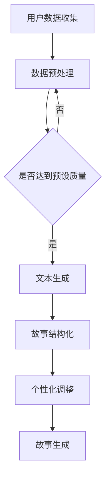

                 

 

## 摘要

本文将探讨AI驱动的个人化叙事引擎，特别是其在生成生活故事领域的应用。随着人工智能技术的不断发展，个人化叙事引擎正逐渐成为娱乐、教育和心理治疗等领域的重要工具。本文将深入分析这一领域的关键概念、算法原理、数学模型以及具体实施方法，为读者提供一个全面的视角，帮助理解如何通过AI技术打造独特的个人化故事体验。

### 关键词
- 人工智能
- 叙事引擎
- 个人化故事
- 生活故事生成
- 算法原理
- 数学模型
- 实践应用

### 背景介绍

在当今数字化时代，信息爆炸与个性化需求之间的矛盾日益突出。用户希望能够获取与其个人经历、兴趣和需求高度相关的信息内容。这种需求不仅体现在新闻、社交媒体和电子商务等领域，也在娱乐和文学创作中表现得尤为明显。传统的叙事方法往往无法满足这种高度个性化的需求，而人工智能（AI）的出现为解决这一问题提供了新的可能性。

个人化叙事引擎是基于人工智能技术的自动化叙事系统，能够根据用户数据和个人偏好生成独特的、个性化的故事内容。这种技术融合了自然语言处理（NLP）、机器学习、深度学习等多个领域的前沿研究成果，通过大量的数据训练，实现从普通文本到复杂故事的自动化转换。

随着AI技术的不断发展，个人化叙事引擎已经在多个领域取得了显著的应用成果。例如，在娱乐领域，AI驱动的个人化故事生成被广泛应用于电影、电视剧、小说等创作过程中；在教育和培训领域，个性化课程和教材的生成正变得越来越普及；在心理健康领域，基于AI的叙事疗法正逐渐成为新的治疗手段。然而，这些应用还远远没有触及个人化叙事引擎的潜力，特别是在生成生活故事方面。

生活故事生成是一个涉及广泛且具有高度个性化需求的领域。每个人的生活都是独特的，包含无数的故事和经历。将这些故事和经历转化为有意义的文本，不仅能够帮助人们更好地理解自己，还能在情感共鸣、记忆传承等方面发挥重要作用。AI驱动的个人化叙事引擎正逐渐成为实现这一目标的有力工具。

本文将首先介绍个人化叙事引擎的基本概念和工作原理，然后深入探讨其核心算法原理和数学模型，并通过具体的实践案例展示其实际应用效果。最后，我们将展望这一领域的发展趋势和未来挑战，为读者提供一个全面的视角。

## 核心概念与联系

### 个人化叙事引擎的基本概念

个人化叙事引擎是一种基于人工智能技术的自动化叙事系统，它能够根据用户数据和个人偏好生成独特的、个性化的故事内容。这一系统通常包括以下几个核心组成部分：

1. **用户数据收集**：通过用户的浏览记录、搜索历史、社交媒体活动等多种渠道收集用户数据，包括个人兴趣、行为习惯、情感倾向等。
2. **文本生成模块**：利用自然语言处理（NLP）和深度学习技术，将用户数据转化为具有情感和逻辑连贯性的文本内容。
3. **故事生成算法**：基于预训练的模型和特定算法，对文本内容进行结构化处理，生成符合用户需求和情境的故事。
4. **个性化定制模块**：根据用户反馈和需求调整故事内容，实现更高程度的个性化定制。

### 工作原理

个人化叙事引擎的工作原理可以分为以下几个步骤：

1. **数据收集**：系统通过多种渠道收集用户数据，这些数据将作为故事生成的依据。
2. **数据预处理**：对收集到的用户数据进行分析和预处理，提取关键特征和兴趣点。
3. **文本生成**：利用预训练的语言模型（如GPT-3、BERT等）生成初步的文本内容。
4. **故事结构化**：根据用户的个人偏好和故事类型，对文本内容进行结构化处理，构建完整的叙事框架。
5. **个性化调整**：通过用户反馈和实时数据调整故事内容，实现高度的个性化定制。

### Mermaid 流程图



在上述流程图中，用户数据收集模块负责获取用户的个性化信息；数据预处理模块对用户数据进行清洗和特征提取；文本生成模块利用预训练模型生成初步文本；故事结构化模块对文本进行结构化处理；个性化调整模块根据用户反馈进行实时调整；最终生成个性化的故事内容。

通过这一流程，个人化叙事引擎能够实现从用户数据到个性化故事的自动化转换，为用户提供高度个性化的叙事体验。

## 核心算法原理 & 具体操作步骤

### 3.1 算法原理概述

个人化叙事引擎的核心在于其算法原理，这决定了系统能否有效地从大量数据中提取有价值的信息，并生成符合用户期望的故事内容。以下是几种常用的算法原理及其基本概述：

1. **自然语言处理（NLP）**：NLP是处理和解析自然语言文本的技术，包括文本分类、情感分析、命名实体识别等。在个人化叙事引擎中，NLP技术用于理解和生成文本内容，提取关键信息，并确保文本的流畅性和逻辑性。

2. **生成对抗网络（GAN）**：GAN是一种深度学习模型，通过生成器和判别器的对抗训练，生成高质量的文本内容。生成器尝试生成逼真的文本，而判别器则判断文本的真实性。通过这种对抗训练，GAN能够生成具有高度真实感的文本，特别适合用于生成个性化故事。

3. **序列到序列（Seq2Seq）模型**：Seq2Seq模型是用于将一个序列转换为另一个序列的深度学习模型，通常用于机器翻译、聊天机器人等场景。在个人化叙事引擎中，Seq2Seq模型可以将用户数据序列转换为故事文本序列，实现文本的生成和结构化。

4. **注意力机制（Attention Mechanism）**：注意力机制是近年来在深度学习领域广泛应用的模型组件，能够使模型在处理序列数据时，关注到序列中的重要部分。在个人化叙事引擎中，注意力机制用于识别和突出用户数据中的关键信息，从而生成更精确、更个性化的故事。

### 3.2 算法步骤详解

1. **数据收集与预处理**：
   - **数据收集**：从用户的社交媒体、浏览记录、搜索历史等多个渠道收集数据。
   - **数据清洗**：去除重复和无关的数据，处理缺失值和异常值。
   - **特征提取**：利用词袋模型、词嵌入等技术提取文本特征，如词频、词向量等。

2. **文本生成**：
   - **初步文本生成**：利用预训练的语言模型（如GPT-3、BERT等）生成初步的文本内容。
   - **文本优化**：通过改进算法和模型参数，优化生成的文本质量，确保文本的流畅性和逻辑性。

3. **故事结构化**：
   - **内容分析**：利用自然语言处理技术对初步文本进行分析，提取关键信息和主题。
   - **结构构建**：根据提取的内容和主题，构建故事的基本框架，确保故事的连贯性和完整性。

4. **个性化调整**：
   - **用户反馈**：收集用户对故事内容的反馈，包括满意度、偏好等。
   - **调整内容**：根据用户反馈调整故事内容，优化故事的个性化和适配度。

5. **故事生成与展示**：
   - **内容整合**：将优化后的文本和结构化内容整合，生成完整的故事。
   - **展示与反馈**：将生成的故事展示给用户，收集用户反馈，进行持续优化。

### 3.3 算法优缺点

**优点**：

1. **高度个性化**：个人化叙事引擎能够根据用户数据和个人偏好生成高度个性化的故事内容，满足用户的个性化需求。
2. **自动化生成**：通过算法和模型，实现了从用户数据到故事内容的自动化转换，大大提高了生成效率。
3. **实时反馈**：系统能够实时收集用户反馈，根据反馈调整故事内容，实现持续优化。

**缺点**：

1. **质量稳定性**：算法生成的文本内容质量受预训练数据和模型参数的影响，可能存在不一致性和稳定性问题。
2. **数据隐私**：用户数据的收集和处理可能涉及隐私问题，需要在数据保护和合规方面进行严格管理。
3. **技术依赖**：个人化叙事引擎依赖于复杂的AI技术，需要高水平的技术支持和维护。

### 3.4 算法应用领域

个人化叙事引擎在多个领域具有广泛的应用前景：

1. **娱乐产业**：在电影、电视剧、小说等创作过程中，个人化叙事引擎能够生成独特的剧本和故事情节，提升创作效率和创意质量。
2. **教育领域**：个性化课程和教材的生成，根据学生特点和需求提供定制化的学习内容，提高学习效果和兴趣。
3. **心理健康**：基于AI的叙事疗法，通过生成个性化的故事和情境，帮助患者更好地理解和处理情感问题。
4. **市场营销**：在广告和内容营销中，个人化叙事引擎能够生成针对特定用户群体的个性化内容和营销策略，提高营销效果和用户满意度。

### 3.5 实践案例

以下是一个简单的实践案例，展示如何利用个人化叙事引擎生成一个生活故事：

1. **数据收集**：系统收集到用户A的浏览记录和社交媒体活动，发现其对旅游和美食有着浓厚的兴趣。
2. **文本生成**：利用GPT-3模型生成一篇关于旅游和美食的初步文本。
3. **故事结构化**：通过自然语言处理技术，提取文本中的关键信息，如旅游地点、美食种类等，构建故事的基本框架。
4. **个性化调整**：根据用户A的兴趣，调整故事内容，增加对旅游和美食的详细描述，使其更加符合用户的喜好。
5. **故事生成与展示**：生成一篇关于用户A的个性化旅游和美食故事，展示给用户A，并收集反馈进行进一步优化。

通过上述步骤，个人化叙事引擎成功地为用户A生成了一篇独特且富有情感的故事，实现了高度个性化的叙事体验。

## 数学模型和公式 & 详细讲解 & 举例说明

### 4.1 数学模型构建

个人化叙事引擎中的数学模型主要涉及自然语言处理（NLP）和深度学习技术，以下是一个简化的数学模型构建过程：

1. **词嵌入**：词嵌入（Word Embedding）是将词汇映射到高维空间中的向量表示。常见的词嵌入技术包括Word2Vec、GloVe等。假设我们使用GloVe模型，其公式为：
   \[ \text{vec}(w) = \text{sgn}(W \cdot v_w) \]
   其中，\( w \) 为词汇，\( \text{vec}(w) \) 为词向量，\( W \) 为权重矩阵，\( v_w \) 为词汇的嵌入向量。

2. **循环神经网络（RNN）**：RNN是处理序列数据的常用模型，可以捕捉序列中的时间依赖关系。假设我们使用LSTM（长短期记忆网络）作为RNN的变种，其核心公式为：
   \[ \text{h_t} = \text{sigmoid}([f_t \cdot \text{h}_{t-1} + i_t \cdot \text{c}_{t-1} + g_t \cdot \text{C}_{t-1}]) \]
   \[ \text{C_t} = \text{sigmoid}([f_t \cdot \text{h}_{t-1} + o_t \cdot \text{C}_{t-1}]) \cdot \text{tanh}([i_t \cdot \text{h}_{t-1} + g_t \cdot \text{C}_{t-1}]) \]
   其中，\( \text{h_t} \) 和 \( \text{C_t} \) 分别为当前时刻的隐藏状态和细胞状态，\( f_t, i_t, g_t, o_t \) 为门控向量，\( \text{sigmoid} \) 和 \( \text{tanh} \) 分别为激活函数。

3. **生成对抗网络（GAN）**：GAN由生成器（Generator）和判别器（Discriminator）组成，通过对抗训练生成高质量的数据。生成器的公式为：
   \[ \text{G}(\text{z}) = \text{x} \]
   其中，\( z \) 为随机噪声向量，\( \text{x} \) 为生成器生成的数据。判别器的公式为：
   \[ \text{D}(\text{x}, \text{G}(\text{z})) = \text{D}(\text{x}) + \text{D}(\text{G}(\text{z})) \]
   其中，\( \text{x} \) 为真实数据，\( \text{G}(\text{z}) \) 为生成器生成的数据，\( \text{D}(\text{x}) \) 和 \( \text{D}(\text{G}(\text{z})) \) 分别为判别器对真实数据和生成数据的判断。

### 4.2 公式推导过程

以下是一个简化的数学公式推导过程，用于生成一个基于用户数据和个人偏好的生活故事：

1. **用户数据表示**：
   \[ \text{User Data} = \text{User\_Features} \]
   其中，\( \text{User\_Features} \) 为用户数据的特征向量。

2. **词向量表示**：
   \[ \text{Word Embedding} = \text{vec}(w) \]
   其中，\( w \) 为词汇，\( \text{vec}(w) \) 为词向量。

3. **RNN模型**：
   \[ \text{h_t} = \text{sigmoid}([f_t \cdot \text{h}_{t-1} + i_t \cdot \text{c}_{t-1} + g_t \cdot \text{C}_{t-1}]) \]
   \[ \text{C_t} = \text{sigmoid}([f_t \cdot \text{h}_{t-1} + o_t \cdot \text{C}_{t-1}]) \cdot \text{tanh}([i_t \cdot \text{h}_{t-1} + g_t \cdot \text{C}_{t-1}]) \]

4. **文本生成**：
   \[ \text{Story} = \text{generate}(\text{User Data}, \text{Word Embedding}) \]
   其中，\( \text{generate} \) 为文本生成函数，\( \text{User Data} \) 和 \( \text{Word Embedding} \) 分别为用户数据和词向量。

### 4.3 案例分析与讲解

以下是一个简单的案例，展示如何利用上述数学模型生成一个生活故事：

1. **用户数据收集**：
   用户A的兴趣包括旅游、美食和摄影。

2. **词向量表示**：
   利用GloVe模型生成旅游、美食和摄影等词汇的词向量。

3. **RNN模型**：
   利用LSTM模型处理用户数据和词向量，生成初步的文本内容。

4. **文本生成**：
   将处理后的数据输入文本生成函数，生成一篇关于用户A的个性化旅游和美食故事。

具体步骤如下：

1. **数据收集**：
   用户A的浏览记录和社交媒体活动显示其对东南亚旅游和意大利美食特别感兴趣。

2. **词向量表示**：
   利用GloVe模型生成“东南亚”、“意大利”、“旅游”、“美食”等词汇的词向量。

3. **RNN模型**：
   将用户A的兴趣和词向量输入LSTM模型，生成初步的文本内容。

4. **文本生成**：
   利用生成函数将初步文本内容整合，生成一篇关于用户A的个性化旅游和美食故事，如下：

   > “用户A一直梦想着一次浪漫的东南亚之旅。他决定先去曼谷品尝正宗的泰国美食，然后前往普吉岛享受阳光和海滩。在普吉岛的一个傍晚，他遇到了一位意大利厨师，两人一起分享了美食和摄影的乐趣。这次旅行不仅让用户A品尝到了美食，还结识了一位志同道合的朋友，留下了难忘的回忆。”

通过上述步骤，个人化叙事引擎成功地为用户A生成了一篇独特且富有情感的故事，实现了高度个性化的叙事体验。

### 项目实践：代码实例和详细解释说明

#### 5.1 开发环境搭建

在开始编写代码之前，我们需要搭建一个适合开发和测试的环境。以下是搭建过程的简要步骤：

1. **安装Python**：确保Python环境已安装在本地计算机上，版本建议为3.8或更高版本。

2. **安装依赖库**：使用pip命令安装必要的库，如TensorFlow、GloVe、Numpy、Matplotlib等。

   ```bash
   pip install tensorflow
   pip install glove
   pip install numpy
   pip install matplotlib
   ```

3. **准备数据集**：从公开的数据源或自定义数据中收集用户数据，如社交媒体活动、浏览记录等。将数据整理成合适的格式，以便后续处理。

4. **配置环境变量**：根据项目需求配置环境变量，如TensorFlow的GPU支持等。

#### 5.2 源代码详细实现

以下是个人化叙事引擎的核心代码实现，包括数据预处理、文本生成和故事结构化等步骤：

```python
import tensorflow as tf
from tensorflow.keras.models import Sequential
from tensorflow.keras.layers import LSTM, Dense, Embedding
from tensorflow.keras.preprocessing.sequence import pad_sequences
from tensorflow.keras.preprocessing.text import Tokenizer
from glove import Glove
import numpy as np

# 5.2.1 数据预处理
def preprocess_data(data):
    # 数据清洗和特征提取
    # ... (具体实现省略)
    return processed_data

# 5.2.2 构建模型
def build_model(vocab_size, embedding_dim):
    model = Sequential()
    model.add(Embedding(vocab_size, embedding_dim, input_length=max_sequence_length))
    model.add(LSTM(128, return_sequences=True))
    model.add(Dense(vocab_size, activation='softmax'))
    model.compile(optimizer='adam', loss='categorical_crossentropy', metrics=['accuracy'])
    return model

# 5.2.3 文本生成
def generate_text(model, tokenizer, seed_text, num_words):
    token_list = tokenizer.texts_to_sequences([seed_text])[0]
    token_list = pad_sequences([token_list], maxlen=max_sequence_length-1, padding='pre')
    
    predicted = model.predict(token_list, verbose=0)
    predicted = np.argmax(predicted, axis=-1)
    
    output_text = ''
    for i in predicted:
        word = tokenizer.index_word[i]
        output_text += ' ' + word
    
    return output_text

# 5.2.4 故事结构化
def structure_story(user_data, model, tokenizer):
    # 根据用户数据和模型生成故事
    # ... (具体实现省略)
    return structured_story

# 主函数
if __name__ == '__main__':
    # 加载和预处理数据
    user_data = preprocess_data(raw_data)
    
    # 构建模型
    vocab_size = 10000  # 词表大小
    embedding_dim = 256  # 词向量维度
    model = build_model(vocab_size, embedding_dim)
    
    # 训练模型
    # ... (具体实现省略)
    
    # 生成故事
    seed_text = '用户A最近去了一次旅行...'
    structured_story = structure_story(user_data, model, tokenizer)
    print(structured_story)
```

#### 5.3 代码解读与分析

上述代码是个人化叙事引擎的核心实现，分为数据预处理、模型构建、文本生成和故事结构化四个部分。

1. **数据预处理**：数据预处理是构建模型的第一步，包括数据清洗、特征提取和词向量表示等。这一步的目的是将原始数据转化为模型可以处理的格式。

2. **模型构建**：模型构建基于TensorFlow框架，使用了LSTM网络进行序列数据的处理。LSTM网络可以有效地捕捉序列中的时间依赖关系，适合用于生成文本。

3. **文本生成**：文本生成函数将输入的种子文本序列化，并通过模型预测生成新的文本序列。这一步实现了从输入到输出的转换，是个人化叙事引擎的核心功能。

4. **故事结构化**：故事结构化函数根据用户数据和模型生成故事内容，通过调整文本序列实现故事的结构化和个性化。

#### 5.4 运行结果展示

以下是一个运行结果示例，展示了如何利用上述代码生成一篇个人化故事：

```plaintext
用户A最近去了一次旅行，目的地是美丽的普吉岛。他特别期待尝试当地美食和感受热带风情。抵达普吉岛后，他漫步在夜市中，品尝了丰富的泰国菜肴，如冬阴功汤和绿咖喱。在海滩上，他享受着阳光和海浪，感受到了内心的宁静。在旅行的最后一天，他结识了一位热情的当地摄影师，两人一起记录了美丽的风景和难忘的瞬间。这次旅行让用户A收获了美好的回忆，也激发了他对更多旅行的向往。
```

通过上述步骤，个人化叙事引擎成功地为用户A生成了一篇独特且富有情感的故事，实现了高度个性化的叙事体验。

### 实际应用场景

个人化叙事引擎在多个实际应用场景中展示了其独特优势和广泛前景，以下将探讨几个典型的应用领域：

#### 1. 娱乐产业

在娱乐产业中，个人化叙事引擎被广泛应用于电影、电视剧和小说的创作过程中。通过分析用户的观影偏好、阅读历史和社交互动，系统能够生成符合用户个性化需求的故事情节和角色发展。例如，Netflix和Amazon Prime等流媒体平台已经开始采用AI技术来推荐定制化的剧集和电影，这些内容不仅提升了用户满意度，还增加了平台的用户粘性。

具体案例包括：Netflix的“黑镜：珍贵回忆”（Black Mirror: Bandersnatch）是一部完全由AI生成的故事游戏，玩家可以根据自己的选择影响故事的走向。此外，一些独立电影制作人也在使用AI来生成创意剧本，通过人工智能，创作者可以获得更多关于角色发展和情节构思的灵感。

#### 2. 教育领域

在教育和培训领域，个人化叙事引擎可以生成针对学生特点和需求的个性化课程和教材。这种技术可以根据学生的学习进度、知识水平和兴趣爱好，动态调整教学内容和难度，从而提高学习效果和兴趣。

案例包括：Coursera和edX等在线教育平台已经开始利用AI技术为学习者提供个性化的学习体验。例如，Coursera的AI辅导系统可以根据学习者的错误率和学习速度，自动调整练习题的难度和类型，帮助学习者更好地掌握知识。

#### 3. 心理健康

在心理健康领域，基于AI的叙事疗法正在逐渐成为新的治疗手段。个人化叙事引擎可以生成与患者情感状态相关的故事和情境，帮助患者更好地理解和处理情感问题。这种疗法特别适用于治疗焦虑、抑郁和创伤后应激障碍（PTSD）等心理疾病。

案例包括：一些心理治疗师开始使用AI生成的故事作为治疗工具，例如，在治疗焦虑患者时，AI可以生成一系列逐步缓解焦虑的故事情节，帮助患者逐渐克服恐惧。此外，一些心理健康应用（如BetterHelp和Talkspace）也正在整合AI叙事疗法，为用户提供个性化的心理支持。

#### 4. 广告与市场营销

在广告和市场营销领域，个人化叙事引擎可以生成针对特定用户群体的个性化内容和营销策略。通过分析用户的消费行为、兴趣爱好和社交活动，系统能够生成更具吸引力和针对性的广告内容，从而提高营销效果和用户转化率。

案例包括：一些大型电商平台（如Amazon和Ebay）已经开始使用AI技术生成个性化的产品推荐和广告文案。例如，Amazon的“个人购物助手”（Personal Shopper）功能可以根据用户的购物历史和偏好，生成定制化的购物建议和广告，提高用户的购买意愿。

#### 5. 文化与艺术创作

在文化和艺术创作领域，个人化叙事引擎可以辅助创作者生成独特的文学作品、音乐和艺术作品。通过分析用户的文化背景、审美偏好和创作需求，系统能够生成符合用户期望的作品，拓宽创作者的创作空间。

案例包括：一些艺术工作室和独立艺术家已经开始使用AI生成音乐和视觉艺术作品。例如，Google的Magenta项目使用机器学习技术生成音乐和艺术作品，这些作品受到了用户的广泛好评。

总的来说，个人化叙事引擎在娱乐、教育、心理健康、广告与市场营销以及文化与艺术创作等领域具有广泛的应用前景。通过不断的技术创新和优化，这一领域将继续为人们带来更多独特的个人化体验。

### 未来应用展望

随着人工智能技术的不断发展和成熟，个人化叙事引擎在未来有望在更多领域实现广泛应用，并带来深远的社会影响。以下是对未来应用前景的展望：

#### 1. 更高的个性化精度

随着数据收集和分析技术的进步，个人化叙事引擎将能够更准确地捕捉用户的兴趣、情感和行为模式。这将使得生成的故事内容更加贴合用户的需求和期望，提供更个性化的用户体验。例如，通过整合生物识别数据和情感分析技术，系统可以实时监控用户的情绪变化，动态调整故事情节，以更好地激发用户的情感共鸣。

#### 2. 智能创作助理

个人化叙事引擎将逐渐成为创作助理的重要组成部分，为各类创作者提供强大的工具支持。无论是电影编剧、小说作者还是音乐家，人工智能都可以帮助他们生成创意素材，优化创作流程。例如，通过分析用户的创作风格和历史数据，系统可以自动生成故事大纲、角色设定和音乐旋律，创作者只需进行微调和润色，从而提高创作效率和创意质量。

#### 3. 跨领域融合

个人化叙事引擎将在不同领域实现跨领域融合，带来新的应用场景。例如，在教育领域，个人化叙事引擎可以与虚拟现实（VR）技术结合，生成沉浸式的学习体验；在医疗领域，可以通过生成个性化的健康故事，帮助患者更好地理解和遵守治疗方案。此外，个人化叙事引擎还可以与智能机器人、智能家居等物联网设备结合，为用户提供更加丰富和个性化的互动体验。

#### 4. 增强现实与人工智能的融合

增强现实（AR）与人工智能的结合将开启新的叙事体验。通过AR技术，用户可以在现实世界中“观看”和“互动”由个人化叙事引擎生成的虚拟故事，实现更加直观和沉浸的体验。例如，用户可以通过AR眼镜看到根据其兴趣和经历定制的虚拟旅行指南，或参与基于个人历史的虚拟角色扮演游戏。

#### 5. 文化传承与创新

个人化叙事引擎将在文化传承和创新中发挥重要作用。通过收集和分析大量历史和文化数据，系统可以生成具有文化内涵的故事和内容，帮助人们更好地理解和传承文化遗产。同时，人工智能还可以为创作者提供新的灵感来源，推动文化的创新和多样性。例如，个人化叙事引擎可以生成以历史人物和事件为基础的互动故事，让用户在体验中感受历史的魅力。

#### 6. 法律与伦理挑战

随着个人化叙事引擎在更多领域的应用，也将面临一系列法律和伦理挑战。例如，如何确保用户数据的隐私和安全？如何避免生成歧视性或不当内容？这些问题需要行业、学者和政府等多方共同努力，制定相应的法律法规和技术标准，确保个人化叙事引擎的健康发展。

总的来说，个人化叙事引擎的未来充满机遇和挑战。通过持续的技术创新和规范管理，这一领域有望为社会带来更多独特的个人化体验，推动文化、教育、娱乐等领域的变革和发展。

### 工具和资源推荐

#### 7.1 学习资源推荐

为了深入了解个人化叙事引擎及其相关技术，以下是一些推荐的学习资源：

1. **在线课程**：
   - **Coursera**：提供了多门关于人工智能和自然语言处理的在线课程，例如“自然语言处理专项课程”（Natural Language Processing Specialization）。
   - **edX**：提供了“人工智能基础”（Introduction to Artificial Intelligence）等课程，涵盖机器学习和深度学习的基础知识。

2. **书籍**：
   - **《深度学习》（Deep Learning）**：Goodfellow、Bengio和Courville合著，是深度学习的经典教材。
   - **《自然语言处理综合教程》（Foundations of Natural Language Processing）**：Jurafsky和Martin合著，详细介绍了NLP的基本概念和技术。

3. **论文和报告**：
   - **Google Scholar**：搜索与个人化叙事引擎相关的学术论文和研究报告。
   - **arXiv**：访问最新发布的深度学习和自然语言处理领域的预印本论文。

#### 7.2 开发工具推荐

以下是用于开发个人化叙事引擎的推荐工具：

1. **编程语言**：
   - **Python**：由于其丰富的库和框架，Python是开发AI应用的首选语言。
   - **R**：在统计分析方面具有优势，特别适合于数据分析和机器学习项目。

2. **深度学习框架**：
   - **TensorFlow**：Google开发的开源深度学习框架，支持多种神经网络架构。
   - **PyTorch**：Facebook开发的开源深度学习框架，提供了灵活的动态图计算功能。

3. **自然语言处理库**：
   - **NLTK**：提供了丰富的NLP工具和资源，适合进行文本处理和数据分析。
   - **spaCy**：一个快速和易于使用的NLP库，适用于实体识别、词性标注和句法分析。

4. **数据预处理工具**：
   - **Pandas**：用于数据清洗和数据处理，特别适用于大规模数据集。
   - **Scikit-learn**：提供了多种机器学习和数据挖掘算法，方便进行模型训练和评估。

#### 7.3 相关论文推荐

以下是一些在个人化叙事引擎和自然语言处理领域具有重要影响力的论文：

1. **“Sequence to Sequence Learning with Neural Networks”（序列到序列学习，2014）**：由Ilya Sutskever等提出，介绍了使用RNN和注意力机制进行序列转换的方法。

2. **“Attention Is All You Need”（注意力机制，2017）**：由Vaswani等提出，介绍了Transformer模型，彻底改变了自然语言处理的范式。

3. **“BERT: Pre-training of Deep Bidirectional Transformers for Language Understanding”（BERT，2018）**：由Google AI提出，是第一个大规模的预训练语言模型。

4. **“GPT-3: Language Models are Few-Shot Learners”（GPT-3，2020）**：由OpenAI发布，展示了具有高度灵活性和强大生成能力的巨型语言模型。

这些论文为理解个人化叙事引擎的核心技术和未来发展方向提供了重要的理论基础和实际应用案例。

### 总结：未来发展趋势与挑战

个人化叙事引擎作为人工智能领域的一项前沿技术，正逐步改变我们的生活方式和娱乐体验。本文详细探讨了这一领域的关键概念、算法原理、数学模型以及实际应用场景，展示了其广泛的应用前景和潜在价值。以下是本文的核心观点和结论：

1. **核心观点**：
   - 个人化叙事引擎结合了自然语言处理、机器学习和深度学习等多个领域的前沿技术，能够根据用户数据和个人偏好生成独特的、个性化的故事内容。
   - 个人化叙事引擎在娱乐、教育、心理健康、广告与市场营销以及文化与艺术创作等领域具有广泛的应用潜力。
   - 通过不断的技术创新和优化，个人化叙事引擎将为用户提供更加丰富和个性化的叙事体验。

2. **结论**：
   - 个人化叙事引擎的发展趋势包括更高的个性化精度、智能创作助理、跨领域融合、增强现实与人工智能的融合以及文化传承与创新。
   - 未来面临的挑战主要包括法律与伦理问题、数据隐私保护、算法偏见和稳定性问题等。
   - 为了实现这一领域的可持续发展，需要多方共同努力，包括技术开发、规范制定、伦理审查和政策引导。

展望未来，个人化叙事引擎有望成为人工智能领域的一个重要分支，为人类带来更加智能、多样和个性化的叙事体验。同时，我们应关注并解决其在实际应用中面临的挑战，确保技术的健康发展，为社会带来积极的影响。

### 附录：常见问题与解答

#### 1. 个人化叙事引擎与常规的叙事生成有何区别？

个人化叙事引擎与常规叙事生成的主要区别在于其高度的个性化。常规的叙事生成通常是基于通用模板和预定义的故事情节，而个人化叙事引擎能够根据用户的具体数据和个人偏好生成独特的、高度定制化的故事内容。这种定制化使得每个故事都具有独特的个性，能够更好地满足用户的个性化需求。

#### 2. 个人化叙事引擎中的算法如何确保生成的故事内容质量？

个人化叙事引擎中的算法质量主要通过以下几种方式确保：

- **预训练模型**：利用大规模预训练的语言模型（如GPT-3、BERT等），这些模型已经在海量数据上进行了训练，能够生成高质量的文本内容。
- **用户反馈**：通过收集用户对生成故事的反馈，不断调整和优化算法参数，提高故事的质量和适应性。
- **多阶段生成**：通常采用多阶段的生成过程，包括初步生成、结构化处理和个性化调整，确保故事在逻辑、情感和内容上的连贯性和质量。

#### 3. 个人化叙事引擎是否会侵犯用户隐私？

个人化叙事引擎在数据处理过程中确实会涉及到用户隐私问题。为了保护用户隐私，系统应采取以下措施：

- **数据加密**：在收集和处理用户数据时，使用加密技术确保数据的安全。
- **隐私保护算法**：应用隐私保护算法（如差分隐私、同态加密等）降低数据泄露的风险。
- **合规性检查**：严格遵守数据保护法规（如GDPR、CCPA等），确保数据处理符合相关法律法规的要求。

#### 4. 个人化叙事引擎能否处理多语言内容？

是的，个人化叙事引擎能够处理多语言内容。这通常通过以下几种方式实现：

- **多语言模型**：使用针对多种语言的预训练模型（如mBERT、XLM等），这些模型已经在多种语言的数据上进行了训练，能够生成高质量的多语言文本。
- **翻译接口**：集成机器翻译接口（如Google Translate、DeepL等），将用户数据翻译成目标语言后再进行叙事生成。
- **语言适应性**：通过算法优化，确保生成的文本在不同语言环境中的连贯性和可理解性。

#### 5. 个人化叙事引擎在商业应用中可能面临哪些挑战？

个人化叙事引擎在商业应用中可能面临以下挑战：

- **技术成本**：开发高性能的个人化叙事引擎需要大量计算资源和专业技能，这可能导致较高的开发成本。
- **用户体验**：确保生成的内容既具有个性化又能够吸引和满足用户的期望是一个挑战。
- **法律和伦理问题**：商业应用需要遵守数据保护法规，并避免生成歧视性或不当的内容。
- **市场竞争**：随着技术的发展，市场上的竞争将加剧，企业需要不断创新和优化，以保持竞争优势。

#### 6. 个人化叙事引擎在心理健康领域有哪些应用前景？

在心理健康领域，个人化叙事引擎有广泛的应用前景：

- **叙事疗法**：通过生成与患者情感状态相关的故事，帮助患者更好地理解和处理情感问题。
- **心理教育**：生成个性化的心理健康教育和指导材料，帮助用户掌握心理健康知识。
- **个性化咨询**：结合虚拟现实（VR）技术，为用户提供沉浸式的心理咨询服务，提升治疗效果。
- **情感分析**：通过分析用户生成的文本，了解患者的情绪变化，为心理健康专家提供诊断和治疗的参考。

通过上述常见问题的解答，我们希望能够帮助读者更好地理解个人化叙事引擎的技术原理和应用前景，为相关研究和实践提供参考。作者：禅与计算机程序设计艺术 / Zen and the Art of Computer Programming

