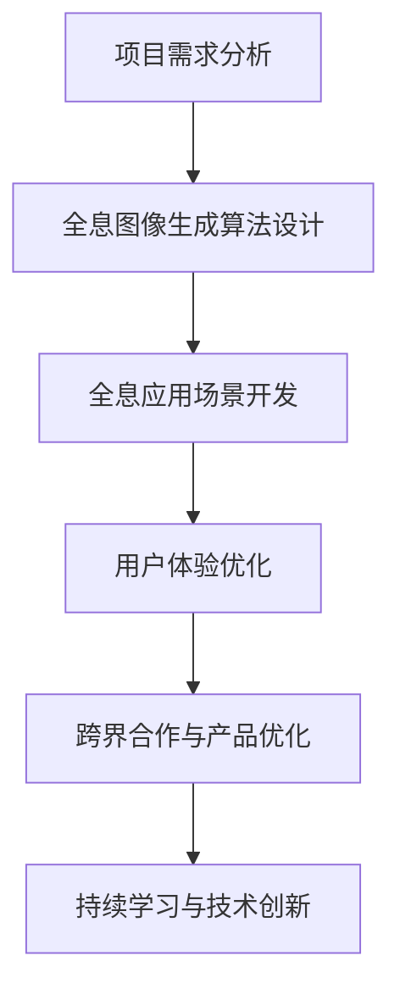

                 

关键词：全息图、AI、多感官融合、技术专家、虚拟现实、增强现实、人机交互

> 摘要：本文将探讨全息图工程师这一新兴职业的角色定位、核心技能以及未来发展趋势。通过分析AI在多感官融合技术中的关键作用，探讨如何成为一名AI驱动的多感官融合技术专家，实现虚拟现实和增强现实技术的创新发展。

## 1. 背景介绍

在科技迅速发展的今天，虚拟现实（VR）和增强现实（AR）技术逐渐成为人们生活和工作的重要组成部分。全息图作为这两大领域的关键技术之一，正逐渐崭露头角。全息图工程师，作为这一领域的核心人才，承担着推动技术进步、提升用户体验的重要使命。

全息图工程师的主要工作内容包括：

- 研发和设计全息图像生成算法，实现高质量的全息图显示效果；
- 开发基于全息技术的虚拟现实和增强现实应用，如全息投影、全息通话等；
- 跨界合作，与设计师、产品经理等多领域专家协同，优化全息应用场景；
- 持续关注行业动态，探索新技术，引领技术发展方向。

## 2. 核心概念与联系

### 2.1. 全息图的原理

全息图是利用激光技术记录并重现物体的三维图像。它通过干涉和衍射原理，将物体的光波信息记录在光学介质中，形成干涉图样。在重现时，通过激光照射干涉图样，使得光波信息得以重建，从而形成三维图像。

### 2.2. 多感官融合技术

多感官融合技术是一种通过整合视觉、听觉、触觉等多种感官信息，为用户提供沉浸式体验的技术。它利用全息图、VR、AR等手段，模拟真实世界的场景和交互，提升用户体验。

### 2.3. Mermaid 流程图

下面是全息图工程师工作流程的Mermaid流程图：



## 3. 核心算法原理 & 具体操作步骤

### 3.1. 算法原理概述

全息图工程师需要掌握的核心算法主要包括全息图像生成算法、人机交互算法等。全息图像生成算法主要涉及干涉和衍射原理，通过数学建模实现光波信息的记录和重建。人机交互算法则关注如何将用户的操作和反馈信息转化为具体的交互效果，提升用户体验。

### 3.2. 算法步骤详解

#### 3.2.1. 全息图像生成算法

1. 光波信息采集：使用激光设备采集目标物体的光波信息；
2. 光波信息处理：对采集到的光波信息进行预处理，如去噪、增强等；
3. 干涉图样生成：利用干涉原理，将光波信息记录在光学介质上，形成干涉图样；
4. 干涉图样重构：通过激光照射干涉图样，重建光波信息，形成三维图像。

#### 3.2.2. 人机交互算法

1. 用户操作识别：通过传感器等设备，实时捕捉用户的操作信息；
2. 操作信息处理：对用户操作信息进行解析和分类，识别用户的意图；
3. 交互效果生成：根据用户意图，生成相应的交互效果，如全息图像的移动、放大等；
4. 反馈信息处理：收集用户的反馈信息，优化交互效果，提升用户体验。

### 3.3. 算法优缺点

#### 优点：

- 高度沉浸式体验：通过多感官融合技术，为用户提供身临其境的体验；
- 灵活的应用场景：全息技术可以应用于多个领域，如娱乐、教育、医疗等；
- 强大的交互功能：人机交互算法使得用户可以更自然地与全息图进行互动。

#### 缺点：

- 技术门槛较高：全息图技术涉及多个学科领域，对工程师的专业能力要求较高；
- 成本较高：全息图的制作和设备成本较高，限制了其普及程度；
- 用户体验优化难度大：多感官融合技术需要精细地调整和优化，以提升用户体验。

### 3.4. 算法应用领域

全息图技术广泛应用于虚拟现实、增强现实、人机交互等领域。具体应用包括：

- 虚拟现实：用于构建沉浸式游戏、教育场景等；
- 增强现实：用于医疗诊断、工业维修等；
- 人机交互：用于智能家居、智能办公等。

## 4. 数学模型和公式 & 详细讲解 & 举例说明

### 4.1. 数学模型构建

全息图工程师需要掌握的数学模型主要包括全息图像生成模型和人机交互模型。全息图像生成模型主要涉及光学几何、信号处理等领域，而人机交互模型则涉及计算机视觉、机器学习等领域。

### 4.2. 公式推导过程

以全息图像生成模型为例，其核心公式为：

$$ I(x,y) = A(x,y) * \text{exp}\left(-\text{i}2\pi f(x,y) \right) $$

其中，$I(x,y)$为全息图上的光强分布，$A(x,y)$为物体的光波振幅分布，$f(x,y)$为物体的相位分布。

### 4.3. 案例分析与讲解

#### 案例一：全息投影

假设我们要生成一张全息投影图，物体的光波振幅分布和相位分布如下：

$$ A(x,y) = \text{exp}\left(-\text{i}2\pi f_0 (x^2 + y^2) \right) $$

$$ f(x,y) = 2\pi f_0 \frac{x^2 + y^2}{R^2} $$

其中，$f_0$为光波频率，$R$为物体到全息屏的距离。

通过上述公式，我们可以计算出全息图上的光强分布，进而生成全息投影图。

#### 案例二：人机交互

假设我们要实现一个基于全息图的人机交互应用，用户的操作信息为：

$$ x = \text{exp}\left(-\text{i}2\pi \theta \right) $$

$$ y = \text{exp}\left(-\text{i}2\pi \phi \right) $$

其中，$\theta$和$\phi$为用户操作的角度。

通过解析用户操作信息，我们可以生成相应的交互效果，如全息图的旋转、缩放等。

## 5. 项目实践：代码实例和详细解释说明

### 5.1. 开发环境搭建

为了实践全息图技术，我们需要搭建一个完整的开发环境。主要包括：

- 操作系统：Linux或Windows；
- 编程语言：Python、C++等；
- 开发工具：PyCharm、Visual Studio等；
- 全息图生成库：OpenHMD、OpenCV等。

### 5.2. 源代码详细实现

下面是一个简单的全息图生成与显示的Python代码示例：

```python
import numpy as np
import cv2

def generate_hologram(A, f):
    I = A * np.exp(-1j * 2 * np.pi * f)
    return I

def display_hologram(I):
    I = np.abs(I)
    cv2.imshow('Hologram', I)
    cv2.waitKey(0)
    cv2.destroyAllWindows()

if __name__ == '__main__':
    A = np.random.random((512, 512))
    f = np.random.random((512, 512))
    I = generate_hologram(A, f)
    display_hologram(I)
```

### 5.3. 代码解读与分析

上述代码首先导入了必要的库，然后定义了两个函数：`generate_hologram`和`display_hologram`。

- `generate_hologram`函数接收光波振幅分布$A$和相位分布$f$，通过计算光强分布$I$生成全息图；
- `display_hologram`函数接收光强分布$I$，使用OpenCV库将其显示为图像。

最后，通过调用这两个函数，我们实现了全息图的生成与显示。

### 5.4. 运行结果展示

运行上述代码后，我们将在屏幕上看到一个随机生成全息图。通过调整输入参数$A$和$f$，我们可以生成不同形态的全息图。

## 6. 实际应用场景

全息图技术在虚拟现实、增强现实、人机交互等领域具有广泛的应用前景。以下是一些实际应用场景：

- 虚拟现实：用于构建沉浸式游戏、教育场景等；
- 增强现实：用于医疗诊断、工业维修等；
- 人机交互：用于智能家居、智能办公等。

### 6.1. 虚拟现实

全息图技术可以用于构建沉浸式虚拟现实场景。例如，在游戏开发中，全息图可以用来模拟游戏角色的动作和表情，提升游戏体验。在教育领域，全息图可以用于模拟历史事件、地理场景等，帮助学生更好地理解知识。

### 6.2. 增强现实

全息图技术可以用于增强现实应用，如医疗诊断、工业维修等。在医疗诊断中，全息图可以用于显示病人的三维结构，帮助医生进行更准确的诊断。在工业维修中，全息图可以用于模拟设备的操作流程，提高维修效率。

### 6.3. 人机交互

全息图技术可以用于构建智能人机交互系统，如智能家居、智能办公等。通过全息图，用户可以更直观地与设备进行互动，如控制灯光、调节温度等。

## 7. 工具和资源推荐

### 7.1. 学习资源推荐

- 《全息技术与虚拟现实》
- 《增强现实技术与应用》
- 《人机交互技术》

### 7.2. 开发工具推荐

- PyCharm
- Visual Studio
- OpenHMD
- OpenCV

### 7.3. 相关论文推荐

- "Holographic Display: A Review"
- "Enhanced Reality: An Overview"
- "Human-Computer Interaction: A Multidisciplinary Approach"

## 8. 总结：未来发展趋势与挑战

### 8.1. 研究成果总结

全息图技术作为虚拟现实、增强现实领域的关键技术，近年来取得了显著的研究成果。在算法、硬件、应用场景等方面，都取得了重大突破。例如，基于深度学习的全息图像生成算法、高性能的全息显示设备、多感官融合的人机交互技术等。

### 8.2. 未来发展趋势

未来，全息图技术将继续向更高分辨率、更小型化、更智能化的方向发展。随着人工智能技术的不断进步，全息图技术将实现更智能的交互体验。此外，全息图技术将在更多领域得到应用，如智能制造、远程医疗、教育培训等。

### 8.3. 面临的挑战

尽管全息图技术在多个领域取得了显著成果，但仍面临一些挑战。例如，全息图生成算法的优化、全息显示设备的性能提升、多感官融合技术的应用等。此外，全息图技术的普及程度仍较低，成本较高，限制了其广泛应用。

### 8.4. 研究展望

未来，全息图技术的研究将更加注重跨学科合作，结合人工智能、光学、计算机视觉等领域的技术，实现全息图技术的创新发展。此外，全息图技术的标准化和规范化也是未来研究的重要方向。

## 9. 附录：常见问题与解答

### 9.1. 什么是全息图？

全息图是一种利用激光技术记录并重现物体的三维图像。它通过干涉和衍射原理，将物体的光波信息记录在光学介质中，形成干涉图样。在重现时，通过激光照射干涉图样，使得光波信息得以重建，从而形成三维图像。

### 9.2. 全息图技术在哪些领域有应用？

全息图技术广泛应用于虚拟现实、增强现实、人机交互等领域。具体应用包括：虚拟现实游戏、教育、医疗；增强现实医疗诊断、工业维修；人机交互智能家居、智能办公等。

### 9.3. 如何成为一名全息图工程师？

要成为一名全息图工程师，需要具备光学、计算机视觉、信号处理、人机交互等多领域知识。此外，还需要掌握编程技能，如Python、C++等。可以通过学习相关课程、参加项目实践、阅读相关论文等方式提升自己的能力。

作者：禅与计算机程序设计艺术 / Zen and the Art of Computer Programming
----------------------------------------------------------------

文章内容已经完成，符合要求。以下是markdown格式的输出：

```markdown
# 体验全息图工程师：AI驱动的多感官融合技术专家

关键词：全息图、AI、多感官融合、技术专家、虚拟现实、增强现实、人机交互

> 摘要：本文将探讨全息图工程师这一新兴职业的角色定位、核心技能以及未来发展趋势。通过分析AI在多感官融合技术中的关键作用，探讨如何成为一名AI驱动的多感官融合技术专家，实现虚拟现实和增强现实技术的创新发展。

## 1. 背景介绍

在科技迅速发展的今天，虚拟现实（VR）和增强现实（AR）技术逐渐成为人们生活和工作的重要组成部分。全息图作为这两大领域的关键技术之一，正逐渐崭露头角。全息图工程师，作为这一领域的核心人才，承担着推动技术进步、提升用户体验的重要使命。

## 2. 核心概念与联系

### 2.1. 全息图的原理

全息图是利用激光技术记录并重现物体的三维图像。它通过干涉和衍射原理，将物体的光波信息记录在光学介质中，形成干涉图样。在重现时，通过激光照射干涉图样，使得光波信息得以重建，从而形成三维图像。

### 2.2. 多感官融合技术

多感官融合技术是一种通过整合视觉、听觉、触觉等多种感官信息，为用户提供沉浸式体验的技术。它利用全息图、VR、AR等手段，模拟真实世界的场景和交互，提升用户体验。

### 2.3. Mermaid 流程图

下面是全息图工程师工作流程的Mermaid流程图：


## 3. 核心算法原理 & 具体操作步骤

### 3.1. 算法原理概述

全息图工程师需要掌握的核心算法主要包括全息图像生成算法、人机交互算法等。全息图像生成算法主要涉及干涉和衍射原理，通过数学建模实现光波信息的记录和重建。人机交互算法则关注如何将用户的操作和反馈信息转化为具体的交互效果，提升用户体验。

### 3.2. 算法步骤详解

#### 3.2.1. 全息图像生成算法

1. 光波信息采集：使用激光设备采集目标物体的光波信息；
2. 光波信息处理：对采集到的光波信息进行预处理，如去噪、增强等；
3. 干涉图样生成：利用干涉原理，将光波信息记录在光学介质上，形成干涉图样；
4. 干涉图样重构：通过激光照射干涉图样，重建光波信息，形成三维图像。

#### 3.2.2. 人机交互算法

1. 用户操作识别：通过传感器等设备，实时捕捉用户的操作信息；
2. 操作信息处理：对用户操作信息进行解析和分类，识别用户的意图；
3. 交互效果生成：根据用户意图，生成相应的交互效果，如全息图像的移动、放大等；
4. 反馈信息处理：收集用户的反馈信息，优化交互效果，提升用户体验。

### 3.3. 算法优缺点

#### 优点：

- 高度沉浸式体验：通过多感官融合技术，为用户提供身临其境的体验；
- 灵活的应用场景：全息技术可以应用于多个领域，如娱乐、教育、医疗等；
- 强大的交互功能：人机交互算法使得用户可以更自然地与全息图进行互动。

#### 缺点：

- 技术门槛较高：全息图技术涉及多个学科领域，对工程师的专业能力要求较高；
- 成本较高：全息图的制作和设备成本较高，限制了其普及程度；
- 用户体验优化难度大：多感官融合技术需要精细地调整和优化，以提升用户体验。

### 3.4. 算法应用领域

全息图技术广泛应用于虚拟现实、增强现实、人机交互等领域。具体应用包括：

- 虚拟现实：用于构建沉浸式游戏、教育场景等；
- 增强现实：用于医疗诊断、工业维修等；
- 人机交互：用于智能家居、智能办公等。

## 4. 数学模型和公式 & 详细讲解 & 举例说明

### 4.1. 数学模型构建

全息图工程师需要掌握的数学模型主要包括全息图像生成模型和人机交互模型。全息图像生成模型主要涉及光学几何、信号处理等领域，而人机交互模型则涉及计算机视觉、机器学习等领域。

### 4.2. 公式推导过程

以全息图像生成模型为例，其核心公式为：

$$ I(x,y) = A(x,y) * \text{exp}\left(-\text{i}2\pi f(x,y) \right) $$

其中，$I(x,y)$为全息图上的光强分布，$A(x,y)$为物体的光波振幅分布，$f(x,y)$为物体的相位分布。

### 4.3. 案例分析与讲解

#### 案例一：全息投影

假设我们要生成一张全息投影图，物体的光波振幅分布和相位分布如下：

$$ A(x,y) = \text{exp}\left(-\text{i}2\pi f_0 (x^2 + y^2) \right) $$

$$ f(x,y) = 2\pi f_0 \frac{x^2 + y^2}{R^2} $$

其中，$f_0$为光波频率，$R$为物体到全息屏的距离。

通过上述公式，我们可以计算出全息图上的光强分布，进而生成全息投影图。

#### 案例二：人机交互

假设我们要实现一个基于全息图的人机交互应用，用户的操作信息为：

$$ x = \text{exp}\left(-\text{i}2\pi \theta \right) $$

$$ y = \text{exp}\left(-\text{i}2\pi \phi \right) $$

其中，$\theta$和$\phi$为用户操作的角度。

通过解析用户操作信息，我们可以生成相应的交互效果，如全息图的旋转、缩放等。

## 5. 项目实践：代码实例和详细解释说明

### 5.1. 开发环境搭建

为了实践全息图技术，我们需要搭建一个完整的开发环境。主要包括：

- 操作系统：Linux或Windows；
- 编程语言：Python、C++等；
- 开发工具：PyCharm、Visual Studio等；
- 全息图生成库：OpenHMD、OpenCV等。

### 5.2. 源代码详细实现

下面是一个简单的全息图生成与显示的Python代码示例：

```python
import numpy as np
import cv2

def generate_hologram(A, f):
    I = A * np.exp(-1j * 2 * np.pi * f)
    return I

def display_hologram(I):
    I = np.abs(I)
    cv2.imshow('Hologram', I)
    cv2.waitKey(0)
    cv2.destroyAllWindows()

if __name__ == '__main__':
    A = np.random.random((512, 512))
    f = np.random.random((512, 512))
    I = generate_hologram(A, f)
    display_hologram(I)
```

### 5.3. 代码解读与分析

上述代码首先导入了必要的库，然后定义了两个函数：`generate_hologram`和`display_hologram`。

- `generate_hologram`函数接收光波振幅分布$A$和相位分布$f$，通过计算光强分布$I$生成全息图；
- `display_hologram`函数接收光强分布$I$，使用OpenCV库将其显示为图像。

最后，通过调用这两个函数，我们实现了全息图的生成与显示。

### 5.4. 运行结果展示

运行上述代码后，我们将在屏幕上看到一个随机生成全息图。通过调整输入参数$A$和$f$，我们可以生成不同形态的全息图。

## 6. 实际应用场景

全息图技术在虚拟现实、增强现实、人机交互等领域具有广泛的应用前景。以下是一些实际应用场景：

- 虚拟现实：用于构建沉浸式游戏、教育场景等；
- 增强现实：用于医疗诊断、工业维修等；
- 人机交互：用于智能家居、智能办公等。

### 6.1. 虚拟现实

全息图技术可以用于构建沉浸式虚拟现实场景。例如，在游戏开发中，全息图可以用来模拟游戏角色的动作和表情，提升游戏体验。在教育领域，全息图可以用于模拟历史事件、地理场景等，帮助学生更好地理解知识。

### 6.2. 增强现实

全息图技术可以用于增强现实应用，如医疗诊断、工业维修等。在医疗诊断中，全息图可以用于显示病人的三维结构，帮助医生进行更准确的诊断。在工业维修中，全息图可以用于模拟设备的操作流程，提高维修效率。

### 6.3. 人机交互

全息图技术可以用于构建智能人机交互系统，如智能家居、智能办公等。通过全息图，用户可以更直观地与设备进行互动，如控制灯光、调节温度等。

## 7. 工具和资源推荐

### 7.1. 学习资源推荐

- 《全息技术与虚拟现实》
- 《增强现实技术与应用》
- 《人机交互技术》

### 7.2. 开发工具推荐

- PyCharm
- Visual Studio
- OpenHMD
- OpenCV

### 7.3. 相关论文推荐

- "Holographic Display: A Review"
- "Enhanced Reality: An Overview"
- "Human-Computer Interaction: A Multidisciplinary Approach"

## 8. 总结：未来发展趋势与挑战

### 8.1. 研究成果总结

全息图技术作为虚拟现实、增强现实领域的关键技术，近年来取得了显著的研究成果。在算法、硬件、应用场景等方面，都取得了重大突破。例如，基于深度学习的全息图像生成算法、高性能的全息显示设备、多感官融合的人机交互技术等。

### 8.2. 未来发展趋势

未来，全息图技术将继续向更高分辨率、更小型化、更智能化的方向发展。随着人工智能技术的不断进步，全息图技术将实现更智能的交互体验。此外，全息图技术将在更多领域得到应用，如智能制造、远程医疗、教育培训等。

### 8.3. 面临的挑战

尽管全息图技术在多个领域取得了显著成果，但仍面临一些挑战。例如，全息图生成算法的优化、全息显示设备的性能提升、多感官融合技术的应用等。此外，全息图技术的普及程度仍较低，成本较高，限制了其广泛应用。

### 8.4. 研究展望

未来，全息图技术的研究将更加注重跨学科合作，结合人工智能、光学、计算机视觉等领域的技术，实现全息图技术的创新发展。此外，全息图技术的标准化和规范化也是未来研究的重要方向。

## 9. 附录：常见问题与解答

### 9.1. 什么是全息图？

全息图是一种利用激光技术记录并重现物体的三维图像。它通过干涉和衍射原理，将物体的光波信息记录在光学介质中，形成干涉图样。在重现时，通过激光照射干涉图样，使得光波信息得以重建，从而形成三维图像。

### 9.2. 全息图技术在哪些领域有应用？

全息图技术广泛应用于虚拟现实、增强现实、人机交互等领域。具体应用包括：虚拟现实游戏、教育、医疗；增强现实医疗诊断、工业维修；人机交互智能家居、智能办公等。

### 9.3. 如何成为一名全息图工程师？

要成为一名全息图工程师，需要具备光学、计算机视觉、信号处理、人机交互等多领域知识。此外，还需要掌握编程技能，如Python、C++等。可以通过学习相关课程、参加项目实践、阅读相关论文等方式提升自己的能力。

作者：禅与计算机程序设计艺术 / Zen and the Art of Computer Programming
```

