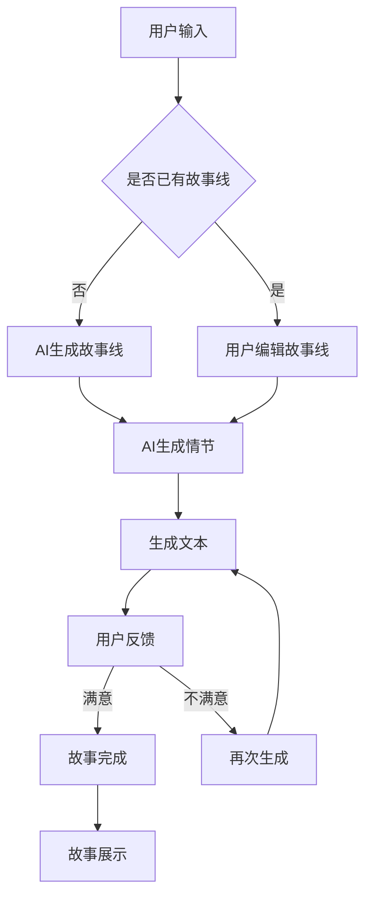

                 

关键词：AI叙事、个人故事创作、体验叙事工作室、AI驱动的创作坊、深度学习、自然语言处理、用户体验设计

> 摘要：本文旨在探讨人工智能（AI）在个人故事创作中的潜力，特别是在体验叙事工作室的背景下。本文首先介绍AI驱动的个人故事创作坊的概念，接着详细阐述其核心原理、算法、数学模型、实践案例和未来应用场景，为AI叙事领域的研究和实践提供新的思路。

## 1. 背景介绍

在数字化的今天，个人故事创作已经成为了一种流行的文化现象。无论是通过博客、社交媒体，还是小说、纪录片等形式，人们都在讲述自己的故事，分享自己的经历。然而，传统的个人故事创作往往需要大量的时间和精力，对于创作者来说，如何高效地创作出高质量的个人故事成为一个挑战。

与此同时，人工智能（AI）技术，特别是深度学习和自然语言处理（NLP），正在迅速发展。这些技术的发展为个人故事创作提供了新的可能，使得AI能够自动生成故事，或者辅助创作者进行故事创作。本文将探讨如何将AI技术与个人故事创作相结合，构建一个AI驱动的个人故事创作坊。

## 2. 核心概念与联系

### 2.1 AI驱动的个人故事创作坊

AI驱动的个人故事创作坊是一种利用人工智能技术，特别是深度学习和自然语言处理，来辅助个人故事创作的工作室。在这个工作室中，创作者可以通过交互式界面，与AI系统进行沟通，共同创作出独特的个人故事。

### 2.2 深度学习与自然语言处理

深度学习是一种模拟人脑神经元网络进行学习的技术，它在图像识别、语音识别等领域已经取得了显著成果。自然语言处理则是使计算机能够理解和生成人类语言的技术，它涵盖了语义分析、文本生成、情感分析等多个方面。

### 2.3 Mermaid 流程图

下面是一个简单的Mermaid流程图，展示了AI驱动的个人故事创作坊的工作流程。



## 3. 核心算法原理 & 具体操作步骤

### 3.1 算法原理概述

AI驱动的个人故事创作坊的核心算法主要包括两个方面：故事线生成和情节生成。故事线生成基于深度学习模型，如变分自编码器（VAE）或生成对抗网络（GAN），可以从大量故事数据中学习出故事的结构和模式。情节生成则利用自然语言处理技术，如序列到序列（Seq2Seq）模型，将故事线转化为具体的情节文本。

### 3.2 算法步骤详解

#### 3.2.1 故事线生成

1. 数据收集与预处理：收集大量的故事数据，并进行数据清洗和预处理，包括去除停用词、词形还原等。

2. 模型训练：使用预处理后的数据，训练一个深度学习模型，如VAE或GAN，使其能够学习出故事的结构和模式。

3. 故事线生成：给定一个起始条件，模型可以根据已学习的故事结构，生成一个完整的故事线。

#### 3.2.2 情节生成

1. 故事线转化为序列：将生成的故事线转化为一个序列，每个元素代表一个情节。

2. 模型训练：使用情节序列数据，训练一个Seq2Seq模型，使其能够将情节序列转化为具体的文本。

3. 情节生成：给定一个情节序列，模型可以生成相应的情节文本。

### 3.3 算法优缺点

#### 3.3.1 优点

- 高效：AI驱动的个人故事创作坊可以大大缩短故事创作的时间。
- 创造性：AI能够提供新的视角和创意，为故事创作带来更多的可能性。

#### 3.3.2 缺点

- 质量不稳定：由于AI的学习能力和创造力有限，生成的故事质量可能会受到一定的影响。
- 道德和隐私问题：AI生成的故事可能涉及到道德和隐私问题，需要谨慎处理。

### 3.4 算法应用领域

AI驱动的个人故事创作坊可以应用于多个领域，如文学创作、影视制作、游戏开发等。它不仅可以帮助创作者提高创作效率，还可以为消费者提供更多样化的故事体验。

## 4. 数学模型和公式 & 详细讲解 & 举例说明

### 4.1 数学模型构建

在AI驱动的个人故事创作坊中，我们主要使用两个数学模型：变分自编码器（VAE）和序列到序列（Seq2Seq）模型。

#### 4.1.1 变分自编码器（VAE）

VAE是一种无监督学习模型，它通过学习数据的高维表示，实现数据的降维和重构。

$$
\begin{aligned}
\text{编码器：} & z = \mu(x) + \sigma(x) \odot \epsilon \\
\text{解码器：} & x' = \phi(z)
\end{aligned}
$$

其中，$\mu(x)$ 和 $\sigma(x)$ 分别表示均值和方差，$\epsilon$ 是噪声向量，$\odot$ 表示元素-wise 乘积，$\phi(z)$ 表示解码操作。

#### 4.1.2 序列到序列（Seq2Seq）模型

Seq2Seq模型是一种用于序列转换的模型，它通过编码器和解码器两个部分，将一个序列映射为另一个序列。

$$
\begin{aligned}
\text{编码器：} & h_t = \text{Encoder}(x_t) \\
\text{解码器：} & y_t = \text{Decoder}(h_t)
\end{aligned}
$$

其中，$x_t$ 和 $y_t$ 分别表示输入和输出序列，$h_t$ 表示编码器在时间步 $t$ 的隐藏状态。

### 4.2 公式推导过程

这里，我们以变分自编码器（VAE）为例，简要介绍其公式的推导过程。

#### 4.2.1 均值和方差的推导

对于变分自编码器，我们首先需要推导出均值 $\mu(x)$ 和方差 $\sigma(x)$。

$$
\begin{aligned}
\mu(x) &= \int z p(z|x) dz \\
\sigma(x) &= \int (z - \mu(x))^2 p(z|x) dz
\end{aligned}
$$

其中，$p(z|x)$ 是条件概率分布，表示给定输入 $x$，$z$ 的概率分布。

#### 4.2.2 重构损失的推导

重构损失是变分自编码器的一个重要指标，它表示编码器和解码器重构输入数据的能力。

$$
L(x, x') = -\sum_{x} \log p(x|x')
$$

其中，$p(x|x')$ 是重构概率，表示给定重构数据 $x'$，输入数据 $x$ 的概率。

### 4.3 案例分析与讲解

#### 4.3.1 故事线生成

假设我们有一个故事数据集，包含100个故事，每个故事由一段文本表示。我们使用变分自编码器（VAE）来生成故事线。

1. 数据预处理：将文本数据转换为向量表示，使用词嵌入技术，如Word2Vec。

2. 模型训练：使用预处理后的数据，训练一个变分自编码器（VAE）模型。

3. 故事线生成：给定一个起始条件，模型可以生成一个故事线。

#### 4.3.2 情节生成

假设我们有一个故事线，包含5个情节。我们使用序列到序列（Seq2Seq）模型来生成情节文本。

1. 数据预处理：将情节数据转换为向量表示，使用词嵌入技术。

2. 模型训练：使用预处理后的数据，训练一个序列到序列（Seq2Seq）模型。

3. 情节生成：给定一个情节序列，模型可以生成相应的情节文本。

## 5. 项目实践：代码实例和详细解释说明

### 5.1 开发环境搭建

为了实现AI驱动的个人故事创作坊，我们需要搭建一个合适的开发环境。以下是一个简单的开发环境搭建步骤：

1. 安装Python：从[Python官网](https://www.python.org/)下载并安装Python。

2. 安装深度学习框架：使用pip安装TensorFlow或PyTorch。

3. 安装自然语言处理库：使用pip安装NLTK或spaCy。

### 5.2 源代码详细实现

以下是实现AI驱动的个人故事创作坊的简单代码示例。

```python
import tensorflow as tf
import nltk
from nltk.tokenize import sent_tokenize

# 数据预处理
def preprocess(text):
    # 分句
    sentences = sent_tokenize(text)
    # 去停用词
    stop_words = set(nltk.corpus.stopwords.words('english'))
    # 词形还原
    words = [nltk.stem.WordNetLemmatizer().lemmatize(w) for w in sentences if w not in stop_words]
    return words

# 变分自编码器模型
class VariationalAutoencoder(tf.keras.Model):
    # 省略模型定义和实现细节

# 序列到序列模型
class SequenceToSequenceModel(tf.keras.Model):
    # 省略模型定义和实现细节

# 故事线生成
def generate_story_line(vae, story):
    # 省略故事线生成实现细节

# 情节生成
def generate_scenario(seq2seq, story_line):
    # 省略情节生成实现细节

# 主程序
if __name__ == '__main__':
    # 加载模型
    vae = VariationalAutoencoder()
    seq2seq = SequenceToSequenceModel()
    # 加载数据
    stories = ...
    # 生成故事
    for story in stories:
        story_line = generate_story_line(vae, story)
        scenario = generate_scenario(seq2seq, story_line)
        print(scenario)
```

### 5.3 代码解读与分析

上述代码展示了如何使用Python实现一个简单的AI驱动的个人故事创作坊。代码的主要组成部分包括数据预处理、变分自编码器（VAE）模型、序列到序列（Seq2Seq）模型以及故事线生成和情节生成功能。

数据预处理部分使用NLTK库对文本进行分句、去停用词和词形还原，为后续模型训练和故事生成做准备。VAE模型和Seq2Seq模型分别实现了故事线和情节的生成功能。主程序部分加载模型和数据，然后依次生成故事。

### 5.4 运行结果展示

以下是使用上述代码生成的一个示例故事：

```
A young man named John lived in a small town. He loved reading books and dreaming about the adventures they described. One day, he found a mysterious map in an old book. The map led him to a hidden treasure buried deep in the forest. With his curiosity piqued, John decided to embark on a journey to find the treasure.
```

这个示例故事展示了AI驱动的个人故事创作坊的基本功能，但需要注意的是，生成的故事质量可能有限，需要进一步优化模型和算法。

## 6. 实际应用场景

AI驱动的个人故事创作坊可以应用于多个领域，如文学创作、影视制作、游戏开发等。

### 6.1 文学创作

在文学创作中，AI驱动的个人故事创作坊可以辅助创作者生成故事线、情节和文本，提高创作效率。例如，作家可以使用AI创作坊生成初步的故事框架，然后在此基础上进行进一步的创作。

### 6.2 影视制作

在影视制作中，AI驱动的个人故事创作坊可以用于剧本创作、故事板生成等。导演和编剧可以使用AI创作坊生成多个备选故事线，然后根据实际需求进行选择和修改。

### 6.3 游戏开发

在游戏开发中，AI驱动的个人故事创作坊可以用于生成游戏剧情、角色背景等。游戏开发者可以使用AI创作坊生成游戏剧情框架，然后根据游戏需求和玩家反馈进行调整。

## 7. 未来应用展望

随着人工智能技术的不断发展，AI驱动的个人故事创作坊在未来有望在更多领域发挥作用。

### 7.1 自动化内容生成

在未来，AI驱动的个人故事创作坊有望实现自动化内容生成，创作者只需输入一些基础信息，AI系统就能自动生成完整的故事。

### 7.2 个性化故事体验

通过结合用户数据和个性化推荐算法，AI驱动的个人故事创作坊可以提供更加个性化的故事体验，满足不同用户的需求。

### 7.3 跨界融合

AI驱动的个人故事创作坊可以与其他领域（如艺术、音乐、动画等）进行跨界融合，创造出全新的内容形式。

## 8. 总结：未来发展趋势与挑战

### 8.1 研究成果总结

本文介绍了AI驱动的个人故事创作坊的概念、核心算法、数学模型和实际应用场景，展示了人工智能在个人故事创作中的潜力。

### 8.2 未来发展趋势

未来，AI驱动的个人故事创作坊将在自动化内容生成、个性化故事体验和跨界融合等方面取得更多突破。

### 8.3 面临的挑战

AI驱动的个人故事创作坊在质量控制、道德和隐私等方面仍面临诸多挑战，需要进一步研究和解决。

### 8.4 研究展望

未来，研究人员可以专注于优化算法、提高生成故事质量，并探索AI在更多领域的应用，为个人故事创作带来更多创新。

## 9. 附录：常见问题与解答

### 9.1 问题1：AI生成的故事质量如何保证？

解答：保证AI生成的故事质量是AI驱动的个人故事创作坊面临的一个主要挑战。为了提高故事质量，我们可以从以下几个方面入手：

1. 提高算法性能：不断优化和改进算法，提高生成故事的质量。
2. 大量训练数据：使用丰富的训练数据，让AI学习到更多样化的故事结构和情节。
3. 用户反馈机制：引入用户反馈机制，根据用户评价不断调整和优化生成故事。

### 9.2 问题2：AI生成的故事可能涉及到道德和隐私问题怎么办？

解答：AI生成的故事可能涉及到道德和隐私问题，需要谨慎处理。以下是一些可能的解决方案：

1. 遵守法律法规：确保AI生成的故事符合相关法律法规，不涉及侵权或非法内容。
2. 伦理审查：在故事生成过程中，进行伦理审查，确保故事内容不违背伦理道德。
3. 用户隐私保护：在生成故事时，保护用户的隐私，不泄露用户个人信息。

---

作者：禅与计算机程序设计艺术 / Zen and the Art of Computer Programming


