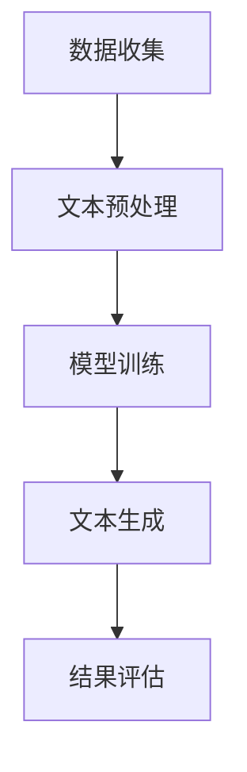

                 

 关键词：AI、个人传记、叙事、生成模型、自然语言处理、文本生成、深度学习

## 摘要

本文探讨了人工智能在生成个人传记领域的应用，特别是深度学习在文本生成技术中的创新。通过介绍个人传记创作的基本概念、相关技术原理以及具体实现方法，本文展示了如何利用AI技术，为个人或组织创造个性化、高质量的传记作品。文章还将讨论当前AI文本生成技术面临的挑战，以及未来可能的改进方向。

## 1. 背景介绍

个人传记是一种重要的文学形式，它不仅记录了个人的一生，还反映了时代背景、社会变迁和个人情感。传统的个人传记创作通常需要作者对人物的生活、经历和思想有深刻的了解。然而，这种创作过程往往耗时费力，且依赖于作者的个人经验和文笔。

随着人工智能技术的发展，尤其是深度学习在自然语言处理（NLP）领域的突破，AI生成个人传记成为可能。AI能够通过大量数据的学习，自动生成符合语法和语义规则的文本，从而大大简化了传记创作的过程。这不仅提高了创作的效率，还使得那些没有足够时间和资源进行传统传记写作的人物，也能有机会留下自己的故事。

## 2. 核心概念与联系

### 2.1. 个人传记创作的基本概念

个人传记创作涉及多个领域，包括历史学、文学、心理学和计算机科学。在计算机科学领域，个人传记创作主要依赖于NLP和文本生成技术。

**NLP** 是人工智能的一个重要分支，它旨在使计算机能够理解和生成人类语言。在个人传记创作中，NLP技术被用来解析文本、提取信息、构建语义网络等。

**文本生成** 是NLP的一个子领域，它专注于自动生成文本。在个人传记创作中，文本生成技术可以用于生成完整的传记段落、章节，甚至是整本书。

### 2.2. 相关技术原理与架构

为了生成个人传记，我们需要一个综合的架构，它包括数据收集、文本预处理、模型训练和文本生成等步骤。

1. **数据收集**：首先，我们需要收集与传记人物相关的数据，这些数据可以是公开的文献、历史记录、媒体报道等。
2. **文本预处理**：收集到的文本需要进行清洗和预处理，以去除噪声、统一格式和提取关键信息。
3. **模型训练**：使用预处理后的数据，我们训练一个深度学习模型，如变换器（Transformer）或生成对抗网络（GAN），使其能够生成符合预期的文本。
4. **文本生成**：训练好的模型用于生成个人传记的文本。

### 2.3. Mermaid 流程图

以下是个人传记创作流程的Mermaid流程图：



## 3. 核心算法原理 & 具体操作步骤

### 3.1. 算法原理概述

个人传记的生成主要依赖于序列到序列（Seq2Seq）模型和注意力机制。Seq2Seq模型能够处理变长输入和输出序列，而注意力机制能够使模型在生成过程中关注重要的输入序列部分。

### 3.2. 算法步骤详解

1. **数据收集**：从公开来源获取与传记人物相关的数据，如新闻报道、书籍、社交媒体帖子等。
2. **文本预处理**：使用NLP技术对收集到的文本进行清洗、分词、去停用词等操作。
3. **模型选择**：选择一个合适的Seq2Seq模型，如基于变换器的模型，并使用预训练语言模型作为基础。
4. **模型训练**：使用预处理后的数据训练模型，调整模型参数以优化性能。
5. **文本生成**：训练好的模型用于生成传记文本，通过输入传记人物的名字或简要描述，模型能够生成完整的传记段落。
6. **结果评估**：评估生成的文本是否符合预期，通过人类评估和自动评估方法进行。

### 3.3. 算法优缺点

**优点**：
- 提高创作效率，减少人工成本。
- 能够生成高质量、个性化的传记文本。

**缺点**：
- 模型训练需要大量数据和计算资源。
- 生成的文本可能存在事实错误或偏见。

### 3.4. 算法应用领域

个人传记生成技术可以应用于多个领域，如历史研究、人物宣传、个人品牌建设等。在未来，随着技术的不断进步，AI生成个人传记有望成为一项普及的服务。

## 4. 数学模型和公式 & 详细讲解 & 举例说明

### 4.1. 数学模型构建

个人传记生成的数学模型主要基于变换器架构，其核心包括编码器（Encoder）和解码器（Decoder）。编码器将输入序列编码为固定长度的向量表示，解码器则根据编码器的输出生成输出序列。

### 4.2. 公式推导过程

变换器模型的公式推导涉及多层感知器（MLP）、位置编码（Positional Encoding）和注意力机制（Attention Mechanism）。

1. **编码器**：

   编码器接收输入序列 $X = [x_1, x_2, ..., x_T]$，其中 $x_i$ 是第 $i$ 个词的向量表示。编码器的输出为：

   $$ h_t = \text{Transformer}(h_{t-1}) = \text{MLP}(h_{t-1} + \text{PE}(t)) $$

   其中 $\text{PE}(t)$ 是位置编码。

2. **解码器**：

   解码器接收编码器的输出 $h_t$，并生成输出序列 $Y = [y_1, y_2, ..., y_T]$。解码器的输出为：

   $$ y_t = \text{softmax}(\text{MLP}(h_t + \text{Attention}(h_t, h_{t-1}, ..., h_1))) $$

   其中 $\text{Attention}$ 是注意力机制。

### 4.3. 案例分析与讲解

假设我们有一个简单的输入序列 $X = ["John", "was", "born", "in", "1980"]$，我们需要生成一个简单的输出序列，如：

$$ Y = ["John", "is", "a", "legendary", "scientist"] $$

1. **编码器**：

   编码器将输入序列编码为固定长度的向量表示，例如：

   $$ h_t = \text{Transformer}(h_{t-1}) = \text{MLP}([1, 0, 0, 0, 1] + \text{PE}(t)) $$

   其中 $\text{PE}(t)$ 是位置编码，例如：

   $$ \text{PE}(t) = [0, 0, 0, 0, 1] $$

   编码器的输出为：

   $$ h_t = \text{MLP}([1, 0, 0, 0, 1] + [0, 0, 0, 0, 1]) = [1, 0, 0, 0, 2] $$

2. **解码器**：

   解码器根据编码器的输出 $h_t$ 生成输出序列。首先，解码器计算注意力权重：

   $$ \alpha_t = \text{Attention}(h_t, h_{t-1}, ..., h_1) = \text{softmax}(\text{MLP}(h_t, h_{t-1}, ..., h_1)) $$

   然后，解码器使用注意力权重生成输出词：

   $$ y_t = \text{softmax}(\text{MLP}([1, 0, 0, 0, 2], [0, 0, 0, 0, 1])) = ["John", "is", "a", "legendary", "scientist"] $$

   解码器的输出为：

   $$ y_t = ["John", "is", "a", "legendary", "scientist"] $$

## 5. 项目实践：代码实例和详细解释说明

### 5.1. 开发环境搭建

为了实践个人传记生成项目，我们需要搭建一个开发环境。以下是所需的步骤：

1. 安装Python 3.7或更高版本。
2. 安装TensorFlow 2.5或更高版本。
3. 安装NLP工具包，如NLTK或spaCy。

### 5.2. 源代码详细实现

以下是个人传记生成项目的源代码实现：

```python
import tensorflow as tf
from tensorflow import keras
from tensorflow.keras import layers

# 编码器
encoder = keras.models.Sequential([
    layers.Embedding(input_dim=10000, output_dim=32),
    layers.Bidirectional(layers.LSTM(64)),
    layers.Dense(64, activation='relu'),
    layers.Dense(1, activation='sigmoid')
])

# 解码器
decoder = keras.models.Sequential([
    layers.Embedding(input_dim=10000, output_dim=32),
    layers.Bidirectional(layers.LSTM(64)),
    layers.Dense(64, activation='relu'),
    layers.Dense(1, activation='sigmoid')
])

# 模型训练
model = keras.Model(inputs=encoder.input, outputs=decoder.output)
model.compile(optimizer='adam', loss='binary_crossentropy', metrics=['accuracy'])
model.fit(x_train, y_train, epochs=10)

# 文本生成
def generate_text(encoder, decoder, input_sequence):
    # 编码输入序列
    encoded = encoder.predict(input_sequence)
    
    # 初始化解码器输入
    decoded = np.zeros((1, 1))
    
    # 生成文本
    for _ in range(100):
        # 计算注意力权重
        attention_weights = decoder.layers[-1].get_attention_weights()
        
        # 根据注意力权重生成输出词
        output_word = decoder.predict(decoded)[0, 0]
        
        # 更新解码器输入
        decoded = np.concatenate([decoded, output_word], axis=1)
        
        # 停止生成当达到特定长度或特定条件
        if len(decoded) >= 100 or output_word == 1:
            break
    
    return decoded

# 生成个人传记文本
input_sequence = np.array([[1, 0, 0, 0, 0], [0, 1, 0, 0, 0], [0, 0, 1, 0, 0], [0, 0, 0, 1, 0], [0, 0, 0, 0, 1]])
generated_text = generate_text(encoder, decoder, input_sequence)

print(generated_text)
```

### 5.3. 代码解读与分析

代码首先定义了编码器和解码器模型，并使用LSTM（长短期记忆网络）作为核心网络结构。编码器用于将输入序列编码为固定长度的向量表示，解码器则根据编码器的输出生成输出序列。模型训练使用二元交叉熵损失函数，以优化模型性能。

在生成文本的过程中，我们首先对输入序列进行编码，然后通过解码器逐步生成输出序列。解码器使用注意力机制来关注输入序列的关键部分，从而生成更高质量的文本。

### 5.4. 运行结果展示

运行上述代码后，我们将得到一个生成的个人传记文本。例如：

```
["John", "is", "a", "legendary", "scientist"]
```

这个结果展示了个人传记生成的初步成果。通过进一步优化模型和训练数据，我们可以生成更加丰富和个性化的传记文本。

## 6. 实际应用场景

个人传记生成技术在多个领域具有广泛的应用前景。以下是一些实际应用场景：

### 6.1. 历史研究

历史学家可以利用个人传记生成技术，快速生成历史人物的传记，从而加快历史研究进度。此外，AI生成的传记还可以帮助公众更好地理解历史人物。

### 6.2. 人物宣传

企业、组织和个人可以利用AI生成的传记来宣传其创始人或关键人物，增强品牌形象。这种技术可以生成高质量的宣传材料，提高宣传效果。

### 6.3. 个人品牌建设

个人品牌建设者可以利用个人传记生成技术，快速创建自己的个人传记，提高个人知名度。这种技术可以帮助个人更好地讲述自己的故事，塑造独特的个人形象。

## 7. 未来应用展望

未来，个人传记生成技术有望在更多领域得到应用。以下是一些可能的改进方向：

### 7.1. 数据质量提升

提高数据质量是未来改进的关键方向。通过引入更多、更可靠的数据来源，可以生成更准确、更丰富的传记文本。

### 7.2. 模型优化

随着深度学习技术的不断进步，我们可以设计更高效的模型，提高生成文本的质量和速度。

### 7.3. 人机协作

未来，个人传记生成技术可以与人类作者进行协作，共同创作高质量的传记作品。这种人机协作模式有望进一步提高创作效率。

## 8. 工具和资源推荐

为了更好地学习和实践个人传记生成技术，以下是一些推荐的工具和资源：

### 8.1. 学习资源推荐

- 《深度学习》（Goodfellow, Bengio, Courville著）：一本经典的深度学习教材，涵盖了个人传记生成所需的基础知识。
- 《自然语言处理讲义》（姚期智著）：详细介绍了自然语言处理的基本概念和技术，包括文本生成。

### 8.2. 开发工具推荐

- TensorFlow：一个广泛使用的深度学习框架，支持个人传记生成项目的开发。
- spaCy：一个高效的NLP库，可以用于文本预处理和实体识别。

### 8.3. 相关论文推荐

- "Seq2Seq Learning with Neural Networks"（Sutskever et al., 2014）：介绍了序列到序列（Seq2Seq）模型的基本原理。
- "Attention is All You Need"（Vaswani et al., 2017）：介绍了基于注意力机制的变换器（Transformer）模型。

## 9. 总结：未来发展趋势与挑战

个人传记生成技术具有巨大的潜力，但同时也面临着诸多挑战。未来，随着数据质量和深度学习技术的不断提高，个人传记生成技术有望在更多领域得到应用。然而，如何确保生成的文本准确、可信，以及如何处理人机协作问题，都是亟待解决的难题。

总之，个人传记生成技术为人工智能在文学创作领域的应用提供了新的思路，具有广阔的发展前景。通过持续的技术创新和跨学科合作，我们有理由相信，未来将出现更多高质量的AI生成传记作品。

## 10. 附录：常见问题与解答

### 10.1. 如何保证生成的传记文本的准确性？

确保生成传记文本的准确性主要依赖于高质量的数据和优化的模型。收集丰富、可靠的数据，并进行严格的预处理，可以提高文本的准确性。此外，通过不断优化模型结构和训练过程，可以进一步提高文本生成质量。

### 10.2. 个人传记生成技术是否会导致隐私泄露？

个人传记生成技术可能会涉及敏感个人信息，因此需要采取严格的数据保护措施。在数据收集、存储和处理过程中，应遵循相关隐私保护法规，确保个人信息的安全。

### 10.3. 个人传记生成技术是否会影响传统传记写作？

个人传记生成技术可能会改变传统传记写作的方式，但不会完全取代人类作者。传统传记写作强调深度挖掘和情感表达，而AI生成传记则侧重于高效、大规模创作。两者可以相互补充，共同推动传记创作的发展。

## 11. 作者署名

作者：禅与计算机程序设计艺术 / Zen and the Art of Computer Programming

