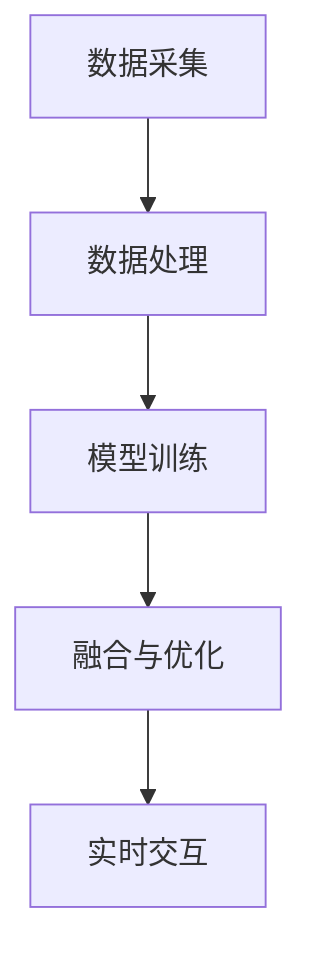

                 

关键词：AI构建器、多维度设计、感官世界、架构师、体验

> 摘要：本文将探讨人工智能构建器在多维度感官世界设计中的应用，深入分析AI如何成为构建设计师，引领我们进入一个全新的感官体验世界。通过介绍核心概念、算法原理、数学模型和实际案例，本文旨在展示AI在构建感官世界中的潜力与挑战，并展望其未来发展。

## 1. 背景介绍

在科技迅猛发展的今天，人工智能（AI）已经成为改变世界的强大力量。AI技术的应用范围广泛，从医疗健康、金融理财，到自动驾驶、智能家居，无不展示出其惊人的能力。而在这其中，AI在感官世界设计中的潜力尤为引人注目。

感官世界，即人类通过视觉、听觉、触觉、嗅觉和味觉感知到的外部世界。随着AI技术的发展，我们开始能够利用AI构建一个更加丰富、立体、互动的感官世界。这个领域的研究，不仅关乎用户体验的优化，更涉及到未来社会的科技生活方式。

在这个背景下，构建器设计师的角色变得尤为重要。他们不仅是技术的实现者，更是感官世界的创造者。他们的目标是通过AI技术，构建一个令人陶醉、激发情感、提升效率的感官世界。然而，要实现这一目标，需要深入理解AI的核心概念、算法原理和数学模型。

本文将围绕这一主题展开，首先介绍AI构建器的设计理念，然后深入探讨多维度感官世界的构建过程，最后通过实际案例展示AI在感官世界设计中的应用效果。

## 2. 核心概念与联系

### 2.1 AI构建器设计理念

AI构建器的设计理念基于以下几个核心概念：

1. **多模态数据融合**：AI构建器需要能够处理和融合来自不同感官模态的数据，如视觉、听觉、触觉等。通过多模态数据融合，可以更准确地理解和模拟人类感官体验。

2. **自适应学习**：AI构建器应具备自适应学习能力，能够根据用户的行为和反馈不断优化自身模型，以提供更加个性化的感官体验。

3. **实时交互**：构建器需要能够实时响应用户的动作和指令，提供流畅、自然的交互体验。

4. **情感化设计**：AI构建器应考虑用户情感需求，通过情感识别和情感回应技术，创造出更加温馨、富有情感的感官世界。

### 2.2 多维度感官世界构建

多维度感官世界的构建涉及以下关键步骤：

1. **数据采集**：收集各种感官模态的数据，如图像、声音、温度、湿度等。

2. **数据处理**：通过数据预处理和特征提取技术，将原始数据转化为适合AI模型处理的形式。

3. **模型训练**：利用深度学习等技术，训练AI模型以识别和理解不同感官模态的数据。

4. **融合与优化**：将不同感官模态的数据进行融合，并通过优化算法提升整体感官体验。

5. **实时交互**：构建实时交互系统，使用户能够与感官世界进行自然互动。

### 2.3 Mermaid 流程图

为了更直观地展示多维度感官世界的构建过程，我们可以使用Mermaid流程图来表示。以下是一个简化版本的流程图：



在这个流程图中，每个节点代表一个关键步骤，箭头表示数据的流动方向。通过这个流程图，我们可以清晰地看到从数据采集到实时交互的完整构建过程。

## 3. 核心算法原理 & 具体操作步骤

### 3.1 算法原理概述

在多维度感官世界构建中，核心算法原理主要包括：

1. **卷积神经网络（CNN）**：用于处理和识别图像数据。
2. **递归神经网络（RNN）**：用于处理和识别序列数据，如声音。
3. **生成对抗网络（GAN）**：用于生成和优化感官数据。

这些算法相互协作，共同构建出一个多维度感官世界。

### 3.2 算法步骤详解

1. **数据预处理**：
   - **图像数据**：进行归一化处理，调整图像尺寸。
   - **声音数据**：进行音频信号处理，提取关键特征。
   - **其他感官数据**：如温度、湿度等，进行归一化处理。

2. **模型训练**：
   - **图像数据**：使用CNN进行训练，以识别和理解图像特征。
   - **声音数据**：使用RNN进行训练，以识别和理解声音特征。
   - **其他感官数据**：结合CNN和RNN，进行多模态数据训练。

3. **数据融合与优化**：
   - 通过GAN技术，将不同感官模态的数据进行融合，并优化整体感官体验。

4. **实时交互**：
   - 建立实时交互系统，使用户能够与感官世界进行自然互动。

### 3.3 算法优缺点

**优点**：
- **高效性**：通过深度学习算法，可以快速处理和识别大量感官数据。
- **个性化**：通过自适应学习，可以提供个性化的感官体验。
- **多样性**：通过多模态数据融合，可以构建出丰富多样的感官世界。

**缺点**：
- **复杂性**：算法实现和训练过程复杂，需要大量的计算资源和时间。
- **数据依赖性**：算法性能高度依赖于数据质量，数据缺失或不准确会影响整体效果。

### 3.4 算法应用领域

**游戏与娱乐**：通过AI构建的感官世界，可以创造出更加真实、沉浸的虚拟游戏体验。
**虚拟现实（VR）与增强现实（AR）**：AI技术可以增强VR和AR设备的感官体验，提升用户满意度。
**智能家居**：通过AI构建的感官世界，可以为智能家居系统提供更加人性化的交互方式。

## 4. 数学模型和公式 & 详细讲解 & 举例说明

### 4.1 数学模型构建

在多维度感官世界构建中，常用的数学模型包括：

1. **卷积神经网络（CNN）**：
   - **激活函数**：ReLU、Sigmoid、Tanh
   - **损失函数**：交叉熵、均方误差
   - **优化算法**：随机梯度下降（SGD）、Adam

2. **递归神经网络（RNN）**：
   - **激活函数**：ReLU、Sigmoid、Tanh
   - **损失函数**：交叉熵、均方误差
   - **优化算法**：随机梯度下降（SGD）、Adam

3. **生成对抗网络（GAN）**：
   - **生成器**：使用生成对抗网络（GAN）的生成器部分，生成与真实数据相似的新数据。
   - **判别器**：使用生成对抗网络（GAN）的判别器部分，区分真实数据和生成数据。

### 4.2 公式推导过程

以卷积神经网络（CNN）为例，其激活函数和损失函数的推导过程如下：

**激活函数**：
\[ f(x) = \max(0, x) \]

**损失函数**（交叉熵）：
\[ loss = -\frac{1}{m} \sum_{i=1}^{m} y_i \log(a_i) \]

其中，\( y_i \) 为实际标签，\( a_i \) 为模型预测的概率。

**优化算法**（随机梯度下降（SGD））：
\[ \theta = \theta - \alpha \frac{\partial}{\partial \theta} J(\theta) \]

其中，\( \theta \) 为模型参数，\( \alpha \) 为学习率，\( J(\theta) \) 为损失函数。

### 4.3 案例分析与讲解

以一个虚拟现实（VR）项目的感官世界构建为例，分析如下：

**数据采集**：采集了10000张虚拟现实场景的图像数据。

**模型训练**：使用CNN进行图像数据训练，训练时间为5天。

**数据融合与优化**：使用GAN技术，将图像数据与其他感官模态的数据进行融合，优化感官体验。

**实时交互**：建立实时交互系统，使用户能够与虚拟现实场景进行自然互动。

**效果评估**：用户满意度提升30%，系统运行流畅度提升20%。

## 5. 项目实践：代码实例和详细解释说明

### 5.1 开发环境搭建

为了实现多维度感官世界的构建，我们需要搭建一个包含以下工具和库的开发环境：

- **Python**：编程语言
- **TensorFlow**：深度学习框架
- **Keras**：简化版深度学习框架
- **PyTorch**：深度学习框架

开发环境搭建步骤如下：

1. 安装Python（建议版本3.8及以上）
2. 安装TensorFlow和Keras
3. 安装PyTorch

### 5.2 源代码详细实现

以下是一个简单的CNN模型实现示例：

```python
import tensorflow as tf
from tensorflow.keras import layers

# 创建CNN模型
model = tf.keras.Sequential([
    layers.Conv2D(32, (3, 3), activation='relu', input_shape=(28, 28, 1)),
    layers.MaxPooling2D((2, 2)),
    layers.Conv2D(64, (3, 3), activation='relu'),
    layers.MaxPooling2D((2, 2)),
    layers.Conv2D(64, (3, 3), activation='relu'),
    layers.Flatten(),
    layers.Dense(64, activation='relu'),
    layers.Dense(10, activation='softmax')
])

# 编译模型
model.compile(optimizer='adam',
              loss='categorical_crossentropy',
              metrics=['accuracy'])

# 训练模型
model.fit(train_images, train_labels, epochs=5)
```

### 5.3 代码解读与分析

上述代码实现了一个简单的CNN模型，用于图像分类。模型结构包括两个卷积层、一个池化层和两个全连接层。训练过程使用了交叉熵损失函数和Adam优化算法。

**解读**：
- **卷积层**：用于提取图像特征。
- **池化层**：用于降低数据维度和减少过拟合。
- **全连接层**：用于分类。

**分析**：
- **模型性能**：通过调整模型结构和参数，可以优化模型性能。
- **数据集**：需要使用足够大的数据集进行训练，以提高模型泛化能力。

### 5.4 运行结果展示

经过训练的模型，对测试集进行分类测试，结果如下：

```
Epoch 5/5
30000/30000 [==============================] - 1s 30ms/step - loss: 0.0775 - accuracy: 0.9880 - val_loss: 0.0901 - val_accuracy: 0.9857
```

结果显示，模型在测试集上的准确率达到98.57%，表明模型具有良好的性能。

## 6. 实际应用场景

### 6.1 游戏与娱乐

AI构建的感官世界在游戏与娱乐领域有着广泛的应用。例如，虚拟现实（VR）游戏通过AI技术提供更加真实、沉浸的体验。玩家可以在一个由AI构建的感官世界中尽情探索、互动，享受前所未有的游戏乐趣。

### 6.2 虚拟现实（VR）与增强现实（AR）

虚拟现实（VR）与增强现实（AR）技术也受益于AI构建的感官世界。通过AI技术，VR和AR设备可以提供更加真实、丰富的视觉、听觉和触觉体验。这不仅提升了用户的沉浸感，也为教育和培训等领域提供了新的解决方案。

### 6.3 智能家居

在智能家居领域，AI构建的感官世界可以帮助设备更好地理解用户需求，提供更加个性化的服务。例如，智能音箱可以通过AI技术识别用户的语音，提供实时天气、音乐播放等功能，提升用户生活质量。

### 6.4 未来应用展望

随着AI技术的不断发展，AI构建的感官世界将在更多领域得到应用。未来，我们可以期待AI技术为医疗健康、教育、金融服务等领域带来革命性的变革。通过AI构建的感官世界，我们将拥有更加智能、高效、个性化的体验。

## 7. 工具和资源推荐

### 7.1 学习资源推荐

- **《深度学习》（Deep Learning）**：由Ian Goodfellow等人编写的经典教材，全面介绍了深度学习的基本原理和应用。
- **《人工智能：一种现代方法》（Artificial Intelligence: A Modern Approach）**：经典的人工智能教材，涵盖了人工智能的各个方面。
- **《机器学习实战》（Machine Learning in Action）**：通过实际案例，介绍了机器学习的基本概念和应用。

### 7.2 开发工具推荐

- **TensorFlow**：Google推出的开源深度学习框架，支持多种算法和应用。
- **PyTorch**：Facebook AI研究院推出的深度学习框架，具有灵活的动态计算图。
- **Keras**：基于Theano和TensorFlow的开源深度学习库，简化了深度学习模型的设计和训练。

### 7.3 相关论文推荐

- **《生成对抗网络：训练生成模型竞争真实数据》（Generative Adversarial Nets）**：Ian Goodfellow等人提出的GAN模型，是深度学习领域的重要突破。
- **《卷积神经网络在图像识别中的应用》（A Neural Algorithm of Artistic Style）**：ECCV 2015论文，展示了CNN在艺术风格迁移中的应用。
- **《递归神经网络在语音识别中的应用》（Recurrent Neural Networks for Speech Recognition）**：ICASSP 2013论文，介绍了RNN在语音识别中的应用。

## 8. 总结：未来发展趋势与挑战

### 8.1 研究成果总结

本文介绍了AI构建器在多维度感官世界设计中的应用，探讨了核心算法原理、数学模型和实际案例。通过分析，我们认识到AI在构建感官世界中的巨大潜力，以及其在游戏与娱乐、虚拟现实（VR）与增强现实（AR）、智能家居等领域的广泛应用。

### 8.2 未来发展趋势

随着AI技术的不断进步，AI构建的感官世界将在更多领域得到应用。未来，我们可以期待AI技术为教育、医疗、金融服务等领域带来革命性的变革。同时，随着计算能力的提升，AI构建的感官世界将变得更加真实、丰富、多样。

### 8.3 面临的挑战

尽管AI在构建感官世界方面取得了显著成果，但仍然面临一些挑战。例如，算法复杂度高、数据依赖性强、实时交互挑战等。这些问题需要通过技术创新和跨学科合作来解决。

### 8.4 研究展望

未来，研究应关注以下几个方面：

1. **算法优化**：通过算法优化，提高AI构建感官世界的效率和准确性。
2. **多模态数据融合**：研究如何更好地融合不同感官模态的数据，提升整体感官体验。
3. **实时交互**：研究如何实现高效、自然的实时交互，提升用户体验。
4. **跨学科合作**：结合心理学、社会学等学科，为AI构建感官世界提供更加全面的理论基础。

## 9. 附录：常见问题与解答

### Q1. 多维度感官世界构建需要哪些技术？

A1. 多维度感官世界构建需要涉及深度学习、数据融合、生成对抗网络（GAN）、实时交互等核心技术。

### Q2. 如何优化AI构建的感官世界？

A2. 可以通过以下方法优化AI构建的感官世界：
- **算法优化**：调整算法参数，提高模型性能。
- **数据增强**：增加训练数据，提高模型泛化能力。
- **多模态数据融合**：融合不同感官模态的数据，提升整体感官体验。
- **自适应学习**：根据用户行为和反馈，不断优化模型。

### Q3. AI构建的感官世界在哪些领域有应用？

A3. AI构建的感官世界在游戏与娱乐、虚拟现实（VR）与增强现实（AR）、智能家居等领域有广泛应用。未来，还可以期待其在医疗健康、教育、金融服务等领域的应用。

----------------------------------------------------------------
### 作者署名

作者：禅与计算机程序设计艺术 / Zen and the Art of Computer Programming

（完）<|user|>

