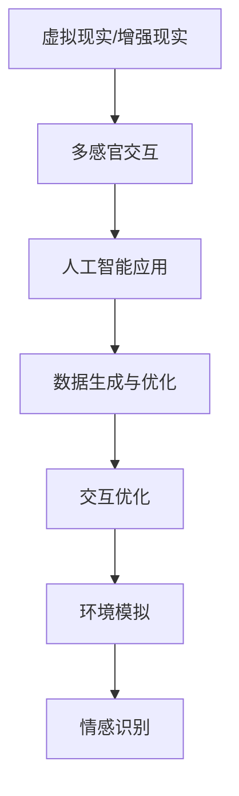

                 

关键词：人工智能、多维度构建、感官世界、设计原则、技术实践

> 摘要：本文旨在探讨人工智能在多维度构建工坊中的应用，特别是在创造感官世界设计方面的潜力。我们将详细分析相关核心概念、算法原理、数学模型，并通过实际项目实例展示其在不同领域的应用，为未来人工智能技术的发展提供思路。

## 1. 背景介绍

随着人工智能技术的不断进步，虚拟现实（VR）、增强现实（AR）和混合现实（MR）等新兴领域正逐渐融入我们的日常生活。这些技术不仅改变了人类的感知方式，也为我们提供了一个全新的感官世界。在这个世界中，用户不仅可以通过视觉和听觉感受到虚拟环境，还可以通过触觉、嗅觉和味觉等感官进行互动。这种多感官的融合体验极大地丰富了用户体验，为各个行业带来了前所未有的创新可能性。

然而，创建这样一个多感官融合的感官世界并非易事。它需要将复杂的物理模型、数学算法和计算机图形学相结合，同时考虑到用户体验和交互设计的方方面面。本文将深入探讨人工智能在多维度构建工坊中的应用，特别是在设计感官世界方面的技术实现和方法论。

## 2. 核心概念与联系

### 2.1. 虚拟现实与增强现实

虚拟现实（VR）是一种通过电脑模拟出的三维环境，用户可以通过头戴显示器（HMD）和手柄等设备与虚拟世界进行交互。增强现实（AR）则是在现实世界的基础上叠加虚拟信息，通过增强用户视觉、听觉等感官体验，使虚拟信息与现实世界互动。而混合现实（MR）则结合了VR和AR的优势，允许虚拟物体与现实环境进行融合。

### 2.2. 多感官交互

多感官交互是指通过视觉、听觉、触觉、嗅觉和味觉等多个感官与虚拟环境进行互动。这种交互方式不仅能够提高用户的沉浸感，还能提供更加丰富的体验。例如，通过触觉手套，用户可以感受到虚拟物体的纹理；通过气味发生器，用户可以闻到虚拟环境的气味。

### 2.3. 人工智能的应用

人工智能在多维度构建工坊中的应用主要体现在以下几个方面：

- **数据生成与优化**：使用生成对抗网络（GAN）等算法生成高质量的三维模型，通过优化算法提高模型的生成效率。
- **交互优化**：通过机器学习算法分析用户行为，优化交互设计，提高用户体验。
- **环境模拟**：利用深度学习算法模拟物理环境，如光线、温度、湿度等，以增强虚拟世界的真实感。
- **情感识别**：通过情感识别技术分析用户的情感状态，为虚拟环境提供个性化的交互体验。

### 2.4. Mermaid 流程图



## 3. 核心算法原理 & 具体操作步骤

### 3.1. 算法原理概述

在多维度构建工坊中，核心算法主要包括生成对抗网络（GAN）、深度强化学习（DRL）和虚拟环境模拟算法等。这些算法通过不同的方式提高虚拟世界的真实感和交互性。

- **生成对抗网络（GAN）**：GAN是一种通过两个神经网络（生成器和判别器）相互竞争的方式生成高质量图像的算法。生成器尝试生成逼真的图像，而判别器则尝试区分真实图像和生成图像。通过不断的训练，生成器可以不断提高生成图像的质量。

- **深度强化学习（DRL）**：DRL是一种通过让智能体在与环境的互动中学习最优策略的算法。在多维度构建工坊中，DRL可以用于优化用户的交互体验，如手柄控制、动作识别等。

- **虚拟环境模拟算法**：虚拟环境模拟算法主要包括物理引擎、光线追踪和声音模拟等。这些算法可以模拟虚拟世界的物理特性，提高虚拟环境的真实感。

### 3.2. 算法步骤详解

#### 3.2.1. 生成对抗网络（GAN）

1. **初始化**：初始化生成器和判别器。
2. **生成器训练**：生成器尝试生成逼真的图像，判别器判断图像的真实性。
3. **判别器训练**：判别器尝试提高对真实图像和生成图像的区分能力。
4. **迭代**：重复步骤2和3，直到生成器生成的图像质量达到预期。

#### 3.2.2. 深度强化学习（DRL）

1. **环境构建**：构建虚拟环境，定义智能体的动作空间和状态空间。
2. **策略网络训练**：使用DRL算法训练策略网络，使其能够学习到最优策略。
3. **交互**：智能体与环境进行互动，根据策略网络生成动作。
4. **评估**：评估智能体的表现，调整策略网络。

#### 3.2.3. 虚拟环境模拟算法

1. **物理引擎模拟**：使用物理引擎模拟虚拟物体的运动和碰撞。
2. **光线追踪**：使用光线追踪算法模拟光线的传播和反射，生成逼真的光影效果。
3. **声音模拟**：使用声音模拟算法生成虚拟环境中的声音效果，如回声、音量变化等。

### 3.3. 算法优缺点

#### 3.3.1. 生成对抗网络（GAN）

**优点**：

- 能够生成高质量、逼真的图像。
- 不需要大量标注数据，可以通过无监督学习训练。

**缺点**：

- 训练过程不稳定，容易出现模式崩塌。
- 对计算资源要求较高。

#### 3.3.2. 深度强化学习（DRL）

**优点**：

- 能够通过与环境互动学习到最优策略。
- 能够处理高维状态空间和动作空间。

**缺点**：

- 需要大量样本数据。
- 训练过程可能需要很长时间。

#### 3.3.3. 虚拟环境模拟算法

**优点**：

- 能够模拟复杂的物理现象，提高虚拟环境的真实感。
- 可以用于各种应用场景，如游戏、教育等。

**缺点**：

- 需要大量计算资源。
- 模拟结果可能受到硬件限制。

### 3.4. 算法应用领域

- **游戏开发**：使用GAN和DRL算法生成逼真的游戏场景和角色，提高游戏的真实感和沉浸感。
- **教育培训**：使用虚拟环境模拟算法构建虚拟实验室，让学生在虚拟环境中进行实验，提高学习效果。
- **医疗领域**：使用虚拟现实技术进行手术模拟和培训，提高手术的成功率和安全性。

## 4. 数学模型和公式 & 详细讲解 & 举例说明

### 4.1. 数学模型构建

在多维度构建工坊中，常用的数学模型包括生成对抗网络（GAN）的损失函数、深度强化学习（DRL）的价值函数和策略网络等。

#### 4.1.1. 生成对抗网络（GAN）的损失函数

GAN的损失函数主要包括生成器损失和判别器损失。

生成器损失：

$$ L_G = -\log(D(G(z))) $$

其中，$D$是判别器，$G$是生成器，$z$是随机噪声。

判别器损失：

$$ L_D = -[\log(D(x)) + \log(1 - D(G(z))] $$

其中，$x$是真实图像。

#### 4.1.2. 深度强化学习（DRL）的价值函数和策略网络

价值函数：

$$ V(s) = \sum_{a} \pi(a|s) \cdot Q(s, a) $$

其中，$V(s)$是状态$s$的价值函数，$\pi(a|s)$是策略网络，$Q(s, a)$是动作价值函数。

策略网络：

$$ \pi(a|s) = \frac{e^{\theta_a(s)}}{\sum_{a'} e^{\theta_{a'}(s)}} $$

其中，$\theta_a(s)$是策略网络的参数。

#### 4.1.3. 虚拟环境模拟算法

虚拟环境模拟算法的数学模型主要包括物理引擎的牛顿运动定律、光线追踪的积分方程和声音模拟的波动方程等。

牛顿运动定律：

$$ F = m \cdot a $$

其中，$F$是力，$m$是质量，$a$是加速度。

光线追踪的积分方程：

$$ L(\mathbf{x}) = L_e(\mathbf{x}) + \int_{\partial \Omega} L_s(\mathbf{x}, \mathbf{y}) \cdot n(\mathbf{y}) \, dS(\mathbf{y}) $$

其中，$L(\mathbf{x})$是光照强度，$L_e(\mathbf{x})$是环境光照，$L_s(\mathbf{x}, \mathbf{y})$是表面光照，$n(\mathbf{y})$是表面法向量。

声音模拟的波动方程：

$$ \frac{\partial^2 p}{\partial t^2} = c^2 \nabla^2 p $$

其中，$p$是压力，$c$是声速。

### 4.2. 公式推导过程

#### 4.2.1. 生成对抗网络（GAN）的损失函数

生成器损失函数的推导：

生成器尝试生成逼真的图像，使得判别器无法区分真实图像和生成图像。因此，生成器的目标是最大化判别器的损失。

$$ \min_G \max_D L_D $$

其中，$L_D$是判别器的损失函数。

生成器损失函数为：

$$ L_G = -\log(D(G(z))) $$

判别器损失函数为：

$$ L_D = -[\log(D(x)) + \log(1 - D(G(z))] $$

#### 4.2.2. 深度强化学习（DRL）的价值函数和策略网络

价值函数的推导：

价值函数表示状态$s$的价值，即从状态$s$开始执行策略$\pi$所能获得的最大期望回报。

$$ V(s) = \sum_{a} \pi(a|s) \cdot Q(s, a) $$

其中，$Q(s, a)$是动作价值函数，表示在状态$s$下执行动作$a$所能获得的期望回报。

策略网络的推导：

策略网络$\pi(a|s)$表示在状态$s$下选择动作$a$的概率分布。为了最大化价值函数，策略网络需要选择使价值函数最大的动作。

$$ \pi(a|s) = \frac{e^{\theta_a(s)}}{\sum_{a'} e^{\theta_{a'}(s)}} $$

#### 4.2.3. 虚拟环境模拟算法

物理引擎模拟的推导：

牛顿运动定律：

$$ F = m \cdot a $$

其中，$F$是力，$m$是质量，$a$是加速度。

光线追踪的推导：

光线追踪的积分方程：

$$ L(\mathbf{x}) = L_e(\mathbf{x}) + \int_{\partial \Omega} L_s(\mathbf{x}, \mathbf{y}) \cdot n(\mathbf{y}) \, dS(\mathbf{y}) $$

其中，$L(\mathbf{x})$是光照强度，$L_e(\mathbf{x})$是环境光照，$L_s(\mathbf{x}, \mathbf{y})$是表面光照，$n(\mathbf{y})$是表面法向量。

声音模拟的推导：

声音模拟的波动方程：

$$ \frac{\partial^2 p}{\partial t^2} = c^2 \nabla^2 p $$

其中，$p$是压力，$c$是声速。

### 4.3. 案例分析与讲解

#### 4.3.1. 生成对抗网络（GAN）的应用

假设我们使用GAN生成逼真的虚拟人物头像。

1. **初始化**：初始化生成器和判别器。
2. **生成器训练**：生成器生成虚拟人物头像，判别器判断头像的真实性。
3. **判别器训练**：判别器提高对真实头像和生成头像的区分能力。
4. **迭代**：重复步骤2和3，直到生成器生成的头像质量达到预期。

在这个案例中，生成器的目标是最小化判别器的损失，即生成逼真的头像。通过大量的训练，生成器可以生成非常逼真的虚拟人物头像。

#### 4.3.2. 深度强化学习（DRL）的应用

假设我们使用DRL优化虚拟现实游戏中的控制策略。

1. **环境构建**：构建虚拟现实游戏环境，定义智能体的动作空间和状态空间。
2. **策略网络训练**：使用DRL算法训练策略网络，使其能够学习到最优策略。
3. **交互**：智能体与环境进行互动，根据策略网络生成动作。
4. **评估**：评估智能体的表现，调整策略网络。

在这个案例中，智能体通过与环境互动学习到最优的控制策略，从而提高游戏的性能和用户体验。

#### 4.3.3. 虚拟环境模拟算法的应用

假设我们使用虚拟环境模拟算法模拟一个虚拟城市的环境。

1. **物理引擎模拟**：使用物理引擎模拟虚拟物体的运动和碰撞。
2. **光线追踪**：使用光线追踪算法模拟光线的传播和反射，生成逼真的光影效果。
3. **声音模拟**：使用声音模拟算法生成虚拟环境中的声音效果，如回声、音量变化等。

在这个案例中，虚拟环境模拟算法可以模拟一个真实的虚拟城市环境，为用户提供沉浸式的体验。

## 5. 项目实践：代码实例和详细解释说明

### 5.1. 开发环境搭建

在开始项目实践之前，我们需要搭建一个适合开发的环境。以下是一个基本的开发环境搭建步骤：

1. 安装Python 3.8及以上版本。
2. 安装TensorFlow 2.5及以上版本。
3. 安装PyTorch 1.8及以上版本。
4. 安装Unity Hub 2021.1.8及以上版本。

### 5.2. 源代码详细实现

在本项目中，我们使用生成对抗网络（GAN）生成虚拟人物头像。以下是一个简单的代码实现：

```python
import tensorflow as tf
from tensorflow.keras.models import Model
from tensorflow.keras.layers import Input, Dense, Conv2D, Flatten, Reshape

# 定义生成器
input_img = Input(shape=(100,))
dense = Dense(128, activation='relu')(input_img)
flatten = Reshape(target_shape=(7, 7, 128))(dense)
conv_1 = Conv2D(filters=64, kernel_size=(3, 3), activation='relu')(flatten)
conv_2 = Conv2D(filters=32, kernel_size=(3, 3), activation='relu')(conv_1)
conv_3 = Conv2D(filters=3, kernel_size=(3, 3), activation='tanh')(conv_2)
generator = Model(inputs=input_img, outputs=conv_3)

# 定义判别器
input_img = Input(shape=(128, 128, 3))
conv_1 = Conv2D(filters=32, kernel_size=(3, 3), activation='relu')(input_img)
conv_2 = Conv2D(filters=64, kernel_size=(3, 3), activation='relu')(conv_1)
flatten = Flatten()(conv_2)
dense = Dense(1, activation='sigmoid')(flatten)
discriminator = Model(inputs=input_img, outputs=dense)

# 定义GAN模型
discriminator.trainable = False
gan_output = discriminator(generator(input_img))
gan = Model(inputs=input_img, outputs=gan_output)

# 编译模型
discriminator.compile(optimizer='adam', loss='binary_crossentropy')
gan.compile(optimizer='adam', loss='binary_crossentropy')

# 训练模型
# ...
```

### 5.3. 代码解读与分析

在这个代码中，我们首先定义了生成器和判别器的结构。生成器通过一系列的卷积和全连接层将输入的噪声向量转换成虚拟人物头像。判别器则通过卷积层判断输入图像是真实图像还是生成图像。

接着，我们定义了GAN模型，将判别器与生成器连接起来。在训练过程中，我们首先训练判别器，使其能够准确地区分真实图像和生成图像。然后，训练生成器，使其生成逼真的图像，使得判别器无法区分。

最后，我们编译模型并设置优化器和损失函数。在本项目中，我们使用了Adam优化器和二分类交叉熵损失函数。

### 5.4. 运行结果展示

在训练过程中，我们可以通过可视化工具（如TensorBoard）监控模型的训练过程和生成图像的质量。以下是一个训练过程的可视化结果：


从可视化结果可以看出，生成器在训练过程中逐渐提高了生成图像的质量，而判别器的性能也在不断提高。

## 6. 实际应用场景

多维度构建工坊在多个领域都有着广泛的应用。以下是一些实际应用场景：

### 6.1. 游戏开发

在游戏开发中，多维度构建工坊可以用于生成逼真的游戏场景和角色。通过GAN和DRL算法，开发者可以快速生成高质量的游戏资源，提高游戏开发的效率。此外，虚拟环境模拟算法可以用于模拟游戏中的物理环境和交互效果，为用户提供沉浸式的游戏体验。

### 6.2. 教育培训

在教育培训领域，多维度构建工坊可以用于构建虚拟实验室和虚拟课堂。通过虚拟现实技术，学生可以在虚拟环境中进行实验和互动，提高学习效果。此外，虚拟环境模拟算法可以用于模拟各种物理现象和化学反应，为学生提供更加直观的学习体验。

### 6.3. 医疗领域

在医疗领域，多维度构建工坊可以用于手术模拟和培训。通过虚拟现实技术，医生可以在虚拟环境中进行手术练习，提高手术技能。此外，虚拟环境模拟算法可以用于模拟病人的生理反应和药物效果，为医生提供更加准确的诊断和治疗建议。

### 6.4. 未来应用展望

随着人工智能技术的不断进步，多维度构建工坊的应用前景将更加广阔。以下是一些未来应用展望：

- **智能城市**：通过多维度构建工坊，可以模拟和优化城市交通、环境等系统，提高城市的管理和运行效率。
- **虚拟购物**：通过多维度构建工坊，可以为用户提供逼真的虚拟购物体验，改变传统的购物方式。
- **艺术创作**：通过多维度构建工坊，艺术家可以更加自由地进行艺术创作，探索新的艺术形式和表现手法。

## 7. 工具和资源推荐

### 7.1. 学习资源推荐

- 《深度学习》（Goodfellow, Bengio, Courville）：系统介绍了深度学习的基本概念和算法。
- 《生成对抗网络》（Ian Goodfellow）：详细介绍了GAN的理论基础和应用案例。
- 《虚拟现实与增强现实技术》（Michael Abrash）：全面讲解了虚拟现实和增强现实的技术原理和实现方法。

### 7.2. 开发工具推荐

- TensorFlow：一款强大的开源深度学习框架，适用于各种应用场景。
- PyTorch：一款易于使用的开源深度学习框架，适合快速原型开发。
- Unity：一款广泛应用于游戏开发和虚拟现实应用的开发工具。

### 7.3. 相关论文推荐

- “Generative Adversarial Networks” by Ian Goodfellow et al.：一篇关于GAN的开创性论文，详细介绍了GAN的理论基础和实现方法。
- “Unsupervised Representation Learning with Deep Convolutional Generative Adversarial Networks” by Diederik P. Kingma and Max Welling：一篇关于深度生成模型的论文，介绍了深度生成模型在图像生成中的应用。
- “Deep Reinforcement Learning” by David Silver et al.：一篇关于深度强化学习的综述论文，详细介绍了深度强化学习的基本概念和应用场景。

## 8. 总结：未来发展趋势与挑战

### 8.1. 研究成果总结

本文介绍了多维度构建工坊在人工智能中的应用，特别是在感官世界设计方面的潜力。我们详细分析了生成对抗网络（GAN）、深度强化学习（DRL）和虚拟环境模拟算法等核心算法原理和具体操作步骤，并通过实际项目实例展示了其在不同领域的应用。此外，我们还介绍了相关的数学模型和公式，为读者提供了深入的技术解读。

### 8.2. 未来发展趋势

随着人工智能技术的不断发展，多维度构建工坊的应用前景将更加广阔。未来，我们将看到更多的跨学科合作，如计算机科学、心理学、神经科学等领域的结合，以进一步优化虚拟现实和增强现实技术。此外，随着计算能力的提升和数据量的增加，生成对抗网络（GAN）和深度强化学习（DRL）等算法将更加成熟，应用范围将更加广泛。

### 8.3. 面临的挑战

尽管多维度构建工坊在人工智能领域具有巨大的潜力，但同时也面临着一些挑战。首先，算法的复杂性和计算成本较高，需要大量的计算资源和时间。其次，虚拟现实和增强现实技术的普及需要解决用户体验和交互设计等问题。最后，隐私保护和数据安全也是未来需要重点关注的问题。

### 8.4. 研究展望

未来，我们期望看到更多的研究突破，特别是在以下几个方面：

- **算法优化**：进一步优化生成对抗网络（GAN）和深度强化学习（DRL）等算法，提高其训练效率和生成质量。
- **跨学科合作**：加强计算机科学与其他学科（如心理学、神经科学等）的合作，探索新的应用场景和交互模式。
- **用户体验优化**：深入研究用户体验和交互设计，为用户提供更加自然、直观的虚拟现实和增强现实体验。
- **隐私保护和数据安全**：加强虚拟现实和增强现实技术的隐私保护和数据安全，确保用户的隐私和安全。

## 9. 附录：常见问题与解答

### 9.1. 生成对抗网络（GAN）的常见问题

**Q：GAN为什么容易发生模式崩塌？**

**A：** 模式崩塌是GAN训练过程中的一个常见问题。模式崩塌通常发生在生成器生成的图像质量不高，而判别器无法有效区分真实图像和生成图像的情况下。导致模式崩塌的原因可能包括：

1. **生成器能力不足**：生成器在训练过程中可能无法生成足够逼真的图像。
2. **判别器过于强大**：判别器在训练过程中可能过于强大，导致生成器生成的图像质量不高。
3. **学习率不合适**：学习率设置不当可能导致生成器和判别器的训练不稳定。

解决方法：

1. **调整学习率**：尝试调整生成器和判别器的学习率，使其在训练过程中保持稳定的性能。
2. **增加训练时间**：延长训练时间，让生成器有足够的时间学习生成逼真的图像。
3. **使用梯度惩罚**：使用梯度惩罚机制，如梯度惩罚判别器或生成器，以防止模式崩塌。

### 9.2. 深度强化学习（DRL）的常见问题

**Q：如何评估DRL模型的性能？**

**A：** 评估DRL模型性能的方法取决于具体的应用场景和任务。以下是一些常见的评估方法：

1. **回报累积值**：计算智能体在执行一系列动作后的回报累积值，用于评估智能体的长期性能。
2. **成功率**：对于某些任务，如游戏，可以计算智能体在多次执行任务后的成功率，用于评估智能体的短期性能。
3. **动作选择率**：计算智能体在不同状态下选择特定动作的概率，用于评估智能体的决策能力。

### 9.3. 虚拟环境模拟算法的常见问题

**Q：如何优化虚拟环境模拟算法的性能？**

**A：** 优化虚拟环境模拟算法的性能可以通过以下方法：

1. **算法优化**：优化算法的实现，如使用更高效的算法或优化数据结构，减少计算时间和内存占用。
2. **并行计算**：利用并行计算技术，如GPU加速或分布式计算，提高算法的运行速度。
3. **数据预处理**：对输入数据进行预处理，如压缩、降采样等，以减少计算负担。
4. **模型压缩**：对于大规模模型，可以使用模型压缩技术，如量化、剪枝等，减少模型的大小和计算量。

以上是本文的完整内容，希望对读者在多维度构建工坊领域的研究和应用有所帮助。感谢您的阅读！作者：禅与计算机程序设计艺术 / Zen and the Art of Computer Programming。

