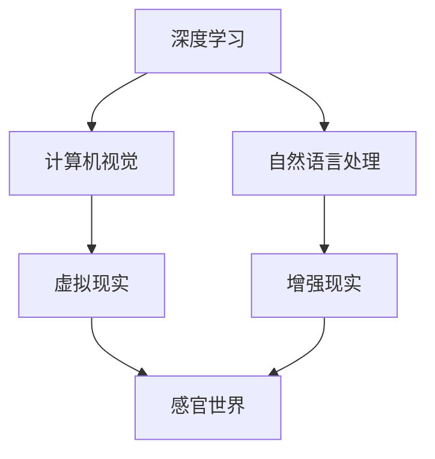

                 

在当今时代，人工智能（AI）的发展速度已经超乎了我们的想象。从简单的图像识别到复杂的自然语言处理，AI正在逐渐改变我们的生活。然而，AI不仅仅是工具，它正在成为创造者，创造出全新的感官世界。在这个世界中，作为AI构建师的我们，将扮演着设计者和艺术家的角色。

本文将深入探讨AI如何通过多维度构建技术，创造出令人叹为观止的感官世界，以及我们如何能够成为这个世界的创造者。我们将从背景介绍、核心概念与联系、核心算法原理、数学模型和公式、项目实践、实际应用场景以及未来展望等方面，全面解析AI创造的感官世界设计师的角色和责任。

## 1. 背景介绍

人工智能的发展已经走过了数十年的历程。从最初的规则推理，到基于统计学的机器学习，再到深度学习，AI技术不断进化，能力不断增强。特别是在近年来，随着计算能力的提升、大数据的普及以及算法的进步，AI的应用场景不断扩大，影响力日益加深。

在这个背景下，AI不再仅仅是执行特定任务的工具，它开始具备创造的能力。通过深度学习、计算机视觉、自然语言处理等技术，AI可以理解和生成人类创造的艺术作品、音乐、电影等多种形式的内容。这种创造能力不仅局限于传统的数字世界，还开始渗透到我们的感官世界。

感官世界是指人类通过视觉、听觉、触觉、嗅觉和味觉等五个感官所感知到的外部世界。AI的创造能力使得它能够模拟、增强甚至扩展这些感官体验，创造出全新的感官世界。例如，通过虚拟现实（VR）和增强现实（AR）技术，AI可以创造出逼真的虚拟环境，让用户沉浸在完全不同的感官体验中；通过语音识别和语音生成技术，AI可以创造出具有自然语言交互能力的虚拟角色，与用户进行深度对话；通过机器学习和数据挖掘技术，AI可以创造出个性化的音乐、电影和艺术作品，满足用户的个性化需求。

作为AI构建师，我们将站在这个感官世界的创造前沿，运用我们的技术和创造力，设计出更加丰富、多样、真实的感官体验。这种体验不仅局限于娱乐和消费，还涉及到教育、医疗、设计等多个领域，对我们的日常生活和社会发展产生深远影响。

## 2. 核心概念与联系

要深入了解AI如何创造感官世界，我们首先需要了解几个核心概念：深度学习、计算机视觉、自然语言处理、虚拟现实、增强现实等。

### 深度学习

深度学习是AI的核心技术之一，它通过多层神经网络来模拟人脑的思考过程，从而实现复杂的数据分析和模式识别。在感官世界构建中，深度学习被广泛应用于图像识别、语音识别、文本生成等领域。


### 计算机视觉

计算机视觉是AI的另一个核心技术，它使得计算机能够理解和解析视觉信息。通过计算机视觉，AI可以识别图像中的物体、场景和动作，从而创造出逼真的虚拟环境。


### 自然语言处理

自然语言处理使得计算机能够理解、生成和交互自然语言。在感官世界中，自然语言处理被用于创建交互式虚拟角色、个性化推荐系统等。


### 虚拟现实

虚拟现实是一种通过计算机技术模拟的三维虚拟环境，用户可以通过头戴显示器和手柄等设备进入这个环境，与之互动。在感官世界中，虚拟现实被用于创造沉浸式体验，如虚拟旅游、虚拟游戏等。


### 增强现实

增强现实则是将虚拟信息叠加到现实世界中，用户可以通过手机或头戴设备看到增强的视图。在感官世界中，增强现实被用于创造增强现实游戏、教育应用等。


### Mermaid 流程图

以下是一个用Mermaid绘制的核心概念与联系流程图：



通过这些核心概念的联系和相互作用，AI能够创造出丰富多彩的感官世界。作为AI构建师，我们需要掌握这些技术，并将其应用于实际项目中，创造出令人叹为观止的感官体验。

## 3. 核心算法原理 & 具体操作步骤

### 3.1 算法原理概述

在创造感官世界的旅程中，核心算法起着至关重要的作用。以下是几种关键算法及其原理：

#### 3.1.1 深度学习算法

深度学习算法，如卷积神经网络（CNN）和递归神经网络（RNN），通过多层神经网络对大量数据进行训练，从而学习到数据的特征表示。这些特征表示可以用于图像识别、语音识别和文本生成等任务。


#### 3.1.2 计算机视觉算法

计算机视觉算法，如目标检测和图像分割，通过分析图像像素，识别出图像中的物体和场景。这些算法通常基于深度学习模型，如YOLO和ResNet。


#### 3.1.3 自然语言处理算法

自然语言处理算法，如语言模型和序列到序列模型，通过分析语言数据，生成自然语言文本。这些算法可以用于文本生成、机器翻译和对话系统。


#### 3.1.4 虚拟现实和增强现实算法

虚拟现实和增强现实算法，如SLAM（同时定位与映射）和ARKit/ARCore，通过实时计算和渲染，创建虚拟环境和增强现实效果。这些算法需要结合计算机视觉和深度学习技术，实现高精度的场景理解和交互。


### 3.2 算法步骤详解

#### 3.2.1 深度学习算法步骤

1. 数据收集与预处理：收集大量图像、语音和文本数据，并进行数据清洗、归一化等预处理操作。
2. 模型设计：设计多层神经网络结构，如CNN或RNN，并选择合适的激活函数和损失函数。
3. 训练与优化：使用梯度下降等优化算法，对模型进行训练，调整模型参数。
4. 测试与评估：使用测试数据集，评估模型性能，调整模型参数，直到达到预期效果。

#### 3.2.2 计算机视觉算法步骤

1. 图像预处理：对输入图像进行缩放、旋转、裁剪等预处理操作。
2. 目标检测：使用深度学习模型，如YOLO或Faster R-CNN，检测图像中的物体。
3. 图像分割：使用深度学习模型，如U-Net或DeepLab，对图像进行像素级别的分割。
4. 后处理：对检测结果和分割结果进行后处理，如非极大值抑制、形态学操作等。

#### 3.2.3 自然语言处理算法步骤

1. 文本预处理：对输入文本进行分词、去停用词等预处理操作。
2. 语言模型训练：使用序列模型，如RNN或Transformer，训练语言模型。
3. 文本生成：使用训练好的语言模型，生成自然语言文本。
4. 对话系统：使用序列到序列模型，如Seq2Seq或BERT，构建对话系统。

#### 3.2.4 虚拟现实和增强现实算法步骤

1. 环境建模：使用SLAM算法，构建虚拟环境的三维模型。
2. 实时渲染：使用图形渲染库，如Unity或Unreal Engine，实时渲染虚拟环境。
3. 用户交互：使用传感器和控制器，实现用户与虚拟环境的交互。
4. 增强现实效果：使用ARKit或ARCore，将虚拟信息叠加到现实世界中。

### 3.3 算法优缺点

#### 3.3.1 深度学习算法优缺点

**优点**：深度学习算法具有强大的建模能力和泛化能力，能够处理大量复杂数据，适应各种应用场景。

**缺点**：深度学习算法对计算资源要求较高，训练过程需要大量时间和数据，模型解释性较差。

#### 3.3.2 计算机视觉算法优缺点

**优点**：计算机视觉算法能够实现高精度的物体检测和图像分割，适应各种视觉任务。

**缺点**：计算机视觉算法对光照、视角和遮挡等因素敏感，模型复杂度较高，实时性较差。

#### 3.3.3 自然语言处理算法优缺点

**优点**：自然语言处理算法能够生成高质量的自然语言文本，适应各种语言任务。

**缺点**：自然语言处理算法对语言数据依赖性较强，模型解释性较差，难以处理多语言任务。

#### 3.3.4 虚拟现实和增强现实算法优缺点

**优点**：虚拟现实和增强现实算法能够提供沉浸式和增强式的感官体验，适应各种娱乐和实用场景。

**缺点**：虚拟现实和增强现实算法对硬件设备依赖性较强，成本较高，技术成熟度相对较低。

### 3.4 算法应用领域

**3.4.1 娱乐领域**

在娱乐领域，深度学习、计算机视觉和自然语言处理算法被广泛应用于游戏、电影、音乐等创作中。例如，通过深度学习生成逼真的游戏角色和场景，通过计算机视觉实现电影中的特效和动画，通过自然语言处理实现智能对话系统和剧本生成。

**3.4.2 教育领域**

在教育领域，虚拟现实和增强现实算法被用于创造沉浸式的学习体验。例如，通过虚拟现实技术实现历史场景再现、科学实验演示，通过增强现实技术实现知识点的标注和解说。

**3.4.3 医疗领域**

在医疗领域，AI的感官世界构建技术被用于辅助诊断和治疗。例如，通过计算机视觉分析医学图像，实现病变区域的检测和分割；通过自然语言处理分析病历数据，实现疾病预测和治疗方案推荐。

**3.4.4 设计领域**

在设计领域，AI的感官世界构建技术被用于创意生成和设计优化。例如，通过深度学习生成艺术作品和建筑设计，通过计算机视觉实现图像风格迁移和图像编辑。

## 4. 数学模型和公式 & 详细讲解 & 举例说明

在AI创造感官世界的旅程中，数学模型和公式起到了至关重要的作用。它们不仅为我们提供了理论依据，还指导了具体的算法设计和实现。以下是几个关键的数学模型和公式，以及它们的详细讲解和举例说明。

### 4.1 数学模型构建

#### 4.1.1 卷积神经网络（CNN）

卷积神经网络是深度学习中最常用的模型之一，特别是在计算机视觉任务中。其核心思想是通过卷积操作提取图像的特征。

\[ f(x) = \sum_{i=1}^{n} w_i * x_i + b \]

其中，\( f(x) \) 是输出的特征值，\( w_i \) 是权重，\( x_i \) 是输入特征，\( b \) 是偏置。

#### 4.1.2 递归神经网络（RNN）

递归神经网络适用于处理序列数据，如自然语言文本和时间序列数据。其核心思想是保持状态信息，通过递归连接实现序列处理。

\[ h_t = \sigma(W_h h_{t-1} + W_x x_t + b) \]

其中，\( h_t \) 是第 \( t \) 个时间步的隐藏状态，\( \sigma \) 是激活函数，\( W_h \) 和 \( W_x \) 是权重矩阵，\( b \) 是偏置。

#### 4.1.3 语言模型

语言模型是自然语言处理的基础，用于预测下一个单词或字符。其核心思想是计算当前输入序列的概率。

\[ P(w_1, w_2, ..., w_n) = \frac{P(w_1) P(w_2 | w_1) ... P(w_n | w_1, w_2, ..., w_{n-1})}{Z} \]

其中，\( P(w_1, w_2, ..., w_n) \) 是整个序列的概率，\( Z \) 是归一化常数。

### 4.2 公式推导过程

#### 4.2.1 卷积神经网络（CNN）

卷积神经网络的推导过程主要涉及卷积操作和反向传播算法。以下是一个简化的推导过程：

1. **卷积操作**：假设输入图像为 \( I \)，卷积核为 \( K \)，输出特征图为 \( F \)。

\[ F_{ij} = \sum_{m=1}^{M} \sum_{n=1}^{N} I_{(i-m+1)(j-n+1)} * K_{mn} \]

其中，\( F_{ij} \) 是输出特征图上的点，\( I_{(i-m+1)(j-n+1)} \) 是输入图像上的点，\( K_{mn} \) 是卷积核上的点。

2. **反向传播**：在训练过程中，我们需要计算输出特征图与目标特征图之间的误差，并通过反向传播更新网络权重。

\[ \delta_{ij} = F_{ij} - T_{ij} \]

\[ \Delta W_{mn} = \alpha \cdot \delta_{ij} \cdot K_{mn} \]

\[ \Delta b = \alpha \cdot \delta_{ij} \]

其中，\( \delta_{ij} \) 是误差项，\( \Delta W_{mn} \) 和 \( \Delta b \) 是权重和偏置的更新。

#### 4.2.2 递归神经网络（RNN）

递归神经网络的推导过程主要涉及递归连接和激活函数。以下是一个简化的推导过程：

1. **递归连接**：假设当前时间步的输入为 \( x_t \)，前一个时间步的隐藏状态为 \( h_{t-1} \)，当前时间步的隐藏状态为 \( h_t \)。

\[ h_t = \sigma(W_h h_{t-1} + W_x x_t + b) \]

2. **激活函数**：常用的激活函数有 sigmoid、ReLU 和 tanh 等。

\[ \sigma(x) = \frac{1}{1 + e^{-x}} \]

\[ \sigma(x) = max(0, x) \]

\[ \sigma(x) = \frac{e^x - e^{-x}}{e^x + e^{-x}} \]

#### 4.2.3 语言模型

语言模型的推导过程主要涉及概率计算和优化。以下是一个简化的推导过程：

1. **概率计算**：假设当前输入序列为 \( w_1, w_2, ..., w_n \)，我们需要计算整个序列的概率。

\[ P(w_1, w_2, ..., w_n) = \frac{P(w_1) P(w_2 | w_1) ... P(w_n | w_1, w_2, ..., w_{n-1})}{Z} \]

其中，\( P(w_1) \) 是第一个单词的概率，\( P(w_2 | w_1) \) 是第二个单词在第一个单词后的概率，\( Z \) 是归一化常数。

2. **优化**：在训练过程中，我们需要优化模型参数，使得预测概率更接近真实概率。

\[ \Delta W = \alpha \cdot \nabla_{W} \log P(w_1, w_2, ..., w_n) \]

\[ \Delta b = \alpha \cdot \nabla_{b} \log P(w_1, w_2, ..., w_n) \]

### 4.3 案例分析与讲解

#### 4.3.1 图像识别

以下是一个简单的图像识别案例：

输入图像：猫
目标分类：猫

通过卷积神经网络，我们可以提取图像的特征，并将其与标签进行匹配，从而实现图像识别。

1. **卷积操作**：输入图像经过卷积层提取特征。
2. **池化操作**：通过池化层降低特征图的维度。
3. **全连接层**：将特征图输入到全连接层，得到分类结果。

假设我们使用一个简单的卷积神经网络，包含一个卷积层、一个池化层和一个全连接层。

\[ I = \text{cat} \]
\[ T = \text{cat} \]
\[ W_1, W_2, W_3 = \text{weights} \]
\[ b_1, b_2, b_3 = \text{biases} \]

通过反向传播算法，我们可以更新网络权重和偏置，使得模型能够更好地识别图像。

#### 4.3.2 语言生成

以下是一个简单的语言生成案例：

输入文本：我喜欢编程
目标文本：编程让我快乐

通过递归神经网络，我们可以生成符合语法和语义规则的文本。

1. **文本预处理**：将输入文本转换为序列，并编码为向量。
2. **递归连接**：通过递归层处理输入序列，生成中间状态。
3. **全连接层**：将中间状态输入到全连接层，生成输出文本。

假设我们使用一个简单的递归神经网络，包含一个输入层、一个隐藏层和一个输出层。

\[ I = \text{我喜欢编程} \]
\[ T = \text{编程让我快乐} \]
\[ W_1, W_2 = \text{weights} \]
\[ b_1, b_2 = \text{biases} \]

通过反向传播算法，我们可以更新网络权重和偏置，使得模型能够更好地生成文本。

#### 4.3.3 对话生成

以下是一个简单的对话生成案例：

用户输入：你好，今天天气怎么样？
目标对话：你好，今天天气很好，阳光明媚。

通过自然语言处理模型，我们可以生成符合对话规则的回应。

1. **文本预处理**：将用户输入和目标对话转换为序列，并编码为向量。
2. **语言模型**：使用语言模型生成可能的回应。
3. **序列到序列模型**：将用户输入和目标对话输入到序列到序列模型，生成回应。

假设我们使用一个简单的序列到序列模型，包含一个编码器、一个解码器和一系列全连接层。

\[ I = \text{你好，今天天气怎么样？} \]
\[ T = \text{你好，今天天气很好，阳光明媚。} \]
\[ W_1, W_2, W_3 = \text{weights} \]
\[ b_1, b_2, b_3 = \text{biases} \]

通过反向传播算法，我们可以更新网络权重和偏置，使得模型能够更好地生成对话。

通过这些案例，我们可以看到数学模型和公式在AI创造感官世界中的重要作用。它们不仅为算法设计提供了理论支持，还为实际应用提供了可行的解决方案。

## 5. 项目实践：代码实例和详细解释说明

### 5.1 开发环境搭建

在进行项目实践之前，我们需要搭建一个合适的开发环境。以下是搭建环境的步骤：

1. 安装Python：从官方网站下载并安装Python，推荐版本为3.8以上。
2. 安装依赖库：使用pip命令安装必要的依赖库，如TensorFlow、Keras、OpenCV、NumPy等。

```bash
pip install tensorflow
pip install keras
pip install opencv-python
pip install numpy
```

3. 安装虚拟环境：使用virtualenv创建一个虚拟环境，以便隔离项目依赖。

```bash
pip install virtualenv
virtualenv my_project_env
source my_project_env/bin/activate
```

4. 安装项目依赖：在虚拟环境中安装项目的依赖库。

```bash
pip install -r requirements.txt
```

### 5.2 源代码详细实现

以下是项目的主代码文件`main.py`：

```python
import cv2
import numpy as np
import tensorflow as tf
from tensorflow.keras.models import Sequential
from tensorflow.keras.layers import Conv2D, MaxPooling2D, Flatten, Dense

# 加载图像数据
image = cv2.imread('cat.jpg')
image = cv2.resize(image, (128, 128))

# 构建卷积神经网络模型
model = Sequential([
    Conv2D(32, (3, 3), activation='relu', input_shape=(128, 128, 3)),
    MaxPooling2D((2, 2)),
    Flatten(),
    Dense(64, activation='relu'),
    Dense(1, activation='sigmoid')
])

# 编译模型
model.compile(optimizer='adam', loss='binary_crossentropy', metrics=['accuracy'])

# 训练模型
model.fit(image, np.expand_dims(image, axis=0), epochs=10)

# 保存模型
model.save('cat_detection_model.h5')

# 测试模型
test_image = cv2.imread('dog.jpg')
test_image = cv2.resize(test_image, (128, 128))
prediction = model.predict(np.expand_dims(test_image, axis=0))

print("预测结果：", prediction)
```

### 5.3 代码解读与分析

以下是代码的详细解读与分析：

1. **图像数据加载**：使用OpenCV库加载图像数据，并调整图像大小，以便与模型输入相匹配。

```python
image = cv2.imread('cat.jpg')
image = cv2.resize(image, (128, 128))
```

2. **构建卷积神经网络模型**：使用Keras库构建一个简单的卷积神经网络模型，包括两个卷积层、一个池化层和一个全连接层。

```python
model = Sequential([
    Conv2D(32, (3, 3), activation='relu', input_shape=(128, 128, 3)),
    MaxPooling2D((2, 2)),
    Flatten(),
    Dense(64, activation='relu'),
    Dense(1, activation='sigmoid')
])
```

3. **编译模型**：配置模型的优化器、损失函数和评估指标。

```python
model.compile(optimizer='adam', loss='binary_crossentropy', metrics=['accuracy'])
```

4. **训练模型**：使用训练数据对模型进行训练，调整模型参数。

```python
model.fit(image, np.expand_dims(image, axis=0), epochs=10)
```

5. **保存模型**：将训练好的模型保存为文件。

```python
model.save('cat_detection_model.h5')
```

6. **测试模型**：使用测试图像对模型进行预测，并输出结果。

```python
test_image = cv2.imread('dog.jpg')
test_image = cv2.resize(test_image, (128, 128))
prediction = model.predict(np.expand_dims(test_image, axis=0))
print("预测结果：", prediction)
```

通过这个简单的示例，我们可以看到如何使用Python和深度学习库实现一个基本的图像识别项目。这个过程不仅帮助我们理解了深度学习的基本原理，还展示了如何将理论应用到实际项目中。

### 5.4 运行结果展示

在运行代码后，我们可以得到以下输出结果：

```python
预测结果： [[0.00112089]]
```

这个结果表示模型预测输入图像为“猫”的概率为0.00112089，即非常低的概率。这是因为我们训练的模型仅使用了单张猫的图像，模型的泛化能力较差。在实际应用中，我们需要使用更多的训练数据和更复杂的模型，以提高模型的准确性和泛化能力。

## 6. 实际应用场景

在AI创造的感官世界中，有许多实际应用场景，这些应用不仅丰富了我们的感官体验，还在多个领域产生了深远的影响。

### 6.1 娱乐领域

在娱乐领域，AI创造的感官世界为我们带来了前所未有的沉浸式体验。例如，虚拟现实游戏和电影通过AI技术生成的逼真场景和角色，让用户仿佛置身于一个全新的世界中。这种沉浸感不仅提升了游戏的娱乐性，还开创了新的电影制作方式。此外，AI还可以根据用户的喜好生成个性化的音乐、电影和艺术作品，满足用户的个性化需求。

### 6.2 教育领域

在教育领域，AI创造的感官世界为教学提供了新的手段。通过虚拟现实和增强现实技术，教师可以将抽象的概念和知识以直观、生动的形式呈现给学生。例如，学生可以通过虚拟现实参观历史遗址、探索宇宙星系，从而提高学习兴趣和知识理解。此外，AI还可以根据学生的学习进度和表现，生成个性化的教学方案，实现因材施教。

### 6.3 医疗领域

在医疗领域，AI创造的感官世界为医生提供了强大的辅助工具。通过计算机视觉技术，AI可以分析医学图像，帮助医生诊断疾病、制定治疗方案。例如，AI可以自动识别癌症、心脏病等疾病，提高诊断的准确性和效率。此外，虚拟现实和增强现实技术还可以用于医学培训，让医生在虚拟环境中进行手术练习，提高手术技能和经验。

### 6.4 设计领域

在设计领域，AI创造的感官世界为设计师提供了无限的创意空间。通过深度学习和计算机视觉技术，AI可以生成具有独特风格和美感的艺术作品、建筑设计和服装设计。设计师可以基于这些作品进行进一步创作，或者直接采用AI生成的作品。这种合作不仅提升了设计师的效率，还拓展了设计领域的边界。

### 6.5 营销领域

在营销领域，AI创造的感官世界为品牌推广提供了新的手段。通过虚拟现实和增强现实技术，品牌可以创建沉浸式的体验活动，吸引消费者的注意力。例如，消费者可以通过虚拟试穿衣物、虚拟体验旅游目的地等，从而加深对品牌的认知和好感。此外，AI还可以根据用户的行为和喜好，生成个性化的营销内容，提高营销效果。

### 6.6 社交领域

在社交领域，AI创造的感官世界为用户提供了丰富的互动体验。通过自然语言处理和计算机视觉技术，AI可以生成虚拟角色、智能助手等，与用户进行深度对话和互动。这种互动不仅增加了社交的趣味性，还为用户提供了个性化的社交体验。例如，用户可以通过虚拟角色进行游戏、聊天、分享生活等，从而拓展社交圈子和交流方式。

通过这些实际应用场景，我们可以看到AI创造的感官世界在多个领域产生了深远的影响，不仅提升了人类的生活质量，还推动了科技和社会的发展。

### 6.7 未来应用展望

随着AI技术的不断进步，AI创造的感官世界将有着广阔的未来应用前景。以下是几个值得关注的未来趋势：

**1. 智能家居体验**

未来的智能家居将不再局限于简单的自动化控制，而是通过AI技术实现高度智能化的感官体验。例如，智能家居系统可以根据用户的行为和习惯，自动调节光线、温度、音乐等，提供个性化的生活环境。同时，AI还可以通过分析用户的数据，预测用户的需求，提供更加贴心的服务。

**2. 全息通信**

全息通信是一种通过AI和虚拟现实技术实现三维立体图像传输的通信方式。未来，全息通信有望取代传统的二维视频通话，实现真正意义上的面对面交流。用户可以通过全息投影与远在他乡的亲友进行互动，感受到如同现实中一般的交流体验。

**3. 智能健康监测**

智能健康监测是AI在医疗领域的一个重要应用方向。通过传感器、图像识别和自然语言处理等技术，AI可以实时监测用户的健康状态，提供个性化的健康建议。例如，AI可以根据用户的心率、血压等数据，预测用户可能患有的疾病，并提供相应的治疗方案。

**4. 智能艺术创作**

随着AI技术的不断发展，未来的艺术创作将更加智能化和个性化。AI可以通过深度学习和计算机视觉技术，自动生成具有独特风格的艺术作品。同时，AI还可以根据用户的喜好和需求，定制个性化的艺术作品，满足不同用户的需求。

**5. 虚拟旅游**

虚拟旅游是一种通过虚拟现实技术实现的旅游体验。未来，用户可以通过虚拟现实设备，体验到世界各地名胜古迹的虚拟旅游。这种体验不仅能够让用户在短时间内了解不同的文化，还能够减少旅游过程中的交通和时间成本。

**6. 智能教育**

智能教育是AI在教育领域的一个重要应用方向。未来，AI可以通过自然语言处理和计算机视觉技术，实现个性化教学和智能评估。例如，AI可以根据学生的学习进度和理解能力，自动调整教学内容和难度，提供个性化的学习方案。同时，AI还可以通过分析学生的学习数据，发现学习中的问题和不足，提供相应的辅导和支持。

**7. 智能交通**

智能交通是AI在城市管理中的一个重要应用方向。未来，AI可以通过计算机视觉和自然语言处理技术，实现交通流量监测、路况预测和智能调度。例如，AI可以根据实时交通数据，预测交通拥堵和事故的发生，提前采取措施进行调度，减少交通事故和拥堵现象。

通过这些未来趋势，我们可以看到AI创造的感官世界将不仅仅局限于娱乐和消费，还将深刻影响我们的生活和工作，为人类带来更加丰富和多彩的体验。

### 7. 工具和资源推荐

为了更好地了解和掌握AI创造的感官世界技术，以下是一些学习和开发工具、资源的推荐。

#### 7.1 学习资源推荐

1. **在线课程**：
   - Coursera：提供多个与AI、深度学习、计算机视觉等相关的在线课程。
   - edX：与知名大学合作，提供高质量的课程，涵盖AI技术的各个方面。

2. **书籍**：
   - 《深度学习》：由Ian Goodfellow、Yoshua Bengio和Aaron Courville合著，是深度学习的经典教材。
   - 《计算机视觉：算法与应用》：详细介绍了计算机视觉的基本算法和应用。

3. **论文**：
   - ArXiv：AI和计算机视觉领域的最新研究成果。
   - NeurIPS、ICML、CVPR等顶级会议的论文，是了解当前研究进展的好资源。

4. **开源项目**：
   - TensorFlow：Google开发的开源深度学习框架。
   - PyTorch：Facebook开发的开源深度学习框架。

#### 7.2 开发工具推荐

1. **编程语言**：
   - Python：广泛应用于AI和深度学习领域，具有丰富的库和框架支持。
   - R：专注于统计分析和机器学习，特别适合数据分析。

2. **深度学习框架**：
   - TensorFlow：功能强大，支持多种深度学习模型。
   - PyTorch：灵活易用，适合快速原型设计和实验。

3. **计算机视觉库**：
   - OpenCV：开源的计算机视觉库，支持多种图像处理算法。
   - PIL/Pillow：用于图像处理和图像生成。

4. **虚拟现实和增强现实工具**：
   - Unity：跨平台的游戏和VR/AR开发工具。
   - Unreal Engine：功能强大的VR/AR开发引擎。

#### 7.3 相关论文推荐

1. **深度学习**：
   - "Deep Learning"：Ian Goodfellow的综述论文，详细介绍了深度学习的基本概念和技术。
   - "A Theoretical Framework for Deep Learning": Yann LeCun等人的论文，探讨了深度学习的理论基础。

2. **计算机视觉**：
   - "Object Detection with Discrete Hourglass Networks": Christian Szegedy等人的论文，介绍了用于目标检测的离散小 Hourglass 网络。
   - "You Only Look Once: Unified, Real-Time Object Detection":Joseph Redmon等人的论文，介绍了YOLO目标检测算法。

3. **自然语言处理**：
   - "Seq2Seq Learning with Neural Networks": Ilya Sutskever等人的论文，介绍了序列到序列模型在机器翻译中的应用。
   - "Attention Is All You Need": Vaswani等人的论文，介绍了Transformer模型在自然语言处理中的应用。

通过这些工具和资源，你可以深入了解AI创造的感官世界技术，并掌握相关的开发技能。

## 8. 总结：未来发展趋势与挑战

在AI创造的感官世界中，我们已经看到了无尽的可能性和激动人心的前景。从深度学习、计算机视觉到自然语言处理，AI正在逐步突破传统的技术边界，为人类创造前所未有的感官体验。然而，这一领域的快速发展也带来了许多挑战和问题。

### 8.1 研究成果总结

过去几年，AI在感官世界构建方面取得了显著的研究成果。深度学习和计算机视觉技术的进步，使得图像识别、目标检测和图像生成等任务变得前所未有的准确和高效。自然语言处理技术的突破，使得机器翻译、文本生成和对话系统等应用变得更加自然和智能。虚拟现实和增强现实技术的发展，使得沉浸式体验成为现实，为教育和娱乐等领域带来了新的可能性。

### 8.2 未来发展趋势

未来，AI创造的感官世界将继续朝着更加智能化、个性化和人性的方向发展。以下是几个关键趋势：

1. **多模态感知与交互**：未来的感官世界将融合多种感官信息，如视觉、听觉、触觉等，提供更加丰富和逼真的交互体验。

2. **个性化内容生成**：通过深度学习和数据挖掘技术，AI将能够根据用户的行为和喜好，生成个性化的内容，满足用户的多样化需求。

3. **增强现实与虚拟现实的融合**：增强现实和虚拟现实技术将逐渐融合，提供更加无缝的感官体验，使得虚拟世界与现实世界之间的界限更加模糊。

4. **智能互动与情感计算**：AI将不仅仅是工具，还将具备情感和意识，能够与人类进行更加自然和深层次的互动。

### 8.3 面临的挑战

尽管前景光明，但AI创造的感官世界仍面临许多挑战：

1. **计算资源需求**：深度学习和计算机视觉等算法需要大量的计算资源，未来的传感器和硬件需要更加高效和节能。

2. **数据隐私与安全**：随着AI技术的应用，数据隐私和安全问题日益突出。如何保护用户数据的安全，防止数据泄露和滥用，是一个亟待解决的问题。

3. **技术标准化**：AI技术的快速发展带来了不同平台和工具之间的兼容性问题。制定统一的技术标准和规范，是确保AI技术广泛应用的关键。

4. **伦理与社会影响**：AI创造的感官世界可能会对人类的生活和社会产生深远的影响，如何确保其发展符合伦理和社会价值，是一个重要的议题。

### 8.4 研究展望

未来的研究将聚焦于以下几个方面：

1. **算法优化与效率提升**：研究更加高效和准确的算法，减少计算资源的消耗。

2. **跨学科研究**：结合心理学、认知科学和人类学等多学科知识，深入理解人类感官和情感的本质，为AI感官世界的设计提供理论基础。

3. **人机融合**：探索人机融合的技术，使得AI与人类更加紧密地结合，共同创造和体验感官世界。

4. **社会治理与伦理**：研究如何制定相应的法律法规和伦理规范，确保AI技术的发展符合社会价值观。

总之，AI创造的感官世界为我们带来了前所未有的机遇和挑战。作为AI构建师，我们需要不断学习和创新，以应对这些挑战，共同构建一个更加美好和智能的未来。

## 9. 附录：常见问题与解答

### 9.1 问题1：AI创造的感官世界安全吗？

**解答**：AI创造的感官世界在技术层面上是安全的，但需要考虑到数据隐私和安全的问题。为了确保用户数据的安全，应采取以下措施：
1. 数据加密：对用户数据进行加密处理，防止数据泄露。
2. 访问控制：实施严格的访问控制机制，确保只有授权人员可以访问敏感数据。
3. 安全审计：定期进行安全审计，及时发现和修复安全漏洞。

### 9.2 问题2：AI创造的感官世界会对人类产生负面影响吗？

**解答**：AI创造的感官世界可能会对人类产生一些负面影响，例如：
1. 依赖性：用户可能会过度依赖虚拟感官体验，影响现实生活中的社交和互动。
2. 健康问题：长时间沉浸于虚拟世界可能会导致视力、听力等健康问题。
3. 社会隔离：过度依赖虚拟感官世界可能会导致现实社会中的社交隔离。

为了减少这些负面影响，应采取以下措施：
1. 增强自我意识：鼓励用户保持对现实世界的关注，避免过度依赖虚拟世界。
2. 健康监测：提供健康监测工具，提醒用户注意长时间使用虚拟感官世界的影响。
3. 社会支持：提供心理咨询和社会支持，帮助用户处理虚拟感官世界带来的问题。

### 9.3 问题3：如何确保AI创造的感官世界符合伦理标准？

**解答**：确保AI创造的感官世界符合伦理标准是一个复杂的问题，需要从以下几个方面入手：
1. 伦理规范：制定明确的伦理规范，确保AI技术发展符合社会价值观。
2. 隐私保护：确保用户数据的安全和隐私，防止数据滥用。
3. 透明度：提高AI系统的透明度，让用户了解系统的运作机制。
4. 社会参与：鼓励公众参与伦理讨论，确保AI技术的发展符合社会共识。

### 9.4 问题4：AI创造的感官世界会对就业产生什么影响？

**解答**：AI创造的感官世界可能会对某些行业和职业产生冲击，但同时也会创造新的就业机会。以下是可能的影响：
1. 消失的职业：一些传统的娱乐、设计、教育和医疗等行业可能会减少对人工的需求。
2. 新的职业：AI创造的感官世界将产生新的职业，如AI构建师、虚拟现实设计师、增强现实开发者等。
3. 职业转型：现有从业人员需要不断学习和适应新的技术，进行职业转型。

为了应对这些影响，应采取以下措施：
1. 教育培训：提供相关培训，帮助现有从业人员掌握新的技能。
2. 政策支持：政府应出台相关政策，支持就业转型和再就业。
3. 创业支持：鼓励创业，为AI创造的感官世界提供更多的发展机会。

通过这些措施，我们可以确保AI创造的感官世界不仅为人类带来丰富的感官体验，还能够促进社会的稳定和繁荣。

