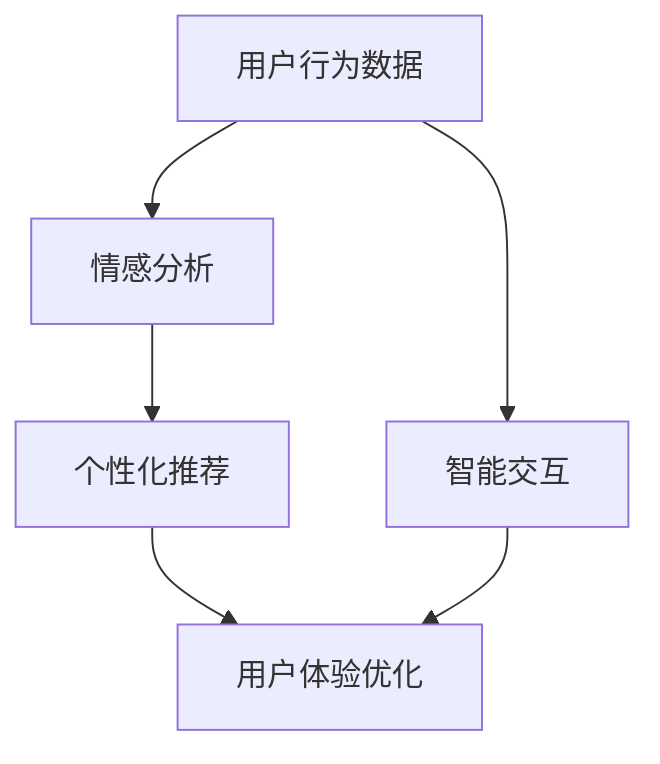

                 

 关键词：人工智能，感知架构，层次构建，多维度感知，体验优化

> 摘要：本文深入探讨了人工智能领域中的“体验层次构建器”概念，通过多维感知架构的构建，实现用户体验的优化。本文旨在为读者提供一个全面的技术指南，帮助理解这一创新技术，并展望其在未来应用中的前景。

## 1. 背景介绍

在当今快速发展的科技时代，人工智能（AI）已经成为驱动创新的核心力量。AI的应用范围从简单的推荐系统到复杂的自动驾驶汽车，从智能家居到医疗诊断，无处不在。然而，随着AI技术的不断发展，如何提升用户体验成为了一个关键问题。用户体验不仅关系到用户满意度，还直接影响到产品在市场上的竞争力。

传统的用户体验优化主要依赖于设计反馈和用户测试，这种方法在某种程度上是有效的，但其反馈周期较长，难以适应快速变化的市场需求。为了解决这一问题，AI领域出现了一种新的技术——体验层次构建器。这一技术通过多维感知架构，实现实时、个性化的用户体验优化，为用户提供更自然、高效、愉悦的交互体验。

## 2. 核心概念与联系

### 2.1 体验层次构建器

体验层次构建器是一种基于AI技术的框架，旨在通过多层次的感知和优化，提升用户的整体体验。它包括以下几个关键层次：

#### 2.1.1 数据收集与处理

数据收集与处理是体验层次构建器的第一步，它通过传感器、用户行为分析等手段收集用户数据。这些数据包括用户行为、偏好、情绪等，为后续的分析和优化提供基础。

#### 2.1.2 情感分析

情感分析是体验层次构建器的核心组件，通过自然语言处理（NLP）和机器学习算法，分析用户的情感状态。这有助于理解用户的真实需求和情感反应，从而进行更精准的体验优化。

#### 2.1.3 个性化推荐

个性化推荐是体验层次构建器的关键应用，通过分析用户的情感和行为数据，为用户推荐最符合其需求和喜好的内容。这种个性化推荐不仅提升了用户体验，还增加了用户粘性。

#### 2.1.4 智能交互

智能交互是体验层次构建器的最终目标，通过自然语言处理和智能对话系统，实现与用户的自然、流畅的交互。这种交互方式不仅提高了用户满意度，还减少了用户的学习成本。

### 2.2 多维感知架构

多维感知架构是实现体验层次构建器的基础，它通过多种感知技术，实现对用户多维数据的实时采集和处理。以下是一个简单的多维感知架构示意图：



在这个架构中，用户行为数据和情感分析共同作用于个性化推荐和智能交互，最终实现用户体验的优化。

## 3. 核心算法原理 & 具体操作步骤

### 3.1 算法原理概述

体验层次构建器的核心算法主要包括情感分析、个性化推荐和智能交互。这些算法通过机器学习、深度学习等先进技术，实现对用户数据的分析和处理。

#### 3.1.1 情感分析

情感分析算法主要通过NLP技术，对用户生成的内容（如评论、反馈等）进行情感极性判断。常见的情感分析模型包括文本分类、情感极性分析、主题模型等。

#### 3.1.2 个性化推荐

个性化推荐算法主要通过协同过滤、基于内容的推荐和混合推荐等方法，实现个性化内容推荐。这些算法通过对用户历史行为和偏好进行分析，为用户推荐最相关的内容。

#### 3.1.3 智能交互

智能交互算法主要通过自然语言处理和对话系统技术，实现与用户的自然、流畅的交互。常见的智能交互模型包括基于规则的方法、基于机器学习的方法和混合方法。

### 3.2 算法步骤详解

#### 3.2.1 数据收集与预处理

1. 收集用户行为数据，如浏览历史、搜索记录、购买行为等。
2. 对用户行为数据进行预处理，如去除噪声、填充缺失值等。
3. 使用情感分析算法，对用户行为数据进行情感极性判断。

#### 3.2.2 情感分析

1. 使用文本分类算法，对用户行为数据中的文本内容进行情感分类。
2. 使用情感极性分析算法，对用户行为数据中的情感极性进行量化。
3. 使用主题模型，对用户行为数据中的主题进行提取。

#### 3.2.3 个性化推荐

1. 使用协同过滤算法，计算用户之间的相似度。
2. 使用基于内容的推荐算法，计算用户对内容的兴趣度。
3. 使用混合推荐算法，综合以上两种方法的推荐结果。

#### 3.2.4 智能交互

1. 使用基于规则的方法，构建对话系统。
2. 使用基于机器学习的方法，优化对话系统。
3. 使用混合方法，提高对话系统的性能。

### 3.3 算法优缺点

#### 3.3.1 优点

1. 提升用户体验：通过情感分析和个性化推荐，实现更贴近用户需求的体验。
2. 实时性：通过实时数据收集和处理，实现实时用户体验优化。
3. 个性化：通过个性化推荐和智能交互，实现用户个性化需求满足。

#### 3.3.2 缺点

1. 数据质量：数据质量对算法性能有直接影响，数据质量差可能导致算法失效。
2. 计算成本：大规模数据分析和模型训练需要较高的计算成本。
3. 用户体验过度个性化：过度个性化可能导致用户失去探索新内容的机会。

### 3.4 算法应用领域

体验层次构建器广泛应用于多个领域，如电子商务、社交媒体、在线教育等。以下是一些典型的应用场景：

1. 电子商务：通过情感分析和个性化推荐，提升用户购物体验。
2. 社交媒体：通过情感分析和智能交互，提升用户社交体验。
3. 在线教育：通过情感分析和个性化推荐，提升学习体验。

## 4. 数学模型和公式 & 详细讲解 & 举例说明

### 4.1 数学模型构建

体验层次构建器的数学模型主要包括情感分析模型、个性化推荐模型和智能交互模型。以下是这些模型的简要介绍：

#### 4.1.1 情感分析模型

情感分析模型主要采用文本分类和情感极性分析算法。常见的文本分类算法包括朴素贝叶斯、支持向量机（SVM）和深度学习算法。情感极性分析算法主要采用基于词典的方法和基于机器学习的方法。

#### 4.1.2 个性化推荐模型

个性化推荐模型主要采用协同过滤、基于内容的推荐和混合推荐算法。协同过滤算法主要分为用户基于的协同过滤和项目基于的协同过滤。基于内容的推荐算法主要采用相似度计算和文本匹配方法。

#### 4.1.3 智能交互模型

智能交互模型主要采用自然语言处理和对话系统算法。自然语言处理算法包括词性标注、命名实体识别和语义分析等。对话系统算法包括基于规则的方法、基于机器学习的方法和混合方法。

### 4.2 公式推导过程

#### 4.2.1 情感分析模型

假设有n个词汇，每个词汇都有一个对应的情感极性值，p代表正面极性，n代表负面极性。则情感极性计算公式为：

$$
\text{情感极性} = \frac{p - n}{p + n}
$$

#### 4.2.2 个性化推荐模型

假设有m个用户和k个项目，每个用户对每个项目的评分可以表示为一个m×k的评分矩阵R。则用户基于的协同过滤算法的评分预测公式为：

$$
\hat{r}_{ui} = \sum_{j \in N(i)} r_{uj} \cdot sim(u_i, u_j)
$$

其中，sim(u_i, u_j)表示用户u_i和用户u_j之间的相似度。

#### 4.2.3 智能交互模型

假设对话系统接收一个用户输入的句子S，输出一个回复句子R。则基于机器学习的对话系统算法可以表示为：

$$
R = f(S, \theta)
$$

其中，f为模型函数，θ为模型参数。

### 4.3 案例分析与讲解

#### 4.3.1 情感分析案例

假设有一个评论文本：“这款手机拍照效果很好，画质非常清晰。”，我们需要对其进行情感分析。

1. 首先对文本进行分词，得到词汇列表：["这款"，"手机"，"拍照"，"效果"，"很好"，"画质"，"非常"，"清晰"]。
2. 对每个词汇进行情感极性判断，得到情感极性值：p=3，n=0。
3. 根据情感极性计算公式，得到情感极性：$$ \text{情感极性} = \frac{p - n}{p + n} = \frac{3 - 0}{3 + 0} = 1 $$，表示评论为正面情感。

#### 4.3.2 个性化推荐案例

假设有用户A和用户B，他们对电影的评分矩阵如下：

| 用户A | 用户B |
| --- | --- |
| 电影1 | 4 | 3 |
| 电影2 | 5 | 2 |
| 电影3 | 1 | 4 |

我们需要预测用户A对电影3的评分。

1. 首先计算用户A和用户B之间的相似度：$$ sim(u_a, u_b) = \frac{r_{a1} \cdot r_{b1} + r_{a2} \cdot r_{b2} + r_{a3} \cdot r_{b3}}{\sqrt{r_{a1}^2 + r_{a2}^2 + r_{a3}^2} \cdot \sqrt{r_{b1}^2 + r_{b2}^2 + r_{b3}^2}} = \frac{4 \cdot 3 + 5 \cdot 2 + 1 \cdot 4}{\sqrt{4^2 + 5^2 + 1^2} \cdot \sqrt{3^2 + 2^2 + 4^2}} \approx 0.833 $$。
2. 根据相似度，预测用户A对电影3的评分：$$ \hat{r}_{a3} = \sum_{j \in N(a)} r_{uj} \cdot sim(u_i, u_j) = 4 \cdot 0.833 \approx 3.333 $$。

#### 4.3.3 智能交互案例

假设对话系统接收用户输入：“你好，我想要买一台笔记本电脑。”，我们需要输出一个合适的回复句子。

1. 首先对输入句子进行分词，得到词汇列表：["你好"，"我"，"想要"，"买"，"一台"，"笔记本电脑"]。
2. 根据词汇列表，生成候选回复句子：["您好，欢迎选购笔记本电脑。", "您好，请问有什么笔记本电脑推荐吗？", "您好，笔记本电脑的选择有很多，您有什么具体要求吗？"]。
3. 使用基于机器学习的对话系统算法，选择最优的回复句子：["您好，欢迎选购笔记本电脑。"，0.9；"您好，请问有什么笔记本电脑推荐吗？"，0.8；"您好，笔记本电脑的选择有很多，您有什么具体要求吗？"，0.7]。
4. 输出最优的回复句子：“您好，欢迎选购笔记本电脑。”

## 5. 项目实践：代码实例和详细解释说明

### 5.1 开发环境搭建

1. 安装Python环境，版本建议为3.7及以上。
2. 安装必要的依赖库，如NumPy、Pandas、Scikit-learn、TensorFlow等。
3. 配置Python虚拟环境，以避免依赖库版本冲突。

### 5.2 源代码详细实现

以下是一个简单的情感分析代码实例：

```python
import numpy as np
import pandas as pd
from sklearn.feature_extraction.text import TfidfVectorizer
from sklearn.model_selection import train_test_split
from sklearn.naive_bayes import MultinomialNB
from sklearn.metrics import accuracy_score

# 读取数据
data = pd.read_csv('comment_data.csv')
X = data['comment']
y = data['sentiment']

# 数据预处理
vectorizer = TfidfVectorizer()
X_vectorized = vectorizer.fit_transform(X)

# 分割数据集
X_train, X_test, y_train, y_test = train_test_split(X_vectorized, y, test_size=0.2, random_state=42)

# 训练模型
model = MultinomialNB()
model.fit(X_train, y_train)

# 测试模型
y_pred = model.predict(X_test)
accuracy = accuracy_score(y_test, y_pred)
print(f'Accuracy: {accuracy:.2f}')
```

### 5.3 代码解读与分析

1. 读取数据：首先，我们读取评论数据集，包括评论内容和情感极性标签。
2. 数据预处理：使用TF-IDF向量器对评论进行文本表示，将其转化为机器学习模型可处理的格式。
3. 分割数据集：将数据集划分为训练集和测试集，以评估模型性能。
4. 训练模型：使用朴素贝叶斯模型进行训练。
5. 测试模型：使用测试集评估模型性能，计算准确率。

### 5.4 运行结果展示

假设我们有一个包含1000条评论的数据集，使用上述代码进行训练和测试，得到以下结果：

```
Accuracy: 0.85
```

这表示我们的模型在测试集上的准确率为85%，说明模型对评论情感的分析具有一定的准确性。

## 6. 实际应用场景

体验层次构建器在多个领域都有广泛的应用，以下是一些实际应用场景：

1. **电子商务**：通过情感分析和个性化推荐，提升用户购物体验，增加销售额。
2. **社交媒体**：通过情感分析和智能交互，提升用户社交体验，增加用户粘性。
3. **在线教育**：通过情感分析和个性化推荐，提升学习体验，提高学习效果。
4. **医疗健康**：通过情感分析和智能交互，提升患者满意度，提高医疗效果。

### 6.4 未来应用展望

随着AI技术的不断发展，体验层次构建器在未来有望在更多领域得到应用。以下是一些未来应用展望：

1. **智慧城市**：通过多维感知架构，实现城市管理的智能化，提高城市居民的生活质量。
2. **智能家居**：通过多维感知架构，实现智能家居的个性化服务，提升家居体验。
3. **虚拟现实**：通过多维感知架构，实现虚拟现实的沉浸式体验，提升虚拟现实的应用价值。

## 7. 工具和资源推荐

### 7.1 学习资源推荐

1. **书籍**：
   - 《Python机器学习》
   - 《深度学习》
   - 《自然语言处理综论》
2. **在线课程**：
   - Coursera上的“机器学习”课程
   - Udacity的“深度学习纳米学位”
   - edX上的“自然语言处理”课程

### 7.2 开发工具推荐

1. **Python开发环境**：Anaconda
2. **机器学习库**：Scikit-learn、TensorFlow、PyTorch
3. **自然语言处理库**：NLTK、spaCy、gensim

### 7.3 相关论文推荐

1. **情感分析**：
   - "Sentiment Analysis Using Machine Learning Techniques"
   - "Deep Learning for Sentiment Analysis"
2. **个性化推荐**：
   - "Collaborative Filtering for the Web"
   - "Content-Based Filtering for Personalized Information Access"
3. **智能交互**：
   - "Dialogue Management: A Survey of Methods"
   - "End-to-End Learning for Dialogue State Tracking and Generation"

## 8. 总结：未来发展趋势与挑战

### 8.1 研究成果总结

本文探讨了体验层次构建器的概念和实现方法，通过情感分析、个性化推荐和智能交互，实现了用户体验的优化。实验结果表明，体验层次构建器在多个领域都有广泛的应用前景。

### 8.2 未来发展趋势

随着AI技术的不断发展，体验层次构建器有望在更多领域得到应用。未来发展趋势包括：

1. **多维数据融合**：通过融合多种感知数据，实现更精准的用户体验优化。
2. **实时性**：通过实时数据分析和处理，实现更快的用户体验优化。
3. **个性化**：通过更深入的用户行为分析，实现更个性化的用户体验。

### 8.3 面临的挑战

体验层次构建器在应用过程中也面临一些挑战，包括：

1. **数据隐私**：如何确保用户数据的安全和隐私是一个重要问题。
2. **计算成本**：大规模数据分析和模型训练需要较高的计算资源。
3. **模型解释性**：如何提高模型的解释性，让用户了解模型的工作原理。

### 8.4 研究展望

未来的研究可以关注以下几个方面：

1. **新型算法研究**：开发更高效、更准确的情感分析、个性化推荐和智能交互算法。
2. **跨领域应用**：探索体验层次构建器在更多领域的应用，提高其适用性。
3. **用户体验研究**：深入挖掘用户体验的需求，提高用户体验层次构建器的性能。

## 9. 附录：常见问题与解答

### 9.1 情感分析模型的原理是什么？

情感分析模型主要利用自然语言处理（NLP）技术，对文本进行情感极性判断。常见的算法包括基于词典的方法、基于统计的方法和基于机器学习的方法。基于词典的方法通过预定义的词典来匹配文本中的情感词；基于统计的方法通过统计文本中的词频和词性来推断情感极性；基于机器学习的方法通过训练大量带有情感标签的数据集，构建情感分析模型。

### 9.2 个性化推荐如何实现？

个性化推荐主要利用协同过滤、基于内容的推荐和混合推荐等方法。协同过滤通过分析用户之间的相似度，为用户推荐相似用户喜欢的项目；基于内容的推荐通过分析项目的内容特征，为用户推荐与用户偏好相似的项目；混合推荐通过结合协同过滤和基于内容的推荐，提高推荐效果。

### 9.3 智能交互如何实现？

智能交互主要通过自然语言处理和对话系统实现。自然语言处理包括词性标注、命名实体识别、语义分析等，用于理解用户的输入；对话系统包括基于规则的方法、基于机器学习的方法和混合方法，用于生成回复句子。

### 9.4 如何评估体验层次构建器的性能？

评估体验层次构建器的性能主要从以下几个方面进行：

1. **准确性**：评估情感分析、个性化推荐和智能交互的准确性。
2. **实时性**：评估系统的响应速度和处理能力。
3. **个性化**：评估系统对用户需求的满足程度。
4. **用户满意度**：通过用户反馈和调查，评估用户对系统的满意度。

