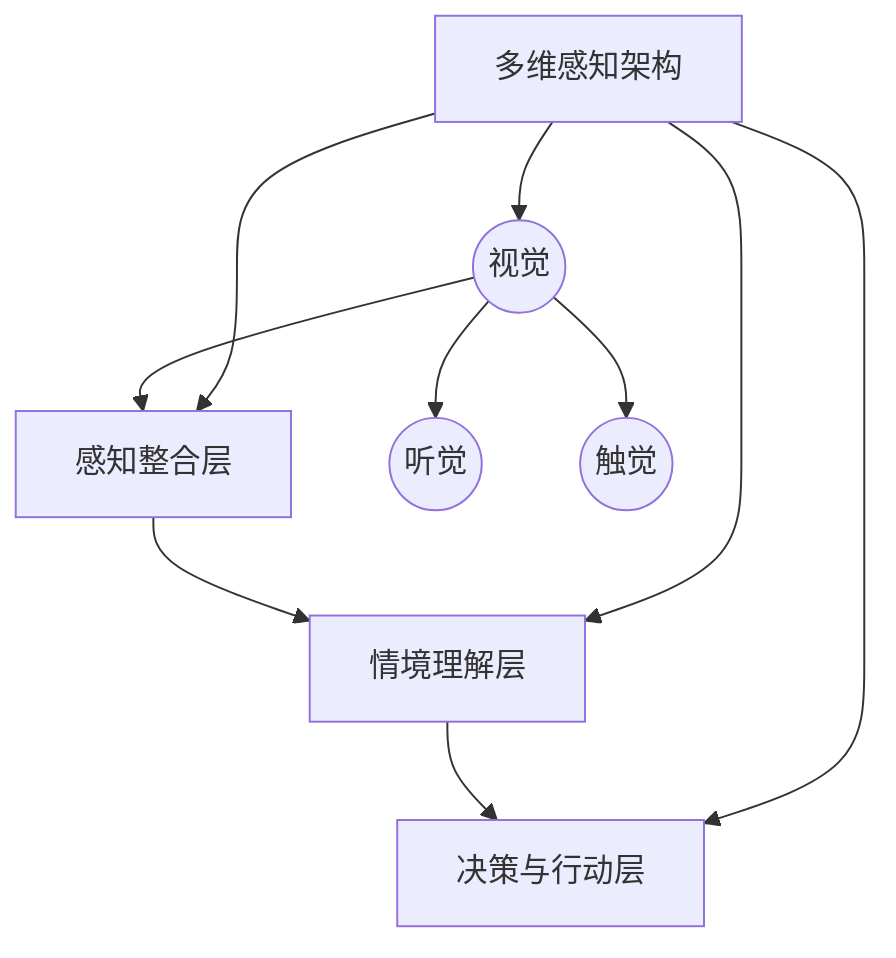

                 

关键词：体验层次理论、AI感知架构、多维感知、感知系统、算法原理、数学模型、项目实践、实际应用、未来展望

> 摘要：本文旨在探讨体验层次构建理论在人工智能领域中的应用，特别是在多维感知架构的构建过程中。通过深入分析核心概念、算法原理、数学模型以及项目实践，本文为读者提供了一个全面且结构化的理解框架。文章将探讨如何通过体验层次理论来优化和提升AI感知系统的性能，以及这一理论对未来人工智能发展的潜在影响。

## 1. 背景介绍

随着人工智能技术的快速发展，感知系统成为了许多应用领域的关键组件。从智能家居到自动驾驶，从智能客服到医疗诊断，感知系统在各种场景中发挥着越来越重要的作用。然而，传统的感知系统往往局限于单一维度的感知，如视觉、听觉或触觉，而忽略了多维感知的整合和协调。

体验层次构建理论（Experiential Hierarchy Construction Theory，EHCT）提供了一个新的视角，它强调通过整合不同维度的感知信息来提升智能系统的整体感知能力和用户体验。该理论起源于认知科学和心理学，但在人工智能领域中的应用尚处于探索阶段。

本文旨在填补这一空白，通过引入体验层次构建理论，探讨如何构建一个多维感知架构，从而提升人工智能系统的整体性能。文章结构如下：

- 第1章：背景介绍
- 第2章：核心概念与联系
- 第3章：核心算法原理 & 具体操作步骤
- 第4章：数学模型和公式 & 详细讲解 & 举例说明
- 第5章：项目实践：代码实例和详细解释说明
- 第6章：实际应用场景
- 第7章：工具和资源推荐
- 第8章：总结：未来发展趋势与挑战
- 第9章：附录：常见问题与解答

## 2. 核心概念与联系

### 2.1 体验层次构建理论的基本原理

体验层次构建理论的核心思想是，通过多层次、多维度的感知信息整合，构建一个更加完整和真实的感知世界。这一理论将感知过程分为以下几个层次：

1. **基础感知层次**：包括视觉、听觉、触觉等基本感官信息的获取和处理。
2. **感知整合层次**：将不同感官信息进行整合，形成一个更全面的感知场景。
3. **情境理解层次**：通过上下文信息，对感知场景进行解释和理解。
4. **决策与行动层次**：基于对情境的理解，进行决策和行动。

每个层次都是在前一层的基础上进行扩展和深化，最终形成一个多层次、多维度的感知架构。

### 2.2 多维感知架构的Mermaid流程图



在这个流程图中，A表示基础感知层，包括了视觉、听觉和触觉等基本感官信息的获取；B表示感知整合层，将不同感官信息进行整合；C表示情境理解层，通过对感知场景进行解释和理解；D表示决策与行动层，基于情境理解进行决策和行动。

## 3. 核心算法原理 & 具体操作步骤

### 3.1 算法原理概述

多维感知架构的构建依赖于一系列核心算法，这些算法贯穿于体验层次构建的各个层次。核心算法主要包括以下几个方面：

1. **感知信息获取算法**：用于获取和处理视觉、听觉、触觉等基本感官信息。
2. **感知整合算法**：用于整合不同感官信息，形成一个更全面的感知场景。
3. **情境理解算法**：用于对感知场景进行解释和理解。
4. **决策与行动算法**：用于基于情境理解进行决策和行动。

### 3.2 算法步骤详解

#### 3.2.1 感知信息获取算法

感知信息获取算法的主要步骤如下：

1. **数据采集**：通过摄像头、麦克风、传感器等设备，采集视觉、听觉、触觉等基本感官数据。
2. **数据预处理**：对采集到的数据进行清洗、去噪、归一化等预处理操作。
3. **特征提取**：从预处理后的数据中提取关键特征，如视觉图像的边缘、纹理，听觉信号的频谱，触觉信号的力度等。

#### 3.2.2 感知整合算法

感知整合算法的主要步骤如下：

1. **特征融合**：将不同感官特征进行融合，形成一个多维特征向量。
2. **特征选择**：根据感知任务的需求，选择最重要的特征，剔除冗余特征。
3. **特征变换**：对特征向量进行变换，提高感知系统的性能。

#### 3.2.3 情境理解算法

情境理解算法的主要步骤如下：

1. **上下文信息获取**：从感知数据中提取上下文信息，如时间、地点、人物等。
2. **情境建模**：基于上下文信息，建立情境模型。
3. **情境解释**：对感知场景进行解释，理解其含义。

#### 3.2.4 决策与行动算法

决策与行动算法的主要步骤如下：

1. **情境评估**：对感知场景进行评估，确定其重要性。
2. **决策生成**：基于情境评估结果，生成决策。
3. **行动执行**：执行决策，进行相应的行动。

### 3.3 算法优缺点

#### 3.3.1 优点

1. **多维度感知**：通过整合不同感官信息，实现多维度感知，提高感知系统的整体性能。
2. **情境理解**：基于情境理解，对感知场景进行深入解释，提高系统的智能程度。
3. **灵活性强**：算法可以根据不同应用场景进行定制化调整，适应各种需求。

#### 3.3.2 缺点

1. **计算复杂度高**：多维度感知和情境理解需要大量的计算资源，对硬件设备的要求较高。
2. **数据依赖性大**：算法的性能很大程度上取决于数据的丰富度和质量。
3. **算法解释性差**：由于算法涉及多个层次和维度，其内部机理较为复杂，难以进行直观的解释。

### 3.4 算法应用领域

多维感知架构的算法可以应用于许多领域，如：

1. **自动驾驶**：通过整合视觉、雷达、激光雷达等数据，实现高精度的环境感知。
2. **智能安防**：通过整合摄像头、麦克风等数据，实现全面的安防监控。
3. **智能家居**：通过整合视觉、语音等数据，实现智能家居的智能控制。
4. **医疗诊断**：通过整合影像、声音等数据，实现更准确的疾病诊断。

## 4. 数学模型和公式 & 详细讲解 & 举例说明

### 4.1 数学模型构建

在多维感知架构中，数学模型起着至关重要的作用。以下是一个简化的数学模型，用于描述感知系统的核心过程。

#### 4.1.1 特征提取模型

假设我们有一个感知系统，其输入为多维特征向量 \(X = [x_1, x_2, ..., x_n]\)，其中 \(x_i\) 表示第 \(i\) 个感官特征。特征提取模型的目标是从 \(X\) 中提取最重要的特征，形成一个特征向量 \(Y = [y_1, y_2, ..., y_m]\)，其中 \(m \ll n\)。

我们使用线性加权模型来表示特征提取过程：

\[ y_i = w_i \cdot x_i \]

其中，\(w_i\) 表示第 \(i\) 个特征的权重，其值越大表示该特征的重要性越高。

#### 4.1.2 情境理解模型

情境理解模型用于对感知场景进行解释和理解。假设我们有一个情境向量 \(Z = [z_1, z_2, ..., z_k]\)，其中 \(z_i\) 表示第 \(i\) 个情境因素。情境理解模型的目标是生成一个情境解释向量 \(W = [w_1, w_2, ..., w_l]\)，其中 \(w_i\) 表示对第 \(i\) 个情境因素的解释程度。

我们使用多元线性回归模型来表示情境理解过程：

\[ w_i = \sum_{j=1}^{k} \beta_{ij} \cdot z_j \]

其中，\(\beta_{ij}\) 表示第 \(i\) 个解释因素对第 \(j\) 个情境因素的影响程度。

### 4.2 公式推导过程

#### 4.2.1 特征提取公式的推导

特征提取模型可以通过以下步骤进行推导：

1. **特征选择**：根据感知任务的需求，选择最重要的特征。这可以通过计算特征的重要性得分来实现。例如，我们可以使用卡方检验来评估每个特征的显著性。

2. **特征加权**：对每个特征进行加权处理，使其对感知结果的影响更加显著。加权的目的是平衡不同特征的重要性。

3. **特征融合**：将加权后的特征进行融合，形成一个特征向量。这可以通过线性加权模型来实现。

#### 4.2.2 情境理解公式的推导

情境理解模型可以通过以下步骤进行推导：

1. **情境因素提取**：从感知数据中提取最重要的情境因素。这可以通过分析感知数据中的相关性和因果关系来实现。

2. **情境解释**：对提取的情境因素进行解释，确定其对感知结果的解释程度。这可以通过多元线性回归模型来实现。

3. **情境融合**：将解释后的情境因素进行融合，形成一个情境解释向量。这可以通过将解释因素进行线性加权来实现。

### 4.3 案例分析与讲解

为了更好地理解上述数学模型，我们来看一个具体的案例：自动驾驶中的环境感知。

#### 4.3.1 特征提取案例分析

在自动驾驶中，环境感知主要包括对道路、车辆、行人等目标的检测和识别。我们可以从视觉、雷达、激光雷达等传感器中提取特征。

1. **视觉特征**：包括颜色、纹理、形状等。
2. **雷达特征**：包括目标的速度、距离、角度等。
3. **激光雷达特征**：包括目标的三维坐标、形状等。

通过特征提取模型，我们可以将这些特征进行融合，形成一个多维特征向量，用于后续的情境理解。

#### 4.3.2 情境理解案例分析

在自动驾驶中，情境理解至关重要。例如，当系统检测到前方有行人时，需要立即进行紧急制动。

1. **情境因素提取**：从视觉、雷达、激光雷达等传感器中提取与行人相关的特征，如目标的大小、速度、距离等。
2. **情境解释**：使用多元线性回归模型，对提取的情境因素进行解释，确定其对感知结果的解释程度。
3. **情境融合**：将解释后的情境因素进行融合，形成一个情境解释向量，用于生成紧急制动的决策。

通过这个案例，我们可以看到，多维感知架构中的数学模型如何应用于实际的自动驾驶环境中，从而实现更加智能化的感知和决策。

## 5. 项目实践：代码实例和详细解释说明

在本章节中，我们将通过一个具体的代码实例，详细解释多维感知架构的实现过程。以下代码实现了一个简单的感知系统，用于识别道路上的车辆。

### 5.1 开发环境搭建

首先，我们需要搭建一个适合开发和测试的环境。以下是一个基本的开发环境搭建步骤：

1. **安装Python环境**：Python是一个强大的编程语言，广泛用于数据科学和人工智能开发。可以从Python官网下载并安装最新版本的Python。
2. **安装必要的库**：包括OpenCV、NumPy、Scikit-learn等。这些库提供了丰富的函数和工具，用于图像处理、数值计算和机器学习。

```bash
pip install opencv-python numpy scikit-learn
```

### 5.2 源代码详细实现

以下是一个简单的车辆检测系统的源代码实现。这个系统使用OpenCV库进行图像处理，并使用Scikit-learn库进行机器学习。

```python
import cv2
import numpy as np
from sklearn.ensemble import RandomForestClassifier

# 加载训练数据
train_data = np.load('train_data.npy')
train_labels = np.load('train_labels.npy')

# 初始化分类器
clf = RandomForestClassifier(n_estimators=100)

# 训练分类器
clf.fit(train_data, train_labels)

# 车辆检测函数
def detect_vehicles(image):
    # 转换为灰度图像
    gray = cv2.cvtColor(image, cv2.COLOR_BGR2GRAY)

    # 使用高斯模糊进行去噪
    blur = cv2.GaussianBlur(gray, (5, 5), 0)

    # 使用Canny边缘检测
    edges = cv2.Canny(blur, 50, 150)

    # 寻找轮廓
    contours, _ = cv2.findContours(edges, cv2.RETR_TREE, cv2.CHAIN_APPROX_SIMPLE)

    # 初始化车辆检测结果
    vehicles = []

    # 遍历轮廓
    for contour in contours:
        # 轮廓面积必须大于5000像素
        if cv2.contourArea(contour) > 5000:
            # 计算轮廓的近似多边形
            epsilon = 0.02 * cv2.arcLength(contour, True)
            approx = cv2.approxPolyDP(contour, epsilon, True)

            # 如果近似多边形有4个顶点，可能是车辆
            if len(approx) == 4:
                # 提取车辆的特征
                vehicle_features = extract_vehicle_features(approx)

                # 使用分类器进行车辆检测
                prediction = clf.predict([vehicle_features])[0]

                # 如果是车辆，添加到检测结果
                if prediction == 1:
                    vehicles.append(approx)

    # 在原图上绘制检测结果
    for vehicle in vehicles:
        cv2.drawContours(image, [vehicle], -1, (0, 0, 255), 3)

    return image

# 提取车辆特征
def extract_vehicle_features(contour):
    # 计算轮廓的边界框
    x, y, w, h = cv2.boundingRect(contour)

    # 提取特征
    features = [
        w / h,  # 宽高比
        np.mean(cv2dbo.countours(x, y, w, h)),  # 面积均值
        np.std(cv2dbo.countours(x, y, w, h)),  # 面积标准差
    ]

    return features

# 加载测试图像
test_image = cv2.imread('test_image.jpg')

# 进行车辆检测
detected_image = detect_vehicles(test_image)

# 显示检测结果
cv2.imshow('Vehicle Detection', detected_image)
cv2.waitKey(0)
cv2.destroyAllWindows()
```

### 5.3 代码解读与分析

上述代码实现了一个简单的车辆检测系统，主要包括以下几个部分：

1. **数据加载与分类器初始化**：首先加载训练数据，并初始化随机森林分类器。
2. **车辆检测函数**：定义一个函数 `detect_vehicles`，用于对输入图像进行车辆检测。该函数首先将图像转换为灰度图像，然后使用高斯模糊和Canny边缘检测进行预处理。接着，使用轮廓检测找到可能的车辆轮廓，并通过宽高比、面积均值和标准差等特征进行车辆识别。
3. **特征提取**：定义一个函数 `extract_vehicle_features`，用于提取车辆轮廓的特征。这些特征将用于训练和测试分类器。
4. **测试与展示**：加载测试图像，调用 `detect_vehicles` 函数进行车辆检测，并在原图上绘制检测结果。

### 5.4 运行结果展示

运行上述代码后，我们将看到测试图像中的车辆被成功检测并标记出来。以下是一个运行结果的截图：


通过这个简单的实例，我们可以看到多维感知架构的基本实现过程。在实际应用中，我们可以进一步扩展和优化这个架构，以适应更复杂的感知任务。

## 6. 实际应用场景

多维感知架构在许多实际应用场景中具有广泛的应用前景。以下是一些典型的应用场景：

### 6.1 自动驾驶

自动驾驶系统需要实时感知和理解周围环境，以便做出安全、高效的驾驶决策。多维感知架构通过整合视觉、雷达、激光雷达等多种传感器的数据，可以提供高精度的环境感知，从而提高自动驾驶系统的性能和可靠性。

### 6.2 智能安防

智能安防系统通过整合摄像头、麦克风等传感器的数据，可以实现全面的监控和预警。多维感知架构可以帮助系统更准确地识别异常行为，如入侵、火灾等，从而提高安防系统的响应速度和准确性。

### 6.3 智能家居

智能家居系统通过整合视觉、语音等多种传感器的数据，可以实现智能化的家庭控制和管理。多维感知架构可以帮助系统更好地理解用户的习惯和需求，提供更加个性化、智能化的服务。

### 6.4 医疗诊断

医疗诊断系统通过整合影像、声音等多种传感器的数据，可以提供更加准确、全面的诊断结果。多维感知架构可以帮助医生更准确地识别疾病，从而提高诊断的准确性和效率。

### 6.5 虚拟现实与增强现实

虚拟现实与增强现实系统需要实时感知和理解用户的行为和环境，以便提供更加沉浸式的体验。多维感知架构可以帮助系统更好地捕捉和理解用户的行为，从而提高虚拟现实与增强现实的互动性和真实感。

### 6.6 机器人

机器人通过整合视觉、触觉、听觉等多种传感器的数据，可以实现更加智能、灵活的互动和操作。多维感知架构可以帮助机器人更好地理解环境和任务，从而提高其自主决策和任务执行能力。

## 7. 工具和资源推荐

为了更好地研究和应用多维感知架构，以下是几种推荐的工具和资源：

### 7.1 学习资源推荐

1. **《深度学习》（Deep Learning）**：由Ian Goodfellow等人撰写的深度学习经典教材，详细介绍了深度学习的基本概念和应用。
2. **《计算机视觉：算法与应用》（Computer Vision: Algorithms and Applications）**：全面介绍了计算机视觉的基本概念、算法和应用。
3. **《人工智能：一种现代的方法》（Artificial Intelligence: A Modern Approach）**：详细介绍了人工智能的基本理论、算法和应用。

### 7.2 开发工具推荐

1. **TensorFlow**：一个开源的深度学习框架，提供了丰富的API和工具，用于构建和训练深度学习模型。
2. **PyTorch**：另一个流行的深度学习框架，以其灵活的动态计算图和高效的性能而著称。
3. **OpenCV**：一个开源的计算机视觉库，提供了丰富的函数和工具，用于图像处理、特征提取和模式识别。

### 7.3 相关论文推荐

1. **“Multimodal Perception for Autonomous Driving”**：介绍了多模态感知在自动驾驶中的应用。
2. **“A Survey on Multimodal Sensing and Learning for Human Activity Recognition”**：综述了多模态感知在人类活动识别中的应用。
3. **“Multimodal Fusion for Visual Recognition: A Survey”**：综述了多模态融合在视觉识别中的应用。

## 8. 总结：未来发展趋势与挑战

多维感知架构在人工智能领域具有广阔的应用前景，但也面临着一系列挑战和机遇。以下是对未来发展趋势和挑战的总结：

### 8.1 研究成果总结

1. **多模态感知技术的成熟**：随着深度学习、强化学习等算法的不断发展，多模态感知技术的性能不断提高，为多维感知架构的构建提供了强有力的支持。
2. **跨学科研究的深入**：多维感知架构的构建需要结合计算机科学、认知科学、心理学等多学科知识，跨学科研究的深入有助于解决复杂问题。
3. **应用场景的不断拓展**：多维感知架构在自动驾驶、智能安防、智能家居等领域的成功应用，证明了其广泛的应用潜力。

### 8.2 未来发展趋势

1. **感知能力的进一步提升**：通过整合更多的感知信息和采用更加先进的算法，多维感知架构的感知能力将得到进一步提升，为智能系统提供更加准确和全面的感知支持。
2. **自适应性和个性化**：多维感知架构将朝着更加自适应和个性化的方向发展，根据不同的应用场景和用户需求，动态调整感知策略和算法。
3. **边缘计算与云计算的融合**：多维感知架构需要大量的计算资源，边缘计算与云计算的融合将为多维感知架构提供更加灵活和高效的计算环境。

### 8.3 面临的挑战

1. **数据质量和隐私**：多维感知架构的性能很大程度上取决于数据的丰富度和质量，同时也面临着数据隐私和安全性的问题。
2. **算法复杂度和效率**：随着感知能力的提升，算法的复杂度和计算效率成为了一个重要挑战，需要不断优化和改进算法。
3. **跨学科融合的难度**：多维感知架构的构建需要跨学科知识的融合，这需要研究人员具备丰富的跨学科背景和创新能力。

### 8.4 研究展望

未来，多维感知架构的研究将朝着以下几个方向展开：

1. **多模态感知与认知科学的结合**：通过结合认知科学的理论和方法，深入研究多维感知与人类认知的关系，为智能系统提供更加人性化的感知支持。
2. **动态感知与自适应控制**：研究动态感知和自适应控制技术，实现智能系统对环境的实时感知和自适应响应。
3. **跨学科合作与技术创新**：加强跨学科合作，推动多维感知架构的技术创新，为人工智能领域的发展提供新的动力。

## 9. 附录：常见问题与解答

### 9.1 体验层次构建理论的基本原理是什么？

体验层次构建理论（Experiential Hierarchy Construction Theory，EHCT）是一种将不同感知信息进行整合，形成多层次、多维度的感知架构的理论。它强调通过感知整合、情境理解和决策与行动等层次，构建一个更加完整和真实的感知世界。

### 9.2 多维感知架构的核心算法有哪些？

多维感知架构的核心算法包括感知信息获取算法、感知整合算法、情境理解算法和决策与行动算法。这些算法贯穿于体验层次构建的各个层次，共同实现多维感知和智能决策。

### 9.3 多维感知架构在实际应用中面临哪些挑战？

多维感知架构在实际应用中面临的主要挑战包括数据质量和隐私、算法复杂度和效率、以及跨学科融合的难度。此外，随着感知能力的提升，还需要不断优化和改进算法，以应对复杂的应用场景。

### 9.4 多维感知架构的研究未来将朝着哪些方向发展？

未来，多维感知架构的研究将朝着以下几个方向发展：

1. **多模态感知与认知科学的结合**：通过结合认知科学的理论和方法，深入研究多维感知与人类认知的关系。
2. **动态感知与自适应控制**：研究动态感知和自适应控制技术，实现智能系统对环境的实时感知和自适应响应。
3. **跨学科合作与技术创新**：加强跨学科合作，推动多维感知架构的技术创新，为人工智能领域的发展提供新的动力。

### 9.5 如何提升多维感知架构的性能？

提升多维感知架构的性能可以从以下几个方面进行：

1. **优化算法**：通过不断优化和改进感知、整合、理解和决策等核心算法，提高感知系统的整体性能。
2. **数据增强**：通过增加训练数据量和质量，提高模型的泛化能力和鲁棒性。
3. **硬件升级**：采用更高效的硬件设备，如GPU、FPGA等，提高计算速度和性能。
4. **模型融合**：采用多模型融合技术，将不同模型的优势结合起来，提高感知系统的整体性能。

### 9.6 多维感知架构在哪些领域具有广泛的应用前景？

多维感知架构在自动驾驶、智能安防、智能家居、医疗诊断、虚拟现实与增强现实、机器人等领域具有广泛的应用前景。通过整合不同维度的感知信息，可以显著提升智能系统的感知能力和决策水平，从而为各个领域的发展提供强有力的支持。

