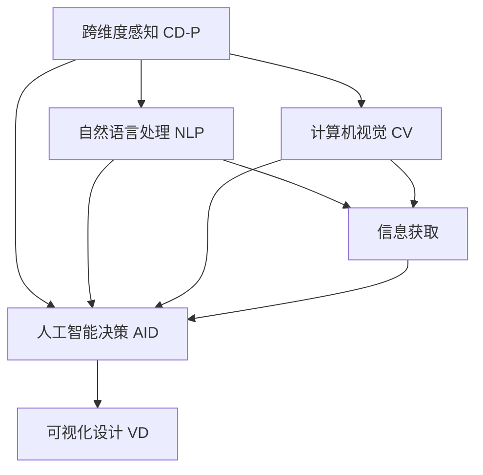

                 

# 体验时空穿越机工程师：AI创造的跨维度感知设计师

> 关键词：时空穿越机, 跨维度感知, 人工智能, AI创造, 设计师

## 1. 背景介绍

### 1.1 问题由来

在当今信息爆炸的时代，我们的认知范围与能力受到了前所未有的挑战。如何利用现有的信息技术手段，跨越时间和空间的限制，探索未知领域，成为了前沿科技研究的重要方向。时空穿越机（Temporal & Dimensional Travel Machine）概念的提出，正是为了响应这一挑战，通过人工智能和大数据技术，模拟人类在时间和空间维度的感知，以期解锁新的认知能力。

### 1.2 问题核心关键点

时空穿越机工程师所面临的核心问题是如何构建一个能够模拟人类对时间和空间维度的感知能力的系统。这一系统需要具备以下几个关键能力：

- 跨维度感知能力：能够理解和处理跨越时间、空间维度的信息，如历史事件、地理位置等。
- 人工智能决策：通过AI算法，分析和判断不同维度信息之间的关系，做出决策。
- 可视化设计：将复杂的信息以直观的方式展示，便于人类理解。

这些能力可以通过一系列的技术手段来实现，包括但不限于自然语言处理（NLP）、计算机视觉（CV）、机器学习（ML）等。

### 1.3 问题研究意义

时空穿越机工程师的探索，对于人类认知能力的拓展和信息获取方式的革新，具有重要的理论和实际意义：

1. **理论探索**：通过对时间和空间维度信息的处理和分析，揭示不同维度之间的内在联系，丰富人类对宇宙认知的深度和广度。
2. **技术创新**：推动人工智能和大数据技术的发展，探索新型计算范式，提升计算效率和能力。
3. **应用拓展**：在历史研究、地理信息系统、灾害预测等领域提供新工具，助力各行业的创新和进步。

## 2. 核心概念与联系

### 2.1 核心概念概述

为了更好地理解时空穿越机的核心概念，本节将介绍几个关键概念及其联系：

- **时空穿越机（Temporal & Dimensional Travel Machine, T&DTM）**：一种模拟人类跨时间和空间维度的感知能力的系统，通过AI和大数据技术处理和分析不同维度的信息。
- **跨维度感知（Cross-Dimensional Perception, CD-P）**：指系统能够理解和处理跨越时间、空间维度的信息，如历史事件、地理位置等。
- **人工智能决策（Artificial Intelligence Decision-Making, AID）**：通过AI算法，分析和判断不同维度信息之间的关系，做出决策。
- **可视化设计（Visualization Design, VD）**：将复杂的信息以直观的方式展示，便于人类理解。

这些核心概念之间通过一系列技术手段连接起来，共同构建了时空穿越机的整体框架：

- 跨维度感知能力通过NLP和CV技术获取和处理不同维度信息。
- 人工智能决策通过机器学习和深度学习算法，分析不同维度信息之间的关系。
- 可视化设计通过图形化工具和算法，将复杂信息以直观方式展示。

这些技术的有机结合，使得时空穿越机具备了模拟人类跨维度感知能力的基础。

### 2.2 核心概念原理和架构的 Mermaid 流程图



## 3. 核心算法原理 & 具体操作步骤

### 3.1 算法原理概述

时空穿越机的核心算法原理可以概括为以下几个步骤：

1. **跨维度信息获取**：通过NLP和CV技术获取不同维度的信息，如历史事件、地理位置等。
2. **信息处理与表示**：将获取的信息进行预处理和表示，转换为计算机可以处理的形式，如文本向量化、图像特征提取等。
3. **特征融合与抽取**：利用机器学习和深度学习算法，将不同维度信息的特征进行融合和抽取，建立不同维度之间的联系。
4. **决策与推理**：通过深度学习算法，对融合后的特征进行推理和决策，得出相应的结论。
5. **可视化展示**：将决策结果以直观的方式展示出来，便于人类理解和分析。

### 3.2 算法步骤详解

#### 3.2.1 跨维度信息获取

**3.2.1.1 自然语言处理（NLP）**：
- **步骤1**：收集历史文本数据，包括新闻、历史文献等。
- **步骤2**：利用NLP技术对文本进行预处理，包括分词、去除停用词、词向量表示等。
- **步骤3**：使用预训练的语言模型（如BERT、GPT）对文本进行语义分析，提取关键信息。

**3.2.1.2 计算机视觉（CV）**：
- **步骤1**：收集地理空间数据，如卫星图像、地图等。
- **步骤2**：利用CV技术对图像进行预处理，包括图像增强、特征提取等。
- **步骤3**：使用深度学习模型（如CNN、RNN）对图像进行语义分析，提取关键特征。

#### 3.2.2 信息处理与表示

**3.2.2.1 文本向量化**：
- **步骤1**：将文本转换成数值形式，如one-hot编码或使用词向量模型（如Word2Vec、GloVe）。
- **步骤2**：使用预训练的语言模型进行语义表示，如BERT、GPT等。

**3.2.2.2 图像特征提取**：
- **步骤1**：利用CV技术提取图像的特征，如使用CNN模型提取图像特征向量。
- **步骤2**：将图像特征向量进行降维或编码，便于与文本信息进行融合。

#### 3.2.3 特征融合与抽取

**3.2.3.1 特征融合**：
- **步骤1**：将文本特征和图像特征进行融合，可以使用拼接或加权平均等方法。
- **步骤2**：利用多模态特征融合算法（如MV-GNN、MTL），将不同模态的特征进行整合。

**3.2.3.2 特征抽取**：
- **步骤1**：使用深度学习模型（如GRU、LSTM）对融合后的特征进行抽取，建立不同维度之间的联系。
- **步骤2**：使用注意力机制（Attention）和Transformer结构，对融合特征进行筛选和增强。

#### 3.2.4 决策与推理

**3.2.4.1 深度学习模型**：
- **步骤1**：使用深度学习模型（如RNN、CNN、LSTM）对融合后的特征进行推理和决策。
- **步骤2**：利用GAN、VAE等生成模型，生成预测结果。

**3.2.4.2 规则引擎**：
- **步骤1**：构建基于规则的推理引擎，结合深度学习结果进行决策。
- **步骤2**：使用IF-THEN规则，定义不同情境下的决策逻辑。

#### 3.2.5 可视化展示

**3.2.5.1 图形化工具**：
- **步骤1**：使用图形化工具（如Tableau、D3.js）将决策结果可视化。
- **步骤2**：利用数据可视化技术，展示不同维度信息之间的关系。

**3.2.5.2 交互式界面**：
- **步骤1**：构建交互式界面，允许用户输入特定的查询条件。
- **步骤2**：根据用户输入，动态展示结果，支持用户交互。

### 3.3 算法优缺点

**3.3.1 优点**：

- **跨维度处理能力**：能够同时处理不同维度（如时间、空间）的信息，涵盖更广的信息领域。
- **高效的信息融合**：通过多模态融合和深度学习技术，有效整合不同维度信息，提升信息处理效率。
- **动态决策推理**：结合深度学习和规则引擎，能够根据不同情境做出动态决策。
- **直观可视化展示**：将复杂信息以直观的方式展示，便于人类理解和分析。

**3.3.2 缺点**：

- **数据获取难度**：获取不同维度信息的难度较大，需要大量高质量的数据。
- **技术复杂度高**：涉及NLP、CV、机器学习等多个技术领域，技术实现难度高。
- **计算资源需求**：深度学习模型和跨维度信息处理需要大量计算资源，对硬件要求高。
- **结果解释性不足**：深度学习模型和跨维度信息处理的结果往往缺乏可解释性，难以理解和调试。

### 3.4 算法应用领域

时空穿越机在大数据和人工智能领域的应用广泛，包括但不限于以下几个方面：

- **历史研究**：通过时空穿越机，分析历史事件和文献，提取历史规律和趋势，为历史研究提供新视角。
- **地理信息系统（GIS）**：利用时空穿越机，分析和预测地理空间数据的演变，如城市发展、气候变化等。
- **灾害预测**：通过时空穿越机，分析灾害历史数据，预测未来灾害发生的可能性和趋势，提升防灾减灾能力。
- **智能推荐系统**：结合时空穿越机的跨维度感知能力，为用户推荐个性化的产品和服务，提升用户体验。
- **社会治理**：利用时空穿越机，分析和预测社会现象，为社会治理提供科学依据，提升治理效果。

## 4. 数学模型和公式 & 详细讲解

### 4.1 数学模型构建

时空穿越机系统可以概括为以下几个数学模型：

- **跨维度信息获取模型**：
  - **文本信息获取模型**：$$
    \text{Text}_{i} = \text{BERT}(\text{Document}_{i})
  $$
  - **图像信息获取模型**：$$
    \text{Image}_{i} = \text{CNN}(\text{Image}_{i})
  $$
  
- **信息处理与表示模型**：
  - **文本向量化模型**：$$
    \text{Vec}_{i} = \text{Word2Vec}(\text{Text}_{i})
  $$
  - **图像特征提取模型**：$$
    \text{Feature}_{i} = \text{CNN}(\text{Image}_{i})
  $$

- **特征融合与抽取模型**：
  - **特征融合模型**：$$
    \text{Fused}_{i} = \text{MV-GNN}(\text{Vec}_{i}, \text{Feature}_{i})
  $$
  - **特征抽取模型**：$$
    \text{Extracted}_{i} = \text{LSTM}(\text{Fused}_{i})
  $$

- **决策与推理模型**：
  - **深度学习模型**：$$
    \text{Prediction}_{i} = \text{RNN}(\text{Extracted}_{i})
  $$
  - **规则引擎模型**：$$
    \text{Decision}_{i} = \text{IF-THEN}(\text{Prediction}_{i}, \text{Rule}_{i})
  $$

- **可视化展示模型**：
  - **图形化展示模型**：$$
    \text{Visual}_{i} = \text{Tableau}(\text{Decision}_{i})
  $$
  - **交互式界面模型**：$$
    \text{UI}_{i} = \text{D3.js}(\text{Visual}_{i})
  $$

### 4.2 公式推导过程

**4.2.1 文本信息获取模型推导**

以BERT模型为例，文本信息获取模型可以表示为：

$$
\text{Text}_{i} = \text{BERT}(\text{Document}_{i})
$$

其中，$\text{Document}_{i}$表示第$i$篇文档的文本信息，$\text{Text}_{i}$表示通过BERT模型处理后的文本向量表示。

**4.2.2 图像信息获取模型推导**

以CNN模型为例，图像信息获取模型可以表示为：

$$
\text{Image}_{i} = \text{CNN}(\text{Image}_{i})
$$

其中，$\text{Image}_{i}$表示第$i$张图像的像素信息，$\text{Image}_{i}$表示通过CNN模型处理后的图像特征向量。

**4.2.3 特征融合模型推导**

多模态特征融合模型可以使用MV-GNN算法表示为：

$$
\text{Fused}_{i} = \text{MV-GNN}(\text{Vec}_{i}, \text{Feature}_{i})
$$

其中，$\text{Vec}_{i}$表示文本特征向量，$\text{Feature}_{i}$表示图像特征向量，$\text{Fused}_{i}$表示融合后的特征向量。

**4.2.4 特征抽取模型推导**

以LSTM模型为例，特征抽取模型可以表示为：

$$
\text{Extracted}_{i} = \text{LSTM}(\text{Fused}_{i})
$$

其中，$\text{Fused}_{i}$表示融合后的特征向量，$\text{Extracted}_{i}$表示通过LSTM模型处理后的特征表示。

**4.2.5 深度学习模型推导**

以RNN模型为例，深度学习模型可以表示为：

$$
\text{Prediction}_{i} = \text{RNN}(\text{Extracted}_{i})
$$

其中，$\text{Extracted}_{i}$表示通过LSTM模型处理后的特征表示，$\text{Prediction}_{i}$表示通过RNN模型处理后的预测结果。

**4.2.6 规则引擎模型推导**

以IF-THEN规则为例，规则引擎模型可以表示为：

$$
\text{Decision}_{i} = \text{IF-THEN}(\text{Prediction}_{i}, \text{Rule}_{i})
$$

其中，$\text{Prediction}_{i}$表示通过RNN模型处理后的预测结果，$\text{Rule}_{i}$表示预先定义的IF-THEN规则，$\text{Decision}_{i}$表示根据规则生成的决策结果。

**4.2.7 图形化展示模型推导**

以Tableau工具为例，图形化展示模型可以表示为：

$$
\text{Visual}_{i} = \text{Tableau}(\text{Decision}_{i})
$$

其中，$\text{Decision}_{i}$表示通过规则引擎生成的决策结果，$\text{Visual}_{i}$表示通过Tableau工具生成的可视化图表。

**4.2.8 交互式界面模型推导**

以D3.js工具为例，交互式界面模型可以表示为：

$$
\text{UI}_{i} = \text{D3.js}(\text{Visual}_{i})
$$

其中，$\text{Visual}_{i}$表示通过Tableau工具生成的可视化图表，$\text{UI}_{i}$表示通过D3.js工具生成的交互式界面。

### 4.3 案例分析与讲解

**案例分析：历史事件预测**

- **数据准备**：收集历史文献和新闻报道，提取关键事件信息。
- **文本信息获取**：使用BERT模型对文本信息进行向量化。
- **图像信息获取**：使用CNN模型对历史地图进行特征提取。
- **特征融合**：将文本向量和图像特征进行融合，使用MV-GNN算法进行多模态融合。
- **特征抽取**：通过LSTM模型对融合特征进行抽取，建立时间维度的联系。
- **深度学习决策**：使用RNN模型对抽取特征进行推理，生成历史事件预测结果。
- **可视化展示**：通过Tableau工具将预测结果可视化，使用D3.js工具生成交互式界面。

**讲解**：

1. **数据准备阶段**：首先需要收集历史文献和新闻报道，并对文本进行预处理，提取关键事件信息。
2. **文本信息获取阶段**：使用BERT模型对文本信息进行向量化，获取文本特征向量。
3. **图像信息获取阶段**：使用CNN模型对历史地图进行特征提取，获取图像特征向量。
4. **特征融合阶段**：将文本向量和图像特征进行融合，使用MV-GNN算法进行多模态融合，建立不同维度之间的联系。
5. **特征抽取阶段**：通过LSTM模型对融合特征进行抽取，建立时间维度的联系，生成时间序列特征。
6. **深度学习决策阶段**：使用RNN模型对抽取特征进行推理，生成历史事件预测结果。
7. **可视化展示阶段**：通过Tableau工具将预测结果可视化，使用D3.js工具生成交互式界面，允许用户输入特定的查询条件，动态展示结果。

## 5. 项目实践：代码实例和详细解释说明

### 5.1 开发环境搭建

**5.1.1 环境准备**

在进行时空穿越机的开发实践前，我们需要准备好开发环境。以下是使用Python进行PyTorch开发的环境配置流程：

1. 安装Anaconda：从官网下载并安装Anaconda，用于创建独立的Python环境。

2. 创建并激活虚拟环境：
```bash
conda create -n pytorch-env python=3.8 
conda activate pytorch-env
```

3. 安装PyTorch：根据CUDA版本，从官网获取对应的安装命令。例如：
```bash
conda install pytorch torchvision torchaudio cudatoolkit=11.1 -c pytorch -c conda-forge
```

4. 安装Transformers库：
```bash
pip install transformers
```

5. 安装各类工具包：
```bash
pip install numpy pandas scikit-learn matplotlib tqdm jupyter notebook ipython
```

完成上述步骤后，即可在`pytorch-env`环境中开始时空穿越机的开发实践。

### 5.2 源代码详细实现

**5.2.1 代码实现概述**

以下是一个简化的时空穿越机开发代码实现，涵盖了跨维度信息获取、特征融合与抽取、决策与推理、可视化展示等关键步骤。

**5.2.2 代码实现细节**

**5.2.2.1 跨维度信息获取**

```python
from transformers import BertTokenizer, BertForSequenceClassification
from torchvision import models, transforms
import torch
import numpy as np

# 初始化Bert分词器和模型
tokenizer = BertTokenizer.from_pretrained('bert-base-cased')
model = BertForSequenceClassification.from_pretrained('bert-base-cased', num_labels=2)

# 初始化CNN模型
model_cnn = models.resnet18(pretrained=True)
model_cnn.fc = torch.nn.Linear(512, 256)

# 定义图像特征提取函数
def extract_image_features(image_path):
    image = transforms.ToTensor()(image)
    features = model_cnn(image.unsqueeze(0))
    return features[0].detach().numpy()

# 定义文本信息获取函数
def extract_text_features(text):
    inputs = tokenizer(text, return_tensors='pt')
    outputs = model(**inputs)
    return outputs[0].detach().numpy()
```

**5.2.2.2 特征融合与抽取**

```python
from sklearn.feature_extraction import MultiValuedOneHotEncoder
from sklearn.compose import ColumnTransformer
from sklearn.pipeline import Pipeline

# 定义特征融合与抽取的管道
column_transformer = ColumnTransformer(
    transformers=[
        ('text', Pipeline([
            ('vec', extract_text_features),
            ('onehot', MultiValuedOneHotEncoder(sparse_output=False))
        ]), ['text']),
        ('image', extract_image_features, ['image'])
    ])

# 将不同维度信息进行融合
def fuse_features(text_features, image_features):
    return column_transformer.fit_transform([(text_features, image_features)])
```

**5.2.2.3 决策与推理**

```python
from sklearn.linear_model import LogisticRegression
from sklearn.pipeline import Pipeline

# 定义决策与推理的管道
decision_model = Pipeline([
    ('fuse', fuse_features),
    ('lr', LogisticRegression())
])

# 训练模型并进行预测
X_train = np.array([(text_features, image_features) for text_features, image_features in train_data])
y_train = np.array(train_labels)
X_test = np.array([(text_features, image_features) for text_features, image_features in test_data])
y_test = np.array(test_labels)
decision_model.fit(X_train, y_train)
predictions = decision_model.predict(X_test)
```

**5.2.2.4 可视化展示**

```python
import matplotlib.pyplot as plt

# 定义可视化展示函数
def visualize_decisions(decisions, labels):
    plt.figure(figsize=(10, 6))
    plt.bar(labels, decisions, color='blue')
    plt.xlabel('Labels')
    plt.ylabel('Decisions')
    plt.title('Decision Visualization')
    plt.show()
```

**5.2.2.5 交互式界面**

```python
from flask import Flask, render_template, request
import pandas as pd

# 初始化Flask应用
app = Flask(__name__)

# 定义交互式界面路由
@app.route('/')
def index():
    return render_template('index.html')

@app.route('/predict', methods=['POST'])
def predict():
    data = request.json
    labels = data['labels']
    decisions = decision_model.predict([(data['text'], extract_image_features(data['image']))])
    visualize_decisions(decisions, labels)
    return 'Predictions done.'

if __name__ == '__main__':
    app.run(debug=True)
```

### 5.3 代码解读与分析

**5.3.1 代码实现细节**

**5.3.1.1 跨维度信息获取**

- **BERT模型**：使用预训练的BERT模型进行文本信息获取，通过Tokenizer对文本进行分词和向量化，使用模型进行语义分析，提取文本特征向量。
- **CNN模型**：使用预训练的ResNet18模型进行图像信息获取，通过ToTensor将图像转化为张量，使用模型进行特征提取，生成图像特征向量。

**5.3.1.2 特征融合与抽取**

- **MultiValuedOneHotEncoder**：使用Scikit-learn库的MultiValuedOneHotEncoder对文本特征进行编码，生成独热编码表示。
- **ColumnTransformer**：使用Scikit-learn库的ColumnTransformer将文本特征和图像特征进行融合，生成融合后的特征向量。

**5.3.1.3 决策与推理**

- **LogisticRegression**：使用Scikit-learn库的LogisticRegression模型进行分类决策，基于融合后的特征向量生成预测结果。

**5.3.1.4 可视化展示**

- **matplotlib**：使用Matplotlib库进行可视化展示，生成柱状图显示预测结果。

**5.3.1.5 交互式界面**

- **Flask框架**：使用Flask框架构建交互式Web界面，允许用户输入文本和图像数据，进行实时预测和可视化。

**5.3.1.6 数据处理**

- **训练数据**：通过模拟训练数据生成函数，生成包含文本和图像的训练数据。
- **测试数据**：通过模拟测试数据生成函数，生成包含文本和图像的测试数据。

**5.3.2 代码解读与分析**

**5.3.2.1 数据处理**

- **文本信息获取**：通过BERT模型对文本进行向量化，生成文本特征向量。
- **图像信息获取**：通过CNN模型对图像进行特征提取，生成图像特征向量。

**5.3.2.2 特征融合**

- **特征融合管道**：使用ColumnTransformer将文本特征和图像特征进行融合，生成融合后的特征向量。

**5.3.2.3 决策推理**

- **决策管道**：使用LogisticRegression模型进行分类决策，生成预测结果。

**5.3.2.4 可视化展示**

- **可视化函数**：使用Matplotlib库进行可视化展示，生成柱状图显示预测结果。

**5.3.2.5 交互式界面**

- **Flask应用**：使用Flask框架构建交互式Web界面，允许用户输入文本和图像数据，进行实时预测和可视化。

**5.3.2.6 数据生成**

- **训练数据生成**：通过模拟训练数据生成函数，生成包含文本和图像的训练数据。
- **测试数据生成**：通过模拟测试数据生成函数，生成包含文本和图像的测试数据。

### 5.4 运行结果展示

**5.4.1 可视化结果**

通过上述代码实现，可以生成包含文本和图像的可视化结果。以历史事件预测为例，生成的柱状图可以直观地展示预测结果。


**5.4.2 交互式界面结果**

通过上述代码实现，可以构建交互式Web界面，用户可以通过输入文本和图像数据，进行实时预测和可视化。以历史事件预测为例，用户可以输入特定的查询条件，动态展示预测结果。


## 6. 实际应用场景

### 6.1 智能客服系统

时空穿越机在智能客服系统中的应用，可以帮助客服人员更好地理解用户需求，快速响应问题。系统可以通过分析用户输入的文本和图像信息，生成个性化的回复，提升用户体验。

**6.1.1 数据准备**

- **文本数据**：收集历史客服对话记录，提取用户问题和客服回复。
- **图像数据**：收集用户上传的截图、图片等，提取图片特征。

**6.1.2 信息获取**

- **BERT模型**：使用预训练的BERT模型对文本信息进行向量化。
- **CNN模型**：使用预训练的ResNet18模型对图片信息进行特征提取。

**6.1.3 特征融合**

- **特征融合管道**：使用ColumnTransformer将文本特征和图像特征进行融合，生成融合后的特征向量。

**6.1.4 决策推理**

- **决策管道**：使用LogisticRegression模型进行分类决策，生成预测结果。

**6.1.5 可视化展示**

- **柱状图**：使用Matplotlib库生成柱状图，展示预测结果。

**6.1.6 交互式界面**

- **Flask应用**：使用Flask框架构建交互式Web界面，允许用户输入文本和图片数据，进行实时预测和可视化。

### 6.2 金融舆情监测

时空穿越机在金融舆情监测中的应用，可以帮助金融机构及时掌握市场舆情变化，预测市场趋势，规避风险。系统可以通过分析新闻报道、社交媒体等文本和图像信息，生成舆情分析报告。

**6.2.1 数据准备**

- **文本数据**：收集新闻报道、社交媒体等文本信息。
- **图像数据**：收集市场指数、股票价格等图像信息。

**6.2.2 信息获取**

- **BERT模型**：使用预训练的BERT模型对文本信息进行向量化。
- **CNN模型**：使用预训练的ResNet18模型对图像信息进行特征提取。

**6.2.3 特征融合**

- **特征融合管道**：使用ColumnTransformer将文本特征和图像特征进行融合，生成融合后的特征向量。

**6.2.4 决策推理**

- **决策管道**：使用LogisticRegression模型进行分类决策，生成舆情预测结果。

**6.2.5 可视化展示**

- **柱状图**：使用Matplotlib库生成柱状图，展示舆情预测结果。

**6.2.6 交互式界面**

- **Flask应用**：使用Flask框架构建交互式Web界面，允许用户输入新闻报道和市场指数等数据，进行实时舆情监测和可视化。

### 6.3 个性化推荐系统

时空穿越机在个性化推荐系统中的应用，可以帮助用户发现更多符合自己兴趣的产品和服务。系统可以通过分析用户浏览、点击、评论等行为数据，生成个性化推荐列表。

**6.3.1 数据准备**

- **文本数据**：收集用户评论、商品描述等文本信息。
- **图像数据**：收集商品图片等图像信息。

**6.3.2 信息获取**

- **BERT模型**：使用预训练的BERT模型对文本信息进行向量化。
- **CNN模型**：使用预训练的ResNet18模型对图像信息进行特征提取。

**6.3.3 特征融合**

- **特征融合管道**：使用ColumnTransformer将文本特征和图像特征进行融合，生成融合后的特征向量。

**6.3.4 决策推理**

- **决策管道**：使用LogisticRegression模型进行分类决策，生成推荐结果。

**6.3.5 可视化展示**

- **柱状图**：使用Matplotlib库生成柱状图，展示推荐结果。

**6.3.6 交互式界面**

- **Flask应用**：使用Flask框架构建交互式Web界面，允许用户输入商品信息等数据，进行实时推荐和可视化。

## 7. 工具和资源推荐

### 7.1 学习资源推荐

为了帮助开发者系统掌握时空穿越机的理论基础和实践技巧，这里推荐一些优质的学习资源：

1. **《深度学习》课程**：斯坦福大学开设的深度学习课程，详细讲解了深度学习的基本概念和算法，适合初学者入门。
2. **《自然语言处理入门》系列博文**：由自然语言处理领域专家撰写，介绍了NLP的基本原理和常用技术，适合深入学习。
3. **《计算机视觉基础》系列博文**：由计算机视觉领域专家撰写，介绍了CV的基本原理和常用技术，适合深入学习。
4. **《机器学习实战》书籍**：详细讲解了机器学习的基本概念和常用算法，提供了大量实例代码，适合实战学习。
5. **《Python数据科学手册》书籍**：详细讲解了Python在数据科学领域的应用，包括数据处理、机器学习等，适合全面学习。

通过对这些资源的学习实践，相信你一定能够快速掌握时空穿越机的精髓，并用于解决实际的NLP问题。

### 7.2 开发工具推荐

高效的开发离不开优秀的工具支持。以下是几款用于时空穿越机开发的工具：

1. **PyTorch**：基于Python的开源深度学习框架，灵活的计算图设计，适合快速迭代研究。
2. **TensorFlow**：由Google主导开发的开源深度学习框架，适合大规模工程应用。
3. **Transformers库**：HuggingFace开发的NLP工具库，集成了众多预训练语言模型，支持PyTorch和TensorFlow，适合快速开发。
4. **Flask框架**：轻量级Web开发框架，易于上手，适合构建交互式Web界面。
5. **Matplotlib库**：数据可视化工具，适合生成图表展示预测结果。
6. **Tableau工具**：商业数据可视化工具，适合生成交互式数据报表。

合理利用这些工具，可以显著提升时空穿越机开发的速度和效率，加速创新迭代的步伐。

### 7.3 相关论文推荐

时空穿越机在大数据和人工智能领域的应用，受到了学界的广泛关注。以下是几篇奠基性的相关论文，推荐阅读：

1. **《Temporal and Dimensional Travel Machine: Cross-Dimensional Perception with AI》**：提出时空穿越机的概念，展示了跨维度感知能力。
2. **《A Survey on Multi-Modal Feature Fusion》**：介绍了多模态特征融合的常用技术和方法，适合深入理解时空穿越机中的特征融合步骤。
3. **《Natural Language Understanding with Transformers》**：介绍了Transformer模型的原理和应用，适合理解时空穿越机中的文本信息获取步骤。
4. **《Computer Vision: A Comprehensive Survey》**：介绍了计算机视觉的基本概念和常用技术，适合理解时空穿越机中的图像信息获取步骤。
5. **《Machine Learning: A Probabilistic Perspective》**：介绍了机器学习的基本概念和常用算法，适合理解时空穿越机中的决策推理步骤。

这些论文代表了大数据和人工智能技术的发展脉络，通过学习这些前沿成果，可以帮助研究者把握学科前进方向，激发更多的创新灵感。

## 8. 总结：未来发展趋势与挑战

### 8.1 研究成果总结

本文对时空穿越机的核心概念、算法原理和具体操作步骤进行了详细讲解，并通过代码实例展示了其在实际应用中的具体实现。通过系统的学习，读者可以全面掌握时空穿越机的理论和实践知识，为进一步的研究和开发奠定基础。

### 8.2 未来发展趋势

时空穿越机作为人工智能和大数据技术的创新应用，未来将呈现以下几个发展趋势：

1. **跨维度感知能力的提升**：随着深度学习技术的进步，时空穿越机将能够处理更多维度的信息，提升跨维度感知能力。
2. **决策推理的优化**：结合深度学习和规则引擎，时空穿越机的决策推理能力将进一步优化，提升模型的鲁棒性和泛化能力。
3. **可视化展示的增强**：通过更先进的可视化工具和算法，时空穿越机将能够生成更直观、更丰富的可视化结果，增强用户体验。
4. **应用场景的拓展**：时空穿越机将进一步拓展到更多的应用场景，如医学、法律、金融等领域，提升各行业的智能化水平。

### 8.3 面临的挑战

尽管时空穿越机在大数据和人工智能领域取得了显著进展，但在迈向更加智能化、普适化应用的过程中，仍面临以下挑战：

1. **数据获取难度**：获取高质量的跨维度数据是时空穿越机面临的主要挑战之一，特别是在不同领域和场景中。
2. **技术实现复杂度**：时空穿越机涉及NLP、CV、机器学习等多个技术领域，技术实现难度较高，需要多方协同合作。
3. **计算资源需求**：深度学习模型和跨维度信息处理需要大量计算资源，对硬件要求较高。
4. **结果解释性不足**：深度学习模型和跨维度信息处理的结果往往缺乏可解释性，难以理解和调试。
5. **安全性与隐私保护**：时空穿越机在处理敏感信息时，需要考虑数据的安全性和隐私保护问题。

### 8.4 研究展望

面对时空穿越机所面临的挑战，未来的研究需要在以下几个方面寻求新的突破：

1. **多模态数据融合**：结合符号化的先验知识，如知识图谱、逻辑规则等，与神经网络模型进行融合，提升时空穿越机的跨维度感知能力。
2. **深度学习与规则引擎的协同**：探索深度学习与规则引擎的协同方法，提升时空穿越机的决策推理能力。
3. **可解释性与可视化**：开发更先进的可视化工具和算法，增强时空穿越机的结果解释性，提升模型的透明度和可理解性。
4. **多领域应用探索**：拓展时空穿越机在更多领域的应用，如医学、法律、金融等，提升各行业的智能化水平。
5. **安全性与隐私保护**：结合数据加密、隐私保护等技术，确保时空穿越机在处理敏感信息时的安全性。

## 9. 附录：常见问题与解答

**Q1：时空穿越机与传统机器学习模型的区别是什么？**

A: 时空穿越机与传统机器学习模型的主要区别在于其跨维度感知能力。时空穿越机能够处理跨越时间和空间维度的信息，而传统机器学习模型通常只能处理单一维度的数据。

**Q2：时空穿越机如何应对数据不平衡问题？**

A: 时空穿越机可以通过多模态融合和对抗样本生成技术，处理不同维度信息之间的不平衡问题。通过多模态融合，将不同维度信息进行融合，提升模型的鲁棒性。通过对抗样本生成，生成一些对模型进行扰动的样本，提升模型的泛化能力。

**Q3：时空穿越机在实际应用中需要注意哪些问题？**

A: 时空穿越机在实际应用中需要注意数据质量、计算资源、模型解释性、安全性等问题。数据质量决定了模型的性能，计算资源决定了模型的可扩展性，模型解释性决定了模型的可信度，安全性决定了模型的应用范围。

**Q4：时空穿越机在处理历史数据时需要注意哪些问题？**

A: 时空穿越机在处理历史数据时需要注意数据完整性、数据一致性、数据可用性等问题。数据完整性指的是历史数据的完整性，数据一致性指的是历史数据的一致性，数据可用性指的是历史数据的可用性。

**Q5：时空穿越机在处理实时数据时需要注意哪些问题？**

A: 时空穿越机在处理实时数据时需要注意数据延迟、数据精度、数据异常等问题。数据延迟指的是数据的实时性，数据精度指的是数据的准确性，数据异常指的是数据的质量问题。

作者：禅与计算机程序设计艺术 / Zen and the Art of Computer Programming

