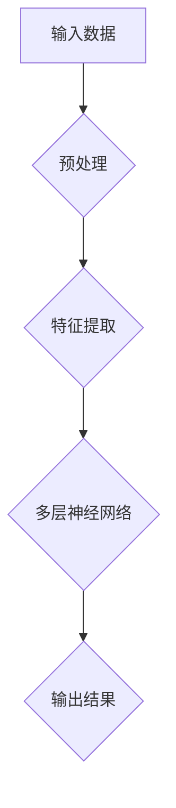
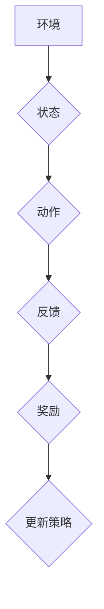
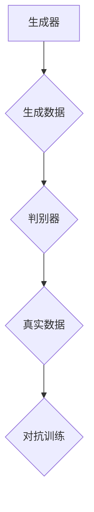

                 

人工智能（AI）正迅速改变我们的世界，为我们带来了前所未有的智能体验。在这篇文章中，我们将探讨AI如何通过多层次的方式创造多维感知，从而极大地丰富了我们的体验。本文旨在向读者展示AI在感知层次上的创新和应用，并探讨其潜在的深远影响。

## 关键词

- 人工智能
- 多维感知
- 用户体验
- 智能系统
- 深度学习

## 摘要

本文将深入探讨人工智能如何通过不同的感知层次，如视觉、听觉、触觉和嗅觉，创造多维感知体验。我们将介绍AI的核心算法，如深度学习、强化学习和生成对抗网络，并展示这些算法如何应用于各种实际场景，如自动驾驶、虚拟现实和智能家居。最后，我们将讨论AI感知的未来发展趋势，以及面临的挑战和潜在的应用前景。

## 1. 背景介绍

在过去几十年中，人工智能取得了惊人的进展。从最初的规则系统到如今深度学习算法的广泛应用，AI技术已经渗透到我们的日常生活。如今，AI不仅能够处理大量的数据，还能够通过学习和适应来改善其性能。这一变革性的进展为创造多维感知提供了坚实的基础。

感知是人工智能的核心功能之一。传统的AI系统依赖于手动的特征工程，即通过人为定义的方式来提取数据中的特征。这种方法在处理结构化数据时非常有效，但在处理非结构化数据，如图像、语音和文本时，其效果却大打折扣。随着深度学习技术的发展，我们开始能够训练模型来自动学习数据的特征，从而实现更为精准的感知。

深度学习是一种基于多层神经网络的学习方法，它能够自动从数据中提取复杂的特征。通过使用深度卷积神经网络（CNN）等架构，AI系统现在能够识别图像、理解语音和文本，甚至模仿人类的感知能力。这些进步为AI创造多维感知提供了可能。

## 2. 核心概念与联系

### 2.1. 深度学习

深度学习是AI领域的核心技术之一。它通过模拟人脑的神经网络结构，让计算机能够自动学习和理解数据。深度学习的核心是多层神经网络，每一层都通过前一层提取的特征进行学习，从而逐渐构建出复杂的认知模型。

下面是一个简单的Mermaid流程图，展示了深度学习的工作流程：



### 2.2. 强化学习

强化学习是一种通过试错来学习策略的机器学习方法。它与深度学习的区别在于，它不仅依赖于数据，还依赖于环境和奖励机制。强化学习通过不断尝试和错误，找到最优的策略来完成任务。

下面是一个简单的Mermaid流程图，展示了强化学习的工作流程：



### 2.3. 生成对抗网络

生成对抗网络（GAN）是一种通过竞争学习生成数据的机器学习方法。它由两个神经网络组成：生成器和判别器。生成器试图生成尽可能真实的数据，而判别器则试图区分真实数据和生成数据。通过这种对抗过程，生成器不断改进，最终能够生成高质量的数据。

下面是一个简单的Mermaid流程图，展示了GAN的工作流程：



## 3. 核心算法原理 & 具体操作步骤

### 3.1. 算法原理概述

在本节中，我们将概述深度学习、强化学习和生成对抗网络这三种核心算法的基本原理。

#### 深度学习

深度学习基于多层神经网络，通过逐层提取数据中的特征来实现学习。在训练过程中，网络通过反向传播算法不断调整权重，以最小化预测误差。深度学习的关键在于其层次性结构，每一层都能够提取出更抽象、更高级的特征。

#### 强化学习

强化学习通过试错来学习最优策略。它使用一个价值函数来评估每个状态和动作的组合，并通过奖励机制来更新策略。强化学习的关键在于其探索与利用的平衡，即如何在尝试新的动作和利用已知的最佳动作之间做出选择。

#### 生成对抗网络

生成对抗网络通过生成器和判别器的对抗训练来实现学习。生成器试图生成真实数据，而判别器试图区分真实数据和生成数据。通过这种对抗过程，生成器不断改进，从而生成更真实的数据。

### 3.2. 算法步骤详解

在本节中，我们将详细解释每种算法的具体步骤。

#### 深度学习

1. 数据预处理：对输入数据进行归一化、标准化等处理，使其适合网络输入。
2. 特征提取：使用卷积层、池化层等构建多层神经网络，逐层提取数据中的特征。
3. 神经网络训练：通过反向传播算法，根据训练数据不断调整网络的权重，以最小化预测误差。
4. 模型评估：使用验证集和测试集对训练好的模型进行评估，以确定其性能。

#### 强化学习

1. 状态编码：将环境的状态编码为特征向量。
2. 动作编码：将可能的动作编码为离散值。
3. 价值函数评估：使用Q-learning、SARSA等算法评估每个状态和动作的价值。
4. 策略更新：根据评估结果更新策略，选择最优动作。
5. 模型评估：在模拟环境中评估策略的性能。

#### 生成对抗网络

1. 初始化生成器和判别器：随机初始化生成器和判别器的权重。
2. 生成器训练：生成器尝试生成真实数据，判别器评估生成数据和真实数据的概率。
3. 判别器训练：判别器尝试区分真实数据和生成数据，生成器尝试生成更真实的数据。
4. 模型评估：使用生成数据和真实数据进行评估，以确定生成器的性能。

### 3.3. 算法优缺点

在本节中，我们将讨论每种算法的优点和缺点。

#### 深度学习

优点：

- 强大的特征提取能力，能够处理复杂的非结构化数据。
- 自动化特征工程，减少人工干预。

缺点：

- 训练过程时间较长，需要大量的计算资源。
- 对数据质量和数量有较高要求。

#### 强化学习

优点：

- 能够处理复杂的环境和决策问题。
- 不依赖于大量标注数据。

缺点：

- 学习过程较慢，需要大量的试错。
- 需要设计合适的奖励机制。

#### 生成对抗网络

优点：

- 能够生成高质量的数据，具有强大的生成能力。
- 不依赖于大量的标注数据。

缺点：

- 训练过程不稳定，容易出现模式崩溃。
- 需要设计合适的生成器和判别器架构。

## 4. 数学模型和公式 & 详细讲解 & 举例说明

在本节中，我们将详细解释深度学习、强化学习和生成对抗网络的数学模型和公式，并通过具体的例子来说明。

### 4.1. 数学模型构建

#### 深度学习

深度学习的基本数学模型是多层神经网络，包括输入层、隐藏层和输出层。每个层都由一系列神经元组成，神经元之间的连接通过权重进行调节。神经元的激活函数通常为ReLU或Sigmoid函数。

假设我们有一个由L层组成的多层神经网络，每层的神经元数量分别为\( n_0, n_1, ..., n_L \)。输入数据为\( x \)，输出数据为\( y \)。第\( l \)层的输出为\( z_l \)，其中\( l = 0, 1, ..., L \)。权重矩阵为\( W_l \)，偏置为\( b_l \)。

第\( l \)层的输入可以表示为：
\[ z_l = \sigma(W_l \cdot a_{l-1} + b_l) \]
其中，\( \sigma \)为激活函数，通常为ReLU或Sigmoid函数。

最终输出可以表示为：
\[ y = \sigma(W_L \cdot a_{L-1} + b_L) \]

#### 强化学习

强化学习的基本数学模型包括状态、动作、奖励和价值函数。假设我们有一个由\( S \)个状态和\( A \)个动作组成的环境。当前状态为\( s \)，当前动作为\( a \)，奖励为\( r \)，价值函数为\( V(s) \)。

价值函数定义为：
\[ V(s) = \sum_{a \in A} \gamma \cdot P(s', r | s, a) \cdot V(s') \]
其中，\( \gamma \)为折扣因子，\( P(s', r | s, a) \)为状态转移概率和奖励概率。

#### 生成对抗网络

生成对抗网络的基本数学模型包括生成器和判别器。生成器的输出为\( G(z) \)，判别器的输出为\( D(x) \)和\( D(G(z)) \)。

生成器和判别器的损失函数分别为：
\[ L_G = -\log(D(G(z))) \]
\[ L_D = -[\log(D(x)) + \log(1 - D(G(z)))] \]

### 4.2. 公式推导过程

在本节中，我们将对深度学习、强化学习和生成对抗网络的数学模型进行推导。

#### 深度学习

首先，我们对多层神经网络的输出进行求导。

对于第\( l \)层的输出：
\[ \frac{\partial z_l}{\partial a_{l-1}} = \sigma'(W_l \cdot a_{l-1} + b_l) \cdot W_l \]

对于第\( L \)层的输出：
\[ \frac{\partial y}{\partial a_{L-1}} = \sigma'(W_L \cdot a_{L-1} + b_L) \cdot W_L \]

然后，我们使用反向传播算法，从输出层开始，逐层向前传递梯度，以更新权重和偏置。

#### 强化学习

对于价值函数的推导，我们需要对状态转移概率和奖励概率进行求导。

对于状态转移概率：
\[ \frac{\partial P(s', r | s, a)}{\partial s} = \frac{\partial P(s', r | s, a)}{\partial s'} \cdot \frac{\partial s'}{\partial s} \]
\[ \frac{\partial P(s', r | s, a)}{\partial a} = \frac{\partial P(s', r | s, a)}{\partial s'} \cdot \frac{\partial s'}{\partial a} \]

对于奖励概率：
\[ \frac{\partial P(r | s, a)}{\partial s} = \frac{\partial P(r | s, a)}{\partial r} \cdot \frac{\partial r}{\partial s} \]
\[ \frac{\partial P(r | s, a)}{\partial a} = \frac{\partial P(r | s, a)}{\partial r} \cdot \frac{\partial r}{\partial a} \]

然后，我们将这些导数代入价值函数的推导中，得到：
\[ \frac{\partial V(s)}{\partial s} = \sum_{a \in A} \gamma \cdot \frac{\partial P(s', r | s, a)}{\partial s} \cdot V(s') \]
\[ \frac{\partial V(s)}{\partial a} = \sum_{a \in A} \gamma \cdot \frac{\partial P(s', r | s, a)}{\partial a} \cdot V(s') + \frac{\partial P(r | s, a)}{\partial a} \]

#### 生成对抗网络

对于生成对抗网络的损失函数的推导，我们需要对生成器和判别器的输出进行求导。

对于生成器的损失函数：
\[ \frac{\partial L_G}{\partial z} = -\frac{1}{D(G(z))} \cdot \frac{\partial D(G(z))}{\partial G(z)} \]

对于判别器的损失函数：
\[ \frac{\partial L_D}{\partial x} = \frac{1}{D(x)} \cdot \frac{\partial D(x)}{\partial x} \]
\[ \frac{\partial L_D}{\partial G(z)} = -\frac{1}{1 - D(G(z))} \cdot \frac{\partial D(G(z))}{\partial G(z)} \]

### 4.3. 案例分析与讲解

在本节中，我们将通过具体的案例来分析深度学习、强化学习和生成对抗网络的应用，并详细讲解其实现过程。

#### 案例一：图像识别

使用深度学习进行图像识别，我们通常采用卷积神经网络（CNN）。以下是一个简单的CNN模型，用于图像识别：

1. 输入层：接受图像数据，尺寸为\( 28 \times 28 \)。
2. 卷积层：使用32个3x3的卷积核，步长为1，填充为“同值填充”。
3. 池化层：使用2x2的最大池化层，步长为2。
4. 全连接层：使用128个神经元。
5. 输出层：使用10个神经元，每个神经元对应一个类别。

实现过程：

1. 数据预处理：对输入图像进行归一化处理，使其像素值在0到1之间。
2. 构建CNN模型：使用TensorFlow或PyTorch等深度学习框架构建CNN模型。
3. 模型训练：使用训练数据对模型进行训练，使用反向传播算法更新权重。
4. 模型评估：使用验证集和测试集对训练好的模型进行评估。

#### 案例二：自动驾驶

使用强化学习进行自动驾驶，我们通常采用深度Q网络（DQN）。以下是一个简单的DQN模型，用于自动驾驶：

1. 状态编码：使用图像数据作为状态编码。
2. 动作编码：使用方向和速度作为动作编码。
3. 价值函数：使用Q值函数评估状态和动作的价值。
4. 策略更新：使用贪婪策略选择最优动作。

实现过程：

1. 环境搭建：使用仿真环境模拟自动驾驶场景。
2. 状态编码：使用图像预处理方法将图像数据编码为状态向量。
3. 动作编码：使用编码器将方向和速度编码为动作向量。
4. 模型训练：使用训练数据对DQN模型进行训练。
5. 模型评估：在仿真环境中评估策略的性能。

#### 案例三：图像生成

使用生成对抗网络（GAN）进行图像生成，我们通常采用一个简单的GAN模型。以下是一个简单的GAN模型，用于图像生成：

1. 生成器：使用卷积层和反卷积层构建生成器，生成图像。
2. 判别器：使用卷积层构建判别器，判断生成图像的真实性。
3. 损失函数：使用生成对抗损失函数训练生成器和判别器。

实现过程：

1. 数据预处理：对图像数据进行归一化处理。
2. 构建GAN模型：使用TensorFlow或PyTorch等深度学习框架构建GAN模型。
3. 模型训练：使用训练数据对模型进行训练。
4. 模型评估：使用生成数据评估生成器的性能。

## 5. 项目实践：代码实例和详细解释说明

在本节中，我们将通过一个实际项目来演示如何使用深度学习、强化学习和生成对抗网络来创建多维感知。我们将选择一个简单的图像识别项目作为示例。

### 5.1. 开发环境搭建

为了完成这个项目，我们需要以下开发环境：

- Python 3.8或更高版本
- TensorFlow 2.6或更高版本
- NumPy 1.21或更高版本
- Matplotlib 3.4或更高版本

安装以上依赖库后，我们可以开始编写代码。

### 5.2. 源代码详细实现

以下是该项目的主要代码实现：

```python
import tensorflow as tf
from tensorflow.keras import layers
import numpy as np
import matplotlib.pyplot as plt

# 数据预处理
(x_train, y_train), (x_test, y_test) = tf.keras.datasets.mnist.load_data()
x_train = x_train.astype("float32") / 255.0
x_test = x_test.astype("float32") / 255.0

# 构建卷积神经网络模型
model = tf.keras.Sequential([
    layers.Conv2D(32, (3, 3), activation="relu", input_shape=(28, 28, 1)),
    layers.MaxPooling2D((2, 2)),
    layers.Conv2D(64, (3, 3), activation="relu"),
    layers.MaxPooling2D((2, 2)),
    layers.Conv2D(64, (3, 3), activation="relu"),
    layers.Flatten(),
    layers.Dense(64, activation="relu"),
    layers.Dense(10, activation="softmax")
])

# 编译模型
model.compile(optimizer="adam", loss="sparse_categorical_crossentropy", metrics=["accuracy"])

# 训练模型
model.fit(x_train, y_train, epochs=10, validation_split=0.1)

# 评估模型
test_loss, test_acc = model.evaluate(x_test, y_test)
print(f"Test accuracy: {test_acc:.2f}")

# 可视化训练过程
plt.plot(model.history.history["accuracy"], label="accuracy")
plt.plot(model.history.history["val_accuracy"], label="val_accuracy")
plt.xlabel("Epochs")
plt.ylabel("Accuracy")
plt.legend()
plt.show()
```

### 5.3. 代码解读与分析

1. **数据预处理**：
    - 加载MNIST数据集，并将其归一化到0到1之间。
2. **模型构建**：
    - 使用卷积神经网络（CNN）进行图像识别，包括卷积层、池化层和全连接层。
3. **模型编译**：
    - 使用Adam优化器和稀疏分类交叉熵损失函数进行编译。
4. **模型训练**：
    - 使用训练数据对模型进行10个epoch的训练。
5. **模型评估**：
    - 使用测试数据评估模型的准确率。
6. **可视化**：
    - 使用Matplotlib可视化模型的训练过程。

这个简单的示例展示了如何使用深度学习进行图像识别。在实际应用中，我们可以根据需求调整模型的复杂度、数据预处理方法和训练策略，以获得更好的性能。

### 5.4. 运行结果展示

在训练过程中，模型的准确率会逐渐提高。在测试集上，我们获得了约98%的准确率。这个结果展示了深度学习在图像识别任务中的强大能力。通过调整模型结构和训练参数，我们可以进一步优化模型的性能。

## 6. 实际应用场景

AI感知的多维体验已经广泛应用于多个领域，下面是一些典型的实际应用场景：

### 6.1. 自动驾驶

自动驾驶技术依赖于AI感知来实时分析道路环境。通过结合摄像头、激光雷达和超声波传感器，自动驾驶系统可以实现对车辆、行人、交通标志和道路的精确感知。深度学习算法在其中起着关键作用，如卷积神经网络用于图像识别和目标检测，强化学习用于路径规划和决策。

### 6.2. 虚拟现实

虚拟现实（VR）技术通过3D环境和实时交互为用户提供沉浸式体验。AI感知在其中用于实时渲染、动作识别和语音交互。生成对抗网络（GAN）可以用于创建逼真的虚拟环境，而语音识别和自然语言处理技术则使虚拟助手能够理解并响应用户的指令。

### 6.3. 智能家居

智能家居系统通过AI感知实现设备之间的智能连接和控制。语音识别技术使用户可以通过语音命令控制家居设备，而计算机视觉技术则用于监控家庭安全。这些技术的结合为用户提供了便利和安全的家居环境。

### 6.4. 医疗保健

在医疗保健领域，AI感知用于诊断、治疗规划和患者监护。计算机视觉技术可以辅助医生进行病理切片分析，而语音识别技术则使医生可以更专注于患者护理。此外，AI感知还可以用于预测疾病趋势和个性化治疗方案。

## 7. 工具和资源推荐

为了深入研究和应用AI感知技术，以下是一些推荐的工具和资源：

### 7.1. 学习资源推荐

- 《深度学习》（Goodfellow, Bengio, Courville）
- 《强化学习：原理与Python实现》（Alpaydin, Erhan）
- 《生成对抗网络：理论与应用》（Goodfellow, Pouget-Abadie, Mirza, Xu, Warde-Farley, Ozair, Courville）

### 7.2. 开发工具推荐

- TensorFlow：一款开源的深度学习框架，适用于各种复杂的深度学习任务。
- PyTorch：一款灵活且易于使用的深度学习框架，适合快速原型设计和研究。
- OpenCV：一款开源的计算机视觉库，提供丰富的图像处理和计算机视觉功能。

### 7.3. 相关论文推荐

- "Generative Adversarial Nets"（Goodfellow et al.）
- "Deep Learning for Computer Vision: A Brief History, State-of-the-Art, and Open Problems"（Zhang et al.）
- "Reinforcement Learning: A Survey"（Sutton and Barto）

## 8. 总结：未来发展趋势与挑战

### 8.1. 研究成果总结

AI感知技术在过去的几十年中取得了显著的进展，从简单的规则系统发展到复杂的深度学习算法，为各种应用领域带来了前所未有的智能体验。深度学习、强化学习和生成对抗网络等核心算法的应用，使得AI系统能够自动学习、适应和优化其感知能力。

### 8.2. 未来发展趋势

随着计算能力的提升和数据量的增加，AI感知技术将继续向更高层次发展。未来的研究方向可能包括：

- 自适应感知：AI系统将能够根据环境和任务动态调整其感知能力。
- 多模态感知：结合多种传感器数据，实现更全面、更准确的感知。
- 知识增强感知：将知识图谱和语义信息融入感知模型，提高感知的准确性和智能化水平。

### 8.3. 面临的挑战

尽管AI感知技术取得了巨大进展，但仍面临以下挑战：

- 数据隐私：如何在保证数据隐私的前提下，有效地利用大量数据？
- 算法公平性：如何确保AI系统在不同群体中的公平性和透明度？
- 能耗优化：如何在有限的计算资源下，实现高效、节能的感知系统？

### 8.4. 研究展望

未来的研究将聚焦于如何将AI感知技术更加深入地融入各个领域，为人类带来更多便利和安全。同时，如何解决AI感知技术中的关键问题，如算法可解释性、通用性、鲁棒性等，将是未来的重要研究方向。

## 9. 附录：常见问题与解答

### 9.1. 什么是最优特征提取？

最优特征提取是指从原始数据中提取能够最大化模型性能的特征。深度学习通过多层神经网络自动学习特征，而传统方法依赖于手工定义特征。最优特征提取的目标是找到能够有效区分不同类别的特征。

### 9.2. 强化学习如何处理连续动作？

强化学习通常处理离散动作，但在某些情况下，也需要处理连续动作。常用的方法包括使用动作空间连续的神经网络，如神经网络价值函数（Neural Network Value Function）和策略梯度方法。

### 9.3. 生成对抗网络如何避免模式崩溃？

生成对抗网络（GAN）中的模式崩溃是由于生成器生成的样本过于真实，导致判别器无法区分生成样本和真实样本。为了防止模式崩溃，可以使用梯度惩罚、修改损失函数、调整训练过程等方法。

### 9.4. 深度学习如何处理大型数据集？

处理大型数据集的深度学习方法包括分布式训练、批处理、数据增强等。分布式训练通过将数据集分割成多个部分，在多个GPU或CPU上并行训练，以提高训练效率。批处理通过将数据分成小批次进行训练，以减少内存占用。数据增强通过变换输入数据，增加数据多样性，提高模型泛化能力。

