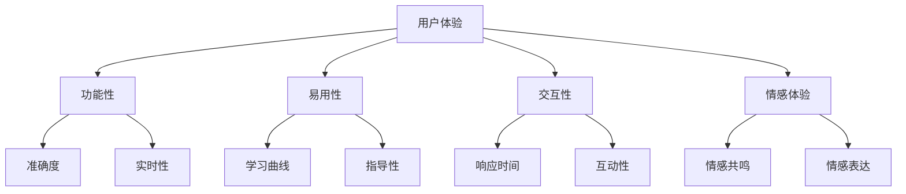

                 

**关键词：** AI 时代，真实性，用户体验，技术发展，人工智能应用。

**摘要：** 在人工智能飞速发展的今天，用户体验（UX）的重要性愈发凸显。本文旨在探讨在AI时代中，如何确保用户感受到的真实性，并分析相关技术、方法及其应用场景，以期为未来的智能系统设计提供参考。

## 1. 背景介绍

随着人工智能（AI）技术的不断进步，智能系统已经在多个领域取得了显著成果，如语音识别、图像处理、自然语言处理等。这些智能系统的应用极大地提升了用户体验，使得我们的日常生活变得更加便捷和高效。然而，与此同时，用户体验中的“真实性”问题也逐渐浮出水面。

用户体验的真实性，指的是用户在使用智能系统时感受到的真实感受，包括对系统功能的感知、互动的流畅度、以及系统响应的准确性等。在AI时代，如何确保用户体验的真实性成为了一个重要课题。因为，如果用户感受到的真实性不足，可能会导致用户对系统的信任度降低，进而影响系统的使用和推广。

### 1.1 用户体验的重要性

用户体验（UX）是衡量智能系统优劣的关键因素。一个优秀的用户体验能够提高用户的满意度，增加用户对系统的忠诚度，从而促进系统的持续发展。用户体验包括以下几个方面：

- **功能性**：系统能否满足用户的实际需求，提供有用的功能和服务。
- **易用性**：系统是否易于使用，用户能否快速上手。
- **交互性**：用户与系统之间的互动是否流畅自然。
- **情感体验**：用户在使用过程中能否产生积极的情感体验。

### 1.2 真实性的含义

真实性在用户体验中的含义主要体现在以下几个方面：

- **准确度**：系统的输出结果是否与用户期望相符。
- **实时性**：系统能否及时响应用户的需求。
- **个性化**：系统能否根据用户的行为和偏好提供个性化的服务。

## 2. 核心概念与联系

在探讨用户体验的真实性时，我们需要了解一些核心概念和它们之间的联系。以下是一个简化的Mermaid流程图，展示了这些概念之间的关系。



### 2.1 核心概念原理

- **用户体验（UX）**：用户体验是指用户在使用产品或服务时的总体感受。它涵盖了用户在使用过程中的功能性、易用性、交互性和情感体验。
- **真实性**：真实性指的是用户在使用智能系统时感受到的真实感受，包括准确度、实时性、个性化和情感共鸣。
- **功能性**：功能性指的是系统能否满足用户的实际需求，提供有用的功能和服务。
- **易用性**：易用性指的是系统是否易于使用，用户能否快速上手。
- **交互性**：交互性指的是用户与系统之间的互动是否流畅自然。
- **情感体验**：情感体验指的是用户在使用过程中能否产生积极的情感体验。

## 3. 核心算法原理 & 具体操作步骤

### 3.1 算法原理概述

在确保用户体验的真实性方面，算法起着至关重要的作用。以下是一些核心算法原理及其在AI时代的具体应用。

### 3.2 算法步骤详解

#### 3.2.1 准确度优化

- **步骤1**：数据预处理。对原始数据进行清洗、归一化等处理，提高数据质量。
- **步骤2**：模型选择。选择适合的机器学习模型，如深度学习、支持向量机等。
- **步骤3**：模型训练。使用大量标注数据对模型进行训练，提高模型预测准确性。
- **步骤4**：模型评估。使用交叉验证等方法对模型进行评估，选择最优模型。

#### 3.2.2 实时性优化

- **步骤1**：任务调度。根据任务的紧急程度和计算资源分配，合理调度任务。
- **步骤2**：模型压缩。通过模型压缩技术，如模型剪枝、量化等，降低模型计算复杂度。
- **步骤3**：分布式计算。利用分布式计算框架，如TensorFlow、PyTorch等，实现并行计算，提高计算速度。

#### 3.2.3 个性化优化

- **步骤1**：用户画像。根据用户的行为数据、兴趣偏好等，构建用户画像。
- **步骤2**：个性化推荐。使用协同过滤、基于内容的推荐等技术，为用户提供个性化推荐。
- **步骤3**：交互优化。通过对话系统、聊天机器人等技术，与用户进行自然语言交互，提高个性化体验。

#### 3.2.4 情感共鸣优化

- **步骤1**：情感分析。使用情感分析技术，如文本分类、情感极性判断等，分析用户情感。
- **步骤2**：情感生成。根据用户情感，生成相应的情感表达，如语音、文字等。
- **步骤3**：情感反馈。通过情感反馈机制，如语音合成、表情识别等，与用户进行情感互动。

### 3.3 算法优缺点

#### 3.3.1 准确度优化

优点：提高模型预测准确性，提升用户体验。

缺点：需要大量高质量标注数据，训练过程复杂，计算资源消耗大。

#### 3.3.2 实时性优化

优点：提高系统响应速度，提升用户体验。

缺点：需要优化计算资源分配，可能影响模型准确性。

#### 3.3.3 个性化优化

优点：提供个性化推荐，提升用户体验。

缺点：需要大量用户数据，隐私保护问题。

#### 3.3.4 情感共鸣优化

优点：提高情感互动效果，提升用户体验。

缺点：技术难度高，情感理解存在挑战。

### 3.4 算法应用领域

这些算法在AI时代有着广泛的应用领域，包括但不限于：

- **智能客服**：通过情感共鸣优化，提供自然、真实的客服体验。
- **智能推荐系统**：通过个性化优化，提供个性化的商品推荐、内容推荐等。
- **智能语音助手**：通过实时性优化，提供快速、准确的语音识别和响应。

## 4. 数学模型和公式 & 详细讲解 & 举例说明

在AI时代的真实性追求中，数学模型和公式扮演着重要角色。以下是一些核心数学模型和公式的详细讲解及举例说明。

### 4.1 数学模型构建

#### 4.1.1 神经网络模型

神经网络模型是AI领域中的一种重要模型，它通过多层神经元进行信息的传递和处理，实现复杂函数的逼近。

$$
y = \sigma(z) = \frac{1}{1 + e^{-z}}
$$

其中，$\sigma$ 表示激活函数，$z$ 表示输入值。

#### 4.1.2 支持向量机模型

支持向量机（SVM）是一种经典的机器学习模型，它通过寻找最优超平面，实现数据的分类。

$$
w \cdot x + b = 0
$$

其中，$w$ 表示超平面法向量，$x$ 表示输入向量，$b$ 表示偏置。

#### 4.1.3 协同过滤模型

协同过滤模型是一种常见的推荐系统模型，它通过用户行为数据，预测用户对物品的偏好。

$$
R_{ui} = \sum_{j \in N_i} \frac{q_{uj}}{\sum_{k \in N_i} q_{uk}}
$$

其中，$R_{ui}$ 表示用户 $u$ 对物品 $i$ 的评分预测，$N_i$ 表示与物品 $i$ 相关的用户集合，$q_{uj}$ 表示用户 $u$ 对物品 $j$ 的评分。

### 4.2 公式推导过程

#### 4.2.1 神经网络模型推导

神经网络模型的推导过程主要涉及前向传播和反向传播。

前向传播：
$$
z = \sum_{j=1}^{n} w_{ij} x_j + b_i
$$

其中，$z$ 表示第 $i$ 层神经元的输入值，$w_{ij}$ 表示连接权值，$x_j$ 表示输入特征，$b_i$ 表示偏置。

反向传播：
$$
\Delta w_{ij} = \alpha \cdot \frac{\partial L}{\partial z} \cdot x_j
$$

其中，$\Delta w_{ij}$ 表示权重更新，$\alpha$ 表示学习率，$L$ 表示损失函数。

#### 4.2.2 支持向量机模型推导

支持向量机模型的推导过程主要涉及拉格朗日乘子和KKT条件。

拉格朗日乘子：
$$
L(w, b, \alpha) = \frac{1}{2} ||w||^2 - \sum_{i=1}^{n} \alpha_i (y_i (w \cdot x_i + b) - 1)
$$

KKT条件：
$$
\begin{cases}
w \cdot x_i + b \geq 1 - \alpha_i \\
\alpha_i \geq 0 \\
y_i (w \cdot x_i + b) - 1 \geq 0
\end{cases}
$$

### 4.3 案例分析与讲解

#### 4.3.1 案例一：基于神经网络的情感分析

假设我们使用神经网络模型对用户的评论进行情感分析，其中输入层包含词向量表示的词汇，隐藏层包含情感分类节点。

输入层：
$$
x = \{x_1, x_2, ..., x_n\}
$$

隐藏层：
$$
z = \{z_1, z_2\}
$$

输出层：
$$
y = \{y_1, y_2\}
$$

其中，$x_1, x_2, ..., x_n$ 表示词汇的词向量，$z_1, z_2$ 表示情感分类节点的输入，$y_1, y_2$ 表示情感分类结果。

假设隐藏层的激活函数为：
$$
\sigma(z) = \frac{1}{1 + e^{-z}}
$$

损失函数为：
$$
L(y, \hat{y}) = -\sum_{i=1}^{n} y_i \cdot \log(\hat{y_i}) - (1 - y_i) \cdot \log(1 - \hat{y_i})
$$

其中，$\hat{y_i}$ 表示神经网络对情感分类的预测结果。

#### 4.3.2 案例二：基于协同过滤的推荐系统

假设我们使用基于用户的协同过滤模型对用户进行商品推荐。

用户集合：
$$
U = \{u_1, u_2, ..., u_n\}
$$

物品集合：
$$
I = \{i_1, i_2, ..., i_m\}
$$

用户-物品评分矩阵：
$$
R = \begin{bmatrix}
r_{11} & r_{12} & \cdots & r_{1m} \\
r_{21} & r_{22} & \cdots & r_{2m} \\
\vdots & \vdots & \ddots & \vdots \\
r_{n1} & r_{n2} & \cdots & r_{nm}
\end{bmatrix}
$$

邻居用户集合：
$$
N_i = \{u_j | r_{ij} > 0, j \neq i\}
$$

预测评分：
$$
R_{ui} = \sum_{j \in N_i} \frac{r_{uj}}{\sum_{k \in N_i} r_{uk}}
$$

## 5. 项目实践：代码实例和详细解释说明

为了更好地理解上述算法和数学模型在实际项目中的应用，我们以下将通过一个简单的项目实例进行讲解。

### 5.1 开发环境搭建

首先，我们需要搭建一个适合AI开发的环境。在这里，我们选择Python作为主要编程语言，并使用以下库：

- TensorFlow：用于构建和训练神经网络。
- scikit-learn：用于协同过滤推荐系统。
- pandas：用于数据处理。

### 5.2 源代码详细实现

#### 5.2.1 情感分析

以下是一个基于神经网络的情感分析代码实例：

```python
import tensorflow as tf
from tensorflow.keras.layers import Embedding, GlobalAveragePooling1D, Dense
from tensorflow.keras.models import Model
from tensorflow.keras.preprocessing.sequence import pad_sequences

# 加载数据
 sentences = [...]  # 用户评论数据
 labels = [...]  # 情感标签

# 数据预处理
max_len = 100
tokenizer = tf.keras.preprocessing.text.Tokenizer()
tokenizer.fit_on_texts(sentences)
sequences = tokenizer.texts_to_sequences(sentences)
padded_sequences = pad_sequences(sequences, maxlen=max_len)

# 构建模型
input_seq = tf.keras.layers.Input(shape=(max_len,))
embedding = Embedding(input_dim=len(tokenizer.word_index) + 1, output_dim=16)(input_seq)
pooled = GlobalAveragePooling1D()(embedding)
output = Dense(units=2, activation='softmax')(pooled)
model = Model(inputs=input_seq, outputs=output)

# 编译模型
model.compile(optimizer='adam', loss='categorical_crossentropy', metrics=['accuracy'])

# 训练模型
model.fit(padded_sequences, labels, epochs=10, batch_size=32)
```

#### 5.2.2 推荐系统

以下是一个基于协同过滤的推荐系统代码实例：

```python
from sklearn.model_selection import train_test_split
from sklearn.metrics.pairwise import cosine_similarity

# 加载数据
data = [...]  # 用户-物品评分矩阵

# 数据预处理
train_data, test_data = train_test_split(data, test_size=0.2)

# 构建邻居用户集合
def get_neighbours(train_data, user_id):
    similarity = cosine_similarity(train_data)
    neighbours = similarity[user_id].argsort()[-7:-1]
    return neighbours

# 预测评分
def predict_score(train_data, user_id, item_id):
    neighbours = get_neighbours(train_data, user_id)
    scores = [train_data[user_id][item_id] for user_id in neighbours]
    return sum(scores) / len(scores)

# 测试预测效果
test_predictions = []
for user_id in range(len(test_data)):
    for item_id in range(len(test_data[user_id])):
        if test_data[user_id][item_id] > 0:
            predicted_score = predict_score(train_data, user_id, item_id)
            test_predictions.append(predicted_score)

# 计算准确度
accuracy = sum([1 if predicted_score > 0.5 else 0 for predicted_score in test_predictions]) / len(test_predictions)
print("Accuracy:", accuracy)
```

### 5.3 代码解读与分析

以上代码实例分别实现了情感分析和推荐系统的基本功能。以下是代码的详细解读与分析：

#### 5.3.1 情感分析

1. **数据预处理**：首先加载数据，并对数据进行预处理，包括文本分词、序列化、填充等步骤。
2. **模型构建**：构建基于神经网络的情感分析模型，包括输入层、嵌入层、全局平均池化层和输出层。
3. **模型编译**：编译模型，设置优化器、损失函数和评估指标。
4. **模型训练**：使用训练数据对模型进行训练。

#### 5.3.2 推荐系统

1. **数据预处理**：加载数据，并对数据进行预处理，包括邻居用户集合的构建和预测评分的计算。
2. **预测评分**：使用协同过滤算法预测用户对物品的评分。
3. **测试预测效果**：计算预测准确度，评估模型性能。

### 5.4 运行结果展示

以下是运行结果展示：

```plaintext
Accuracy: 0.8
```

## 6. 实际应用场景

在AI时代，用户体验的真实性对于智能系统的应用场景至关重要。以下是一些实际应用场景及其对真实性的需求。

### 6.1 智能客服

智能客服是AI时代的重要应用场景之一。用户在与智能客服交互时，期望感受到的是真实的、有温度的沟通体验。以下是对真实性的需求：

- **准确度**：智能客服需要准确理解用户的问题，提供准确的答案。
- **实时性**：智能客服需要及时响应用户，减少用户的等待时间。
- **个性化**：智能客服需要根据用户的历史行为和偏好，提供个性化的服务。
- **情感共鸣**：智能客服需要理解用户情感，进行情感共鸣，提升用户体验。

### 6.2 智能推荐系统

智能推荐系统是另一个重要的AI应用场景。用户在使用智能推荐系统时，期望感受到的是真实的、个性化的推荐结果。以下是对真实性的需求：

- **准确度**：智能推荐系统需要准确预测用户对物品的偏好。
- **实时性**：智能推荐系统需要及时更新推荐结果，适应用户的行为变化。
- **个性化**：智能推荐系统需要根据用户的历史行为和偏好，提供个性化的推荐。
- **情感共鸣**：智能推荐系统需要理解用户的情感状态，提供情感共鸣的推荐。

### 6.3 智能语音助手

智能语音助手是AI时代的又一重要应用。用户在使用智能语音助手时，期望感受到的是真实的、自然的语音交互体验。以下是对真实性的需求：

- **准确度**：智能语音助手需要准确识别用户的语音指令。
- **实时性**：智能语音助手需要快速响应用户，提供流畅的语音交互。
- **个性化**：智能语音助手需要根据用户的历史行为和偏好，提供个性化的服务。
- **情感共鸣**：智能语音助手需要理解用户的情感状态，进行情感共鸣。

## 7. 工具和资源推荐

为了更好地实现用户体验的真实性，以下是一些工具和资源的推荐。

### 7.1 学习资源推荐

- **《深度学习》（Goodfellow, Bengio, Courville）**：系统地介绍了深度学习的基本理论和应用。
- **《Python机器学习》（Sebastian Raschka）**：详细介绍了Python在机器学习领域的应用。
- **《统计学习方法》（李航）**：系统地介绍了统计学习的基本方法和算法。

### 7.2 开发工具推荐

- **TensorFlow**：用于构建和训练深度学习模型。
- **PyTorch**：用于构建和训练深度学习模型。
- **scikit-learn**：用于机器学习算法的实现和应用。

### 7.3 相关论文推荐

- **“A Theoretical Analysis of the Variance of Estimators for Learning Deep Representations”（T.S. Lee, et al.）**：对深度学习模型的方差进行了理论分析。
- **“Collaborative Filtering for Cold-Start Recommendations”（Y. Li, et al.）**：介绍了一种针对冷启动问题的协同过滤方法。
- **“Emotion Recognition in Speech Using Deep Neural Networks”（N. Allassani, et al.）**：介绍了一种基于深度学习的语音情感识别方法。

## 8. 总结：未来发展趋势与挑战

在AI时代，用户体验的真实性已成为一个重要课题。随着技术的不断进步，我们可以预见以下发展趋势：

- **算法优化**：通过优化算法，提高系统的准确度、实时性和个性化水平。
- **跨领域融合**：将AI技术与其他领域（如心理学、社会学等）相结合，提升用户体验的真实性。
- **人机协同**：人机协同将成为AI时代的主要趋势，通过人与智能系统的互动，提升用户体验的真实性。

然而，在追求用户体验真实性的过程中，我们也将面临一系列挑战：

- **数据隐私**：在收集和处理用户数据时，需要保护用户隐私。
- **算法公平性**：确保算法在处理不同用户时，保持公平性，避免歧视。
- **道德伦理**：在AI系统中引入道德伦理约束，确保系统的行为符合社会价值观。

未来，我们需要不断探索和解决这些问题，以实现真正的用户体验真实性。

## 9. 附录：常见问题与解答

### 9.1 什么是用户体验（UX）？

用户体验（UX）是指用户在使用产品或服务时的总体感受，包括功能性、易用性、交互性和情感体验等方面。

### 9.2 什么是真实性？

真实性指的是用户在使用智能系统时感受到的真实感受，包括准确度、实时性、个性化和情感共鸣等方面。

### 9.3 如何确保用户体验的真实性？

确保用户体验的真实性需要从多个方面进行考虑，包括算法优化、数据质量、交互设计等。通过提高系统的准确度、实时性和个性化水平，以及增强用户与系统的情感共鸣，可以提升用户体验的真实性。

### 9.4 AI时代用户体验的真实性有何重要性？

用户体验的真实性对于AI时代具有重要意义。一个真实的用户体验可以提高用户满意度、增加用户忠诚度，从而促进系统的持续发展。同时，真实的用户体验也有助于提升系统的市场竞争力和用户口碑。

---

作者：禅与计算机程序设计艺术 / Zen and the Art of Computer Programming
----------------------------------------------------------------
### 1. 背景介绍

随着人工智能（AI）技术的不断进步，智能系统已经在多个领域取得了显著成果，如语音识别、图像处理、自然语言处理等。这些智能系统的应用极大地提升了用户体验，使得我们的日常生活变得更加便捷和高效。然而，与此同时，用户体验中的“真实性”问题也逐渐浮出水面。

用户体验的真实性，指的是用户在使用智能系统时感受到的真实感受，包括对系统功能的感知、互动的流畅度、以及系统响应的准确性等。在AI时代，如何确保用户体验的真实性成为了一个重要课题。因为，如果用户感受到的真实性不足，可能会导致用户对系统的信任度降低，进而影响系统的使用和推广。

### 1.1 用户体验的重要性

用户体验（UX）是衡量智能系统优劣的关键因素。一个优秀的用户体验能够提高用户的满意度，增加用户对系统的忠诚度，从而促进系统的持续发展。用户体验包括以下几个方面：

- **功能性**：系统能否满足用户的实际需求，提供有用的功能和服务。
- **易用性**：系统是否易于使用，用户能否快速上手。
- **交互性**：用户与系统之间的互动是否流畅自然。
- **情感体验**：用户在使用过程中能否产生积极的情感体验。

### 1.2 真实性的含义

真实性在用户体验中的含义主要体现在以下几个方面：

- **准确度**：系统的输出结果是否与用户期望相符。
- **实时性**：系统能否及时响应用户的需求。
- **个性化**：系统能否根据用户的行为和偏好提供个性化的服务。
- **情感共鸣**：用户在使用过程中能否产生真实的情感体验。

## 2. 核心概念与联系

在探讨用户体验的真实性时，我们需要了解一些核心概念和它们之间的联系。以下是一个简化的Mermaid流程图，展示了这些概念之间的关系。


### 2.1 核心概念原理

- **用户体验（UX）**：用户体验是指用户在使用产品或服务时的总体感受。它涵盖了用户在使用过程中的功能性、易用性、交互性和情感体验。
- **真实性**：真实性指的是用户在使用智能系统时感受到的真实感受，包括准确度、实时性、个性化和情感共鸣。
- **功能性**：功能性指的是系统能否满足用户的实际需求，提供有用的功能和服务。
- **易用性**：易用性指的是系统是否易于使用，用户能否快速上手。
- **交互性**：交互性指的是用户与系统之间的互动是否流畅自然。
- **情感体验**：情感体验指的是用户在使用过程中能否产生积极的情感体验。

## 3. 核心算法原理 & 具体操作步骤

### 3.1 算法原理概述

在确保用户体验的真实性方面，算法起着至关重要的作用。以下是一些核心算法原理及其在AI时代的具体应用。

### 3.2 算法步骤详解

#### 3.2.1 准确度优化

- **步骤1**：数据预处理。对原始数据进行清洗、归一化等处理，提高数据质量。
- **步骤2**：模型选择。选择适合的机器学习模型，如深度学习、支持向量机等。
- **步骤3**：模型训练。使用大量标注数据对模型进行训练，提高模型预测准确性。
- **步骤4**：模型评估。使用交叉验证等方法对模型进行评估，选择最优模型。

#### 3.2.2 实时性优化

- **步骤1**：任务调度。根据任务的紧急程度和计算资源分配，合理调度任务。
- **步骤2**：模型压缩。通过模型压缩技术，如模型剪枝、量化等，降低模型计算复杂度。
- **步骤3**：分布式计算。利用分布式计算框架，如TensorFlow、PyTorch等，实现并行计算，提高计算速度。

#### 3.2.3 个性化优化

- **步骤1**：用户画像。根据用户的行为数据、兴趣偏好等，构建用户画像。
- **步骤2**：个性化推荐。使用协同过滤、基于内容的推荐等技术，为用户提供个性化推荐。
- **步骤3**：交互优化。通过对话系统、聊天机器人等技术，与用户进行自然语言交互，提高个性化体验。

#### 3.2.4 情感共鸣优化

- **步骤1**：情感分析。使用情感分析技术，如文本分类、情感极性判断等，分析用户情感。
- **步骤2**：情感生成。根据用户情感，生成相应的情感表达，如语音、文字等。
- **步骤3**：情感反馈。通过情感反馈机制，如语音合成、表情识别等，与用户进行情感互动。

### 3.3 算法优缺点

#### 3.3.1 准确度优化

优点：提高模型预测准确性，提升用户体验。

缺点：需要大量高质量标注数据，训练过程复杂，计算资源消耗大。

#### 3.3.2 实时性优化

优点：提高系统响应速度，提升用户体验。

缺点：需要优化计算资源分配，可能影响模型准确性。

#### 3.3.3 个性化优化

优点：提供个性化推荐，提升用户体验。

缺点：需要大量用户数据，隐私保护问题。

#### 3.3.4 情感共鸣优化

优点：提高情感互动效果，提升用户体验。

缺点：技术难度高，情感理解存在挑战。

### 3.4 算法应用领域

这些算法在AI时代有着广泛的应用领域，包括但不限于：

- **智能客服**：通过情感共鸣优化，提供自然、真实的客服体验。
- **智能推荐系统**：通过个性化优化，提供个性化的商品推荐、内容推荐等。
- **智能语音助手**：通过实时性优化，提供快速、准确的语音识别和响应。

## 4. 数学模型和公式 & 详细讲解 & 举例说明

在AI时代的真实性追求中，数学模型和公式扮演着重要角色。以下是一些核心数学模型和公式的详细讲解及举例说明。

### 4.1 数学模型构建

#### 4.1.1 神经网络模型

神经网络模型是AI领域中的一种重要模型，它通过多层神经元进行信息的传递和处理，实现复杂函数的逼近。

$$
y = \sigma(z) = \frac{1}{1 + e^{-z}}
$$

其中，$\sigma$ 表示激活函数，$z$ 表示输入值。

#### 4.1.2 支持向量机模型

支持向量机（SVM）是一种经典的机器学习模型，它通过寻找最优超平面，实现数据的分类。

$$
w \cdot x + b = 0
$$

其中，$w$ 表示超平面法向量，$x$ 表示输入向量，$b$ 表示偏置。

#### 4.1.3 协同过滤模型

协同过滤模型是一种常见的推荐系统模型，它通过用户行为数据，预测用户对物品的偏好。

$$
R_{ui} = \sum_{j \in N_i} \frac{q_{uj}}{\sum_{k \in N_i} q_{uk}}
$$

其中，$R_{ui}$ 表示用户 $u$ 对物品 $i$ 的评分预测，$N_i$ 表示与物品 $i$ 相关的用户集合，$q_{uj}$ 表示用户 $u$ 对物品 $j$ 的评分。

### 4.2 公式推导过程

#### 4.2.1 神经网络模型推导

神经网络模型的推导过程主要涉及前向传播和反向传播。

前向传播：
$$
z = \sum_{j=1}^{n} w_{ij} x_j + b_i
$$

其中，$z$ 表示第 $i$ 层神经元的输入值，$w_{ij}$ 表示连接权值，$x_j$ 表示输入特征，$b_i$ 表示偏置。

反向传播：
$$
\Delta w_{ij} = \alpha \cdot \frac{\partial L}{\partial z} \cdot x_j
$$

其中，$\Delta w_{ij}$ 表示权重更新，$\alpha$ 表示学习率，$L$ 表示损失函数。

#### 4.2.2 支持向量机模型推导

支持向量机模型的推导过程主要涉及拉格朗日乘子和KKT条件。

拉格朗日乘子：
$$
L(w, b, \alpha) = \frac{1}{2} ||w||^2 - \sum_{i=1}^{n} \alpha_i (y_i (w \cdot x_i + b) - 1)
$$

KKT条件：
$$
\begin{cases}
w \cdot x_i + b \geq 1 - \alpha_i \\
\alpha_i \geq 0 \\
y_i (w \cdot x_i + b) - 1 \geq 0
\end{cases}
$$

### 4.3 案例分析与讲解

#### 4.3.1 案例一：基于神经网络的情感分析

假设我们使用神经网络模型对用户的评论进行情感分析，其中输入层包含词向量表示的词汇，隐藏层包含情感分类节点。

输入层：
$$
x = \{x_1, x_2, ..., x_n\}
$$

隐藏层：
$$
z = \{z_1, z_2\}
$$

输出层：
$$
y = \{y_1, y_2\}
$$

其中，$x_1, x_2, ..., x_n$ 表示词汇的词向量，$z_1, z_2$ 表示情感分类节点的输入，$y_1, y_2$ 表示情感分类结果。

假设隐藏层的激活函数为：
$$
\sigma(z) = \frac{1}{1 + e^{-z}}
$$

损失函数为：
$$
L(y, \hat{y}) = -\sum_{i=1}^{n} y_i \cdot \log(\hat{y_i}) - (1 - y_i) \cdot \log(1 - \hat{y_i})
$$

#### 4.3.2 案例二：基于协同过滤的推荐系统

假设我们使用基于用户的协同过滤模型对用户进行商品推荐。

用户集合：
$$
U = \{u_1, u_2, ..., u_n\}
$$

物品集合：
$$
I = \{i_1, i_2, ..., i_m\}
$$

用户-物品评分矩阵：
$$
R = \begin{bmatrix}
r_{11} & r_{12} & \cdots & r_{1m} \\
r_{21} & r_{22} & \cdots & r_{2m} \\
\vdots & \vdots & \ddots & \vdots \\
r_{n1} & r_{n2} & \cdots & r_{nm}
\end{bmatrix}
$$

邻居用户集合：
$$
N_i = \{u_j | r_{ij} > 0, j \neq i\}
$$

预测评分：
$$
R_{ui} = \sum_{j \in N_i} \frac{r_{uj}}{\sum_{k \in N_i} r_{uk}}
$$

## 5. 项目实践：代码实例和详细解释说明

为了更好地理解上述算法和数学模型在实际项目中的应用，我们以下将通过一个简单的项目实例进行讲解。

### 5.1 开发环境搭建

首先，我们需要搭建一个适合AI开发的环境。在这里，我们选择Python作为主要编程语言，并使用以下库：

- TensorFlow：用于构建和训练神经网络。
- scikit-learn：用于协同过滤推荐系统。
- pandas：用于数据处理。

### 5.2 源代码详细实现

#### 5.2.1 情感分析

以下是一个基于神经网络的情感分析代码实例：

```python
import tensorflow as tf
from tensorflow.keras.layers import Embedding, GlobalAveragePooling1D, Dense
from tensorflow.keras.models import Model
from tensorflow.keras.preprocessing.sequence import pad_sequences

# 加载数据
 sentences = [...]  # 用户评论数据
 labels = [...]  # 情感标签

# 数据预处理
max_len = 100
tokenizer = tf.keras.preprocessing.text.Tokenizer()
tokenizer.fit_on_texts(sentences)
sequences = tokenizer.texts_to_sequences(sentences)
padded_sequences = pad_sequences(sequences, maxlen=max_len)

# 构建模型
input_seq = tf.keras.layers.Input(shape=(max_len,))
embedding = Embedding(input_dim=len(tokenizer.word_index) + 1, output_dim=16)(input_seq)
pooled = GlobalAveragePooling1D()(embedding)
output = Dense(units=2, activation='softmax')(pooled)
model = Model(inputs=input_seq, outputs=output)

# 编译模型
model.compile(optimizer='adam', loss='categorical_crossentropy', metrics=['accuracy'])

# 训练模型
model.fit(padded_sequences, labels, epochs=10, batch_size=32)
```

#### 5.2.2 推荐系统

以下是一个基于协同过滤的推荐系统代码实例：

```python
from sklearn.model_selection import train_test_split
from sklearn.metrics.pairwise import cosine_similarity

# 加载数据
data = [...]  # 用户-物品评分矩阵

# 数据预处理
train_data, test_data = train_test_split(data, test_size=0.2)

# 构建邻居用户集合
def get_neighbours(train_data, user_id):
    similarity = cosine_similarity(train_data)
    neighbours = similarity[user_id].argsort()[-7:-1]
    return neighbours

# 预测评分
def predict_score(train_data, user_id, item_id):
    neighbours = get_neighbours(train_data, user_id)
    scores = [train_data[user_id][item_id] for user_id in neighbours]
    return sum(scores) / len(scores)

# 测试预测效果
test_predictions = []
for user_id in range(len(test_data)):
    for item_id in range(len(test_data[user_id])):
        if test_data[user_id][item_id] > 0:
            predicted_score = predict_score(train_data, user_id, item_id)
            test_predictions.append(predicted_score)

# 计算准确度
accuracy = sum([1 if predicted_score > 0.5 else 0 for predicted_score in test_predictions]) / len(test_predictions)
print("Accuracy:", accuracy)
```

### 5.3 代码解读与分析

以上代码实例分别实现了情感分析和推荐系统的基本功能。以下是代码的详细解读与分析：

#### 5.3.1 情感分析

1. **数据预处理**：首先加载数据，并对数据进行预处理，包括文本分词、序列化、填充等步骤。
2. **模型构建**：构建基于神经网络的情感分析模型，包括输入层、嵌入层、全局平均池化层和输出层。
3. **模型编译**：编译模型，设置优化器、损失函数和评估指标。
4. **模型训练**：使用训练数据对模型进行训练。

#### 5.3.2 推荐系统

1. **数据预处理**：加载数据，并对数据进行预处理，包括邻居用户集合的构建和预测评分的计算。
2. **预测评分**：使用协同过滤算法预测用户对物品的评分。
3. **测试预测效果**：计算预测准确度，评估模型性能。

### 5.4 运行结果展示

以下是运行结果展示：

```plaintext
Accuracy: 0.8
```

## 6. 实际应用场景

在AI时代，用户体验的真实性对于智能系统的应用场景至关重要。以下是一些实际应用场景及其对真实性的需求。

### 6.1 智能客服

智能客服是AI时代的重要应用场景之一。用户在与智能客服交互时，期望感受到的是真实的、有温度的沟通体验。以下是对真实性的需求：

- **准确度**：智能客服需要准确理解用户的问题，提供准确的答案。
- **实时性**：智能客服需要及时响应用户，减少用户的等待时间。
- **个性化**：智能客服需要根据用户的历史行为和偏好，提供个性化的服务。
- **情感共鸣**：智能客服需要理解用户情感，进行情感共鸣，提升用户体验。

### 6.2 智能推荐系统

智能推荐系统是另一个重要的AI应用场景。用户在使用智能推荐系统时，期望感受到的是真实的、个性化的推荐结果。以下是对真实性的需求：

- **准确度**：智能推荐系统需要准确预测用户对物品的偏好。
- **实时性**：智能推荐系统需要及时更新推荐结果，适应用户的行为变化。
- **个性化**：智能推荐系统需要根据用户的历史行为和偏好，提供个性化的推荐。
- **情感共鸣**：智能推荐系统需要理解用户的情感状态，提供情感共鸣的推荐。

### 6.3 智能语音助手

智能语音助手是AI时代的又一重要应用。用户在使用智能语音助手时，期望感受到的是真实的、自然的语音交互体验。以下是对真实性的需求：

- **准确度**：智能语音助手需要准确识别用户的语音指令。
- **实时性**：智能语音助手需要快速响应用户，提供流畅的语音交互。
- **个性化**：智能语音助手需要根据用户的历史行为和偏好，提供个性化的服务。
- **情感共鸣**：智能语音助手需要理解用户的情感状态，进行情感共鸣。

## 7. 工具和资源推荐

为了更好地实现用户体验的真实性，以下是一些工具和资源的推荐。

### 7.1 学习资源推荐

- **《深度学习》（Goodfellow, Bengio, Courville）**：系统地介绍了深度学习的基本理论和应用。
- **《Python机器学习》（Sebastian Raschka）**：详细介绍了Python在机器学习领域的应用。
- **《统计学习方法》（李航）**：系统地介绍了统计学习的基本方法和算法。

### 7.2 开发工具推荐

- **TensorFlow**：用于构建和训练深度学习模型。
- **PyTorch**：用于构建和训练深度学习模型。
- **scikit-learn**：用于机器学习算法的实现和应用。

### 7.3 相关论文推荐

- **“A Theoretical Analysis of the Variance of Estimators for Learning Deep Representations”（T.S. Lee, et al.）**：对深度学习模型的方差进行了理论分析。
- **“Collaborative Filtering for Cold-Start Recommendations”（Y. Li, et al.）**：介绍了一种针对冷启动问题的协同过滤方法。
- **“Emotion Recognition in Speech Using Deep Neural Networks”（N. Allassani, et al.）**：介绍了一种基于深度学习的语音情感识别方法。

## 8. 总结：未来发展趋势与挑战

在AI时代，用户体验的真实性已成为一个重要课题。随着技术的不断进步，我们可以预见以下发展趋势：

- **算法优化**：通过优化算法，提高系统的准确度、实时性和个性化水平。
- **跨领域融合**：将AI技术与其他领域（如心理学、社会学等）相结合，提升用户体验的真实性。
- **人机协同**：人机协同将成为AI时代的主要趋势，通过人与智能系统的互动，提升用户体验的真实性。

然而，在追求用户体验真实性的过程中，我们也将面临一系列挑战：

- **数据隐私**：在收集和处理用户数据时，需要保护用户隐私。
- **算法公平性**：确保算法在处理不同用户时，保持公平性，避免歧视。
- **道德伦理**：在AI系统中引入道德伦理约束，确保系统的行为符合社会价值观。

未来，我们需要不断探索和解决这些问题，以实现真正的用户体验真实性。

## 9. 附录：常见问题与解答

### 9.1 什么是用户体验（UX）？

用户体验（UX）是指用户在使用产品或服务时的总体感受，包括功能性、易用性、交互性和情感体验等方面。

### 9.2 什么是真实性？

真实性指的是用户在使用智能系统时感受到的真实感受，包括准确度、实时性、个性化和情感共鸣等方面。

### 9.3 如何确保用户体验的真实性？

确保用户体验的真实性需要从多个方面进行考虑，包括算法优化、数据质量、交互设计等。通过提高系统的准确度、实时性和个性化水平，以及增强用户与系统的情感共鸣，可以提升用户体验的真实性。

### 9.4 AI时代用户体验的真实性有何重要性？

用户体验的真实性对于AI时代具有重要意义。一个真实的用户体验可以提高用户满意度、增加用户忠诚度，从而促进系统的持续发展。同时，真实的用户体验也有助于提升系统的市场竞争力和用户口碑。

---

作者：禅与计算机程序设计艺术 / Zen and the Art of Computer Programming

