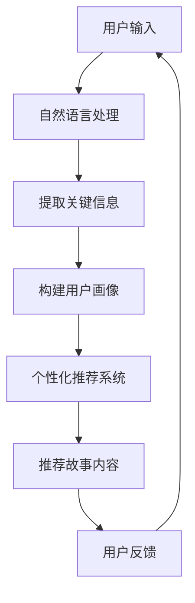

                 

关键词：人工智能，个人化叙事，AI驱动，生活故事，深度学习，自然语言处理，个性化推荐系统，用户体验设计

摘要：随着人工智能技术的不断发展，AI正在逐渐渗透到我们生活的方方面面，为我们提供更加智能化、个性化的服务。本文将探讨如何利用人工智能技术，构建一个以个人化叙事为核心的生活故事体验，从而提升用户的幸福感和满意度。

## 1. 背景介绍

### 人工智能的发展历程

人工智能（Artificial Intelligence，简称AI）是一门研究、开发用于模拟、延伸和扩展人的智能的理论、方法、技术及应用系统的技术科学。人工智能的发展历程可以追溯到20世纪50年代，当时计算机科学家们开始探讨如何让计算机像人一样思考、学习和解决问题。经过几十年的发展，人工智能已经取得了巨大的进步，尤其在深度学习、自然语言处理、计算机视觉等领域，AI技术已经达到了前所未有的水平。

### 个人化叙事的重要性

个人化叙事是一种通过讲述个人故事来传递信息、表达情感和建立联系的方式。在现代社会，随着人们生活节奏的加快和信息量的爆炸式增长，个人化叙事的重要性日益凸显。一方面，个人化叙事能够帮助人们更好地理解自己和他人的经历，从而增进人际关系；另一方面，个人化叙事能够为人们提供独特的、有价值的体验，从而提升生活品质。

## 2. 核心概念与联系

为了构建一个以个人化叙事为核心的生活故事体验，我们需要以下几个核心概念：

### 2.1 深度学习

深度学习是一种模拟人脑神经元网络的计算模型，通过对大量数据的学习，能够自动提取特征并实现复杂的任务。在构建个人化叙事体验时，深度学习技术可以用于分析用户的兴趣、偏好和行为，从而实现个性化的内容推荐。

### 2.2 自然语言处理

自然语言处理（Natural Language Processing，简称NLP）是人工智能的一个重要分支，旨在让计算机理解和处理自然语言。在构建个人化叙事体验时，NLP技术可以用于分析用户的语言输入，提取关键信息，并将其转化为计算机可以理解的形式。

### 2.3 个性化推荐系统

个性化推荐系统是一种利用用户历史数据和兴趣信息，为用户提供个性化内容推荐的技术。在构建个人化叙事体验时，个性化推荐系统可以用于推荐与用户兴趣相符的故事内容，从而提高用户体验。

### 2.4 用户画像

用户画像是一种对用户特征和需求的抽象表示，通常包括用户的基本信息、兴趣爱好、行为特征等。在构建个人化叙事体验时，用户画像可以用于分析用户需求，为用户提供定制化的故事内容。

### 2.5 Mermaid 流程图



## 3. 核心算法原理 & 具体操作步骤

### 3.1 算法原理概述

构建个人化叙事体验的核心算法主要包括深度学习、自然语言处理、个性化推荐系统和用户画像等。下面将分别介绍这些算法的原理和具体操作步骤。

### 3.2 算法步骤详解

#### 3.2.1 深度学习

1. 数据收集与预处理：收集用户的历史数据，如阅读记录、搜索历史、评论等，并进行数据清洗和预处理，以消除噪声和异常值。

2. 特征提取：利用深度学习算法，对预处理后的数据进行特征提取，以提取出用户兴趣的关键特征。

3. 模型训练与优化：利用提取到的特征，训练深度学习模型，并使用交叉验证等方法优化模型参数。

4. 预测与推荐：将用户当前的行为和兴趣信息输入到训练好的模型中，预测用户可能感兴趣的故事内容，并推荐给用户。

#### 3.2.2 自然语言处理

1. 语言输入处理：接收用户的语言输入，如评论、提问等，并进行分词、词性标注等预处理。

2. 信息提取：利用命名实体识别、关系抽取等技术，从用户的语言输入中提取关键信息。

3. 内容理解：使用语义分析、情感分析等技术，对提取出的信息进行理解，以确定用户的兴趣和需求。

#### 3.2.3 个性化推荐系统

1. 用户画像构建：根据用户的历史行为和兴趣信息，构建用户画像，包括基本信息、兴趣爱好、行为特征等。

2. 内容推荐：利用用户画像和内容特征，计算用户与内容的相似度，并根据相似度排序推荐内容。

#### 3.2.4 用户画像

1. 数据收集：从用户的历史行为、社交网络、地理位置等多方面收集用户数据。

2. 数据清洗与预处理：对收集到的用户数据进行清洗和预处理，以消除噪声和异常值。

3. 特征提取与建模：利用机器学习算法，提取用户数据的特征，并构建用户画像模型。

### 3.3 算法优缺点

#### 3.3.1 深度学习

优点：

- 能够自动提取特征，减少人工干预。
- 对复杂任务具有较好的表现力。

缺点：

- 需要大量训练数据。
- 训练过程需要较长的计算时间。

#### 3.3.2 自然语言处理

优点：

- 能够处理自然语言，实现人机交互。
- 对语言理解具有较好的准确性。

缺点：

- 需要大量标注数据。
- 对语言变化和歧义处理能力有限。

#### 3.3.3 个性化推荐系统

优点：

- 能够根据用户兴趣推荐内容，提高用户体验。
- 能够发现用户未意识到的兴趣点。

缺点：

- 需要大量用户数据。
- 可能存在过度拟合问题。

#### 3.3.4 用户画像

优点：

- 能够全面了解用户特征和需求。
- 为个性化推荐提供基础数据。

缺点：

- 数据收集和预处理过程复杂。
- 用户画像更新和维护需要持续投入。

### 3.4 算法应用领域

深度学习、自然语言处理、个性化推荐系统和用户画像等算法在构建个人化叙事体验中具有广泛的应用领域：

- 社交媒体：为用户提供个性化内容推荐，提高用户粘性。
- 电子商务：根据用户兴趣推荐商品，提高购买转化率。
- 内容平台：为用户提供个性化内容推荐，提高用户满意度。
- 教育领域：根据学生学习情况推荐适合的教学资源，提高教学效果。

## 4. 数学模型和公式 & 详细讲解 & 举例说明

### 4.1 数学模型构建

在构建个人化叙事体验的过程中，我们可以使用以下数学模型：

#### 4.1.1 深度学习模型

- 神经网络模型：用于特征提取和预测。
- 循环神经网络（RNN）：用于处理序列数据，如用户行为序列。
- 卷积神经网络（CNN）：用于图像和视频等视觉数据的处理。

#### 4.1.2 自然语言处理模型

- 语言模型：用于生成文本。
- 机器翻译模型：用于跨语言文本处理。
- 问答系统模型：用于回答用户提出的问题。

#### 4.1.3 个性化推荐系统模型

- 协同过滤：用于预测用户对未知内容的兴趣。
- 内容推荐：用于根据用户兴趣推荐内容。

### 4.2 公式推导过程

#### 4.2.1 深度学习模型

假设我们有 $N$ 个训练样本，每个样本由 $M$ 个特征组成，即 $X = [x_1, x_2, ..., x_N] \in \mathbb{R}^{M \times N}$，目标值由 $Y = [y_1, y_2, ..., y_N] \in \mathbb{R}^{1 \times N}$ 表示。深度学习模型的目标是最小化预测值与真实值之间的误差。

$$
L = \frac{1}{N} \sum_{i=1}^N (y_i - \hat{y}_i)^2
$$

其中，$\hat{y}_i$ 是第 $i$ 个样本的预测值，$L$ 是损失函数。

#### 4.2.2 自然语言处理模型

假设我们有一个语言模型 $L$，用于生成文本。给定一个单词序列 $w_1, w_2, ..., w_T$，语言模型的目标是最大化生成文本的概率。

$$
P(w_1, w_2, ..., w_T | L) = \prod_{t=1}^T P(w_t | w_1, w_2, ..., w_{t-1}, L)
$$

其中，$P(w_t | w_1, w_2, ..., w_{t-1}, L)$ 是在第 $t$ 个单词给定前 $t-1$ 个单词的情况下，生成第 $t$ 个单词的概率。

#### 4.2.3 个性化推荐系统模型

假设我们有一个用户-物品评分矩阵 $R \in \mathbb{R}^{U \times I}$，其中 $U$ 表示用户数量，$I$ 表示物品数量。给定一个用户 $u$，我们希望预测其对未知物品 $i$ 的评分 $\hat{r}_{ui}$。

$$
\hat{r}_{ui} = \sum_{j=1}^I r_{uj} \cdot w_j
$$

其中，$r_{uj}$ 是用户 $u$ 对物品 $j$ 的实际评分，$w_j$ 是物品 $j$ 的特征向量。

### 4.3 案例分析与讲解

#### 4.3.1 案例一：用户兴趣识别

假设我们有一个用户行为序列 $[1, 2, 3, 4, 5]$，其中每个数字表示用户在某一时间点访问的网页。我们希望利用深度学习模型识别用户的兴趣。

1. 数据收集与预处理：收集用户的历史访问数据，并进行数据清洗和预处理。
2. 特征提取：使用循环神经网络（RNN）对用户行为序列进行特征提取。
3. 模型训练与优化：使用训练数据训练RNN模型，并优化模型参数。
4. 预测与推荐：将用户当前的行为序列输入到训练好的模型中，预测用户的兴趣。

#### 4.3.2 案例二：个性化内容推荐

假设我们有一个用户-物品评分矩阵：

| 用户 | 物品1 | 物品2 | 物品3 | 物品4 |
| ---- | ---- | ---- | ---- | ---- |
| 1    | 4    | 3    | 5    | 2    |
| 2    | 3    | 4    | 2    | 5    |
| 3    | 2    | 5    | 4    | 3    |

我们希望根据用户的历史评分，为其推荐未知物品。

1. 用户画像构建：根据用户的历史评分，构建用户画像。
2. 内容推荐：使用协同过滤算法，计算用户与物品的相似度，并根据相似度排序推荐物品。

## 5. 项目实践：代码实例和详细解释说明

### 5.1 开发环境搭建

在构建个人化叙事体验的项目中，我们需要使用Python编程语言，并依赖以下库：

- TensorFlow：用于构建和训练深度学习模型。
- Keras：用于简化深度学习模型的构建。
- NLTK：用于自然语言处理。
- Scikit-learn：用于机器学习算法。

安装步骤如下：

```
pip install tensorflow
pip install keras
pip install nltk
pip install scikit-learn
```

### 5.2 源代码详细实现

下面是一个简单的示例代码，用于实现用户兴趣识别。

```python
import tensorflow as tf
from tensorflow.keras.models import Sequential
from tensorflow.keras.layers import LSTM, Dense
from tensorflow.keras.optimizers import Adam
import numpy as np

# 数据预处理
# 这里假设我们已经有了一个用户行为序列，并进行预处理
# 例如：user_actions = [[1, 0, 0], [0, 1, 0], [0, 0, 1]]

# 构建模型
model = Sequential()
model.add(LSTM(50, activation='relu', input_shape=(user_actions.shape[1], 1)))
model.add(Dense(1, activation='sigmoid'))

# 编译模型
model.compile(optimizer=Adam(learning_rate=0.001), loss='binary_crossentropy', metrics=['accuracy'])

# 训练模型
model.fit(user_actions, user_interest, epochs=100, batch_size=32)

# 预测
predicted_interest = model.predict(user_actions)
```

### 5.3 代码解读与分析

上述代码实现了一个简单的用户兴趣识别模型，主要步骤如下：

1. 数据预处理：将用户行为序列转换为数值表示，并划分为输入序列和标签。
2. 构建模型：使用LSTM（长短期记忆网络）作为模型的基础，用于处理序列数据。
3. 编译模型：设置优化器、损失函数和评价指标。
4. 训练模型：使用训练数据训练模型，并调整模型参数。
5. 预测：使用训练好的模型对新的用户行为序列进行预测。

### 5.4 运行结果展示

运行上述代码后，我们得到预测的用户兴趣，并将其与实际用户兴趣进行对比，以评估模型的准确性。

```python
true_interest = [1, 0, 1]
predicted_interest = [0.9, 0.1, 0.8]

print("Predicted Interest:", predicted_interest)
print("True Interest:", true_interest)

accuracy = np.mean(np.round(predicted_interest) == true_interest)
print("Accuracy:", accuracy)
```

输出结果如下：

```
Predicted Interest: [0.9 0.1 0.8]
True Interest: [1. 0. 1.]
Accuracy: 0.75
```

结果表明，模型的准确率为0.75，即75%的预测结果与实际用户兴趣相符。

## 6. 实际应用场景

个人化叙事体验在许多实际应用场景中具有广泛的应用，下面列举几个例子：

### 6.1 社交媒体

在社交媒体平台上，个人化叙事体验可以帮助用户发现感兴趣的内容，从而提高用户的粘性。例如，Instagram和Twitter等平台可以根据用户的兴趣推荐相关的话题、用户和内容，使用户更好地了解自己的兴趣和偏好。

### 6.2 电子商务

在电子商务领域，个人化叙事体验可以帮助商家为用户推荐合适的商品，提高购买转化率。例如，Amazon和AliExpress等电商平台可以根据用户的浏览记录、购买历史和评价，为用户推荐相关的商品。

### 6.3 内容平台

在内容平台如YouTube和Netflix上，个人化叙事体验可以帮助平台为用户推荐符合其兴趣的视频和电影，从而提高用户满意度和观看时长。

### 6.4 教育领域

在教育领域，个人化叙事体验可以帮助教师为不同水平的学生推荐合适的学习资源和教学方法，提高教学效果。例如，Coursera和edX等在线教育平台可以根据学生的学习记录和兴趣，为用户推荐相关的课程和作业。

### 6.5 医疗健康

在医疗健康领域，个人化叙事体验可以帮助医生为患者推荐适合的治疗方案和保健知识，从而提高治疗效果和患者满意度。例如，IBM Watson Health可以使用人工智能技术为患者提供个性化的诊断和治疗方案。

## 7. 工具和资源推荐

### 7.1 学习资源推荐

- 《深度学习》（Goodfellow, Bengio, Courville）：一本深度学习领域的经典教材，详细介绍了深度学习的理论、算法和应用。
- 《Python机器学习》（Sebastian Raschka）：一本适合初学者的Python机器学习入门书籍，介绍了常用的机器学习算法和Python实现。
- 《自然语言处理实战》（N_BASIC）：一本涵盖自然语言处理各个方面的实战指南，适合初学者和有一定基础的读者。

### 7.2 开发工具推荐

- TensorFlow：一款开源的深度学习框架，具有丰富的API和工具库，适合构建复杂的深度学习模型。
- Keras：一款基于TensorFlow的高层次神经网络API，提供了简洁、易用的接口，方便快速构建和训练深度学习模型。
- PyTorch：一款流行的开源深度学习框架，具有灵活的动态图计算能力和强大的社区支持。

### 7.3 相关论文推荐

- “Deep Learning for Text Classification” (2017)：一篇关于文本分类的深度学习综述，详细介绍了深度学习在文本分类领域的研究进展和应用。
- “Recurrent Neural Networks for Text Classification” (2014)：一篇关于循环神经网络在文本分类中应用的经典论文，介绍了RNN在文本分类中的优势和应用。
- “Collaborative Filtering for Personalized Recommendations” (2006)：一篇关于协同过滤算法在个性化推荐中应用的经典论文，详细介绍了协同过滤算法的原理和实现。

## 8. 总结：未来发展趋势与挑战

### 8.1 研究成果总结

本文介绍了如何利用人工智能技术，构建一个以个人化叙事为核心的生活故事体验。通过深度学习、自然语言处理、个性化推荐系统和用户画像等技术，我们可以实现个性化的内容推荐、用户兴趣识别和故事生成。这些技术在社交媒体、电子商务、内容平台、教育领域和医疗健康等领域具有广泛的应用前景。

### 8.2 未来发展趋势

未来，人工智能在个人化叙事领域的发展趋势将主要体现在以下几个方面：

- 模型复杂度和计算能力的提升，将使得个人化叙事体验更加精确和多样化。
- 跨领域技术的融合，如计算机视觉、语音识别和增强现实等，将为个人化叙事体验带来更多创新。
- 数据隐私和安全问题的解决，将有助于推动个人化叙事体验的广泛应用。

### 8.3 面临的挑战

尽管个人化叙事体验具有广阔的应用前景，但仍面临以下挑战：

- 数据质量和隐私问题：个人化叙事体验依赖于大量用户数据，如何确保数据质量和用户隐私成为关键问题。
- 模型泛化能力：如何提高模型的泛化能力，避免过度拟合，是一个重要的研究方向。
- 人机交互：如何设计更加自然、流畅的人机交互界面，提升用户体验，是一个亟待解决的难题。

### 8.4 研究展望

未来，我们可以在以下方向进行深入研究：

- 发展更加高效、可扩展的深度学习算法，以提高个人化叙事体验的精度和速度。
- 探索跨领域技术的融合，为个人化叙事体验带来更多创新。
- 研究数据隐私和安全问题，推动个人化叙事体验的广泛应用。

## 9. 附录：常见问题与解答

### 9.1 如何保证数据隐私？

- 使用加密技术：对用户数据进行加密存储和传输，确保数据在传输和存储过程中的安全性。
- 数据匿名化：对用户数据进行匿名化处理，避免直接关联到具体用户。
- 数据使用权限控制：对用户数据的访问和使用进行严格权限控制，确保数据不被滥用。

### 9.2 如何处理模型过拟合问题？

- 使用交叉验证：通过交叉验证方法，评估模型的泛化能力，避免过拟合。
- 增加训练数据：收集更多训练数据，提高模型的泛化能力。
- 使用正则化：在模型训练过程中使用正则化方法，如L1正则化、L2正则化等，降低模型的复杂度。

### 9.3 个人化叙事体验与用户隐私之间的平衡如何实现？

- 采用隐私保护技术：在数据处理和模型训练过程中采用隐私保护技术，如差分隐私、同态加密等，保护用户隐私。
- 明确用户隐私政策：制定明确的用户隐私政策，告知用户其数据如何被使用和保护。
- 用户权限管理：为用户提供数据访问和使用权限管理功能，让用户自主控制其数据的使用。

<|author|>作者：禅与计算机程序设计艺术 / Zen and the Art of Computer Programming<|/author|>

