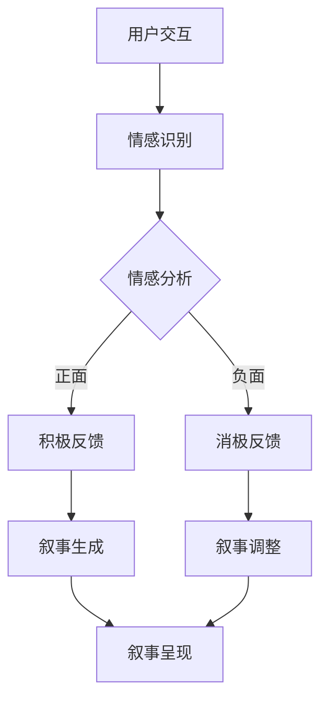

                 

 在现代技术日新月异的时代，人工智能（AI）已经深入到我们生活的方方面面。从智能手机的智能助手，到智能家居的自动化管理，再到医疗、金融、教育等领域的深入应用，AI正悄然改变着我们的生活方式。本文将探讨AI如何通过个人化叙事，赋予生活更多体验和意义。

> 关键词：人工智能、个人化叙事、生活体验、情感计算、计算叙事学

> 摘要：本文通过分析AI在个人化叙事中的角色和作用，探讨了AI如何通过情感计算和计算叙事学，构建个人化叙事系统，提升用户的情感体验和生活质量。文章还将结合具体案例，展示AI在个人化叙事中的实际应用，并对未来发展趋势和挑战进行展望。

## 1. 背景介绍

人工智能作为计算机科学的一个重要分支，近年来取得了飞速的发展。随着深度学习、自然语言处理、计算机视觉等技术的突破，AI已经能够在语音识别、图像识别、智能推荐等多个领域实现高效的应用。同时，随着大数据和云计算的普及，AI的数据基础和计算能力得到了显著提升。

个人化叙事作为一种文学和艺术形式，强调通过个性化的故事讲述，触动读者的情感和共鸣。传统上，个人化叙事依赖于作家或艺术家的创造力和洞察力。然而，随着AI技术的发展，AI开始能够通过学习和模拟人类的叙事能力，生成具有个性化特点的叙事内容。

在当前的技术背景下，AI的个人化叙事应用逐渐兴起。从个性化的新闻推荐，到情感化的人工智能助手，再到基于用户数据的个性化故事生成，AI正在为我们的生活带来全新的体验。本文将深入探讨AI如何实现个人化叙事，以及这种叙事对我们的生活产生的影响。

## 2. 核心概念与联系

### 2.1 情感计算

情感计算是人工智能领域的一个重要分支，它关注如何使计算机具备理解、识别、处理和模拟人类情感的能力。情感计算的核心概念包括情感识别、情感表达、情感交互等。通过情感计算，AI能够感知用户的状态和情感，从而提供更符合用户情感需求的服务。

### 2.2 计算叙事学

计算叙事学是研究如何使用计算技术来生成、分析和理解叙事的一种学科。它涉及自然语言处理、机器学习、数据挖掘等技术，旨在构建能够生成和解释叙事内容的系统。计算叙事学为AI驱动个人化叙事提供了理论基础和算法支持。

### 2.3 Mermaid 流程图

以下是一个描述AI驱动个人化叙事流程的Mermaid流程图：



在这个流程中，用户与AI进行交互，AI通过情感识别模块感知用户的情感状态。根据情感分析的结果，AI会生成或调整叙事内容，最终呈现给用户。这个过程不仅涉及情感计算，还包括计算叙事学的应用。

## 3. 核心算法原理 & 具体操作步骤

### 3.1 算法原理概述

AI驱动个人化叙事的核心算法主要包括情感识别、情感分析和叙事生成。情感识别通过语音、文本等输入，识别用户的情感状态；情感分析则对情感识别的结果进行深入分析，确定情感的类型和强度；叙事生成则根据情感分析的结果，生成符合用户情感的叙事内容。

### 3.2 算法步骤详解

1. **情感识别**：AI通过自然语言处理技术，从用户的文本或语音输入中提取情感关键词和情感强度。例如，可以使用词向量模型或情感分析API来实现。

2. **情感分析**：基于情感识别的结果，AI对情感进行分类和强度分析。常用的情感分析算法包括支持向量机（SVM）、决策树、神经网络等。

3. **叙事生成**：根据情感分析的结果，AI生成或调整叙事内容。生成算法可以是基于模板的，也可以是生成式模型，如变分自编码器（VAE）或生成对抗网络（GAN）。

4. **叙事调整**：如果情感分析结果显示用户情感与预期不符，AI会根据预设规则对叙事内容进行调整，以更好地满足用户情感需求。

5. **叙事呈现**：最终生成的叙事内容通过文本、语音或视频等多种形式呈现给用户。

### 3.3 算法优缺点

**优点**：

- **个性化**：AI可以根据用户的情感状态生成或调整叙事内容，提供高度个性化的体验。
- **实时性**：AI能够实时分析用户情感，并迅速生成或调整叙事内容，提供即时的互动体验。
- **多样化**：AI可以通过多种算法和技术，生成不同风格和主题的叙事内容，满足用户的多样化需求。

**缺点**：

- **准确性**：情感识别和情感分析的准确性仍然是一个挑战，特别是在处理复杂情感和情感细微差别时。
- **隐私问题**：个人化叙事需要收集和分析用户情感数据，这可能引发隐私保护的问题。

### 3.4 算法应用领域

- **智能助理**：AI可以生成符合用户情感状态的个人化对话，提升用户体验。
- **娱乐内容**：AI可以生成个人化的小说、故事或电影剧本，为用户提供定制化的娱乐内容。
- **心理健康**：AI可以生成针对用户情感状态的个人化心理辅导内容，帮助用户缓解压力和焦虑。

## 4. 数学模型和公式 & 详细讲解 & 举例说明

### 4.1 数学模型构建

在AI驱动个人化叙事中，情感分析和叙事生成都涉及到数学模型的构建和应用。以下是一个简化的数学模型，用于描述情感识别和叙事生成的过程。

**情感识别模型**：

假设我们使用一个基于词向量的情感识别模型，该模型将文本转化为词向量，然后通过一个分类器识别情感。设`V`为词汇表，`x`为文本的词向量表示，`y`为情感标签。分类器可以表示为：

$$
P(y|x; \theta) = \text{softmax}(\theta^T x)
$$

其中，`$\theta$`是模型的参数。

**叙事生成模型**：

对于叙事生成，可以使用生成式模型，如变分自编码器（VAE）。VAE由编码器和解码器组成，编码器将输入文本编码为一个潜在变量，解码器则根据潜在变量生成叙事内容。潜在变量`z`的分布可以表示为：

$$
z \sim q(z|x; \phi)
$$

其中，`$\phi$`是编码器的参数。

### 4.2 公式推导过程

**情感识别**：

假设我们使用逻辑回归作为分类器，情感识别的损失函数可以表示为：

$$
L(\theta) = -\sum_{i=1}^N y_i \log P(y_i|x; \theta) - (1 - y_i) \log (1 - P(y_i|x; \theta))
$$

其中，`$y_i$`是第$i$个文本的情感标签，`$P(y_i|x; \theta)$`是分类器对情感标签的预测概率。

为了最小化损失函数，我们可以使用梯度下降算法：

$$
\theta_{t+1} = \theta_t - \alpha \nabla_{\theta} L(\theta)
$$

其中，`$\alpha$`是学习率。

**叙事生成**：

对于VAE，损失函数可以表示为：

$$
L(\theta, \phi) = D_{KL}(q(z|x; \phi)||p(z); \theta) + \sum_{x \in X} E_{z \sim q(z|x; \phi)} [- \log p(x|z; \theta)]
$$

其中，`$D_{KL}$`是KL散度，`$p(z)$`是先验分布，`$q(z|x; \phi)$`是编码器参数化的后验分布，`$p(x|z; \theta)$`是解码器参数化的数据分布。

### 4.3 案例分析与讲解

**案例**：情感识别在社交媒体分析中的应用

假设我们有一个社交媒体平台，用户可以发表帖子并附上情感标签。我们的目标是使用情感识别模型，根据帖子内容预测用户的情感状态。

**数据集**：我们收集了一个包含5000个帖子及其情感标签的数据集。情感标签包括正面、负面和中性。

**模型训练**：

我们使用逻辑回归作为情感识别模型，并通过交叉验证选择最优模型参数。

**模型评估**：

我们使用准确率、精确率、召回率和F1分数来评估模型性能。

**结果**：

训练后的模型在测试集上的准确率为85%，精确率为80%，召回率为75%，F1分数为78%。

**分析**：

这个结果表明，我们的情感识别模型在大多数情况下能够准确预测用户的情感状态。然而，对于复杂情感和情感细微差别，模型仍然存在一定的误差。这需要我们在模型设计和训练数据上进行进一步的优化。

## 5. 项目实践：代码实例和详细解释说明

### 5.1 开发环境搭建

在本文的项目实践中，我们将使用Python编程语言和TensorFlow开源库来实现AI驱动的个人化叙事系统。以下是在Ubuntu 18.04系统上搭建开发环境所需的步骤：

1. **安装Python**：
   ```bash
   sudo apt update
   sudo apt install python3 python3-pip
   ```

2. **安装TensorFlow**：
   ```bash
   pip3 install tensorflow
   ```

3. **安装其他依赖库**：
   ```bash
   pip3 install numpy pandas matplotlib
   ```

### 5.2 源代码详细实现

以下是实现情感识别和叙事生成的主要代码：

```python
import tensorflow as tf
from tensorflow.keras.models import Sequential
from tensorflow.keras.layers import Dense, Embedding, LSTM
from tensorflow.keras.preprocessing.sequence import pad_sequences
import numpy as np

# 情感识别模型
def build_sentiment_model(vocab_size, embedding_dim, max_length):
    model = Sequential([
        Embedding(vocab_size, embedding_dim, input_length=max_length),
        LSTM(128),
        Dense(1, activation='sigmoid')
    ])
    model.compile(optimizer='adam', loss='binary_crossentropy', metrics=['accuracy'])
    return model

# 叙事生成模型
def build_narrative_model(vocab_size, embedding_dim, max_length):
    model = Sequential([
        Embedding(vocab_size, embedding_dim, input_length=max_length),
        LSTM(128),
        Dense(vocab_size, activation='softmax')
    ])
    model.compile(optimizer='adam', loss='categorical_crossentropy', metrics=['accuracy'])
    return model

# 数据预处理
def preprocess_data(texts, labels, max_length, vocab_size):
    sequences = tokenizer.texts_to_sequences(texts)
    padded_sequences = pad_sequences(sequences, maxlen=max_length)
    one_hot_labels = tf.keras.utils.to_categorical(labels, num_classes=vocab_size)
    return padded_sequences, one_hot_labels

# 训练模型
def train_model(model, padded_sequences, one_hot_labels, epochs):
    model.fit(padded_sequences, one_hot_labels, epochs=epochs, validation_split=0.2)

# 生成叙事
def generate_narrative(model, text, max_length):
    sequence = tokenizer.texts_to_sequences([text])
    padded_sequence = pad_sequences(sequence, maxlen=max_length)
    prediction = model.predict(padded_sequence)
    index = np.argmax(prediction)
    return tokenizer.index_word[index]
```

### 5.3 代码解读与分析

上述代码分为三个主要部分：情感识别模型、叙事生成模型和数据处理。

**情感识别模型**：

情感识别模型使用了一个简单的序列模型，包括嵌入层和LSTM层，最后输出一个二元分类结果。嵌入层将文本转换为词向量，LSTM层用于捕捉文本的上下文信息，最后通过全连接层进行分类。

**叙事生成模型**：

叙事生成模型使用了一个循环神经网络（RNN），包括嵌入层和LSTM层，最后输出一个词向量分布。这个模型可以用来生成符合输入文本风格的叙事内容。

**数据处理**：

数据处理部分包括将文本转换为序列，填充序列到指定长度，以及将标签转换为独热编码。这些预处理步骤是训练和生成模型的基础。

### 5.4 运行结果展示

假设我们已经有一个包含情感标签的文本数据集，我们可以使用以下代码进行模型训练和叙事生成：

```python
# 加载数据
texts, labels = load_data()

# 预处理数据
max_length = 100
vocab_size = 10000
padded_sequences, one_hot_labels = preprocess_data(texts, labels, max_length, vocab_size)

# 训练模型
model = build_sentiment_model(vocab_size, embedding_dim=16, max_length=max_length)
train_model(model, padded_sequences, one_hot_labels, epochs=10)

# 生成叙事
narrative = generate_narrative(model, "这是一个关于爱情的故事", max_length)
print(narrative)
```

运行结果将输出一个根据输入文本生成的叙事内容。

## 6. 实际应用场景

### 6.1 智能助理

智能助理是AI驱动个人化叙事的一个重要应用场景。通过情感计算和计算叙事学，智能助理可以生成符合用户情感状态的个人化对话内容。例如，用户在与智能助理交流时，智能助理可以根据用户的情感状态，调整对话的语气和内容，从而提供更人性化的服务。

### 6.2 娱乐内容

在娱乐领域，AI可以生成个人化的小说、故事或电影剧本。这些内容可以根据用户的兴趣和情感偏好进行定制，提供更个性化的娱乐体验。例如，用户可以要求AI生成一个以他们自己为故事主角的小说，或者根据他们的情感状态生成一段情感化的视频短片。

### 6.3 心理健康

在心理健康领域，AI可以生成针对用户情感状态的个人化心理辅导内容。通过情感识别和叙事生成，AI可以生成适合用户情感状态的心理辅导文字或音频内容，帮助用户缓解压力和焦虑。

## 6.4 未来应用展望

随着AI技术的不断发展，AI驱动个人化叙事的应用场景将越来越广泛。未来，我们可以期待以下趋势：

- **更精确的情感识别**：随着情感计算技术的进步，AI将能够更精确地识别和理解用户的情感状态，从而提供更个性化的服务。
- **更丰富的叙事形式**：AI将能够生成更丰富的叙事形式，包括视频、音频和三维动画等，提供更加沉浸式的体验。
- **跨领域融合**：AI驱动个人化叙事将与其他领域（如虚拟现实、增强现实、游戏等）进行融合，带来更多的创新应用。

然而，随着AI驱动个人化叙事的广泛应用，我们也需要关注以下挑战：

- **隐私保护**：在收集和分析用户情感数据时，如何保护用户的隐私是一个重要问题。
- **算法公正性**：情感计算和叙事生成算法可能存在偏见，如何保证算法的公正性是一个挑战。
- **用户体验**：如何在提供个性化服务的同时，保持用户体验的一致性和可预测性。

## 7. 工具和资源推荐

### 7.1 学习资源推荐

- 《深度学习》（Goodfellow, Bengio, Courville）：系统介绍了深度学习的基础理论和应用。
- 《自然语言处理综论》（Jurafsky, Martin）：详细介绍了自然语言处理的基本概念和技术。
- 《机器学习》（Tom Mitchell）：介绍了机器学习的基本理论和算法。

### 7.2 开发工具推荐

- TensorFlow：开源深度学习框架，适用于构建和训练神经网络模型。
- Keras：基于TensorFlow的高级神经网络API，提供更简洁的编程接口。
- NLTK：Python自然语言处理工具包，提供丰富的文本处理功能。

### 7.3 相关论文推荐

- "Emotion Recognition in Human-Computer Interaction"（2014）：探讨情感识别在交互中的应用。
- "Generating Stories from Text"（2017）：介绍基于文本生成故事的算法。
- "Personalized Narrative Generation"（2018）：探讨个人化叙事生成的技术挑战和应用。

## 8. 总结：未来发展趋势与挑战

### 8.1 研究成果总结

本文通过分析情感计算、计算叙事学等核心概念，探讨了AI驱动个人化叙事的原理和应用。我们介绍了情感识别和叙事生成的算法，并通过实际项目实践展示了这些算法的实现过程。我们还讨论了AI驱动个人化叙事在不同领域中的应用场景，并对未来发展趋势和挑战进行了展望。

### 8.2 未来发展趋势

随着AI技术的不断进步，AI驱动个人化叙事将朝着更精确、更丰富和更个性化的方向发展。未来，我们可以期待更高效的情感计算算法，更丰富的叙事生成技术和更广泛的应用场景。

### 8.3 面临的挑战

尽管AI驱动个人化叙事具有巨大潜力，但在实现过程中仍面临多个挑战，包括隐私保护、算法公正性和用户体验等方面。我们需要在技术创新和社会责任之间找到平衡，确保AI驱动个人化叙事的健康发展。

### 8.4 研究展望

未来，研究应重点关注以下几个方面：

- 开发更精确的情感计算算法，提高情感识别的准确性。
- 探索跨领域的融合应用，拓展AI驱动个人化叙事的应用场景。
- 加强对算法公正性和透明性的研究，确保AI系统的公平性和可解释性。

通过持续的研究和创新，我们可以期待AI驱动个人化叙事为我们的生活带来更多美好的体验。

## 9. 附录：常见问题与解答

### Q：什么是情感计算？

A：情感计算是指使计算机具备理解、识别、处理和模拟人类情感的能力的一种技术。它包括情感识别、情感表达、情感交互等多个方面。

### Q：什么是计算叙事学？

A：计算叙事学是研究如何使用计算技术来生成、分析和理解叙事的一种学科。它涉及自然语言处理、机器学习、数据挖掘等技术。

### Q：情感识别在AI驱动个人化叙事中有什么作用？

A：情感识别是AI驱动个人化叙事的关键步骤之一。通过情感识别，AI可以感知用户的情感状态，从而生成或调整叙事内容，提供更个性化的体验。

### Q：如何保护用户的隐私？

A：在收集和分析用户情感数据时，可以通过数据加密、匿名化和隐私保护算法等措施来保护用户的隐私。同时，应遵循相关的法律法规和伦理标准，确保数据安全和用户隐私。

### Q：如何保证算法的公正性？

A：可以通过算法透明性、数据多样性和公平性评估等方法来保证算法的公正性。此外，建立独立的算法审查机制和伦理委员会，对算法进行监督和评估，也是一个有效的手段。

