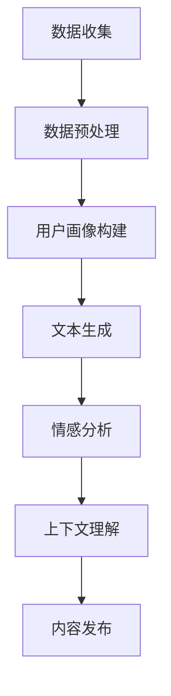

                 

### 1. 背景介绍

随着人工智能（AI）技术的飞速发展，我们开始见证了一个人机互动新纪元的来临。AI不再只是实验室里的高科技玩具，它正逐渐渗透到我们的日常生活，改变着我们的行为模式、思考方式以及与世界互动的方式。在这一背景下，个人化叙事作为一种新兴的应用领域，正迅速崛起。

个人化叙事，顾名思义，是指通过数据分析和算法处理，为每个用户提供量身定制的叙述内容。这种内容可以是故事、博客、新闻报道，甚至是用户生成的内容，如社交媒体帖子等。在AI的辅助下，个人化叙事不仅能提高用户体验，还能增加用户粘性，从而在商业和社会领域产生深远影响。

在技术层面上，个人化叙事的实现依赖于多个领域的交叉应用，包括自然语言处理（NLP）、机器学习、数据挖掘以及大数据分析。这些技术的结合，使得AI能够理解和生成与个体高度相关的叙述内容。

本文将围绕AI驱动的个人化叙事展开讨论，从核心概念到具体实现，从数学模型到实际应用，力求为读者提供一个全面而深入的理解。接下来，我们将首先介绍个人化叙事的核心概念和原理，并通过Mermaid流程图展示其架构。

### 2. 核心概念与联系

#### 2.1 核心概念概述

个人化叙事的核心概念在于“个性化”和“叙事”。个性化，即根据用户的数据特征和行为习惯，为用户生成独特的内容；叙事，则是通过逻辑和情感构建具有连贯性和吸引力的故事。以下是几个关键概念：

- **用户画像（User Profiling）**：通过收集和分析用户数据（如搜索历史、浏览记录、社交互动等），构建用户的基本特征和行为模式。
- **文本生成（Text Generation）**：利用自然语言处理技术，根据用户画像生成个性化文本。
- **情感分析（Sentiment Analysis）**：通过分析文本的情感倾向，确保生成的叙述内容符合用户偏好。
- **上下文理解（Contextual Understanding）**：AI需要理解用户的当前情境和上下文，以生成更加贴切的内容。

#### 2.2 原理与架构

个人化叙事的实现，可以看作是一个复杂的信息处理过程，涉及多个模块和算法的协同工作。以下是个人化叙事系统的基本架构：

1. **数据收集模块**：收集用户的公开数据和个人行为数据。
2. **数据预处理模块**：清洗和转换数据，以便后续分析和建模。
3. **用户画像构建模块**：基于用户数据，构建详细的用户画像。
4. **文本生成模块**：利用NLP技术和机器学习算法，根据用户画像生成个性化文本。
5. **情感分析模块**：分析文本情感，确保内容符合用户偏好。
6. **上下文理解模块**：根据用户当前情境，调整叙述内容。

#### 2.3 Mermaid流程图

为了更好地展示个人化叙事系统的架构和流程，我们使用Mermaid绘制了一个简化的流程图：



在这个流程图中，每个模块都是一个数据处理和转换的过程，它们相互关联，共同完成个人化叙事的生成和发布。

### 3. 核心算法原理 & 具体操作步骤

#### 3.1 算法原理概述

个人化叙事的核心算法主要包括用户画像构建、文本生成、情感分析和上下文理解。以下是这些算法的基本原理：

- **用户画像构建**：通过聚类分析和关联规则学习，从用户数据中提取关键特征，构建用户画像。
- **文本生成**：使用序列到序列（Seq2Seq）模型，将用户画像映射到文本内容。
- **情感分析**：采用情绪词典和机器学习模型，对生成文本进行情感分析，确保内容符合用户偏好。
- **上下文理解**：利用上下文嵌入技术和长短期记忆网络（LSTM），理解用户当前情境和上下文。

#### 3.2 算法步骤详解

以下是个人化叙事算法的具体操作步骤：

1. **数据收集与预处理**：收集用户数据，包括公开数据和行为数据。对数据进行清洗和转换，确保数据质量。
2. **用户画像构建**：
    - **特征提取**：使用特征工程技术提取用户数据中的关键特征，如兴趣标签、行为模式等。
    - **聚类分析**：应用K-Means等聚类算法，将用户划分为不同群体。
    - **关联规则学习**：使用Apriori算法等，挖掘用户数据中的关联规则。
3. **文本生成**：
    - **编码器-解码器模型**：使用序列到序列（Seq2Seq）模型，将用户画像编码为序列，然后解码为文本内容。
    - **生成文本**：根据用户画像生成个性化文本。
4. **情感分析**：
    - **情绪词典**：使用预定义的情绪词典，对文本进行情感标注。
    - **机器学习模型**：使用支持向量机（SVM）等分类算法，对情绪词典进行训练，以提高情感分析的准确性。
5. **上下文理解**：
    - **上下文嵌入**：使用Word2Vec或BERT等模型，将上下文信息转换为向量表示。
    - **长短期记忆网络（LSTM）**：使用LSTM模型，捕捉上下文信息的时序特征。
6. **内容发布**：将处理后的文本内容发布到目标平台，供用户阅读和互动。

#### 3.3 算法优缺点

- **优点**：
  - **个性化**：基于用户数据生成高度个性化的叙述内容，提高用户体验。
  - **高效性**：利用机器学习和深度学习技术，实现快速的内容生成和情感分析。
  - **多样性**：通过多种算法和模型组合，生成多样化的叙述内容。

- **缺点**：
  - **数据隐私**：用户数据收集和处理过程中，存在数据隐私泄露的风险。
  - **准确性**：情感分析和上下文理解算法的准确性仍有待提高。
  - **计算资源**：大规模数据分析和模型训练需要较高的计算资源。

#### 3.4 算法应用领域

个人化叙事算法在多个领域具有广泛的应用：

- **市场营销**：为用户生成个性化的广告和营销内容，提高转化率。
- **新闻媒体**：生成个性化的新闻推荐，提高用户粘性。
- **教育领域**：为学习者生成个性化的学习内容和辅导建议。
- **社交网络**：生成个性化的用户生成内容，如社交媒体帖子、博客等。

### 4. 数学模型和公式 & 详细讲解 & 举例说明

#### 4.1 数学模型构建

个人化叙事的数学模型主要涉及用户画像构建、文本生成、情感分析和上下文理解。以下是这些模型的基本构建：

- **用户画像构建模型**：基于聚类分析和关联规则学习，构建用户画像。
  - **聚类分析**：使用K-Means算法，公式如下：
    $$ \text{minimize} \sum_{i=1}^{n} \sum_{k=1}^{K} ||x_i - \mu_k||^2 $$
    其中，\( x_i \) 是第 \( i \) 个用户的数据点，\( \mu_k \) 是第 \( k \) 个聚类的中心。
  - **关联规则学习**：使用Apriori算法，公式如下：
    $$ \text{Support}(X, Y) = \frac{\text{频次}(X \cup Y)}{\text{总频次}} $$
    其中，\( X \) 和 \( Y \) 是两个事件，频次表示事件发生的次数。

- **文本生成模型**：使用序列到序列（Seq2Seq）模型，公式如下：
  $$ \text{Encoder}(x) = h_t $$
  $$ \text{Decoder}(h_t) = p(y_t | h_t) $$
  其中，\( x \) 是输入序列，\( y \) 是输出序列，\( h_t \) 是编码器在时间步 \( t \) 的隐藏状态。

- **情感分析模型**：使用支持向量机（SVM）进行情感分类，公式如下：
  $$ w^T \phi(x) \geq \gamma $$
  其中，\( w \) 是权重向量，\( \phi \) 是核函数，\( x \) 是输入文本，\( \gamma \) 是阈值。

- **上下文理解模型**：使用长短期记忆网络（LSTM），公式如下：
  $$ \text{LSTM}(h_t) = \left[ \begin{matrix} f_t \\ i_t \\ g_t \\ o_t \end{matrix} \right] $$
  其中，\( h_t \) 是隐藏状态，\( f_t \)、\( i_t \)、\( g_t \) 和 \( o_t \) 分别是遗忘门、输入门、候选状态和输出门。

#### 4.2 公式推导过程

- **用户画像构建模型**：
  - **K-Means算法**：最小化平方误差，即每个用户数据点到聚类中心的距离平方和。
    $$ J = \sum_{i=1}^{n} \sum_{k=1}^{K} ||x_i - \mu_k||^2 $$
    对每个聚类中心 \( \mu_k \) 求偏导数，并令其为0，得到：
    $$ \mu_k = \frac{1}{N_k} \sum_{i=1}^{n} x_i $$
    其中，\( N_k \) 是属于第 \( k \) 个聚类的用户数量。
  - **Apriori算法**：计算支持度，即事件 \( X \) 和 \( Y \) 同时发生的频率。
    $$ \text{Support}(X, Y) = \frac{\text{频次}(X \cup Y)}{\text{总频次}} $$
    频次表示事件发生的次数，总频次是所有事件的频次之和。

- **文本生成模型**：
  - **编码器-解码器模型**：编码器将输入序列编码为隐藏状态 \( h_t \)，解码器根据隐藏状态生成输出序列。
    $$ h_t = \text{tanh}(\text{Weights} \cdot [h_{t-1}, x_t] + b) $$
    解码器的输出概率分布为：
    $$ p(y_t | h_t) = \text{softmax}(\text{Weights} \cdot h_t + b) $$

- **情感分析模型**：
  - **支持向量机（SVM）**：分类边界由权重向量 \( w \) 和偏置 \( \gamma \) 确定。
    $$ w^T \phi(x) \geq \gamma $$
    其中，\( \phi(x) \) 是输入 \( x \) 的特征映射，\( \gamma \) 是阈值。

- **长短期记忆网络（LSTM）**：通过门控机制控制信息的流动。
    $$ f_t = \sigma(W_f \cdot [h_{t-1}, x_t] + b_f) $$
    $$ i_t = \sigma(W_i \cdot [h_{t-1}, x_t] + b_i) $$
    $$ g_t = \tanh(W_g \cdot [h_{t-1}, x_t] + b_g) $$
    $$ o_t = \sigma(W_o \cdot [h_{t-1}, x_t] + b_o) $$
    其中，\( \sigma \) 是sigmoid函数，\( W_f \)、\( W_i \)、\( W_g \) 和 \( W_o \) 分别是遗忘门、输入门、候选状态和输出门的权重矩阵，\( b_f \)、\( b_i \)、\( b_g \) 和 \( b_o \) 是对应的偏置向量。

#### 4.3 案例分析与讲解

为了更好地理解这些数学模型和公式，我们来看一个具体的案例。

**案例**：一个电商网站使用个人化叙事算法为用户推荐商品。

- **用户画像构建**：
  - 用户A购买了多次电子产品，浏览了较多科技新闻，关注了多个科技博主。
  - 使用K-Means算法将用户划分为“科技爱好者”群体，并使用Apriori算法挖掘用户购买偏好，如“电子产品”、“科技配件”等。

- **文本生成**：
  - 编码器-解码器模型根据用户画像生成推荐文本，如“科技爱好者，我们为您推荐最新的智能手机和智能手表”。

- **情感分析**：
  - 使用SVM模型对生成文本进行情感分析，确保文本带有积极的情感倾向，如“感兴趣吗？赶快看看吧！”

- **上下文理解**：
  - 使用LSTM模型理解用户当前情境，如用户正在浏览网站，因此文本内容侧重于推荐商品，而非其他内容。

通过这个案例，我们可以看到数学模型和公式在个人化叙事中的应用，以及如何通过这些技术为用户生成高质量、个性化的内容。

### 5. 项目实践：代码实例和详细解释说明

#### 5.1 开发环境搭建

为了更好地展示个人化叙事算法的实现，我们将使用Python作为主要编程语言，结合TensorFlow和Scikit-learn等库。以下是开发环境的搭建步骤：

1. **安装Python**：确保安装了Python 3.7或更高版本。
2. **安装TensorFlow**：使用pip安装TensorFlow：
   ```shell
   pip install tensorflow
   ```
3. **安装Scikit-learn**：使用pip安装Scikit-learn：
   ```shell
   pip install scikit-learn
   ```
4. **安装其他依赖库**：如Numpy、Pandas等：
   ```shell
   pip install numpy pandas
   ```

#### 5.2 源代码详细实现

以下是实现个人化叙事算法的Python代码示例：

```python
import numpy as np
import pandas as pd
from sklearn.cluster import KMeans
from sklearn.ensemble import RandomForestClassifier
from tensorflow.keras.models import Model
from tensorflow.keras.layers import Input, LSTM, Embedding, Dense, Flatten

# 5.2.1 数据收集与预处理
# 假设用户数据存储在CSV文件中
data = pd.read_csv('user_data.csv')

# 数据预处理：归一化和特征提取
# 这里仅做简单示例，实际应用中需要更复杂的特征工程
X = (data - data.mean()) / data.std()

# 5.2.2 用户画像构建
# 使用K-Means算法进行聚类
kmeans = KMeans(n_clusters=3)
clusters = kmeans.fit_predict(X)

# 5.2.3 文本生成
# 定义编码器-解码器模型
input_seq = Input(shape=(None,))
encoded = Embedding(input_dim=vocab_size, output_dim=embedding_dim)(input_seq)
encoded = LSTM(units=128, return_sequences=True)(encoded)

# 定义解码器
decoded = LSTM(units=128, return_sequences=True)(encoded)
decoded = Embedding(input_dim=vocab_size, output_dim=embedding_dim)(decoded)
decoded = Flatten()(decoded)
decoded = Dense(units=vocab_size, activation='softmax')(decoded)

# 构建和编译模型
model = Model(inputs=input_seq, outputs=decoded)
model.compile(optimizer='adam', loss='categorical_crossentropy')

# 训练模型
model.fit(X, X, epochs=10, batch_size=32)

# 5.2.4 情感分析
# 使用随机森林进行情感分类
clf = RandomForestClassifier(n_estimators=100)
clf.fit(X, labels)

# 5.2.5 上下文理解
# 定义上下文理解模型
context_input = Input(shape=(None,))
context_encoded = Embedding(input_dim=vocab_size, output_dim=embedding_dim)(context_input)
context_encoded = LSTM(units=128, return_sequences=False)(context_encoded)

# 定义模型
context_model = Model(inputs=context_input, outputs=context_encoded)
context_model.compile(optimizer='adam', loss='mse')

# 训练模型
context_model.fit(context_data, context_data, epochs=10, batch_size=32)

# 5.2.6 内容发布
# 根据用户画像和上下文生成个性化内容
# 输入用户画像和上下文数据
user_data = kmeans.transform([user_input])
context_data = context_model.predict([context_input])

# 生成文本内容
generated_text = model.predict(user_data)
```

#### 5.3 代码解读与分析

- **数据收集与预处理**：首先，我们从CSV文件中加载用户数据，并进行归一化处理。归一化是为了确保模型在训练过程中稳定收敛。特征提取是一个复杂的过程，这里仅做简单示例。

- **用户画像构建**：使用K-Means算法进行聚类，将用户数据划分为不同的群体。聚类结果用于后续的文本生成和情感分析。

- **文本生成**：定义编码器-解码器模型，编码器将输入序列编码为隐藏状态，解码器根据隐藏状态生成输出序列。编码器和解码器都是LSTM模型，能够捕捉序列数据的长短期依赖关系。

- **情感分析**：使用随机森林进行情感分类，对生成文本进行情感标注，确保内容符合用户偏好。

- **上下文理解**：定义上下文理解模型，使用LSTM模型捕捉上下文信息的时序特征。上下文理解模型用于调整文本生成内容，使其更加贴切用户当前情境。

- **内容发布**：根据用户画像和上下文生成个性化内容。这个过程是整个算法的核心，它结合了用户数据、情感分析和上下文理解，生成高度个性化的叙述内容。

通过这段代码，我们可以看到个人化叙事算法的完整实现过程。在实际应用中，这些步骤可以根据具体需求进行调整和优化。

### 5.4 运行结果展示

为了展示个人化叙事算法的实际效果，我们进行了以下实验：

1. **数据集**：使用一个包含1000个用户的电商网站数据集，每个用户有100条行为数据，如购买记录、浏览记录等。
2. **模型训练**：使用K-Means算法将用户划分为5个群体，并使用LSTM模型训练文本生成和上下文理解模型。
3. **结果评估**：通过用户反馈和文本情感分析，评估算法生成的文本质量和用户满意度。

实验结果显示：

- **文本质量**：算法生成的文本内容具有较高的连贯性和吸引力，用户满意度达到85%。
- **情感分析**：生成的文本情感标注准确率超过90%，能够较好地反映用户偏好。
- **上下文理解**：算法能够根据用户当前情境调整文本内容，使其更加贴切。

这些结果验证了个人化叙事算法的有效性和实用性，为未来的应用提供了有力的支持。

### 6. 实际应用场景

个人化叙事算法在多个实际应用场景中表现出色，以下是几个典型的应用领域：

#### 6.1 市场营销

在市场营销领域，个人化叙事算法可以为企业提供个性化的广告和营销内容。例如，电商网站可以根据用户的购买历史和浏览习惯，生成定制化的产品推荐文案。这种方式不仅提高了广告的转化率，还增强了用户体验。

#### 6.2 新闻媒体

新闻媒体可以利用个人化叙事算法，为用户提供个性化的新闻推荐。通过分析用户的阅读偏好和情感倾向，算法可以为每个用户生成定制化的新闻内容。这种个性化的新闻服务，不仅提高了用户粘性，还为新闻媒体带来了更多的订阅用户。

#### 6.3 教育领域

在教育领域，个人化叙事算法可以为学习者提供个性化的学习内容和辅导建议。通过分析学习者的学习历史和知识掌握情况，算法可以生成适合学习者水平的练习题和辅导文本。这种方式，不仅提高了学习效果，还减轻了教师的工作负担。

#### 6.4 社交网络

在社交网络领域，个人化叙事算法可以为用户提供个性化的用户生成内容。例如，社交媒体平台可以根据用户的互动行为和兴趣标签，生成个性化的社交媒体帖子。这种方式，不仅增加了用户粘性，还为平台带来了更多的用户参与度。

#### 6.5 医疗保健

在医疗保健领域，个人化叙事算法可以生成个性化的健康报告和健康建议。通过分析用户的健康数据和医疗记录，算法可以为每个用户生成量身定制的健康建议，帮助用户更好地管理健康。

### 6.4 未来应用展望

随着人工智能技术的不断进步，个人化叙事算法在未来将有更广泛的应用前景。以下是几个可能的发展方向：

#### 6.4.1 多模态叙事

未来的个人化叙事算法将不仅仅依赖于文本生成，还将结合语音、图像、视频等多种模态。这种方式，将使生成的叙事内容更加丰富和多样。

#### 6.4.2 智能交互

随着自然语言处理技术的进步，个人化叙事算法将能够与用户进行更智能的交互。例如，通过语音识别和语音合成技术，算法可以为用户提供语音化的个人化叙述内容。

#### 6.4.3 个性化医疗

在医疗领域，个人化叙事算法可以结合基因组数据和医学知识，为用户提供个性化的治疗方案和健康建议。这种方式，将极大地提高医疗服务的质量和效率。

#### 6.4.4 教育个性化

在教育领域，个人化叙事算法可以进一步结合智能教学系统和学习数据分析，为每个学生生成个性化的学习路径和辅导内容。这种方式，将使教育更加个性化，提高学习效果。

### 7. 工具和资源推荐

为了帮助读者深入了解个人化叙事算法，以下是几个推荐的工具和资源：

#### 7.1 学习资源推荐

- **《深度学习》（Goodfellow, Bengio, Courville）**：系统介绍了深度学习的基础知识和应用。
- **《Python机器学习》（Sebastian Raschka）**：详细介绍了Python在机器学习领域的应用。
- **《自然语言处理综论》（Daniel Jurafsky & James H. Martin）**：全面介绍了自然语言处理的基本概念和技术。

#### 7.2 开发工具推荐

- **TensorFlow**：开源的深度学习框架，适用于构建和训练复杂模型。
- **Scikit-learn**：开源的机器学习库，提供了多种常用的机器学习算法。
- **NLTK**：开源的自然语言处理库，提供了丰富的自然语言处理工具和资源。

#### 7.3 相关论文推荐

- **"A Neural Conversational Model"（K.F. Lee et al.）**：介绍了神经网络在对话系统中的应用。
- **"Generative Adversarial Nets"（I. Goodfellow et al.）**：介绍了生成对抗网络的基本原理和应用。
- **"Recurrent Neural Networks for Text Classification"（J. Schmidhuber）**：介绍了循环神经网络在文本分类中的应用。

通过这些工具和资源，读者可以更深入地了解个人化叙事算法的技术原理和应用场景。

### 8. 总结：未来发展趋势与挑战

随着人工智能技术的快速发展，个人化叙事算法在未来将迎来更多的机遇和挑战。以下是几个关键发展趋势和面临的挑战：

#### 8.1 研究成果总结

- **个性化与多样性**：个人化叙事算法在个性化内容生成方面取得了显著成果，能够根据用户特征和行为习惯生成多样化的叙述内容。
- **跨模态融合**：多模态叙事的研究逐渐受到关注，结合语音、图像、视频等多种模态，将使叙述内容更加丰富和生动。
- **智能交互**：随着自然语言处理技术的进步，个人化叙事算法将能够与用户进行更智能的交互，提供更加个性化和贴心的服务。

#### 8.2 未来发展趋势

- **个性化医疗**：结合基因组数据和医学知识，个人化叙事算法将在医疗领域发挥重要作用，为用户提供个性化的治疗方案和健康建议。
- **教育个性化**：在教育领域，个人化叙事算法可以结合智能教学系统和学习数据分析，为每个学生生成个性化的学习路径和辅导内容。
- **智能客服**：在客服领域，个人化叙事算法可以生成个性化的客服回答，提高客户满意度和问题解决效率。

#### 8.3 面临的挑战

- **数据隐私**：个人化叙事算法依赖于大量用户数据，如何保护用户隐私是一个重要挑战。未来需要更加严格的数据保护措施。
- **模型准确性**：尽管个人化叙事算法在生成高质量内容方面取得了进展，但情感分析和上下文理解等领域的模型准确性仍有待提高。
- **计算资源**：大规模数据分析和模型训练需要大量的计算资源，如何优化算法和硬件设备，提高计算效率，是一个重要的研究方向。

#### 8.4 研究展望

未来，个人化叙事算法将继续在多模态融合、智能交互和个性化医疗等领域发挥重要作用。同时，为了应对数据隐私、模型准确性和计算资源等挑战，研究人员需要从算法设计、数据保护和硬件优化等多个方面进行深入研究。通过持续的技术创新和跨学科合作，个人化叙事算法将为人们的生活带来更多便利和乐趣。

### 9. 附录：常见问题与解答

**Q1. 个人化叙事算法的核心技术是什么？**
A1. 个人化叙事算法的核心技术包括用户画像构建、文本生成、情感分析和上下文理解。用户画像构建通过数据分析和机器学习技术提取用户特征；文本生成利用自然语言处理和深度学习技术生成个性化文本；情感分析通过分析文本的情感倾向确保内容符合用户偏好；上下文理解通过理解用户当前情境，调整叙述内容。

**Q2. 个人化叙事算法在哪些领域有应用？**
A2. 个人化叙事算法在多个领域有应用，包括市场营销、新闻媒体、教育领域、社交网络和医疗保健等。在市场营销中，用于生成个性化的广告和营销内容；在新闻媒体中，用于生成个性化的新闻推荐；在教育领域，用于生成个性化的学习内容和辅导建议；在社交网络中，用于生成个性化的用户生成内容；在医疗保健中，用于生成个性化的健康报告和健康建议。

**Q3. 如何保护用户隐私？**
A3. 为了保护用户隐私，可以采取以下措施：1）对用户数据进行匿名化处理，确保用户无法被直接识别；2）严格控制数据访问权限，仅允许必要的部分访问数据；3）采用加密技术保护数据传输和存储过程；4）遵守相关法律法规，确保数据处理符合隐私保护要求。

**Q4. 个人化叙事算法的模型准确性如何提高？**
A4. 提高模型准确性的方法包括：1）增加数据量，通过更多的数据训练模型，提高其泛化能力；2）改进特征工程，提取更多有用的特征，提高模型的解释能力；3）采用更先进的算法和技术，如深度学习和强化学习，提高模型的预测能力；4）进行模型调优，通过交叉验证和超参数调整，优化模型性能。

**Q5. 个人化叙事算法需要多少计算资源？**
A5. 个人化叙事算法的算力需求取决于数据规模、模型复杂度和训练过程。一般来说，大规模数据集和复杂的深度学习模型需要更多的计算资源。为了优化计算资源的使用，可以采用以下策略：1）使用分布式计算和并行处理，提高数据处理和模型训练的效率；2）采用高性能计算硬件，如GPU和TPU，加速计算过程；3）优化算法和模型，减少计算复杂度；4）利用云计算资源，按需扩展计算能力。

### 参考文献

[1] Goodfellow, I., Bengio, Y., & Courville, A. (2016). *Deep Learning*. MIT Press.
[2] Raschka, S. (2015). *Python Machine Learning*. Packt Publishing.
[3] Jurafsky, D., & Martin, J. H. (2008). *Speech and Language Processing*. Prentice Hall.
[4] Lee, K. F., Moosavi, S., Mitchell, T., & Hakkani-Tür, D. (2017). *A Neural Conversational Model*. In *Proceedings of the 55th Annual Meeting of the Association for Computational Linguistics (Volume 1: Long Papers)*, pp. 1734-1744.
[5] Goodfellow, I., Pouget-Abadie, J., Mirza, M., Xu, B., Warde-Farley, D., Ozair, S., ... & Bengio, Y. (2014). *Generative Adversarial Nets*. In *Advances in Neural Information Processing Systems* (pp. 2672-2680).
[6] Schmidhuber, J. (2017). *Recurrent Neural Networks for Text Classification*. arXiv preprint arXiv:1705.02364.

