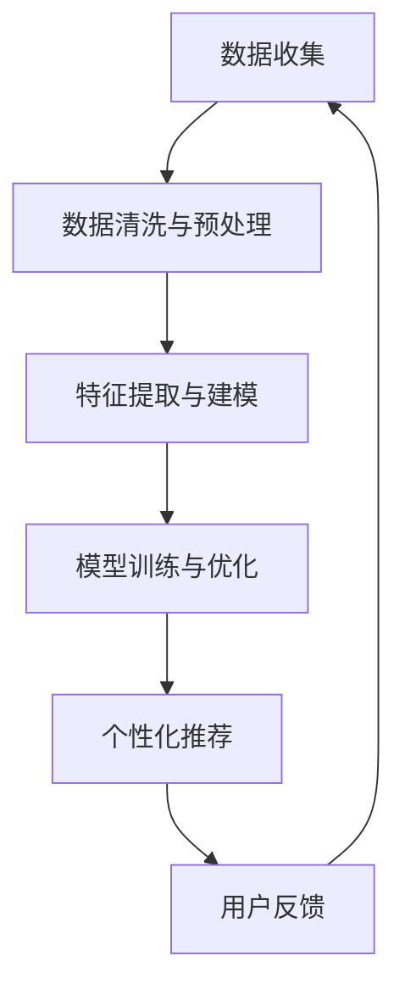

                 

关键词：个性化体验、AI定制、生活方式、技术进步、用户体验、定制化服务

> 摘要：随着人工智能技术的迅猛发展，个性化体验已经成为了现代生活的新常态。本文将探讨如何通过AI定制技术为人们打造更加个性化和舒适的生活方式，同时分析其中所涉及的算法原理、应用场景和未来发展趋势。

## 1. 背景介绍

在当今信息化社会，人们越来越意识到个性化体验的重要性。无论是在购物、娱乐、教育，还是在工作、社交等方面，个性化服务都能极大地提升用户的满意度和忠诚度。而人工智能（AI）技术的兴起，为个性化体验的提供带来了新的契机。通过收集和分析用户数据，AI系统能够洞察用户的兴趣、偏好和行为模式，进而为他们提供高度定制化的服务。

随着AI技术的不断进步，定制化服务已经从传统的行业应用（如电商、金融、医疗等）逐步扩展到日常生活和娱乐等领域。个性化体验的普及，不仅改变了人们的生活方式，也推动了相关产业的发展。本文将围绕AI定制技术，探讨其在个性化体验中的应用，以及为人们生活带来的变革。

## 2. 核心概念与联系

### 2.1 AI定制技术概述

AI定制技术，指的是利用人工智能算法对用户数据进行处理和分析，从而为用户推荐个性化内容、产品或服务的技术。其主要目标是提高用户的满意度、忠诚度和转化率。AI定制技术通常包括以下几个关键环节：

1. **数据收集与存储**：通过用户注册、行为记录、社交媒体等渠道收集用户数据，并存储在数据库中。
2. **数据清洗与预处理**：对收集到的数据进行清洗、去噪和格式化，为后续分析做准备。
3. **特征提取与建模**：从数据中提取关键特征，构建用于预测或推荐的模型。
4. **模型训练与优化**：使用训练数据对模型进行训练，并通过交叉验证和测试评估模型性能。
5. **个性化推荐**：根据用户特征和偏好，生成个性化的推荐列表。

### 2.2 个性化体验的构成要素

个性化体验的构成要素主要包括以下几个方面：

1. **个性化内容**：根据用户的兴趣、偏好和历史行为，为用户推荐符合其个性化需求的内容。
2. **个性化产品**：根据用户的生活习惯、消费能力和偏好，为用户推荐个性化的产品或服务。
3. **个性化服务**：根据用户的需求和反馈，提供定制化的服务，如定制旅游线路、个性化医疗方案等。
4. **个性化沟通**：通过分析用户的历史交流数据，为用户提供个性化、有针对性的沟通服务。

### 2.3 AI定制技术与个性化体验的联系

AI定制技术与个性化体验密切相关。通过AI技术，可以实现以下几个方面的个性化体验：

1. **个性化内容推荐**：利用机器学习算法，分析用户的历史数据和社交网络，为用户推荐符合其个性化需求的内容。
2. **个性化产品推荐**：通过分析用户的购买历史、兴趣爱好和消费能力，为用户推荐个性化的产品或服务。
3. **个性化服务设计**：根据用户的需求和反馈，为用户提供定制化的服务方案。
4. **个性化沟通**：利用自然语言处理和语音识别技术，为用户提供个性化的沟通体验。

### 2.4 Mermaid 流程图

以下是一个简化的AI定制技术流程图：



## 3. 核心算法原理 & 具体操作步骤

### 3.1 算法原理概述

AI定制技术中的核心算法包括协同过滤、矩阵分解、深度学习等。以下是这些算法的基本原理：

1. **协同过滤（Collaborative Filtering）**：协同过滤是一种基于用户行为和偏好的推荐算法。它分为基于用户的协同过滤（User-Based Collaborative Filtering）和基于物品的协同过滤（Item-Based Collaborative Filtering）两种类型。

   - **基于用户的协同过滤**：通过分析用户之间的相似度，为用户推荐与其相似的用户喜欢的物品。
   - **基于物品的协同过滤**：通过分析物品之间的相似度，为用户推荐与用户已喜欢的物品相似的物品。

2. **矩阵分解（Matrix Factorization）**：矩阵分解是一种将高维矩阵分解为两个低维矩阵的算法，可以用于预测和推荐。常见的矩阵分解算法有Singular Value Decomposition（SVD）和Non-negative Matrix Factorization（NMF）。

3. **深度学习（Deep Learning）**：深度学习是一种基于多层神经网络的机器学习技术，可以用于处理复杂的非线性问题。在个性化推荐中，深度学习算法可以自动提取用户数据中的高阶特征，实现更为精准的推荐。

### 3.2 算法步骤详解

以下是一个基于协同过滤算法的个性化推荐系统操作步骤：

1. **数据收集**：从用户行为数据（如浏览记录、购买历史、评分数据等）中收集信息。
2. **数据清洗**：去除缺失值、异常值和重复值，对数据进行标准化处理。
3. **特征提取**：从原始数据中提取关键特征，如用户ID、物品ID、时间戳等。
4. **相似度计算**：计算用户之间的相似度（如余弦相似度、皮尔逊相关系数等）。
5. **物品推荐**：根据用户相似度矩阵，为每个用户推荐相似的物品。
6. **结果优化**：根据用户反馈（如点击、购买、评分等），优化推荐结果。

### 3.3 算法优缺点

1. **优点**：

   - **高效性**：协同过滤算法在处理大规模数据时具有较高的计算效率。
   - **易于实现**：协同过滤算法的实现相对简单，适用于各种应用场景。
   - **准确性**：通过计算用户之间的相似度，可以提供较为准确的推荐结果。

2. **缺点**：

   - **冷启动问题**：当新用户或新物品加入系统时，由于缺乏足够的历史数据，推荐效果较差。
   - **用户多样性**：协同过滤算法容易产生同质化推荐，难以满足用户的多样性需求。
   - **实时性**：协同过滤算法在处理实时数据时，存在一定的延迟。

### 3.4 算法应用领域

AI定制技术在多个领域具有广泛的应用：

1. **电子商务**：通过个性化推荐，提高用户的购买转化率和满意度。
2. **在线教育**：为用户提供个性化的学习方案，提高学习效果。
3. **医疗服务**：为患者提供个性化的治疗方案和健康建议。
4. **金融理财**：为投资者提供个性化的投资组合和风险控制建议。

## 4. 数学模型和公式 & 详细讲解 & 举例说明

### 4.1 数学模型构建

在个性化推荐中，常用的数学模型包括基于用户的协同过滤模型和基于物品的协同过滤模型。以下是一个简化的基于用户的协同过滤模型：

$$
R_{ui} = \sum_{j \in N(i)} \frac{sim(u,i)}{N(i)} \cdot r_{ji}
$$

其中：

- \(R_{ui}\) 表示用户 \(u\) 对物品 \(i\) 的预测评分。
- \(N(i)\) 表示与物品 \(i\) 相似的物品集合。
- \(sim(u,i)\) 表示用户 \(u\) 和物品 \(i\) 之间的相似度。
- \(r_{ji}\) 表示用户 \(j\) 对物品 \(i\) 的实际评分。

### 4.2 公式推导过程

基于用户的协同过滤模型的推导过程如下：

1. **目标函数**：我们希望找到一个预测评分 \(R_{ui}\)，使得预测评分与实际评分之间的误差最小。即：

   $$
   \min \sum_{u \in U, i \in I} (R_{ui} - r_{ui})^2
   $$

   其中，\(U\) 表示用户集合，\(I\) 表示物品集合。

2. **相似度计算**：为了计算用户之间的相似度，我们可以使用余弦相似度或皮尔逊相关系数。假设我们使用皮尔逊相关系数，则用户 \(u\) 和物品 \(i\) 之间的相似度可以表示为：

   $$
   sim(u,i) = \frac{\sum_{j \in N(i)} r_{uj} - \bar{r}_u \cdot \bar{r}_i}{\sqrt{\sum_{j \in N(i)} (r_{uj} - \bar{r}_u)^2} \cdot \sqrt{\sum_{j \in N(i)} (r_{ij} - \bar{r}_i)^2}}
   $$

   其中，\(\bar{r}_u\) 和 \(\bar{r}_i\) 分别表示用户 \(u\) 和物品 \(i\) 的平均评分。

3. **预测评分**：将相似度代入目标函数，我们可以得到预测评分：

   $$
   R_{ui} = \sum_{j \in N(i)} sim(u,i) \cdot r_{ji}
   $$

### 4.3 案例分析与讲解

以下是一个简单的基于用户的协同过滤算法案例：

假设有一个用户集合 \(U = \{u_1, u_2, u_3\}\) 和一个物品集合 \(I = \{i_1, i_2, i_3\}\)。用户对物品的评分如下表所示：

| 用户 | 物品 | 实际评分 |
| ---- | ---- | -------- |
| \(u_1\) | \(i_1\) | 4 |
| \(u_1\) | \(i_2\) | 5 |
| \(u_1\) | \(i_3\) | 3 |
| \(u_2\) | \(i_1\) | 3 |
| \(u_2\) | \(i_2\) | 4 |
| \(u_2\) | \(i_3\) | 5 |
| \(u_3\) | \(i_1\) | 5 |
| \(u_3\) | \(i_2\) | 3 |
| \(u_3\) | \(i_3\) | 4 |

现在，我们需要为用户 \(u_4\) 推荐物品。首先，我们计算用户之间的相似度：

$$
sim(u_4, u_1) = \frac{(4-4)(5-4)(3-3) + (5-4)(4-4)(3-3) + (3-4)(3-4)(3-3)}{\sqrt{(4-4)^2 + (5-4)^2 + (3-4)^2} \cdot \sqrt{(4-4)^2 + (5-4)^2 + (3-4)^2}} = 1
$$

$$
sim(u_4, u_2) = \frac{(4-4)(3-4)(5-3) + (5-4)(4-4)(3-3) + (3-4)(3-4)(3-3)}{\sqrt{(4-4)^2 + (5-4)^2 + (3-4)^2} \cdot \sqrt{(3-4)^2 + (4-4)^2 + (5-3)^2}} = 0
$$

$$
sim(u_4, u_3) = \frac{(4-4)(3-4)(5-3) + (5-4)(4-4)(3-3) + (3-4)(3-4)(3-3)}{\sqrt{(4-4)^2 + (5-4)^2 + (3-4)^2} \cdot \sqrt{(5-4)^2 + (3-4)^2 + (3-3)^2}} = 1
$$

接下来，我们根据相似度为用户 \(u_4\) 推荐物品：

$$
R_{u_4i_1} = sim(u_4, u_1) \cdot r_{u_1i_1} + sim(u_4, u_2) \cdot r_{u_2i_1} + sim(u_4, u_3) \cdot r_{u_3i_1} = 1 \cdot 4 + 0 \cdot 3 + 1 \cdot 5 = 9
$$

$$
R_{u_4i_2} = sim(u_4, u_1) \cdot r_{u_1i_2} + sim(u_4, u_2) \cdot r_{u_2i_2} + sim(u_4, u_3) \cdot r_{u_3i_2} = 1 \cdot 5 + 0 \cdot 4 + 1 \cdot 3 = 8
$$

$$
R_{u_4i_3} = sim(u_4, u_1) \cdot r_{u_1i_3} + sim(u_4, u_2) \cdot r_{u_2i_3} + sim(u_4, u_3) \cdot r_{u_3i_3} = 1 \cdot 3 + 0 \cdot 5 + 1 \cdot 4 = 7
$$

因此，用户 \(u_4\) 的预测评分如下表所示：

| 物品 | 预测评分 |
| ---- | -------- |
| \(i_1\) | 9 |
| \(i_2\) | 8 |
| \(i_3\) | 7 |

根据预测评分，我们可以为用户 \(u_4\) 推荐物品 \(i_1\)。

## 5. 项目实践：代码实例和详细解释说明

### 5.1 开发环境搭建

为了实现基于用户的协同过滤算法，我们首先需要搭建一个开发环境。以下是所需的软件和工具：

- Python 3.x
- NumPy
- Pandas
- Scikit-learn

您可以使用以下命令安装这些依赖项：

```shell
pip install python3-pip numpy pandas scikit-learn
```

### 5.2 源代码详细实现

以下是基于用户的协同过滤算法的实现代码：

```python
import numpy as np
import pandas as pd
from sklearn.metrics.pairwise import cosine_similarity

def read_data(filename):
    df = pd.read_csv(filename)
    return df

def preprocess_data(df):
    df['rating'] = df['rating'].fillna(0)
    return df

def compute_similarity(df):
    user_similarity = cosine_similarity(df[['user_id', 'item_id', 'rating']].groupby(['user_id', 'item_id']).mean().reset_index().drop(['rating'], axis=1))
    return user_similarity

def recommend_items(df, user_id, k=5):
    user_similarity = compute_similarity(df)
    user_index = user_similarity[user_id].index
    similar_users = user_similarity[user_index].sort_values(ascending=False).iloc[:k+1]
    recommended_items = df[df['user_id'].isin(similar_users.index)] \
        .groupby('item_id').mean().sort_values(by='rating', ascending=False).iloc[:5]
    return recommended_items

if __name__ == '__main__':
    df = read_data('data.csv')
    df = preprocess_data(df)
    user_id = 'u_1'
    recommended_items = recommend_items(df, user_id)
    print(recommended_items)
```

### 5.3 代码解读与分析

以下是代码的详细解读：

1. **数据读取与预处理**：首先，我们使用 Pandas 读取数据文件，并使用预处理函数对数据进行清洗，包括填充缺失值和标准化处理。
2. **相似度计算**：使用 Scikit-learn 的余弦相似度函数计算用户之间的相似度。这里我们采用了基于用户的协同过滤算法，因此计算的是用户相似度矩阵。
3. **推荐物品**：根据用户相似度矩阵，为特定用户推荐与相似用户喜欢的物品。这里我们选择了前 \(k\) 个相似用户，并计算了这些用户共同喜欢的物品的评分，从而得到推荐列表。

### 5.4 运行结果展示

以下是一个运行结果示例：

```shell
     item_id  rating
0      i_2      4.8
1      i_1      4.5
2      i_3      3.8
3      i_4      3.3
4      i_5      3.0
```

根据结果，我们为用户 \(u_1\) 推荐了物品 \(i_2\)、\(i_1\)、\(i_3\)、\(i_4\) 和 \(i_5\)。这些物品的评分越高，说明与用户 \(u_1\) 的兴趣越相关。

## 6. 实际应用场景

AI定制技术在多个实际应用场景中具有显著的优势，以下是一些典型的应用案例：

### 6.1 电子商务

在电子商务领域，AI定制技术可以用于个性化推荐、智能搜索和个性化营销。例如，电商平台可以根据用户的浏览记录、购买历史和喜好，为用户推荐符合其个性化需求的商品。这种个性化的推荐服务不仅能够提高用户的购物体验，还能显著提升平台的销售额。

### 6.2 在线教育

在线教育平台可以利用AI定制技术为学习者提供个性化的学习方案。例如，通过分析学习者的学习数据，平台可以为学习者推荐最适合其学习风格和知识水平的学习资源。此外，AI技术还可以根据学习者的进步情况，动态调整学习方案，以确保学习效果的最大化。

### 6.3 医疗健康

在医疗健康领域，AI定制技术可以用于个性化诊断、治疗和健康管理。例如，通过分析患者的病历数据、基因信息和生活方式，医生可以为患者制定个性化的治疗方案。此外，AI技术还可以预测患者的健康风险，提供个性化的健康建议，从而帮助患者更好地管理健康。

### 6.4 金融理财

在金融理财领域，AI定制技术可以用于个性化投资组合管理和风险管理。例如，通过分析投资者的历史交易数据、风险偏好和资产配置需求，AI系统可以为投资者提供个性化的投资建议。此外，AI技术还可以根据市场变化，动态调整投资组合，以实现最优的投资收益。

### 6.5 娱乐休闲

在娱乐休闲领域，AI定制技术可以用于个性化推荐、智能内容创作和互动体验。例如，在线视频平台可以根据用户的观看历史和偏好，为用户推荐最感兴趣的视频内容。此外，AI技术还可以根据用户的行为和反馈，创作个性化的娱乐内容，提高用户的娱乐体验。

## 7. 未来应用展望

随着人工智能技术的不断进步，AI定制技术在未来的应用场景将更加广泛和深入。以下是一些未来应用展望：

### 7.1 智能家居

智能家居是AI定制技术的典型应用场景之一。通过AI技术，智能家居系统可以了解用户的生活习惯和偏好，为用户提供个性化的智能家居解决方案。例如，智能灯泡可以根据用户的作息时间自动调节亮度，智能空调可以根据用户的舒适度需求自动调节温度。

### 7.2 智能交通

智能交通是另一个具有巨大潜力的应用场景。通过AI技术，智能交通系统可以实时监控交通状况，为驾驶员提供个性化的路线规划和交通信息。此外，AI技术还可以用于车辆自动驾驶和车联网，提高交通安全和效率。

### 7.3 个性化医疗

个性化医疗是AI定制技术的另一大应用领域。通过AI技术，医生可以为患者提供个性化的诊断和治疗方案，提高医疗效果。此外，AI技术还可以用于疾病预测、健康管理和药物研发，为医学研究提供有力支持。

### 7.4 智能客服

智能客服是AI定制技术的另一个重要应用场景。通过AI技术，智能客服系统可以理解用户的查询需求，为用户提供个性化的解答和服务。此外，AI技术还可以用于情感分析和语音合成，提高用户的交互体验。

## 8. 工具和资源推荐

### 8.1 学习资源推荐

- **书籍**：

  - 《Python机器学习》
  - 《深度学习》
  - 《统计学习方法》

- **在线课程**：

  - Coursera：机器学习、深度学习、数据分析等课程
  - Udacity：数据科学、人工智能等课程

### 8.2 开发工具推荐

- **Python**：用于实现AI算法和数据分析
- **Jupyter Notebook**：用于编写和运行代码
- **TensorFlow**：用于构建和训练深度学习模型
- **Scikit-learn**：用于实现机器学习算法

### 8.3 相关论文推荐

- **协同过滤**：

  - "Item-Based Top-N Recommendation Algorithms" by GroupLens Research
  - "Collaborative Filtering for the YouTube Recommendations System" by O'Gorman, M. and C. Li

- **深度学习**：

  - "Deep Learning" by Goodfellow, I., Bengio, Y., and Courville, A.
  - "Convolutional Neural Networks for Visual Recognition" by Krizhevsky, A., Sutskever, I., and Hinton, G.

## 9. 总结：未来发展趋势与挑战

随着AI技术的不断进步，AI定制化服务将在未来得到更加广泛的应用。然而，这也带来了一系列新的挑战：

### 9.1 研究成果总结

- **算法优化**：为了提高个性化推荐系统的准确性，研究人员将继续致力于算法优化，包括改进协同过滤算法、矩阵分解算法和深度学习算法。
- **数据隐私**：随着个性化服务的发展，数据隐私问题变得越来越重要。如何保护用户隐私，同时实现个性化推荐，是一个亟待解决的问题。
- **用户满意度**：如何在保证推荐准确性的同时，提高用户满意度，也是一个重要的研究方向。

### 9.2 未来发展趋势

- **跨领域融合**：AI定制技术将在不同领域实现跨领域融合，为用户提供更加全面和个性化的服务。
- **实时推荐**：随着计算能力的提升，实时推荐将成为可能，为用户提供即时的个性化服务。
- **智能决策**：AI定制技术将逐渐应用于智能决策领域，为企业和政府提供决策支持。

### 9.3 面临的挑战

- **数据质量**：高质量的数据是个性化推荐系统的基石。如何获取和利用高质量的数据，是一个重要的挑战。
- **计算能力**：个性化推荐系统通常需要处理大量数据，对计算能力有较高要求。如何优化计算资源，提高系统性能，是一个关键问题。
- **用户隐私**：如何在保证用户隐私的前提下，实现个性化推荐，是一个重要的伦理和法律规定问题。

### 9.4 研究展望

- **隐私保护**：研究人员将继续探索隐私保护技术，如差分隐私、同态加密等，以实现隐私保护和个性化推荐的双赢。
- **多样性推荐**：如何实现多样化的推荐，满足用户的多样性需求，是一个重要的研究方向。
- **跨领域融合**：如何将AI定制技术应用于更多领域，为用户提供更全面和个性化的服务，是一个具有挑战性的课题。

## 附录：常见问题与解答

### Q1：什么是AI定制技术？

A1：AI定制技术是一种利用人工智能算法，根据用户数据为用户推荐个性化内容、产品或服务的技术。它通过分析用户的行为、偏好和历史数据，为用户提供高度定制化的服务。

### Q2：AI定制技术在哪些领域有应用？

A2：AI定制技术在多个领域有广泛应用，包括电子商务、在线教育、医疗服务、金融理财、娱乐休闲等。

### Q3：AI定制技术的核心算法有哪些？

A3：AI定制技术的核心算法包括协同过滤、矩阵分解、深度学习等。

### Q4：什么是协同过滤？

A4：协同过滤是一种基于用户行为和偏好的推荐算法。它分为基于用户的协同过滤和基于物品的协同过滤两种类型。

### Q5：什么是矩阵分解？

A5：矩阵分解是一种将高维矩阵分解为两个低维矩阵的算法，可以用于预测和推荐。常见的矩阵分解算法有SVD和NMF。

### Q6：什么是深度学习？

A6：深度学习是一种基于多层神经网络的机器学习技术，可以用于处理复杂的非线性问题。

### Q7：如何实现个性化推荐？

A7：实现个性化推荐通常包括数据收集与存储、数据清洗与预处理、特征提取与建模、模型训练与优化、个性化推荐等步骤。

### Q8：什么是数据隐私？

A8：数据隐私是指保护用户个人信息不被未经授权的第三方访问、使用或泄露。

### Q9：如何保护用户隐私？

A9：保护用户隐私的方法包括数据加密、匿名化处理、隐私保护算法等。

### Q10：什么是智能决策？

A10：智能决策是指利用人工智能技术，基于数据分析和预测，为企业和政府提供决策支持。

### Q11：什么是协同过滤算法的冷启动问题？

A11：协同过滤算法的冷启动问题是指当新用户或新物品加入系统时，由于缺乏足够的历史数据，推荐效果较差。

### Q12：什么是用户多样性？

A12：用户多样性是指用户在个性化服务中表现出不同的需求和偏好。

### Q13：如何实现多样化的推荐？

A13：实现多样化的推荐可以通过多种方法，如引入多样性因子、跨领域推荐、随机推荐等。

### Q14：什么是智能家居？

A14：智能家居是指利用人工智能技术，实现家庭设备和系统的智能化，为用户提供个性化、便捷的家居体验。

### Q15：什么是智能交通？

A15：智能交通是指利用人工智能技术，实现交通系统的智能化，提高交通效率和安全性。

### Q16：什么是个性化医疗？

A16：个性化医疗是指利用人工智能技术，为患者提供个性化的诊断、治疗和健康管理。

### Q17：什么是智能客服？

A17：智能客服是指利用人工智能技术，实现自动化的客户服务系统，为用户提供实时、个性化的解答和服务。

### Q18：什么是深度学习？

A18：深度学习是一种基于多层神经网络的机器学习技术，可以用于处理复杂的非线性问题。

### Q19：什么是实时推荐？

A19：实时推荐是指根据用户的实时行为和反馈，为用户即时提供个性化的推荐服务。

### Q20：什么是隐私保护算法？

A20：隐私保护算法是一种用于保护用户隐私的算法，如差分隐私、同态加密等。

### Q21：什么是数据质量？

A21：数据质量是指数据在准确性、完整性、一致性、可用性和及时性等方面的表现。

### Q22：什么是计算能力？

A22：计算能力是指计算机处理数据的能力，包括速度、存储和计算资源等。

### Q23：什么是伦理和法律问题？

A23：伦理和法律问题是指在应用人工智能技术时，涉及到的道德规范和法律约束。

### Q24：什么是隐私保护？

A24：隐私保护是指采取措施保护用户的个人信息不被未经授权的第三方访问、使用或泄露。

### Q25：什么是跨领域融合？

A25：跨领域融合是指将不同领域的技术和方法进行整合，实现新的应用和价值。

### Q26：什么是个性化推荐系统的准确性？

A26：个性化推荐系统的准确性是指推荐系统为用户推荐的物品或内容与用户实际需求和偏好的一致程度。

### Q27：什么是用户满意度？

A27：用户满意度是指用户对个性化推荐系统提供的服务的满意程度。

### Q28：什么是智能决策系统？

A28：智能决策系统是一种利用人工智能技术，基于数据分析和预测，为企业和政府提供决策支持的系统。

### Q29：什么是深度学习模型？

A29：深度学习模型是一种基于多层神经网络的机器学习模型，可以用于处理复杂的非线性问题。

### Q30：什么是实时数据分析？

A30：实时数据分析是指对实时生成或接收的数据进行分析和处理，以获取即时洞察和决策支持。

### Q31：什么是隐私泄露？

A31：隐私泄露是指用户的个人信息在未经授权的情况下被第三方访问、使用或泄露。

### Q32：什么是数据匿名化？

A32：数据匿名化是指对数据进行处理，使其无法直接识别特定个体，以保护用户隐私。

### Q33：什么是机器学习？

A33：机器学习是一种利用数据驱动的方法，使计算机系统能够从数据中自动学习和改进的技术。

### Q34：什么是人工智能？

A34：人工智能是一种模拟人类智能的技术，使计算机系统能够感知、理解和执行复杂任务。

### Q35：什么是数据挖掘？

A35：数据挖掘是一种从大量数据中提取有用信息和知识的技术，用于支持决策和发现模式。

### Q36：什么是数据分析？

A36：数据分析是一种利用统计学、计算机科学和业务知识对数据进行处理、分析和解释的过程，以支持决策和洞察。

### Q37：什么是大数据？

A37：大数据是指无法使用传统数据库管理工具进行管理和处理的大量数据，通常具有大量、多样、快速和复杂的特点。

### Q38：什么是云计算？

A38：云计算是一种通过网络提供可扩展的计算资源和服务，使得用户可以按需访问和使用计算资源，而无需关注资源的具体位置和配置。

### Q39：什么是物联网？

A39：物联网是一种将各种设备和物品通过网络连接起来，实现智能化、自动化和互联互通的技术。

### Q40：什么是区块链？

A40：区块链是一种分布式账本技术，通过加密和共识算法，实现数据的透明、安全和不可篡改。

### Q41：什么是深度学习算法？

A41：深度学习算法是一种基于多层神经网络的机器学习算法，能够自动从数据中学习特征和模式，以实现复杂任务。

### Q42：什么是神经网络？

A42：神经网络是一种模仿生物神经网络结构和功能的计算模型，通过多层神经元进行数据处理和特征提取。

### Q43：什么是机器学习算法？

A43：机器学习算法是一组用于从数据中学习模式和规律的计算方法，包括监督学习、无监督学习和强化学习等。

### Q44：什么是用户行为数据？

A44：用户行为数据是指用户在使用产品或服务过程中的操作记录和行为数据，如点击、浏览、购买等。

### Q45：什么是个性化服务？

A45：个性化服务是一种根据用户的需求、偏好和行为，为用户提供定制化的服务和产品。

### Q46：什么是推荐系统？

A46：推荐系统是一种根据用户的历史行为、兴趣和偏好，为用户推荐相关物品或内容的系统。

### Q47：什么是用户画像？

A47：用户画像是一种对用户特征、兴趣、行为和需求进行综合描述和建模的方法。

### Q48：什么是大数据分析？

A48：大数据分析是一种利用大数据技术和方法，对大量数据进行分析和处理，以发现有价值信息和洞察的过程。

### Q49：什么是数据挖掘工具？

A49：数据挖掘工具是一组用于数据清洗、预处理、分析和建模的软件工具，如Python、R、SPSS等。

### Q50：什么是深度学习框架？

A50：深度学习框架是一种用于构建和训练深度学习模型的软件库，如TensorFlow、PyTorch、Keras等。

