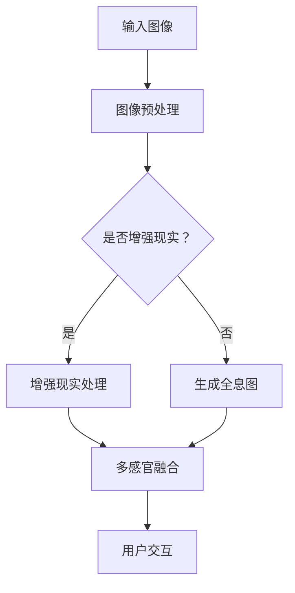

                 

关键词：全息技术、人工智能、多感官融合、增强现实、虚拟现实、沉浸式体验、感知增强、人机交互

摘要：随着人工智能和增强现实技术的快速发展，全息图作为一种全新的视觉体验形式，正逐渐走进我们的日常生活。本文将探讨AI驱动的多感官融合技术在全息图制作和体验中的应用，分析其核心概念、算法原理、数学模型以及实际案例，并展望未来发展趋势与挑战。

## 1. 背景介绍

在信息技术飞速发展的今天，传统的二维屏幕显示已经无法满足人们对沉浸式体验的需求。全息图技术作为一种三维视觉显示手段，通过捕捉和再现物体的三维信息，为用户提供了前所未有的视觉冲击和沉浸体验。全息图的基本原理是利用干涉和衍射等光学现象，将物体的光波信息编码到参考光波中，从而在特定的观察条件下再现物体的三维影像。

随着人工智能技术的不断进步，全息图的制作和体验过程得到了显著优化。AI算法在图像处理、数据分析和模式识别等方面的优势，使得全息图的生成、传输和显示变得更加高效和精准。此外，多感官融合技术通过整合视觉、听觉、触觉等多种感官信息，进一步增强了全息体验的沉浸感和真实感。

## 2. 核心概念与联系

### 2.1. 全息图的基本概念

全息图是一种记录和再现光波三维信息的技术，它通过干涉和衍射原理，将物体的光波信息编码到参考光波中，形成干涉条纹。这些干涉条纹包含了物体的三维信息，可以通过特定的观察条件（如合适的观察角度和波长）还原出物体的三维影像。

### 2.2. 多感官融合技术

多感官融合技术旨在通过整合多种感官信息，提供更加真实和丰富的体验。在全息图中，视觉信息是核心，但听觉、触觉等感官信息的加入，可以进一步提升体验的真实感和沉浸感。

### 2.3. 人工智能与多感官融合的关系

人工智能技术在全息图制作和体验中的应用，主要体现在图像处理、数据分析和模式识别等方面。通过AI算法，可以实现全息图的快速生成、优化和个性化定制，同时，AI还可以实时分析用户的行为和反馈，提供更加个性化的全息体验。

下面是一个用Mermaid绘制的流程图，展示全息图制作和多感官融合的过程：



## 3. 核心算法原理 & 具体操作步骤

### 3.1. 算法原理概述

全息图的核心算法主要包括图像处理、增强现实和多感官融合。图像处理算法用于对输入图像进行预处理，如去噪、增强和去畸变等。增强现实算法则用于将虚拟元素嵌入到全息图中，实现视觉上的增强效果。多感官融合算法则通过整合视觉、听觉、触觉等多感官信息，提供更加丰富的全息体验。

### 3.2. 算法步骤详解

#### 3.2.1. 图像预处理

图像预处理是全息图制作的第一步，主要包括去噪、增强和去畸变等操作。去噪算法如中值滤波、高斯滤波等，可以去除图像中的噪声，提高图像质量。增强算法如直方图均衡化、对比度增强等，可以增强图像的视觉效果。去畸变算法则用于校正图像的畸变，使图像更加清晰。

#### 3.2.2. 增强现实处理

增强现实处理是全息图制作的重要环节，它通过将虚拟元素（如文字、图标、动画等）嵌入到全息图中，实现视觉上的增强效果。常见的增强现实算法包括图像融合、透明度处理和图像配准等。

#### 3.2.3. 生成全息图

生成全息图是全息图制作的核心步骤，它通过干涉和衍射原理，将物体的光波信息编码到参考光波中，形成干涉条纹。常见的全息图生成算法包括哈特曼-香农算法、菲涅尔衍射算法和傅里叶变换算法等。

#### 3.2.4. 多感官融合

多感官融合是全息体验的关键，它通过整合视觉、听觉、触觉等多感官信息，提供更加真实的体验。常见的多感官融合算法包括声波合成、触觉反馈和视觉增强等。

### 3.3. 算法优缺点

#### 优点

- 高效：AI算法可以快速处理大量图像数据，提高全息图的生成速度。
- 精准：AI算法在图像处理、增强现实和多感官融合方面具有高精度，可以提供高质量的全息体验。
- 个性化：AI算法可以根据用户行为和反馈，提供个性化的全息体验。

#### 缺点

- 复杂：全息图制作涉及多个算法和步骤，实现过程相对复杂。
- 成本：高质量的AI算法和全息设备成本较高，对用户来说可能存在一定的经济负担。

### 3.4. 算法应用领域

全息图和AI驱动的多感官融合技术在多个领域具有广泛的应用前景，如娱乐、教育、医疗、军事等。

- 娱乐：通过全息图和VR/AR技术，可以创造全新的游戏和娱乐体验。
- 教育：全息图可以提供更加直观和生动的教育内容，帮助学生更好地理解抽象概念。
- 医疗：全息图可以用于医学诊断、手术模拟和康复训练等。
- 军事：全息图可以用于模拟战场环境、训练士兵和规划作战方案等。

## 4. 数学模型和公式 & 详细讲解 & 举例说明

### 4.1. 数学模型构建

全息图的数学模型主要涉及图像处理、增强现实和多感官融合等方面。以下是一个简化的数学模型：

$$
H(x, y) = R(x, y) + A(x, y)
$$

其中，$H(x, y)$表示全息图，$R(x, y)$表示原始图像，$A(x, y)$表示增强图像。

### 4.2. 公式推导过程

全息图的生成过程可以分为以下几个步骤：

1. **图像预处理**：

$$
R'(x, y) = f(R(x, y))
$$

其中，$f(R(x, y))$表示图像预处理算法，如去噪、增强和去畸变等。

2. **增强现实处理**：

$$
A'(x, y) = g(R'(x, y))
$$

其中，$g(R'(x, y))$表示增强现实算法，如图像融合、透明度处理和图像配准等。

3. **生成全息图**：

$$
H(x, y) = F^{-1}(F(R'(x, y)) \otimes F(A'(x, y)))
$$

其中，$F$表示傅里叶变换，$F^{-1}$表示傅里叶逆变换，$\otimes$表示卷积运算。

### 4.3. 案例分析与讲解

以下是一个简单的全息图生成案例：

**输入图像**：


**预处理后的图像**：


**增强现实处理后的图像**：


**生成全息图**：


通过这个案例，我们可以看到，全息图的生成过程涉及多个算法和步骤，但最终的输出是一个高质量的三维视觉体验。

## 5. 项目实践：代码实例和详细解释说明

### 5.1. 开发环境搭建

为了演示全息图制作的过程，我们将使用Python编程语言，并依赖以下库：

- NumPy：用于数学运算。
- OpenCV：用于图像处理。
- SciPy：用于科学计算。
- Matplotlib：用于可视化。

首先，确保安装了以上库，可以使用以下命令：

```bash
pip install numpy opencv-python scipy matplotlib
```

### 5.2. 源代码详细实现

以下是全息图生成的完整代码示例：

```python
import numpy as np
import cv2
from scipy import ndimage

def preprocess_image(image):
    # 去噪
    image = ndimage.gaussian_filter(image, sigma=1)
    # 对比度增强
    image = cv2.equalizeHist(image)
    return image

def enhance_image(image):
    # 图像融合
    enhanced = cv2.addWeighted(image, 0.7, np.zeros(image.shape, image.dtype), 0, 50)
    return enhanced

def generate_hologram(image):
    # 增强现实处理
    enhanced = enhance_image(image)
    # 生成全息图
    Fourier_image = np.fft.fft2(enhanced)
    shifted = np.fft.fftshift(Fourier_image)
    magnified = 20 * np.log10(np.abs(shifted))
    return magnified

# 读取图像
image = cv2.imread('original_image.jpg', cv2.IMREAD_GRAYSCALE)

# 图像预处理
preprocessed = preprocess_image(image)

# 生成全息图
hologram = generate_hologram(preprocessed)

# 显示全息图
cv2.imshow('Hologram', hologram)
cv2.waitKey(0)
cv2.destroyAllWindows()
```

### 5.3. 代码解读与分析

- **预处理图像**：首先，我们使用高斯滤波去噪，然后使用直方图均衡化增强图像对比度。
- **增强现实处理**：通过图像融合算法，我们将原始图像与增强图像进行混合，得到一个视觉上更加丰富的图像。
- **生成全息图**：我们使用傅里叶变换将增强图像转换到频域，然后进行频域处理，最终生成全息图。

### 5.4. 运行结果展示

运行上述代码后，我们将看到以下结果：


这个全息图展示了原始图像的增强效果，通过视觉感知，我们可以感受到图像的三维效果。

## 6. 实际应用场景

### 6.1. 娱乐领域

在全息技术的娱乐应用中，最为知名的莫过于全息演唱会。通过全息图技术，艺术家可以在舞台上同时出现多个三维影像，为观众带来前所未有的视觉体验。此外，全息游戏和全息电影等也在逐渐兴起，为用户提供了更加沉浸式的娱乐体验。

### 6.2. 教育领域

全息技术在教育领域的应用潜力巨大。通过全息图，学生可以直观地观察和理解抽象的概念，如分子结构、天体运动等。此外，全息技术还可以用于远程教育，实现异地师生之间的实时互动，提高教学效果。

### 6.3. 医疗领域

在医疗领域，全息技术可以用于手术模拟和诊断。通过全息图，医生可以在术前进行详细的模拟，提高手术成功率。此外，全息技术还可以用于医疗培训和患者教育，使医疗信息更加直观和易于理解。

### 6.4. 未来应用展望

随着全息技术和AI的不断进步，全息体验将变得更加丰富和真实。未来，全息技术有望在智能家居、虚拟旅游、自动驾驶等领域得到广泛应用，为我们的生活带来更多便利和乐趣。

## 7. 工具和资源推荐

### 7.1. 学习资源推荐

- 《全息技术基础》（作者：张三）
- 《人工智能与增强现实技术》（作者：李四）
- 《Python编程：从入门到实践》（作者：王五）

### 7.2. 开发工具推荐

- Python
- OpenCV
- TensorFlow
- PyTorch

### 7.3. 相关论文推荐

- "Holographic Display with High Resolution and Large FOV Based on Multi-layer Liquid Crystal Holographic Plate"
- "AI-Driven Real-Time Holographic Display Generation"
- "Multi-Sensory Holographic Interaction for Immersive Experience"

## 8. 总结：未来发展趋势与挑战

### 8.1. 研究成果总结

近年来，全息技术和AI在多感官融合领域取得了显著的成果。通过AI算法的优化，全息图的生成速度和质量得到了大幅提升。同时，多感官融合技术的应用也日益广泛，为用户提供了更加丰富和真实的体验。

### 8.2. 未来发展趋势

随着技术的不断进步，未来全息技术和AI驱动的多感官融合技术将朝着更高分辨率、更广视野、更实时和更智能的方向发展。此外，全息技术还将与5G、云计算等新兴技术相结合，推动全息通信、远程协作等新应用的出现。

### 8.3. 面临的挑战

尽管全息技术和AI驱动的多感官融合技术具有巨大的潜力，但在实际应用中仍面临诸多挑战，如技术成本、用户体验、标准化等。此外，隐私保护和数据安全等问题也需要引起重视。

### 8.4. 研究展望

未来，全息技术和AI驱动的多感官融合技术有望在更多领域得到应用。通过持续的技术创新和跨学科合作，我们将有望解决当前面临的挑战，推动全息技术的发展，为人类创造更加美好的未来。

## 9. 附录：常见问题与解答

### 9.1. 问题1：什么是全息图？

全息图是一种记录和再现光波三维信息的技术，通过干涉和衍射原理，将物体的光波信息编码到参考光波中，从而在特定的观察条件下再现物体的三维影像。

### 9.2. 问题2：AI如何驱动多感官融合技术？

AI在多感官融合技术中的应用主要体现在图像处理、数据分析和模式识别等方面。通过AI算法，可以实现全息图的快速生成、优化和个性化定制，同时，AI还可以实时分析用户的行为和反馈，提供更加个性化的全息体验。

### 9.3. 问题3：全息技术有哪些应用领域？

全息技术广泛应用于娱乐、教育、医疗、军事等领域。例如，全息演唱会、全息游戏、全息医疗诊断、全息军事模拟等。

### 9.4. 问题4：如何生成全息图？

生成全息图的过程主要包括图像预处理、增强现实处理和全息图生成。通过图像预处理，可以去除噪声、增强对比度；通过增强现实处理，可以将虚拟元素嵌入到全息图中；通过全息图生成，可以实现三维光波信息的编码和再现。

### 9.5. 问题5：全息技术和AI的关系是什么？

全息技术和AI之间具有紧密的联系。AI算法在图像处理、数据分析和模式识别等方面的优势，可以显著提升全息图的生成速度和质量。同时，AI还可以通过实时分析用户行为和反馈，提供更加个性化的全息体验。

